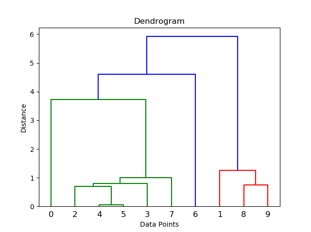

# :fontawesome-solid-share-alt: Clustering algorithms reference


<div markdown="1" class="typewriter">
.ml.clust   **Clustering**

**Algorithms**
    
\  Affinity Propagation (AP):
    [ap.fit](#mlclustapfit)                   Fit AP algorithm
    [ap.predict](#mlclustappredict)               Make predictions using a fitted AP model
    
\  Clustering Using REpresentatives (CURE):
    [cure.fit](#mlclustcurefit)                 Fit CURE algorithm
    [cure.predict](#mlclustcurepredict)             Make predictions using a fitted CURE model
    
\  Density-Based Spatial Clustering of Applications with Noise (DBSCAN):
    [dbscan.fit](#mlclustdbscanfit)               Fit DBSCAN algorithm
    [dbscan.predict](#mlclustdbscanpredict)           Make predictions using a fitted DBSCAN model
    [dbscan.update](#mlclustdbscanupdate)            Update DBSCAN model
    
\  Hierarchical Clustering (HC):
    [hc.fit](#mlclusthcfit)                   Fit HC algorithm
    [hc.predict](#mlclusthcpredict)               Make predictions using a fitted HC model
    
\  K-Means:
    [kmeans.fit](#mlclustkmeansfit)               Fit K-Means algorithm
    [kmeans.predict](#mlclustkmeanspredict)           Make predictions using a fitted K-Means model
    [kmeans.update](#mlclustkmeansupdate)            Update K-Means model

**Dendrogram cutting functionality**

\  Clustering Using REpresentatives (CURE):
    [cure.cutk](#mlclustcurecutk)                Cut dendrogram to k clusters
    [cure.cutdist](#mlclustcurecutdist)             Cut dendrogram to clusters based on distance threshold
    
\  Hierarchical Clustering (HC):
    [hc.cutk](#mlclusthccutk)                  Cut dendrogram to k clusters
    [hc.cutdist](#mlclusthccutdist)               Cut dendrogram to clusters based on distance threshold
    
</div>

:fontawesome-brands-github:
[KxSystems/ml/clust](https://github.com/KxSystems/ml/tree/master/clust)

The clustering library provides q implementations of a number of common clustering algorithms, with fit and predict functions provided for each. Update functions are also available for K-Means and DBSCAN.

In addition to the fit/predict functionality provided for all methods, for hierarchical clustering methods (including CURE) which produce dendrograms, functions to _cut_ the dendrogram at a given count or distance are also provided allowing a user to produce appropriate clusters.

## Affinity Propagation

Affinity Propagation groups data based on the similarity between points and subsequently finds _exemplars_, which best represent the points in each cluster. The algorithm does not require the number of clusters be provided at run time, but determines the optimum solution by exchanging real-valued messages between points until a high-valued set of exemplars is produced.

The algorithm uses a user-specified damping coefficient to reduce the availability and responsibility of messages passed between points, while a preference value is used to set the diagonal values of the similarity matrix. A more detailed explanation of the algorithm can be found [here](https://towardsdatascience.com/unsupervised-machine-learning-affinity-propagation-algorithm-explained-d1fef85f22c8).


### `.ml.clust.ap.fit`

_Fit AP algorithm_

```txt
.ml.clust.ap.fit[data;df;dmp;diag;iter]
```

Where

-   `data` represents the points being analyzed in matrix format, where each column is an individual datapoint
-   `df` is the distance function as a symbol: `nege2dist` is recommended for this algorithm. (see [Distance Metrics](#distance-metrics))
-   `dmp` is the damping coefficient to be applied to the availability and responsibility matrices
-   `diag` is the preference function for the diagonal of the similarity matrix (e.g.  `min` `med` `max` etc.)
-   `iter` is a dictionary containing the max allowed iterations and the max iterations without a change in clusters, with default values ``` `total`nochange!200 50```. To use the defaults, pass in `(::)`.

returns a dictionary with data, input variables and the cluster each data point belongs to.

```q
q)show d:2 10#20?10.
7.833686 4.099561 6.108817 4.976492  4.087545 4.49731  0.1392076 7.148779 1.9..
6.203014 9.326316 2.747066 0.5752516 2.560658 2.310108 0.8724017 1.024432 8.6..

// fit to AP algorithm
q)show APfit:.ml.clust.ap.fit[d;`nege2dist;.3;med;(::)]
data  | (7.833686 4.099561 6.108817 4.976492 4.087545 4.49731 0.1392076 7.148..
inputs| `df`dmp`diag`iter!(`nege2dist;0.3;k){avg x(<x)@_.5*-1 0+#x,:()};`total`nochange!200 50)
clt   | 0 1 0 0 0 0 2 0 1 1

// group indices into their calculated clusters
q)group APfit`clt
0| 0 2 3 4 5 7
1| 1 8 9
2| ,6
```


### `.ml.clust.ap.predict`

_Make predictions using a fitted AP model_

```txt
.ml.clust.ap.predict[data;cfg]
```

Where

-   `data` represents the points being analyzed in matrix format, where each column is an individual data point
-   `cfg` represents a dictionary with data, input variables and the cluster each data point belongs to, returned from `.ml.clust.ap.fit`

returns predicted clusters of new data.

```q
// training data
q)show trn:2 10#20?10.
1.627662 6.884756 8.177547 7.520102 1.086824 9.598964 0.3668341 6.430982 6.70..
4.12317  9.877844 3.867353 7.26781  4.046546 8.355065 6.42737   5.830262 1.42..

// fit AP algorithm
q)show APfit:.ml.clust.ap.fit[trn;`nege2dist;.3;med;(::)]
data  | (1.627662 6.884756 8.177547 7.520102 1.086824 9.598964 0.3668341 6.43..
inputs| `df`dmp`diag`iter!(`nege2dist;0.3;k){avg x(<x)@_.5*-1 0+#x,:()};`total`nochange!200 50)
clt   | 0 1 2 1 0 1 0 1 2 1

// testing data
q)show tst:2 5#10?10.
9.030751 7.750292 3.869818  6.324114 4.328535
2.430836 3.917953 0.2451336 1.691043 3.941082

// predicted clusters
q).ml.clust.ap.predict[tst;APfit]
2 2 2 2 0
```


## Clustering Using Representatives

Clustering Using REpresentatives (CURE) is a technique used to deal with datasets containing outliers and clusters of varying sizes and shapes. Each cluster is represented by a specified number of representative points. These points are chosen by taking the most scattered points in each cluster and shrinking them towards the cluster center using a compression ratio. An in-depth explanation of the CURE algorithm can be found [here](http://infolab.stanford.edu/~ullman/mmds/ch7a.pdf) on page 242.


### `.ml.clust.cure.fit`

_Fit CURE algorithm_

```txt
.ml.clust.cure.fit[data;df;n;c]
```

Where

-   `data` represents the points being analyzed in matrix format, where each column is an individual data point
-   `df`  is the distance function as a symbol: ``` `e2dist`edist`mdist ``` – see [Distance Metrics](#distance-metrics)
-   `n` is the number of representative points
-   `c` is the compression ratio

returns a dictionary with data, input variables and a dendrogram table. The dendrogram table describes the order in which clusters are joined, and the distance between the clusters as they are joined.

```q
q)show d:2 10#20?20.
7.83086  1.624709 18.73501 5.564243 4.784682 3.016266 3.134634  19.57    14.0..
15.66737 8.199122 12.21763 9.952983 8.175089 8.994621 0.2784152 14.29756 3.89..

// fit to CURE algorithm
q)show CUREfit:.ml.clust.cure.fit[d;`e2dist;2;0]
data  | (7.83086 1.624709 18.73501 5.564243 4.784682 3.016266 3.134634 19.57 ..
inputs| `df`n`c!(`e2dist;2;0)
dgram | +`i1`i2`dist`n!(1 3 10 2 8 0 15 13 16i;5 4 11 7 9 12 6 14 17i;2.56924..

// dendrogram with Euclidean-squared distances
q)CUREfit`dgram
i1 i2 dist     n
-----------------
1  5  2.569249 2
3  4  3.768622 2
10 11 3.798927 4
2  7  5.0233   2
8  9  27.3399  2
0  12 37.79179 5
15 6  65.01747 6
13 14 90.90666 4
16 17 139.6838 10

q)show CUREfit:.ml.clust.cure.fit[d;`mdist;5;0.5]
data  | (7.83086 1.624709 18.73501 5.564243 4.784682 3.016266 3.134634 19.57 ..
inputs| `df`n`c!(`mdist;5;0.5)
dgram | +`i1`i2`dist`n!(1 3 10 2 8 12 0 13 16i;5 4 11 7 9 6 15 14 17i;2.18705..

// dendrogram with Manhattan distances
q)CUREfit`dgram
i1 i2 dist     n
-----------------
1  5  2.187055 2
3  4  2.557455 2
10 11 2.487379 4
2  7  2.914918 2
8  9  6.877926 2
12 6  8.684915 5
0  15 10.36714 6
13 14 11.6651  4
16 17 13.5457  10
```


### `.ml.clust.cure.cutdist`

_Cut a dendrogram into clusters based on a threshold distance_

```txt
.ml.clust.cure.cutdist[cfg;dist]
```

Where

-   `cfg` is the output dictionary containing a dendrogram table produced by the CURE fit function
-   `dist` is the threshold distance applied when cutting the dendrogram into clusters

returns an updated `cfg` containing a new key ``` `clt ``` indicating the cluster to which each data point belongs.

```q
q)show d:2 10#20?10.
9.030751 7.750292 3.869818 6.324114 4.328535 2.430836  3.917953 0.2451336 1.6..
7.263142 9.216436 1.809536 6.434637 2.907093 0.7347808 3.159526 3.410485  8.6..

// fit CURE algorithm
q)show cfg:.ml.clust.cure.fit[d;`mdist;2;.5]
data  | (9.030751 7.750292 3.869818 6.324114 4.328535 2.430836 3.917953 0.245..
inputs| `df`n`c!(`mdist;2;0.5)
dgram | +`i1`i2`dist`n!(4 2 11 12 0 14 13 16 15i;6 10 5 9 1 3 7 8 17i;0.66301..

// cut dendrogram using a distance threshold of 5.2
q)show r:.ml.clust.hc.cutdist[cfg;5.2]
data  | (9.030751 7.750292 3.869818 6.324114 4.328535 2.430836 3.917953 0.245..
inputs| `df`n`c!(`mdist;2;0.5)
dgram | +`i1`i2`dist`n!(4 2 11 12 0 14 13 16 15i;6 10 5 9 1 3 7 8 17i;0.66301..
clt   | 1 1 0 1 0 0 0 0 2 0

q)group r`clt
1| 0 1 3
0| 2 4 5 6 7 9
2| ,8
```


### `.ml.clust.cure.cutk`

_Cut a dendrogram into k clusters_

```txt
.ml.clust.hc.cutk[cfg;k]
```

Where

-   `cfg` is the output dictionary containing a dendrogram table produced by the CURE fit function
-   `k` is the number of clusters to be produced from cutting the dendrogram

returns an updated `cfg` containing a new key ``` `clt ``` indicating the cluster to which each data point belongs.

```q
q)show d:2 10#20?10.
0.6165008 2.85799  6.684724 9.133033  1.485357 4.857547 7.123602 3.839461 3.4..
5.497936  1.958467 5.615261 0.7043811 2.124007 7.77882  4.844727 6.827999 1.5..

// fit CURE algorithm
q)show cfg:.ml.clust.cure.fit[d;`e2dist;2;0.]
data  | (0.6165008 2.85799 6.684724 9.133033 1.485357 4.857547 7.123602 3.839..
inputs| `df`n`c!(`e2dist;2;0f)
dgram | +`i1`i2`dist`n!(0 1 2 11 5 12 10 16 17i;9 8 6 4 7 14 13 15 3i;0.02746..

// cut the dendrogram into 3 clusters
q)show r:.ml.clust.cure.cutk[cfg;3]
data  | (0.6165008 2.85799 6.684724 9.133033 1.485357 4.857547 7.123602 3.839..
inputs| `df`n`c!(`e2dist;2;0f)
dgram | +`i1`i2`dist`n!(0 1 2 11 5 12 10 16 17i;9 8 6 4 7 14 13 15 3i;0.02746..
clt   | 0 0 1 2 0 1 1 1 0 0

q)group r`clt
0| 0 1 4 8 9
1| 2 5 6 7
2| ,3
```


### `.ml.clust.cure.predict`

_Make predictions using a fitted CURE model_

```txt
.ml.clust.cure.predict[data;cfg]
```

Where

-   `data` represents the points being analyzed in matrix format, where each column is an individual data point
-   `cfg` represents a dictionary with data, input variables and the cluster each data point belongs to, returned from `.ml.clust.cure.fit`

returns predicted clusters of new data.

```q
// training data
q)show trn:2 10#20?10.
7.263142  9.216436 1.809536 6.434637 2.907093 0.7347808 3.159526 3.410485 8.6..
0.6165008 2.85799  6.684724 9.133033 1.485357 4.857547  7.123602 3.839461 3.4..

// fit CURE algorithm
q)show CUREfit:.ml.clust.cure.fit[trn;`e2dist;2;.5]
data  | (7.263142 9.216436 1.809536 6.434637 2.907093 0.7347808 3.159526 3.41..
inputs| `df`n`c!(`e2dist;2;0.5)
dgram | +`i1`i2`dist`n!(1 2 0 11 4 13 12 16 17i;8 6 9 5 7 14 10 15 3i;0.65980..

// dendrogram
q)CUREfit`dgram
i1 i2 dist      n
------------------
1  8  0.6598072 2
2  6  2.015087  2
0  9  2.944597  2
11 5  5.746028  3
4  7  5.795209  2
13 14 9.106225  5
12 10 10.73294  4
16 15 19.37815  9
17 3  35.80449  10

// cut dendrogram
q)show clt:.ml.clust.cure.cutk[CUREfit;3]
data  | (7.263142 9.216436 1.809536 6.434637 2.907093 0.7347808 3.159526 3.41..
inputs| `df`n`c!(`e2dist;2;0.5)
dgram | +`i1`i2`dist`n!(1 2 0 11 4 13 12 16 17i;8 6 9 5 7 14 10 15 3i;0.65980..
clt   | 0 0 1 2 1 1 1 1 0 0

// create testing data
q)show tst:2 5#10?10.
5.497936 1.958467 5.615261 0.7043811 2.124007
7.77882  4.844727 6.827999 1.53227   5.350923

// predicted clusters
q).ml.clust.cure.predict[tst;clt]
2 1 2 1 1
```


## Density-Based Spatial Clustering of Applications with Noise

The Density-Based Spatial Clustering of Applications with Noise ([DBSCAN](https://en.wikipedia.org/wiki/DBSCAN)) algorithm groups points that are closely packed in areas of high density. Any points in low-density regions are seen as outliers.

Unlike many clustering algorithms, which require the user to input the desired number of clusters, DBSCAN calculates how many clusters are in the dataset based on two criteria.

1. The minimum number of points required within a neighborhood in order for a cluster to be defined.
2. The epsilon radius: The distance from each point within which points will be defined as being part of the same cluster.


### `.ml.clust.dbscan.fit`

_Fit DBSCAN algorithm_

```txt
.ml.clust.dbscan.fit[data;df;minpts;eps]
```

Where

-   `data` represents the points being analyzed in matrix format, where each column is an individual data point
-   `df` is the distance function as a symbol: ``` `e2dist`edist`mdist ``` (see [section](##Distance Metrics))
-   `minpts` is the minimum number of points required in a given neighborhood to define a cluster
-   `eps` is the epsilon radius, the distance from each point within which points are defined as being in the same cluster

returns a dictionary with data, input variables, cluster table required for predict/update methods and the cluster each data point belongs to. Any outliers in the data will return a value of `-1` as their cluster.

```q
q)show d:2 10#20?5.
3.852387 0.07970141 1.786519 0.1273692 3.440445 3.188777  0.1922818 4.486179 ..
3.878809 0.3469163  2.050957 1.168774  3.562923 0.6961287 1.350938  3.178591 ..

// fit DBSCAN algorithm
q)show DBSCANfit:.ml.clust.dbscan.fit[d;`e2dist;2;1]
data  | (3.852387 0.07970141 1.786519 0.1273692 3.440445 3.188777 0.1922818 4..
inputs| `df`minpts`eps!(`e2dist;2;1)
clt   | 0 1 -1 1 0 -1 1 0 0 1
t     | +`nbhood`cluster`corepoint!((4 7 8;3 9;`long$();1 6;0 8;`long$();,3;0..

// points not assigned to a cluster return as -1
q)DBSCANfit`clt
0 1 -1 1 0 -1 1 0 0 1

// radius too larger - returns one cluster
q).ml.clust.dbscan.fit[d;`e2dist;3;7]`clt
0 0 0 0 0 0 0 0 0 0

// radius too small - clustering not possible, points returned as individual clusters
q).ml.clust.dbscan.fit[d;`e2dist;3;.1]`clt
-1 -1 -1 -1 -1 -1 -1 -1 -1 -1
```


### `.ml.clust.dbscan.predict`

_Make predictions using a fitted DBSCAN model_

```txt
.ml.clust.dbscan.predict[data;cfg]
```

Where

-   `data` represents the points being analyzed in matrix format, where each column is an individual data point
-   `cfg` represents a dictionary with data, input variables, the cluster each data point in the original fit belongs to and the cluster table containing neighbourhood and core point information, returned from `.ml.clust.dbscan.fit`

returns predicted clusters of new data.

```q
// training data
q)show trn:2 10#20?10.
3.852387 0.07970141 1.786519 0.1273692 3.440445 3.188777  0.1922818 4.486179 ..
3.878809 0.3469163  2.050957 1.168774  3.562923 0.6961287 1.350938  3.178591 ..

// fit DBSCAN algorithm
q)show DBSCANfit:.ml.clust.dbscan.fit[trn;`e2dist;2;4]
data  | (3.852387 0.07970141 1.786519 0.1273692 3.440445 3.188777 0.1922818 4..
inputs| `df`minpts`eps!(`e2dist;2;4)
clt   | 0 1 1 1 0 1 1 0 0 1
t     | +`nbhood`cluster`corepoint!((4 7 8;3 6 9;3 5 6 9;1 2 6 9;0 7 8;,2;1 2..

// testing data
q)show tst:2 5#10?10.
4.500925 5.383159 2.144614 1.956173 3.467262
2.040159 2.416457 2.370978 1.55879  4.374481

// predicted clusters
q).ml.clust.dbscan.predict[tst;DBSCANfit]
0 0 1 1 0
```


### `.ml.clust.dbscan.update`

_Update DBSCAN model_

```txt
.ml.clust.dbscan.update[data;cfg]
```

Where

-   `data` represents the points being analyzed in matrix format, where each column is an individual data point
-   `cfg` represents a dictionary with data, input variables, the cluster each data point in the original fit belongs to and the cluster table containing neighbourhood and core point information, returned from `.ml.clust.dbscan.fit`

returns updated config dictionary, with new data points added.

```q
// training data
q)show trn:2 10#20?10.
7.690142 8.680675 6.423079 8.06548  1.108819 2.213596 4.92768  2.404443 8.359..
8.361305 9.83146  1.387587 9.356649 2.594134 2.647525 3.190391 3.975792 8.620..

// fit DBSCAN algorithm
q)show DBSCANfit:.ml.clust.dbscan.fit[trn;`e2dist;2;5.5]
data  | (7.690142 8.680675 6.423079 8.06548 1.108819 2.213596 4.92768 2.40444..
inputs| `df`minpts`eps!(`e2dist;2;5.5)
clt   | 0 0 1 0 2 2 1 2 0 1
t     | +`nbhood`cluster`corepoint!((1 3 8;0 3 8;6 9;0 1 8;5 7;4 7;,2;4 5;0 1..

// testing data
q)show tst:2 5#10?10.
4.500925 5.383159 2.144614 1.956173 3.467262
2.040159 2.416457 2.370978 1.55879  4.374481

// update model with new testing data points added
q)show DBSCANupd:.ml.clust.dbscan.update[tst;DBSCANfit]
data  | (7.690142 8.680675 6.423079 8.06548 1.108819 2.213596 4.92768 2.40444..
inputs| `df`minpts`eps!(`e2dist;2;5.5)
clt   | 0 0 1 0 2 2 1 2 0 1 0 -1 1 2 0

// group indices into their calculated clusters
q)group DBSCANupd`clt
0 | 0 1 3 8 10 14
1 | 2 6 9 12
2 | 4 5 7 13
-1| ,11
```


## Hierarchical Clustering

Agglomerative hierarchical clustering iteratively groups data, using a bottom-up approach that initially treats all data points as individual clusters. An explanation of the hierarchical methods described below can be found [here](http://infolab.stanford.edu/~ullman/mmds/ch7a.pdf) on page 225.

There are five possible linkages in hierarchical clustering: single, complete, average, centroid and ward. Euclidean or Manhattan distances can be used with each linkage except for ward (which only works with Euclidean squared distances) and centroid (which only works with Euclidean distances).

In the single and centroid implementations, a k-d tree is used to store the representative points of each cluster (see [k-d tree](kdtree.md)).

The dendrogram returned can be passed to a mixture of MatPlotLib and SciPy functions which plot the dendrogram structure represented in the table. For example:

```q
q)data:2 10#20?5.
q)show dgram:.ml.clust.hc.fit[data;`e2dist;`complete]`dgram
i1 i2 dist      n
------------------
2  7  0.3069262 2
0  8  0.6538798 2
10 4  0.8766167 3
1  5  1.018976  2
11 6  1.409634  3
3  9  2.487168  2
14 12 4.015938  6
16 13 17.68578  8
17 15 30.19258  10
q)plt:.p.import`matplotlib.pyplot
q).p.import[`scipy.cluster][`:hierarchy][`:dendrogram]flip value flip dgram;
q)plt[`:title]"Dendrogram";
q)plt[`:xlabel]"Data Points";
q)plt[`:ylabel]"Distance";
q)plt[`:show][];
```



!!! warning "Ward linkage"

    Ward linkage only works in conjunction with Euclidean squared distances (`e2dist`), while centroid linkage only works with Euclidean distances (`e2dist`, `edist`). If the user tries to input a different distance metric an error will result, as shown below.


### `.ml.clust.hc.fit`

_Fit HC Algorithm_

```txt
.ml.clust.hc.fit[data;df;lf]
```

Where

-   `data` represents the points being analyzed in matrix format, where each column is an individual datapoint
-   `df` is the distance function as a symbol: ``` `e2dist`edist`mdist ``` (see [section](##Distance Metrics))
-   `lf` is the linkage function as a symbol: ``` `single`complete`average`centroid`ward ```

returns a dictionary with data, input variables and a dendrogram table, describing the order in which clusters are joined, and the distance between the clusters as they are joined.

```q
q)show d:2 10#20?5.
3.554867 1.116953 4.284428 4.238193 1.795281 1.831922 4.299089 4.000073 3.989..
3.960351 1.764508 2.18882  3.631568 4.731315 3.209246 4.637964 0.665758 4.394..

// fit single hierarchical algorithm
q)show HCfit:.ml.clust.hc.fit[d;`e2dist;`single]
data  | (3.554867 1.116953 4.284428 4.238193 1.795281 1.831922 4.299089 4.000..
inputs| `df`lf!`e2dist`single
dgram | +`i1`i2`dist`n!(6 0 11 12 13 14 15 16 17i;8 10 3 9 2 4 5 7 1i;0.15547..

// dendrogram for Euclidean-squared distances
q)HCfit`dgram
i1 i2 dist      n
------------------
6  8  0.1554713 2
0  10 0.3768221 3
11 3  0.5750324 4
12 9  0.6985574 5
13 2  2.083661  6
14 4  2.309905  7
15 5  2.318039  8
16 7  2.400575  9
17 1  2.598447  10

// fit complete hierarchical algorithm
q)show HCfit:.ml.clust.hc.fit[d;`mdist;`complete]
data  | (3.554867 1.116953 4.284428 4.238193 1.795281 1.831922 4.299089 4.000..
inputs| `df`lf!`mdist`complete
dgram | +`i1`i2`dist`n!(6 0 10 4 2 11 1 15 17i;8 3 9 5 7 12 13 14 16i;0.55370..

// dendrogram for Manhattan distances
q)HCfit`dgram
i1 i2 dist      n
------------------
6  8  0.5537075 2
0  3  1.012109  2
10 9  1.231411  3
4  5  1.558711  2
2  7  1.807417  2
11 12 2.176911  5
1  13 3.645136  3
15 14 4.904601  7
17 16 6.270349  10

// fit ward hierarchical algorithm
q).ml.clust.hc.fit[d;`mdist;`ward]
'ward must be used with e2dist
```


### `.ml.clust.hc.cutdist`

_Cut a dendrogram into clusters based on a threshold distance_

```txt
.ml.clust.hc.cutdist[cfg;dist]
```

Where

-   `cfg` is the output dictionary containing a dendrogram table produced by the hierarchical clustering functions
-   `dist` is the threshold distance applied when cutting the dendrogram into clusters

returns updated `cfg` with list indicating the cluster each data point belongs to.

```q
q)show d:2 10#20?10.
4.707883 6.346716  9.672398 2.306385 9.49975  4.39081  5.759051 5.919004 8.48..
3.91543  0.8123546 9.367503 2.782122 2.392341 1.508133 1.567317 9.785    7.04..

// fit complete hierarchical algorithm
q)show HCfit:.ml.clust.hc.fit[d;`mdist;`complete]
data  | (4.707883 6.346716 9.672398 2.306385 9.49975 4.39081 5.759051 5.91900..
inputs| `df`lf!`mdist`complete
dgram | +`i1`i2`dist`n!(1 7 10 2 0 12 13 14 17i;6 9 5 8 3 4 11 15 16i;1.34262..

// cut dendrogram using a distance threshold of 6.5
q)show r:.ml.clust.hc.cutdist[HCfit;6.5]
data  | (4.707883 6.346716 9.672398 2.306385 9.49975 4.39081 5.759051 5.91900..
inputs| `df`lf!`mdist`complete
dgram | +`i1`i2`dist`n!(1 7 10 2 0 12 13 14 17i;6 9 5 8 3 4 11 15 16i;1.34262..
clt   | 1 3 0 1 3 3 3 2 0 2

q)group r`clt
1| 0 3
3| 1 4 5 6
0| 2 8
2| 7 9
```


### `.ml.clust.hc.cutk`

_Cut a dendrogram into k clusters_

```txt
.ml.clust.hc.cutk[cfg;k]
```

Where

-   `cfg` is the output dictionary containing a dendrogram table produced by the hierarchical clustering fit function
-   `k` is the number of clusters to be produced from cutting the dendrogram

returns updated `cfg` with list indicating the cluster each data point belongs to.

```q
q)show d:2 10#20?10.
7.833686 4.099561 6.108817 4.976492  4.087545 4.49731  0.1392076 7.148779 1.9..
6.203014 9.326316 2.747066 0.5752516 2.560658 2.310108 0.8724017 1.024432 8.6..

// fit single hierarchical algorithm
q)show HCfit:.ml.clust.hc.fit[d;`e2dist;`single]
data  | (7.833686 4.099561 6.108817 4.976492 4.087545 4.49731 0.1392076 7.148..
inputs| `df`lf!`e2dist`single
dgram | +`i1`i2`dist`n!(4 2 8 11 13 1 0 16 17i;5 10 9 3 7 12 14 6 15i;0.23068..

// cut the dendrogram into 3 clusters
q)show r:.ml.clust.hc.cutk[HCfit;3]
data  | (7.833686 4.099561 6.108817 4.976492 4.087545 4.49731 0.1392076 7.148..
inputs| `df`lf!`e2dist`single
dgram | +`i1`i2`dist`n!(4 2 8 11 13 1 0 16 17i;5 10 9 3 7 12 14 6 15i;0.23068..
clt   | 0 1 0 0 0 0 2 0 1 1

q)group r`clt
0| 0 2 3 4 5 7
1| 1 8 9
2| ,6
```


### `.ml.clust.hc.predict`

_Make predictions using a fitted HC model_

```txt
.ml.clust.hc.predict[data;cfg]
```

Where

-   `data` represents the points being analyzed in matrix format, where each column is an individual data point
-   `cfg` represents a dictionary with data, input variables and the cluster each data point belongs to, returned from `.ml.clust.hc.fit`

returns predicted clusters of new data.

```q
// training data
q)show trn:2 10#20?10.
1.886663 1.096443 1.805561 5.187677 8.834092 9.879205 7.294094 7.693545 4.430..
7.367721 6.803906 7.314941 8.778704 3.388493 9.480718 9.873482 3.300002 8.305..

// fit single hierarchical algorithm
q)show HCfit:.ml.clust.hc.fit[d;`e2dist;`single]
data  | (3.554867 1.116953 4.284428 4.238193 1.795281 1.831922 4.299089 4.000..
inputs| `df`lf!`e2dist`single
dgram | +`i1`i2`dist`n!(6 0 11 12 13 14 15 16 17i;8 10 3 9 2 4 5 7 1i;0.15547..

// dendrogram
q)HCfit`dgram
i1 i2 dist      n
------------------
6  8  0.1554713 2
0  10 0.3768221 3
11 3  0.5750324 4
12 9  0.6985574 5
13 2  2.083661  6
14 4  2.309905  7
15 5  2.318039  8
16 7  2.400575  9
17 1  2.598447  10

// cut dendrogram
q)show clt:.ml.clust.hc.cutk[HCfit;3]
data  | (3.554867 1.116953 4.284428 4.238193 1.795281 1.831922 4.299089 4.000..
inputs| `df`lf!`e2dist`single
dgram | +`i1`i2`dist`n!(6 0 11 12 13 14 15 16 17i;8 10 3 9 2 4 5 7 1i;0.15547..
clt   | 0 2 0 0 0 0 0 1 0 0

// create testing data
q)show tst:2 5#10?10.
7.010229 2.362643 3.893913 4.566197 9.771774
3.607297 9.265934 3.07924  1.045391 8.376952

// predicted clusters
q).ml.clust.hc.predict[tst;clt]
0 0 0 2 0
```


## K-means

K-means clustering begins by selecting $k$ data points as cluster centers and assigning data to the cluster with the nearest center. 

The algorithm follows an iterative refinement process which runs a specified number of times, updating the cluster centers and assigned points to a cluster at each iteration based on the nearest cluster center.

:fontawesome-solid-globe:
[The K-means algorithm](https://www.edureka.co/blog/k-means-clustering/)

The distance metrics that can be used with the K-means algorithm are the Euclidean distances (`e2dist`,`edist`). The use of any other distance metric will result in an error.

### `.ml.clust.kmeans.fit`

_Fit K-means Algorithm_

```txt
.ml.clust.kmeans.fit[data;df;k;cfg]
```

Where

-   `data` represents the points being analyzed in matrix format, where each column is an individual data point
-   `df` is the distance function: ``` `e2dist`edist ``` (see [section](##Distance Metrics))
-   `k` is the number of clusters
-   `cfg` is a dictionary allowing a user to change the following model parameters (for entirely default values use `(::)`)
	- `iter` the number of iterations to be completed. Default = `100`
	- `init` the algorithm used to initialise cluster centers. This is either random (`0b`) or uses [k-means++](https://en.wikipedia.org/wiki/K-means%2B%2B) (`1b`). Default = `1b`
	- `thresh` if a cluster center moves by more than this value along any axis continue algorithm, otherwise stop. Default = `1e-5`.
-   `iter` is the number of iterations to be completed
-   `kpp` is a boolean flag indicating the initializaton type: random (`0b`) or using [k-means++](https://en.wikipedia.org/wiki/K-means%2B%2B) (`1b`)

returns a dictionary with data, input variables, representative points required for predict/update methods and the cluster each data point belongs to.

```q
q)show d:2 10#20?5.
3.885652 0.4113437 2.566009 2.473914 4.332783   3.207488  4.541356 4.898047 1..
4.795588 2.060933  3.165205 2.876346 0.04505872 0.7240285 3.853066 1.848057 0..

// initialize using default arguments
q)show kmeansfit:.ml.clust.kmeans.fit[d;`e2dist;3;::]
reppts| (3.058613 3.86148;0.9750445 1.324305;4.146106 0.8723815)
clt   | 0 1 0 0 2 2 0 2 1 0
data  | (3.885652 0.4113437 2.566009 2.473914 4.332783 3.207488 4.541356 4.89..
inputs| `df`k`iter`kpp!(`e2dist;3;10;1b)
q)kmeansfit`clt
0 1 0 0 2 2 0 2 1 0

// initialize using random centers and maximum 10 iterations
q)show kmeansfit:.ml.clust.kmeans.fit[d;`e2dist;3;`init`iter!(0b;10)]
reppts| (3.058613 3.86148;0.9750445 1.324305;4.146106 0.8723815)
clt   | 0 1 0 0 2 2 0 2 1 0
data  | (3.885652 0.4113437 2.566009 2.473914 4.332783 3.207488 4.541356 4.89..
inputs| `df`k`iter`kpp!(`e2dist;3;10;0b)
q)kmeansfit`clt
0 1 0 0 2 2 0 2 1 0

q).ml.clust.kmeans.fit[d;`mdist;3;::]
'kmeans must be used with edist/e2dist
```


### `.ml.clust.kmeans.predict`

_Make predictions using a fitted K-means model_

```txt
.ml.clust.kmeans.predict[data;cfg]
```

Where

-   `data` represents the points being analyzed in matrix format, where each column is an individual data point
-   `cfg` represents a dictionary with data, input variables, representative points required for predict/update methods and the cluster each data point belongs to produced by `.ml.clust.kmeans.fit`

returns predicted clusters of new data.

```q
// training data
q)show trn:2 10#20?10.
5.794801 9.029713 2.011578  0.6832366 5.989167 0.4881728 9.006991 8.505909 8...
8.187707 6.506965 0.3492196 0.3283839 9.675763 3.01404   6.919292 9.471555 3...

// fit kmeans algorithm
q)show kmeansfit:.ml.clust.kmeans.fit[trn;`e2dist;3;::]
reppts| (7.753766 7.360869;1.060996 1.230548;0.9982673 9.614594)
clt   | 0 0 1 1 0 1 0 0 0 2
data  | (5.794801 9.029713 2.011578 0.6832366 5.989167 0.4881728 9.006991 8.5..
inputs| `df`k`iter`kpp!(`e2dist;3;10;1b)

// testing data
q)show tst:2 5#10?10.
8.649262 3.114364 8.132478 1.291938 1.477547
2.74227  5.635053 8.83823  2.439194 6.718125

// predicted clusters
q).ml.clust.kmeans.predict[tst;kmeansfit]
0 2 0 1 2
```


### `.ml.clust.kmeans.update`

_Update K-means model_

```txt
.ml.clust.kmeans.update[data;cfg]
```

Where

-   `data` represents the points being analyzed in matrix format, where each column is an individual data point
-   `cfg` represents a dictionary with data, input variables, representative points required for predict/update methods and the cluster each data point belongs to produced by `.ml.clust.kmeans.fit`

returns updated config dictionary, with new data points added.

```q
// training data
q)show trn:2 10#20?10.
8.639591 8.439807 5.426371 0.7757332 6.374637 9.761246 5.396816 7.162858 3.88..
8.725027 6.568734 9.625156 3.714973  1.744659 5.897202 9.550901 6.158515 7.02..

// fit kmeans algorithm
q)show kmeansfit:.ml.clust.kmeans.fit[trn;`e2dist;3;::]
reppts| (7.600187 5.440753;4.903161 8.733536;0.7757332 3.714973)
clt   | 0 0 1 2 0 0 1 0 1 0
data  | (8.639591 8.439807 5.426371 0.7757332 6.374637 9.761246 5.396816 7.16..
inputs| `df`k`iter`kpp!(`e2dist;3;15;0b)

// testing data
q)show tst:2 5#10?10.
2.065625 5.229178 3.338806 4.14621  9.725813
5.422726 6.116582 3.414991 9.516746 1.169475

// update model with new testing data points added
q)show kmeansupd:.ml.clust.kmeans.update[tst;kmeansfit]
reppts| (7.569514 4.991322;4.713923 8.929338;2.060055 4.18423)
clt   | 0 0 1 2 0 0 1 0 1 0 2 0 2 1 0
data  | (8.639591 8.439807 5.426371 0.7757332 6.374637 9.761246 5.396816 7.16..
inputs| `df`k`iter`kpp!(`e2dist;3;15;0b)

// group indices into their calculated clusters
q)group kmeansupd`clt
0| 0 1 4 5 7 9 11 14
1| 2 6 8 13
2| 3 10 12
```


## Distance metrics

The distance functions available in the clustering library are:

```txt
edist       Euclidean distance
e2dist      squared Euclidean distance
nege2dist   negative squared Euclidean distance (predominantly for affinity propagation)
mdist       Manhattan distance
```

!!! danger "If you use  an invalid distance metric, an error will occur."


