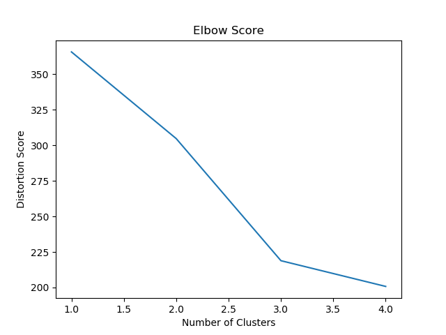

# <i class="fas fa-share-alt"></i> Scoring Metrics

Scoring metrics allow users to validate the performance of their clustering algorithms in three distinct use cases

1. Unsupervised Learning: 

	These metrics analyze how well data has been assigned to clusters, measuring intra-cluster similarity (cohesion) and differences (separation). In general, clustering is said to be successful if clusters are well spaced and densely packed.

2. Supervised Learning:

	If the labels of the dataset are known, clusters can be analysed in a supervised manner by comparing true and predicted labels.

3. Optimum number of clusters:

	If the required number of clusters is not known prior to clustering, the **Elbow Method** is used to estimate the optimum number of clusters within the dataset using K-means clustering.

The following scoring metrics are provided within this library

```txt
.ml.clust - Scoring Metrics

// Unsupervised Learning
  .daviesbouldin      Davies-Bouldin Index
  .dunn               Dunn Index
  .silhouette         Silhouette score

// Supervised Learning
  .homogeneity        Homogeneity score between predictions and actual value

  // Optimum number of clusters
  .elbow              Distortion scores for increasing numbers of clusters
```

<i class="fab fa-github"></i>
[KxSystems/ml/clust/score.q](https://github.com/kxsystems/ml/clust/score.q)


## Unsupervised Learning

The following scoring methods are provided for use when the true cluster assignment is not known.

### `.ml.clust.daviesbouldin`

The Davies-Bouldin index works by calculating the ratio of how scattered data points are within a cluster, to the separation that exists between clusters.

Syntax: `.ml.clust.daviesbouldin[data;clt]`

Where

- `data` represents the points being analyzed in matrix format, where each column is an individual datapoint
- `clt` is the list of clusters returned by one of the clustering algorithms in `.ml.clust`

returns the Davies-Bouldin index, where a lower value indicates better clustering, with well-separated, tightly-packed clusters.

```q
q)show d:2 10#20?10.
4.126605 8.429965 6.214154 5.365242 7.470449 6.168275 6.876426 6.123797 9.363..
4.45644  7.274244 1.301704 2.018829 1.451855 9.819545 7.490215 6.372719 5.856..
q)show r1:10?3
0 1 2 0 1 0 0 1 0 1
q)show r2:10?3
2 2 1 0 2 2 1 2 0 0

// lower values indicate better clustering
q).ml.clust.daviesbouldin[d;r1]
9.014795
q).ml.clust.daviesbouldin[d;r2]
5.890376
```

### `.ml.clust.dunn`

The Dunn index is calculated based on the minimum inter-cluster distance divided by the maximum size of a cluster. 

Syntax: `.ml.clust.dunn[data;df;clt]`

Where

- `data` represents the points being analyzed in matrix format, where each column is an individual datapoint
- `df` is the distance function as a symbol, e.g. `e2dist` `edist` `mdist`
- `clt` is the list of clusters returned by the clustering algorithms in `.ml.clust`

returns the Dunn index, where a higher value indicates better clustering, with well-separated, tightly-packed clusters.

```q
q)show d:2 10#20?10.
3.927524 5.170911 5.159796  4.066642 1.780839 3.017723 7.85033  5.347096..
4.931835 5.785203 0.8388858 1.959907 3.75638  6.137452 5.294808 6.916099..
q)show r1:10?3
0 0 1 1 0 0 2 0 1 0
q)show r2:10?3
0 0 1 1 0 2 0 2 1 2

// higher values indicate better clustering
q).ml.clust.dunn[d;`edist;r1]
0.5716933
q).ml.clust.dunn[d;`e2dist;r2]
0.03341283
```

### `.ml.clust.silhouette`

The Silhouette coefficient measures how similar an object is to the members of its own cluster when compared to other clusters.

Syntax: `.ml.clust.silhouette[data;df;clt;isavg]`

Where

- `data` represents the points being analyzed in matrix format, where each column is an individual datapoint
- `df` is the distance function as a symbol, e.g. `e2dist` `edist` `mdist`
- `clt` is the list of clusters returned by the clustering algorithms in `.ml.clust`
- `isavg` is a boolean - `1b` to return the average coefficient, `0b` to return a list of coefficients

returns the Silhouette coefficient, ranging from -1 (overlapping clusters) to +1 (separated clusters).

```q
q)show d:2 10#20?10.
3.927524 5.170911 5.159796  4.066642 1.780839 3.017723 7.85033  5.347096..
4.931835 5.785203 0.8388858 1.959907 3.75638  6.137452 5.294808 6.916099..
q)show r1:10?3
0 0 1 1 0 0 2 0 1 0
q)show r2:10?3
0 0 1 1 0 2 0 2 1 2

// Return the averaged coefficients across all points
q).ml.clust.silhouette[d;`edist;r1;1b]
0.3698386
q).ml.clust.silhouette[d;`e2dist;r2;1b]
0.2409856

// Return the individual coefficients for each point
q).ml.clust.silhouette[d;`e2dist;r2;0b]
-0.4862092 -0.6652588 0.8131323 0.595948 -0.2540023 0.5901292 -0.2027718 0.61..
```

## Supervised Learning

The following metric is provided in the case that the true and predicted labels of the clusters are known

### `.ml.clust.homogeneity`

Homogeneity score works on the basis that a cluster should contain only samples belonging to a single class.

Syntax: `.ml.clust.homogeneity[pred;true]`

Where

-  `pred` is the predicted cluster labels
-  `true` is the true cluster labels

returns the homogeneity score, bounded between 0 and 1, with a high value indicating a more accurate labeling of clusters.

```q
q)show true:10?3
2 1 0 0 0 0 2 0 1 2
q)show pred:10?3
2 1 2 0 1 0 1 2 0 1
q).ml.clust.homogeneity[pred;true]
0.225179
q).ml.clust.homogeneity[true;true]
1f
```

## Optimum Number of Clusters

The optimum number of clusters can be found manually in a number of ways using techniques above. Within the toolkit we provide an implementation of one of the most common methods for calculating the optimum number of clusters:

### `.ml.clust.elbow`

The elbow method returns a distortion score for each value of k applied to data, using k-means clustering

Syntax: `.ml.clust.elbow[data;df;kmax]`

Where

- `data` represents the points being analyzed in matrix format, where each column is an individual datapoint
- `df` is the distance function as a symbol, e.g. `e2dist` `edist`
- `kmax` is the maximum number of clusters

returns distortion scores for each set of clusters produced by k-means, with increasing values of k up to `kmax`.

```q
q)show d:2 10#20?10.
3.927524 5.170911 5.159796  4.066642 1.780839 3.017723 7.85033  5.347096..
4.931835 5.785203 0.8388858 1.959907 3.75638  6.137452 5.294808 6.916099.. 
q).ml.clust.elbow[d;`edist;5]
16.74988 13.01954 10.91546 9.271871
```

!!! note
	If the values produced by `.ml.clust.elbow` are plotted, it is possible to determine the optimum number of clusters. The above example produces the following graph

	

	It is clear that the elbow score occurs when the data should be grouped into 3 clusters.
