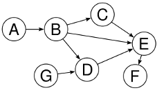

# :fontawesome-solid-share-alt: Graph and Pipeline

The work presented here outlines a structural framework for developing q/kdb+ solutions which is based on a mathematical directed graph. In mathematics, and more specifically in graph theory, a directed graph is a set of vertices/nodes/points connected by edges, where the edges have an associated direction as shown in the below example:

 

By defining code using this core idea a user can develop independent sections of code defined by the nodes and connect them together logically to form a full data analysis pipeline. 

Writing code in this way allows for:

1. The maintenance of a code base is easier due to the individual elements being independent of each other prior to the connection and validation of the graph. 
2. Once a 'wire' version of the graph has been defined by a team individual nodes can be developed completely independently. This reduces the chance of parallel lines of development causing issues when merging independent sections of code within a large team.
3. Testing of the code can also be structured on a per node basis or by connecting chains of nodes together. This allows for complex code bases to be tested at a more granular level than may otherwise be feasible.
4. Producing fundamental changes to the code base is less cumbersome than in a less modular framework. In the case that a new piece of functionality is to be added this requires the addition of a new node, and the removal and reattaching of associated edges.

This addition to the Machine Learning toolkit is provided in two connected sections:

1. [Graphing](graph.md) functionality defining how a user can create, modify and remove nodes or edges to a graph.
2. [Pipelining](pipeline.md) functionality providing a mechanism by which to convert a valid graph into an optimised framework which can be executed to evaluate the graph logic.

Notebooks showing examples of the graph and pipline library described above can be found at

:fontawesome-brands-github:
[KxSystems/mlnotebooks](https://github.com/kxsystems/mlnotebooks)

All code relating to the graph and pipeline section of the Machine Learning Toolkit is available at

:fontawesome-brands-github:
[KxSystems/ml/graph/](https://github.com/kxsystems/ml/graph)


## Loading

The graph library can be loaded independently of the remaining sections of the ML Toolkit:

```q
q)\l ml/ml.q
q).ml.loadfile`:graph/init.q
```
