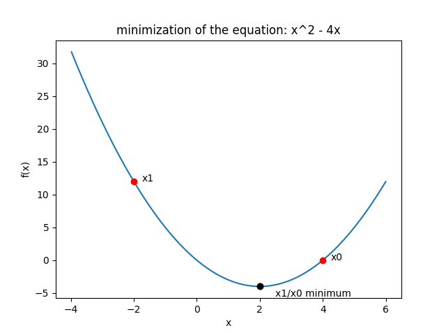
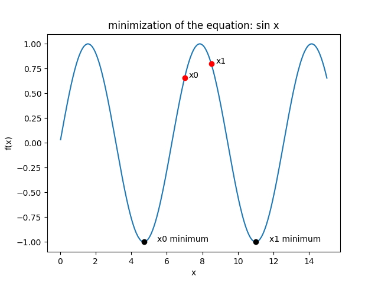

# <i class="fa fa-share-alt"></i> Numerical optimization


<pre markdown="1" class="language-txt">
.ml.optimize   **Optimization functions**
  [BFGS](#mloptimizebfgs)      The Broyden-Fletcher-Goldfarb-Shanno algorithm
</pre>

:fontawesome-brands-github:
[KxSystems/ml/optimize](https://github.com/kxsystems/ml/tree/master/optimize/)

The `.ml.optimize` namespace contains functions which relate to the application of numerical optimization techniques. Such techniques are used to find local or global minima of user provided objective functions and are central to many statistical models.

!!! Note
	Version 1.1.0 provides the initial versions of numerical optimization tools to the machine learning toolkit. The Broyden-Fletcher-Goldfarb-Shanno algorithm is provided initially due to its use in the generation of the SARIMA model provided with the toolkit. This functionality will be expanded over time to include more diverse optimization algorithms
    

## Broyden-Fletcher-Goldfarb-Shanno Algorithm

In numerical optimization, the Broyden-Fletcher-Goldfarb-Shanno(BFGS) algorithm is a quasi-Newton iterative method for solving unconstrained nonlinear optimization problems. This is a class of hill-climbing optimization technique which seeks to find a stationary, preferably twice differentiable solution to the objective function. An outline of the algorithm and the rationale behind its implementation can be found [here](https://en.wikipedia.org/wiki/Broyden-Fletcher-Goldfarb-Shanno_algorithm#Rationale).

### `.ml.optimize.BFGS`

_Optimize an objective function based on a provided intial guess using the BFGS algorithm_

Syntax: `.ml.optimize.BFGS[func;x0;args;params]`

Where

* `func` is a lambda/projection defining the objective function to be optimized. This function should take as input 1 or 2 items depending on if non changing additional arguments `args` are required.
* `x0` is a numerical list denoting the initial guess for the numerical function arguments which are to be optimized.
* `args` any additional non changing arguments required by the function, this can be a list or dictionary in the case that additional arguments are required, or a `(::)`/`()` in the case they are not.
* `params` optional parameters which can be used to modify the behaviour of the algorithm. In the case that no modifications are to be made this should be `(::)`. Otherwise this should be a dictionary. The following keys outline all possible changes which can be made to the default system behaviour and the currently accepted default values

key          |  type   | default  | explanation
-------------|---------|----------|--------
`display`    | boolean |    0b    | are the results at each optimization iteration to be printed to standard output
`optimIter`  | integer |    0W    | maximum number of iterations before optimization procedure is terminated
`zoomIter`   | integer |    10    | maximum number of iterations when finding optimal zoom position
`wolfeIter`  | integer |    10    | maximum number of iterations when attempting to calculate strong Wolfe conditions
`norm`       | integer |    0W    | order of function used to calculate the gradient norm. This can be `0W = maximum value`, `-0W = minimum value` otherwise calculated via `sum[abs[vec]xexp norm]xexp 1%norm`
`gtol`       |  float  |   1e-5   | gradient norm must be less than this value before successful termination
`geps`       |  float  |  1.5e-8  | the absolute step size used for numerical approximation of the jacobian via forward differencing 
`stepSize`   |  float  |    0W    | the maximum allowable 'alpha' step size between calculations during the Wolfe condition search
`c1`         |  float  |   1e-4   | Armijo rule condition used in calculation of strong Wolfe conditions.
`c2`         |  float  |   0.9    | curvature rule condition used in calculation of the strong Wolfe condition search

returns a dictionary containing the following information

key       |  explanation
----------|-----------------------
`xVals`   | optimized input arguments for the functions based on initial guess `x0`
`funcRet` | return from the objective function at position `xVals`
`numIter` | number of iterations to reach the optimal values

The following examples outline the optimization algorithm in use across a number of functions and with various starting points in 1-D and 2-D space.

**Example 1:**

Test minimization on a function with a single global minimum

1. Define a quadratic equation to be minimized: 

	$$f(x) = x^{2} -4x$$

2. Test at starting point `x0 = 4`
3. Test at starting point `x0 = -2`
4. Plot results of both showing starting points and point of convergence

```q
// function definition
q)func:{xexp[x[0];2]-4*x[0]}
// define initial starting condition as x0
q)x0:enlist 4f
// apply the BFGS optimization algorithm
q).ml.optimize.BFGS[func;x0;();::]
xVals  | ,2f
funcRet| -4f
numIter| 2

// define a different initial starting condition as x1
q)x1:enlist -2f
q).ml.optimize.BFGS[func;x1;();::]
xVals  | ,2f
funcRet| -4f
numIter| 3
```



**Example 2:**

Test minimization on a function which has multiple minima, demonstrate functionality to print optimization information on a per iteration basis.

1. Define a sinusoidal equation to be minimized:

	$$ f(x) = sin(x)$$

2. Test at starting point `x0 = 7` and displaying per iteration output
3. Test at starting point `x1 = 8.5`
4. Plot results of both showing starting points and point of convergence

```q
// function definition
q)func:{sin x 0}
// define initial starting condition as x0
q)x0:enlist 7f
// apply the BFGS optimization algorithm
q).ml.optimize.BFGS[func;x0;();``display!(::;1b)]
xk     | ,3.984391
fk     | -0.7465079
prev_fk| 0.6569866
gk     | ,-0.6653765
prev_xk| ,7f
hess   | ,,2.124748
gnorm  | 0.6653765
I      | ,,1f
idx    | 1

xk     | ,4.691269
fk     | -0.999777
prev_fk| -0.7465079
gk     | ,-0.02111795
prev_xk| ,3.984391
hess   | ,,1.097197
gnorm  | 0.02111795
I      | ,,1f
idx    | 2

xk     | ,4.71444
fk     | -0.9999979
prev_fk| -0.999777
gk     | ,0.002051036
prev_xk| ,4.691269
hess   | ,,1.000068
gnorm  | 0.002051036
I      | ,,1f
idx    | 3

xk     | ,4.712389
fk     | -1f
prev_fk| -0.9999979
gk     | ,-1.415721e-07
prev_xk| ,4.71444
hess   | ,,0.9999985
gnorm  | 1.415721e-07
I      | ,,1f
idx    | 4

xVals  | ,4.712389
funcRet| -1f
numIter| 4

// define a different initial starting condition as x1
q)x1:enlist 8.5f
q).ml.optimize.BFGS[func;x1;();::]
xVals  | ,10.99556
funcRet| -1f
numIter| 3
```



**Example 3:**

Test minimization of a multidimensional function, showing the effect of modifying the number of allowed iterations in the application of optimization

1. Define a function which optimizes on 2 arguments

	$$f(x) = (x[0]-1)^2 + (x[1]-2.5)^2$$

2. Test at starting point `x[0] = 10, x[1] = 20` with an unconstrained number of iterations
3. Test at starting point `x[0] = 10, x[1] = 20` with an a maximum of 3 iterations allowed 

```q
// define the function to be minimized
q)func:{xexp[x[0]-1;2]+xexp[x[1]-2.5;2]}

// define the initial starting point
q)x0:10 20f

// optimize the function with an unconstrained number of iterations
q).ml.optimize.BFGS[func;x0;();::]
xVals  | 0.9999915 2.500004
funcRet| 8.848111e-11
numIter| 4

// optimize the function stopping after 3 iterations
q).ml.optimize.BFGS[func;x0;();``optimIter!(::;3)]
xVals  | 2.473882 5.365867
funcRet| 10.38552
numIter| 3
```


