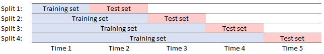
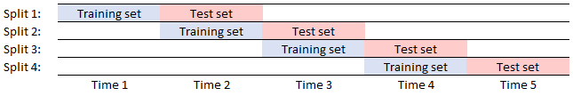

# <i class="fa fa-share-alt"></i> .ml.xval namespace 


The `.ml.xval` namespace contains functions used for the application of various cross-validation procedures, these offer the ability to test how robust/stable a model is to changes in the volume of data being interrogated or the particular subsets of data being used in validation procedures.

<i class="fab fa-github"></i>
[KxSystems/ml/xval/](https://github.com/kxsystems/ml/tree/master/xval)

The following functions are those contained at present within the `.ml.xval` namespace

```txt
.ml.xval - Cross validation functions
  .chainxval            Score from chain-forward cross validation
  .gridsearch           Grid search returning score and optimal parameters for ML-model
  .gridsearchfit        Grid search returning score on test data set for optimal model
  .kfoldx               K-Fold cross validation
  .kfshuff              Randomized indiced for data split into k-folds
  .kfsplit              Sequential sets of indices for data split into k-folds
  .kfstrat              Stratified choosing of indices for categorical targets
  .mcxval               Monte-Carlo cross validation
  .repkfstrat           Repeated stratified K-fold cross validation
  .repkfval             Repeated randomized K-fold cross validation
  .rollxval             Roll forward cross validation
```

## `.ml.xval.chainxval`

_Score from a chain-forward cross validation_

Syntax: `.ml.xval.chainxval[x;y;n;algo]`

Where

-   `x` is a matrix of data for prediction
-   `y` is a target vector
-   `n` is the number of splits performed on the dataset
-   `algo` is the algorithm being tested

returns the averaged score for the model over all chained iterations.

```q
q)n:10000
q)x:flip value flip([]n?100f;asc n?100f)
q)y:asc n?100f
q)reg:.p.import[`sklearn.linear_model][`:LinearRegression][]
q).ml.xval.chainxval[x;y;10;reg]
0.972491
```

!!! note
        This works as shown in the following image:

        

        The data is split into equi-sized bins with increasing amounts of the data incorporated in the testing set at each step. This avoids testing a model on historical information which would be counter-productive in testing a model for time-series forecasting. It also allows the robustness of the model to increasing data volumes to be probed.


## `.ml.xval.gridsearch`

_Optimal parameters for machine-learning model through cross validation_

Syntax: `.ml.xval.gridsearch[x;y;i;algo;dict]`

Where

-   `x` is a matrix of the data being used for prediction
-   `y` is a target vector
-   `i` are the indices for each of the K-folds
-   `algo` is the algorithm on which the search is performed
-   `dict` is a dictionary of hyperparameters to be searched

returns the score for the best model and the hyper-parameters which led to this score.

```q
q)n:10000
q)xg:flip value flip([]n?100f;asc n?100f)
q)yg:asc n?100f
q)regr:.p.import[`sklearn.linear_model]`:ElasticNet   / Note there is not following [] here
q)dict:`max_iter`alpha!(100 200 1000;.01*1+til 100)    / multiple searched hyperparameters
q)i:.ml.xval.kfsplit[yg;3]
q).ml.xval.gridsearch[xg;yg;i;regr;dict]
0.999754
`max_iter`alpha!(100 200 1000;.04 .04 .04)
q)dict:enlist[`alpha]!enlist .1*1+til 10               / search completed for 1-hyperparameter
q).ml.xval.gridsearch[xg;yg;i;regr;dict]
0.9997538
(,`alpha)!,0.1
```


## `.ml.xval.gridsearchfit`

_K-Fold validated grid-search with optimal model fit to testing set_

Syntax: `.ml.xval.gridsearchfit[x;y;sz;n;algo;dict]`

Where

-   `x` is a matrix
-   `y` is the target vector
-   `sz` is a numeric atom in range 0-1
-   `n` is a integer > 0 which gives the number of folds for cross validation
-   `algo` is the model on which the grid search is performed
-   `dict` is a dictionary of hyper-parameters to be searched

As with `.ml.gridsearch`, this function performs a cross validated grid-search over all combinations of hyperparameters to find the best model. This function splits the data into a train/test sets, performs grid-search on the training set (with 3-fold cross validation), fits the model with the highest score to the testing set and returns the testing score produced.

```q
q)n:100000
q)xg:flip value flip([]n?100f;asc n?100f)
q)yg:asc n?100f
q)reg:.p.import[`sklearn.linear_model][`:ElasticNet]
q)dict:enlist[`alpha]!enlist .02*1+til 10
q).ml.xval.gridsearchfit[xg;yg;.2;5;reg;dict]
0.9999818
q)dict:`alpha`max_iter!(.1*1+til 9;15 30 60 120)
q).ml.xval.gridsearchfit[xg;yg;.2;5;reg;dict]
0.9999759
```


## `.ml.xval.kfoldx`

_K-Fold cross validation_

Syntax: `.ml.xval.kfoldx[x;y;i;fn]`

Where

-   `x` is the data matrix
-   `y` is the target vector
-   `i` are the indices for the K-fold validation using `.ml.kfsplit`
-   `fn` is the model which is being passed to the function for cross validation

returns the cross validated score for an applied machine-learning algorithm.

```q
q)n:10000
q)xg:flip value flip([]n?100f;asc n?100f)        / 'good values' for linear regressor
q)yg:asc n?100f
q)/ load in regression models to be tested
q)reg:.p.import[`sklearn.linear_model][`:LinearRegression][]
q)reg1:.p.import[`sklearn.linear_model][`:SGDRegressor][]
q)reg2:.p.import[`sklearn.linear_model][`:ElasticNet][]
q)reg3:.p.import[`sklearn.neighbors][`:KNeighborsRegressor][]
q)folds:10                                      / number of folds for data
q)i:.ml.xval.kfsplit[yg;folds]
q).ml.xval.kfoldx[xg;yg;i]each(reg;reg1;reg2;reg3)
0.9998536 -1.24663e+24 0.9998393 0.9999997
q)yb:n?100f                                     / 'bad values' for linear regression
q)xb:flip value flip([]n?100f;n?100f)
q).ml.xval.kfoldx[xb;yb;i]each(reg;reg1;reg2;reg3)
-0.009119423 -7.726559e+21 -0.009119348 -0.2275681
```

!!! note
	An aliased version of this function exists in the root `.ml` namespace this makes it easier to implement the K-fold cross validation but is primarily in place based on how fundamental this procedure is in general machine learning pipelines.
## `.ml.xval.kfshuff`

_Randomized non-repeating indices for K-fold cross validation_

Syntax: `.ml.xval.kfshuff[x;y]`

Where

-   `x` is the target vector
-   `y` is the number of 'folds' which the data is to be split into

returns randomized non-repeating indices associated with each of the K-folds.

```q
q)yg:asc 1000?100f
q).ml.xval.kfshuff[yg;5]
647 755 790 152 948 434 583 536 156 637 699 159 315 698 41  345 565 680 775 6..
118 402 34  601 833 877 762 703 129 294 593 634 192 939 545 98  641 266 910 4..
795 69  664 393 519 722 616 55  132 802 448 140 361 194 977 97  247 74  733 6..
633 430 346 267 102 201 123 295 487 418 606 108 154 899 398 932 994 643 944 5..
919 354 119 478 954 567 497 848 665 471 406 541 307 82  984 198 134 622 550 9..
```

!!! note
	An aliased version of this function is contained in the root namespace and defined as `.ml.kfshuff`. This coincides with the existance of the aliased function `.ml.kfoldx` in the root namespace. Thus makes it easier to create indices to be passed to the cross validation function.

## `.ml.xval.kfsplit`

_Ascending indices in K-folds_

Syntax: `.ml.xval.kfsplit[x;y]`

Where

-   `x` is the target vector
-   `y` is the number of 'folds' which the data is to be split into

returns the ascending indices associated with each of the K-fold.

```q
q)yg:asc 1000?100f                              / this is a proxy for the target vector
q)folds:10                                      / number of folds for data
q)show i:.ml.xval.kfsplit[yg;folds]
0   1   2   3   4   5   6   7   8   9   10  11  12  13  14  15  16  17  18  1..
100 101 102 103 104 105 106 107 108 109 110 111 112 113 114 115 116 117 118 1..
200 201 202 203 204 205 206 207 208 209 210 211 212 213 214 215 216 217 218 2..
300 301 302 303 304 305 306 307 308 309 310 311 312 313 314 315 316 317 318 3..
400 401 402 403 404 405 406 407 408 409 410 411 412 413 414 415 416 417 418 4..
500 501 502 503 504 505 506 507 508 509 510 511 512 513 514 515 516 517 518 5..
600 601 602 603 604 605 606 607 608 609 610 611 612 613 614 615 616 617 618 6..
700 701 702 703 704 705 706 707 708 709 710 711 712 713 714 715 716 717 718 7..
800 801 802 803 804 805 806 807 808 809 810 811 812 813 814 815 816 817 818 8..
900 901 902 903 904 905 906 907 908 909 910 911 912 913 914 915 916 917 918 9..
```


## `.ml.xval.kfstrat`

_Distribute data into K-Folds with approx equal distribution of classes_

Syntax: `.ml.xval.kfstrat[x;y]`

Where

-   `x` is the target vector
-   `y` is the number of 'folds' which the data is to be split into

returns the indices for each of the K-folds with an approximately equal distribution of classes between folds. This is used extensively in cases where the distribution of classes in the data is unbalanced.

```q
q)yg:(100#0b),10#1b                  / this is a proxy for the target vector
q).ml.xval.kfstrat[yg;5]             / split the data into 5 stratified folds
7  69 93 100 15  94 42  27 107 85 62  12 4  53  58 47 29 105 101 56 35 106
59 26 49 8   20  44 31  6  0   43 30  40 95 54  99 39 98 16  33  52 51 3
87 48 45 64  109 72 70  68 9   61 81  1  36 104 5  55 91 24  78  76 79 71
46 28 21 83  25  2  102 34 23  60 108 13 67 86  18 75 90 89  97  22 57 65
32 63 10 19  74  96 103 66 11  84 41  73 38 77  17 14 92 37  82  88 50 80
q)p .ml.xval.kfstrat[yg;5]
0000000000000000000011b
0000000000000000000011b
0000000000000000000011b
0000000000000000000011b
0000000000000000000011b
```
!!! note
        In the above example `p` was been defined as a global variable within the function `.ml.kfstrat`. This has only been done to allow the distribution of values within the data to be shown as being correct, this is not defined within the definition within github.


## `.ml.xval.mcxval`

_Score for monte-carlo cross validated model_

Syntax: `.ml.xval.mcxval[x;y;sz;algo;n]`

Where

-   `x` is a matrix of data to be fit
-   `y` is the target vector
-   `sz` is a numeric atom in the range 0-1, representing the percentage of data in the testing set
-   `algo` is the algorithm being tested
-   `n` is the number of validation iterations to be completed

returns the average score for all iterations of the monte-carlo cross validation.

```q
q)n:10000
q)xg:flip value flip([]n?100;asc n?100f)
q)yg:asc n?5
q)clf:.p.import[`sklearn.tree][`:DecisionTreeClassifier][]
q).ml.xval.mcxval[xg;yg;.2;clf;5]
0.999375
q)xb:flip value flip([]n?100;n?100f)
q)yb:n?5
q).ml.xval.mcxval[xb;yb;.2;clf;5]
0.20675
```

!!! note
        This form of cross validation is also known as 'repeated random sub-sampling validation'. This has advantages over K-fold when observations are not wanted in equi-sized bins or where outliers could heavily bias a classifier. More information is available [here](https://en.wikipedia.org/wiki/Cross-validation_(statistics)#Repeated_random_sub-sampling_validation).


## `.ml.xval.repkfstrat`

_Average score for repeated stratified randomized K-fold cross validation_

Syntax: `.ml.xval.repkfstrat[x;y;n;k;algo]`

Where

-   `x` is a matrix of the data to be fit
-   `y` is the target vector
-   `n` is the number of repetitions of cross validation
-   `k` is the number of folds
-   `algo` is the model applied for validation

returns the averaged accuracy score over all folds for the random stratified dataset.

```q
q)n:10000
q)xg:flip value flip([]n?100;asc n?100f)
q)yg:asc n?5
q)regr:.p.import[`sklearn.neighbors][`:KNeighborsRegressor][]
q).ml.xval.repkfstrat[xg;yg;5;10;regr]
0.9998566
```

!!!note
        The application of repeated K-fold cross validation procedures should be applied with caution - cross validation procedures often tend to be slow. As such, K-fold should be run once prior to multiple applications.


## `.ml.xval.repkfval`

_Average score for repeated randomized K-fold cross validation_

Syntax: `.ml.xval.repkfval[x;y;n;k;algo]`

Where

-   `x` is a matrix of the data to be fit
-   `y` is the target vector
-   `n` is the number of repetitions of cross validation
-   `k` is the number of folds
-   `algo` is the model applied for validation

returns the averaged accuracy score over all folds for random shuffled datasets.

```q
q)n:10000
q)xg:flip value flip([]n?100;asc n?100f)
q)yg:asc n?100f
q)regr:.p.import[`sklearn.neighbors][`:KNeighborsRegressor][]
q).ml.xval.repkfval[xg;yg;5;10;regr]
0.9998566
```

!!!note
        The application of repeated K-fold cross validation procedures should be applied with caution - cross validation procedures often tend to be slow. As such, K-fold should be run once prior to multiple applications.


## `.ml.xval.rollxval`

_Score from a roll-forward cross validation_

Syntax: `.ml.xval.rollxval[x;y;n;algo]`

Where

-   `x` is a matrix of the data to be fit
-   `y` is the target vector
-   `n` is the number of validation splits of the data
-   `algo` is the model to be applied for validation

returns the average score from all n-fits to the validation set.

```q
q)n:10000
q)xg:flip value flip ([]n?100;asc n?100f)
q)yg:asc n?100f
q)reg:.p.import[`sklearn.linear_model][`:LinearRegression][]
q).ml.xval.rollxval[xg;yg;10;reg]
-11.99615
```
!!! note
        This works as shown in the following image:

        

        Successive equi-sized bins are taken as validation and training sets for each step. This avoids testing a model on historical information which would be counter-productive in testing a model for time-series forecasting.


