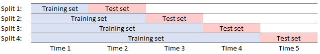
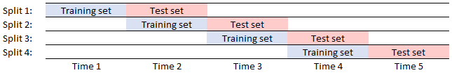

# <i class="fa fa-share-alt"></i> Cross validation procedures 


The `.ml.xv` and `.ml.gs` namespaces contain functions related to cross-validation and grid search algorithms. These algorithms test how robust or stable a model is to changes in the volume of data or the specific subsets of data used for validation.

<i class="fab fa-github"></i>
[KxSystems/ml/xval](https://github.com/kxsystems/ml/tree/master/xval/)

The following functions are contained in the `.ml.gs` and `.ml.xv` namespaces.

```txt
.ml.gs - Grid search functions
  .kfshuff            K-Fold cross-validation with randomized indices
  .kfsplit            K-Fold cross-validation with sequential indices
  .kfstrat            K-Fold cross-validation with stratified indices
  .mcsplit            Monte-Carlo cross-validation with random split indices
  .pcsplit            Percentage split cross-validation
  .tschain            Chain-forward cross-validation
  .tsrolls            Roll-forward cross-validation
.ml.xv - Cross validation functions
  .kfshuff            K-Fold cross-validation with randomized indices
  .kfsplit            K-Fold cross-validation with sequential indices
  .kfstrat            K-Fold cross-validation with stratified indices
  .mcsplit            Monte-Carlo cross-validation with random split indices
  .pcsplit            Percentage split cross-validation
  .tschain            Chain-forward cross-validation
  .tsrolls            Roll-forward cross-validation
```

Within the following examples, `.ml.xv.fitscore` is used extensively to fit models and return the score achieved on validation/test data. This function can be replaced by a user-defined alternative for tailored applications, e.g. a function to fit on training data and predict outputs for new data.

As of toolkit version 0.1.3, the distribution of cross-validation functions is invoked at console initialization. If a process is started with `$q -s -4 -p 4321` and `xval.q` is loaded into the process, then the cross-validation library will automatically make 4 worker processes available to execute jobs.


## `.ml.gs.kfshuff`

_Cross-validated parameter grid search applied to data with shuffled split indices_

Syntax: `.ml.gs.kfshuff[k;n;x;y;f;p;h]`

Where

-   `k` is the integer number of folds
-   `n` is the integer number of repetitions of the procedure
-   `x` is a matrix of features
-   `y` is a vector of targets
-   `f` is a function that takes parameters and data as input and returns a score
-   `p` is a dictionary of hyperparameters to be searched
-   `h` is a float value denoting the size of the holdout set used in a fitted gridsearch, where the best model is fit to the holdout set. If 0 the function will return scores for each fold for the given hyperparameters. If negative the data will be shuffled prior to designation of the holdout set.

returns the scores for hyperparameter sets on each of the `k` folds for all values of `h` and additionally returns the best hyperparameters and score on the holdout set for `0 < h <=1`.

```q
q)m:10000
q)x:(m;10)#(m*10)?1f
q)yr:x[;0]+m?.05
// algo
q)rf:{.p.import[`sklearn.linear_model]`:LinearRegression}
// params
q)pr:`fit_intercept`normalize!(01b;01b)
// 4 fold cross-validation no holdout
q).ml.gs.kfshuff[4;1;x;yr;.ml.xv.fitscore rf;pr;0]
fit_intercept normalize|                                        
-----------------------| ---------------------------------------
0             0        | 0.9971193 0.9973079 0.997283  0.9972022
0             1        | 0.9973031 0.9971586 0.9972672 0.9971888
1             0        | 0.997407  0.9974875 0.9974944 0.9975418
1             1        | 0.997542  0.997472  0.9974438 0.9974849
// 5 fold cross-validated grid search fitted on 20% holdout set
q).ml.gs.kfshuff[5;1;x;yr;.ml.xv.fitscore rf;pr;.2]
(+`fit_intercept`normalize!(0011b;0101b))!(0.9971515 0.9971983 0.9973203 0.99..
`fit_intercept`normalize!11b
0.9975178
```


## `.ml.gs.kfsplit`

_Cross-validated parameter grid search applied to data with ascending split indices_

Syntax: `.ml.gs.kfsplit[k;n;x;y;f;p;h]`

Where

-   `k` is the integer number of folds
-   `n` is the integer number of repetitions of the procedure
-   `x` is a matrix of features
-   `y` is a vector of targets
-   `f` is a function that takes parameters and data as input and returns a score
-   `p` is a dictionary of hyperparameters to be searched
-   `h` is a float value denoting the size of the holdout set used in a fitted gridsearch, where the best model is fit to the holdout set. If 0 the function will return scores for each fold for the given hyperparameters. If negative the data will be shuffled prior to designation of the holdout set.

returns the scores for hyperparameter sets on each of the `k` folds for all values of `h` and additionally returns the best hyperparameters and score on the holdout set for `0 < h <=1`.

```q
q)m:10000
q)x:(m;10)#(m*10)?1f
q)yc:(raze flip(0N;4)#m#`a`b`c`d)rank x[;0]
// algos
q)cf:{.p.import[`sklearn.tree]`:DecisionTreeClassifier}
// params
q)pc:enlist[`max_depth]!enlist(::;1;2;3;4;5)
// 5 fold cross-validation no holdout
q).ml.gs.kfsplit[5;1;x;yc;.ml.xv.fitscore cf;pc;0]
max_depth|                                   
---------| ----------------------------------
::       | 1      0.9995 0.9995 0.9985 0.999 
1        | 0.4965 0.4715 0.486  0.4775 0.4815
2        | 0.7435 0.734  0.741  0.9985 0.735 
3        | 1      0.9995 0.9995 0.9985 0.999 
4        | 1      0.9995 0.9995 0.9985 0.999 
5        | 1      0.9995 0.9995 0.9985 0.999
// 5 fold cross-validated grid search fitted on 20% holdout set
q).ml.gs.kfsplit[5;1;x;yc;.ml.xv.fitscore cf;pc;.2]
(+(,`max_depth)!,(::;1;2;3;4;5))!(1 0.999375 0.998125 1 0.99875;0.475 0.47562..
(,`max_depth)!,::
1f
// 10 fold cross-validated grid search fitted on 10% holdout with initial data shuffle
q).ml.gs.kfsplit[10;1;x;yc;.ml.xv.fitscore cf;pc;-.1]
(+(,`max_depth)!,(::;1;2;3;4;5))!(1 1 1 0.9988889 0.9977778 1 1 1 1 0.9988889..
(,`max_depth)!,::
1f
```


## `.ml.gs.kfstrat`

_Cross-validated parameter grid search applied to data with an equi-distributions of targets per fold_

Syntax: `.ml.gs.kfstrat[k;n;x;y;f;p;h]`

Where

-   `k` is the integer number of folds
-   `n` is the integer number of repetitions of the procedure
-   `x` is a matrix of features
-   `y` is a vector of targets
-   `f` is a function that takes parameters and data as input and returns a score
-   `p` is a dictionary of hyperparameters to be searched
-   `h` is a float value denoting the size of the holdout set used in a fitted gridsearch, where the best model is fit to the holdout set. If 0 the function will return scores for each fold for the given hyperparameters. If negative the data will be shuffled prior to designation of the holdout set.

returns the scores for hyperparameter sets on each of the `k` folds for all values of `h` and additionally returns the best hyperparameters and score on the holdout set for `0 < h <=1`.

```q
q)m:10000
q)x:(m;10)#(m*10)?1f
q)yc:(raze flip(0N;4)#m#`a`b`c`d)rank x[;0]
// algos
q)cf:{.p.import[`sklearn.tree]`:DecisionTreeClassifier}
// params
q)pc:enlist[`max_depth]!enlist(::;1;2;3;4;5)
// 5 fold cross-validation no holdout
q).ml.gs.kfstrat[5;1;x;yc;.ml.xv.fitscore cf;pc;0]
max_depth|                                
---------| -------------------------------
::       | 0.999  1      1      0.9995 1  
1        | 0.5    0.5    0.5    0.5    0.5
2        | 0.9995 0.999  0.9995 1      1  
3        | 0.9995 0.9985 1      0.9995 1  
4        | 1      0.999  0.9995 1      1  
5        | 0.9995 1      1      0.999  1 
// 4 fold cross-validated grid search fitted on 20% holdout set
q).ml.gs.kfstrat[4;1;x;yc;.ml.xv.fitscore cf;pc;.2]
(+(,`max_depth)!,(::;1;2;3;4;5))!(0.9995005 1 1 0.998999;0.501998 0.5022511 0..
(,`max_depth)!,5
0.9995
```


## `.ml.gs.mcsplit`

_Cross-validated parameter grid search applied to randomly shuffled data and validated on a percentage holdout set_

Syntax: `.ml.gs.mcsplit[pc;n;x;y;f;p;h]`

Where

-   `pc` is a float between 0 and 1 denoting the percentage of data in the holdout validation set
-   `n` is the integer number of repetitions of the procedure
-   `x` is a matrix of features
-   `y` is a vector of targets
-   `f` is a function that takes parameters and data as input and returns a score
-   `p` is a dictionary of hyperparameters to be searched
-   `h` is a float value denoting the size of the holdout set used in a fitted gridsearch, where the best model is fit to the holdout set. If 0 the function will return scores for each fold for the given hyperparameters. If negative the data will be shuffled prior to designation of the holdout set.

returns the scores for hyperparameter sets on each of the `k` folds for all values of `h` and additionally returns the best hyperparameters and score on the holdout set for `0 < h <=1`.

```q
q)m:10000
q)x:(m;10)#(m*10)?1f
q)yr:x[;0]+m?.05
// algo
q)rf:{.p.import[`sklearn.linear_model]`:LinearRegression}
// params
q)pr:`fit_intercept`normalize!(01b;01b)
// 20% validation set with 5 repetitions, no fit on holdout
q).ml.gs.mcsplit[0.2;5;x;yr;.ml.xv.fitscore rf;pr;0]
fit_intercept normalize|                                                  
-----------------------| -------------------------------------------------
0             0        | 0.9971461 0.9973725 0.9972689 0.9973013 0.9972352
0             1        | 0.997338  0.9973676 0.9972201 0.9973773 0.9972741
1             0        | 0.9975606 0.9975717 0.9974275 0.9974351 0.9973509
1             1        | 0.9973651 0.9974569 0.9974633 0.9974753 0.9975381
// 10% validation set with 3 repetitions, fit on 20% holdout set
q).ml.gs.mcsplit[0.1;3;x;yr;.ml.xv.fitscore rf;pr;.2]
(+`fit_intercept`normalize!(0011b;0101b))!(0.9971063 0.9971009 0.997168;0.997..
`fit_intercept`normalize!11b
0.9975662
```


## `.ml.gs.pcsplit`

_Cross-validated parameter grid search applied to percentage split dataset_

Syntax: `.ml.gs.pcsplit[pc;n;x;y;f;p;h]`

Where

-   `pc` is a float between 0 and 1 denoting the percentage of data in the holdout validation set
-   `n` is the integer number of repetitions of the procedure
-   `x` is a matrix of features
-   `y` is a vector of targets
-   `f` is a function that takes parameters and data as input and returns a score
-   `p` is a dictionary of hyperparameters to be searched
-   `h` is a float value denoting the size of the holdout set used in a fitted gridsearch, where the best model is fit to the holdout set. If 0 the function will return scores for each fold for the given hyperparameters. If negative the data will be shuffled prior to designation of the holdout set.

returns the scores for hyperparameter sets on each of the `k` folds for all values of `h` and additionally returns the best hyperparameters and score on the holdout set for `0 < h <=1`.

```q
q)m:10000
q)x:(m;10)#(m*10)?1f
q)yr:x[;0]+m?.05
// algo
q)rf:{.p.import[`sklearn.linear_model]`:LinearRegression}
// params
q)pr:`fit_intercept`normalize!(01b;01b)
// 20% validation set with 1 repetition, no fit on holdout
q).ml.gs.pcsplit[0.2;1;x;yr;.ml.xv.fitscore rf;pr;0]
fit_intercept normalize|          
-----------------------| ---------
0             0        | 0.9972247
0             1        | 0.9972247
1             0        | 0.9974099
1             1        | 0.9974099
// 10% validation set with 3 repetitions, fit on 20% holdout set
q).ml.gs.pcsplit[0.1;3;x;yr;.ml.xv.fitscore rf;pr;.2]
(+`fit_intercept`normalize!(0011b;0101b))!(0.9972871 0.9972871 0.9972871;0.99..
`fit_intercept`normalize!10b
0.9974099
```

This form of cross-validation is also known as _repeated random sub-sampling validation_. This has advantages over K-fold when observations are not wanted in equi-sized bins or where outliers could heavily bias a classifier. 

<i class="fab fa-wikipedia-w"></i>
[Repeated random sub-sampling validation](https://en.wikipedia.org/wiki/Cross-validation_(statistics)#Repeated_random_sub-sampling_validation)


## `.ml.gs.tschain`

_Cross-validated parameter grid search applied to chain forward time-series sets_

Syntax: `.ml.gs.tschain[k;n;x;y;f;p;h]`

Where

-   `k` is the integer number of folds
-   `n` is the integer number of repetitions of the procedure
-   `x` is a matrix of features
-   `y` is a vector of targets
-   `f` is a function that takes parameters and data as input and returns a score
-   `p` is a dictionary of hyperparameters to be searched
-   `h` is a float value denoting the size of the holdout set used in a fitted gridsearch, where the best model is fit to the holdout set. If 0 the function will return scores for each fold for the given hyperparameters. If negative the data will be shuffled prior to designation of the holdout set.

returns the scores for hyperparameter sets on each of the `k` folds for all values of `h` and additionally returns the best hyperparameters and score on the holdout set for `0 < h <=1`.

```q
q)m:10000
q)x:(m;10)#(m*10)?1f
q)yc:(raze flip(0N;4)#m#`a`b`c`d)rank x[;0]
// algos
q)cf:{.p.import[`sklearn.tree]`:DecisionTreeClassifier}
// params
q)pc:enlist[`max_depth]!enlist(::;1;2;3;4;5)
// 5 fold cross-validation no holdout
q).ml.gs.tschain[5;1;x;yc;.ml.xv.fitscore cf;pc;0]
max_depth|                            
---------| ---------------------------
::       | 1      0.9995 0.999  0.9995
1        | 0.491  0.507  0.491  0.49  
2        | 0.7445 0.7545 0.7425 0.744 
3        | 1      0.9995 0.999  0.9995
4        | 1      0.9995 0.999  0.9995
5        | 1      0.9995 0.999  0.9995   
// 4 fold cross-validated grid search fitted on 20% holdout set
q).ml.gs.tschain[4;1;x;yc;.ml.xv.fitscore cf;pc;.2]
(+(,`max_depth)!,(::;1;2;3;4;5))!(1 0.9995 0.999;0.491 0.507 0.491;0.7445 0.7..
(,`max_depth)!,::
0.9995
```

This works as shown in the following image:



The data is split into equi-sized bins with increasing amounts of the data incorporated into the testing set at each step. This avoids testing a model on historical information which would be counter-productive for time-series forecasting. It also allows users to test the robustness of the model when passed increasing volumes of data.


## `.ml.gs.tsroll`

_Cross-validated parameter grid search applied to roll forward time-series sets_

Syntax: `.ml.gs.tsroll[k;n;x;y;f;p;h]`

Where

-   `k` is the integer number of folds
-   `n` is the integer number of repetitions of the procedure
-   `x` is a matrix of features
-   `y` is a vector of targets
-   `f` is a function that takes parameters and data as input and returns a score
-   `p` is a dictionary of hyperparameters to be searched
-   `h` is a float value denoting the size of the holdout set used in a fitted gridsearch, where the best model is fit to the holdout set. If 0 the function will return scores for each fold for the given hyperparameters. If negative the data will be shuffled prior to designation of the holdout set.

returns the scores for hyperparameter sets on each of the `k` folds for all values of `h` and additionally returns the best hyperparameters and score on the holdout set for `0 < h <=1`.

```q
q)m:10000
q)x:(m;10)#(m*10)?1f
q)yc:(raze flip(0N;4)#m#`a`b`c`d)rank x[;0]
// algos
q)cf:{.p.import[`sklearn.tree]`:DecisionTreeClassifier}
// params
q)pc:enlist[`max_depth]!enlist(::;1;2;3;4;5)
// 6 fold cross-validation no holdout
q).ml.gs.tsrolls[6;1;x;yc;.ml.xv.fitscore cf;pc;0]
max_depth|                                                  
---------| -------------------------------------------------
::       | 0.9994001 0.9988002 1         0.9988002 1        
1        | 0.4871026 0.4907019 0.4897959 0.5122975 0.490102 
2        | 0.7444511 0.7396521 0.7460984 0.7432513 0.7306539
3        | 0.9994001 0.9988002 1         0.9988002 1        
4        | 0.9994001 0.9988002 1         0.9988002 1        
5        | 0.9994001 0.9988002 1         0.9988002 1        
// 5 fold cross-validated grid search fitted on 20% holdout set
q).ml.gs.tsrolls[4;1;x;yc;.ml.xv.fitscore cf;pc;.2]
(+(,`max_depth)!,(::;1;2;3;4;5))!(0.9995 0.999 0.999;0.4965 0.506 0.5015;0.74..
(,`max_depth)!,::
1f
```

This works as shown in the following image:



Successive equi-sized bins are taken as training and validation sets at each step. This avoids testing a model on historical information which would be counter-productive for time-series forecasting.


## `.ml.xv.kfshuff`

_K-Fold cross-validation for randomized non-repeating indices_

Syntax: `.ml.xv.kfshuff[k;n;x;y;f]`

Where

-   `k` is the integer number of folds
-   `n` is the integer number of repetitions of the procedure
-   `x` is a matrix of features
-   `y` is a vector of targets
-   `f` is a function which takes data as input

returns output of `f` applied to each of the cross-validation splits.

```q
q)m:10000
q)x:(m;10)#(m*10)?1f
q)yr:x[;0]+m?.05
q)k:5
q)n:1
q)ar:{.p.import[`sklearn.linear_model]`:LinearRegression}
q)mdlfn:.ml.xv.fitscore[ar][]
q).ml.xv.kfshuff[k;n;x;yr;mdlfn]
0.9999935 0.9999934 0.9999935 0.9999935 0.9999935
```


## `.ml.xv.kfsplit`

_K-Fold cross-validation for ascending indices split into K-folds_

Syntax: `.ml.xv.kfsplit[k;n;x;y;f]`

Where

-   `k` is the integer number of folds
-   `n` is the integer number of repetitions of the procedure
-   `x` is a matrix of features
-   `y` is a vector of targets
-   `f` is a function which takes data as input

returns output of `f` applied to each of the cross-validation splits.

```q
q)m:10000
q)x:(m;10)#(m*10)?1f
q)yr:x[;0]+m?.05
q)k:5
q)n:1
q)ar:{.p.import[`sklearn.linear_model]`:LinearRegression}
q)mdlfn:.ml.xv.fitscore[ar][]
q).ml.xv.kfsplit[k;n;x;yr;mdlfn]
0.9953383 0.9995422 0.9985156 0.9995144 0.9952133
```


## `.ml.xv.kfstrat`

_Stratified K-Fold cross-validation with an approximately equal distribution of classes per fold_

Syntax: `.ml.xv.kfstrat[k;n;x;y;f]`

Where

-   `k` is the integer number of folds
-   `n` is the integer number of repetitions of the procedure
-   `x` is a matrix of features
-   `y` is a vector of targets
-   `f` is a function which takes data as input

returns output of `f` applied to each of the cross-validation splits.

```q
q)m:10000
q)x:(m;10)#(m*10)?1f
q)yc:(raze flip(0N;4)#m#`a`b`c`d)rank x[;0]
q)k:5
q)n:1
q)ac:{.p.import[`sklearn.tree]`:DecisionTreeClassifier}
q)mdlfn:.ml.xv.fitscore[ac][]
q).ml.xv.kfsplit[k;n;x;yc;mdlfn]
0.9995 0.9995 0.9995 1 1
```

This is used extensively where the distribution of classes in the data is unbalanced.


## `.ml.xv.mcsplit`

_Monte-Carlo cross-validation using randomized non-repeating indices_

Syntax: `.ml.xv.mcsplit[p;n;x;y;f]`

Where

-   `p` is a float between 0 and 1 representing the percentage of data within the validation set
-   `n` is the integer number of repetitions of the procedure
-   `x` is a matrix of features
-   `y` is a vector of targets
-   `f` is a function which takes data as input

returns output of `f` applied to each of the cross-validation splits.

```q
q)m:10000
q)x:(m;10)#(m*10)?1f
q)yr:x[;0]+m?.05
q)p:0.2
q)n:5
q)ar:{.p.import[`sklearn.linear_model]`:LinearRegression}
q)mdlfn:.ml.xv.fitscore[ar][]
q).ml.xv.mcsplit[p;n;x;yr;mdlfn]
0.9999905 0.9999906 0.9999905 0.9999905 0.9999905
```

This form of cross-validation is also known as _repeated random sub-sampling validation_. This has advantages over k-fold when equi-sized bins of observations are not wanted or where outliers could heavily bias the classifier. 

<i class="fab fa-wikipedia-w"></i>
[Repeated random sub-sampling validation](https://en.wikipedia.org/wiki/Cross-validation_(statistics)#Repeated_random_sub-sampling_validation "Wikipedia")


## `.ml.xv.pcsplit`

_Percentage split cross-validation procedure_

Syntax: `.ml.xv.pcsplit[p;n;x;y;f]`

Where

-   `p` is a float between 0 and 1 representing the percentage of data within the validation set
-   `n` is the integer number of repetitions of the procedure
-   `x` is a matrix of features
-   `y` is a vector of targets
-   `f` is a function which takes data as input

returns output of `f` applied to each of the cross-validation splits.

```q
q)m:10000
q)x:(m;10)#(m*10)?1f
q)yr:x[;0]+m?.05
q)p:0.2
q)n:4
q)ar:{.p.import[`sklearn.linear_model]`:LinearRegression}
q)mdlfn:.ml.xv.fitscore[ar][]
q).ml.xv.pcsplit[p;n;x;yr;mdlfn]
0.9975171 0.9975171 0.9975171 0.9975171
```


## `.ml.xv.tschain`

_Chain-forward cross-validation procedure_

Syntax: `.ml.xv.tschain[k;n;x;y;f]`

Where

-   `k` is the integer number of folds
-   `n` is the integer number of repetitions of the procedure
-   `x` is a matrix of features
-   `y` is a vector of targets
-   `f` is a function which takes data as input

returns output of `f` applied to each of the chained iterations.

```q
q)m:10000
q)x:(m;10)#(m*10)?1f
q)yr:x[;0]+m?.05
q)k:5
q)n:1
q)ar:{.p.import[`sklearn.linear_model]`:LinearRegression}
q)mdlfn:.ml.xv.fitscore[ar][]
q).ml.xv.tschain[k;n;x;yr;mdlfn]
0.9973771 0.9992741 0.9996898 0.9997031
```

This works as shown in the following image.


The data is split into equi-sized bins with increasing amounts of the data incorporated in the testing set at each step. This avoids testing a model on historical information which would be counter-productive for time-series forecasting. It also allows users to test the robustness of the model with data of increasing volumes.


## `.ml.xv.tsrolls`

_Roll-forward cross-validation procedure_

Syntax: `.ml.xv.tsrolls[k;n;x;y;f]`

Where

-   `k` is the integer number of folds
-   `n` is the integer number of repetitions of the procedure
-   `x` is a matrix of features
-   `y` is a vector of targets
-   `f` is a function which takes data as input

returns output of `f` applied to each of the chained iterations.

```q
q)m:10000
q)x:(m;10)#(m*10)?1f
q)yc:(raze flip(0N;4)#m#`a`b`c`d)rank x[;0]
q)k:5
q)n:1
q)ac:{.p.import[`sklearn.tree]`:DecisionTreeClassifier}
q)mdlfn:.ml.xv.fitscore[ac][]
q).ml.xv.tsrolls[k;n;x;yc;mdlfn]
0.9973771 0.9995615 0.9999869 0.999965
```

This works as shown in the following image.


Successive equi-sized bins are taken as validation and training sets for each step. This avoids testing a model on historical information which would be counter-productive for time-series forecasting.


