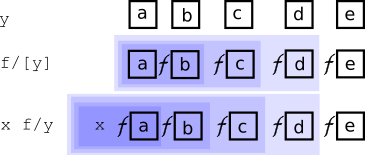

# Accumulators

<div markdown="1" class="typewriter">
[Converge  (v1\\)x    v1\\[x]](#converge)       [v1 scan x](#keywords-scan-and-over)
          [(v1/)x    v1/[x]](#converge)       [v1 over x](#keywords-scan-and-over)

[Do        n v1\\x    v1\\[n;x]](#do)
          [n v1/x    v1/[n;x]](#do)

[While     t v1\\x    v1\\[t;x]](#while)
          [t v1/x    v1/[t;x]](#while)

[Scan      (v2\\)x    v2\\[x]](#unary-application "binary value, unary application")      [(v2)scan x](#keywords-scan-and-over)
[Over      (v2/)x    v2/[x]](#unary-application "binary value, unary application")      [(v2)over x](#keywords-scan-and-over)

[Scan      x v2\\y    v2\\[x;y]](#binary-application "binary application")
[Over      x v2/y    v2/[x;y]](#binary-application "binary application")

[Scan                v3\\[x;y;z]](#ternary-values "ternary")   [x y\z](#alternative-syntax "alternative syntax")
[Over                v3/[x;y;z]](#ternary-values "ternary")

---------------------------------------
v1, v2, v3: applicable value (rank 1-3)
n:          integer≥0
t:          unary truth map
x, y:       arguments/indexes of v
</div>

An accumulator is an [iterator](iterators.md) that takes an [applicable value](../basics/glossary.md#applicable-value) as argument and derives a function that evaluates the value, first on its entire (first) argument, then on the results of **successive** evaluations.

There are two accumulators, Scan and Over. They have the same syntax and perform the same computation. But where the Scan-derived functions return the result of each evaluation, those of Over return only the last result.

Over resembles _map reduce_ in some other programming languages.

```q
q)(+\)2 3 4    / Scan
2 5 9
q)(+/)2 3 4    / Over
9
```

!!! tip "Debugging"

    If puzzled by the result of using Over, replace it with Scan and examine the intermediate results. They are usually illuminating.


!!! detail "Scan, Over and memory"

    While Scan and Over perform the same computation, in general, Over requires less memory, because it does not store intermediate results.

The number of successive evaluations is determined differently for unary and for higher-rank values.

The domain of the accumulators is functions, lists, and dictionaries that represent [finite-state machines](../basics/glossary.md#finite-state-machine).

```q
q)yrp                               / a European tour
from   to     wp
----------------
London Paris  0
Paris  Genoa  1
Genoa  Milan  1
Milan  Vienna 1
Vienna Berlin 1
Berlin London 0
q)show route:yrp[`from]!yrp[`to]    / finite-state machine
London| Paris
Paris | Genoa
Genoa | Milan
Milan | Vienna
Vienna| Berlin
Berlin| London
```


## Unary values

Syntax: `(v1\)x`, `(v1/)x`  unary application<br>
Syntax: `x v1\y`, `x v1/y`  binary application

The function an accumulator derives from a unary value is [variadic](../basics/variadic.md).
The result of the first evaluation is the right argument for the second evaluation. And so on.

!!! note "The value is evaluated on the entire right argument, not on items of it."

When applied as a binary, the number of evaluations the derived function performs is determined by its left argument, or (when applied as a unary) by convergence.

syntax           | name     | number of successive evaluations
-----------------|----------|---------------------------------------------
`(v1\)x`, `(v1/)x` | Converge | until two successive evaluations match, or an evaluation matches `x`
`i v1\x`, `i v1/x` | Do       | `i`, a non-negative integer
`t v1\x`, `t v1/x` | While    | until unary value `t`, evaluated on the result, returns 0


### Converge

<div markdown="1" style="float: right; font-style: italic; font-size: 80%; margin-left: 1em; text-align: center; width: 150px">
[](../img/snakes.jpg)
Are we there yet?
</div>

```q
q)(neg\)1                                 / Converge
1 -1
q)l:-10?10
q)(l\)iasc l
4 0 8 5 7 2 6 3 1 9
0 1 2 3 4 5 6 7 8 9
1 8 5 7 0 3 6 4 2 9
8 2 3 4 1 7 6 0 5 9
2 5 7 0 8 4 6 1 3 9
5 3 4 1 2 0 6 8 7 9
3 7 0 8 5 1 6 2 4 9
7 4 1 2 3 8 6 5 0 9
q)(rotate[1]\)"abcd"
"abcd"
"bcda"
"cdab"
"dabc"
q)({x*x}\)0.1
0.1 0.01 0.0001 1e-08 1e-16 1e-32 1e-64 1e-128 1e-256 0
q)(route\)`Genoa                          / a circular tour
`Genoa`Milan`Vienna`Berlin`London`Paris
q)(not/) 42                               / never returns!
```

Matching is governed by [comparison tolerance](../basics/precision.md#comparison-tolerance).


### Do

```q
q)dbl:2*
q)3 dbl\2 7                                / Do
2  7
4  14
8  28
16 56
q)5 enlist\1
1
,1
,,1
,,,1
,,,,1
,,,,,1

q)5(`f;)\1
1
(`f;1)
(`f;(`f;1))
(`f;(`f;(`f;1)))
(`f;(`f;(`f;(`f;1))))
(`f;(`f;(`f;(`f;(`f;1)))))
q)/first 10+2 numbers of Fibonacci sequence
q)10{x,sum -2#x}/0 1                       / derived binary applied infix
0 1 1 2 3 5 8 13 21 34 55 89
q)/first n+2 numbers of Fibonacci sequence
q)fibonacci:{x,sum -2#x}/[;0 1]            / projection of derived function
q)fibonacci 10
0 1 1 2 3 5 8 13 21 34 55 89
q)m:(0 1f;1 1f)
q)10 (m mmu)\1 1f                          / first 10 Fibonacci numbers
1  1
1  2
2  3
3  5
5  8
8  13
13 21
21 34
34 55
55 89
89 144
q)3 route\`London                          / 3 legs of the tour
`London`Paris`Genoa`Milan
```

A form of the conditional:

```q
q)("j"$a=b) foo/bar                        / ?[a=b;foo bar;bar]
```


### While

```q
q)(10>)dbl\2                               / While
2 4 8 16
q){x<1000}{x+x}\2
2 4 8 16 32 64 128 256 512 1024
q)inc:1+
q)inc\[105>;100]
100 101 102 103 104 105
q)inc\[105>sum@;84 20]
84 20
85 21
q)(`Berlin<>)route\`Paris                  / Paris to Berlin
`Paris`Genoa`Milan`Vienna`Berlin
q)waypoints:(!/)yrp`from`wp
q)waypoints route\`Paris                   / Paris to the end
`Paris`Genoa`Milan`Vienna`Berlin
```

In the last example, both applicable values are dictionaries.


## Binary values

Syntax: `x v\y`, `x v/y`

The function an accumulator derived from a binary value is [variadic](../basics/variadic.md).
Functions derived by Scan are uniform; functions derived by Over are aggregates.
The number of evaluations is the count of the right argument.


<small>_Unary and binary application of f/_</small>


### Binary application

When the derived function is applied as a binary, the first evaluation applies the value to the function’s left argument and the first item of the its right argument, i.e. `m[x;first y]`. The result of this becomes the left argument in the next evaluation, for which the right argument is the second item of the right argument. And so on.

```q
q)1000+\2 3 4
1002 1005 1009
q)m                       / finite-state machine
1 6 4 4 2
2 7 2 0 5
7 5 6 7 0
2 1 8 1 0
7 3 3 6 8
2 3 8 9 0
1 1 9 6 9
7 8 4 3 0
4 5 8 0 4
9 8 0 3 9
q)c                       / columns of m
4 1 3 3 1 4
q)7 m\c
0 6 6 6 1 5
```

Items of `x` must be in the left domain of the value, and items of `y` in its right domain.


### Unary application

When the derived function is applied as a unary, and the value is **a function with a known identity element** $I$, then $I$ is taken as the left argument of the first evaluation.

```q
q)(,\)2 3 4        / I is ()
,2
2 3
2 3 4
```

In such cases `(I f\x)~(f\)x` and `(I f/x)~(f/)x` and items of `x` must be in the right domain of the value.

Otherwise, the first item of the right argument is taken as the result of the first evaluation.

```q
q){x,y}\[2 3 4]       / () not known as I
2
2 3
2 3 4
q)42{[x;y]x}\2 3 4    / 42 is the first left argument
42 42 42
q)({[x;y]x}\)2 3 4    / 2 is the first left argument
2 2 2
q)(m\)c               / c[0] is the first left argument
4 3 1 0 6 9
```

In this case, for `(v\)x` and `(v/)x)`

-   `x[0]` is in the _left_ domain of `v`
-   items `1_x` are in the _right_ domain of `v`

but `x[0]` need not be in the range of `v`.

```q
q)({count x,y}\)("The";"quick";"brown";"fox")
"The"
8
6
4
```


### Keywords `scan` and `over`

Mnemonic keywords `scan` and `over` can be used to apply a binary value to a list or dictionary.

!!! tip "Parenthesize an infix to pass it as a left argument."

```q
q)(+) over til 5           / (+/)til 5
10
q)(+) scan til 5           / (+\)til 5
0 1 3 6 10
q)m scan c                 / (m\)c
4 3 1 0 6 9
```

:fontawesome-regular-hand-point-right:
[`over`, `scan`](over.md)


## Ternary values

Syntax: `v\[x;y;z]`, `v/[x;y;z]`

The function an accumulator derives from an value of rank >2 has the same rank as the value.
Functions derived by Scan are uniform; functions derived by Over are aggregates.
The number of evaluations is the maximum of the count of the right arguments.

For `v\[x;y;z]` and `v/[x;y;z]`

-   `x` is in the left domain of `v`
-   `y` and `z` are atoms or conforming lists or dictionaries in the right domains of `v`

The first evaluation is `v[x;first y;first z]`. Its result becomes the left argument of the second evaluation. And so on. For `r:v\[x;y;z]`

```txt
r[0]: v[x  ; y 0; z 0]
r[1]: v[r 0; y 1; z 1]
r[2]: v[r 1; y 2; z 2]
…
```

The result of `v/[x;y;z]` is simply the last item of the above.

`v/[x;y;z]`

: <code>v[ v[… v[ v[x;y<sub>0</sub>;z<sub>0</sub>] ;y<sub>1</sub>;z<sub>1</sub>]; … y<sub>n-2</sub>;z<sub>n-2</sub>]; y<sub>n-1</sub>;z<sub>n-1</sub>]</code>

```q
q){x+y*z}\[1000;5 10 15 20;2 3 4 5]
1010 1040 1100 1200
q){x+y*z}\[1000 2000;5 10 15 20;3]
1015 2015
1045 2045
1090 2090
1150 2150
q)// Chinese whispers
q)s:"We are going to advance. Send reinforcements."
q)ssr\[s;("advance";"reinforcements");("a dance";"three and fourpence")]
"We are going to a dance. Send reinforcements."
"We are going to a dance. Send three and fourpence."
```

The above description of functions derived from ternary values applies by extension to values of higher ranks.


### Alternative syntax

As of V3.1 2013.07.07, Scan has a built-in function for the following.

```q
q)a:1000f;b:1 2 3 4f;c:5 6 7 8f
q){z+x*y}\[a;b;c]
1005 2016 6055 24228f
q)a b\c
1005 2016 6055 24228f
```

Note that the built-in version is for floats.


## Empty lists

!!! warning "Accumulators can change datatype"

In iterating through an empty list **the value is not evaluated.**
The result might not be in the range of the value.

Allow for a possible change of type to `0h` when scanning or reducing lists of unknown length.

```q
q)mt:0#0
q)type each (mt;*/[mt];{x*y}/[mt])  / Over can change type
7 -7 0h
q)type each (mt;*\[mt];{x*y}\[mt])  / so can Scan
7 -7 0h
```


### Scan

The function Scan derives from a non-unary value is a uniform function: for empty right argument/s it returns the generic empty list.
It does not evaluate the value.

```q
q)()~{x+y*z}\[`foo;mt;mt]           / lambda is not evaluated
1b
```


### Over

The function that Over derives from a non-unary value is an aggregate: it reduces lists and dictionaries to atoms.

For empty right argument/s the atom result depends on the value and, if the derived function is variadic, on how it is applied.

If the value is a **binary function with a known identity element** $I$, and the derived function is applied as a unary, the result is $I$.

```q
q)(+/)mt    / 0 is I for +
0
q)(*/)mt    / 1 is I for *
1
```

If the value is a **binary function with no known identity element**, and the derived function is applied as a unary, the result is `()`, the generic empty list.

```q
q)()~({x+y}/)mt
1b
```

If the value is a **list** and the derived function is applied as a unary, the result is an empty list of the same type as the list.

```q
q)type 1 0 3h/[til 0]
5h
q)type (3 4#til 12)/[0#0]
0h
```

Otherwise, the result is the left argument.

```q
q)42+/mt
42
q){x+y*z}/[42;mt;mt]
42
q)42 (3 4#til 12)/[0#0]
42
```

The value is not evaluated.

```q
q)`foo+/mt
`foo
q){x+y*z}/[`foo;mt;mt]
`foo
```

:fontawesome-solid-street-view:
_Q for Mortals_
[§6.7.6 Over (/) for Accumulation](/q4m3/6_Functions/#676-over-for-accumulation)
