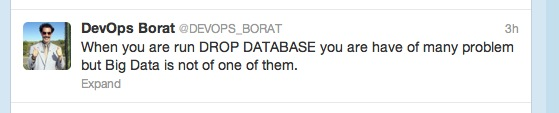

# `delete`, `!` Delete

_Delete rows or columns from a table, entries from a dictionary, or objects from a namespace_


## `delete` keyword

Syntax: `delete from t [where {cond}]`  
Syntax: `delete [cols] from t`  
Syntax: `delete [keys] from x`  
Syntax: `delete from x` 


### Table rows

Where 

-   `t` is a table
-   `{cond}` is a condition

deletes from `t` rows matching `{cond}`.

```q
q)show table: ([] a: `a`b`c; n: 1 2 3)
a n
---
a 1
b 2
c 3
q)show delete from table where a = `c
a n
---
a 1
b 2
```


### Table columns

Where

-   `t` is a table
-   `cols` a list of column names

deletes from `t` columns `cols`.

```q
q)show delete n from table
a
-
a
b
c
```


### Dictionary entries

Where

-   `x` is a dictionary
-   `keys` a list of keys to it

deletes from `x` entries for `keys`.

```q
q)show d:`a`b`c!til 3
a| 0
b| 1
c| 2
q)delete b from `d
`d
q)d
a| 0
c| 2
```


!!! warning "Cond is not supported inside q-SQL expressions"

    Enclose in a lambda or use [Vector Conditional](vector-conditional.md) instead.

    <i class="far fa-hand-point-right"></i>
    [q-SQL](../basics/qsql.md#cond)


### Namespace objects

Where

-   `x` is a namespace
-   `keys` a symbol atom or vector of name/s defined in it

deletes from `x` the named objects.

```q
q)a:1
q)\v
,`a
q)delete a from `.
`.
q)\v
`symbol$()
```


<i class="far fa-hand-point-right"></i>
[qSQL](../basics/qsql.md)


## `!` Delete operator

<i class="far fa-hand-point-right"></i>
[Functional Delete](../basics/funsql.md#delete)


[](https://twitter.com/devops_borat)
