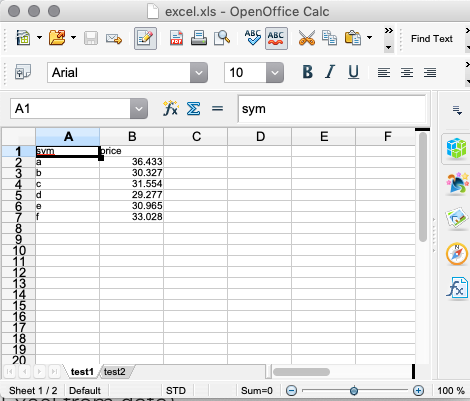

# :fontawesome-brands-html5: The `.h` namespace


_Markup tools_


<div markdown="1" class="typewriter">
[`.h.br`](#hbr-linebreak)      linebreak                [`.h.cd`](#hcd-csv-from-data)      CSV from data
[`.h.code`](#hcode-code-after-tab)    code after Tab           [`.h.d`](#hd-delimiter)       delimiter
[`.h.fram`](#hfram-frame)    frame                    [`.h.ed`](#hed-excel-from-data)      Excel from data
[`.h.ha`](#hha-anchor)      anchor                   [`.h.edsn`](#hedsn-excel-from-tables)    Excel from tables
[`.h.hb`](#hhb-anchor-target)      anchor target            [`.h.hc`](#hhc-escape-lt)      escape lt
[`.h.ht`](#hht-marqdown-to-html)      Marqdown to HTML         [`.h.hr`](#hhr-horizontal-rule)      horizontal rule
[`.h.hta`](#hhta-start-tag)     start tag                [`.h.iso8601`](#hiso8601-iso-timestamp) ISO timestamp
[`.h.htac`](#hhtac-element)    element                  [`.h.jx`](#hjx-table)      table
[`.h.htc`](#hhtc-element)     element                  [`.h.td`](#htd-tsv-from-data)      TSV from data
[`.h.html`](#hhtml-document)    document                 [`.h.tx`](#htx-filetypes)      filetypes
[`.h.http`](#hhttp-hyperlinks)    hyperlinks               [`.h.xd`](#hxd-xml)      XML
[`.h.nbr`](#hnbr-no-break)     no break                 [`.h.xs`](#hxs-xml-escape)      XML escape
[`.h.pre`](#hpre-pre)     pre                      [`.h.xt`](#hxt-json)      JSON
[`.h.text`](#htext-paragraphs)    paragraphs
[`.h.xmp`](#hxmp-xmp)     XMP

[`.h.he`](#hhe-http-400)      HTTP 400                 [`.h.c0`](#hc0-web-color)    web color
[`.h.hn`](#hhn-http-response)      HTTP response            [`.h.c1`](#hc1-web-color)    web color
[`.h.hp`](#hhp-http-response-pre)      HTTP response pre        [`.h.HOME`](#hhome-webserver-root)  webserver root
[`.h.hy`](#hhy-http-response-content)      HTTP response content    [`.h.logo`](#hlogo-kx-logo)  Kx logo
                                    [`.h.sa`](#hsa-anchor-style)    anchor style
[`.h.hu`](#hhu-uri-escape)      URI escape               [`.h.sb`](#hsb-body-style)    body style
[`.h.hug`](#hhug-uri-map)     URI map                  [`.h.ty`](#hty-mime-types)    MIME types
[`.h.sc`](#hsc-uri-safe)      URI-safe                 [`.h.val`](#hval-value)   value
[`.h.uh`](#huh-uri-unescape)      URI unescape
</div>

The `.h` [namespace](../basics/namespaces.md) contains objects for 

-   marking up strings as HTML
-   converting data into various formats
-   composing HTTP responses
-   web-console display

??? warning "The `.h` namespace is reserved for use by Kx, as are all single-letter namespaces."

    Consider all undocumented functions in the namespace as its private API | and do not use them.


## `.h.br` (linebreak)

HTML linebreak (string), defaults to `"<br>"`.


## `.h.c0` (web color)

Color used by the web console (symbol), defaults to `` `024C7E``.


## `.h.c1` (web color)

Color used by the web console (symbol), defaults to `` `958600``.


## `.h.cd` (CSV from data)

```txt
.h.cd x
```

Where `x` is a table or a list of columns returns a matrix of comma-separated values.

```q
q).h.cd ([]a:1 2 3;b:`x`y`z)
"a,b"
"1,x"
"2,y"
"3,z"

q).h.cd (`a`b`c;1 2 3;"xyz")
"a,1,x"
"b,2,y"
"c,3,z"
```

Columns can be nested vectors, in which case [`.h.d`](#hd-delimiter) is used to separate subitems. (Since V4.0 2020.03.17.)


## `.h.code` (code after Tab)

```txt
.h.code x
```

Where `x` is a string with embedded Tab characters, returns the string with alternating segments marked up as

-   plain text
-   `code` and `nobr`.

```q
q).h.code "foo\tbar"
"foo <code><nobr>bar</nobr></code>"
q).h.code "foo\tbar\tabc\tdef"
"foo <code><nobr>bar</nobr></code> abc <code><nobr>def</nobr></code>"
q).h.code "foo"
"foo"
```


## `.h.d` (delimiter)

Delimiter used by [`.h.cd`](#hcd-csv-from-data) to join subitems of nested lists. Default is `" "`.

```q
q)show t:([a:til 3]b:3 3#"abc";c:3 3#1 2 3)
a| b     c
-| -----------
0| "abc" 1 2 3
1| "abc" 1 2 3
2| "abc" 1 2 3

q).h.d
" "
q).h.cd t
"a,b,c"
"0,a b c,1 2 3"
"1,a b c,1 2 3"
"2,a b c,1 2 3"

q).h.d:"*"
q).h.cd t
"a,b,c"
"0,a*b*c,1*2*3"
"1,a*b*c,1*2*3"
"2,a*b*c,1*2*3"
```


## `.h.ed` (Excel from data)

```txt
.h.ed x
```

Where `x` is a table, returns as a list of strings the XML for an Excel workbook.

```q
q).h.ed ([]a:1 2 3;b:`x`y`z)
"<?xml version=\"1.0\"?><?mso-application progid=\"Excel.Sheet\"?>"
"<Workbook xmlns=\"urn:schemas-microsoft-com:office:spreadsheet\" xmlns:o=\"u..
```


## `.h.edsn` (Excel from tables)

```txt
.h.edsn x!y
```

Where

-   `x` is a symbol vector
-   `y` is a conformable list of tables

returns as a list of strings an XML document describing an Excel spreadsheet.

```q
q)show t1:([]sym:`a`b`c`d`e`f;price:36.433 30.327 31.554 29.277 30.965 33.028)
sym price
----------
a   36.433
b   30.327
c   31.554
d   29.277
e   30.965
f   33.028
q)show t2:([]sym:`a`b`c`d`e`f;price:30.0 40.0 50.0 60.0 70.0 80.0)
sym price
---------
a   30
b   40
c   50
d   60
e   70
f   80
q).h.edsn `test1`test2!(t1;t2)
"<?xml version=\"1.0\"?><?mso-application progid=\"Excel.Sheet\"?>"
"<Workbook xmlns=\"urn:schemas-microsoft-com:office:spreadsheet\" xmlns:ss=\"..
q)`:/Users/sjt/tmp/excel.xls 0: .h.edsn `test1`test2!(t1;t2)
`:/Users/sjt/tmp/excel.xls
```




## `.h.fram` (frame)

_HTML page with two frames_

```txt
.h.fram[t;s;(l;r)]
```

Where

-   `t` is the page title (string)
-   `s` is a list of strings
-   `l` and `r` are respectively the sources of the left and right frames (strings)

returns as a string an HTML page with two frames in a frameset wide enough to accommodate the lines of `s`.

Example: suppose `tmp.htm` contains the content for the first frame.

```q
q)`tmp.txt: 0:0N!s:" "sv'2#''string 5 10#50?100
"12 10 11 90 73 90 43 90 84 63"
"93 54 38 97 88 58 68 45 22 39"
"64 49 82 40 88 77 30 17 23 12"
"66 36 37 44 28 20 30 34 77 61"
"70 36 12 97 92 99 45 83 94 88"
q).h.fram["Five rows";s;("tmpl.htm";"tmp.txt")]
"<html><head><title>Five rows</title><frameset cols=\"316,*\"><frame
src=\"tmp.htm\"><frame name=v src=\"tmp.txt\"></frameset></head></html>"
```


## `.h.ha` (anchor)

```txt
.h.ha[x;y]
```

Where `x` is the `href` attribute as a symbol atom or a string, and `y` is the link text as a string, returns as a string an HTML `A` element.

```q
q).h.ha[`http://www.example.com;"Example.com Main Page"]
"<a href=http://www.example.com>Example.com Main Page</a>"
q).h.ha["http://www.example.com";"Example.com Main Page"]
"<a href=\"http://www.example.com\">Example.com Main Page</a>"
```


## `.h.hb` (anchor target)

```txt
.h.hb[x;y]
```

Same as `.h.ha`, but adds a `target=v` attribute to the tag.

```q
q).h.hb["http://www.example.com";"Example.com Main Page"]
"<a target=v href=\"http://www.example.com\">Example.com Main Page</a>"
```


## `.h.hc` (escape lt)

```txt
.h.hc x
```

Where `x` is a string, returns `x` with any `<` chars escaped.

```q
q).h.hc "<foo>"
"&lt;foo>"
```


## `.h.he` (HTTP 400)

```txt
.h.he x
```

Where `x` is a string, escapes `"<"` characters, adds a `"'"` at the front, and returns an HTTP 400 error (Bad Request) with that content.

```q
q).h.he "<rubbish>"
"HTTP/1.1 400 Bad Request\r\nContent-Type: text/plain\r\nConnection: close\r\..
```


## `.h.hn` (HTTP response)

```txt
.h.hn[x;y;z]
```

Where

-   `x` is the [status code](https://en.wikipedia.org/wiki/List_of_HTTP_status_codes) (string)
-   `y` is the [content type](#hty-mime-types) (symbol)
-   `z` is the content (string)

returns as a string an HTTP error response.

```q
q).h.hn["404";`txt;"Not found: favicon.ico"]
"HTTP/1.1 404\r\nContent-Type: text/plain\r\nConnection: close\r\nContent-Len..
```
:fontawesome-regular-hand-point-right:
[`.h.ty` MIME types](#hty-mime-types)


## `.h.hp` (HTTP response pre)

```txt
.h.hp x
```

Where `x` is a list of strings, returns as a string a valid HTTP response displaying them as a `pre` element in an HTML document.

```q
q)1 .h.hp" "sv'2#''string 5 10#50?100;
HTTP/1.1 200 OK
Content-Type: text/html
Connection: close
Content-Length: 257

<html><head><style>body{font:10pt verdana;text-align:justify}</style></head><body><pre>89 97 11 99 33 77 98 30 22 15
28 17 11 55 51 81 68 96 61 70
70 39 76 26 91 83 76 88 44 56
32 30 97 31 96 53 47 65 34 50
96 99 13 72 81 70 33 99 56 12
</pre></body></html>
```


## `.h.hr` (horizontal rule)

```txt
.h.hr x
```

Where `x` is a string, returns a string of the same length filled with `"-"`.
```q
q).h.hr "foo"
"---"
```


## `.h.ht` (Marqdown to HTML)

```txt
.h.ht x
```

HTML documentation generator: <!-- for <https://kx.com/q/d/> -->
where `x` is a symbol atom, reads file `:src/x.txt` and writes file `:x.htm`.
(Marqdown is a rudimentary form of Markdown.)

- edit `src/mydoc.txt`
- ``q).h.ht`mydoc``
- browse `mydoc.htm` (`a/_mydoc.htm` is navigation frame, `a/mydoc.htm` is content frame)

Basic Marqdown formatting rules:

- Paragraph text starts at the beginning of the line.
- Lines beginning with `"."` are treated as section headings.
- Lines beginning with `"\t"` get wrapped in `code` tags
- Line data beginning with `" "` get wrapped in `xmp` tags
- If second line of data starts with `"-"`, draw a horizontal rule to format the header
- Aligns two-column data if 2nd column starts with `"\t "`


## `.h.hta` (start tag)

```txt
.h.hta[x;y]
```

Where `x` is the element as a symbol atom, and `y` is a dictionary of attributes and values, returns as a string an opening HTML tag for element `x`.

```q
q).h.hta[`a;(`href`target)!("http://www.example.com";"_blank")]
"<a href=\"http://www.example.com\" target=\"_blank\">"
```


## `.h.htac` (element)

```txt
.h.htac[x;y;z]
```

Where `x` is the element as a symbol atom, `y` is a dictionary of attributes and their values, and `z` is the content of the node as a string, returns as a string the HTML element.

```q
q).h.htac[`a;(`href`target)!("http://www.example.com";"_blank");"Example.com Main Page"]
"<a href=\"http://www.example.com\" target=\"_blank\">Example.com Main Page</..
```


## `.h.htc` (element)

```txt
.h.htc[x;y]
```

Where `x` is the HTML element as a symbol atom, and `y` is the content of the node as a string, returns as a string the HTML node.

```q
q).h.htc[`tag;"value"]
"<tag>value</tag>"
```


## `.h.html` (document)

```txt
.h.html x
```

Where `x` is the body of an HTML document as a string, returns as a string an HTML document with fixed style rules.

```html
<html>
  <head>
    <style>
      a{text-decoration:none}a:link{color:024C7E}a:visited{color:024C7E}a:active{color:958600}body{font:10pt verdana;text-align:justify}
    </style>
   </head>
   <body>
     BODY
   </body>
</html>
```

```q
q).h.html "<p>Hello world!</p>"
"<html><head><style>a{text-decoration:none}a:link{color:024C7E}a:visited{colo..
```


## `.h.http` (hyperlinks)

```txt
.h.http x
```

Where `x` is a string, returns `x` with embedded URLs beginning `"http://"` converted to HTML hyperlinks.

```q
q).h.http "The main page is http://www.example.com"
"The main page is <a href=\"http://www.example.com\">http://www.example.com</..
```


## `.h.hu` (URI escape)

```txt
.h.hu x
```

Where `x` is a string, returns `x` with URI-unsafe characters replaced with safe equivalents.

```q
q).h.hu "http://www.kx.com"
"http%3a%2f%2fwww.kx.com"
```


## `.h.hug` (URI map)

```txt
.h.hug x
```

Where `x` is a char vector, returns a mapping from characters to `%`*xx* escape sequences *except* for the chars in `x`, which get mapped to themselves.


## `.h.hy` (HTTP response content)

```txt
.h.hy[x;y]
```

Where

-   `x` is an HTTP content type as a symbol atom
-   `y` is a string 

returns as a string an HTTP response for `y` as content-type `x`.

```q
q)show t:([]idx: 1 2 3 4 5;val: `a`b`c`d`e)
idx val
-------
1   a
2   b
3   c
4   d
5   e
q)show r: .h.hy[`json] .j.j 0! select count i by val from t
"HTTP/1.1 200 OK\r\nContent-Type: application/json\r\nConnection: close\r\nCo..
q)`:test.txt 0: enlist r
`:test.txt
q)\head test.txt
"HTTP/1.1 200 OK"
"Content-Type: application/json"
"Connection: close"
"Content-Length: 99"
""
"[{\"val\":\"a\",\"x\":1},"
" {\"val\":\"b\",\"x\":1},"
" {\"val\":\"c\",\"x\":1},"
" {\"val\":\"d\",\"x\":1},"
" {\"val\":\"e\",\"x\":1}]"
```


## `.h.HOME` (webserver root)

String: location of the webserver root.

:fontawesome-solid-graduation-cap:
[Customizing the default webserver](../kb/custom-web.md)


## `.h.iso8601` (ISO timestamp)

```txt
.h.iso8601 x
```

Where `x` is nanoseconds since 2000.01.01 as an int atom, returns as a string a timestamp in ISO-8601 format.

```q
q).h.iso8601 100
"2000-01-01T00:00:00.000000100"
```


## `.h.jx` (table)

```txt
.h.jx[x;y]
```

Where `x` is an int atom, and `y` is the name of a table, returns a list of strings representing the records of `y`, starting from row `x`.

```q
q)a:([] a:100*til 1000;b:1000?1000;c:1000?1000)
q){(where x="<")_x}first .h.jx[0;`a]
"<a href=\"?[0\">home"
"</a> "
"<a href=\"?[0\">up"
"</a> "
"<a href=\"?[32\">down"
"</a> "
"<a href=\"?[968\">end"
"</a> 1000[0]"
q)1_.h.jx[5;`a]
""
"a    b   c  "
"------------"
"500  904 34 "
"600  251 912"
"700  584 388"
"800  810 873"
"900  729 430"
"1000 210 148"
"1100 645 499"
"1200 898 285"
"1300 20  279"
"1400 686 267"
"1500 894 668"
"1600 879 611"
"1700 350 352"
"1800 254 600"
"1900 145 257"
"2000 666 101"
"2100 757 132"
"2200 601 910"
"2300 794 637"
..
```


## `.h.logo` (Kx logo)

String: defaults to the Kx logo in HTML format.


## `.h.nbr` (no break)

```txt
.h.nbr x
```

Where `x` is a string, returns `x` as the content of a `nobr` element.

```q
q).h.nbr "foo bar"
"<nobr>foo bar</nobr>"
```


## `.h.pre` (pre)

```txt
.h.pre x
```

Where `x` is a list of strings, returns `x` as a string with embedded newlines with a `pre` HTML element.

```q
q).h.pre("foo";"bar")
"<pre>foo\nbar\n</pre>"
```


## `.h.sa` (anchor style)

String: CSS style rules used in the web console for anchor elements.

```q
q).h.sa
"a{text-decoration:none}a:link{color:024C7E}a:visited{color:024C7E}a:active{c..
```


## `.h.sb` (body-style)

String: CSS style rules used in the web console for the HTML body.

```q
q).h.sb
"body{font:10pt verdana;text-align:justify}"
```


## `.h.sc` (URI-safe)

String: characters that do not need to be escaped in URIs.

```q
q).h.sc
"$-.+!*'(),abcdefghijklmnopqrstuvwxyzABCDEFGHIJKLMNOPQRSTUVWXYZ_0123456789"
```

:fontawesome-solid-hand-point-right:
[`.h.hu`](#hhu-uri-escape)


## `.h.td` (TSV from data)

```txt
.h.td x
```

Where `x` is a table, returns it as a list of tab-separated value strings

```q
q).h.td ([]a:1 2 3;b:`x`y`z)
"a\tb"
"1\tx"
"2\ty"
"3\tz"
```


## `.h.text` (paragraphs)

```txt
.h.text x
```

Where `x` is a list of strings, returns as a string, `x` with each item as the content of a `p` element.

```q
q).h.text("foo";"bar")
"<p>foo</p>\n<p>bar</p>\n"
```


## `.h.tx` (filetypes)

Dictionary of file types and corresponding conversion functions (`.h.cd`, `.h.td`, `.h.xd`, `.h.ed`).

```q
q).h.tx
raw | ,:
json| k){$[10=abs t:@x;s@,/{$[x in r:"\t\n\r\"\\";"\\","tnr\"\\"r?x;x]}'x;(::..
csv | k){.q.csv 0:x}
txt | k){"\t"0:x}
xml | k){g:{(#*y)#'(,,"<",x),y,,,"</",x:($x),">"};(,"<R>"),(,/'+g[`r]@,/(!x)g..
xls | k){ex eb es[`Sheet1]x}
```

??? detail "Streaming and static JSON"

    The result of ``.h.tx[`json]`` is designed for streaming as [JSON Lines](http://jsonlines.org/). For static JSON, enlist its argument:

    <pre><code class="language-q">
    q).h.tx[`json] ([] 0 1)  / JSON Lines
    "{\"x\":0}"
    "{\"x\":1}"
    q).h.tx[`json] enlist ([] 0 1) / static JSON
    "[{\"x\":0},\n {\"x\":1}]"
    q)show t:flip`items`sales`prices!(`nut`bolt`cam`cog;6 8 0 3;10 20 15 20)
    items sales prices
    ------------------
    nut   6     10
    bolt  8     20
    cam   0     15
    cog   3     20
    q).h.tx[`json] t  / JSON Lines
    "{\"items\":\"nut\",\"sales\":6,\"prices\":10}"
    "{\"items\":\"bolt\",\"sales\":8,\"prices\":20}"
    "{\"items\":\"cam\",\"sales\":0,\"prices\":15}"
    "{\"items\":\"cog\",\"sales\":3,\"prices\":20}"
    q).h.tx[`json] enlist t // static JSON
    "[{\"items\":\"nut\",\"sales\":6,\"prices\":10},\n {\"items\":\"bolt\",\"sale..
    </code></pre>


## `.h.ty` (MIME types)

Dictionary of content types and corresponding [media types](https://en.wikipedia.org/wiki/MIME "Wikipedia").

```q
q).h.ty
htm | "text/html"
html| "text/html"
csv | "text/comma-separated-values"
txt | "text/plain"
xml | "text/plain"
xls | "application/msexcel"
gif | "image/gif"
..
```


## `.h.uh` (URI unescape)

```txt
.h.uh x
```

Where `x` is a string, returns `x` with `%`*xx* hex sequences replaced with character equivalents.

```q
q).h.uh "http%3a%2f%2fwww.kx.com"
"http://www.kx.com"
```


## `.h.val` (value)

```txt
.h.val x
```

`.h.val` is called by [`.z.ph`](dotz.md#zph-http-get) to evaluate a request to the server.

Its default value is [`value`](value.md).
Users can override this with a custom evaluation function.

Since V3.6 and V3.5 2019.11.13.


## `.h.xd` (XML)

```txt
.h.xd x
```

Where `x` is a table, returns as a list of strings, `x` as an XML table.

```q
q).h.xd ([]a:1 2 3;b:`x`y`z)
"<R>"
"<r><a>1</a><b>x</b></r>"
"<r><a>2</a><b>y</b></r>"
"<r><a>3</a><b>z</b></r>"
"</R>"
```


## `.h.xmp` (XMP)

```txt
.h.xmp x
```

Where `x` is a list of strings, returns as a string `x` as the newline-separated content of an HTML `xmp` element.

```q
q).h.xmp("foo";"bar")
"<xmp>foo\nbar\n</xmp>"
```


## `.h.xs` (XML escape)

```txt
.h.xs x
```

Where `x` is a string, returns `x` with characters XML-escaped where necessary.

```q
q).h.xs "Arthur & Co."
"Arthur &amp; Co."
```


## `.h.xt` (JSON)

```txt
.h.xt[x;y]
```

Where `x` is `` `json`` and `y` is a list of JSON strings, returns `y` as a list of dictionaries.

```q
q).h.xt[`json;("{\"foo\":\"bar\"}";"{\"this\":\"that\"}")]
(,`foo)!,"bar"
(,`this)!,"that"
q)first .h.xt[`json;("{\"foo\":\"bar\"}";"{\"this\":\"that\"}")]
foo| "bar"
```

