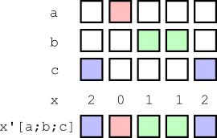

# Map iterators

<pre markdown="1" class="language-txt">
map                        rank
 [Each](#each)           v'       same as v    [each](#each-keyword)
 [Each Left](#each-left-and-each-right)      v2\:        2
 [Each Right](#each-left-and-each-right)     v2/:        2
 [Each Parallel](#each-parallel)  v1':        1         [peach](#peach-keyword)
 [Each Prior](#each-prior)     v2':     variadic     [prior](#prior-keyword)
 [Case](#case)           i'        1+max i

-------------------------------------------------------------------
v1: value (rank 1)         v: value (rank 1-8)
v2: value (rank 2)         i: vector of ints≥0
</pre>

The maps are iterators that derive [**uniform**](../basics/glossary.md#uniform-function) functions that apply their [values](../basics/glossary.md#applicable-value) once to each item of a dictionary, a list, or conforming lists. 


## Each

_Apply a value item-wise to a dictionary, list, or conforming lists and/or dictionaries._

```txt
(v1')x    v1'[x]       v1 each x
x v2'y    v2'[x;y]
          v3'[x;y;z]
```

Where `v` is an applicable value, `v'` applies `v` to each item of a list, dictionary or to corresponding items of conforming lists. The derived function has the same rank as `v`. 

```q
q)(count')`a`b`c!(1 2 3;4 5;6 7 8 9)        / unary 
a| 3
b| 2
c| 4
```


<div markdown="1" style="float: right; margin-left: 1em; text-align: center;">
  
<small>_Each Both_</small>
</div>

Each applied to a binary value is sometimes called _each both_ and can be applied infix.

```q
q)1 2 3 in'(1 0 1;til 100;5 6 7)  / in' is binary, infix 
110b
```

Iterations of ternary and higher-rank values are applied with brackets.

```q
q){x+y*z}'[1000000;1 0 1;5000 6000 7000]    / ternary
1005000 1000000 1007000
```

!!! warning "Each is redundant with [atomic functions](../basics/atomic.md). (Common qbie mistake.)"


### `each` keyword

The mnemonic keyword [`each`](each.md) can be used to apply a unary value without parentheses or brackets.

```q
q)count each string `Clash`Fixx`The`Who
5 4 3 3
```


## Each Left and Each Right

_Apply a binary value between one argument and each item of the other._

```txt
Each Left     x v2\: y    v2\:[x;y]   |->   v2[;y] each x
Each Right    x v2/: y    v2/:[x;y]   |->   v2[x;] each y
```

The maps Each Left and Each Right take **binary** values and derive binary functions that pair one argument to each item of the other. Effectively, the map projects its value on one argument and applies Each.

&nbsp;      | Each Left                        | Each Right
------------|:--------------------------------:|:-----------------:
syntax:     | `x f\:y`                         |  `x f/:y`
equivalent: | `f[;y] each x`                      | `f[x;] each y`
&nbsp;      |  | 

```q
q)"abcde",\:"XY"             / Each Left
"aXY"
"bXY"
"cXY"
"dXY"
"eXY"
q)"abcde",/:"XY"             / Each Right
"abcdeX"
"abcdeY"
q)m                          / binary map
"abcd"
"efgh"
"ijkl"
q)m[0 1;2 3] ~ 0 1 m\:2 3
1b
q)0 1 m/:2 3
"cg"
"dh"
q)(flip m[0 1;2 3]) ~ 0 1 m/:2 3
1b
```


### Left, right, `cross`

Each Left combined with Each Right resembles the result obtained by [`cross`](cross.md).

```q
q)show a:{x,/:\:x}til 3
0 0 0 1 0 2
1 0 1 1 1 2
2 0 2 1 2 2
q)show b:{x cross x}til 3
0 0
0 1
0 2
1 0
1 1
1 2
2 0
2 1
2 2
q){}0N!a
((0 0;0 1;0 2);(1 0;1 1;1 2);(2 0;2 1;2 2))
q){}0N!b
(0 0;0 1;0 2;1 0;1 1;1 2;2 0;2 1;2 2)
q)raze[a] ~ b
1b
```

!!! warning "Atoms and lists in the domains of these iterators"

    The domains of `\:` and `/:` extend beyond binary values to include certain atoms and lists. 

    <pre><code class="language-q">
    q)(", "/:)("quick";"brown";"foxes") 
    "quick, brown, foxes"
    q)(0x0\:)3.14156
    0x400921ea35935fc4
    </code></pre>

    This is [exposed infrastructure](../basics/exposed-infrastructure.md).
    Use the keywords [`vs`](vs.md) and [`sv`](sv.md) instead.


## Each Parallel

<div markdown="1" style="float: right; margin-left: 1em;">

</div>

_Assign sublists of the argument list to secondary tasks, in which the unary value is applied to each item of the sublist._

```txt
(v1':)x   v1':[x]   v1 peach x
```

The Each Parallel map takes a **unary** value as argument and derives a unary function. The iteration `v1':` divides its list or dictionary argument `x` between [available secondary tasks](../basics/cmdline.md#-s-secondary-threads). Each secondary task applies `v1` to each item of its sublist. 

:fontawesome-solid-book-open: 
[Command-line option `-s`](../basics/cmdline.md#-s-secondary-threads), 
[Parallel processing](../basics/peach.md)

```bash
$ q -s 2
KDB+ 3.4 2016.06.14 Copyright (C) 1993-2016 Kx Systems
m32/ 2()core 4096MB sjt mark.local 192.168.0.17 NONEXPIRE
```

```q
q)\t ({sum exp x?1.0}' )2#1000000  / each
185
q)\t ({sum exp x?1.0}':)2#1000000  / peach
79
```


### `peach` keyword

The binary keyword [`peach`](each.md) can be used as a mnemonic alternative.
The following are equivalent.

```q
v1':[list]
(v1':)list
v1 peach list
```

!!! tip "Higher-rank values"

    To parallelize a value of rank >1, use [Apply](apply.md) to evaluate it on a list of arguments.

    Alternatively, define the value as a function that takes a parameter dictionary as argument, and pass the derived function a table of parameters to evaluate.


## Each Prior

<div markdown="1" style="float: right; margin-left: 1em; z-index: 3">

</div>

_Apply a binary value between each item of a list and its preceding item._

```txt
(v2':)x    v2':[x]      (v2)prior x
x v2':y    v2':[x;y]   
```

The Each Prior map takes a **binary** value and derives a variadic function.
The derived function applies the value between each item of a list or dictionary and the item prior to it.

```q
q)(-':)1 1 2 3 5 8 13
1 0 1 1 2 3 5
```

The first item of a list has, by definition, no prior item. 
If the derived function is applied as a binary, its left argument is taken as the ‘seed’ – the value preceding the first item. 

```q
q)1950 -': `S`J`C!1952 1954 1960
S| 2
J| 2
C| 6
```

If the derived function is applied as a unary, and the value is an operator with an identity element $I$ known to q, $I$ will be used as the seed.

```q
q)(*':)2 3 4                        / 1 is I for *
2 6 12
q)(,':)2 3 4                        / () is I for ,
2
3 2
4 3
q)(-':) `S`J`C!1952 1954 1960       / 0 is I for -
S| 1952
J| 2
C| 6
```

If the derived function is applied as a unary, and the value is not an operator with a known identity element, a null of the same type as the argument (`first 0#x`) is used as the seed.

```q
q){x+2*y}':[2 3 4]
0N 7 10
```

:fontawesome-solid-street-view:
_Q for Mortals_
[§6.7.9 Each Prior](/q4m3/6_Functions/#679-each-prior)


### `prior` keyword

The mnemonic keyword [`prior`](prior.md) can be used as an alternative to `':`.

```q
q)(-':) 5 16 42 103
5 11 26 61
q)(-) prior 5 16 42 103
5 11 26 61
q)deltas 5 16 42 103
5 11 26 61
```


## Case

_Pick successive items from multiple list arguments: the left argument of the iterator determines from which of the arguments each item is picked._

Syntax: `int'[a;b;c;…]`  

Where 

-   `int` is an integer vector
-   $args$ `[a;b;c;…]` are the arguments to the derived function

the derived function `int'` returns $r$ such that 
$r_i$ is ($args_{int_i})_i$



The derived function `int'` has rank `max[int]+1`. 

Atom arguments are treated as infinitely-repeated values.

```q
q)0 1 0'["abc";"xyz"]
"ayc"
q)e:`one`two`three`four`five
q)f:`un`deux`trois`quatre`cinq
q)g:`eins`zwei`drei`vier`funf
q)l:`English`French`German
q)l?`German`English`French`French`German
2 0 1 1 2
q)(l?`German`English`French`French`German)'[e;f;g]
`eins`two`trois`quatre`funf

q)/extra arguments don't signal a rank error
q)0 2 0'["abc";"xyz";"123";"789"]
"a2c"
q)0 1 0'["a";"xyz"]  /atom "a" repeated as needed
"aya"
```

You can use Case to select between record fields according to a test on some other field. 

Suppose we have lists `h` and `o` of home and office phone numbers, and a third list `p` indicating at which number the subject prefers to be called. 

```q
q)([]pref: p;home: h; office: o; call: (`home`office?p)'[h;o])
pref   home             office           call
---------------------------------------------------------
home   "(973)-902-8196" "(431)-158-8403" "(973)-902-8196"
office "(448)-242-6173" "(123)-993-9804" "(123)-993-9804"
office "(649)-678-6937" "(577)-671-6744" "(577)-671-6744"
home   "(677)-200-5231" "(546)-864-5636" "(677)-200-5231"
home   "(463)-653-5120" "(636)-437-2336" "(463)-653-5120"
```

Case is a map. 
Consider the iteration’s arguments as a matrix, of which each row corresponds to an argument.

```q
q)a:`Kuh`Hund`Katte`Fisch
q)b:`vache`chien`chat`poisson
q)c:`cow`dog`cat`fish
q)show m:(a;b;c)
Kuh   Hund  Katte Fisch
vache chien chat  poisson
cow   dog   cat   fish
```

Case iterates the int vector as a mapping from column number to row number.
It is a simple form of scattered indexing. 

```q
q)i:0 1 0 2
q)i,'til count i
0 0
1 1
0 2
2 3
q)m ./:i,'til count i
`Kuh`chien`Katte`fish
q)i'[a;b;c]
`Kuh`chien`Katte`fish
```

:fontawesome-solid-graduation-cap:
[Table counts in a partitioned database](../kb/partition.md#table-counts)


## Empty lists

A map’s derived function is uniform. Applied to an empty right argument it returns an empty list _without an evaluation_.

```q
q)()~{x+y*z}'[`foo;mt;mt]    / generic empty list ()
1b
```

!!! warning "Watch out for type changes when evaluating lists of unknown length."

```q
q)type (2*')til 5
7h
q)type (2*')til 0
0h
q)type (2*)til 0
7h
```


