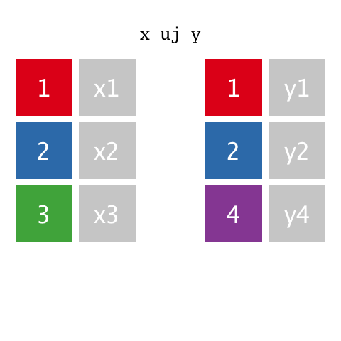

<div markdown="1" style="float:right; margin-left: 3em; max-width: 250px;">
 
</div>

# `uj`, `ujf` 


_Union join_

Syntax: `t1 uj t2`, `uj[t1;t2]`  
Syntax: `t1 ujf t2`, `ujf[t1;t2]`

Where `t1` and `t2` are keyed tables, returns the union of the columns, filled with nulls where necessary:

-   if `t1` and `t2` have matching key column/s, then records in `t2` update matching records in `t1`
-   otherwise, `t2` records are inserted.

```q
q)show s:([]a:1 2;b:2 3;c:5 7)
a b c
-----
1 2 5
2 3 7
q)show t:([]a:1 2 3;b:2 3 7;c:10 20 30;d:"ABC")
a b c  d
--------
1 2 10 A
2 3 20 B
3 7 30 C
q)s,t                            / tables do not conform for ,
'mismatch
q)s uj t                         / simple, so second table is inserted
a b c  d
--------
1 2 5
2 3 7
1 2 10 A
2 3 20 B
3 7 30 C
q)(2!s) uj 2!t                   / keyed, so matching records are updated
a b| c  d
---| ----
1 2| 10 A
2 3| 20 B
3 7| 30 C
```

!!! note "`uj` generalizes the [`,` Join](join.md) operator."


## Changes in V3.0

The union join of two keyed tables is equivalent to a [left join](lj.md) of the two tables with the catenation of unmatched rows from the second table. 

As a result a change in the behaviour of `lj` causes a change in the behaviour of `uj`:

```q
q)show x:([a:1 2]b:`x`y;c:10 20)
a| b c
-| ----
1| x 10
2| y 20
q)show y:([a:1 2]b:``z;c:1 0N)
a| b c
-| ---
1|   1
2| z
q)x uj y		/ kdb+ 3.0
a| b c
-| ---
1|   1
2| z
q)x uj y        / kdb+ 2.8
a| b c
-| ----
1| x 1
2| z 20
```

Since 2017.04.10, the earlier version is available in all V3.5 and later versions as `ujf`.


<i class="far fa-hand-point-right"></i> 
Basics: [Joins](../basics/joins.md)

