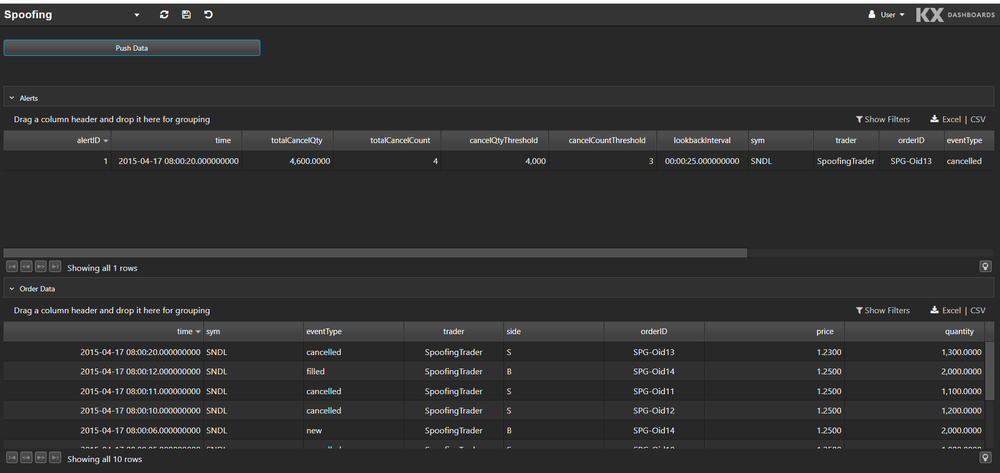
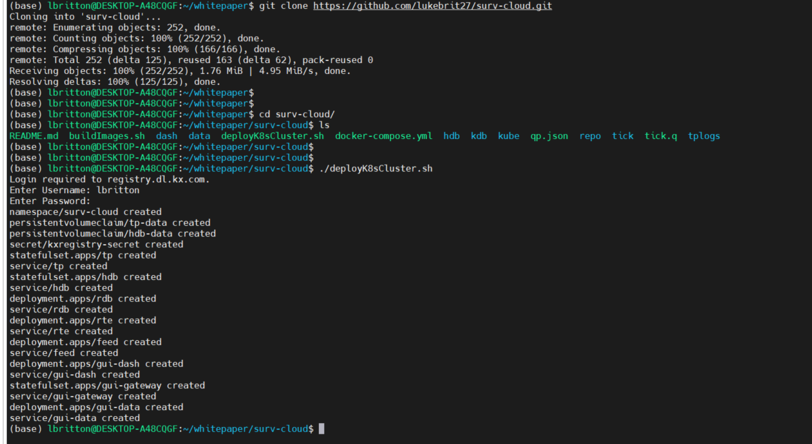
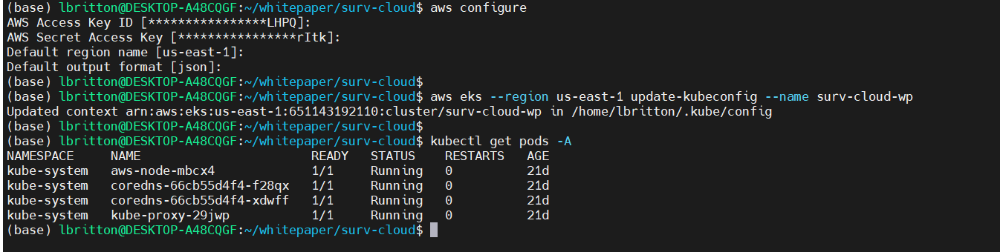
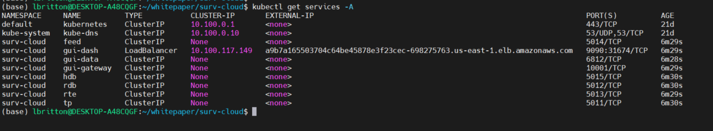
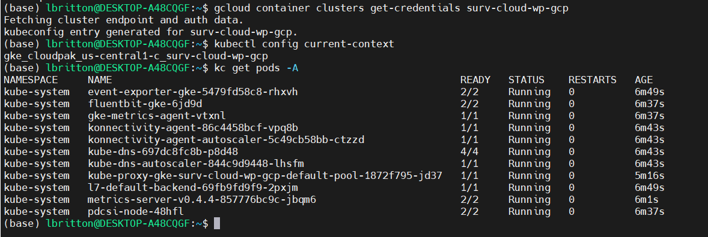
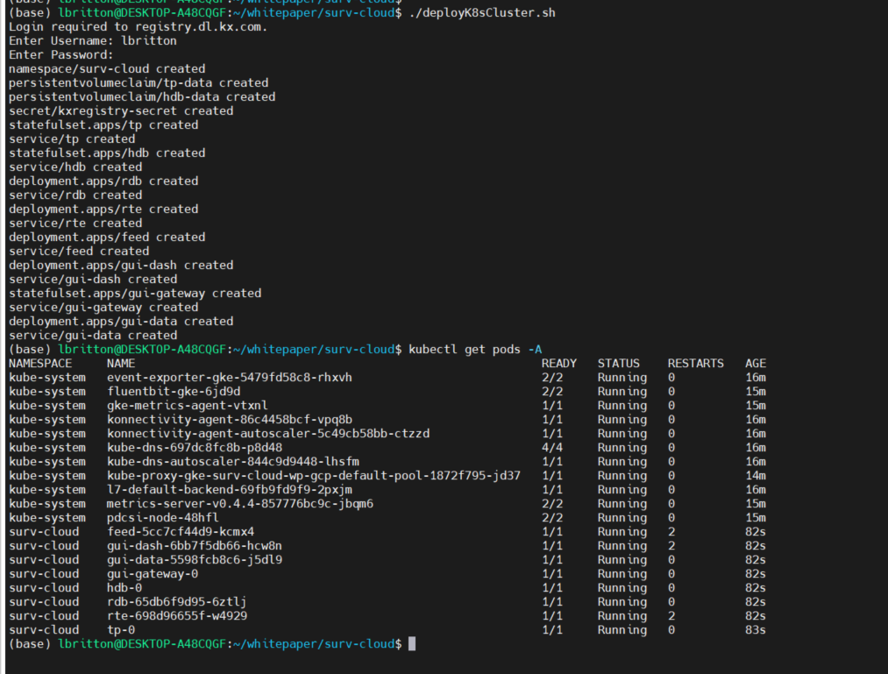
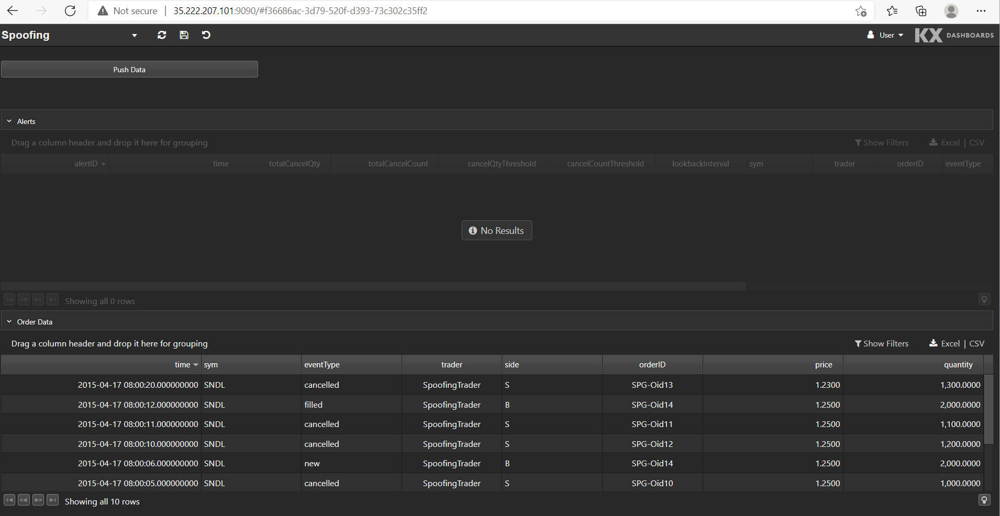

---
author: Luke Britton
title: Surveillance in the Cloud
description: Trade surveillance systems analyze up to terabytes of order and trade data daily, in an effort to detect potential market abuses. 
date: April 2022
---
White paper
{: #wp-brand}

# Surveillance in the Cloud


by [Luke Britton](#author)
{: .wp-author}


Trade surveillance systems analyze up to terabytes of order and trade data daily, in an effort to detect potential market abuses. The logic to identify these transgressors is complex, and computationally expensive over such large data sets. For financial institutions that fail to report illegal activity within their ranks in a timely manner, regulatory fines loom.

That’s why many exchanges, brokers and investment banks opt for [KX Surveillance](https://kx.com/solutions/surveillance/), built on the [world’s fastest timeseries database](https://kx.com/news/kx-vexata-break-records-stac-benchmarks-tick-data-analytics/), kdb+. With kdb+, complex analysis of trading behavior across realtime and historical data can be done at record speeds, ensuring regulatory deadlines are always met. 

But speed is not the only important factor of a surveillance system. There’s also a need for fault tolerance and scalability. Cloud infrastructure has revolutionized the way we can approach building applications. We can now auto-scale resources as data volumes increase, dynamically provision new disk storage as needed, and quickly spawn replications of an application in the event of a fault. These are desirable features for a surveillance system, that can provide increased performance and reliability. However, committing to a single cloud provider can be daunting, as it can be difficult to untangle an application from the cloud provider once it’s been built there.

Thus, we also want a surveillance system that is portable, not dependent on any one cloud provider. This can be achieved using Kubernetes. Kubernetes is an open-source container orchestration platform, that allows us to automate a lot of the manual steps involved in deploying, managing, and scaling containerized applications. Applications built using Kubernetes can be deployed across all the main cloud providers (AWS, GCP and Azure) and immediately take advantage of their scalable resources. Kubernetes is the gateway to the Cloud, providing all its advantages, without having to commit fully to any single Cloud provider. 

In this paper we will build a mini surveillance kdb+ application and deploy it locally, on AWS and on GCP using Kubernetes. This will demonstrate how Kubernetes helps to unlock the power of the cloud, while retaining fine-tuned control over the application’s components and where they ultimately reside. It will also emphasize the benefits of building applications on top of a Kubernetes-centric data platform, such as [kdb Insights](https://code.kx.com/insights/index.html).


## The application

The first step is to construct a mini surveillance application. The application will run one alert called Spoofing. Spoofing is a form of market manipulation where a market participant or group of market participants try to move the price of a financial instrument by placing non bona-fide orders on one side of the book, feigning an interest in the instrument, and causing the price to shift. Once the price has shifted, the orders are cancelled and new orders are placed on the other side of the book, taking advantage of the price change.


The application will detect in real time participants who are attempting to spoof the market, and publish them to a data store. It will have a simple [realtime tickerplant](https://code.kx.com/q/wp/rt-tick/) architecture consisting of five processes, as can be seen in the graphic above. Let’s discuss each process in detail: 


### Feed

The first process in the architecture is a mock feed-handler. It loads in order data from a CSV and publishes it downstream to the TP in buckets, mimicking a realtime feed. The q code for this feed process can be seen below:

```q
//MOCK FEED
// load required funcs and variables
system"l tick/sym.q"
system"l repo/cron.q"

\d .fd
h:hopen `$":",.z.x 0
pubData:([]table:`$();data:();rows:"j"$())

// add new data to the queue to be pubbed down stream 
// specify how many rows you want published per bucket
addDataToQueue:{[n;tab;data] 
  `.fd.pubData upsert (tab;data;n) }

// func to pub data
pub:{[tab;data] neg[h] (`upd;tab;data)}

// Grab next buckets from tables in the queue and pub downsteam
pubNextBuckets:{[]
  if[count pubData;
    newPubData:{
      pub[x[`table];x[`rows] sublist x[`data]];
      x[`data]:x[`rows]_x[`data];
      x} each pubData;
    pubData::newPubData where not 0=count each newPubData[;`data]
    ]; }

\d .
// load in the test data
spoofingData:("*"^exec t from meta[`order];enlist csv)0:`$":data/spoofingData.csv"

// add as cron job
// pub every 1 second
.cron.add[`.fd.pubNextBuckets;(::);.z.P;0Wp;1000*1]

.z.ts:{.cron.run[]}
system  "t 1000";
```
The process maintains a list of data to be published called `pubData`. Each item in the list will have the number of rows to publish per bucket, the table name and the data itself. Every second, the function `.fd.pubNextBuckets` will run to check if there are any items in the list, and if there is, it will publish the next bucket for each item. New data can be added to the `pubData` list by calling  `.fd.addDataToQueue`, e.g.  ``.fd.addDataToQueue[2;`order;spoofingData]`` will publish two rows of the spoofing test data downstream every second.


### Tickerplant (TP)

The tickerplant ingests order data from the upstream mock feed process, writes it to a log file that can be used for disaster recovery ([`-11!`](https://code.kx.com/q/basics/internal/#-11-streaming-execute)), and publishes it downstream to the RDB and RTE. The RTE then analyzes the order data, and publishes alert data back to the tickerplant if it finds any suspicious behavior. The tickerplant will then publish this alert data to the RDB.

We won’t be going over the code for the tickerplant as it remains largely unchanged from the publicly available [kdb-tick](https://github.com/KxSystems/kdb-tick).

### Realtime Engine (RTE)

The RTE is the core of the application, responsible for detecting bad actors attempting to spoof the market. It receives a realtime stream of order data from the TP, which it will run alert logic over. Any suspicious activity detected will trigger an alert to be sent back to the TP, which will be published to the RDB. 

Let’s have a look at the spoofing alert code.

!!! detail "Simplified example"

    This is a simplified version of a spoofing alert that only analyzes order data, monitoring the cancelled orders of each entity. A more complex version would also ingest trade data to look for a trade executed on the opposite side of the cancelled orders, and may also ingest market quotes to determine how far orders placed are from the best bid and ask.

```q
alert:{[args]
  tab:args`tab;
  data:args`data;
  thresholds:args`thresholds;

  // cache data
  // entity = sym+trader+side
  data:update entity:`$sv["_"] each 
    flip (string[sym];trader;string[side]),val:1 from data;
  `.spoofing.orderCache upsert data;
  delete from `.spoofing.orderCache 
    where time<min[data`time]-thresholds`lookbackInterval;

  // interested in cancelled orders
  data:select from data where eventType=`cancelled;

  // window join
  windowTimes:enlist[data[`time] - thresholds`lookbackInterval],enlist data[`time];
  cancelOrderCache:`entity`time xasc 
    update totalCancelQty:quantity,totalCancelCount:val from 
    select from .spoofing.orderCache where eventType=`cancelled;
  data:wj[windowTimes; `entity`time; data;
    (cancelOrderCache;(sum;`totalCancelQty);(sum;`totalCancelCount))];

  // check1: check to see if any individual trader has at any point 
  //   had their total cancel quantity exceed 
  //   the cancel quantity thresholds on an individual instrument
  // check2: check to see if any individual trader has at any point 
  //   had their total cancel count exceed 
  //   the cancel count thresholds on an individual instrument
  alerts:select from data where 
    thresholds[`cancelQtyThreshold]<totalCancelQty,
    thresholds[`cancelCountThreshold]<totalCancelCount;

  // Prepare alert data to be published to tp
  alerts:update 
    alertName:`spoofing,
    cancelQtyThreshold:thresholds[`cancelQtyThreshold],
    cancelCountThreshold:thresholds[`cancelCountThreshold],
    lookbackInterval:thresholds[`lookbackInterval] 
    from alerts;

  cols[orderAlerts]#alerts }
```
The first thing to note, is that since the data is being ingested in real time, a cache needs to be maintained, so we can look back on past events along with the current bucket to identify patterns of behavior. The size of this cache is determined by the `lookbackInterval` , a configurable time window. This lookback is set in the `spoofingThresholds.csv` file:

```csv
cancelQtyThreshold,cancelCountThreshold,lookbackInterval
4000,3,0D00:00:25.0000000
```

As seen above, the `lookbackInterval` is set to 25 seconds. Therefore, only data that is less than 25 seconds old will be retained for analysis on each bucket, as can be seen from this line: 
```q
delete from `.spoofing.orderCache 
  where time<min[data`time]-thresholds`lookbackInterval;
```

There are also two other configurable parameters in the `spoofingThresholds.csv`: `cancelQtyThreshold` and `cancelCountThreshold`. The `cancelQtyThreshold` defines the minimum total order quantity for cancelled orders that an entity must exceed within the `lookbackInterval` in order to trigger an alert. The `cancelCountThreshold` defines the minimum number of cancelled orders that an entity must exceed within the `loobackInterval` in order to trigger an alert. If both thresholds are exceeded, an alert is triggered. Here an entity is defined as `sym+trader+side`, i.e. we are interested in trader activity on a particular side (buy or sell) for a particular instrument. 

As an example, see the test data set below:
```txt
time                          sym  eventType trader           side orderID     price quantity
---------------------------------------------------------------------------------------------
2015.04.17D12:00:00.000000000 SNDL new       "SpoofingTrader" S    "SPG-Oid10" 1.25  1000
2015.04.17D12:00:01.000000000 SNDL new       "SpoofingTrader" S    "SPG-Oid11" 1.25  1100
2015.04.17D12:00:04.000000000 SNDL new       "SpoofingTrader" S    "SPG-Oid12" 1.25  1200
2015.04.17D12:00:05.000000000 SNDL cancelled "SpoofingTrader" S    "SPG-Oid10" 1.25  1000
2015.04.17D12:00:05.000000000 SNDL new       "SpoofingTrader" S    "SPG-Oid13" 1.23  1300
2015.04.17D12:00:06.000000000 SNDL new       "SpoofingTrader" B    "SPG-Oid14" 1.25  2000
2015.04.17D12:00:10.000000000 SNDL cancelled "SpoofingTrader" S    "SPG-Oid12" 1.25  1200
2015.04.17D12:00:11.000000000 SNDL cancelled "SpoofingTrader" S    "SPG-Oid11" 1.25  1100
2015.04.17D12:00:12.000000000 SNDL filled    "SpoofingTrader" B    "SPG-Oid14" 1.25  2000
2015.04.17D12:00:20.000000000 SNDL cancelled "SpoofingTrader" S    "SPG-Oid13" 1.23  1300
```

There are four cancelled sell orders on the sym `SNDL`  within 25 seconds by `SpoofingTrader`, with a total quantity of 4,600. Therefore, both thresholds are exceeded, so an alert will be triggered, as can be seen below:
```txt
time                          sym  eventType trader           side orderID     price quantity alertName totalCancelQty totalCancelCount cancelQtyThreshold cancelCountThreshold lookbackInterval
----------------------------------------------------------------------------------------------------------------------------------------------------------------------------------------------------
2015.04.17D12:00:20.000000000 SNDL cancelled "SpoofingTrader" S    "SPG-Oid13" 1.23  1300     spoofing  4600           4                4000               3                    0D00:00:25.000000000
```
Note that the order details in the alert message correspond to the order that triggered the alert.

:fontawesome-regular-map:
[Latency and efficiency considerations for a realtime surveillance system](https://code.kx.com/q/wp/surveillance-latency/#)


### Data store

The Realtime Database and Historical Database  make up the data store. The RDB receives order and alert data from the upstream TP and stores it in memory. At the end of the day, the RDB writes this data to disk and clears out its in-memory tables. The data written to disk can be queried by the HDB. In the event the RDB goes down intra-day, it will recover the lost data from the TP’s log file once it’s restarted.


## Containerization

So far we have discussed the inner workings of the processes that make up the surveillance application. Now we need to containerize it and push it to an image repository so that it can be retrieved in a Kubernetes setup. To do this we can use [QPacker](https://code.kx.com/insights/cloud-edition/qpacker/qpacker.html), a convenient containerization tool built especially for packaging kdb+ applications. 


### Configuring QPacker

The focal point of an application packaged with QPacker is the `qp.json` file. It contains the metadata about the components that comprise the application. It should be placed in the root directory of the application folder.

Here’s the `qp.json` file:
```json
{
  "tp": {
    "entry": [ "tick.q" ]
  },
  "feed": {
    "entry": [ "tick/feed.q" ]
  },
  "rdb": {
    "entry": [ "tick/r.q" ]
  },
  "rte": {
    "entry": [ "tick/rte.q" ]
  },
  "hdb": {
    "entry": [ "tick/hdb.q" ]
  }
}
```
It’s a fairly intuitive configuration file: we specify a name for each process and then map each name to a q file. QPacker favors a [microservice architecture](https://cloud.google.com/learn/what-is-microservices-architecture#:~:text=Microservices%20architecture%20%28often%20shortened%20to,its%20own%20realm%20of%20responsibility.), so a separate image will be built for each process, with each q file specified serving as the entry point. 

To kick off the build process we call `qp build` in the root directory of the application folder.  Under the covers QPacker uses Docker, so once the build process is finished, we can view the new images by running `docker image ls`. Initially the images won’t have names, but this can be remedied using `docker tag`. Here’s a Bash script that automates this procedure:
```bash
#!/bin/bash

qp build;
if [ ! -d "qpbuild" ]
then
        echo "Error: qbuild directory does not exist";
        exit;
fi

cp qpbuild/.env .;
source .env;

docker tag $tp luke275/surv-cloud:tp;
docker tag $rte luke275/surv-cloud:rte;
docker tag $rdb luke275/surv-cloud:rdb;
docker tag $feed luke275/surv-cloud:feed;
docker tag $hdb luke275/surv-cloud:hdb;
```

In order to push images to Docker Hub, the image name must match the name of the repository. Thus, we tag the images with the name `luke275/surv-cloud`, since this is the name of the image repository we are using on Docker Hub. We push the images to the repository using `docker push`: 
```bash
docker push luke275/surv-cloud:tp;
docker push luke275/surv-cloud:rte;
docker push luke275/surv-cloud:rdb;
docker push luke275/surv-cloud:feed;
docker push luke275/surv-cloud:hdb;
```

## Integrating with Kubernetes

Now that the application is containerized and pushed to an image repository, it can be integrated into a Kubernetes cluster.

### Configuration

The smallest deployable unit in a Kubernetes application is a *pod*. A pod encapsulates a set of one or more containers that have shared storage/network resources and specification for how to run the containers. A good way of thinking of a pod is as a container for running containers. 

A common way for deploying a pod into a Kubernetes cluster is to define them within a *deployment*. Deployments act as a management tool that can be used to control the way pods behave. The composer of a deployment configuration file outlines the desired characteristics of a pod such as how many replicas of the pod to run. Deployments are very useful in a production environment, as they allow for applications to scale to meet demand, automatically restart pods if they go down and provide a mechanism for seamless upgrades with zero downtime.

Each of the five components of the surveillance application will have its own deployment specification and will be deployed within separate pods. This provides a greater degree of control over each component, as it allows us to scale each one individually without also having to scale the others.  
 
The specification below describes the deployment for the RDB process: 
```yaml
apiVersion: apps/v1
kind: Deployment
metadata:
  name: rdb
  namespace: surv-cloud
spec:
  selector:
    matchLabels:
      app: rdb
      version: 1.0.0
  replicas: 1 # tells deployment to run 1 pods matching the template
  template: # create pods using pod definition in this template
    metadata:
      labels:
        app: rdb
        version: 1.0.0
    spec:
      securityContext:
        fsGroup: 2000
      containers:
      - name: rdb
        image: luke275/surv-cloud:rdb
        env:
        - name: KDB_LICENSE_B64
          value: "" # insert base64 license string here
        args: ["tp:5011 hdb:5015 /opt/surv-cloud/app/hdb -p 5012"]
        ports:
        - containerPort: 5012
        volumeMounts:
        - mountPath: /opt/surv-cloud/app/tplogs
          name: tplogs
        - mountPath: /opt/surv-cloud/app/hdb
          name: hdbdir
      volumes:
      - name: tplogs
        persistentVolumeClaim:
          claimName: tp-data
      - name: hdbdir
        persistentVolumeClaim:
          claimName: hdb-data
```

Within the deployment we specify that a single RDB container will run within the pod and there will be only one replica of the pod running. The container will be created using the image `luke275/surv-cloud:rdb` that we pushed to the public Docker repository earlier, and will be accessible on port 5012 within the pod.

The container mounts two volumes. *Volumes* provide a mechanism for data to be persisted. How long the data is persisted, depends on the type of volume used. In this case, the container is mounting a *persistent volume*, which is distinct from other types of volumes: it has a lifecycle independent of any individual pod. This means if all pods are deleted, the volume will still exist, which is not true for regular volumes. 
The volumes themselves aren’t directly created within the deployment, they simply reference existing persistent volume claims, which are requests for the cluster to create new persistent volumes. They have their own specification:
```yaml
kind: PersistentVolumeClaim
apiVersion: v1
metadata:
  name: tp-data
  namespace: surv-cloud
spec:
  accessModes: ["ReadWriteOnce"]
  resources:
    requests:
      storage: 1Gi
---
kind: PersistentVolumeClaim
apiVersion: v1
metadata:
  name: hdb-data
  namespace: surv-cloud
spec:
  accessModes: ["ReadWriteOnce"]
  resources:
    requests:
      storage: 1Gi
```
With each claim, we are asking the cluster to dynamically provision a volume. How the volume is provisioned, depends on the *storage class*, a resource in Kubernetes responsible for managing the dynamic provisioning of volumes. Since there’s no storage class defined in the specification above, the default storage class of the cluster will be used. 

To expose the RDB to other pods in the cluster, a service has to be created. *Services* provide a consistent endpoint that other pods can communicate with. Below is the service specification for the RDB:
```yaml
apiVersion: v1
kind: Service
metadata:
  name: rdb
  namespace: surv-cloud
spec:
  type: ClusterIP
  clusterIP: None
  ports:
  - port: 5012
    protocol: TCP
    targetPort: 5012
    name: tcp-rdb
  selector:
    app: rdb
```
Since the service type is `ClusterIP`, the RDB will only be exposed internally within the cluster. Other service types such as `LoadBalancer` expose the service outside the cluster, as we’ll see when discussing the user interface.

This summarizes the configuration required to deploy the RDB process to Kubernetes. We won’t be going over the configuration required for the other components of the application, since it’s very similar to the RDB. 

### User interface

 To quickly create some visualizations on top of this surveillance application built in Kubernetes, we can use [KX
Dashboards](https://code.kx.com/dashboards/). 

There are three images that make up the KX Dashboards architecture, `gui-dash`, `gui-gateway` and `gui-data`. We deploy them into a Kubernetes cluster by creating separate deployments for the three images, along with an accompanying service per deployment. The configuration is similar to the RDB discussed earlier, with a couple of notable differences. The first, is that the service for `gui-dash` will be exposed externally as a `LoadBalancer`, so that the dashboards can be accessed from a browser. See it’s configuration below:

```yaml
apiVersion: v1
kind: Service
metadata:
  name: gui-dash
  namespace: surv-cloud
spec:
  type: LoadBalancer
  ports:
  - port: 9090
    protocol: TCP
    targetPort: 8080
  selector:
    app: gui-dash
```

Here the pod is being exposed on port 9090. We’ll see later how we use this port to access the UI across the AWS and GCP clusters. 

The second notable difference is that within the `gui-gateway` deployment an `initContainer` is defined so that we can import the Spoofing dashboard. See below:

```yaml
initContainers:
- name: gw-data-download
  image: alpine:3.7
  command: ["/bin/sh","-c"]
  args: ['apk add --no-cache git && git clone https://github.com/lukebrit27/surv-cloud.git && mkdir -p /opt/kx/app/data && cp -r surv-cloud/dash/gw-data/* /opt/kx/app/data/']
  volumeMounts:
  - mountPath: /opt/kx/app/data
    name: gw-data
containers:
- name: gui-gateway
  image: registry.dl.kx.com/kxi-gui-gateway:0.10.1
  env:
  - name: KDB_LICENSE_B64
    value: "" # insert base64 license string here
  ports:
  - containerPort: 10001
  volumeMounts:
  - mountPath: /opt/kx/app/data
    name: gw-data
```
      
An `initContainer` allows us to initialize a pod before it starts up any containers. In this case, the `initContainer` is cloning a Git repository that contains the Spoofing dashboard files and moving those files to a directory mounted by a volume. When the `gui-gateway` container starts up, it will pick up these files, as it mounts the same volume.

This is what the Spoofing dashboard looks like:


The bottom data grid shows the test order data set. We can push this data into the application by clicking *Push Data*. Any alerts raised from the data are displayed in the top data grid.

 
## Deploying to different clusters

With everything configured, the application can now be deployed into a Kubernetes cluster. To interact with a cluster, we use the Kubernetes command-line interface, `kubectl`, which allows us to create new objects in the cluster with the command `kubectl create`.  The below shell script,  `deployK8sCluster.sh`, creates the objects for the application and deploys them into a cluster. 
```bash
#!/bin/bash

echo "Login required to registry.dl.kx.com."
read -p "Enter Username: " user
read -s -p "Enter Password: " pass
echo ""

# Creates namespace and persistent volumes
kubectl create -f kube/surv-cloud-namespace.yml

# Creates a secret to allow running of dashboards images
kubectl create secret docker-registry kxregistry-secret --docker-server=registry.dl.kx.com --docker-username=$user --docker-password=$pass -n surv-cloud

# Creates  deployments and services
kubectl create -f kube/surv-cloud.yml
```
We will use this script to deploy the application across the local, AWS and GCP clusters.


### Local deployment

We can set up a Kubernetes cluster on a local machine using Minikube. Once installed, we simply run `minikube start` to kick off a single node cluster.


Now that there’s a Kubernetes cluster running on the machine, the surveillance application can be deployed to it. We do this by cloning the application repository and running the `deployK8sCluster.sh` script. See below:



And that’s it! We've deployed the application to a Kubernetes cluster on a local machine. We can see the status of the pods running with the command `kubectl get pods -A` :


To access the UI of the application, we need to connect to the service associated with the `gui-dash` deployment. Minikube provides the command `minikube service` to do this, it returns a URL that can be used to connect to a service. See the command in action below:


We copy the URL returned by `minikube service` and paste it into a local browser to access the Spoofing dashboard. 


### AWS

AWS provides a service for deploying Kubernetes applications called *Amazon EKS* (Elastic Kubernetes Service). When using EKS, we can take advantage of lots of services offered within AWS such as Elastic Compute Cloud (EC2), Elastic Block Storage and Elastic Load Balancer (ELB).

We can create Kubernetes clusters from the AWS management console by going to the EKS dashboard and clicking on *Add cluster*. 


As can be seen in the image above, we already have a cluster created called `surv-cloud-wp`. 

:fontawesome-solid-globe:
[How to add a cluster on the management console](https://docs.aws.amazon.com/eks/latest/userguide/create-cluster.html)

 Utilizing the AWS CLI, we can connect to this EKS cluster from a local machine. First we run `aws configure` to configure the connection to the AWS environment. Once configured, we can use the `aws eks` command to connect to the `surv-cloud-wp` cluster:



Connected to the cluster, all we have to do now is run the `deployK8sCluster.sh` script:


Like with the local deployment, we connect to the UI via the `gui-dash` service. However unlike the local deploy, AWS will automatically provision an *Elastic Load Balancer* resource for services that are of type `LoadBalancer`. This means the `gui-dash` service will be assigned an external IP or URL that can be used to access the UI. See the external IP assigned to `gui-dash` below:



The port assigned to the  `gui-dash` service was 9090, as shown in the configuration [earlier](#ui). We use the external IP + this port to access the UI, as shown here: 


That’s it: we’re now running a scalable, fault-tolerant and portable Kubernetes application in the Cloud. One of the great things about this is that we’re taking advantage of lots of AWS resources, the pods are running within EC2 instances, the volumes are created using Elastic Block Storage and HTTP requests are being managed via Elastic Load Balancer. But at the same time, we’re still able to quickly deploy the application on another cloud provider, as shown next with GCP.


### GCP

Similar to AWS, GCP also provides a service for deploying, managing, and scaling Kubernetes applications, called Google Kubernetes Engine (GKE). This is no surprise, since Google are the original creators of the Kubernetes software.

To create a new Kubernetes cluster in GCP, we go to GKE on the GCP management console and click 'Create'.


In the above picture we already have a cluster created called `surv-cloud-wp-gcp` that we will use to deploy the surveillance application. (See the GCP documentation for detailed information on creating clusters on the management console.) 

The GCP CLI, `gcloud`, allows us to connect to the cluster we created from a local machine.  We connect by running the command `gcloud container clusters get-credentials`, which retrieves the cluster data and updates the Kubernetes context to point at it. See the command running here:


Connected to the cluster, we can deploy the application, once again running the `deployK8sCluster.sh` script: 



Like AWS, when a service in Kubernetes is of type `LoadBalancer`, GCP will automatically spawn a network load balancer that will be attached to the service. This results in the `gui-dash` service being assigned an external IP that can be used to access the UI.


We take the `gui-dash` external IP and service port to build the URL to access the UI, as seen below:
 


And once more the surveillance application is deployed to the cloud, this time in GCP. What’s noticeable about the steps that were involved to deploy the application in GCP, is that they were very similar to the steps for deploying to AWS, and equally straightforward. No changes were even required to the Kubernetes configuration files to deploy to GCP versus deploying to AWS. This illustrates the power of using Kubernetes.


## Conclusion

As alluded to at the start of the paper, trade surveillance systems are only going to become more complex and data intensive. A prime example is the explosion of cryptocurrency over the last few years, now with an average daily trading volume of over $91 billion, creating a web of new regulatory complexities. As a result, fast, robust, and scalable surveillance solutions are now a must. Building surveillance applications in kdb+ provides unrivalled computational speed on large datasets, and as shown, deploying them using Kubernetes offers the scalability and built-in fault-tolerance we crave without having to become surgically attached to a single cloud provider. This is the approach adopted by [kdb Insights](https://code.kx.com/insights/index.html), where processes like the tickerplant, RDB and HDB are implemented as microservices that can be flexibly orchestrated into robust, scalable solutions.

:fontawesome-solid-comment:
You can [comment on this article](https://community.kx.com/t5/News/Surveillance-in-the-Cloud/ba-p/12361) on the KX Community.

## Author


{: .small-face}

**Luke Britton** has helped develop surveillance systems to identify market abuses for major international investment banks and exchanges, helped build and maintain a data warehouse for a new Mexican stock exchange for exchange monitoring, worked as part of an internal R&D team to build a product solution for the new U.S. regulatory requirement CAT, and led telemetry data visualization workshops for the MIT Motorsport team for their Formula SAE car. &nbsp;
[:fontawesome-solid-envelope:](mailto:lbritton@kx.com) &nbsp;
[:fontawesome-brands-linkedin:](https://www.linkedin.com/in/luke-britton-964718114/) 

<!-- Abbreviations -->

*[AWS]: Amazon Web Services
*[GCP]: Google Cloud Platform
*[RDB]: Realtime Database
*[RTE]: Realtime Engine
*[TP]: tickerplant
*[UI]: user interface
