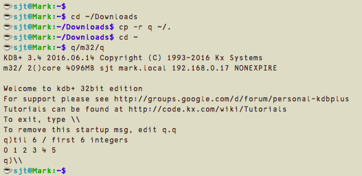
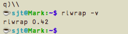
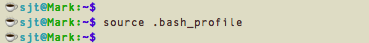
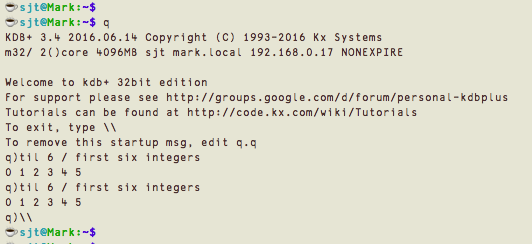
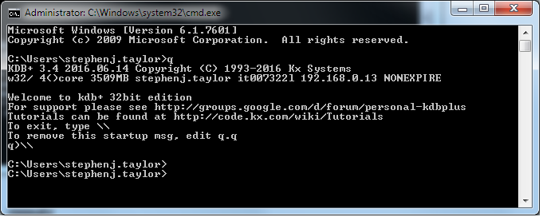
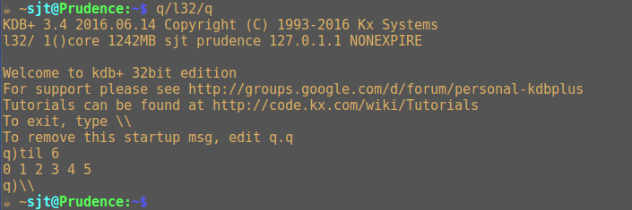
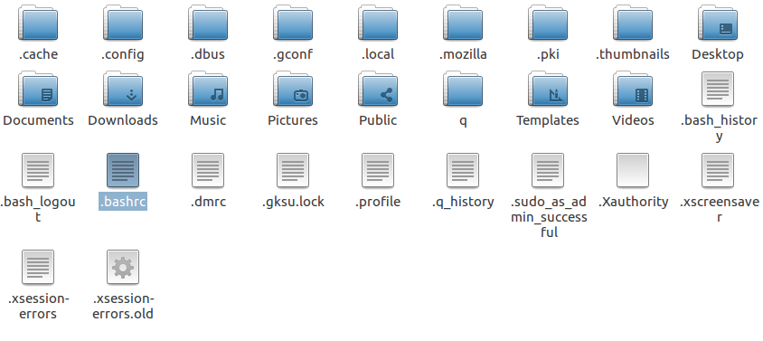

## <i class="fas fa-download"></i> Download


Free 32-bit version
: The free 32-bit version of kdb+ (for non-commercial use) can be downloaded from [kx.com](https://kx.com/download). Follow the instructions.

Commercial versions
: Commercial versions of kdb+ are distributed to customers from [downloads.kx.com](https://downloads.kx.com). (Credentials for this site are issued to customers’ [Designated Contacts](licensing/#obtaining-a-license-key-file)). 

!!! tip "Internal distribution"
    Most customers download the latest release of kdb+ and make that (along with the accompanying README.txt, the change list) available from a central file server. 

    Encourage your developers frequently to fold the latest release of kdb+ into their development cycle, and match the version used in production. This can greatly simplify development, deployment and debugging.

The names of the downloaded ZIPs denote the platform (`l64.zip` – 64-bit Linux; `w32.zip` – 32-bit Windows, etc.).

!!! warning "Test versions"
    Numerical release versions of the form 2.8, or 3.2 are production code. Versions of kdb+ with a trailing `t` in the name such as `3.3t` are test versions and are neither intended nor supported for production use.


## <i class="fab fa-apple"></i> macOS

If necessary, unzip the archive. A new folder `q` will appear in your Downloads folder.

Next perform the _Minimum install and launch_. We then strongly recommend continuing to [Complete install and launch](#complete-install-and-launch).


### Minimum install and launch

Open the Terminal application (Bash). It will prompt you with its own version of the following:
```bash
Mark:~ sjt$ 
```
Answer the prompts as follows:



You have installed and launched kdb+.

To exit from kdb+, type `\\`


### Complete install and launch

The minimum installation can be improved in two important ways. We strongly recommend them.

-   Call kdb+ within the `rlwrap` command, which will allow you to call back and edit previous lines
-   Define `q` as a command, allowing you to invoke kdb+ without specifying the path to it


#### Install Rlwrap

Exit kdb+ to return to the Bash prompt and your home folder. Ask for Rlwrap’s version number. If you see one, Rlwrap is already installed



If Rlwrap is already installed you can go on to the next step.

Otherwise, you will be told `rlwrap: command not found`. Install Rlwrap using your package manager. (Probably either [MacPorts](https://www.macports.org/install.php) or [Homebrew](http://brew.sh/))


#### Edit your profile

In Bash, open your profile `~/.bash_profile` with TextEdit (or your favourite text editor)


and append the following line
```bash
alias q='QHOME=~/q rlwrap -r ~/q/m32/q'
```
and save it. Tell Bash to use the revised profile:




### Confirm installation

From your home folder open q, type an expression and recall it using the up-arrow key:



You’re done. You have completely installed kdb+. See [what’s next](#whats-next).


## <i class="fab fa-windows"></i> Microsoft Windows

This will put a file `windows.zip` in your Downloads folder. Extract the files to `C:\`, producing a new folder `C:\q`. (You can install on a different filepath. If you do, in the following instructions simply replace `C:\q` with your filepath.)


### Confirm q is working

Open a command shell window: type Windows-r (or click the Start button) and type `cmd`.

Launch q by typing `C:\q\w32\q`. You should see the kdb+ banner, followed by the `q)` prompt. Type `til 6` to see the first 6 integers. Type `\\` to exit q.


### Define q as a command

Defining `q` as a command allows you to invoke kdb+ without specifying the path to it.

In the MS-DOS shell, type
```dos
setx QHOME "C:\q"
setx PATH "%PATH%;C:\q\w32"
exit
```


This will close your shell session. Open a new shell session and confirm `q` now works as a command.



You’re done. You have completely installed kdb+. See [what’s next](#whats-next).


## <i class="fab fa-linux"></i> Linux

Open a Bash session (eg LXTerminal) in your home folder and `cd` to your Downloads folder. Unzip the archive. A new folder q will appear in your Downloads folder. Copy it to your home folder and `cd` there.


### 32-bit or 64-bit?

Use the `uname` command to determine whether your machine is using the 32-bit or 64-bit Linux distribution.
```bash
uname -m
```


If the result is `i686` or `i386` or similar, you are running a **32-bit** distribution. If the results is `x86_64`, you are running a **64-bit** distribution.

If you are installing 32-bit kdb+ on a 32-bit Linux distribution, proceed to [Launch (minimum install)](#minimum-install-and-launch).

But if you are installing 32-bit kdb+ on a 64-bit Linux distribution, you will need a 32-bit library. Use your usual package manager to install i686 or i386: for example:
```bash
sudo apt-get install libc6-i386
```


### Minimum install and launch

Confirm that kdb+ runs. In your home folder, type:
```bash
q/l32/q
```


to see the kdb+ banner and the `q)` prompt. Type `til 6` to see the first six integers. Type `\\` to return to Linux.

You have completed the minimum installation. We recommend proceeding to the _Complete install and launch_.


### Complete install and launch

The minimum installation can be improved in two important ways. We strongly recommend them.

* Call kdb+ within the `rlwrap` command, which will allow you to call back and edit previous lines
* Define `q` as a command, allowing you to invoke kdb+ without specifying the path to it

#### Install Rlwrap

Exit kdb+ to return to the Bash prompt and your home folder. Ask for Rlwrap’s version number. If you see one, Rlwrap is already installed


If Rlwrap is already installed you can go on to the next step.

Otherwise, you will be told `rlwrap: command not found`. Install Rlwrap using your package manager.

#### Edit your profile

In the File Manager, find `.bashrc` in your home folder.



Open it with a text editor and append the following line
```bash
alias q='QHOME=~/q rlwrap -r ~/q/l32/q'
```
and save it. Tell Bash to use the revised profile: `source .bashrc`


### Confirm installation

From your home folder open q, type an expression and recall it using the up-arrow key:


You’re done. You have completely installed kdb+. 


## Licences

Usage of the free, non-commercial 32-bit distribution of kdb+ is governed by the terms and conditions on the [download page](https://kx.com/download). 

Commercial distributions of kdb+ require a license file to run. Without it, they signal a license error and abort. 

<i class="far fa-hand-point-right"></i> [License errors](/basics/error-list/#license-errors), [Licenses](licensing), [Linux production notes](/kb/linux-production)


## Installing elsewhere

You can install kdb+ where you please. The environment variable `QHOME` (specified in the instructions above) tells kdb+ where its home folder is. 


## <i class="far fa-hand-point-right"></i> What’s next?

[Get started](/learn) with the q programming language, look through the [reference card](/ref), or see what you can do with kdb+ in the [Knowledge Base](/kb/) section.

