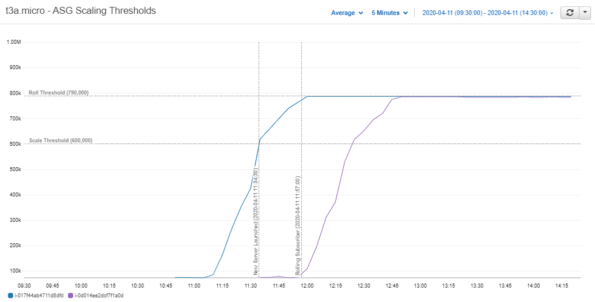
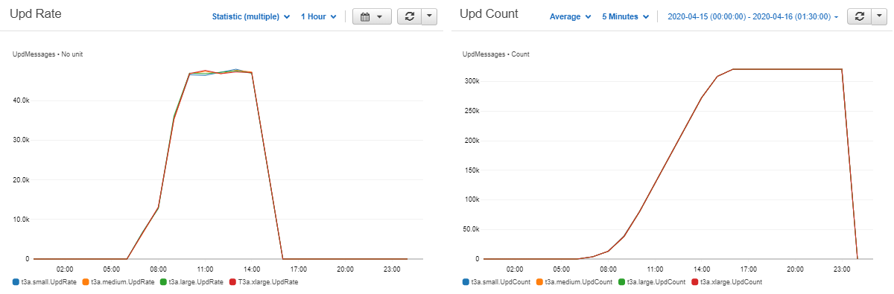

# :fontawesome-solid-cloud: Auto Scaling for a kdb+ realtime database


Cloud computing has fast become the new normal as more and more organizations are migrating their IT systems to the cloud.
Big cloud platforms like Amazon Web Services, Google Cloud, and Microsoft Azure have made it reliable, secure, and most importantly cost-effective.

The Infrastructure-as-a-Service (IaaS) model they have adopted has made it easier than ever before to provision computing resources.
This model has been taken a step further with Auto Scaling technologies.
Servers, storage, and networking resources can now be commissioned and decommissioned in an instant without any manual intervention.
This elasticity is one of the key benefits of Cloud Computing.
Customers can leverage this new technology to scale their infrastructure in order to meet system demands.

As these technologies become more prevalent it will become important to start incorporating them into kdb+.
In this paper we will explore how we can do this while focusing on scaling the random-access memory (RAM) needed for the real-time database (RDB).


## Auto Scaling

Auto Scaling is the act of monitoring the load on a system and dynamically acquiring or shutting down resources to match this load.
Incorporating this technology into an application means we no longer need to provision one large computing resource whose capacity must forever meet the application’s demand.
Instead we can use clusters of smaller resources and scale them in and out to follow the demand curve.


### Auto Scaling and kdb+

When it comes to databases there are three main types of computing resources that we can look to scale:

* Storage
* Compute
* Random-access memory (RAM)

Scaling storage for our kdb+ databases can be relatively simple in the cloud.
As the database grows we can provision extra storage volumes for our instances, or increase the size of the ones currently in use.

Alternatively an elastic file system could be used.
Amazon EFS is one example, it is a network file system (NFS) fully managed by AWS.
As files are added to EFS AWS will automatically scale the size and throughput of the file system.

Reading and writing data are prime use cases for scaling compute power within a kdb+ application.
Scaling compute for reading has been covered by Rebecca Kelly in her blog post [Kx in the Public Cloud: Autoscaling using kdb+](https://kx.com/blog/kx-in-the-public-cloud-auto-scaling-using-kdb).
Here Rebecca demonstrates how to scale the number of historical database (HDB) servers to handle an increasing or decreasing number of queries.

Dynamically scaling the compute needed for writing can be a bit more complicated.
Given we want to maintain the data’s order, the entire stream of data for a given source must go through one point in the system to be timestamped.

The same can be said for scaling the RAM needed for an RDB.
For this use case the number of RDB servers will be increased throughout the day as more and more data is ingested by the tickerplant.
The system must ensure that the data is not duplicated across these servers.
Building a solution for this problem will be the objective of this paper.


### Auto Scaling the RDB

By Auto Scaling the RDB we will improve both the cost-efficiency and the availability of our databases.

#### Why use Auto Scaling

Let’s say on average we receive a total of 12GB of data which is distributed evenly throughout the day.
For a regular kdb+ system we might provision one server with 16GB of RAM to allow for some contingency capacity.
We then hope that the data volumes do not exceed that 16GB limit on a daily basis.

In a scalable cluster we can begin the day with one small server (for this example a quarter of the size, 4GB).
The RAM needed to hold real-time data in memory will grow throughout the day, as it does we can step up our capacity by launching more servers.


<br>
_<small>Figure 1.1: Capacities of regular and scalable real-time databases </small>_

#### Cost efficiency

In the cloud _you pay only for what you use_.
So in a perfect system there should be no spare computing resources running idle accumulating costs.
In periods of low demand like weekends or end-of-day (when the day’s data has been flushed from memory) we should have the ability to scale down.
By ensuring this we can maintain the performance of a system at the lowest possible cost.


<br>
_<small>Figure 1.2: Potential cost savings of a scalable RDB </small>_

It is worth noting that the number of servers you provision will have no real bearing on the overall cost.
You will pay the same for running one server with 16GB of RAM as you would for running four servers with 4GB.

Below is an example of Amazon Web Service’s pricing for the varying sizes of its t3a instances.
As you can see the price is largely proportional to the memory capacity of each instance.


<br>
_<small>Figure 1.3: Amazon Web Services' t3a instance pricing </small>_


#### Availability

Replacing one large server with a scalable cluster will make our system more reliable.
By dynamically acquiring resources we can ensure that the load on our system never exceeds its capacity.


<br>
_<small>Figure 1.4: Availablity of a scalable RDB under high load </small>_

This will safeguard against unexpected spikes in data volumes crippling our systems and we can stop guessing our capacity needs.
When developing a new application there is no need to estimate how much memory the RDB is going to need throughout its lifetime.
Even if the estimate turns out to be correct, we will still end up provisioning resources that will lie mostly idle during periods of low demand.
Demand varies and so should our capacity.

Distributing the day’s data among multiple smaller servers will also increase the system’s resiliency.
One fault will no longer mean all of the day’s data is lost.
The smaller RDBs will also be quicker to recover from a fault as they will only have to replay a portion of the tickerplant’s log.


## Amazon Web Services (AWS)

The solution described in this paper was developed and deployed on Amazon Web Services (AWS).
In this section the AWS resources that were used are described, each of which should be transferable to the other big cloud platforms like Microsoft Azure and Google Cloud.


### Amazon Machine Image (AMI)

In the solution multiple servers are launched, all needing the same code and software packages installed in order to run our kdb+ system.
Instead of launching the servers and then installing the needed software on each one, it is best practice to do it on one server, create an Amazon Machine Image (AMI) of that server and then use that image to launch all of the servers.
This will keep the software and code consistent across the deployment.

To create our AMI a regular EC2 instance was launched using Amazon’s Linux 2 AMI, kdb+ was installed, our code was deployed and an image of the instance was taken.
An example script of how to do this can be found in [Appendix 1](#1-ami-user-data-script).
Once available this AMI was used along with Cloudformation to deploy a stack.


### Cloudformation

Using AWS Cloudformation means we can easily deploy and manage our system’s resources with a JSON or YAML file.
The resources needed for our stack are outlined below.

- AWS Elastic File System (EFS).
- EC2 launch templates.
- Auto Scaling groups.

An example YAML file to deploy this stack can be found in [Appendix 2](#2-cloudformation-template).

#### AWS Elastic File System (EFS)

We will want the RDB to be on a different server than the tickerplant but both processes will need access to the tickerplant’s logs.
Writing the logs to EFS (a network file system) will mean the RDBs will be able to read the files as the tickerplant is writing them.

#### EC2 launch template

We will use launch templates to configure details for EC2 instances ahead of time (e.g. instance type, root volume size, AMI id).
Our Auto Scaling groups will then use these templates to launch their servers.


### Auto Scaling group (ASG)

AWS EC2 Auto Scaling groups (ASG) can be used to maintain a given number of EC2 instances in a cluster.

##### Recovery

The first Auto Scaling group we deploy will be for the tickerplant.
Even though there will only ever be one instance for the tickerplant we are still putting it in an ASG for recovery purposes.
If it goes down the ASG will automatically start another one.

##### Scalability

There are a number of ways an ASG can scale its instances on AWS:

scaling | method
--------|---------
Scheduled | Timeframes are set to scale in and out.
Predictive | Machine learning is used to predict demand.
Dynamic | Cloudwatch metrics are monitored to follow the flow of demand (e.g. CPU and memory usage).
Manual | Adjusting the ASG’s `DesiredCapacity` attribute.


#### Dynamic Scaling

We could conceivably publish memory usage statistics as Cloudwatch metrics from our RDBs and allow AWS to manage scaling out.
If the memory across the cluster rises to a certain point the ASG will increment its `DesiredCapacity` attribute and launch a new server.

Sending custom Cloudwatch metrics is relatively simple using either Python’s boto3 library or the AWS CLI.
Examples of how to use these can be found in [Appendix 3](#3-cloudwatch-metric-commands).

#### Manual scaling

Another way to scale the instances in an ASG, and the method more suitable for our use case, is to manually adjust the ASG’s `DesiredCapacity`.
This can be done via the AWS console or the AWS CLI.

As it can be done using the CLI we can program the RDBs to scale the cluster in and out.
Managing the Auto Scaling within the application is preferable because we want to be specific when scaling in.

If scaling in was left up to AWS it would choose which instance to terminate based on certain criteria (e.g. instance count per availability zone, time to the next next billing hour).
However, if all of the criteria have been evaluated and there are still multiple instances to choose from, AWS will pick one at random.

Under no circumstance do we want AWS to terminate an instance running an RDB process which is still holding live data.
So we will need to keep control of the Auto Scaling group’s `DesiredCapacity` within the application.

As with publishing Cloudwatch metrics, adjusting the `DesiredCapacity` can be done with Python’s boto3 library or the AWS CLI.
[Appendix 4](#4-auto-scaling-group-commands) has examples of how to use these.

#### Auto Scaling in q

As the AWS CLI simply uses Unix commands we can run them in `q` using the `system` command.
By default the CLI will return `json` so we can parse the result using `.j.k`.
It will be useful to wrap the `aws` system commands in a retry loop as they may timeout when AWS is under load.

```q
.util.sys.runWithRetry:{[cmd]
    n: 0;
    while[not last res:.util.sys.runSafe cmd;
            system "sleep 1";
            if[10 < n+: 1; 'res 0];
            ];
    res 0 }

.util.sys.runSafe: .Q.trp[{(system x;1b)};;{-1 x,"\n",.Q.sbt[y];(x;0b)}]
```

To adjust the `DesiredCapacity` of an ASG we first need to find the correct group.
To do this we will use the `aws ec2` functions to find the `AutoScalingGroupName` that the RDB server belongs to.

```q
.util.aws.getInstanceId: {last " " vs first system "ec2-metadata -i"};

.util.aws.describeInstance:{[instanceId]
    res: .util.sys.runWithRetry
      "aws ec2 describe-instances --filters  \"Name=instance-id,Values=",instanceId,"\"";
    res: (.j.k "\n" sv res)`Reservations;
    if[() ~ res; 'instanceId," is not an instance"];
    flip first res`Instances }

.util.aws.getGroupName:{[instanceId]
    tags: .util.aws.describeInstance[instanceId]`Tags;
    res: first exec Value from raze[tags] where Key like "aws:autoscaling:groupName";
    if[() ~ res; 'instanceId," is not in an autoscaling group"];
    res }
```

To increment the capacity we can use the `aws autoscaling` functions to find the current `DesiredCapacity`.
Once we have this we can increment it by one and set the attribute.
The ASG will then automatically launch a server.

```q
.util.aws.describeASG:{[groupName]
    res: .util.sys.runWithRetry
      "aws autoscaling describe-auto-scaling-groups --auto-scaling-group-name ",groupName;
    res: flip (.j.k "\n" sv res)`AutoScalingGroups;
    if[() ~ res; 'groupName," is not an autoscaling group"];
    res }

.util.aws.getDesiredCapacity:{[groupName]
    first .util.aws.describeASG[groupName]`DesiredCapacity }

.util.aws.setDesiredCapacity:{[groupName;n]
    .util.sys.runWithRetry
      aws autoscaling set-desired-capacity --auto-scaling-group-name ",
      groupName," --desired-capacity ",string n }

.util.aws.scale:{[groupName]
    .util.aws.setDesiredCapacity[groupName] 1 + .util.aws.getDesiredCapacity groupName; }
```

To scale in, the RDB will terminate its own server.
When doing this it must make an `aws autoscaling` call, the ASG will then know not to launch a new instance in its place.

```q
.util.aws.terminate:{[instanceId]
    .j.k "\n" sv .util.sys.runWithRetry
      "aws autoscaling terminate-instance-in-auto-scaling-group --instance-id ",
      instanceId," --should-decrement-desired-capacity" }
```


## Real-time data cluster

Instead of one large instance, our RDB will now be a cluster of smaller instances and the day’s real-time data will be distributed between them.
An Auto Scaling group will be used to maintain the RAM capacity of the cluster.
Throughout the day more data will be ingested by the tickerplant and added to the cluster.
The ASG will increase the number of instances in the cluster throughout the day in order to hold this new data.
At the end of the day, the day’s data will be flushed from memory and the ASG will scale the cluster in.


### kdb+tick

The code in this paper has been written to act as a wrapper around [kdb+tick’s](https://github.com/KxSystems/kdb-tick) `.u` functionality.
The code to coordinate the RDBs has been put in a new `.u.asg` namespace, its functions determine when to call `.u.sub` and `.u.del` to add and remove subscribers from `.u.w`.


### Scaling the cluster

On a high level the scaling method is quite simple.

1. A single RDB instance is launched and subscribes to the tickerplant.
2. When it fills up with data a second RDB will come up to take its place.
3. This cycle repeats throughout the day growing the cluster.
4. At end-of-day all but the latest RDB instances are shutdown.


### The subscriber queue

There is an issue with the solution outlined above.
An RDB will not come up at the exact moment its predecessor unsubscribes, so there are two scenarios that the tickerplant must be able to handle.

* The new RDB comes up too early.
* The new RDB does not come up in time.

If the RDB comes up too early, the tickerplant must add it to a queue, while remembering the RDB’s handle, and the subscription info.
If it does this, it can add the RDB to `.u.w` when it needs to.

If the RDB does not come up in time, the tickerplant must remember the last `upd` message it sent to the previous RDB.
When the RDB eventually comes up it can use this to recover the missing data from the tickerplant’s log file.
This will prevent any gaps in the data.

The tickerplant will store these details in `.u.asg.tab`.

```q
/ table used to handle subscriptions
/   time   - time the subscriber was added
/   handle - handle of the subscriber
/   tabs   - tables the subscriber has subscribed for
/   syms   - syms the subscriber has subscribed for
/   ip     - ip of the subscriber
/   queue  - queue the subscriber is a part of
/   live   - time the tickerplant addd the subscriber to .u.w
/   rolled - time the subscriber unsubscribed
/   firstI - upd count when subscriber became live
/   lastI  - last upd subscriber processed

.u.asg.tab: flip `time`handle`tabs`syms`queue`live`rolled`lastI!();

q).u.asg.tab
time handle tabs syms ip queue live rolled firstI lastI
-------------------------------------------------------

```

The first RDB to come up will be added to this table and `.u.w`, it will then be told to replay the log.
We will refer to the RDB that is in `.u.w` and therefore currently being published to as **live**.

When it is time to roll to the next subscriber the tickerplant will query `.u.asg.tab`.
It will look for the handle, tables and symbols of the next RDB in the queue and make it the new **live** subscriber.
kdb+tick’s functionality will then take over and start publishing to the new RDB.


### Adding subscribers

To be added to `.u.asg.tab` a subscriber must call `.u.asg.sub`, it takes three parameters.

1. A list of tables to subscribe for.
2. A list of symbol lists to subscribe for (one symbol list for each of the tables).
3. The name of the queue to subscribe to.

If the RDB is subscribing to a queue with no **live** subscriber, the tickerplant will immediately add it to `.u.w` and tell it to replay the log.
This means the RDB cannot make multiple `.u.asg.sub` calls for each table it wants from the tickerplant.
Instead table and symbol lists are sent as parameters.
So multiple subscriptions can still be made.

```q
/ t - A list of tables (or ` for all).
/ s - Lists of symbol lists for each of the tables.
/ q - The name of the queue to be added to.

.u.asg.sub:{[t;s;q]
    if[-11h = type t;
            t: enlist t;
            s: enlist s];

    if[not (=) . count each (t;s);
            '"Count of table and symbol lists must match"];

    if[not all missing: t in .u.t,`;
            '.Q.s1[t where not missing]," not available"];

    `.u.asg.tab upsert
      (.z.p; .z.w; t; s; `$"." sv string 256 vs .z.a; q; 0Np; 0Np; 0N; 0N);

    liveProc: select from .u.asg.tab where not null handle,
                                           not null live,
                                           null rolled,
                                           queue = q;

    if[not count liveProc; .u.asg.add[t;s;.z.w]]; }
```

`.u.asg.sub` first carries out some checks on the arguments.

- Ensures `t` and `s` are enlisted.
- Checks that the count of `t` and `s` match.
- Checks that all tables in `t` are available for subscription.

A record is then added to `.u.asg.tab` for the subscriber.
Finally, `.u.asg.tab` is checked to see if there are other RDBs in the same queue.
If the queue is empty the tickerplant will immediately make this RDB the **live** subscriber.

```q
q).u.asg.tab
time                          handle tabs syms ip       queue                                          live                          rolled firstI lastI
--------------------------------------------------------------------------------------------------------------------------------------------------------
2020.04.13D23:36:43.518172000 7      ,`   ,`   10.0.1.5 rdb-cluster-v1-RdbASGMicro-NWN25W2UPGWQ.r-asg  2020.04.13D23:36:43.518223000        0
q).u.w
Quote| 7i `
Trade| 7i `
```

If there is already a live subscriber the RDB will just be added to the queue.

```q
q).u.asg.tab
time                          handle tabs syms ip        queue                                          live                          rolled firstI lastI
---------------------------------------------------------------------------------------------------------------------------------------------------------
2020.04.13D23:36:43.518172000 7                10.0.1.5  rdb-cluster-v1-RdbASGMicro-NWN25W2UPGWQ.r-asg  2020.04.13D23:36:43.518223000        0
2020.04.14D07:37:42.451523000 9                10.0.1.22 rdb-cluster-v1-RdbASGMicro-NWN25W2UPGWQ.r-asg
q).u.w
Quote| 7i `
Trade| 7i `
```


### The live subscriber

To make an RDB the live subscriber the tickerplant will call `.u.asg.add`.
There are two instances when this is called.

1. When an RDB subscribes to a queue with no live subscriber.
2. When the tickerplant is rolling subscribers.

```q
/ t - List of tables the RDB wants to subscribe to.
/ s - Symbol lists the RDB wants to subscribe to.
/ h - The handle of the RDB.

.u.asg.add:{[t;s;h]
    schemas: raze .u.subInner[;;h] .' flip (t;s);
    q: first exec queue from .u.asg.tab where handle = h;
    startI: max 0^ exec lastI from .u.asg.tab where queue = q;
    neg[h] @ (`.sub.rep; schemas; .u.L; (startI; .u.i));
    update live:.z.p, firstI:startI from `.u.asg.tab where handle = h; }
```

In `.u.asg.add` `.u.subInner` is called to add the handle to `.u.w` for each table.
This function is equivalent to kdb+tick’s `.u.sub` but it takes a handle as a third argument.
This change to `.u` will be discussed in a later section.

The tickerplant then calls `.sub.rep` on the RDB and the schemas, log file, and the log window are passed down as parameters.

Once the replay is kicked off on the RDB it is marked as the **live** subscriber in `.u.asg.tab`.


### Becoming the live subscriber

When the tickerplant makes an RDB the **live** subscriber it will call `.sub.rep` to initialize it.

```q
/ schemas   - table names and corresponding schemas
/ tplog     - file path of the tickerplant log
/ logWindow - start and end of the window needed in the log, (start;end)

.sub.rep:{[schemas;tplog;logWindow]
    .sub.live: 1b;
    (.[;();:;].) each schemas;
    .sub.start: logWindow 0;
    `upd set .sub.replayUpd;
    -11!(logWindow 1;tplog);
    `upd set .sub.upd;
    .z.ts: .sub.monitorMemory;
    system "t 5000"; }
```

The RDB first marks itself as live, then as in `tick/r.q` the RDBs will set the table schemas and replay the tickerplant’s log.


#### Replaying the tickerplant log

In kdb+tick `.u.i` will be sent to the RDB.
The RDB will then replay that many `upd` messages from the log.
As it replays it inserts every row of data in the `upd` messages into the tables.

In our case we may not want to keep all of the data in the log as other RDBs in the cluster may be holding some of it.
This is why the `logWindow` is passed down by the tickerplant.

`logWindow` is a list of two integers.

1. The last `upd` message processed by the other RDBs in the same queue.
2. The last `upd` processed by the tickerplant, `.u.i`.


To replay the log `.sub.start` is set to the first element of `logWindow` and `upd` is set to `.sub.replayUpd`.
The tickerplant log replay is then kicked off with `-11!` until the second element in the `logWindow`, `.u.i`.

`.sub.replayUpd` is then called for every `upd` message.
With each `upd` it increments `.sub.i` until it reaches `.sub.start`.
From that point it calls `.sub.upd` to insert the data.

```q
.sub.replayUpd:{[t;data]
    if[.sub.i > .sub.start;
        if[not .sub.i mod 100; .sub.monitorMemory[]];
        .sub.upd[t;flip data];
        :(::);
        ];
    .sub.i+: 1; }

.sub.upd: {.sub.i+: 1; x upsert y}
```

One other function of `.sub.replayUpd` is to monitor the memory of the server while we are replaying.
This will protect the RDB in the case where there is too much data in the log to replay.
In this case the RDB will unsubscribe from the tickerplant and another RDB will continue the replay.

After the log has been replayed `upd` is set to `.sub.upd`, this will `upsert` data and keep incrementing `.sub.i` for every `upd` the RDB receives.
Finally the RDB sets `.z.ts` to `.sub.monitorMemory` and initializes the timer to run every five seconds.


### Monitoring RDB server memory

The RDB server’s memory is monitored for two reasons.

1. To tell the Auto Scaling group to scale out.
2. To unsubscribe from the tickerplant when full.

#### Scaling out

As discussed in the [Auto Scaling in q](#auto-scaling-in-q) section, AWS CLI commands can take some time to run.
This could create some unwanted buffering in the RDB if they were to run while subscribed to the tickerplant.

To avoid this another q process runs separately on the server to coordinate the scale out.
It will continuously run `.mon.monitorMemory` to check the server’s memory usage against a scale threshold, say 60%.
If the threshold is breached it will increment the Auto Scaling group’s `DesiredCapacity` and set `.sub.scaled` to be true.
This will ensure the monitor process does not tell the Auto Scaling group to scale out again.

```q
.mon.monitorMemory:{[]
    if[not .mon.scaled;
        if[.util.getMemUsage[] > .mon.scaleThreshold;
                .util.aws.scale .aws.groupName;
                .mon.scaled: 1b;
        ];
    ]; }
```


#### Unsubscribing

The RDB process runs its own timer function to determine when to unsubscribe from the tickerplant.
It will do this to stop the server from running out of memory.

```q
.sub.monitorMemory:{[]
    if[.sub.live;
        if[.util.getMemUsage[] > .sub.rollThreshold;
                .sub.roll[];
        ];
    ]; }
```

`.sub.monitorMemory` checks when the server’s memory usage breaches the `.sub.rollThreshold`.
It then calls `.sub.roll` on the tickerplant which will then roll to the next subscriber.


#### Thresholds

Ideally `.mon.scaleThreshold` and `.sub.rollThreshold` will be set far enough apart so that the new RDB has time to come up before the tickerplant tries to roll to the next subscriber.
This will prevent the cluster from falling behind and reduce the number of `upd` messages that will need to be recovered from the log.


### Rolling subscribers

As discussed, when `.sub.rollThreshold` is hit the RDB will call `.sub.roll` to unsubscribe from the tickerplant.
From that point The RDB will not receive any more data, but it will be available to query.

```q
.sub.roll:{[]
    .sub.live: 0b;
    `upd set {[x;y] (::)};
    neg[.sub.TP] @ ({.u.asg.roll[.z.w;x]}; .sub.i); }
```

`.sub.roll` marks `.sub.live` as false and `upd` is set to do nothing so that no further `upd` messages are processed.
It will also call `.u.asg.roll` on the tickerplant, using its own handle and `.sub.i` (the last `upd` it has processed) as arguments.

```q
/ h    - handle of the RDB
/ subI - last processed upd message

.u.asg.roll:{[h;subI]
    .u.del[;h] each .u.t;
    update rolled:.z.p, lastI:subI from `.u.asg.tab where handle = h;
    q: first exec queue from .u.asg.tab where handle = h;
    waiting: select from .u.asg.tab where not null handle,
                                          null live,
                                          queue = q;
    if[count waiting; .u.asg.add . first[waiting]`tabs`syms`handle]; }
```

`.u.asg.roll` uses kdb+tick’s `.u.del` to delete the RDB’s handle from `.u.w`.
It then marks the RDB as **rolled** and `.sub.i` is stored in the `lastI` column of `.u.asg.tab`.
Finally `.u.asg.tab` is queried for the next RDB in the queue.
If one is ready the tickerplant calls `.u.asg.add` making it the new **live** subscriber and the cycle continues.

```q
q).u.asg.tab
time                          handle tabs syms ip         queue                                          live                          rolled                        firstI lastI
---------------------------------------------------------------------------------------------------------------------------------------------------------------------------------
2020.04.13D23:36:43.518172000 7                10.0.1.5   rdb-cluster-v1-RdbASGMicro-NWN25W2UPGWQ.r-asg  2020.04.13D23:36:43.518223000 2020.04.14D08:13:05.942338000 0      9746
2020.04.14D07:37:42.451523000 9                10.0.1.22  rdb-cluster-v1-RdbASGMicro-NWN25W2UPGWQ.r-asg  2020.04.14D08:13:05.942400000                               9746
q).u.w
Quote| 9i `
Trade| 9i `
```

If there is no RDB ready in the queue, the next one to subscribe up will immediately be added to `.u.w` and `lastI` will be used to recover from the tickerplant log.


### End of day

Throughout the day the RDB cluster will grow in size as the RDBs launch, subscribe, fill and roll.
`.u.asg.tab` will look something like the table below.

```q
q).u.asg.tab
time                          handle tabs syms ip         queue                                          live                          rolled                        firstI lastI
----------------------------------------------------------------------------------------------------------------------------------------------------------------------------------
2020.04.13D23:36:43.518172000 7                10.0.1.5   rdb-cluster-v1-RdbASGMicro-NWN25W2UPGWQ.r-asg  2020.04.13D23:36:43.518223000 2020.04.14D08:13:05.942338000 0      9746
2020.04.14D07:37:42.451523000 9                10.0.1.22  rdb-cluster-v1-RdbASGMicro-NWN25W2UPGWQ.r-asg  2020.04.14D08:13:05.942400000 2020.04.14D09:37:17.475790000 9746   19366
2020.04.14D09:14:14.831793000 10               10.0.1.212 rdb-cluster-v1-RdbASGMicro-NWN25W2UPGWQ.r-asg  2020.04.14D09:37:17.475841000 2020.04.14D10:35:36.456220000 19366  29342
2020.04.14D10:08:37.606592000 11               10.0.1.196 rdb-cluster-v1-RdbASGMicro-NWN25W2UPGWQ.r-asg  2020.04.14D10:35:36.456269000 2020.04.14D11:42:57.628761000 29342  39740
2020.04.14D11:24:45.642699000 12               10.0.1.42  rdb-cluster-v1-RdbASGMicro-NWN25W2UPGWQ.r-asg  2020.04.14D11:42:57.628809000 2020.04.14D13:09:57.867826000 39740  50112
2020.04.14D12:41:57.889318000 13               10.0.1.80  rdb-cluster-v1-RdbASGMicro-NWN25W2UPGWQ.r-asg  2020.04.14D13:09:57.867882000 2020.04.14D15:44:19.011327000 50112  60528
2020.04.14D14:32:22.817870000 14               10.0.1.246 rdb-cluster-v1-RdbASGMicro-NWN25W2UPGWQ.r-asg  2020.04.14D15:44:19.011327000                               60528
2020.04.14D16:59:10.663224000 15               10.0.1.119 rdb-cluster-v1-RdbASGMicro-NWN25W2UPGWQ.r-asg
```

Usually when end-of-day occurs `.u.end` is called in the tickerplant.
It informs the RDB which would write its data to disk and flush it from memory.
In our case when we do this the **rolled** RDBs will be sitting idle with no data.

To scale in `.u.asg.end` is called alongside kdb+tick’s `.u.end`.

```q
.u.asg.end:{[]
    notLive: exec handle from .u.asg.tab where not null handle,
                                               (null live) or not any null (live;rolled);
    neg[notLive] @\: (`.u.end; dt);
    delete from `.u.asg.tab where any (null handle; null live; not null rolled);
    update firstI:0 from `.u.asg.tab where not null live; }
```

The function first sends `.u.end` to all non live subscribers.
It then deletes these servers from `.u.asg.tab` and resets `firstI` to zero for all of the live RDBs.

```q
q).u.asg.tab
time                          handle tabs syms ip         queue                                           live                          rolled firstI lastI
-----------------------------------------------------------------------------------------------------------------------------------------------------------
2020.04.14D15:32:22.817870000 14               10.0.1.246 rdb-cluster-v1-RdbASGMicro-NWN25W2UPGWQ.r-asg   2020.04.14D15:44:19.011327000        0
```

When `.u.end` is called on the RDB it will delete the previous day’s data from each table.
If the process is live it will mark `.mon.scaled` to false on the monitor process so that it can scale out again when it refills.

If the RDB is not live and it has flushed all of its data it will terminate its own instance and reduce the `DesiredCapacity` of the ASG by one.

```q
.u.end: .sub.end;

.sub.end:{[dt]
    .sub.i: 0;
    .sub.clear dt+1;
 };

/ tm - clear all data from all tables before this time
.sub.clear:{[tm]
    ![;enlist(<;`time;tm);0b;`$()] each tables[];
    if[.sub.live;
            .Q.gc[];
            neg[.sub.MON] (set;`.mon.scaled;0b);
            :(::);
            ];
    if[not max 0, count each get each tables[];
            .util.aws.terminate .aws.instanceId]; }
```


### Bringing it all together

The q scripts for the code outlined above are laid out in the same way as kdb+tick, i.e. `tickasg.q` is in the top directory with the RDB and `.u.asg` scripts in the directory below, `asg/`.

The code runs alongside kdb+tick so its scripts are placed in the same top directory.

```bash
$ tree q/
q
├── asg
│   ├── mon.q
│   ├── r.q
│   ├── sub.q
│   ├── u.q
│   └── util.q
├── tick
│   ├── r.q
│   ├── sym.q
│   ├── u.q
│   └── w.q
├── tickasg.q
└── tick.q
```

Starting the tickerplant is the same as in kdb+tick, but `tickasg.q` is loaded instead of `tick.q`.

```bash
q tickasg.q sym /mnt/efs/tplog -p 5010
```

#### tickasg.q

```q
system "l tick.q"
system "l asg/u.q"

.tick.zpc: .z.pc;
.z.pc: {.tick.zpc x; .u.asg.zpc x;};

.tick.end: .u.end;
.u.end: {.tick.end x; .u.asg.end x;};
```

`tickasg.q` starts by loading in `tick.q`, `.u.tick` is called in this file so the tickerplant is started.
Loading in `asg/u.q` will initiate the `.u.asg` code on top of it.

`.z.pc` and `.u.end` are then overwritten to run both the `.u` and the `.u.asg` versions.

```q
.u.asg.zpc:{[h]
    if[not null first exec live from .u.asg.tab where handle = h;
            .u.asg.roll[h;0]];
    update handle:0Ni from `.u.asg.tab where handle = h; }
```

`.u.asg.zpc` checks if the disconnecting RDB is the live subscriber and calls `.u.asg.roll` if so.
It then marks the handle as null in `.u.asg.tab` for any disconnection.

There are also some minor changes made to `.u.add` and `.u.sub` in `asg/u.q`.

#### Changes to `.u`

`.u` will still work as normal with these changes.

The main change is needed because `.z.w` cannot be used in `.u.sub` or `.u.add` anymore.
When there is a queue of RDBs `.u.sub` will not be called in the RDB’s initial subscription call, so `.z.w` will not be the handle of the RDB we want to start publishing to.
To remedy this `.u.add` has been changed to take a handle as a third parameter instead of using `.z.w`.

The same change could not be made to `.u.sub` as it is the entry function for kdb+tick’s `tick/r.q`.
To keep `tick/r.q` working `.u.subInner` has been added, it is a copy of `.u.sub` but takes a handle as a third parameter.
`.u.sub` is now a projection of `.u.subInner`, it passes `.z.w` in as the third parameter.

##### tick/u.q
```q
\d .u
add:{$[ (count w x)>i:w[x;;0]?.z.w;
      .[`.u.w;(x;i;1);union;y];
      w[x],:enlist(.z.w;y) ];
    (x;$[99=type v:value x;sel[v]y;@[0#v;`sym;`g#]])}

sub:{if[x~`;:sub[;y]each t];if[not x in t;'x];del[x].z.w;add[x;y]}
\d .
```

##### asg/u.q
```q
/ use 'z' instead of .z.w
add:{$[ (count w x)>i:w[x;;0]?z;
      .[`.u.w;(x;i;1);union;y];
      w[x],:enlist(z;y) ];
    (x;$[99=type v:value x;sel[v]y;@[0#v;`sym;`g#]]) }

/ use 'z' instead of .z.w and input as 3rd argument to .u.add
subInner:{if[x~`;:subInner[;y;z]each t];if[not x in t;'x];del[x]z;add[x;y;z]}
sub:{subInner[x;y;.z.w]}

\d .
```

#### asg/r.q

When starting an RDB in Auto Scaling mode `asg/r.q` is loaded instead of `tick/r.q`.

```bash
q asg/r.q 10.0.0.1:5010
```

Where `10.0.0.1` is the private IP address of the tickerplant’s server.

```q
/q asg/r.q [host]:port[:usr:pwd]

system "l asg/util.q"
system "l asg/sub.q"

while[null .sub.TP: @[{hopen (`$":", .u.x: x; 5000)}; .z.x 0; 0Ni]];

while[null .sub.MON: @[{hopen (`::5016; 5000)}; (::); 0Ni]];

.aws.instanceId: .util.aws.getInstanceId[];
.aws.groupName: .util.aws.getGroupName[.aws.instanceId];

.sub.rollThreshold: getenv `ROLLTHRESHOLD;

.sub.live: 0b;

.sub.i: 0;

.u.end: {[dt] .sub.clear dt+1};

neg[.sub.TP] @ (`.u.asg.sub; `; `; `$ .aws.groupName, ".r-asg");
```

`asg/r.q` loads the scaling code in `asg/util.q` and the code to subscribe and roll in `asg/sub.q`.
Connecting to the tickerplant is done in a retry loop just in case the tickerplant takes some time to initially come up.
The script then sets the global variables outlined below.

- `.aws.instanceId` - instance id of its EC2 instance.
- `.aws.groupName` - name of its Auto Scaling group.
- `.sub.rollThreshold` - memory percentage threshold to unsubscribe.
- `.sub.live` - whether tickerplant is currently it sending data.
- `.sub.scaled` - whether it has launched a new instance.
- `.sub.i -` count of `upd` messages queue has processed.


## Cost/risk analysis

To determine how much cost savings our cluster of RDBs can make we will deploy the stack and simulate a day in the market.


### Initial simulation

First we just want to see the cluster in action so we can see how it behaves.
To do this we will run the cluster with `t3a.micro` instances.

In the [Auto Scaling the RDB](#auto-scaling-the-rdb) section above, data is distributed evenly throughout the day.
This will not be the case in most of our systems as data volumes will be highly concentrated between market open and close.
To simulate this as closely as possible we will generate data following the distribution below.


<br>
_<small>Figure 2.1: Simulation data volume distribution </small>_

In this simulation we will aim to send in 6GB of data of mock trade and quote data.
The peak data volume will be almost 1GB of data per hour (15% of the daily data) .
The `t3a.micro` instances only have 1GB of RAM so we should see the cluster scaling out quite quickly while markets are open.

The behavior of the cluster was monitored using Cloudwatch metrics.
Each RDB server published the results of the Linux `free` command.
First we will take a look at the total capacity of the cluster throughout the day.


<br>
_<small>Figure 2.2: Total memory capacity of the t3a.micro cluster – Cloudwatch Metrics </small>_

As expected we can see the number of servers stayed at one until the market opened.
The RDBs then started to receive data and the cluster scaled up to eight instances.
At end-of-day the data was flushed from memory and all but the live server was terminated.
So the capacity was reduced back to 1GB and the cycle continued the day after.

Plotting the memory usage of each server we see that the rates at which they rose were higher in the middle of the day when the data volumes were highest.


<br>
_<small>Figure 2.3: Memory usage of each of the t3a.micro servers – Cloudwatch Metrics </small>_

Focusing on just two of the servers we can see the relationship between the live server and the one it eventually launches.


<br>
_<small>Figure 2.4: Scaling thresholds of t3a.micro servers – Cloudwatch Metrics </small>_

At 60% memory usage the live server increased the ASG’s `DesiredCapacity` and launched the new server.
We can see the new server then waited for about twenty minutes until the live RDB reached the roll threshold of 80%.
The live server then unsubscribed from the tickerplant and the next server took over.


### Cost factors

Now that we can see the cluster working as expected we can take a look at its cost-efficiency.
More specifically, how much of the computing resources we provisioned did we actually use.
To do that we can take a look at the capacity of the cluster versus its memory usage.


<br>
_<small>Figure 2.5: T3a.micro cluster’s total memory capacity vs total memory usage – Cloudwatch Metrics </small>_

We can see from the graph above that the cluster’s capacity follows the demand line quite closely.
As we pay per GB of RAM we use, the capacity line can be taken as the cost of the cluster.
The gap between it and the usage line is where the cluster can make savings.

Our first option is to reduce the size of each step up in capacity by reducing the size of our cluster’s servers.
To bring the step itself closer to the demand line we need to either scale the server as late as possible or have each RDB hold more data.

To summarise there are three factors we can adjust in our cluster.

* The server size
* The scale threshold
* The roll threshold


#### Risk analysis

Care will be needed when adjusting these factors for cost-efficiency as each one will increase the risk of failure.
First and foremost a roll threshold should be chosen so that the chance of losing an RDB to a `'wsfull` error is minimized.

The main risk associated with scaling comes from not being able to scale out fast enough.
This will occur if the lead time for an RDB server is greater than the time it takes for the live server to roll after it has told the ASG to scale out.


<br>
_<small>Figure 2.6: T3a.micro server waiting to become the live subscriber – Cloudwatch Metric </small>_

Taking a closer look at Figure 2.4 we can see the t3a.micro took around one minute to initialize.
It then waited another 22 minutes for the live server to climb to its roll threshold of 80% and took its place.
So for this simulation the cluster had a 22-minute cushion.
With a one-minute lead time, the data volumes would have to increase to 22 times that of the mock feed before the cluster started to fall behind.

We could reduce this time by narrowing the gap between scaling and rolling, but it may not be worth it.
Falling behind the tickerplant will mean recovering data from its log.
This issue will be a compounding one as each subsequent server that comes up will be farther and farther behind the tickerplant.
More and more data will need to be recovered, and live data will be delayed.

One of the mantras of Auto Scaling is to _stop guessing demand_.
By keeping a cushion for the RDBs in the tickerplant’s queue we will likely not have to worry about large spikes in demand affecting our system.

Further simulations will be run to determine whether cost savings associated with adjusting these factors are worth the risk.


### Server size comparison

To determine the impact of using smaller instances four clusters were launched each with a different instance type.
The instances used had capacities of 2, 4, 8, and 16GB.


<br>
_<small>Figure 3.1: T3a instance types used for cost efficiency comparison </small>_

As in the first simulation the data volumes were distributed in order to simulate a day in the market.
However, in this simulation we aimed to send in around 16GB of data to match the total capacity of one `t3a.xlarge` (the largest instance type of the clusters).
`.sub.i` was published from each of the live RDBs allowing us to plot the `upd` message throughput.


<br>
_<small>Figure 3.2: T3a cluster’s upd throughput – Cloudwatch Metrics </small>_

Since there was no great difference between the clusters, the assumption could be made that the amount of data in each cluster at any given time throughout the day was equivalent.
So any further comparisons between the four clusters would be valid.
Next the total capacity of each cluster was plotted.


<br>
_<small>Figure 3.3: T3a clusters' total memory capacity </small>_

Strangely the capacity of the `t3a.small` cluster (the smallest instance) rose above the capacity of the larger ones.
Intuitively they should scale together but the smaller steps of the `t3a.small` cluster should still have kept it below the others.
When the memory usage of each server was plotted we saw that the smaller instances once again rose above the larger ones.


<br>
_<small>Figure 3.4: T3a clusters' memory usage – Cloudwatch Metrics </small>_

This comes down to the latent memory of each server, when an empty RDB process is running the memory usage is approximately 150 MB.

```bash
(base) [ec2-user@ip-10-0-1-212 ~]$  free
              total        used        free      shared  buff/cache   available
Mem:        2002032      150784     1369484         476      481764     1694748
Swap:             0           0           0
```

So for every instance that we add to the cluster, the overall memory usage will increase by 150MB.
This extra 150MB will be negligible when the data volumes are scaled up as much larger servers will be used.

The effect is less prominent in the 4, 8, and 16GB servers so going forward we will use them to compare costs.


<br>
_<small>Figure 3.5: Larger t3a Clusters' Memory Usage - Cloudwatch Metrics </small>_

The three clusters here behave as expected.
The smallest cluster’s capacity stays far closer to the demand line, although it does move towards the larger ones as more instances are added.
This is the worst-case scenario for the `t3a.xlarge` cluster, as 16GBs means it has to scale up to safely meet the demand of the simulation’s data, but the second server stays mostly empty until end-of-day.
The cluster will still have major savings over a `t3.2xlarge` with 32GB.

The cost of running each cluster was calculated, the results are shown below.
We can see that the two smaller instances have significant savings compared to the larger ones.
50% savings when compared to running a `t3a.2xlarge`.
The clusters with larger instances saw just 35 and 38%.

| instance | capacity (GB) | total cost ($) | cost saving (%) |
|---|---|---|---|
| t3a.small | 1 | 3.7895 | 48 |
| t3a.medium | 2 | 3.5413 | 51 |
| t3a.large | 4 | 4.4493 | 38 |
| t3a.xlarge | 16 | 4.7175 | 35 |
| t3a.2xlarge | 32 | 7.2192 | 0 |


<br>
_<small>Figure 3.6: T3a clusters' cost savings </small>_

If data volumes are scaled up the savings could become even greater as the ratio of server size to total daily data volume becomes greater.
However it is worth noting that the larger servers did have more capacity when the data volumes stopped, so the differences may also be slightly exaggerated.

Taking a look at Figure 3.5 we can intuitively split the day into three stages.

1. End of Day to Market Open
2. Market Open to Market Close
3. Market Close to End of Day

Savings in the first stage will only be achieved by reducing the instance size.
In the second stage savings look to be less significant, but could be achieved by both reducing server size and reducing the time in the queue of the servers.

From market-close to end-of-day the clusters have scaled out fully.
In this stage cost-efficiency will be determined by how much data is in the final server.
If it is only holding a small amount of data when market closes there will be idle capacity in the cluster until end-of-day occurs.

This will be rather random and depend mainly on how much data is generated by the market.
Although having smaller servers will reduce the maximum amount of capacity that could be left unused.

The worst-case scenario in this stage is that the amount of data held by the last live server falls in the range between the scale and roll thresholds.
This will mean an entire RDB server will be sitting idle until end-of-day.
To reduce the likelihood of this occurring it may be worth increasing the scale threshold and risking falling behind the tickerplant in the case of high data volumes.

### Threshold window comparison

To test the effects of the scale threshold on cost another stack was launched (also with four RDB clusters).
In this stack all four clusters used `t3a.medium` EC2 instances (4GB) and a roll threshold of 85% was set.
Data was generated in the same fashion as the previous simulation.

The scale thresholds were set to 20, 40, 60, and 80% and the memory capacity was plotted as in Figure 3.4.


<br>
_<small>Figure 4.1: T3a.medium clusters' memory capacity vs memory usage – Cloudwatch Metrics </small>_

As expected the clusters with the lower scale thresholds scale out farther away from the demand line.
Their new servers will then have a longer wait time in the tickerplant queue.
This will reduce the risks associated with the second stage but also increase its costs.
This difference can be seen more clearly if only the 20 and 80% clusters are plotted.


<br>
_<small>Figure 4.2: T3a.medium 20 and 80% clusters' memory capacity vs memory usage – Cloudwatch Metrics </small>_

Most importantly we can see that in the third stage the clusters with lower thresholds started an extra server.
So a whole instance was left idle in those clusters from market-close to end-of-day.
The costs associated with each cluster were calculated below.

| instance | threshold | capacity (GB) | total cost ($) | cost saving (%) |
|---|---|---|---|---|
| t3a.medium | 80% | 4 | 3.14 | 43 |
| t3a.medium | 60% | 4 | 3.19 | 44 |
| t3a.medium | 40% | 4 | 3.56 | 49 |
| t3a.medium | 20% | 4 | 3.61 | 50 |
| t3a.2xlarge | n/a | 32 | 7.21 | 0 |

The 20 and 40% clusters and the 60 and 80% clusters started the same amount of servers as each other throughout the day.
So we can compare their costs to analyze cost-efficiencies in the second stage (market-open to close).
With differences of under 1% compared to the `t3.2xlarge` the cost savings we can make from this stage are not that significant.

Comparing the difference between the two pairs we can see that costs jump from 44 to 49%.
Therefore the final stage where there is an extra server sitting idle until end-of-day has a much larger impact.

Even though raising the scale threshold has a significant impact when no extra server is added at market-close, choosing whether to do so will still be dependant on the needs of each system.
A 5% decrease in costs may not be worth the risk of falling behind the tickerplant.


### Taking it further

#### Turning the cluster off

The saving estimates in the previous sections could be taken a step further by adding scheduled scaling.
When the RDBs are not in use we could scale the cluster down to zero, effectively turning off the RDB.
Weekends are a prime example of when this could be useful, but it could also be extended to the period between end-of-day and market open.

If data only starts coming into the RDB at around 07:00 when markets open there is no point having a server up.
So we could schedule the ASG to turn down to zero instances at end-of-day.
We then have a few options for scaling back out, each have some pros and cons.

option | remarks
-------|--------
Schedule the ASG to scale out at 05:30 before the market opens | Data will not be available until then if it starts to come in before. 
Monitor the tickerplant for the first `upd` message and scale out when it is received | Data will not be available until the RDB comes up and recovers from the tickerplant log. Will not be much data to recover.
Scale out when the first query is run | Useful because data is not needed until it is queried. RDBs may come up before there is any data. A large amount of data may need to be recovered if queries start to come in later in the day.

#### Intra-day write-down

The least complex way to run this solution would be in tandem with a write-down database (WDB) process.
The RDBs will then not have to save down to disk at end-of-day so scaling in will be quicker.
The complexity will also be greatly reduced.
If the RDBs were to write down at end-of-day a separate process would be needed to coordinate the writes of each one and sort and part the data.

An elastic file system would also be needed for the multiple RDB servers to write to the HDB.
This may cause issues on AWS in particular as EFS uses burst credits to distribute read and write throughput.
These are accumulated over time but may be exhausted if all of the day’s data is written to disk in a short period of time.
Provisioned throughput could be used but it can be quite expensive especially if we are only writing to disk at end-of-day.

As the cluster will most likely be deployed alongside a WDB process an intra-day write-down solution could also be incorporated.
If we were to write down to disk every hour, we could also scale in the number of RDBs in the cluster every hour by calling `.sub.clear` with the time of the intra-day write.

Options for how to set up an intra-day write-down solution have been discussed in a previous whitepaper by Colm McCarthy, [Intraday writedown solutions](../intraday-writedown/index.md).

#### Querying distributed RDBs

This solution has one obvious difference to a regular kdb+ system in that there are multiple RDB servers.
User queries will need to be parsed and routed to each one to ensure the data can be retrieved effectively.
Engineering a solution for this is beyond the scope of this paper, but it may be tackled in the future.

Once a gateway process is set up distributed RDBs could offer some advantages over a regular RDB:

- RDBs can be filtered out by the gateway pre-query based on which data sets they are holding.
- Each RDB will be holding a fraction of the day’s data, decreasing query memory and duration.
- Queries across multiple RDBs can be done in parallel.


## Conclusion

This paper has presented a solution for a scalable real-time database cluster.
The simulations carried out showed that savings of up to 50% could be made.
These savings along with the increased availability of the cluster could make holding a whole day’s data in memory more feasible for our kdb+ databases.

If not, the cluster can be used alongside an intra-day write-down process.
If an intra-day write is incorporated in a system it is usually one that needs to keep memory usage low.
The scalability of the cluster can guard against large spikes in intra-day data volumes crippling the system.
Used in this way very small instances could be used to reduce costs.

The `.u.asg` functionality in the tickerplant also gives the opportunity to run multiple clusters at different levels of risk.
Highly important data can be placed in a cluster with a low scale threshold or larger instance size.
If certain data sources do not need to be available with a low latency clusters with smaller instances and higher scale thresholds can be used to reduce costs.


## Author

Jack Stapleton is a kdb+ consultant for Kx who has worked for some the world’s largest financial institutions.
Based in Dublin, Jack is currently working on the design, development, and maintenance of a range of kdb+ solutions in the cloud for a leading financial institution.


## Appendix


### 1. AMI user data script

```bash
#!/bin/bash -x

## script to be run as root ##

# install yum packages
sudo yum update -y
sudo yum install -y amazon-efs-utils
sudo yum install -y git

# set up conda
sudo -i -u ec2-user \
    wget https://repo.continuum.io/miniconda/Miniconda2-latest-Linux-x86_64.sh \
    -O /home/ec2-user/conda.sh
chmod 777 /opt
sudo -i -u ec2-user bash /home/ec2-user/conda.sh -b -p /opt/miniconda
echo -e "\nsource /opt/miniconda/etc/profile.d/conda.sh\nconda activate\n" \
    >> /home/ec2-user/.bash_profile
source /home/ec2-user/.bash_profile

# set up kdb
sudo -i -u ec2-user conda install kdb -c kx -y
sudo -i -u ec2-user \
    git clone https://github.com/jackstapleton/rdb-autoscaling.git /opt/rdb-autoscaling

# configure aws cli
mkdir -p /home/ec2-user/.aws
AZ=$(ec2-metadata -z | cut -d ' ' -f 2)
echo -e "[default]\nregion=${AZ::-1}\noutput=json" >> /home/ec2-user/.aws/config
chown -R ec2-user:ec2-user /home/ec2-user/.aws

# create ami
INSTANCEID=$(ec2-metadata -i | cut -d ' ' -f 2)
AMIDATE=$(date +%Y%m%dD%H%M%S)
AMINAME=${AZ::-1}-kdb-ec2.ami-$AMIDATE
sudo -i -u ec2-user aws ec2 create-image --instance-id $INSTANCEID --name $AMINAME
```

### 2. Cloudformation template

```yaml
Metadata:
  AWS::CloudFormation::Interface:
    ParameterGroups:
      - Label:
          default: "Amazon EC2 Configuration"
        Parameters:
          - AMI
          - SSHKEY
          - TICKINSTANCETYPE
      - Label:
          default: "Real-time Database Cluster Configuration"
        Parameters:
          - RDBINSTANCETYPE
          - SCALETHRESHOLD
          - ROLLTHRESHOLD
      - Label:
          default: "General Configuration"
        Parameters:
          - SUBNETID
          - VPCID

    ParameterLabels:
      AMI:
        default: "AMI Id"
      SSHKEY:
        default: "SSH Key"
      TICKINSTANCETYPE:
        default: "Tickerplant Instance Type"
      RDBINSTANCETYPE:
        default: "RDB Instance Type"
      SCALETHRESHOLD:
        default: "Scale Threshold"
      ROLLTHRESHOLD:
        default: "Roll Threshold"
      SUBNETID:
        default: "Subnet Id"
      VPCID:
        default: "VPC Id"

Parameters:
  AMI:
    Type: AWS::EC2::Image::Id
    Description: "Choose the AMI to use for the EC2 Instances"
  SSHKEY:
    Type: AWS::EC2::KeyPair::KeyName
    Description: "Choose the ssh key that will be used to log on to the EC2 instances"
  TICKINSTANCETYPE:
    Type: String
    ConstraintDescription: "Must be a valid EC2 Instance Type"
    Description: "Choose the Tickerplant's EC2 Instance Type"
  RDBINSTANCETYPE:
    Type: String
    ConstraintDescription: "Must be a valid EC2 Instance Type"
    Description: "Choose the RDB Cluster's EC2 Instance Type"
  SCALETHRESHOLD:
    Type: Number
    Description: "Choose the Memory Utilisation Percentage to scale up the Cluster"
    MinValue: 0
    MaxValue: 100
  ROLLTHRESHOLD:
    Type: Number
    Description: "Choose the Max Memory Utilisation Percentage for each RDB in the Cluster"
    MinValue: 0
    MaxValue: 100
  SUBNETID:
    Type: AWS::EC2::Subnet::Id
    Description: "Which Subnet should the EC2 Instances be deployed into"
  VPCID:
    Type: AWS::EC2::VPC::Id
    Description: "Which VPC should the EC2 Instances be deployed into"

Mappings:
  Constants:
    UserData:
      Bootstrap: |
        #!/bin/bash -x
        bash -x /opt/rdb-autoscaling/aws/app-userdata.sh

Resources:

  IAMRole:
    Type: AWS::IAM::Role
    Properties:
      AssumeRolePolicyDocument:
        Version: 2012-10-17
        Statement:
          - Effect: Allow
            Principal:
              Service:
                - ec2.amazonaws.com
            Action:
              - 'sts:AssumeRole'
      Description: 'IAMRole for the EC2 Instances in the Stack'
      Policies:
        - PolicyName: !Sub '${AWS::StackName}.iam.policy'
          PolicyDocument:
            Version: 2012-10-17
            Statement:
              - Effect: Allow
                Action:
                  - autoscaling:DescribeAutoScalingGroups
                  - autoscaling:DescribeAutoScalingInstances
                  - autoscaling:SetDesiredCapacity
                  - autoscaling:TerminateInstanceInAutoScalingGroup
                  - cloudwatch:PutMetricData
                  - ec2:CreateImage
                  - ec2:CreateTags
                  - ec2:DeleteTags
                  - ec2:DescribeAddresses
                  - ec2:DescribeInstances
                  - ec2:DescribeTags
                  - elasticfilesystem:ClientMount
                  - elasticfilesystem:ClientRootAccess
                  - elasticfilesystem:ClientWrite
                Resource: "*"
      RoleName: !Sub '${AWS::StackName}.iam.role'

  IAMInstanceProfile:
    Type: AWS::IAM::InstanceProfile
    Properties:
      Path: /
      Roles:
        - !Ref IAMRole

  EfsSecurityGroup:
    Type: AWS::EC2::SecurityGroup
    Properties:
      GroupDescription: 'Security Group to allow EFS to be mounted by EC2 Instances'
      GroupName: !Sub '${AWS::Region}.${AWS::StackName}.efs-sg'
      SecurityGroupIngress:
        - FromPort: 2049
          IpProtocol: tcp
          ToPort: 2049
          SourceSecurityGroupId: !Ref EC2SecurityGroup
      VpcId: !Ref VPCID

  EC2SecurityGroup:
    Type: AWS::EC2::SecurityGroup
    Properties:
      GroupDescription: 'Security Group to allow SSH and TCP access for EC2 servers'
      GroupName: !Sub '${AWS::Region}.${AWS::StackName}.ec2-sg'
      SecurityGroupIngress:
        - CidrIp: 0.0.0.0/0
          FromPort: 22
          IpProtocol: tcp
          ToPort: 22
      VpcId: !Ref VPCID

  EC2SecurityGroupTcpIngress:
    Type: AWS::EC2::SecurityGroupIngress
    DependsOn: EC2SecurityGroup
    Properties:
      GroupId: !Ref EC2SecurityGroup
      FromPort: 5010
      IpProtocol: tcp
      ToPort: 5020
      SourceSecurityGroupId: !Ref EC2SecurityGroup

  EfsFileSystem:
    Type: AWS::EFS::FileSystem
    Properties:
      Encrypted: False
      FileSystemTags:
        - Key: Name
          Value: !Sub '${AWS::Region}-${AWS::StackName}-efs'
      PerformanceMode: generalPurpose
      ThroughputMode: bursting
  EfsMountTarget:
    Type: AWS::EFS::MountTarget
    Properties:
      FileSystemId: !Ref EfsFileSystem
      SecurityGroups:
        - !Ref EfsSecurityGroup
      SubnetId: !Ref SUBNETID

  EC2LaunchTemplate:
    Type: 'AWS::EC2::LaunchTemplate'
    Properties:
      LaunchTemplateData:
        BlockDeviceMappings:
            - DeviceName: /dev/xvda
              Ebs:
                VolumeSize: 8
        IamInstanceProfile:
          Arn: !GetAtt IAMInstanceProfile.Arn
        ImageId: !Ref AMI
        KeyName: !Ref SSHKEY
        SecurityGroupIds:
          - !Ref EC2SecurityGroup
        UserData:
          Fn::Base64:
            !FindInMap [ Constants, UserData, Bootstrap ]
      LaunchTemplateName: !Sub '${AWS::Region}.ec2-launch-template.${AWS::StackName}'

  TickASG:
    Type: 'AWS::AutoScaling::AutoScalingGroup'
    Properties:
      AutoScalingGroupName: !Sub '${AWS::Region}.ec2-asg.${AWS::StackName}-tick-asg'
      Cooldown: 300
      DesiredCapacity: 1
      HealthCheckGracePeriod: 60
      HealthCheckType: EC2
      MaxSize: 1
      MinSize: 0
      MixedInstancesPolicy:
        LaunchTemplate:
          LaunchTemplateSpecification:
            LaunchTemplateId: !Ref EC2LaunchTemplate
            Version: 1
          Overrides:
            - InstanceType: !Ref TICKINSTANCETYPE
      Tags:
        - Key: APP
          PropagateAtLaunch: True
          Value: tick-asg
        - Key: EFS
          PropagateAtLaunch: True
          Value: !GetAtt EfsMountTarget.IpAddress
        - Key: Name
          PropagateAtLaunch: True
          Value: !Sub '${AWS::Region}.ec2-instance.${AWS::StackName}-tick-asg'
      VPCZoneIdentifier:
        - !Ref SUBNETID

  RdbASG:
    Type: 'AWS::AutoScaling::AutoScalingGroup'
    DependsOn: [ TickASG ]
    Properties:
      AutoScalingGroupName: !Sub '${AWS::Region}.ec2-asg.${AWS::StackName}-r-asg'
      Cooldown: 300
      DesiredCapacity: 1
      HealthCheckGracePeriod: 60
      HealthCheckType: EC2
      MaxSize: 50
      MinSize: 0
      MixedInstancesPolicy:
        LaunchTemplate:
          LaunchTemplateSpecification:
            LaunchTemplateId: !Ref EC2LaunchTemplate
            Version: 1
          Overrides:
            - InstanceType: !Ref RDBINSTANCETYPE
      Tags:
        - Key: APP
          PropagateAtLaunch: True
          Value: r-asg
        - Key: EFS
          PropagateAtLaunch: True
          Value: !GetAtt EfsMountTarget.IpAddress
        - Key: Name
          PropagateAtLaunch: True
          Value: !Sub '${AWS::Region}.ec2-instance.${AWS::StackName}-r-asg'
        - Key: SCALETHRESHOLD
          PropagateAtLaunch: True
          Value: !Ref SCALETHRESHOLD
        - Key: ROLLTHRESHOLD
          PropagateAtLaunch: True
          Value: !Ref ROLLTHRESHOLD
      VPCZoneIdentifier:
        - !Ref SUBNETID
```


### 3. Cloudwatch metric commands

#### bash

```bash
aws cloudwatch put-metric-data --namespace RdbCluster \
    --dimensions AutoScalingGroupName=rdb-asg-1234ABCDE,InstanceId=i-1234567890abcdef
    --metric-name MemoryUsage --unit Bytes --value 1000
```

#### Python

```python
from boto3 import client
from datetime import datetime

def put_metric_data(namespace, asg_name, instance_id, name, unit, value):
    """
    Send Metric Data for an EC2 Instance in an AutoScaling group to Cloudwatch
    """
    cloudwatch = client('cloudwatch')
    # build the metric data dictionary
    data = {
       'MetricName': name,
       'Dimensions': [
           { 'Name': 'AutoScalingGroupName', 'Value': asg_name },
           { 'Name': 'InstanceId', 'Value': instance_id }
           ],
       'Timestamp': datetime.now(),
       'Value': value,
       'Unit': unit
       }
    # send the data to aws
    cloudwatch.put_metric_data(Namespace=namespace,
                               MetricData=[data])


put_metric_data('RdbCluster', 'rdb-asg-1234ABCDE', 'i-1234567890abcdef', 
    'MemoryUsage', 'bytes', 1000)
```


### 4. Auto Scaling group commands

#### bash


```bash
aws autoscaling describe-auto-scaling-groups --auto-scaling-group-name rdb-asg-1234ABCD

aws autoscaling set-desired-capacity --auto-scaling-group-name rdb-asg-1234ABCD --desired-capacity 2

aws autoscaling terminate-instance-in-auto-scaling-group --instance-id i-1234567890abcdef --should-decrement-desired-capacity
```

#### Python

```python
import boto3


def get_metadata(asg_name):
    """
    Get meta data of an autoscaling group
    """
    asg = boto3.client('autoscaling')
    res = asg.describe_auto_scaling_groups(AutoScalingGroupNames=[asg_name])
    return res['AutoScalingGroups'][0]


def get_desired_capacity(asg_name):
    """
    Find the current DesiredCapacity of an ASG
    """
    res = get_metadata(asg_name)
    return res['DesiredCapacity']


def set_desired_capacity(asg_name, desired_capacity):
    """
    Set the DesiredCapacity of an ASG
    Instances will either be terminated or launched once this is done
    """
    asg = boto3.client('autoscaling')
    res = asg.set_desired_capacity(AutoScalingGroupName=asg_name,
                                   DesiredCapacity=desired_capacity,
                                   HonorCooldown=False)
    return res


def increment_desired_capacity(asg_name):
    """
    Increase the DesiredCapacity of the ASG by 1
    """
    current = get_desired_capacity(asg_name)
    res = set_desired_capacity(asg_name, current + 1)
    return res


def terminate_instance_from_asg(instance_id):
    """
    Terminate the ec2 instance and reduce the DesiredCapacity
    """
    asg = boto3.client('autoscaling')
    res = asg.terminate_instance_in_auto_scaling_group(
        InstanceId=instance_id,
        ShouldDecrementDesiredCapacity=True
        )
    return res
```

