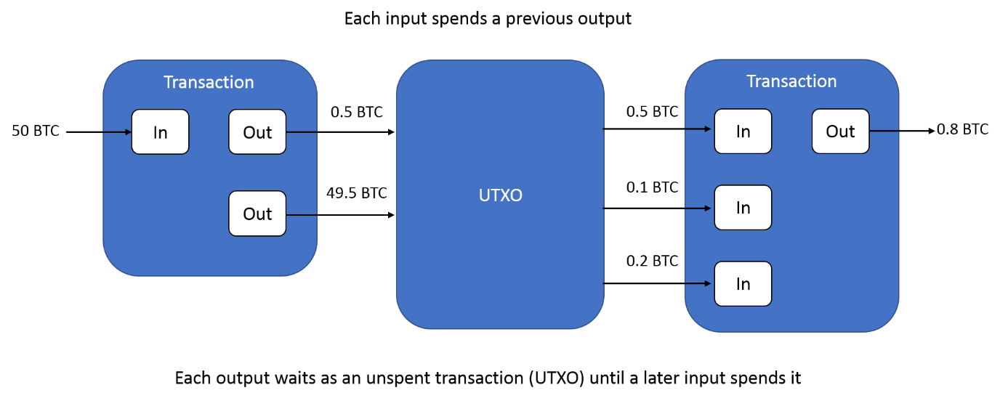
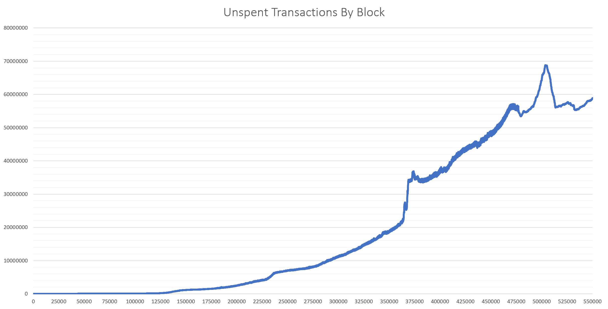
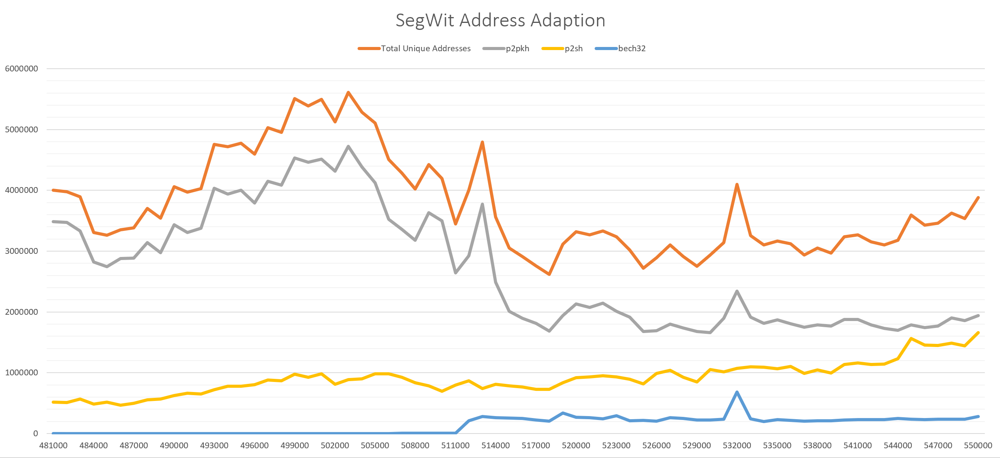
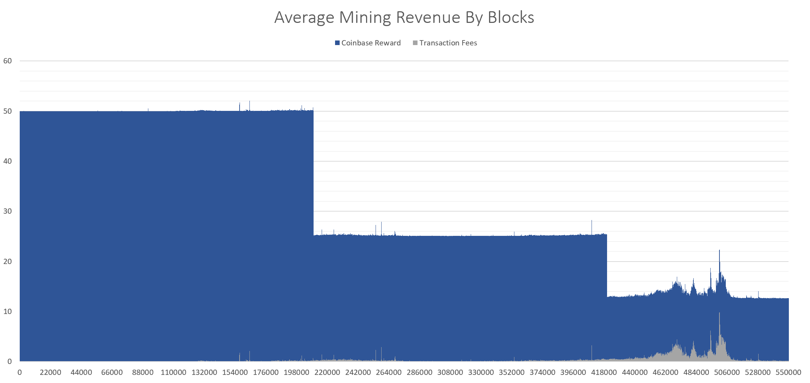
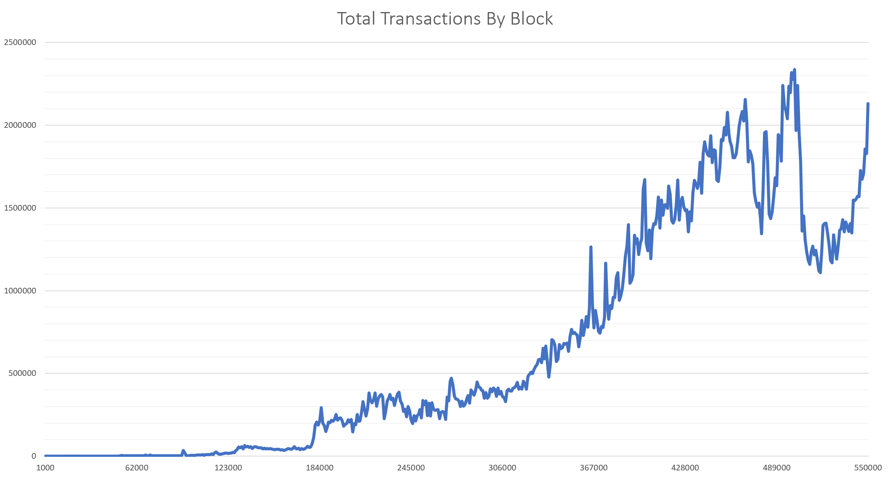

White paper
{: #wp-brand}

# Storing and exploring the Bitcoin blockchain

by [Jeremy Lucid &amp; Daniel Irwin](#authors)
{: .wp-author}


For over a decade, KX technology has played an important role in the
growing financial system by providing an integrated platform consisting
of a high-performance kdb+ database, in-memory compute engines and
real-time streaming processes. For example, across the largest financial
institutions, kdb+ time-series databases are utilized for the real-time
capture, processing and storage of the worlds market data streams,
providing the backbone for high-frequency trading and real-time market
surveillance systems. The ability of the technology to maximize hardware
utilization, and achieve scale, has resulted in a natural demand for the
technology across other data-intensive domains from the Internet of Things
(IoT) to machine learning.

One domain which is currently experiencing rapid growth and innovation
is blockchain, primarily peer-to-peer cryptocurrency systems built on
public blockchains. Just as traditional financial institutions in the
past faced scaling challenges, cryptocurrency businesses, such as
exchanges and wallet providers, face many of the same growing pains
associated with an increasing user base. KX technology can help meet
these challenges and deliver scalability confidence. As a case in point,
kdb+ is currently utilized to meet these scaling demands at the
Bitcoin-denominated trading platform,
[BitMEX](https://kx.com/news/kdb-powers-trading-platform-bitmex-high-frequency-bitcoin-exchange/),
one of the fastest growing cryptocurrency exchanges in the world. In
addition, in the area of private blockchain based development, kdb+ has
been incorporated alongside the post-trade processing application
[Babylon](https://kx.com/blog/kx-technology-integrated-into-innovative-blockchain-trade-processing-platform/),
developed by Cobalt DL, to provide fast data processing. Such
integrations are part of a broader strategy to integrate kdb+ with
blockchain related applications and services, which are increasingly
likely to play a major role in the evolution of financial technology in
the coming years.

As part of the exploration into blockchain, this paper focuses on the
important area of blockchain explorer technology which provides a
convenient means for users to monitor their cryptocurrency transactions
and funds, while also providing insightful metrics on the overall state
of a network, such as the number of transactions occurring per block,
the number of unique/active addresses, the volumes of currency being
transacted and the mining hash rate, to mention a few.

This paper examines how a simple blockchain explorer can be constructed
using kdb+ to efficiently store and query over nine years’ worth of
Bitcoin transactions, consisting of over half a million validated
blocks, while making use of native performance-enhancing techniques such
as partitioned databases, splayed tables, intraday write-downs,
in-memory table joins, on-disk and in-memory attributes, and optimally
structured queries.

Topics covered include a brief overview of the blockchain database
structure and the steps required to install and run a Bitcoin full node,
which for this demonstration is required to retrieve fully validated
historical and real-time Bitcoin transaction information from the
network. Examples will be provided to demonstrate how a user may begin
to parse the blockchain with a few simple steps, converting retrieved
data to kdb+ format for on-disk storage, together with an overview of
the performance improvement techniques which can be applied to minimize
memory requirements and maximize data extraction speeds.


## Blockchain as a database

Blockchain is a database structure which consists of a collection of
linked blocks, where each block contains information such as financial
transaction records. Blocks are linked to one another cryptographically,
by including the hash of the previous block in the current block. By
including the previous block hash in every newly created block, a unique
link is created to all past records, meaning previous transactions
cannot be altered without breaking the cryptographic link and being
detected, an important feature in maintaining data integrity.

This blockchain structure was proposed and utilized by 
[Satoshi Nakamoto](https://bitcoin.org/bitcoin.pdf "Nakamoto, Satoshi, Bitcoin: A Peer-to-Peer Electronic Cash System")
as the ledger where all transactions occurring on the global
Bitcoin network could be stored and maintained. In a distributed network
like Bitcoin, there is not a single global ledger of all transactions,
but instead each participant computer or “Full Node” in the network
maintains their own running copy of all transactions and blocks which
they independently and continuously validate. Full nodes help the
network by accepting transactions and blocks from other full nodes,
validating those transactions and blocks, and then relaying them to
other full nodes in the network. Such node technology is run by
individual users, exchanges, wallet providers and payment processors,
and is described further in the following section.

In conjunction with the blockchain database, Bitcoin includes a consensus
mechanism called Proof-Of-Work which enables network participants to
reach agreement on the state of the ledger (which transactions are
valid, and which are not), by following a protocol with consensus rules
as opposed to having to trust a central party. Within such a system,
each participant in the network can come to agreement on the next set of
transactions to be included into a block, and added to the chain,
however, there is a severe computational cost associated with removing
or altering existing blocks. In practical terms, the resultant energy
barrier associated with this computational cost, makes the database
highly immutable. This immutability is evident in Bitcoin which has a
perfect audit trail of the movement of all bitcoin tokens since it went
live back in 2009.


### Full Node technology

Computers which participate in the Bitcoin network are called nodes, and
those which fully verify all the rules of the Bitcoin protocol are
called _full nodes_. These nodes are an integral software component of the
Bitcoin network and along with validating all transactions and blocks,
also help relay them to other nodes.

The full-node software is essential for users who wish to use Bitcoin in
a non-trust-based manner to maximize security, privacy and avail of the
full Bitcoin functionality. Therefore, this software is often run by
individual Bitcoin users, miners, cryptocurrency exchanges, wallet
providers, payment processors and blockchain analytics providers. Nodes
help the network become more secure and better able to relay
transactions globally. Currently, the Bitcoin network is made up of
[about 10,000 reachable nodes](https://bitnodes.earn.com/nodes/live-map/ "Bitcoin live map of reachable nodes").

For the construction of the kdb+-based blockchain explorer described in
this paper, a full node will be required to provide both historical and
real-time blocks which will be used to create the underlying kdb+
database. In the next section, a brief overview of current blockchain
explorer technology will be provided together with examples of the
typical user queries run against them.


## Block explorers

The full-node software described above is open-source and free to
download, making it possible for anyone to submit transactions to the
network independently and keep a copy of all transaction history.
However, running a Bitcoin full node comes with certain hardware costs,
see [requirements](https://bitcoin.org/en/full-node#secure-your-wallet),
so many users who do not wish to run their own full node can instead
use one of the many explorer services that provide transaction,
address and block lookup abilities online.

A block explorer is an application that typically runs alongside a full
node, taking the data provided by the node and converting it into a more
human-readable format. It is accessible in the form of webpages which
use hyperlinks to allow users to easily navigate between block data,
transaction data and address information. Below are examples of popular
block explorers together with the underlying database upon which they
are built.

explorer                                                | underlying database
------------------------------------------------------- | -------------------
[blockexplorer.com](https://blockexplorer.com)          | SQL                
[blockchain.com](https://www.blockchain.com/en/explorer)| SQL                
[bitpay.com](https://insight.bitpay.com)                | MongoDB            

Users with access to these services typically use them to perform
lookups by a Bitcoin address, a transaction identifier or a block number
they are interested in. Below is a brief summary of what these addresses
and identifiers look like and the typical results returned from an
explorer given these inputs.


### Bitcoin addresses

A Bitcoin address is a string of 26-35 alphanumeric characters that
allow for Bitcoin payments. Users wishing to receive Bitcoin for payment
can generate addresses independently using one of the many free wallet
applications available. A valid Bitcoin address can be searched for
using a block explorer to get a full history of all the transactions
associated with that address.

For example, the address `1andreas3batLhQa2FawWjeyjCqyBzypd` is
[searched for in the blockchain.com explorer](https://www.blockchain.com/btc/address/1andreas3batLhQa2FawWjeyjCqyBzypd), showing the current balance
and history of transactions.

Addresses use a modified version of Base58 binary-to-text encoding
called [Base58Check
encoding](https://en.bitcoin.it/wiki/Base58Check_encoding) rather than
the standard Base64. This type of encoding was introduced in Bitcoin and
has since been applied to multiple cryptocurrencies and other
applications. For more information on the different address types and
how they can be generated, see
[Addresses](https://en.bitcoin.it/wiki/Address).


### Transaction identifiers

A Bitcoin transaction is the transfer of value from one address to
another, where a single transaction can contain multiple inputs and
outputs. For example, the following [tree
chart](https://www.blockchain.com/btc/tree/384914557) illustrates this
well, where a single input of 14.34 BTC is spent to over 50 output
addresses.

A Bitcoin transaction identifier (TXID) is simply a number associated
with a transaction and is a 32-byte hexadecimal (Base16). The diagram
below illustrates how Bitcoin transactions work, where outputs from one
transaction (the leftmost transaction) later become inputs for the
subsequent (rightmost) transaction. An output from a transaction which
has yet to be spent is referred to as an unspent transaction output
(UTXO).



Block explorers are often used to perform lookups by TXID and this
should return all details of the transaction including, send address,
receive address, amount sent and the block number the transaction was
included in. For example the [first real-world transaction](https://www.blockchain.com/btc/tx/a1075db55d416d3ca199f55b6084e2115b9345e16c5cf302fc80e9d5fbf5d48d) made
by two Hungarian software architects who bought two pizzas from Papa
John’s. It is formally known as the world’s most expensive
pizza.


## Installing a Bitcoin full node

The most popular and trusted implementation of full nodes is called
Bitcoin Core, and its latest release can be found
on [Github](https://github.com/bitcoin/bitcoin/releases).

The software is very lightweight and is supported on Windows, macOS,
and Linux. Below are the install steps for a Linux machine running Ubuntu
18.04.

For more details on the installation process see
[instructions](https://bitcoin.org/en/full-node#linux-instructions).

(1) Install the packages.

```bash
$ sudo apt-get install bitcoind
```

(2) Create a `bitcoin.conf` file for a full node implementation.

```txt
# Maintain a full transaction index, used to query the node historically.
txindex=1
# [rpc]
# Accept command line and JSON-RPC commands.
server=1
rpcuser=<username>
rpcpassword=<password>
```

Start up the Bitcoin Core daemon.

```txt
$ bitcoind -daemon
```

The `bitcoind` daemon is a headless daemon which syncs with other nodes
on the network on start-up and provides a JSON-RPC interface to enable
easy integration with other software or payment systems.

For first time installation, the node will go through the Initial Block
Download (IBD) process, which may take a considerable amount of time as
it needs to download and validate the entire blockchain which is roughly
around 220GB.


## Interacting with a full node

When the `bitcoind` application is running, the Bitcoin Core Remote
Procedure Call (RPC) service listens for HTTP POST requests on port 8332
by default, and the service binds to your server’s localhost network
interface so it’s not accessible from other servers unless otherwise
specified by your 
[node configuration](https://www.multichain.com/qa/780/rpcallowip-to-give-access-to-clients?show=781#a781 "How to enable your node to accept other hosts").

There are many options available to interface with a running node. The
most common command line tool is the `bitcoin-cli`, which is installed as
part of Bitcoin Core, but it is also possible to interface using any of
the open-source client libraries, available in most modern
programming languages including C++, Python and Java. This demonstration
will make use of a native q library,
[qbitcoind](https://kx.com/blog/securing-digital-assets-a-bitcoin-full-node-api-for-kdb/),
detailed later below, and in the Appendix.

Example interaction using `bitcoin-cli`:

The `bitcoin-cli` program can be used as a command line interface (CLI)
to Bitcoin Core. For example, to safely stop your node we can use the
following command:

```bash
$ bitcoin-cli stop
```

Alternatively, it can be used for making JSON-RPC calls to the node for
information:

(1) Get the hash value of the first Genesis block

```bash
$ bitcoin-cli getblockhash 0
000000000019d6689c085ae165831e934ff763ae46a2a6c172b3f1b60a8ce26f
```

(2) Using the block hash, return information about the block.

```bash
$ bitcoin-cli getblock \
"000000000019d6689c085ae165831e934ff763ae46a2a6c172b3f1b60a8ce26f" 1
```
```json
{
  "hash": "000000000019d6689c085ae165831e934ff763ae46a2a6c172b3f1b60a8ce26f",
  "confirmations": 544077,
  "strippedsize": 285,
  "size": 285,
  "weight": 1140,
  "height": 0,
  "version": 1,
  "versionHex": "00000001",
  "merkleroot": "4a5e1e4baab89f3a32518a88c31bc87f618f76673e2cc77ab2127b7afdeda33b",
  "tx": [
  "4a5e1e4baab89f3a32518a88c31bc87f618f76673e2cc77ab2127b7afdeda33b"
  ],
  "time": 1231006505,
  "mediantime": 1231006505,
  "nonce": 2083236893,
  "bits": "1d00ffff",
  "difficulty": 1,
  "chainwork": "0000000000000000000000000000000000000000000000000000000100010001",
  "nTx": 1,
  "nextblockhash": "00000000839a8e6886ab5951d76f411475428afc90947ee320161bbf18eb6048"
}
```

Using [`.j.k`](../../ref/dotj.md) we can easily transform
this JSON message output into a q dictionary. However, using this method
to interact with the node requires making system calls to `bitcoin-cli`
within a q session, and becomes very cumbersome when trying to submit
complex requests.

Instead, with the [qbitcoind](https://github.com/jlucid/qbitcoind)
library, we can communicate directly with the node and wallet software
inside a q session by interfacing with the JSON-RPC server using
[`.Q.hp`](../../ref/dotq.md#qhp-http-post) to generate valid
HTTP POST requests. 
See the [install instructions](https://github.com/jlucid/qbitcoind/blob/master/README.md).

The library comes with a wide range of [supported
functions](https://github.com/jlucid/qbitcoind/wiki/Supported-Functions)
which cover almost all Bitcoin Core APIs, however, for this
application, only two of the supported functions will be required.


## Parsing the Bitcoin blockchain data

To extract block data from the locally-running node we can make use of
the following functions in the qbitcoind library.

[`.bitcoind.getblockhash`](https://github.com/jlucid/qbitcoind/wiki/Supported-Functions#getblockhash)

: This function is called first and takes as argument an integer value corresponding to the block height, and returns the header hash of the block at that given height. The block height is simply the number of blocks preceding a block on the chain. For example, the genesis block has a height of zero since no blocks preceded it.

[`.bitcoind.getblock`](https://github.com/jlucid/qbitcoind/wiki/Supported-Functions#getblock)

: This function takes the block hash value returned from the previous call and uses it to extract the block information. This data can be subsequently parsed and stored in kdb+ tables.

Since the block height begins from a value of 0 and increases in
increments of 1 for each new block, we can repeatedly call the above
functions starting from an index of 0 and working up to the latest
block. Below is an example script showing how this can be implemented
using the above functions in combination.


### Block extraction

To download blocks in an automated and recursive way, we can specify the
block retrieval logic within a
[`.z.ts`](../../ref/dotz.md#zts-timer) function which will
get executed periodically by setting the timer value `\t`.

By initializing the index value to zero and incrementing it each time
`.z.ts` is called we can download blocks in an iterative way, as shown
below. Within the `.z.ts` function, an `if` statement is present to check
for a hash value of `0n`, which indicates the next block has not been
mined yet. Once a null value is returned, this indicates that the
initial download process has completed, and the process is in sync with
the full node. Thereafter, new blocks will become available every ten
minutes on average.

```q
index:startHeight:0f
.z.ts:{[]
  Hash:.bitcoind.getblockhash[index][`result];
  if[not 0n~Hash;
    -1(string .z.p)," Processing Block: ",string[index];
    processBlock[Hash];
    index+:1
    ];
  }
processBlock:{[Hash]
  Block:.bitcoind.getblock[Hash;(enlist `verbosity)!(enlist 2)];
  }
```

In the example above, data from each block extracted from the node will
be stored in the local variable named `Block`. Since the object is a q
dictionary, data within can be easily manipulated and split to populate
different table schemas which can be saved to disk as the user
specifies.

The above functionality is the basis for the
[qExplorer](https://github.com/jlucid/qExplorer/blob/master/app/qExplorer.q)
script which was used to extract and store the Bitcoin blockchain data
to a kdb+ on-disk database. In this script, the `processBlock` function
contains the subsequent logic to extract and insert the block data to
in-memory tables which are subsequently written to disk periodically.
Once a block height of 550,000 was reached, the process was shut down so
that an analysis could be applied to a static database with a fixed
number of blocks.


## Storing the Bitcoin blockchain data

### Tables and schemas

With the above download procedure in place, the next step to storing the
blockchain data is deciding how many tables and databases are required,
with the appropriate table schema and on-disk storage format to use for
each.

It was decided to opt for two partitioned databases, named `mainDB` and
`refDB`, which would contain the tables listed below. All tables, except
`utxo`, would be stored in
[splayed](../../kb/splayed-tables.md) format,
meaning each column is saved as a separate file on disk. This would
allow for subsequent user queries against the kdb+ database to be
optimized by only loading required columns as needed.

`mainDB` is the primary database where all tables within are
constructed from the information returned by the `.bitcoind.getblock`
function call. `refDB` is a secondary database consisting of two
reference tables, `addressLookup` and `txidLookup`, both of which
are used as index tables to track which block number an address or TXID
can be found in.

As will be shown later, these reference tables are used to optimize
lookups by address and TXID performed against `mainDB` by restricting
the search space to a specific block number and partition value. By
knowing the partition number and height value, lookups on the `mainDB`
tables can be performed far more efficiently.

#### `mainDB`

type      | name        | content
----------|-------------|---------------------------------------------------
splayed   | `blocks`    | meta information about a block such as the time it was mined,<br/>its size, the network difficulty
splayed   | `txInfo`    | meta information about the transactions within a block
splayed   | `txInputs`  | all validated and spent Bitcoin transactions
splayed   | `txOutputs` | all transaction outputs to be spent as inputs in a sequential block
flat file | `utxo`      | keyed table used to store the list of unspent transactions


#### `refDB`

type      | name            | content
----------|-----------------|---------------------------------------------------
splayed   | `addressLookup` | address, height and partition information
splayed   | `txidLookup`    | TXID, height and partition information

The schema definitions for each of these tables can be found on Github within the 
[tbls](https://github.com/jlucid/qExplorer/tree/master/tbls) folder.


### Partitioning 

All splayed tables mentioned above were further partitioned by using a
common column to group data together. Such [partitioned
table](/q4m3/14_Introduction_to_Kdb+/#143-partitioned-tables)
structures help to more easily manage large datasets and enable query
optimization. For more information on the benefits of partitioned
databases, see white paper “[Columnar database and query
optimization](../columnar-database/index.md)”.

For `mainDB`, each table contains a common column named `height`
corresponding to the height of the block the data was extracted from.
This height value is used to determine which partition a given set of
rows within each table should be stored in.

It was decided to partition the tables by integer values, such that each
partition contained an equal number of consecutive blocks for
simplicity. A total block count of 1000 was chosen arbitrarily for each
partition, with the partition integer value being derived from the row
height using the following function

```q
heightToPartition:{[Height;Width]
  1i + `int$(Height div Width)
  }
```

where the `Width` value in the formula above corresponds to 1000.

Using this formula, partition directory `1` would contain all tables
whose rows contain `height` column values ranging from 0
to 999, and partition `2` would contain all rows with `height` values
ranging from 1000 to 1999, and so on.

Since the Bitcoin blockchain imposes a limit on the size of each block
of roughly 1MB, this in turn results in each partition being roughly the
same size after 2016 when Bitcoin blocks are more consistently full.
However, the size of partitions containing data prior to then are much
smaller. Having partitions of roughly equal size is an advantage when it
comes to multi-threaded queries, as it makes it easier to allocate an
equal amount of data to each secondary thread for processing. Below is a sample of
the `txInfo` table, containing the partition column `int`.

```q
q)select int,height,size,weight,time,difficulty from blocks where int=30,height=29458
int height size weight time                          difficulty
---------------------------------------------------------------
30  29458  215  860    2009.12.12D05:21:27.000000000 1
```

For the `refDB` tables, a partitioning by `int` was again chosen, however,
unlike the previous block-height to partition-value mapping, an
alternative mapping was chosen to group all ‘similar’ addresses and
TXIDs into the same partition.

As previously mentioned, all addresses consist of base58 characters,
which are randomly generated, and so we can group addresses which share
a common set of characters. For this implementation, addresses with the
same last two characters would be grouped to a common partition.

To determine the partition value for an address, we can construct a list
of all possible character pairs and use a reverse lookup by the last two
characters of an address to get its integer position in the list. The
position can then be used to determine the partition value as shown
below.

```q
q)characters:"123456789ABCDEFGHJKLMNPQRSTUVWXYZabcdefghijkmnopqrstuvwxyz"
q)enumerations:`$characters cross characters
q)enumerations
`11`12`13`14`15`16`17`18`19`1A`1B`1C`1D`1E`1F`1G`1H`1J`1K`1L`1M`1N`1P`1Q`1R`1..
q)partitionValue:1+enumerations?`11
1
```

With this partitioning scheme, all addresses within a block can be
grouped using the last two characters and written to separate `int`
partitions, together with the block height number, forming the
`addressLookup` partitioned table. The same approach was used for
partitioning the set of TXIDs, in which case we used the same
enumerations list as shown above since it contained all base16
characters.

With this approach, a search against the `addressLookup` table in
`refDB` for the block information associated with the address
`1HFgq6vnpwJxvaDsz8HGA2TgjYYU8Hty11` would only need to be
performed against the integer partition with value 1. This greatly
reduces the search space required to determine the block height number,
which is crucial to extracting the transaction details from `mainDB`.

Below are samples of the `addressLookup` and `txidLookup` tables
generated. Notice that both tables contain `height` and `partition` columns
where the values correspond to where the data can be found in the `mainDB`
tables, primarily `txInputs` and `txOutputs`. Therefore, whenever a
query by address or TXID is requested, the partition value and height
will first be retrieved from the respective table.

```q
q)select from addressLookup where int=1
int address                              height partition tag
----------------------------------------------------------------
1   "1MycUHutP9zPJsCqhVAWDmj4rbhKvtYE11" 409    1         E11
1   "1Mfio8WrkbbfWTGLPzzr4b8oy6G75sCC11" 1627   2         C11
1   "1GULhpWAhSCmSjfd7LJGNkZhC2KbVQUW11" 3920   4         W11
1   "1mKhgDQNc4jJsWNegtEGTEm2NV4PToK11"  4918   5         K11
1   "1mKhgDQNc4jJsWNegtEGTEm2NV4PToK11"  5807   6         K11
1   "15ZaNMpm3MVVNnN7YjtAQUfBPnD9N3JP11" 6258   7         P11
1   "1JZgXw8QbDkKyKyg78TRGQFFz3dzNeEn11" 11982  12        n11
1   "1PFmtiKvdzqBdcEhQWMeC2orGtWoqBJC11" 12407  13        C11
1   "149U3rMJif1e2b3KE7geYnrJUoRySKDM11" 17209  18        M11
1   "149U3rMJif1e2b3KE7geYnrJUoRySKDM11" 18059  19        M11

q)select int,-25#'txid,height,partition,tag from txidLookup where int=34
int txid                        height partition tag
-------------------------------------------------------
34  "c0ed52575c43f03c6f20d511a" 477    1         11a
34  "9b5528ee1b1dedacfa4f2cd1a" 1333   2         d1a
34  "940c4b116add23374d887151a" 1676   2         51a
34  "7d527a1949d25a7913a7bcd1a" 2220   3         d1a
34  "d8f5eef72af0193df19d7261a" 2229   3         61a
34  "31e42ef0e91ede7062c97aa1a" 2342   3         a1a
34  "cb2f7a82e70f4a00fca32b81a" 2357   3         81a
34  "3f9f168ff36706c964dbab31a" 2431   3         31a
34  "904a640cf38f0b78baa5cc11a" 2567   3         11a
34  "a4b0a9dbe7bc8dca10abbc01a" 2662   3         01a
```

<small>_Showing only the last 25 characters of the txid column values for display purposes._</small>


### Attributes on-disk

Since all tables in the mainDB are saved to disk with a common `height`
column, whose value is naturally sorted in ascending order within each
partition of 1000 blocks, it allows for a straight-forward application
of a partitioned attribute to the column on-disk to optimize all lookups by
block height.

This attribute is ideal for optimizing on-disk queries where the column
in question is often queried and filtering by which (in the where
clause) greatly minimizes the amount of data needed to search. This is
the case here, since any queries for transaction information executed
against the `mainDB` tables, will restrict the search to specific blocks
by placing a height restraint leftmost in the where clause, as shown in
section [Reference HDB with lookup tables](#reference-hdb-with-lookup-tables).

Similarly, within `refDB`, both the `addressLookup` and
`txidLookup` tables have a grouped attribute applied to a symbol
column called `tag`, shown above. This column contains the last
three characters of the address or TXID string, but is stored as a symbol.
This grouped attribute is used to minimize the number of string
comparisons performed when searching for an address or TXID within a
given partition.

For more information on the performance enhancements achieved by on-disk
attribute application, refer again to the white paper [Columnar database and query optimization](../columnar-database/index.md).


### Memory management 

An important consideration for the blockchain download process was that
it be flexible enough to run on mid-range systems without consuming too
much memory. With new blocks being extracted and processed every 100ms
during the initial download period, a lot of computation is performed
in-memory, and the following steps were taken to minimize the memory
footprint:


#### Periodic write (append) to disk

The download script can be configured to append in-memory tables to disk
and clear in-memory tables on a specified period. This helps restrain
the amount of data required to be held in memory. For the download
script, a write-down frequency of 100 blocks was chosen. This option is
suitable for the initial download of historic blocks, however, once the
process is in sync and has received the latest block, an append
frequency of 1 would be more appropriate as new blocks are likely to be
received every 10 minutes thereafter. Below is an example of how the
`processBlock` function, shown earlier, can be modified to write to disk
every 100 blocks and clear in-memory tables.

```q
mainDB:`:/home/path/to/mainDB/
writeFreq:100
width:1000
tblList:`txInfo`blocks`txInputs`txOutputs

processBlock:{[Hash]
  Block:.bitcoind.getblock[Hash;(enlist`verbosity)!(enlist 2)];
  ///////////////////
  // Save Block data to internal tables txInfo,
  // blocks, txInputs and txOutputs
  ///////////////////
  if[writeFreq~1f+(index mod writeFreq);
    saveSplayed[mainDB;heightToPartition[index;width];]each tblList;
    clearTables each tblList
    ];
  }
```
```q
saveSplayed:{[Location;Partition;TableName]
  Path:hsym `$"/"sv (string[Location];string[Partition];string[TableName],"/");
  .[Path;(); $[()~key Path;:;,] ;`.[TableName]]
  }

clearTable:{[TableName]
  @[`.;TableName;0#]
  }

heightToPartition:{[Height;Width]
  1i + `int$(Height div Width)
  }
```

:fontawesome-regular-hand-point-right:
White paper: [Intraday Writedown Solutions](../intraday-writedown/index.md)


#### Garbage collection

As part of the download process, the
[`.Q.gc`](../../ref/dotq.md#qgc-garbage-collect)
function is called periodically to return unreferenced memory to the
heap.


#### Serialize complex columns

Even after executing `.Q.gc` at the end of each table write-down
event, it was noticed that there still persisted a build-up of heap
memory over time. This was caused by the complex columns `scriptSig` and
`scriptPubKey` which were nested tables, causing the memory to become
fragmented and difficult to [release back to the OS](../../ref/dotq.md#qgc-garbage-collect).
A simple workaround for this was to serialize the values using
[`-8!`](../../basics/internal.md) before inserting into the
tables.


#### Compression

To minimize on-disk memory, all tables are stored across partitioned
databases in a compressed format. This was achieved by setting
[`.z.zd`](../../ref/dotz.md#zzd-zip-defaults) to a value of
`17 2 6` prior to writing.

```q
q).z.zd:17 2 6
```

The above setting resulted in a compression ratio of 2.7 on average. 

:fontawesome-regular-hand-point-right:
White paper: [Compression in kdb+](../compress/index.md)


#### Assigning appropriate data types

When using the RPC calls, often data can be returned with an
inappropriate data type. For example, the below `height` value is returned
as a float type, when a long would be more appropriate. By performing a
simple type cast, substantial memory savings can be made.

```q
q)Block:.bitcoind.getblock[Hash;(enlist `verbosity)!(enlist 2)]
q)Block[`result][`height]
435675f
// Before a casting to long
q)“j”Block[`result][`height]
435675
```


### Maintaining a UTXO table

As part of the blockchain download process, the `txInputs` table is
populated with the input information for each transaction, namely, the
Bitcoin being spent. The table schema is given as follows.

```q
txInputs:([]
  height:`long$();
  txid:();
  prevtxid:();
  n:`int$();
  inputValue:`float$();
  addresses:();
  scriptSig:();
  sequence:`float$();
  txinwitness:()
);
```

The columns `prevtxid` and `n` are returned directly from the
`.bitcoind.getblock` function call and correspond to the transaction’s
ID (`prevtxid`) and output index (`n`) value, which uniquely define
the transaction input (i.e. the Bitcoin being spent).

However, to give the user a more complete and comprehensive history of a
transaction and to enable more efficient lookup performance later, we
would prefer that the `txInputs` table also contain the sending address
information (`addresses`) and input BTC amount (`inputValue`)
information also.

To retrieve the address and amount information, it would be possible to
perform a lookup on the transaction outputs table, `txOutputs`, over
all previous blocks using the transaction ID and output index
information. However, this would be very slow to perform for each
transaction during the download process.

Instead, to achieve better performance, an internal table called
`utxo` was used to maintain a running list of all unspent transaction
outputs, containing the address and value amount. The table was keyed on
a string column, called `txuid`, which is the concatenation of
`txid` and `n` from the `txOutputs` table. The combination of
these two values is used to create a unique identifier for each UTXO. To
this unique key a
[unique](../../ref/set-attribute.md) attribute
(`` `u#``) was applied, which greatly accelerates the subsequent left join
with the `txInputs` table. Below is summarized the join procedure
followed.

```q
q)select prevxid,n from txInputs
prevtxid                                                           n
--------------------------------------------------------------------
"4295cd1f56c7f5b5f44f6a2bf09896f623b777344796de381de1142a0686ab75" 0
"4295cd1f56c7f5b5f44f6a2bf09896f623b777344796de381de1142a0686ab75" 1
q)utxo
txuid              | inputValue address
-------------------| -----------------------------------------------
"42...42a0686ab750"| 0.00396241 "1MsdXWEwZouK164oM6vUWVFueYADpq2DZm"
"42...42a0686ab751"| 0.018173   "18DWzYt795x3UfbzFXs2qwqmshXpidx6g2"

q)txInputs:update txuid:(prevtxid,'string[n]) from txInputs
q)txInputs:txInputs lj utxo
n txuid              inputValue address
-------------------------------------------------------------------
0 "42..42a0686ab750" 0.00396241 "1MsdXWEwZouK164oM6vUWVFueYADpq2DZm"
1 "42..42a0686ab751" 0.018173   "18DWzYt795x3UfbzFXs2qwqmshXpidx6g2"
```

To keep the in-memory footprint of the UTXO table to a minimum, records
were removed whenever an output was spent. As a result, during the
download process, the number of rows in this table is exactly the number
of UTXOs available. Below is a plot of the table count versus block
height, showing the gradual increase in UTXOs over time.




### Reference HDB with lookup tables

As described previously, the purpose of the `refDB` tables
`addressLookup` and `txidLookup` is to keep track of the partition
number and block height values the transaction information associated
with an address or TXID can be found in the `mainDB` tables. 
Doing a brute-force exhaustive search on the `txInputsor` `txOutputs` tables for
a single address, without being able to restrict the search space using
the partition number or block height value, would result in an enormous
number of string comparisons and very slow lookup times. Instead, a
sample query to discover the height and partition values for a given
address can be performed as follows.

First, the last two characters of the address are used to compute the
partition number in `refDB`, and the last three characters are used to
derive the `tag` column value which is used to minimize the number of
string comparisons and accelerate the lookup.

```q
q)Addr:"1koSYoTVcBLV1dHMLgR94CvAqtvvx6n5E"
q)Tag:`$-3#Addr
q)Part:1+enumerations?(`$-2#Addr)
q)select from addressLookup where int=Part, tag=Tag, address like Addr
int address                             height partition tag
---------------------------------------------------------------
246 "1koSYoTVcBLV1dHMLgR94CvAqtvvx6n5E" 272900 273       n5E
246 "1koSYoTVcBLV1dHMLgR94CvAqtvvx6n5E" 272906 273       n5E
246 "1koSYoTVcBLV1dHMLgR94CvAqtvvx6n5E" 275274 276       n5E
246 "1koSYoTVcBLV1dHMLgR94CvAqtvvx6n5E" 275316 276       n5E
246 "1koSYoTVcBLV1dHMLgR94CvAqtvvx6n5E" 275574 276       n5E
246 "1koSYoTVcBLV1dHMLgR94CvAqtvvx6n5E" 275576 276       n5E
246 "1koSYoTVcBLV1dHMLgR94CvAqtvvx6n5E" 275656 276       n5E
246 "1koSYoTVcBLV1dHMLgR94CvAqtvvx6n5E" 275660 276       n5E
246 "1koSYoTVcBLV1dHMLgR94CvAqtvvx6n5E" 277999 278       n5E
246 "1koSYoTVcBLV1dHMLgR94CvAqtvvx6n5E" 278000 279       n5E
246 "1koSYoTVcBLV1dHMLgR94CvAqtvvx6n5E" 278011 279       n5E
246 "1koSYoTVcBLV1dHMLgR94CvAqtvvx6n5E" 278013 279       n5E
```

With the above height and partition value information, subsequent
lookups on the `txInputs` and `txOutputs` tables in `mainDB` are
greatly simplified and fast.

```q
q)Addr:"1koSYoTVcBLV1dHMLgR94CvAqtvvx6n5E"
q)first select from txOutputs where int=273,height=272900,address like Addr
int         | 273
height      | 272900
txid        | "1a3febb07e3fd5bc8f7b4169f282c8c5726f92d604ec4547aa6e400f4df20018"
outputValue | 5.05
address     | "1koSYoTVcBLV1dHMLgR94CvAqtvvx6n5E"
n           | 0i
q)\t first select from txOutputs where int=273,height=272900,address like Addr
10
```

On Github, the script
[`explorer.q`](https://github.com/jlucid/qExplorer/blob/master/lib/explorer.q)
contains some convenience functions to perform single and multiple
addresses or TXID lookups. Below is shown the result of some sample
inputs.

```q
q)addr:("";"";"")
q)addr[0]:"1GTaPBQgdQ4edcLR5Tj8m6gVq4umx5i915"
q)addr[1]:"1K9QfXnjhqSix7NuzuP2Kmtdg2RzjBi15"
q)addr[2]:"1MB1W3n5gDAMnRN4f6pXjzgMygzSv9qj15"
q)update -15#'txid from .qexplorer.addressLookup[addr]
int height txid              address                              inputValue outputValue
----------------------------------------------------------------------------------------
71  70527  "51de0bcbea7f26f" "1GTaPBQgdQ4edcLR5Tj8m6gVq4umx5i915" 50
155 154085 "b9220cd49836a0b" "1K9QfXnjhqSix7NuzuP2Kmtdg2RzjBi15"  50
42  41875  "51cd4d47b41b5cf" "1MB1W3n5gDAMnRN4f6pXjzgMygzSv9qj15" 50
40  39751  "97095783f947345" "1GTaPBQgdQ4edcLR5Tj8m6gVq4umx5i915"            50
7   6606   "4014bb15780da78" "1K9QfXnjhqSix7NuzuP2Kmtdg2RzjBi15"             50
42  41369  "6b1b8bdf5bb861d" "1MB1W3n5gDAMnRN4f6pXjzgMygzSv9qj15"            50

q)tx:("";"")
q)tx[0]:"1e743aa7b160cab8e293b902079031a989b7600dd59e00af8856e001d83b63c9"
q)tx[1]:"3aec5c0fe2b03b3fe596e71800d4868751d75ff2ca61e1db34608e2ac7daf8ed"
q)update -15#'txid,-10#'address from .qexplorer.txidLookup[tx]
int height txid              size weight address     inputValue outputValue
----------------------------------------------------------------------------
346 345609 "4608e2ac7daf8ed" 814  3256  "JE2FM8t7GA" 1.458481
346 345609 "4608e2ac7daf8ed"            "HruQXK2D2S"            1.458381
346 345609 "4608e2ac7daf8ed"            "1tytfU7kQn"            1.458381
346 345609 "856e001d83b63c9" 635  2540  "G7J3mjzfZD" 100.2173
346 345609 "856e001d83b63c9"            "EGrZghdGrq"            100.2173
```


## Exploring the Bitcoin blockchain

As mentioned previously, blockchain explorers can also be used to gauge
the state of the network by computing different metrics. Below are some
useful metrics which can be readily performed against the kdb+ database
using the functions defined in the
[`explorer.q`](https://github.com/jlucid/qExplorer/blob/master/lib/explorer.q)
file.

### SegWit address adoption

SegWit (segregated witness) addresses were introduced in block 481824
(2017-08-24) as a way to reduce the size needed to store transactions in
a block and provide protection from [transaction
malleability](https://en.bitcoin.it/wiki/Transaction_malleability). One
way to track the adoption of this new address format is to examine all
the unique addresses in a block and count how many are of
[bech32](https://en.bitcoin.it/wiki/Bech32_adoption) address format. The
function `.qexplorer.segwitAddr`, shown below, can be used to perform
this calculation on a single block and returns the number of address per
format type. By using the `each` adverb, the function can be run over a
range of blocks beginning from height 481824 (partition 481) to the
latest block, to measure the adoption increase over time.

Below is a graph showing the number of addresses by format over a range
of blocks.




### Mining revenue

Mining revenue is the reward given to a miner for creating a new block
and consists of the coinbase output (Block reward) plus any transaction
fees. Currently, the reward alone is set to 12.5 BTC, but this amount
gets divided by 2 every 4 years. This is commonly known as the _Bitcoin
halvening_, and this reduction in new supply over time follows a
predetermined and predictable schedule. The next halvening is due to
occur in 2020 where the reward will be reduced to 6.25 BTC. The below
chart shows the total mining revenue in BTC over time and can be
computed by running the `.qexplorer.minerReward` function over all block
heights.




### Total number of transactions per block

A simple query which can be extracted from the database is the total
number of transactions per block. This metric can be used to gauge the
level of demand for Bitcoin transactions and block space over time.
Below is the results of running the `.qexplorer.totalTx` function over
all blocks and shows the gradual increase in Bitcoin transactions over
time.




## Conclusion

This paper described how a q process can be built to interact with a
Bitcoin full node to extract and store blockchain transaction data in
kdb+ format. By making use of appropriate schemas, partitioned database
structures and query performance techniques it was possible to create a
simple blockchain explorer process to look up transaction information and
perform some interesting blockchain analytics. This application of kdb+
to the area of blockchain explorer technology is a further step toward
better understanding blockchain data, the unique challenges associated
with data retrieval and storage, and potential for application
development using the technology within the domain.

[:fontawesome-solid-print:](/download/wp/blockchain-a4.pdf)


## Authors


{: .small-face}

**Daniel Irwin** is a kdb+ consultant based in Singapore. 
He worked on a global cross-asset _Kx for Surveillance_ implementation 
for a major international banking group before moving to one of 
Asia’s largest sovereign-wealth funds to develop a solution for 
best execution and transaction-cost analysis.
&nbsp;
[:fontawesome-brands-linkedin:](https://www.linkedin.com/in/irwin-daniel)


{: .small-face}

**Jeremy Lucid** is a kdb+ consultant based in Belfast. 
He has worked on real-time Best Execution projects for a major multinational 
banking institution, and a _Kx for Surveillance_ implementation 
at a leading options and futures exchange.

Other papers by Jeremy Lucid
{: .publications}

-   :fontawesome-regular-map: [C API for kdb+](../capi/index.md){: .publications}
-   :fontawesome-regular-map: [Lightning tickerplants: Pay-per-ticker with micropayments on the Lightning network](../lightning-tickerplants/index.md){: .publications}


## Appendix

Qbitcoind is is a q library found on
[Github](https://github.com/jlucid/qbitcoind) which can be used to
interact with the Bitcoin core full node and wallet implementation. The
library allows a user to make requests to the locally running node via
JSON-RPC HTTP requests within a q session. Below are a few examples of
the functionality available.

[`.bitcoind.getnewaddress`](https://github.com/jlucid/qbitcoind/wiki/Create-a-receive-address)

: Instruct the wallet software to generate a new Bitcoin receive address

[`.bitcoind.getbalance`](https://github.com/jlucid/qbitcoind/wiki/Address-Balances)

: Request the current balance associate with an address from the node
    
[`.bitcoind.sendtoaddress`](https://github.com/jlucid/qbitcoind/wiki/Sending-from-a-Hot-Wallet)

: Create a Bitcoin transaction for the node to propagate to the network
    
[`.bitcoind.addmultisigaddress`](https://github.com/jlucid/qbitcoind/wiki/Multi-Signature-Wallet)

: Create a multi-signature address for more secure storage
    
[`.bitcoind.getrawtransaction`](https://github.com/jlucid/qbitcoind/wiki/Transaction-IDs)

: Get information associated with a transaction (TXID)
    
[`.bitcoind.getblock`](https://github.com/jlucid/qbitcoind/wiki/Extracting-Blockchain-Info)

: Extract information from the blockchain
    
