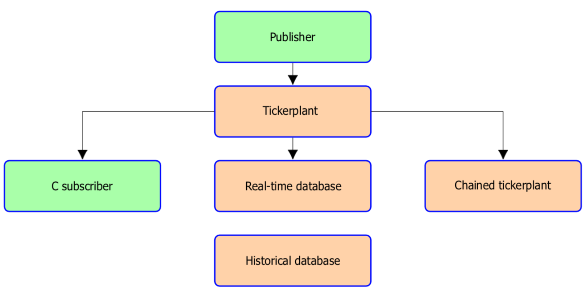

White paper
{: #wp-brand}

# C API for kdb+

by [Jeremy Lucid](#author)
{: .wp-author}

 


In its traditional financial domain, and across an increasingly broad range of industries, one of the main strengths of kdb+ is its flexibility in integrating and communicating with external systems. This adoption-enhancing feature is facilitated through a number of interfaces, including C and Java APIs, ODBC support, HTTP and WebSockets. 

This paper will illustrate how the C API can be used to enable a C program to interact with a kdb+ process, and so leverage the real-time streaming and processing strengths of kdb+. Particular consideration will be given to how the API can facilitate subscription and publication to a kdb+ tickerplant process, a core component of any kdb+ tick-capture system. Just as trade and quote data can be piped into a financial kdb+ application through a C feedhandler, interesting new datasets in non-financial industries can readily be consumed and processed with minimal setup work in C.

For example, in a recent white paper “[Kdb+ in astronomy](../astronomy.md)” a standard scientific file format is loaded into kdb+ for fast calculation of the recessional velocities of celestial bodies.

While [Interfaces: C](../../interfaces/c-client-for-q.md) remains the primary source for up-to-date information on the C API, the examples presented here provide a complementary set of practical templates. These templates can be combined and used to apply kdb+ across a broad range of problem domains. 

:fontawesome-brands-github:
[kxcontrib/capi](https://github.com/kxcontrib/capi)


## `K` object

To understand how the C API works, it is best to start by examining the contents of the
[`k.h`](https://github.com/KxSystems/kdb/blob/master/c/c/k.h) 
header file. This header file needs to be included in the C or C++ code in
order to interact with a kdb+ process. In particular, the header includes
the definition of the data type `K`, which is a pointer to the `k0` struct, shown below. This data type is important because all q types, such as atoms, lists, dictionaries and tables are encapsulated at the C level as instances of the `K` data type. Having `K` defined as a pointer is advantageous from a memory perspective, resulting in greater efficiency when passed as an
argument to a C function.

```c
/* Structure below corresponds to version 3.0 and higher */
typedef struct k0 {
    signed char m,a,t;  // m,a are for internal use.
    C u;
    I r; 
    union {
        G  g; 
        H  h; 
        I  i; 
        J  j; 
        E  e; 
        F  f; 
        S  s;

        struct k0*k;
        struct {J  n;G  G0 [1];};
    }; 
} *K;
```


## Connecting to a kdb+ process


### Starting a kdb+ server

In order for a C program to interact with a kdb+ process using the API, it is necessary that the kdb+ process be enabled to listen for incoming connections. To start a kdb+ process in server mode, whereby it listens for requests on a particular port number, the process should be started from the terminal using the [`-p` command-line argument](../../basics/cmdline.md#-p-listening-port), as shown below.

```bash
$ q -p 12345
```
```q
q)\p // Command used to show what port number the process is listening to
12345i
```

The process can now receive incoming connections via TCP/IP on port 12345. Alternatively, the port number can be (re)set using the [system command `\p`](../../basics/syscmds.md#p-listening-port) while within the kdb+ session.

```q
q)\p        //0i is default value when no command line argument is given
0i
q)\p 12345 
q)\p
12345i
```

Without setting a port number via the command-line argument, the kdb+ session will default to a port value of `0i`, meaning no socket listening. Explicitly setting the port to `0i`, as shown below, will close any previously open port. This will result in all new connection attempts being rejected.

```bash
$ q -p 12345
```
```q
q)\p 0          // Close previously opened port
```


### Opening a socket connection

The [`k.h`](https://github.com/KxSystems/kdb/blob/master/c/c/k.h) header file defines the `khpu` function prototype, shown below, which can be used to open a network socket connection to a listening kdb+ process.

```c
typedef int  I;          // Already defined within k.h
typedef char *S;         // Already defined within k.h
I khpu(S hostname, I portNumber, S usernamePassword)
```

The function takes three parameters and returns the integer value associated with the connection handle. This integer value returned is the OS file descriptor. The first and second parameters expect the hostname and port number of the listening kdb+ process, respectively. The third parameter, `usernamePassword`, expects a string argument containing the username and password credentials required for authentication. The username and password in this string argument should be separated by a single colon. If the listening kdb+ process is not using authentication for incoming connections then the username and password values will be ignored.

```c
khpu ("localhost", 12345, "username:password");
```

The C program below shows how `khpu` can be used to create a socket handle to a kdb+ process already listening on port 12345. After the handle value is successfully error checked, using the convenience function `handleOk` (code given below), its value is printed to stdout and the handle closed using the `kclose` function.

```c
/* File name: portopen.c */
#include "common.h"

int main()
{
    I handle;
    I portnumber= 12345;
    S hostname= "localhost";
    S usernamePassword= "kdb:pass";

    handle= khpu(hostname, portnumber, usernamePassword);
    if(!handleOk(handle))
        return EXIT_FAILURE;

    printf("Handle value is %d\n",handle);

    kclose(handle);
    return EXIT_SUCCESS;
}
```

!!! tip "Compile and run"

    The [`c.o`](https://github.com/KxSystems/kdb/tree/master/l32) header file is required for compilation.

When `khpu` connects successfully, the handle value returned is always a positive number. Positive values indicate success with negative values being reserved for error conditions. Possible return values for the `khpu` function are listed below, and form the basis for the error handling logic performed by `handleOk`. This function is one of a pair of error-handing utilities which will be used across multiple subsequent examples. All utility functions are defined in the `common.h` header file which is loaded as part of each example. 

Particular attention should be paid towards error handling when using the API, and it is for this reason that such logic is included within examples presented herein. Further details on error signaling will be presented [below](#error-signalling).

handle | status
:-----:|----------------
\>0    | Active handle
0      | Authentication error
-1     | Error
-2     | Timeout (when `khpun` is used instead of `khpu`)

```c
#include <stdio.h>
#include <stdlib.h>
#include <string.h>
#include <errno.h>
#include <k.h>

I handleOk(I handle)
{
    if(handle > 0)
        return 1;
    if(handle == 0)
        fprintf(stderr, "Authentication error %d\n", handle);
    else if(handle == -1)
        fprintf(stderr, "Connection error %d\n", handle);
    else if(handle == -2)
        fprintf(stderr, "Timeout error %d\n", handle);
    return 0;
}
```

The timeout error is associated with the `khpun` function, which is similar to `khpu` but allows for a connection timeout to also be specified. The error `-2` indicates that the specified timeout time was exceeded before the connection could be created. The function prototype for `khpun` is given below.

```c
typedef int  I;    // already defined within k.h
typedef char *S;   // already defined within k.h

I khpun(S hostname, I portnumber, S usernamePassword, I timeout)

// Timeout is specified in milliseconds
// A 5-second timout would have a value of5000
```


### Running queries using the `k` function

The `k` function is used to send a message over a socket connection to a kdb+ process. Valid message instructions can be used to perform multiple actions, which include, but are not limited to, requests for data, table inserts, variable initialization and function execution. The response is encapsulated on the C level as a `K` object and returned by the `k` function. Within the [`k.h`](https://github.com/KxSystems/kdb/blob/master/c/c/k.h) header file the function is defined as follows.

```c
typedef int  I;
typedef char *S;

K k(I handle, const, S query, ...)
```

The first parameter to the `k` function is the handle value returned by the `khpu` function call. The second is the message string containing the instructions to be executed by the receiving kdb+ process. By definition, the ellipsis indicates the function can take an indeterminate number of arguments following the message string. These additional arguments would be the required inputs associated with execute instructions. For example, if the instruction is to execute the kdb+ `insert` function, the additional arguments required would be the table name and data object to be inserted; see [_Creating a simple list object_](#creating-a-simple-list-object) for an example.

Note that the `k` function requires the user always to supply a sentinel
value, `(K)0`, following the additional argument list. The presence of this sentinel is used as a control variable enabling the function to detect the end of the additional argument list. This value should also be present in the case where no additional arguments are required, see below.

```c
// When no additional parameters are required the (K)0
// sentinel should be added as the third parameter
K k(handle, "query", (K)0)

// When additional parameters are required (K)0
// should be added following the last parameter
K k(handle, "query", param1, ..., paramN, (K)0)
```

The `k` function returns an instance of a `K` object, from which an accessor function/macro can be used to access the data. Below is a simple example demonstrating how the `k` function can be used to confirm that a kdb+ process is alive, where ‘alive’ means that the socket connection can be established and that the server can respond to a trivial request. Such a test could be performed periodically to determine the q server state.

```c
/* Filename: alivecheck.c */
#include "common.h"

int main() {
    I handle;
    I portnumber= 12345;
    S hostname= "localhost";
    S usernamePassword= "kdb:pass";
    K result;

    handle= khpu(hostname, portnumber,usernamePassword);
    if(!handleOk(handle))
        return EXIT_FAILURE;
    printf("Handle value is %d\n", handle);
    result= k(handle, "2.0+3.0", (K)0);
    if(isRemoteErr(result)) {
        kclose(handle);
        return EXIT_FAILURE;
    }
    printf("Value returned is %f\n", result->f);

    r0(result);
    kclose(handle);
    return EXIT_SUCCESS;
}
```

Compile and run.

```bash
$ gcc -DKXVER=3 -o alivecheck alivecheck.c c.o -lpthread
$ ./alivecheck
Handlevalue is 3
Value returned is 5.000000
```

In the above example, another convenience function, `isRemoteErr`, is introduced to handle any errors encountered during the remote evaluation. The function is defined as follows and is explained in further detail in the following section.

```c
/* common.h */

I isRemoteErr(K x) {
    if(!x) {
        fprintf(stderr, "Network error: %s\n", strerror(errno));
        return 1;
    } else if(-128 == xt) {
        fprintf(stderr, "Error message returned : %s\\n", x-\>s); 
        r0(x);
        return 1;
    }
    return 0;
}
```


### Error signaling

In general, there are two common types of errors; those generated during the socket-handle initialization process and those which can occur during the evaluation of a request. As described in [_Opening a socket connection_](#opening-a-socket-connection), where the error-handling function `handleOk` was introduced, initialization errors can be identified by examining the integer value returned by the `khpu` and `khpun` function calls.

As an example of an initialization error, the ”Authentication Error” will occur when the user name or password credentials passed to `khpu` are invalid. In kdb+, a process can be started in a restricted access mode where only users with valid credentials can connect.

:fontawesome-regular-hand-point-right: 
White paper: [WebSockets](../websockets/index.md)

Similarly, the ”Connection error” can result for incorrect hostname or port numbers being passed to `khpu`.

Evaluation errors occur from invalid queries being passed to the kdb+ process using `k`. In this case, the type element (`x->t`) of the `K` object, `x`, returned by `k` should be checked, see [_Object type element t_](#object-type-element-t). If the type value is 0 (null), then a network error has occurred. If the type value is `-128`, then `x->s` will give the error message resulting from the invalid query. In `error.c`, below, three invalid queries are passed to a kdb+ process and their associated error messages printed. For all subsequent examples in this paper, the function `isRemoteErr` will be used to capture such errors. 

:fontawesome-regular-hand-point-right:
Basics: [Errors](../../basics/errors.md) for the complete list of error codes 

```c
/* File name: error.c */
#include "common.h"

int main() { 
    K result;
    I port= 12345;
    I timeout= 5000; 
    I handle;

    handle= khpun("localhost", port, "kdb:pass", timeout);
    if(!handleOk(handle))
        return EXIT_FAILURE;

    result= k(handle, "1+`2", (K)0);
    // Handle network error 
    if(!result) {
        perror("Network Error\n"); 
        kclose(handle);
        return EXIT_FAILURE;
    }

    if(-128 == result->t) {
        fprintf(stderr, "Error message returned : %s\n", result->s);
    }
    r0(result);

    result= k(handle, "`a`b`c=`a`b", (K)0);
    // Handle network error 
    if(!result) {
        perror("Network Error\n"); 
        kclose(handle);
        return EXIT_FAILURE;
    }

    if(-128 == result->t) {
        fprintf(stderr, "Error message returned : %s\n", result->s);
    }
    r0(result);

    result= k(handle, "select sym t:([] sym:`a`b)", (K)0);
    // Handle network error 
    if(!result) {
        perror("Network Error\n"); 
        kclose(handle);
        return EXIT_FAILURE;
    }

    if(-128 == result->t) {
        fprintf(stderr, "Error message returned : %s\n", result->s);
    }
    r0(result);

    kclose(handle); 
    return EXIT_SUCCESS;
}
```

Compile and run.

```bash
$ gcc -DKXVER=3 -o error error.c c.o -lpthread
$ ./error
Error message returned: type
Error message returned: length
Error message returned: from
```

### Synchronous vs asynchronous communication

If a C process is using the API to publish messages to a kdb+ process, such as a tickerplant, then either a synchronous or asynchronous call can be used. The sign of the first parameter to the `k` function determines if the function call will execute synchronously or asynchronously. In the example above, `k` executed synchronously because the handle value passed to the function was a positive value. The synchronous call will block until a response is received, which is appropriate if the sending process requires an acknowledgement, however, it will reduce the potential message rate. In order to send an asynchronous message, the `k` function should be passed the negative
handle value.

```c
k(-handle, "1.0 + 2.0", (K)0);
```

The asynchronous option is recommended when maximum data throughput is desired and the sender does not require an acknowledgment. Greater technical details on synchronous vs asynchronous requests can be found in the following white papers.

:fontawesome-regular-hand-point-right: White papers:  
[Common design principles for kdb+ gateways](../gateway-design/index.md)  
[Query Routing: A kdb+ framework for a scalable, load balanced system](../query-routing/index.md)


## Extracting data from a `K` object

### Accessing a `K` object element

As demonstrated in the previous chapter, the `k` function can be used to send messages over a socket connection to a kdb+ process. The data returned from the kdb+ process is then encapsulated at the C level as a `K` object. That is to say, any q object such as an atom, list, dictionary or table will be contained within the structure referenced by the `K` pointer. To extract data from a `K` object, the `->` operator can be used to access the member elements of the `k0` structure.


### Object type element `t`

Given a `K` object `x`, the member element `x->t` identifies the object’s data type. This element can also be accessed using the equivalent macro provided, `xt`.

```c
# define xt x->t
```

The following reference table gives the q data type (or error) for the given `t` value.

t value | object type or error
:------:|----------------------------------------
< 0    | Atom or an error type
98      | Table
99      | Dictionary or keyed table
-128    | Error
\> 0    | List where items are of the same data type
0-19    | List
20-76   | Enumerated types
77-97   | Nested data types
100-112 | Function types


### List length element `n`

The element `n` indicates the length of a list object. The list may contain atomic items or other `K` objects. Given a `K` object `x`, the `n` member element can be accessed using the notation <span class="nowrap">`x->n`</span>. The example below demonstrates usage for the case of a list containing atomic float elements.

```c
/* File name: length.c */
#include "common.h"

int main() {
    I handle;
    I portnumber=12345;
    S hostname= "localhost";
    S usernamePassword= "kdb:pass";
    K list;

    handle= khpu(hostname, portnumber, usernamePassword);
    if(!handleOk(handle))
        return EXIT_FAILURE;

    list = k(handle, "2*1 2 3f",(K)0);
    if(isRemoteErr(list)) {
        kclose(handle);
        return EXIT_FAILURE;
    }

    printf("List length is %lld\n",list->n);

    r0(list);
    kclose(handle);
    return EXIT_SUCCESS;
}
```

 

```bash
$ gcc -DKXVER=3 -o length length.c c.o -lpthread
$ ./length
List length is 3
```

For more complex data structures such as dictionaries, `n` indicates the number of keys and the number of values associated with each key. Similarly, for tables, `n` can be used to extract the number of rows and columns present. Working examples for dictionaries and tables are given further below.


### Extracting atoms

From the reference table above, when the value of `t` is less than 0 and not equal to `-128` then the object is an atom (or scalar). In which case, the value of `t` identifies the q data type, using the lookup table below. Corresponding to each data type is the associated accessor function used to extract the scalar value from the `K` object. The accessor functions access the union member elements of the structure.

Note that the type numbers below are given for vectors (positive values). By convention, for atoms (single elements) the type number is negative. For example, `-6` is the type number of an atom int value. 

```txt
data type        accessor           type number type name
---------------------------------------------------------
mixed list       kK                 0           -
boolean          x->g               1           KB
guid             x->U               2           UU
byte             x->g               4           KG
short            x->h               5           KH
int              x->i               6           KI
long             x->j               7           KJ
real             x->e               8           KE
float            x->f               9           KF
char             x->i               10          KC
symbol           x->s               11          KS
timestamp        x->j               12          KP
month            x->i               13          KM
date             x->i               14          KD
datetime         x->f               15          KZ
timespan         x->j               16          KN
minute           x->i               17          KU
second           x->i               18          KV
time             x->k               19          KT
table/flip       x->k               98          XT
dict/table with  kK(x)[0] (keys)    99          XD
primary key      kK(x)[1] (values) 
```


### Extracting simple lists

When the value of `t` is within the range 0 to 19 the object is a simple list. A simple list is analogous to a C array in which each element in the structure has the same data type. As is the case with atoms, the value of `t` identifies the data type of the simple list elements. To access the list values, the following accessors are provided.

```c
#define kG(x)  ((x)->G0)
#define kC(x)  kG(x)
#define kH(x)  ((H*)kG(x))
#define kI(x)  ((I*)kG(x))
#define kJ(x)  ((J*)kG(x))
#define kE(x)  ((E*)kG(x))
#define kF(x)  ((F*)kG(x))
#define kS(x)  ((S*)kG(x))
#define kK(x)  ((K*)kG(x))
```

The following example demonstrates use of these functions for the case of a simple list containing ints, floats and symbols.

```c
/* File name: lists.c */
#include "common.h"

int main() { 
    I handle;
    I portnumber= 12345; 
    S hostname= "localhost";
    S usernamePassword= "kdb:pass"; 
    K x;

    handle= khpu(hostname, portnumber, usernamePassword);
    if(!handleOk(handle))
        return EXIT_FAILURE;

    x= k(handle, "reverse `A`B`C", (K)0); 
    if(isRemoteErr(x)) {
        kclose(handle); 
        return EXIT_FAILURE;
    }

    printf("Symbols: %s %s %s\n", kS(x)[0], kS(x)[1], kS(x)[2]);
    r0(x);
    x= k(handle, "reverse 1 2 3", (K)0); 
    if(isRemoteErr(x)) {
        kclose(handle); 
        return EXIT_FAILURE;
    }

    printf("Ints: %lld %lld %lld\n", kJ(x)[0], kJ(x)[1], kJ(x)[2]);
    r0(x);
    x= k(handle, "reverse 1.0 2.0 3.0", (K)0); 
    if(isRemoteErr(x)) {
        kclose(handle); 
        return EXIT_FAILURE;
    }

    printf("Floats: %f %f %f\n", kF(x)[0], kF(x)[1], kF(x)[2]);

    r0(x);
    kclose(handle);
    return EXIT_SUCCESS;
}
```

Compile and run.

```bash
$ gcc -DKXVER=3 -o lists lists.c c.o -lpthread
$ ./lists
Symbols: C B A
Ints: 3 2 1
Floats: 3.000000 2.000000 1.000000 
```


### Extracting mixed lists

In the case where `x->t` is exactly zero, the `K` object contains a mixed list of other `K` objects. Each element in the list is a pointer to another `K` object. In the example below, a mixed list containing two elements is returned from the kdb+ process. Element 1 is a list of five integers and element 2 is a list of three floats. The example demonstrates how the length and type of each list element can be determined along with how the values can be extracted.

```c
/* File name: mixedList.c */
#include "common.h"

int main() { J i;

    I handle;
    I portnumber= 12345;
    S hostname= "localhost";
    S usernamePassword= "kdb:pass";
    K mixedList, elementOne, elementTwo;

    handle= khpu(hostname, portnumber, usernamePassword);
    if(!handleOk(handle))
        return EXIT_FAILURE;

    mixedList= k(handle, "(1 2 3 4 5;20.0 30.0 40.0)", (K)0);
    if(isRemoteErr(mixedList)) {
        kclose(handle); 
        return EXIT_FAILURE;
    }

    printf("Object mixed list type: %d\n", mixedList->t); 
    printf("Mixed list contains %lld elements\n", mixedList->n);

    elementOne= kK(mixedList)[0]; 
    elementTwo= kK(mixedList)[1];

    printf("elementOne contains %lld elements\n", elementOne->n);
    printf("elementTwo contains %lld elements\n", elementTwo->n);

    for(i= 0; i < elementOne->n; i++) {
    printf("elementOne\[%lld\] = %lld\n", i, kJ(elementOne)[i]);
    }

    for(i= 0; i < elementTwo->n; i++) { 
        printf("elementTwo\[%lld\] = %f\n", i, kF(elementTwo)[i]);
    }

    r0(mixedList); 
    kclose(handle); 
    return EXIT_SUCCESS;
}
```

Compile and run.

```bash
$ gcc -DKXVER=3 -o mixedList mixedList.c c.o -lpthread 
$ ./mixedList
Object mixed list type: 0
Mixed list contains 2 elements
elementOne contains 5 elements
elementTwo contains 3 elements
elementOne has type 7
elementTwo has type 9
elementOne [0]=1
elementOne [1]=2
elementOne [2]=3
elementOne [3]=4
elementOne [4]=5
elementTwo [0]=20.000000
elementTwo [1]=30.000000
elementTwo [2]=40.000000
```

### GUID

Since kdb+ V3.0, the globally unique identifier (GUID) data type is supported. This is a 16-byte data type which can be used for storing arbitrary 16-byte values, typically transaction IDs. In general, since V3.0, there should be no need to use char vectors for IDs. Instead IDs should be int, sym or GUID. For table lookups, GUIDs are also much faster when performing equality comparisons in the Where clause relative to the string representation, which also takes up 2½ times more space. The memory saving can be easily illustrated by comparing the byte size of a table containing a single column of GUIDs with that of a table containing a single column string equivalent. The internal q function,
`-22!`, conveniently returns the table byte size. 

Compute ratio:

```q
q)(%). -22!'(([]string 100?0Ng);([]100?0Ng))
2.594114
```

The example below demonstrates how to extract a single or list of
GUIDs from a kdb+ process.

```c
/* File name: guid.c */
#include "common.h"

int main() {
    J i, j;
    I handle;
    I portnumber= 12345;
    S hostname= "localhost";
    S usernamePassword= "kdb:pass";
    K singleGuid, multiGuid;

    handle= khpu(hostname, portnumber, usernamePassword);
    if(!handleOk(handle)) 
        return EXIT_FAILURE;

    singleGuid= k(handle, "rand 0Ng", (K)0);
    if(isRemoteErr(singleGuid)) {
        kclose(handle);
        return EXIT_FAILURE;
    }

    printf("Single guid: type %d\n", singleGuid->t);
    printf("Single guid: length %lld\n", singleGuid->n);

    for(i= 0; i < 16; i++) {
        printf("%02x", kU(singleGuid)->g[i]);
    }
    r0(singleGuid);
    printf("\n");

    multiGuid= k(handle, "2?0Ng",(K)0);
    if(isRemoteErr(multiGuid)) {
        kclose(handle);
        return EXIT_FAILURE;
    }

    printf("Multi guid: type %d\n", multiGuid->t);
    printf("Multi guid: length %lld\n", multiGuid->n);

    for(i= 0; i < multiGuid->n; i++) {
        for(j= 0; j < 16; j++) {
            printf("%02x", kU(multiGuid)[i].g[j]);
        }
        printf("\n");
    }
    r0(multiGuid);
    kclose(handle);
    return EXIT_SUCCESS;
}
```

Compile and run.

```bash
$ gcc -DKXVER=3 -o guid guid.c c.o - lpthread 
$ ./guid
Single guid: type -2 
Single guid: length 1
be6cc222695dd8964e46c709b06f3573 
Multi guid: type 2
Multi guid: length 2
730690ccf4ebd95c6d2d039255d11ae6 
45135fc5509403e4ab7eae705ba54437
```


### Dictionaries

In kdb+, a dictionary is a data type which creates an association between a list of keys and a list of values. From the lookup table in [_Object type element t_](#object-type-element-t), its numerical type, `x->t`, has value 99 (type name XD). In the next example, the `k` function is used to return a simple dictionary object, `x`. As expected, `x` contains a list of length two, where the first element corresponds to the dictionary keys, and the second corresponds to the dictionary values. In particular, the keys element has value 11 (type name `KS`), indicating that the keys are a symbol list. (See [_Extracting atoms_](#extracting-atoms).) The second element has type 0, indicating that the values of the dictionary are contained in a mixed list. Therefore, not all keys have an associated value of the same data type. Below, the mixed list `values` is iterated through to extract and display the individual elements of each simple list element.

```c
/* File name: dict.c */
#include "common.h"

int main() {
    J i;
    I handle;
    I portnumber= 12345;
    S hostname= "localhost";
    S usernamePassword= "kdb:pass";
    K x, keys, values;

    handle= kfpu(hostname, portnumber, usernamePassword);

    if(!handleOk(handle)) 
        return EXIT_FAILURE;

    x= k(handle, "`a`b`c!((1;2;3);(10.0;20.0);(`AB`CD`EF`GH))",(K)0);

    if(isRemoteErr(x)) {
        kclose(handle);
        return EXIT_FAILURE;
    }

    printf("Dict type = %d\n",x->t);
    printf("Num elements = %lld (keys and values)\n", x-n);

    keys= kK(x)[0];
    values= kK(x)[1];

    printf("Keys type = %d\n", keys->t);
    printf("Num keys = %lld\n", keys->n);

    printf("Values type = %d\n", values->t);
    printf("Num values = %lld\n", values->n);

    for(i= 0; i < keys->n; i++) {
        printf("keys[%lld] = %s\n", i, kS(keys)[i]);
    }

    for(i= 0; i < values->n; i++) {
        printf("values[%lld] has length %lld\n", i, kK(values)[i]->n);
    }

    J *values0= kJ(kK(values)[0]); 
    F *values1= kF(kK(values)[1]); 
    S *values2= kS(kK(values)[2]);

    printf("values[0;] = %lld %lld %lld\n", values0[0], values0[1], values0[2]);
    printf("values[1;] = %lf %lf       \n", values1[0], values1[1]);
    printf("values[2;] = %s %s %s %s   \n", values2[0], values2[1], values2[2], values2[3]);

    r0(x); 
    kclose(handle); 
    return EXIT_SUCCESS;
}
```

Compile and run.

```bash
$ gcc -KKXVER=3 -o dict dict.c c.o -lpthread
$ ./dict
Dict type = 99
Num elements = 2 (keys and values)
Keys type = 11
Num keys = 3
Values type = 0
Num values = 3
keys[0] = a
keys[1] = b
keys[2] = c
values[0] has length 3
values[1] has length 2
values[2] has length 4
values[0;] = 1 2 3
values[1;] = 10.000000 20.000000
values[2;] = ABC DEF GHI JKL
```


### Tables

Extracting data from a `K` object containing a table is similar to that for a dictionary. The element `x->k` will contain a two-element list, representing a dictionary of columns to values. The first element, `kK(x->k)[0]`, corresponds to the column names, with the second, `kK(x->k)[1]`, corresponding to the values. Table keys are always symbol vectors (`KS`). The number of columns present in the table is easily determined using the `n` element (see `columns->n` below). The values object is a mixed list, where each element in the list is another `K` object containing a simple or mixed list. The example below shows how the column names and values of a kdb+ table can be
extracted.

```c
/* File name: table.c */
#include "common.h"

int main() { J i;
    I handle;
    I portnumber= 12345;
    S hostname= "localhost";
    S usernamePassword= "kdb:pass";
    K table, columns, values, col1, col2;

    handle= khpu(hostname, portnumber, usernamePassword);
    if(!handleOk(handle))
        return EXIT_FAILURE;

    // Execute a query which performs an aggregate on table t
    // Table t can be defined on the kdb+ process as follows
    // q)t:([] sym:`a`a`b`b`c`c;price:1.0 2.0 3.0 4.0 5.0 6.0)
    table= k(handle, "select from t where price=(max;price) fby sym", (K)0); 
    if(isRemoteErr(table)) {
        kclose(handle); 
    return EXIT_FAILURE;
    }

    // Extract columns and values elements 
    columns= kK(table->k)[0];
    values= kK(table->k)[1];

    // Show column count and print column names 
    printf("Number of Columns = %lld\n", columns->n);
    printf("Columns: %s %s\n", kS(columns)[0], kS(columns)[1]);
    
    // Access the table values
    printf("values object has type = %d\n", values->t);
    
    col1= kK(values)[0]; 
    col2= kK(values)[1];
    
    printf("Number of elements in column 1 is %lld\n", col1->n); 
    
    for(i= 0; i < col1->n; i++) {
        printf("%s %lf\n", kS(col1)[i], kF(col2)[i]);
    }

    r0(table); 
    kclose(handle); 
    return EXIT_SUCCESS;
}
```

Compile and run.

```q
q)t:([] sym:`a`a`b`b`c`c; price:1.0 2.0 3.0 4.0 5.0 6.0)
q)\p 12345
```
```bash
$ gcc -DKXVER=3 -o table table.c c.o -lpthread
$ ./table
Number of Columns = 2
Columns: sym price
values object has type = 0
Number of elements in column 1 is 3
a 2.000000
b 4.000000
c 6.000000
```

`values object has type = 0` means it contains a mixed list of other `K` objects. 


## Creating `K` objects

In the code example `alivecheck.c`, the query evaluated on the kdb+ process was very simple, `"2.0 + 3.0"`, and didn’t require additional arguments. However, if the query were of a functional form, requiring a single
scalar parameter argument, for example `func:{[x] 1.0 + x}`, the scalar argument should be input immediately after the query. For the argument to be passed successfully, it is necessary that the C variable be converted to its corresponding `K` object. The examples below show how single or multiple arguments of different data types can be passed to the functional query using such conversion functions.

```c
// Pass a single integer argument
result = k(handle,"{[x] 1 + x}", ki(2), (K)0);

// Pass a single float argument
result = k(handle,"{[x] 1.0 + x}", kf(2.0), (K)0);

// Pass multiple float arguments
result = k(handle,"{[x;y] x + y}", kf(1.0), kf(2.0), (K)0);

// Pass a single symbol arguments
result = k(handle,"{[x] x in `ABC`DEF`GHI}", ks((S)"ABC"), (K)0);
```

The table below shows the list of functions used to perform this conversion for other data types not given in the examples above.

```txt
function       creates 
---------------------------
K ka(I)        atom of type
K kb(I)        boolean
K ku(U)        guid
K kg(I)        byte
K kh(I)        short
K ki(I)        int
K kj(J)        long
K ke(F)        real
K kf(F)        float
K kc(I)        char
K ks(S)        symbol
K ktj(-KP,J)   timestamp
K kt(I)        time
K kd(I)        date
K ktj(-KN,J)   timespan
K kz(F)        datetime
```


### Creating and passing vector arguments

It is common that a function call or query require a vector as opposed to a scalar argument. An example of a vector argument in q would be a simple or mixed list. To create a list object, be it simple or mixed, using the API library, the following functions are available in the `k.h` header file.

```c
// Create a simple list, where the type does not take value zero
K ktn(I type, I length)

// Create a mixed list
K ktn(0, I length);
K knk(I length, ...); // Common and useful shortcut
```

Both of these functions will be described in greater detail below.


### Creating a simple list object

A simple list in kdb+ is a collection of elements each with the same data type, analogous to a C array. To create a list object, using the API, the function `ktn` is used. The first parameter to this function specifies the data type of the list elements. From the [reference table](../../interfaces/c-client-for-q.md) either the q type number or encoded type name values can be used to specify the data type. The second parameter specifies the length of the list. The example below shows how to create an integer list object of length 2.

```c
// Encoded type name is used to specify the type
// List length initialized to 2
K integerList = ktn(KI, 2);
```

With the list object initialized it is straightforward to insert elements into the list using the interface list accessor function, as given in the reference table. In the example below, it is demonstrated how the elements of the list can be initialized using the `kI` accessor function. This two-element list is then passed as a parameter to an `insert` function on a kdb+ process. The list is inserted as a new row into the table `t`.

```c
I i = 1;
I j = 2;
// List of type int initialized with two elements allocated

K integerList = ktn(KI,2);
kI(integerList)[0]=i; // Insert element i at position 0
kI(integerList)[1]=j; // Insert element j at position 1
k(handle, "insert", ks((S)"t"), integerList, (K)0);
```

If it is not possible to know in advance the length of the list object, an alternative approach would be to initialize a list object with length 0 and subsequently append elements to the list using the provided join functions shown below.

```c
typedef void V;
typedef char *S;

K ja(K*,V*);       // Join an atom to a list
K js(K*,S);        // Join a string to a list
K jk(K*,K);        // Join another K object to a list
K jv(K*,K);        // Join another K list to the first
```

The example below shows how an integer list of size zero can be initialized and later appended to using the `ja` function. Note that because the first and second parameters to this function are of type pointer (`*`), the value passed needs to be the memory address of the given object.

```c
I i = 1; 
I j = 2;

// List of type KI (int) initialized with size zero K 
integerList = ktn (KI , 0);

integerList = ja (&integerList ,&i ); // Append element i to the list
integerList = ja (&integerList ,&j ); // Append element j to the list 
k(handle, "insert", ks((S) "t"), integerList, (K)0);
```


### Creating a mixed-list object

A mixed list in q is a collection of elements where each element may be of a different data type, analogous to a C struct. To create a mixed-list object, using the API, the function `knk` is used. From the definition above, the `knk` function is defined as a variable-argument function meaning the number of parameters is not fixed, as shown below.

```c
// Create a mixed list, where n is the numbner of elements
typedef int I;
K knk(I n, ...);
```

Above, `n` defines the number of elements in the list, where each list element, 1 to `n`, may be of a different data type. In the example below, a mixed list object of length 3 is created and initialized with elements of a different data type; symbol, float and integer. This example demonstrates how a mixed list can be passed to the `k` function for insertion into a table. In this case, the mixed list is inserted as a single row into the table `trade`.

```c
K mixedList;
mixedList = knk(3, ks((S)"ABC"), kf(10.0), ki(20));

k(handle, "{[x] `trade insert x}", mixedList, (K)0);
```

A mixed list can also be created where each element is itself a simple list. This object is typically used for bulk inserts in which multiple rows are inserted at once.

```c
multipleRow = knk(3, ktn(KS,N), ktn(KFn), ktn(KI,n));
```

The code segment below demonstrates how a mixed-list object can be populated with simple lists, each of length two.

```c
I int_1 = 1; 
I int_2 = 2;
K integerList = ktn(KI, 2);   // Simple list object of type int 
kI(integerList)[0] = int_1;
kI(integerList)[1] = int_2;

F float_1 = 1.5; 
F float_2 = 2.5;
K floatList = ktn(KF, 2);     // Simple list object of type float 
kF(floatList)[0] = float_1;
kF(floatList)[1] = float_2;

S sym_1 = ss("IBM"); 
S sym_2 = ss("ABC");

K symList = ktn(KS, 2);       // Simple list object of type symbol
kS(symList)[0] = sym_1; 
kS(symList)[1] = sym_2;

// 2 rows with 3 columns
multipleRow = knk(3, symList, floatList, integerList);
```


## Memory management

Whereas kdb+ manages a program’s memory requirements automatically, C provides several functions for manual memory allocation and management. These functions include `malloc`, `calloc`, and `free`, and allow for fine-tuned memory management: an important requirement for software destined for mobile or miniature devices. In the case where a C program is required to handle `K` objects, the C API provides a few simple functions, detailed below, to manage memory through the process of incrementing or decrementing a `K` objects reference count.


### Reference counting

Kdb+ automatically manages reference counts to determine when an object is safe to destroy.

As the number of references to an object increase or decrease, its associated reference count is incremented or decremented accordingly. When the reference value reaches zero the object can be safely destroyed. In the case of a memory resource, when the object is destroyed the memory would be freed and made available for reallocation. In kdb+, the reference count can be accessed directly using the [internal function `-16!`](../../basics/internal.md#-16x-ref-count). The following example shows the reference count incrementing and decrementing as expected.

```q
q)a:5?10.0
q)a
7.85033 5.347096 7.111716 4.11597 4.931835
q)-16!a
1i
q)b: a
q)-16!a
2i
q)-16!b
2i
q) delete a from `.
q)-16!b // Since a was deleted, b's ref count decreased
1i
```

To increment or decrement the reference count manually within a C program the following API functions are available.

```c
/* Increment the object's reference count */ 
r1(K x)
/* Decrement the object's reference count */ 
r0(K x)
```

The member element `r` stores the current reference count for a K object.

```c
/* Fine name: refcount.c */
  #include "common.h"
  int main() {
    K a, b;
    khp("", -1); // initialise memory if not opening connection before allocation
    a= ki(3);    // Create K object a
    printf("New K object a has ref count = %d\n", a->r);
   
    b= a;  // Set b equal to a
    r1(a); // Increment a's reference count
    printf("incremented ref count of a = %d\n", a->r);
    printf("ref count of b = %d\n", b->r);
   
    r0(b); // Decrement b's reference count
    printf("decrement ref count of b = %d\n", b->r);
    printf("ref count of a was decremented to = %d\n", a->r);
   
    printf("value of a is still available: %d\n", a->i);
   
    r0(a); // When an object of ref count 0 passed to r0, the object is destroyed 
    return EXIT_SUCCESS;
}
```

Compile and run.

```bash
$ gcc -DKXVER=3 -o refcount refcount.c c.o -lpthread
$ ./refcount
New K object a has ref count = 0
incremented ref count of a = 1
ref count of b = 1
decremented ref count of b = 0
ref count of a was decremented to 0
value of a is still available: 3
```

One needs to be very careful in the case where a `K` object is being passed as an argument to the `k` function, but is still required within the C program thereafter. This is because the object’s reference count will get decremented during the `k` function return. If the object’s reference count was zero prior to being passed, the object will be destroyed. 

This behavior is seen clearly in the example below, where the integer value held in the `K` object `a` is no longer available after `a` is passed as an argument to `k`.

```c
/* File name: refcountk.c */
#include "common.h"

int main() { I handle;
    I portnumber= 12345;
    S hostname= "localhost";
    S usernamePassword= "kdb:pass"; 
    K response, a;
    // NOTE: connection must be opened before creating K objects 
    handle= khpu(hostname, portnumber, usernamePassword); 
    if(!handleOk(handle))
        return EXIT_FAILURE;

    a= ki(5);
    printf("ref count of a is %d\n", a->r); 
    printf("int value of a is %d\n", a->i);

    response= k(handle, "{x+3i}", a, (K)0);
    // it is illegal to access a after this call as object has been destroyed

    if(isRemoteErr(response)) { 
        kclose(handle);
        return EXIT_FAILURE;
    }
    printf("response value is %d\n", response->i);

    r0(response); 
    kclose(handle); 
    return EXIT_SUCCESS;
}
```

Compile and run.

```bash
$ gcc -DKXVER=3 -o refcountk refcountk.c c.o -lpthread 
$ ./refcountk
ref count of a is 0
int value of a is 5
response value is 8
```

To ensure a `K` object is not destroyed as a result of this behavior, simply increment the objects reference count, using `r1` as described, prior to calling k.

In addition to the before-mentioned memory-management functions, there are also a number of functions which are required for multi-threaded program execution, such as `m9` and `setm`. Detailed usage examples of these are outside the scope of this paper, however, information can be found in the [Interfaces section](../../interfaces/c-client-for-q.md#managing-memory-and-reference-counting).


## Shared C libraries for kdb+

In kdb+, it is possible to dynamically load shared libraries to extend functionality at run time. Being able to create libraries and taking advantage of pre-existing libraries is a good way to accelerate development and enable multiple applications to share common modules. 

To create user-defined functions in C which can be loaded and used by a kdb+ process, the function should be defined such that the input parameters and return value are `K` objects.

```c
K myfunc (K param1, ..., K paramN)
{
    K result;
    return result;
}
```


### Loading a shared library using Dynamic Load

The Dynamic Load operator `2:` is used to import C functions dynamically from a shared library into a kdb+ process. It is a binary operator which can be applied with either prefix or infix notation.

```q
2:[argumentOne;argumentTwo]  // prefix notation
argumentOne 2: argumentTwo   // infix notation
```

`argumentOneis` a symbol representing the name of the shared dynamic library (excluding `.so` extension) which should be in the same location as your q executable. `argumentTwo` is a list containing two elements. The first of these elements is a symbol corresponding to the function name, and the second is the integer number of arguments that function accepts. For a shared library, `myLib.so`, and single argument library function, `myfunc`, loading would look as follows.

```q
q)f:`myLib 2: (`myfunc;1)
```

If the shared library is not located in the same folder as the q executable, it can be loaded by giving the path.

```q
q)f:`path/to/myLib 2:(`myfunc;1)
```


### User-defined function – Dot product

Below is an example of a user-defined function to compute the dot product of two vectors. The function first performs data type and length checks on the arguments passed before continuing to the calculation. If these checks fail, the `krr` function can be used to return the error to the calling kdb+ process.

```c
/* File name: mathLib.c */
#include <stdio.h>
#include "k.h"

K dotProduct(K x, K y) { 
    J i;
    double result= 0.0;
    // Check data types are consistent 
    if(x->t != KF || y->t != KF) {
        return krr("type");
    }

    // Check vector lengths are equal 
    if(x->n != y->n) {
        return krr("length");
    }

    for(i= 0; i < x->n; i++) { 
        result+= kF(x)[i] * kF(y)[i];
    }

    return kf(result);
}
```

Below, the `mathLib.c` file is compiled into a shared library and subsequently loaded into a kdb+ session. Two simple lists, `a` and `b`, of type float are created and the dot product computed using the loaded function. The result can be verified using the built-in q dot-product operator, `$`.

```bash
$ gcc -DKXVER=3 -c -Wall -Werror -fpic mathLib.c -lpthread
$ gcc -DKXVER=3 -shared -o mathLib.so mathLib.o -lpthread
$ q
```
```q
q)dotProduct:`mathLib 2:(`dotProduct;2) 
q)a:5?10.0
q)b:5?10.0
q)a
3.927524 5.170911 5.159796 4.066642 1.780839
q)b
3.017723 7.85033 5.347096 7.111716 4.11597
q)a$b
116.2861
q)dotProduct[a;b]
116.2861
q)b:6?10.0
q)dotProduct[a;b]
'length
  [0]  dotProduct[a;b]
       ^
q)b:5?10
q)dotProduct[a;b]
'type
  [0]  dotProduct[a;b]
       ^
```


### Hashing algorithms: MD5 and SHA-256

The following example demonstrates how to create a shared library, `cryptoLib.so`, which makes use of the open-source OpenSSL library. OpenSSL is an open-source project which contains general-purpose cryptographic tools, shown below. The first user-defined C function, `md5`, uses the library to compute the [MD5 hash](https://en.wikipedia.org/wiki/MD5) of a given string input. This function is already implemented natively in q and so can be used to validate the function’s operation. The second C function, `sha256`, uses the library to compute the more secure [SHA-2 hashing algorithm](https://en.wikipedia.org/wiki/SHA-2) which is not built into q.

```c
/* File name: cryptoLib.c */
#include <stdlib.h>
#include <string.h>
#include <openssl/md5.h>
#include <openssl/sha.h>
#include "k.h"

K md5(K inputString) {
    K outputHash;
    if(KC != inputString->t)
        return krr("type");
    outputHash= ktn(KG, MD5_DIGEST_LENGTH); 
    MD5(kC(inputString), inputString->n, kG(outputHash));
    return outputHash;
}

K sha256(K inputString) {
    K outputHash;
    if(KC != inputString->t)
        return krr("type");
    outputHash= ktn(KG, SHA256_DIGEST_LENGTH); 
    SHA256(kC(inputString), inputString->n, kG(outputHash));
    return outputHash;
} 

K sha512(K inputString) {
    K outputHash;
    if(KC != inputString->t)
        return krr("type");
    outputHash= ktn(KG, SHA512_DIGEST_LENGTH);
    SHA512(kC(inputString), inputString->n, kG(outputHash)); 
    return outputHash;
}
```

Compile and run.

```bash
$ gcc -DKXVER=3 -c -fpic cryptoLib.c -lpthread -lcrypto -lssl
$ gcc -DKXVER=3 -shared -o cryptoLib.so cryptoLib.o -lpthread -lcrypto -lssl
$ q
```
```q
q)cmd5:`cryptoLib 2:(`md5;1) 
q)cmd5"kx tech"
0x78fb4fda39a5b41ec9ffb5fdbdd83940 
q)md5"kx tech"
0x78fb4fda39a5b41ec9ffb5fdbdd83940 
q)csha256:`cryptoLib 2:(`sha256;1) 
q)csha256"kx tech"
0xa92b19579d02ed9ebde54951d3....
```


### Subscribing to a kdb+ tickerplant

A kdb+ tickerplant is a kdb+ process specifically designed to handle incoming, high-frequency, data feeds from publishing processes. The primary responsibility of the tickerplant is to manage subscription requests and publish data quickly to its subscribers. In the vanilla kdb+ setup, illustrated below, the real-time database (RDB) and chained tickerplant kdb+ processes are the most common type of subscriber. However, C applications are also possible using the API.



:fontawesome-regular-hand-point-right:
White paper: [Building real-time tick subscribers](../rt-tick/index.md)


### Test tickerplant and feedhandler setup

To facilitate testing of a C subscriber process, the following kdb+ tickerplant will be used.

:fontawesome-brands-github:
[KxSystems/kdb-tick](https://github.com/KxSystems/kdb-tick/blob/master/tick.q)

For the sake of demonstration, the publisher will be configured to send a mock market-data feed in the form of trade records to the tickerplant. The trade table schema to be used is defined below.

```q
/* File name: trade.q */
/* File should be stored in the tick folder */
trade:([]
  time:`timespan$();
  sym:`symbol$();
  price:`float$();
  size:`long$()`
  )
```

The tickerplant process is started from the command line as follows.

```bash
$ q tick.q trade /logs/tickerplant/ -p 5010
```

Above, the first argument following `tick.q` is the name of the table schema file to use. The second argument is the location where the tickerplant log file will be created and the value following the `-p` option is the port the tickerplant will listen on. The C process will use this port number when initializing the connection. The final step in this setup is to create a kdb+ mock feedhandler process which will act as the trade data source for the tickerplant. Below is a simple publishing process which is sufficient for the demonstration.

```q
/* File name: feed.q */
/* Run: feed.q */
h:hopen 5010
syms:`VOD`IBM`APL

publishtrade:{[]
  nrow:first 1?1+til 4;
  h(".u.upd";`trade;(nrow#.z.N;nrow?syms;nrow?3?1.0*1+til 10;nrow?10*1+til 10))
  } 

.z.ts:{[]
  publishtrade[]
  }

\t 2000
```

Once the tickerplant and feedhandler processes are up and running the C subscriber process can connect to the tickerplant to receive the data.


### Extracting the table schema

Subscriber processes are required to make an initial subscribe request to the tickerplant in order to receive data.

:fontawesome-regular-hand-point-right:
Knowledge Base: [Publish and subscribe](../../kb/publish-subscribe.md)

This request involves calling the `.u.sub` function with two parameter arguments. The first argument is the table name, and the second is the list of symbols to subscribe to.

Specifying a backtick character for either parameter of `.u.sub` means _all_, as in, all tables and/or all symbols. If the `.u.sub` function is called synchronously the tickerplant will return the table schema. The following program demonstrates how the initial subscribe request can be made and the column names of table schema extracted. In the case below, a request is made for all trade records.

```c
/* File name: schema.c */
#include "common.h" 
int main() {
    J i;
    I handle;
    I portnumber= 5010;
    S hostname= "localhost";
    S usernamePassword= "kdb:pass"; 
    K response, table, columnNames;
    
    handle= khpu(hostname, portnumber, usernamePassword);
    if(!handleOk(handle))
        return EXIT_FAILURE;
    response= k(handle, ".u.sub[`trade;`]", (K)0);
    if(isRemoteErr(response)) {
        kclose(handle); 
        return EXIT_FAILURE;
    }
    // .u.sub returns a two element list
    // containing the table name and schema
    // q)h:hopen 5010
    // q)h".u.sub[`trade;`]"
    // `trade
    // +`time`sym`price`size!(();();();())
    if(response->t != 0 
        || response->n != 2 
        || kK(response)[0]->t != -KS 
        || kK(response)[1]->t != XT) {
        fprintf(stderr, 
            "Subscription response is of unknown shape. Top level type is %d\n",
            response->t);
        r0(response); 
        kclose(handle); 
        return EXIT_FAILURE;
    }
    printf("Number of elements returned is %lld\n", response->n);
    printf("Table name: %s\n", kK(response)[0]->s);
    
    table= kK(response)[1]->k; 
    columnNames= kK(table)[0];
    
    printf("Num colNames: %lld\n", columnNames->n); 
    for(i= 0; i < columnNames->n; i++) {
        printf("Column %lld is named %s\n", i, kS(columnNames)[i]);
    }
    r0(response); 
    kclose(handle); 
    return EXIT_SUCCESS;
}
```

Compile and run.

```bash
$ gcc -DKXVER =3 -o schema schema.c c. o - lpthread
$ ./schema
Number of elements returned is 2 
First element is the table name: trade 
Num columnNames :4
Column 0 is named time
Column 1 is named sym
Column 2 is named price
Column 3 is named size
```


### Subscribing to a tickerplant data feed

Having received the table schema in the previous step, the next action is to listen for incoming data from the tickerplant. In the subsequent code snippet, after the initial subscription request is made, the program enters a repeating while loop in which the `k` function is called to check if data has been received. Once received the data can be processed. In this example, the processing function is simply to print the incoming trade records to stdout.

```c
/* File name: subscriber.c */
#include "common.h"
#include "time.h"

void printTime(J t) {
    time_t timval= t / 1000000000;
    struct tm *timeInfo= localtime(&timval);

    printf("%dD%02d:%02d:%02d.%09lld ", 
        timeInfo->tm_yday, 
        timeInfo->tm_hour, 
        timeInfo->tm_min, 
        timeInfo->tm_sec, 
        t % 1000000000);
}

I shapeOfTrade(K x, K tableName) { 
    K columns;
    // check that we received 3-element list (`upd;`trade;table)
    if(x->t != 0 || x->n != 3)
        return 0;
    // check that second element is a table name 
    if(kK(x)[1]->t != -KS || kK(x)[1]->s != tableName->s)
        return 0;
    // check if last element is a table 
    if(kK(x)[2]->t != XT)
        return 0;
    // check that number of columns>=4 
    columns= kK(kK(x)[2]->k)[0];
    if(columns->n < 4)
        return 0;
    // you can add more checks here to ensure that types are as expected
    // likely trade update 
    return 1;
}

int main() { 
    J i;
    I handle;
    I portnumber= 5010;
    S hostname= "localhost";
    S usernamePassword= "kdb:pass";
    K response, table, tableName, columnNames, columnValues;

    handle= khpu(hostname, portnumber, usernamePassword);
    if(!handleOk(handle))
        return EXIT_FAILURE; 
    tableName= ks("trade");
    response= k(handle, ".u.sub", r1(tableName), ks(""), (K)0);
    if(isRemoteErr(response)) {
        r0(tableName); 
        kclose(handle); 
        return EXIT_FAILURE;
    }
    r0(response); 
    while(1) {
        response= k(handle, (S) 0); 
        if(!response)
            break;

        if(shapeOfTrade(response, tableName)) { 
            table= kK(response)[2]->k;
            columnNames= kK(table)[0]; 
            columnValues= kK(table)[1]; 
            printf(" %s %s %s %s\n", 
                kS(columnNames)[0], 
                kS(columnNames)[1], 
                kS(columnNames)[2], 
                kS(columnNames)[3]);
            printf(" -----------------------------\n");

            for(i= 0; i < kK(columnValues)[0]->n; i++) {
                printTime(kJ(kK(columnValues)[0])[i]); 
                printf("%s ", kS(kK(columnValues)[1])[i]);
                printf("%lf ", kF(kK(columnValues)[2])[i]);
                printf("%lld \n", kJ(kK(columnValues)[3])[i]);
            }
        }
        r0(response);
    }
    r0(tableName); 
    kclose(handle); 
    return EXIT_SUCCESS;
}
```

Compile and run.

```bash
$ gcc -DKXVER=3 -o subscriber subscriber.c c.o -lpthread 
$ ./subscriber
time                 sym price    size 
--------------------------------------- 
0D20:43:58.044653000 APL 4.000000 20 
0D20:44:00.045138000 IBM 7.000000 20 
0D20:44:00.045138000 VOD 1.000000 90
time                 sym price    size 
--------------------------------------- 
0D20:44:04.044732000 VOD 1.000000 90 
0D20:44:04.044732000 APL 1.000000 100
```


## Publishing to a kdb+ tickerplant

As mentioned earlier, kdb+ tickerplants are designed to handle data feeds from publishing processes. Some examples of data publishers include

-   Market-data feedhandler processes for financial data and algorithmic trading
-   Smart Sensor data feeds from Internet of Things (IoT) devices
-   Satellite imaging data for geospatial analytics

The next example will demonstrate the steps required to publish data to a kdb+ tickerplant,  continuing with the use case of market trade data. To do so, the publisher will use the `k` function as described previously to send trade records. The `k` function will be passed four arguments.

Handle value 

: The integer value returned by the `khpu` function when a socket connection is established.

Update function name `.u.upd` 

: The function executed on the tickerplant which enables the data insertion. It may be called synchronously or asynchronously and takes two arguments, as follow.

Table name 

: The name of the table the data should be inserted into, passed as a symbol.

Data 

: The data which will form the rows to be appended to the table. This argument is typically passed as a mixed-list object.

```c
I handle;
K mixedList;
K tableName = ks((S)"tablename");
k(handle,".u.upd",r1(tableName),mixedList,(K)0)
// To continue using the K object, tableName, after the k call, 
// increment its reference count
```


### Publishing a single row using a mixed-list object

The next example shows how a `K` object, containing a mixed list corresponding to one row of data, can be passed to the `.u.upd` function. Below the `knk` function is used to create the mixed list containing a symbol, float and integer, constituting a single row. The function `.u.upd` is called in the `k` function with two parameters being passed, a symbol object corresponding to the table name and the singleRow object.

```c
/* File name: singleRow.c */
#include "common.h"
int main() {
    I handle;
    I portnumber= 5010;
    S hostname= "localhost";
    S usernamePassword= "kdb:pass"; 
    K result, singleRow;

    handle= khpu(hostname, portnumber, usernamePassword); 
    if(!handleOk(handle))
        return EXIT_FAILURE;
    
    singleRow= knk(3, ks((S) "ABC"), kf(10.0), kj(20));
    // Perform single row insert, tickerplant will add timestamp column itself
    result= k(handle, ".u.upd", ks((S) "trade"), singleRow, (K)0); 
    if(isRemoteErr(result)) {
        kclose(handle);
        return EXIT_FAILURE;
    } 

    r0(result);
    kclose(handle);
    return EXIT_SUCCESS;
} 
```


### Publishing multiple rows using a mixed-list object

For performance-related reasons, discussed in the white paper, [Kdb+tick profiling for throughput optimization](../tick-profiling.md) it is recommended to publish multiple rows at once so that bulk inserts can be performed on the tickerplant, maximizing tickerplant efficiency.

> Feeds should read as many messages off the socket as possible and send bulk updates to the tickerplant if possible. Bulk updates will greatly increase the maximum throughput achievable.

The next example demonstrates how such bulk inserts can be performed using a single `k` function call. Again the `knk` function is used to create a mixed-list object, however this time each element in the list is itself a simple list object.

```c
/* File name: multiRow.c */
#include "common.h"
int main() { 
    int i, n= 3; 
    I handle;
    I portnumber= 5010;
    S hostname= "localhost";
    S usernamePassword= "kdb:pass";
    S symbols[]= { "ABC", "DEF", "GHI" };
    K result;

    handle= khpu(hostname, portnumber, usernamePassword);
    if(!handleOk(handle))
        return EXIT_FAILURE;
    
    K multipleRow= knk(3, ktn(KS, n), ktn(KF, n), ktn(KJ, n)); 
    for(i= 0; i < n; i++) {
        kS(kK(multipleRow)[0])[i]= ss(symbols[i % n]);
        kF(kK(multipleRow)[1])[i]= 10.0 * i;
        kJ(kK(multipleRow)[2])[i]= i;
    }

    // Perform multiple row insert, tickerplant will add timestamp column itself
    result= k(handle, ".u.upd", ks((S) "trade"), multipleRow, (K)0);
    if(isRemoteErr(result)) {
        kclose(handle); 
        return EXIT_FAILURE;
    }

    r0(result); 
    kclose(handle); 
    return EXIT_SUCCESS;
}
```


## Adding a timespan column

In the previous example, the tickerplant added a timespan column to each row received because one was not already present. This is standard tickerplant functionality and is used to record when the data was received by the tickerplant. 

Instead, it is possible for the publisher to create the timespan column to prevent the tickerplant from adding one. In the example below it is shown how the previous code can be extended to include a timespan column in the `mixedList` object sent to the tickerplant.

```c
/* File name: rowswithtime.c */
#include <time.h>
#include "common.h"

J castTime(struct tm *x) {
    return (J)((60 * x->tm_hour + x->tm_min) * 60 + x->tm_sec) * 1000000000;
}

int main() { 
    J i, n= 3;
    I handle;
    I portnumber= 5010;
    S hostname= "localhost"; 
    K result;
    S usernamePassword= "kdb:pass";
    S symbols[]= { "ABC", "DEF", "GHI" };
    time_t currentTime; struct tm *ct;

    handle= khpu(hostname, portnumber, usernamePassword);
    if(!handleOk(handle))
        return EXIT_FAILURE;

    K multipleRow= knk(4, ktn(KN, n), ktn(KS, n), ktn(KF, n), ktn(KJ, n));
    time(&currentTime);
    ct= localtime(&currentTime);

    for(i= 0; i < n; i++) { 
        kJ(kK(multipleRow)[0])[i]= castTime(ct);
        kS(kK(multipleRow)[1])[i]= ss(symbols[i % n]);
        kF(kK(multipleRow)[2])[i]= 10.0 * i;
        kJ(kK(multipleRow)[3])[i]= i;
    }

    result= k(handle, ".u.upd", ks((S) "trade"), multipleRow, (K)0);
    if(isRemoteErr(result)) {
        kclose(handle); 
        return EXIT_FAILURE;
    }

    r0(result); 
    kclose(handle); 
    return EXIT_SUCCESS;
}
```

## Conclusion

This document covered multiple aspects of the C API interface for connecting with the kdb+  database. Topics covered included the creation of socket connections, execution of queries, error handling, memory management, and the creation and extraction of data from `K` objects such as lists, dictionaries and tables. Practical examples formed the basis for the construction of a C subscriber process, capable of consuming a kdb+ data feed, and a feedhandler process designed to publish data to a kdb+ tickerplant. Finally, the use of shared C libraries to extend the functionality of kdb+ was also demonstrated.

[:fontawesome-solid-print: PDF](/download/wp/c_api_for_kdb.pdf)


## Author


{: .small-face}

**Jeremy Lucid**, who joined First Derivatives in 2013, is a kdb+ consultant based in London. He works for a global investment bank, specializing in real-time best execution analytics.

Other papers by Jeremy Lucid
{: .publications}

<ul markdown="1" class="publications">
-   :fontawesome-regular-map: [Storing and exploring the Bitcoin blockchain](../blockchain/index.md)
-   :fontawesome-regular-map: [Lightning tickerplants: Pay-per-ticker with micropayments on the Lightning network](../lightning-tickerplants/index.md)
</ul>
