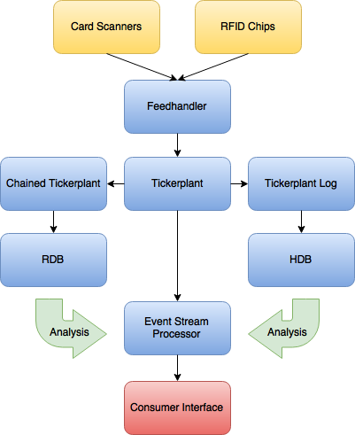
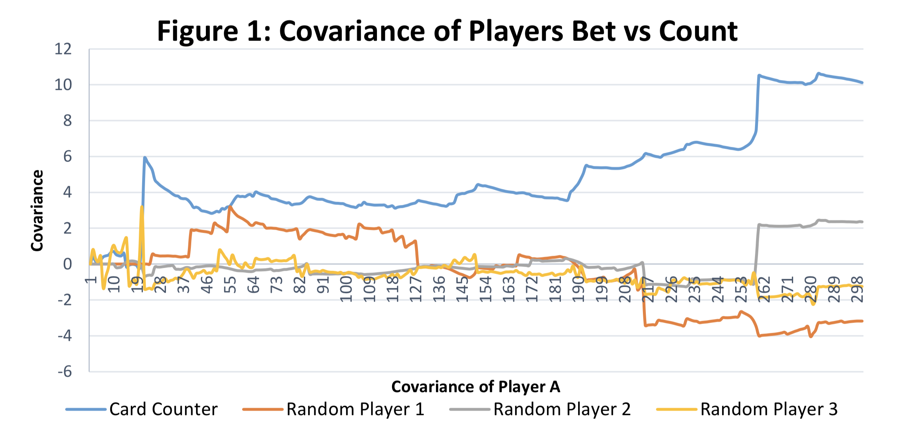
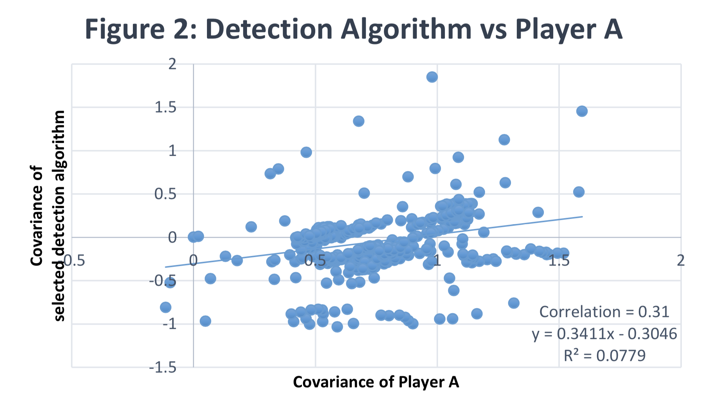
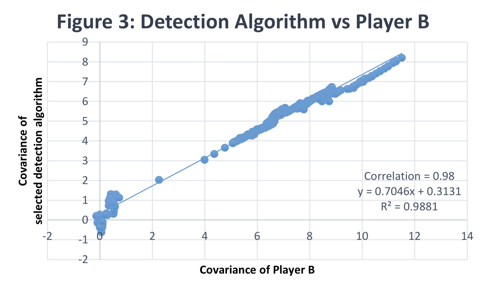

White paper
{: #wp-brand}

# Streaming analytics with kdb+:<br>Detecting card counters in Blackjack

by [Caolan Rafferty &amp; Krishan Subherwal](#authors)
{: .wp-author}


With the growth and acceleration of the Internet of Things, data collection is increasingly being performed by sensors and smart devices. Sensors are able to detect just about any physical element from a multitude of machines, including mobile phones, vehicles, appliances and meters. Airlines are currently using smart devices to prevent failures, producing as much as 40 terabytes of data per hour per flight. Consuming and analyzing the massive amounts of data transmitted from sensing devices is considered the next Big Data challenge for businesses.

A key problem in processing large quantities of data in real-time is the detection of event patterns, and this is why streaming analytics, also known as Event Stream Processing (ESP), is becoming a mainstream solution in IoT. ESP is computing that turns incoming data into more useful information, providing a better insight of what is happening. One of the early adopters of this type of technology was the financial-services industry, where it is used to identify opportunities in the market for traders and/or algorithmic trading systems.

ESP software has been hugely impactful on the capital-markets industry, helping to identify opportunities or threats in a faster way, while removing emotion from the decision making. Anecdotally, Wall Street banks have been known to teach their traders how to card count in Blackjack, and famous traders like Blair Hull and Ed Thorp have translated card-counting techniques into financial-markets success.

Blackjack is the most widely played casino game in the world. It generally takes up more tables in the pit area, employs more dealers, attracts more players and generates more revenue than any other table game. Unlike most casino games where the only factor that determines a win or a loss is luck, Blackjack is a game where skill plays a big part.

Card counting is a strategy used in Blackjack to determine whether the next hand is likely to give a probabilistic advantage to the player or to the dealer. It can be used to decrease the casino’s house edge and allows the player to bet more with less risk and minimize losses during unfavourable counts. In a typical hand of Blackjack, the house has between .5% and 3% advantage over the player. However by card counting a player can have a 1%, 2% or 3% advantage over the house.

There are a number of measures used to protect casinos against card counters. These countermeasures constrain the card counters that may be playing in the casino at any given time but heavily tax the casino’s efficiency, costing the casino industry millions of dollars every year.

Examples of these countermeasures are shuffling more frequently, reducing the number of hands played, and not permitting mid-game entry.

The purpose of this paper is to highlight a use case of kdb+ with ESPs to detect card counters in the game of Blackjack in real-time. Kdb+ offers an unrivalled performance advantage when it comes to capturing, analyzing and storing massive amounts of data in a very short space of time, making it the data-storage technology of choice for many financial institutions across the globe, and more recently other industries such as telecommunications and pharma.

All tests were run using kdb+ version 3.5 (2017.04.10)


## Implementation

The data-capture technology required for this software is already available in most casinos. Inbuilt and track information at the tables. The diagram below illustrates how this information might flow into the ESP in kdb+.



The information from the card scanners and RFID chips are filtered into a standard kdb+ tick architecture; a feedhandler to convert the data to kdb+ format, a tickerplant to write to a log file for HDB writedown, publish to a chained tickerplant for the data to be enriched before going to the real-time database and the ESP.

The ESP compares each player’s cards and bets against precompiled card-counting strategies (currently 23 known strategies: see Appendix), and determining whether the player is card counting and, if so, which strategy they are using. The casino would then be notified via a front-end GUI along with a degree of certainty.

Analysis can be performed by humans on the real-time and historical databases to find patterns and determine new strategies to detect card counters, feeding this back into the ESP.

Using the Bellagio Casino in Las Vegas as an example, with 80 Blackjack tables and assuming three players occupy all tables, an estimated 200,000 hands would be played each day. The comparison of these hands to the 23 card-counting strategies listed in the appendix would generate close to 14 million ticks per day. This figure would increase even further when applied to the online gaming industry, which has similar issues with card-counting bots.


## Blackjack simulator

In order to test kdb+’s ability to detect card counting in real time we first required a dataset that would mimic what we would expect to see in a casino. Previous analysis in this field used Monte Carlo simulation, which is a mathematical technique used to model the probability of different outcomes in a process that cannot easily be predicted.

Instead, a Blackjack simulator was developed to act as a “dealer”. The Blackjack simulator, which is entirely written in q, has the capability of emulating the casino experience at any Blackjack table in the world, including any deck size, deck penetration, shuffle frequency and table size. This reduced the limitations of the testing, providing us with a real-time testing model for a real-world card-counting detection algorithm, and allowed us to create large datasets for multiple scenarios in a very short space of time.

The table below from [_Casino Operations Management_](https://www.amazon.com/Casino-Operations-Management-Jim-Kilby/dp/0471266329) by Jim Kilby indicates the average number of hands played at a Blackjack table per hour. We have also included the average observed times to play the same number of hands using the Blackjack simulator and the card-counting algorithms.

players | hands per hour | time taken in kdb+<br>(seconds)
:------:|:--------------:|--------------------------------
1       | 209            | 1.741
2       | 139            | 1.827
3       | 105            | 2.083
4       |  84            | 2.284
5       |  70            | 2.781
6       |  60            | 3.064
7       |  52            | 3.420


To ensure the quality of our data the simulator must deal cards in a random manner. Although kdb+ generates random numbers via the Roll operator, it is seeded. This means every time a new game starts the first player would get the exact same hands, therefore we added logic to update the seed parameter with a new figure on every start up.

```q
// update seed parameter
q)system "S ",string[`float$.z.p];
// Define possible cards
q)cards:`A`K`Q`J`10`9`8`7`6`5`4`3`2;
// Define deck size
q)ds:6;
// Shuffle cards
q)deck:{(neg count x)?x}(ds*52)#cards;
q)deck `8`4`8`9`K`4`J`K`4`6`Q`7`2`10`6`8`9`Q`Q`6`9`Q`9`A`5`2`J`4`5`7`8`8..
```

Once the server ("dealer") receives a connection from a player they will be added to the game, taking their handle number and username, and sending them a request to place a bet. When all players have placed their bets the server will then deal the cards out in order of connection time, and return to the first player to request a next step i.e. hit, stick, split or double.

```q
 q)stake[100]
"Bet has been placed by caolanr"
"Your first card is 6"
"Dealers first card is 9"
"Your second card is 2"
"Dealer's second card is dealt face down" 
"**************************************" 
"Your hand is 6,2"
"Your hand count is 8" 
"**************************************" 
"Hit or stick?"
```

When all clients have played their hands, it moves on to the dealer process, which will continue to hit until its hand count is 17 or over. After this the server compares its count to any player left in the game indicating to each whether they won or lost, their profit and a summary of the hand. The server then checks if any new players have joined the table and prompts all players to place a bet for the next hand.

```q
q)hit[]
"Hit by caolanr"
"caolanr got a J"
"caolanr's count is now 21"
"caolanr is sticking on 21" 
"**************************************"
"Everyone has played their hand, now it's the dealers turn" 
"Dealer has 9,J"
"Dealers hand count is 19" 
"**************************************"
"You win!"
"caolanr's profit is $100!" 
"**************************************"
" Results table for the round;"
player name    cards    cnt dealer dealerCnt bet profit 
-------------------------------------------------------
1      caolanr `J`10    20  9      J         19  200
2      caolanr `6`2`3`J 21  9      J         19  200
"~~~~~~~~~~~~~~~~~~~~~~~~~~~~~~~~~~~~~~" 
"~~~~~~~~~~~~ Game over ~~~~~~~~~~~~~~~" 
"~~~~~~~~~~~~~~~~~~~~~~~~~~~~~~~~~~~~~~"
"The hand has commenced"
"Please place your bets via the stake[] function"
```

The next step was to create algorithms to act as players so that we could generate mass amounts of data to run statistical analysis on. To ensure the quality of the datasets we created several algorithms, some that used card counting of varying complexity and some that used randomly generated play. One of the random players, for example, doubles his bet when he wins and places the same bet if he loses.

```q
bet:{
  // Get the bet placed by user from last round
  b:last exec bet from results where name=.z.u;
  // Get the profit from the last round
  wl:last exec profit from results where name=.z.u;
  // If player did not win bet same amount, if they won double the bet
  $[wl=0;b;b*2] }
```

The card-counting algorithms are outlined in the next section.


## Card-counting algorithms

All card-counting methods require sound comprehension of basic strategy, which is a set of rules providing the player with the optimal way to play each hand based on the player’s first two cards and the dealers up card, for every possible card combination. Basic strategy can reduce the house edge to as little as .5%. If the player does not know how to execute the options available properly, counting cards will not be of use.

With basic strategy, a number of permutations exist depending on the player’s hand type and the dealers shown card. The different hand types are;

  - Hard: any two-card total which does not include an Ace
  - Soft: any two-card total which includes an Ace
  - Pair: two of the same cards

The card-counting algorithms described below will use basic strategy to decide whether they should hit (H), stick (S), double (D) or split (SP), by performing a look-up in the corresponding dictionaries.

```txt
q)hard
h | TWO THREE FOUR FIVE SIX SEVEN EIGHT NINE TEN ACE 
--| ------------------------------------------------ 
3 | H   H     H    H    H   H     H     H    H   H 
4 | H   H     H    H    H   H     H     H    H   H 
5 | H   H     H    H    H   H     H     H    H   H 
6 | H   H     H    H    H   H     H     H    H   H 
7 | H   H     H    H    H   H     H     H    H   H 
8 | H   H     H    D    D   H     H     H    H   H 
9 | D   D     D    D    D   H     H     H    H   H 
10| D   D     D    D    D   D     D     D    H   H 
11| D   D     D    D    D   D     D     D    D   D 
12| H   H     S    S    S   H     H     H    H   H 
13| S   S     S    S    S   H     H     H    H   H 
14| S   S     S    S    S   H     H     H    H   H 
15| S   S     S    S    S   H     H     H    H   H 
16| S   S     S    S    S   H     H     H    H   H 
17| S   S     S    S    S   S     S     S    S   S 
18| S   S     S    S    S   S     S     S    S   S 
19| S   S     S    S    S   S     S     S    S   S 
20| S   S     S    S    S   S     S     S    S   S 
21| S   S     S    S    S   S     S     S    S   S

q)soft
h | TWO THREE FOUR FIVE SIX SEVEN EIGHT NINE TEN ACE 
--| ------------------------------------------------ 
13| H   H     D    D    D   H     H     H    H   H 
14| H   H     D    D    D   H     H     H    H   H 
15| H   H     D    D    D   H     H     H    H   H 
16| H   H     D    D    D   H     H     H    H   H 
17| D   D     D    D    D   H     H     H    H   H 
18| S   D     D    D    D   S     S     H    H   S 
19| S   S     S    S    D   S     S     S    S   S 
20| S   S     S    S    S   S     S     S    S   S 
21| S   S     S    S    S   S     S     S    S   S

q)pair
h | TWO THREE FOUR FIVE SIX SEVEN EIGHT NINE TEN ACE 
--| ------------------------------------------------ 
2 | SP  SP    SP   SP   SP  SP    H     H    H   H 
3 | SP  SP    SP   SP   SP  SP    SP    H    H   H 
4 | H   H     SP   SP   SP  H     H     H    H   H 
5 | D   D     D    D    D   D     D     D    H   H 
6 | SP  SP    SP   SP   SP  SP    H     H    H   H
7 | SP  SP    SP   SP   SP  SP    SP    H    S   H 
8 | SP  SP    SP   SP   SP  SP    SP    SP   SP  SP 
9 | SP  SP    SP   SP   SP  S     SP    SP   S   S 
10| S   S     S    S    S   S     S     S    S   S 
11| SP  SP    SP   SP   SP  SP    SP    SP   SP  SP
```

The key on the left-hand side indicates the players total card value, and the key at the top is the dealers up card.


### Basic card-counting player

The Hi-Lo system is one of the most popular card-counting strategies and the easiest to learn. When using the Hi-Lo system, every card value in the deck is assigned a number which can be seen in the table below.

```txt
card  2  3  4  5  6  7  8  9  10  A
value 1  1  1  1  1  0  0  0  -1 -1
```

As cards are dealt out, a card-counting player must do the arithmetic according to each card. The count must begin after the deck is shuffled with the first card that is dealt. The larger the number becomes the more high-valued cards remain in the deck, and the player should increase their bet. If the count is negative then many of the 10 valued cards and Aces have been dealt, and the player should bet the table minimum.

The basic card-counting algorithm will use the below function to determine the count using the Hi-Lo system.

```q
basicCount:`2`3`4`5`6`7`8`9`10`J`Q`K`A!1 1 1 1 1 0 0 0 -1 -1 -1 -1 -1

theCount:{
  // Get all player cards from results table
  pc:raze exec cards from results;
  // Get dealer cards by round
  dc:raze exec dealer from select first dealer by round from results; 
  // Get a list of all cards played
  c:pc,dc;
  // Get the running count
  runCount:sum basicCount[c];
  // Get current deck size, here we assume 6 decks are used 
  deckSize:6*52;
  // Calculate the true count
  runCount%(deckSize-count c)%52 }
```

As can be seen it is using the true count, which is the running count divided by the number of decks remaining. A true count is designed to give the player a more accurate representation of the deck and how favorable it is. For example, a running count of +10 is much better if there are two decks remaining as opposed to five decks remaining.


### Intermediate card-counting player

The Zen Card-Counting system was created by Arnold Snyder, detailed in his book [_Blackbelt in Blackjack_](https://www.amazon.com/Blackbelt-Blackjack-Playing-Martial-Art/dp/1580421431). What makes it more complex compared to the previous card-counting method is that the Zen Count is a multi-level system. Some cards are counted as two points and others as one point. It is much more efficient but at the same time more difficult to master and as such, it requires more practice. As this is a multi-level system, certain cards can have a value of ±1 and ±2, which is shown in the table below.

```txt
card  2  3  4  5  6  7  8  9 10  A
value 1  1  2  2  2  1  0  0 -2 -1
```

The Zen Count has some similarities to the Hi-Lo system, but it’s a little more complicated. They provide similar betting correlations, but the Zen Count provides a better estimate of changes to basic strategy as it relates to whether or not to take insurance, which is a side bet that the dealer has Blackjack if their up card is an Ace. Exact differences in the counting systems can be seen in the Appendix. 


### Advanced card-counting player

Including basic strategy, variation is what separates the good card counters from the professionals. Basic strategy explains the best possible move for you to make on average. However, as the count increases or decreases, some of the moves basic strategy tells you to do may no longer be the correct decision. Looking at three scenarios within the advanced card-counting algorithm:

  - True count is less than or equal to -1
  - The player’s hand sum is 14
  - The dealer’s first card is a 5

Basic strategy suggests a player should stick, however the variation strategy opts to double, due to the higher probability of obtaining a low card. Behind the scenes, the advanced algorithm, along with the Zen Card Counting system, uses the simple lookup dictionary of the basic strategy to determine initially whether to hit, stick, double or split. However, instead of returning this result immediately it then identifies its hand type (hard/soft/pair) so that it can check within the variation functions whether or not, given the current count, another result should be chosen. Below is an example of the variation function with a ‘hard’ hand type.

```q
// Variance with hard cards 
hardVAR:{[player;dealer;decision;trueCount]
  // Add players cards together
  c:(+)@/player;
  // Round trueCount figure
  trueCount:ceiling trueCount;
  // If any of the below match, return D (double) instead
  $[(trueCount;c;dealer)in(-2 10 9;0 9 3;1 11 11; 2 9 2;3 8 6;6 8 5;6 9 7);
    `D;
    decision] }

// If player does not have an Ace and they don’t have a pair, 
// execute hardVAR function 
if[(not any 11 in playerCards)and not playerCards[0]~playerCards[1];
  hardVAR[playerCards;dealerCard;ret;trueCount] ]
```

Once all algorithms had been created, three card-counting algorithms with varying levels of complexity and three that used randomly-generated play, the next step was to run various scenarios using the blackjack simulator to create our datasets. These ranged from six players using randomly-generated play to a single card counter at the table, with different levels of deck sizes, deck penetration and shuffle frequency. The datasets were then analyzed and a detection algorithm was developed.


## Detection algorithm

Any card counter must use a sufficient minimum-to-maximum bet spread to ensure they win enough money to make their time at the Blackjack table worthwhile. As the count increases so should the players bet, as this is reducing the houses edge. Therefore, the detection algorithm will be checking the bet spreads of every player at the table against each of the card-counting strategies.

Kdb+ has an inbuilt covariance function which can be used to measure the strength of correlation between two or more sets of random variables. The algorithm will keep the true count for all of the counting strategies defined within it and compare each strategy to each player by plotting the pairs of covariances against each other, calculating the correlation and their r-squared values.


### Card counter vs random players

In Figure 1 below, we compare how each player’s bet varies with the running count. From our testing it was clear to distinguish the card counter from the randomly-generated players due to the positive covariance trend.



The detection algorithm is not only able to identify if a player is counting cards but also which counting method they are using. We also ran a simulation using two players, one using random play and one card counting, to determine whether the detection algorithm would be able to establish which was which. The results can be seen in the graphs below.


### Card-counting strategy vs random player

As can be seen in Figure 2 below, player A’s betting patterns have a low correlation of 0.31 when compared with a specific card-counting method and therefore it can be determined it is not using this particular strategy.




### Card-counting strategy vs card counter

In Figure 3, player B has a high correlation of 0.98, which indicates a very strong relationship between the detection algorithm and their strategy. The r-squared value of 0.98 also signifies that the data is closely fitted to the regression line.



Detection-oriented ESP is focused on identifying combinations of event patterns or situations. The current detection system has been pre-programmed with a number of different strategies that it will be able to detect using linear regressions as shown by the detection algorithm vs player charts. The results of the regressions are then fed back to a human to determine on what decision should be made based off the results.

Velocity and veracity are two of the major challenges associated with real-time event processing. Within any fraud-detection system, it is imperative that any anomalies are identified quickly and that the accuracy is extremely high to limit the number of false positives.


## Conclusion

With the universal growth of sensors and smart devices there is an increasing challenge to analyze an ever-growing stream of data in real time. The ability to react quickly to changing trends and delivering up-to-date business intelligence can be a decisive factor for a company’s success or failure. 

A key problem in real-time processing is the detection of event patterns in data streams. One solution to this is Event Stream Processing (ESP). This white paper focused on the idea of ESP, using the game of Blackjack as a proxy. The purpose of the paper was to highlight the importance of proactive monitoring and operational intelligence by providing real-time alerts and insight into pertinent information, enabling a casino to operate smarter, faster and more efficiently.

Firstly we showed how an ESP could be implemented in a real-world scenario using the kdb+ tick architecture. We were able to build a Blackjack dealer simulator in kdb+ and with the help of kdb+’s inbuilt Roll and seed operators, ensure the randomness of the cards being dealt. Several card-counting algorithms were then created, along with randomly-generated-play algorithms, to allow us to create millions of rows of testing data. After running analyses on the data created, we were then able to develop a card-counting detection algorithm to handle the task at hand with a high degree of accuracy. Although we are able to update the ESP with new card-counting algorithms with ease once known, the detection system could be further developed by leveraging Machine Learning to configure potential card counting strategies as they occur.

ESP has evolved from an emerging technology to an essential platform of various industry verticals. The technology's most consistent growth has been in banking, serving fraud detection, algorithmic trading and surveillance. There has also been considerable growth in other industries including healthcare, telecommunications, manufacturing, utilities and aerospace.

[:fontawesome-solid-print: PDF](/download/wp/card-counters-in-blackjack.pdf)


## Authors

**Caolan Rafferty** works for KX as a kdb+ consultant. Based in Hong Kong, he maintains an eFx trading platform at a major investment bank. He has developed a range of applications for some of the world’s largest financial institutions. Caolan also helped in building the data-science training program within First Derivatives.

**Krishan Subherwal** works for KX as a kdb+ consultant and has developed data and analytics systems in a range of asset classes for some of the world’s largest financial institutions. Currently based in London, Krishan is working with an investment-management firm within their Data Engineering team.


## Appendix – Card counting strategies

The table below lists card-counting strategies with their values for each card as well as their betting correlation, playing efficiency and insurance correlation.

```txt
strategy            A   2    3  4  5   6   7    8   9   10   BC  PE   IC
------------------------------------------------------------------------
Canfield Expert     0   0    1  1  1   1   1    0  -1   -1   .87 .63 .76
Canfield Master     0   1    1  2  2   2   1    0  -1   -2   .92 .67 .85
Hi-Lo              -1   1    1  1  1   1   0    0   0   -1   .97 .51 .76
Hi-Opt I            0   0    1  1  1   1   0    0   0   -1   .88 .61 .85
Hi-Opt II           0   1    1  2  2   1   1    0   0   -2   .91 .67 .91
KISS 2              0  0/1   1  1  1   1   0    0   0   -1   .90 .62 .87
KISS 3             -1  0/1   1  1  1   1   1    0   0   -1   .98 .56 .78
K-O                -1   1    1  1  1   1   1    0   0   -1   .98 .55 .78
Mentor             -1   1    2  2  2   2   1    0   0   -1   .97 .62 .80
Omega II            0   1    1  2  2   2   1    0  -1   -2   .92 .67 .85
Red Seven          -1   1    1  1  1   1  0/1   0   0   -1   .98 .54 .78
REKO               -1   1    1  1  1   1   1    0   0   -1   .98 .55 .78
Revere Adv. +/-     0   1    1  1  1   1   0    0  -1   -1   .89 .59 .76
Revere Point Count -2   1    2  2  2   2   1    0   0   -2   .99 .55 .78
Revere RAPC        -4   2    3  3  4   3   2    0  -1   -3  1.00 .53 .71
Revere 14 Count     0   2    2  3  4   2   1    0  -2   -3   .92 .65 .82
Silver Fox         -1   1    1  1  1   1   1    0  -1   -1   .96 .53 .69
UBZ 2              -1   1    2  2  2   2   1    0   0   -2   .97 .62 .84
Uston Adv. +/-     -1   0    1  1  1   1   1    0   0   -1   .95 .55 .76
Uston APC           0   1    2  2  3   2   2    1  -1   -3   .91 .69 .90
Uston SS           -2   2    2  2  3   2   1    0  -1   -2   .99 .54 .73
Wong Halve         -1   0.5  1  1  1.5 1   0.5  0  -0.5 -1   .99 .56 .72
Zen Count          -1   1    1  2  2   2   1    0   0   -2   .96 .63 .85
```

Betting Correlation (BC)

: the correlation between card point values and the effect of removal of cards. It is used to predict how well a counting system predicts good betting situations and can approach 1.00 (100% correlation).

Playing Efficiency (PE)

: indicates how well a counting system handles changes in playing strategy.

Insurance Correlation (IC)

: the correlation between card point values and the value of cards in Insurance situation. A point value of -9 for tens and +4 for all other cards would be perfect for predicting if an Insurance bet should be placed. 

0/1 

: indicates the value is either 0 or 1 depending on the suit of the card. 

Source: [www.qfit.com](http://www.qfit.com/)


