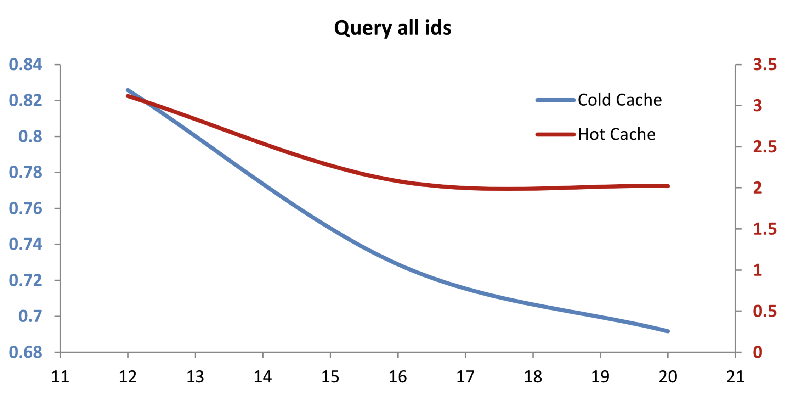
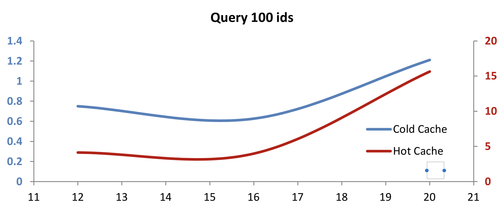
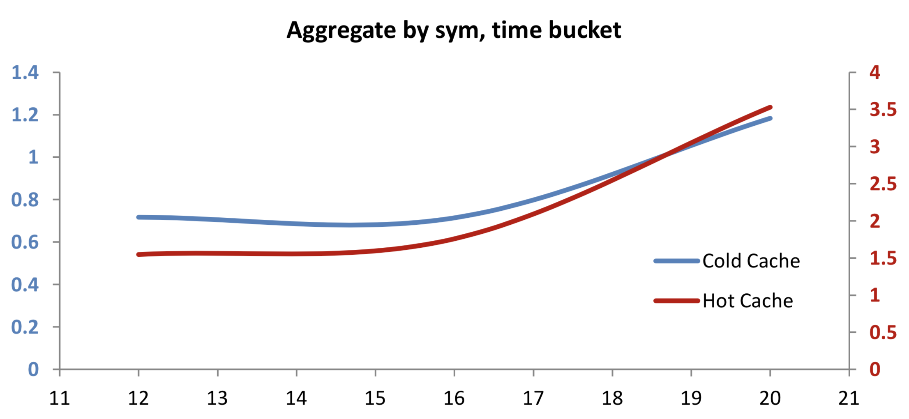
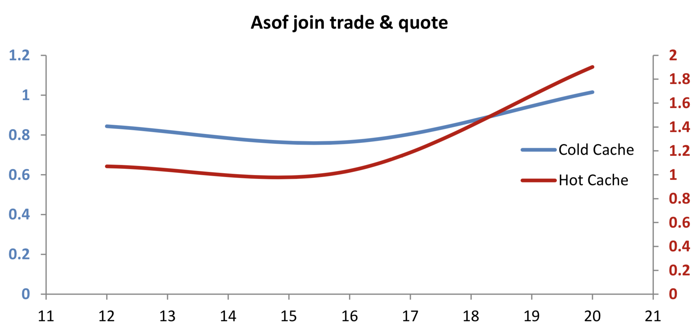

White paper
{: #wp-brand}

# Compression in kdb+

by [Eoin Killeen](#author)
{: .wp-author}


As the rate of data generation in financial markets continues to increase, there is a strong impetus to investigate how large data volumes can be more efficiently processed. Even if disk is considered cheap, it can be a valuable exercise for many applications to determine what improvements can be gleaned from an analysis of the use of compression. Aside from reduced disk costs, some use cases can gain significant performance improvements through a problem-specific approach to compression. For example, some systems have fast CPUs, but find that disk I/O is a bottleneck. In some such cases, utilizing CPU power to reduce the amount of data being sent to disk can improve
overall performance.

Early versions of kdb+ achieved compression via file systems with inbuilt compression, such as ZFS. V2.7 introduced built-in OS-agnostic compression, which allowed on-disk data to be converted to compressed format using a range of algorithms and compression levels. This was expanded (V2.8), with the ability to stream in-memory data directly to compressed format on disk. ZFS compression is still useful for some kdb+ applications, as it keeps cached data available for multiple processes. However, this paper will focus on the inbuilt data-compression options provided by kdb+, available on all supported architectures.

Each system will have its own characteristics which determine the appropriate compression configurations to use. This paper will cover an introduction to compression in kdb+, a discussion of contributing factors to compression ratios and performance, and an analysis of how the use of compressed data can affect performance of some sample use cases.

All tests were run using kdb+ version 3.1 (2013.09.05)


## Compression options

There are two high-level approaches to saving on-disk data in compressed format. The first is a two-step approach: save data to disk in the regular uncompressed format using `set`, then convert it to a compressed format using the `-19!` operator. The second approach is to stream data directly from memory to compressed format on disk by modifying the left argument to `set`.

:fontawesome-regular-hand-point-right:
Reference: [`set`](../../ref/get.md#set), 
[`-19!`](../../basics/internal.md#-19x-compress-file)

The first approach is useful for archiving existing historical data, or in cases where it is significantly faster to save the data to disk uncompressed, without the overhead of first compressing the data. In many other cases, it can be more convenient and/or performant to compress the data on the fly while saving.


### Converting saved data to compressed format using `-19!`

The syntax of `-19!` is:

```q
-19! (`:sourceFile; `:targetFile; blockSize; alg; level) 
```

where

`blockSize`

: is logical block size, a power of 2 between 12 and 20: page size or allocation granularity to 1MB (see note). This argument affects both compression speed and compression ratio: larger blocks can be slower and better compressed.

`alg`

: Compression algorithm: 0 (none), 1 (kdb+ IPC), or 2 (`gzip`)

`level`

: Compression level: for `gzip`, an integer between 0 and 9; else 0.

!!! tip "Logical block size"

    Page size for AMD64 is 4KB, Sparc is 8KB. Windows seems to have a default allocation granularity of 64KB.

The compression-algorithm and compression-level arguments are self-explanatory. The logical block size determines the amount of data which will be compressed at a time in each block. A larger block will afford more opportunity for identification of repeated values, and hence a higher overall compression ratio. But this argument also determines the minimum amount of data which can be decompressed at a time. If it is large relative to the amount of data that is likely to be accessed at a time, then a lot of unnecessary decompression work may be carried out during queries. Its lower bound is the system’s allocation granularity, because dividing the data into smaller chunks than that would result in wasted space.

The various combinations of arguments will be discussed further in the following sections, but example expressions to save data to disk and then convert it to compressed format would look like this:

```q
`:/db/trade_uncompressed set trade
-19! (`:/db/trade_uncompressed; `:/db/trade_compressed; 16; 1; 0)
```

If this approach is used to compress data, it is preferable to have the source and target files on separate physical disks. This will reduce the number of disk seeks required to move the data iteratively in chunks. 

:fontawesome-brands-github:
[simongarland/compress/cutil.q](https://github.com/simongarland/compress/blob/master/cutil.q) for migrating uncompressed databases to compressed format


### Saving in-memory data directly to compressed format on disk

In many cases, it is preferable to save data to disk in compressed format in a single step. This is more convenient than having a separate process to convert uncompressed on-disk data to compressed format after it has been saved. It can also be faster than the two-step method, depending on the compression algorithm and level used, and on system CPU and disk characteristics. Direct streaming compression has been implemented by overriding the left argument to `set`:

```q
(`:targetFile; blockSize; alg; level) set table
```


### Field-by-field compression

It is also possible to apply compression on a field-by-field basis, i.e. to use different compression rules from one table or column to another. Files of various compression levels (including no compression at all) can happily coexist inside a single table. So if some columns do not compress well or their usage patterns mean they don’t benefit from compression, they can have different compression algorithms applied or be left uncompressed. This can be achieved by modifying the left argument to `set` to include a dictionary, mapping field names to the compression parameters to be used for each one. The null symbol in the key of this dictionary defines the default behavior, which will be applied to any fields not specified explicitly.

```q
t:([]a:asc 1000000?10; b:asc 1000000?10; c:asc 1000000?10)
(`:splay/; ``a`b!((17;2;9); (17;2;6); (17;2;6))) set t
```


### Compression defaults

Rather than specifying the compression parameters individually every time `set` is called, we also have the option of defining default compression parameters which will be used if `set` is called the old-fashioned way, i.e. `` `:filename set table``. This is done by defining the [zip-defaults variable `.z.zd`](../../ref/dotz.md#zzd-zip-defaults). The format is the same as the non-filename arguments passed to `set`, e.g.

```q
.z.zd:(17;2;6);`:zfile set asc 10000?`3
```


## Reading compressed data

The process of decompression is automatic and transparent to the user. Data consumers can read compressed files in the same way that they would read uncompressed ones, e.g. using [`get`](../../ref/get.md) or by memory-mapping and querying the files. However, it is important to allow for some resource consumption associated with decompression when querying compressed data. While querying memory-mapped compressed data, any file blocks used by `select` will be decompressed into memory and cached there for the duration of the query. This is to avoid having to decompress the data twice – once during constraint evaluation, and once when being used as a selected column in the result set. Only required data will be decompressed into memory, but kdb+ will allocate enough memory to decompress the entirety of each vector touched by a query on compressed data. This means that memory use shown in [`top`](https://linux.die.net/man/1/top) may indicate a higher number than expected, but only the required sub-set of this amount will actually be used. Increasing system swap space may be required, even if swap itself will not be used.

For frequently-repeated queries or regular usage patterns where the data is usually present in the OS cache, compressing data may be counterproductive. The OS can only cache the compressed data, and the decompressed queried data will only be cached by kdb+ for the duration of a query. So the decompression overhead must be overcome on every query. Because of this, columns which need to be accessed very frequently may perform better if left uncompressed.

It should be noted that because of the convenience in terms of automatic decompression, OS-level tools such as [`scp`](https://linux.die.net/man/1/scp) should be used if compressed data just needs to be moved about on disk or between hosts, without being manipulated in any way. This will prevent needless de/re-compression of the data, which would occur if kdb+ processes and IPC were used for this purpose.


## What determines the compression ratio?

The compression ratio (uncompressed size vs compressed size) is influenced by a number of factors. The choice of logical block size, compression algorithm and compression level will have a big impact here. But the compression ratio of any combination of inputs will also be heavily influenced by the nature of the data which is being compressed.

Some data-driven factors that influence the compression ratio are:


### Number of distinct values vs the total count of the vector

A low number of distinct values in a large vector could, for example, be grouped and referenced by index in each compressed block. A vector of entirely unique values offers less potential for efficient storage.

Similarly, sparsely populated columns will compress well, as the nulls can be compressed like a highly repeating value would be.


### Level of contiguity of repeated values

A contiguous array of identical values can be described by the distinct value and the number of times it occurs. In some cases we can deliberately increase the level of contiguity by sorting tables on multiple columns before compressing. In the following example, we will compare the compression ratios achieved on a table of two highly-repeating columns – first unsorted, then sorted by one column, then sorted by both columns.

```q
n:100000000
t:([]sym:n?`ibm`goog`aapl`tsla`spx;venue:n?`nsdq`nyse)
`:uncompressed/ set .Q.en[`:uncompressed] t
(`:unsorted/;16;2;5) set .Q.en[`:unsorted] t
(`:symSorted/;16;2;5) set .Q.en[`:symSorted] `sym xasc t 
(`:symVenueSorted/;16;2;5) set .Q.en[`:symVenueSorted] `sym`venue xasc t
```

Because the data is so highly repeating, we get a nice compression ratio of 10 even if the table is unsorted. But sorting on one column yields a significant improvement, and sorting on both means the entire 100M rows of these two fields can be persisted using a little over 1KB of disk. Obviously this sorting only increases the compression ratios for the columns that are actually sorted – other columns won’t see improvements.

table version        | compression ratio
---------------------|-----------------:
Unsorted             | 10.19
Sorted by sym        | 30.47
Sorted by sym, venue | 669.55


### Datatype of the vector

If a vector of high-precision datatype such as long contains a high proportion of values which could have been expressed as ints or shorts, some of the unused precision can be ‘reclaimed’ in a way through compression. Booleans also compress particularly well, but this is a special case of the above point regarding repeating values, as there are only two possible distinct values in a boolean column.

The test table below contains boolean, int and long columns. The int and long columns contain the same values. Taking a sample compression configuration of `gzip` with logical block size 16 and compression level 5, we can see how each data type compresses:

```q
n:100000000
ints:n?0Wi t:([]boolean:n?01b;integer:ints;longint:`long$ints) `:nocomp/ set t
(`:comp/;16;2;5) set t
```

The compression ratios achieved on each field show that booleans have compressed by a large factor, and the longs have also compressed significantly. A lot of the storage cost of using long precision has been reclaimed.

field    | compression ratio
---------|:----------------:
boolean  | 5.97
int      | 1.00
long int | 1.62

In some cases, the extra precision afforded by longs is required only for a small proportion of values. In such cases, compression allows us the benefit of increased precision where it is needed, while staying close to the disk cost of regular ints where it is not.


### Effects of compression on query performance

The user-specifiable parameters for compression provide a lot of room for experimentation and customization, according to the demands of a particular system. For a given use case, the choice of compression parameters should be informed by a number of factors:

  - CPU time taken to perform the compression
  - change in disk I/O time
  - compression ratio achieved
  - usage patterns for the on-disk data

The relative weighting of these factors will vary from one system to another. If reduction in physical disk usage is the primary motivating concern behind the use of compression, then naturally the compression ratio itself must be maximized, while constraining the other parameters to acceptable levels.

The focus of our tests will be on the impact to downstream users of the data rather than the impact on the writing process. Random access to compressed data is supported, which means only required blocks of the file will be decompressed. The choice of logical block size will determine the minimum amount of data which can be decompressed at a time, so if logical block size is large relative to the average amount of data retrieved at a time, then redundant work may be performed in decompressing the data. If the `gzip` algorithm is used, then the trade-off between compression level and time taken to de/compress must also be considered.


## Setup

Each system will have its own performance characteristics, and experimentation with the compression parameters should be done on a case-by-case basis. We will measure the impact of using compressed rather than uncompressed data across a range of query types. The tests will be run first with the data present in the OS cache, and then with the cache completely cold, having been emptied before each test using the cache-flush functionality of the `io.q` script.

:fontawesome-brands-github:
[simongarland/io](https://github.com/simongarland/io/)

Each test will be performed 10 times (with the cache being fully flushed before each iteration of the cold-cache tests) and timings will be averaged. For hot-cache results, the first query time will not be included in the average. This is to allow for initial caching from disk.

All tests are performed using kdb+ 3.1 2013.09.05 on a Linux Intel(R) Xeon(R) L5520 16 CPU/4 core 2.27GHz with 144GB RAM. Disk used is ext3 SAN.

We will use a basic test schema of a trade and quote table, with 100M rows of trades and 400M rows of quotes, evenly distributed throughout a trading day.

```q
n:100000000
st:.z.D+09:30
et:.z.D+16:00
trade:([]sym:asc n?`3; time:"p"$st+((et-st)%n-1)*til n; 
  price:n?1000.; size:n?100)
n*:4
quote:([]sym:asc n?`3; time:"p"$st+((et-st)%n-1)*til n; 
  bp:n?1000.; ap:n?1000.; bs:n?100; as:n?100)
```


### Procedure

The above test tables were saved to disk, both uncompressed and compressed using the kdb+ IPC algorithm, with low, mid- and high-range logical block sizes.

The relative changes in performance (compressed vs uncompressed) of the following query types were measured:

  - Select all data from the table
  - Select all data for a subset of symbols
  - Aggregate values by symbol
  - Aggregate values by symbol and time bucket
  - As-of join straight from disk


### Results

The following charts plot the ratio of performance of queries on compressed data vs the performance of the same query on uncompressed data. So a value of 2 means the query on compressed data took twice as long as its uncompressed counterpart, and a value less than 1 means the performance improved on compressed data.

The compression ratios achieved did not change significantly across logical block sizes:

logical block size | compression ratio
:-----------------:|:----------------:
12                 | 1.50
16                 | 1.55
20                 | 1.55


#### Select all data from the table

```q
select from trade where i<>0
```

 

When querying the entire table with cold OS cache, we see significant improvements in performance using compressed data. This is because there is a reduction in the amount of raw data which must be read from disk, and the cost of decompression is low when compared to this benefit. The relative improvement increases with logical block size, as decompressing an entire vector can be done more efficiently when there are fewer blocks to read and coalesce.

In the case of hot OS cache, we see that performance has degraded to 2-3 times its original level. This illustrates the cost of the OS having access only to compressed raw data. When the cache is hot, the decompression cost is high relative to the total time taken to get the uncompressed data into memory.


#### Select all data for a subset of symbols

```q
select from trade where sym in ids
```

 

`ids` is a vector of 100 distinct randomly-selected symbols from the `trade` table, which was created prior to cache flushing.

Querying on 100 symbols with a cold cache, we see moderate improvements in query performance on compressed data at low logical block sizes. With larger logical blocks, we need to carry out some redundant decompression work, as we only require sub-sections of each block. The cost of this redundant work eventually cancels out the disk-read improvement for queries on this particular number of symbols.

With a hot cache, querying on a subset of symbols gets a lot slower with large logical blocks. This illustrates the benefit of fully-random access (i.e. no redundant work), which is afforded by using uncompressed data. However, these queries still return in the range of hundreds of milliseconds, so a significant increase in query time may still be worth it, depending on the compression and performance desired in a particular case.


#### Aggregate values by a subset of symbols

```q
select size wavg price by sym from trade where sym in ids
```


When we add the additional work of aggregating data by symbol, we don’t see much change in the case of a cold cache. But with a hot cache, the increased CPU load of aggregation reduces the relative advantage of compressed data. Data-read time is now slightly less of a contributing factor towards overall performance.


#### Aggregate values by a subset of symbols using time buckets

```q
select size wavg price by sym, 5 xbar time.minute from trade where sym in ids
```

 

Aggregating by time bucket in addition to by sym, we see that the relative decrease in performance on compressed data has again reduced, as data-retrieval time is less of a factor.


#### As-of join a trade and quote table

```q
aj[`sym`time; select from trade where sym in ids; select from quote]
```

 

The final test is a highly CPU-intensive as-of join of the trade and quote records for 100 symbols. Extending the pattern of previous tests, we can see that performance against compressed trades and quotes is quite comparable to results against uncompressed tables.


## Conclusion

In any given application, the metrics which will determine if and how compression should be used will be informed by the individual use case. Our tests have shown that for this particular setup, assuming some OS caching, the more CPU-intensive queries will see significantly less overall impact than simple reads on small, randomly distributed pieces of data. This implies that we could expect to see acceptable performance levels for intensive queries, while achieving worthwhile reductions in disk usage, i.e. our compression ratio of 1.5. Experimenting with logical block sizes suggested that we should keep this parameter at the low end of the spectrum for our queries, or we will see a fall-off in performance. This is reinforced by the relative lack of change in compression ratio across logical block sizes. Depending on the individual use case, other applications may choose to optimize for overall compression ratio or time taken to save the data.

[:fontawesome-solid-print: PDF](/download/wp/compression_in_kdb.pdf)


## Author


{: .small-face}

**Eoin Killeen** has worked with KX technology for over ten years, designing and building real-time trading and analytics systems for clients in New York and London.
Eoin’s current focus is Solution Architecture for EMEA-based clients.
&nbsp;
[:fontawesome-solid-envelope:](mailto:ekilleen@kx.com?subject=White paper: Compression in kdb+) &nbsp;
[:fontawesome-brands-linkedin:](https://www.linkedin.com/in/eoin-killeen/)

