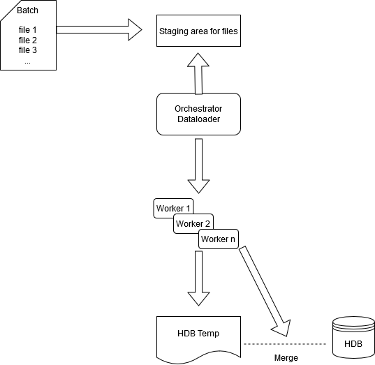

# Mass ingestion through data loaders


Receiving a large amount of data in various file formats and from multiple different sources that need to be ingested, processed, persisted, and reported upon within a certain time period is a challenging task.

One way of dealing with this is to use a batch-processing model, the requirements and considerations of which will differ from a vanilla tick architecture commonly used for mass data ingestion.

The biggest difference being a simple but sometimes difficult problem to solve; how a system can ingest a huge amount of batch data in a short period of time – data that is arriving in a number of files, multiple file formats, varying sizes and at varying times throughout the day. All of this needs to be done while maintaining data integrity, sorting and applying attributes, maximizing HDB availability during ingestion and staying within the confines of the kdb+ model for writing to disk (data sorted on disk, use of enumeration meaning single writes to sym file).

In this paper we shall discuss how mass ingestion of data can be done efficiently and quickly through kdb+, using a batch-processing model. This approach aims to optimize I/O, reduce time and memory consumption from re-sorting and maintaining on disk attributes.

These challenges will be outlined and a simplified framework, which has been deployed in several Kx implementations, will be shown as an example. The framework will show how these issues can be navigated leveraging kdb+ functionality, along with suggested further enhancements.


## Batch processing

### What is it?

Data ingestion is the process of moving, loading and processing data into a database. Kdb+ is a well-known market leader in real-time capturing of data, but this is only one form of data ingestion.

Batch data processing can also be an efficient (and cheaper) way of processing high volumes of data. In batch processing, data is collected/stored by the upstream source system and a full intraday file is ingested and processed downstream. One example of batch data files are end-of-day financial-market data provided by financial data vendors.


### Why go batch?

Some reasons to consider batch processing over stream processing:

-   There is no real-time requirement for the business use case i.e. no need for real-time analytics results
-   It is often cheaper to subscribe to end-of-day market data files rather than streaming
-   Data is coming from legacy systems which do not have a real-time streaming component
-   Real-time data feeds may not come in order and time sync issues need to be avoided
-   Batch processing is the only option available

The business use case is the main consideration when it comes to deciding on real-time vs batch processing.

Business use cases where batch processing may be best utilized are:

-   Post-trade analytics
-   Internal reporting and auditing
-   Centralized data storage
-   Regulatory reporting


### Problem statement

Batches containing multiple large files continuously arrive to the system throughout the day. Batches can contain multiple large files that all need to be saved to the same kdb+ tables on disk. In a simple data-loader system, if a batch has 10 files, file 1 would be read, sorted and saved with attributes to a table. File 2 must then be read but the data from file 1 and now file 2 will need to be merged, sorted and saved with attributes to the table and so on. In this system, sorting and applying attributes in memory is both memory-intensive and time-consuming.

The framework outlined below is applicable when volumes and throughput is high and hardware (memory, cores) limitations are present. This approach aims to optimize I/O, reduce time and memory consumption from re-sorting and maintaining on disk attributes.

## Mass-ingestion framework

### Framework summary

The diagram below illustrates the example batch-processing framework.



The main components of this framework are:


#### The orchestrator data loader process

The orchestrator has internal tables and variables to track ingestion:

-   Table of available workers and their statuses
-   Table of tasks that will be sent to the workers to run and an estimated size of the task
-   Tables of files that are expected and the associated functions
-   Variables to track server memory and amount which can be utilized for tasks

The orchestrator will ping a staging area for relevant batches of files to ingest and once the orchestrator has recognised that a batch has all its expected files, it will begin to send tasks to its workers asynchronously. Tracking of when all files are available can be done in numerous ways, such as knowing number of files for each specific batch or via naming conventions of files e.g. 

```txt
batchNamefile1of10.csv
batchNamefile2of10.csv
```


#### N number of worker processes

The tasks sent from the orchestrator can be broken down to:

-   read and save task
-   index task
-   merge task
-   move table task

Each worker will read, transform, map and upsert data to a relevant schema and to track the index of the file. Each worker will save its own file in a folder in a temporary HDB directory and each file will be enumerated against the same sym file. This enables concurrent writes to disk by the workers. Callbacks will be used so the worker can update the orchestrator with success or failure of its task. In order to maintain sym file integrity each worker returns a distinct list of symbol values, which the orchestrator then aggregates into a distinct list and appends any new syms to the sym file. This ensures a single write occurs to the sym file.

Once all files of a batch are loaded, the workers will be tasked with merging a list of specific columns, sorting based on the index from the files saved and if necessary include any existing data from the HDB during the sort and merge. Once the merge is complete the table will be moved to the HDB, during which all queries to the HDB will be temporarily disabled using a lockfile.

:fontawesome-regular-map:
White paper: [“Intraday writedown solutions”](../intraday-writedown/index.md)
for similar solutions

Workers can be killed after each batch to free up memory rather than each worker running garbage collection, which can be time-consuming.

The number of workers to utilize will be use-case specific but some key factors to consider include:

-   Available memory and cores on the server
-   Number of expected files per batch and their sizes in memory
-   Degree of data manipulation and computation required
-   Size of overall expected datasets
-   Delivery times of the data batches


### Methods of task allocation 

Task allocation of worker processes will depend on system architecture
and how dynamic or static the file loading allocations should be, based
on the complexity of the use case.


#### Static approach

For simple cases, where perhaps more factors are known (exact file sizes and arrival times) a simple static method may be used where workers can be mapped to read specific files. For example, worker 1 will read files 1, 2 and 3, worker 2 will read files 4, 5 and 6, etc. This is a very simplistic approach and does not allow for optimal load balancing, inhibits scalability and will be generally less efficient than a dynamic approach.

 
#### Dynamic approach

For use cases where there are known unknowns or variables that cannot be guaranteed, such as the number of files per day, file sizes, etc., a dynamic approach is much more beneficial and will allow for dynamic load balancing, performance and memory management.

In this approach, the orchestrator would allocate tasks based on factors including:

Availability of workers to process the next file 

: managed by tracking the status of each worker

File size 

: managed by checking file sizes of a batch to ensure the largest files are allocated first and allocated to a worker which has the memory to process it i.e. certain workers may be set to have higher memory limits so will be dedicated to processing the larger files

Server memory 

: managed by checking available server memory (free –g) before allocating tasks. This is to determine if enough memory is available to process the file and also retain a buffer for other processes on the server

Necessity to throttle ingestion 

: managed by holding back files from ingestion in scenarios where available free memory is below a certain threshold

This dynamic method of allocation allows for each worker to be optimally utilized, improving the speed of ingestion and utilizing the advantage of concurrent writes to its fullest. It will also act as protection for server memory resources e.g. spikes in batch data volumes due to economic events will be accounted for and loading will be throttled if necessary to ensure ingestion does not impact the rest of the system.

The following section has an example of a dynamic approach.


### Ingestion-flow example

:fontawesome-brands-github:
[kxcontrib/massIngestionDataloader](https://github.com/kxcontrib/massIngestionDataloader)

The orchestrator process will act as a file watcher. It will check for specific batches of files and add any valid files to the `.mi.tasks` table along with the relevant tasks to apply. The orchestrator process starts up and pings the staging area for batches and constituent files. It has view of all available workers in the `.mi.workers` table:

```q
q).mi.workers
worker     hostport    handle status 
-----------------------------------
mi_dl_1_a :tcps::3661 18     free 
mi_dl_2_a :tcps::3663 20     free 
mi_dl_3_a :tcps::3665 23     free
```

In order to estimate the memory required for reading each file, `hcount` is applied to the source file. This will later be utilized when checking how many tasks to distribute based on overall task size and server memory available.

```q
q).mi.tasks:update taskSize:7h$%[;1e6]hcount each files from .mi.tasks
q)select batchID,files,status,task,readFunction,postread,saveFunction,taskSize from .mi.tasks
batchID files              status task            readFunction postRead     saveFunction        taskSize  
--------------------------------------------------------------------------------------------------------
"07d31" marketData1of3.csv queued .mi.readAndSave .mi.read     .mi.postRead .mi.saveTableByFile 1800
"07d31" marketData2of3.csv queued .mi.readAndSave .mi.read     .mi.postRead .mi.saveTableByFile 900
"07d31" marketData3of3.csv queued .mi.readAndSave .mi.read     .mi.postRead .mi.saveTableByFile 900
```

Once the orchestrator recognizes that a batch has arrived (through either file naming conventions e.g. `file1of3.csv`, or a trigger file) it updates the `.mi.tasks` table and begins to process the batch.

!!! tip "What functions to apply to specific batches/files can be managed with configuration based on the filename."


### Step 1: Orchestrator distributes read and save task per file

Upon the orchestrator recognizing that a batch with its required files is available (files 1, 2, and 3), the following is executed within the `.mi.sendToFreeWorker` function.

It checks if any of the workers are available.

```q
if[count workers:0!select from .mi.workers 
    where null task,not null handle;
   ..
```

Available memory is checked before files are distributed. A check is then done to estimate the memory required for reading the files, assuming all the workers are utilized. Assuming memory is within the server memory limits and memory buffer (variable set on initialization which is then monitored) ingestion is allowed to continue.

If memory available is twice that of the required memory buffer the file size limit is increased, if it is less, then the file size limit is reduced.

```q
mem:7h$mi.fileSizeLimit *
  .95 1 1.05 sum(and)scan .mi.freeMemoryFree>.mi.memoryBuffer*1 2
```

It then proceeds to check how many tasks can be distributed based on memory available.

```q
toRest:workerInfo except 
  toLargeWorker:select from workerInfo where not null worker

toRest:a neg[n]sublist where mem >
  (n:count[.mi.workers] - count toLargeWorker)
  msum (a:reverse toRest)`taskSize

toRest:count[workers]sublist toRest
```

The orchestrator then sends an asynchronous call, via the `.mi.send` function, to its workers to read and save each file.

```q
toRest:update worker:count[toRest]# workers`worker from toRest

.mi.send each 
  (toLargeWorker,toRest)lj delete taskID,taskSize from .mi.workers
```

The `.mi.send` function sends async call of `.mi.runTask`

```q
neg[h:x`handle](`.mi.runTask;(`task`args#taskInfo),(1#`taskID)#x))
```

and updates in memory tables for tracking.

```q
.mi.workers:update 
  task:x`task,
  taskID:x`taskID 
  from .mi.workers where worker=x`worker

.mi.tasks:update 
  taskIDstartTime:.z.p,
  status:`processing 
  from .mi.tasks where taskID=x`taskID
```


### Step 2: Worker receives task to read and write a file

The worker receives a run task command `.mi.runTask` from the orchestrator:

```q
.mi.runTask:{[taskDic] 
  neg[.z.w](
    `.mi.workerResponse;
    (`taskID`mb!(taskDic`taskID;7h$%[.Q.w[]`heap;1e6])),
      `success`result!@[{(1b;x[`task]@x`args)};taskDic;{(0b;x)}]);
  neg[.z.w](::);
}
```

`.mi.runTask` takes a dictionary of parameters: the task to run and the arguments of the assigned task. An example parameter dictionary of `.mi.runTask`:

```q
q)d        /args to .mi.runTask
task   | `.mi.readAndSave
args   | `file`readFunction`postRead`batchID! (`:/mnt/mts/data/market..
taskID | e552aec7-5c9d-69c6-846b-b4e178dcc042

q)d`args   /args to assigned task
file        | `:/mnt/mts/data/marketData3of3.csv
readFunction| `.mi.read
postRead    | `.mi.postRead
batchID     | 07d312e0-bd18-092d-06a3-1707ab9cd7f1
```

The worker then applies the arguments to the assigned task. During this stage, the worker reads, transforms and saves each column to its subdirectory based on the batch ID and filename, e.g. _/&lt;batchID&gt;/&lt;filename&gt;_.

```q
.mi.readAndSave:{[x]
  file:x`file; 
  data:x[`readFunction]@file; 
  data:x[`postReadFunction]@data; 
  .mi.writeTablesByFile[x;data] }
```

The save function creates the filepath to save to, based on the batch ID and the file name.

```q
file:`$last "/" vs 1_string x`file
batchID:`$string x`batchID
db:` sv .mi.hdbTmp,batchID,file
```

The worker then saves the table splayed but without enumeration and tracks symbol type and non-symbol type columns.

```q
symbolCols:where 11h=type each f
nonSymCols:(c:key f)except symbolCols,`date
colSizes:.mi.noEnumSplay[apath:` sv db,t;c;nonSymCols;symbolCols;tab]
```

During the write, the size of the column written to disk is tracked.

```q
set'[` sv'path,'nonSymCols;flip nonSymCols#x]
colSizes,:nonSymCols!hcount each` sv'path,'nonSymCols]
...
colSizes,:hcount each set'[` sv'path,'key f;f:flip symCols#x]]
```

The unique symbol values within the file are also tracked for later use.

```q
written:update 
  t:data 0,
  symCol:`sym,
  sortCol:`time,
  symbolCols:count[written]#enlist[symbolCols]
  from written

res:`t`written`uniqueSymbolsAcrossCols!(t;written;distinct raze symbolCols#f)
```

Once the read and save task is complete, the tracked information i.e. the name of table saved, column names of the table, the unique symbol values and the column memory statistics, are returned to the orchestrator via the callback function `.mi.workerResponse` within `.mi.runTask`.

!!! tip "Column memory statistics"

    The column memory statistics are available so memory required for any further jobs on these columns could be estimated as part of distributing tasks to extend memory management.


### Step 3: Orchestrator appends to sym and sends next task

After a success message is received from a worker via `.mi.workerResponse`, the orchestrator updates the tasks and workers tables.

```q
.mi.tasks:update 
    status:stat,
    endTime:.z.p,
    result:enlist x[`result],
    success:first x[`success] 
  from .mi.tasks 
  where taskID=first x[`taskID]
```

It combines the distinct symbols as they are returned by each worker based on the batch ID.

```q
.[
  `.mi.uniqueSymbols;
  (taskInfo`batchID;`uniqueSymbolsAcrossCols);
  {distinct y,x}raze res[`rvalid;`uniqueSymbolsAcrossCols] ]
```

The orchestrator then checks if all relevant read and save tasks are complete.

```q
$[all `complete=exec status from .mi.tasks where batchID=batch; 
  readWrites:0!select from .mi.tasks 
    where
      task=`.mi.readAndSave,
      batchID=batch,
      status=`complete,
      endTime = (last;endTime) 
    fby args[;`file]; :()]
```

If read and save tasks are complete, the unique symbols for the batch are appended to the sym file and unique symbol cache cleared.

```q
if[0<count first us:.mi.uniqueSymbols batch;
  0N!"Appending unique syms to the sym file ",
  string symFile:` sv .mi.hdbDir,`sym;
  symFile?us`uniqueSymbolsAcrossCols;
  delete from`.mi.uniqueSymbols where batchID=batch;
  0N!"Finished .mi.appendToSymFile"]
```

The orchestrator then creates the required index, merge and move jobs.

```q
written:0!select 
    sum colSizes,
    typ,
    date,
    last symCol,
    last sortCol,
    allCols:key last colSizes,
    last symbolCols,
    paths:path by t 
  from raze result`written

0N!"getting indx tasks"

indxJobSizes:{[a] sum a[`colSizes]c where not null c:a`sortCol`symCol} 
  each written

0N!"getting merge tasks"

toMerge:(ungroup select 
    t,
    mergeCol:key each colSizes,
    colSize:get each colSizes 
  from written) 
  lj 1!select 
    t, symCol, sortCol, typ, paths, date, allCols, symbolCols
    from written

toMerge:b select from toMerge 
  where mergeCol<>symCol, mergeCol<>sortCol

toIndx:b select from written
toMove:b select t, typ, date from written
```

These tasks are then upserted into the `.mi.tasks` table and will be
distributed and run in sequence.

```q
if[count queued:0!select from .mi.tasks where 
  not status=`complete,
  task in `.mi.index`.mi.merge`.mi.move, 
  i=min i;
  0N!"Sending task";
  .mi.sendToFreeWorker queued`taskID]

if[not count queued;0N!"Nothing to run, all tasks complete";:()]
```

In order to maintain sym file integrity the following method is used to ensure a single write occurs to the sym file:

-   At the beginning of a new batch, each worker is sent a refresh sym file task to ensure they have the latest sym file
-   As seen in step 2, during the reading and write down of a file each worker keeps track of the sym columns and their distinct list of values
-   This symbol information is passed back to the orchestrator by each worker, the orchestrator then aggregates this into a distinct list of symbols for the entire batch
-   After each worker has finished its individual read/write task, a backup of the current sym is made and the orchestrator then appends the new syms to the sym file in one write

```q
.mi.appendToSymFile:{[batch]
  //checks .mi.uniqueSymbols table for batch and appends to sym file
  if[0<count first us:.mi.uniqueSymbols batch;
    0N!"Appending unique syms to the sym file ",
      string symFile:` sv .mi.hdbDir,`sym] }
```

:fontawesome-regular-map:
White paper: [Working with symfiles](../symfiles.md)


### Step 4: Indexing

The orchestrator sends another `.mi.runTask` to index the data by the chosen sorting columns (`` `sym`time`` in this example) to an available worker.

The worker loads the updated sym file.

```q
load ` sv .mi.hdbDir,`sym
```

Checks to see if there is existing data in the HDB for the sorting
columns, `sym` and `time`.

```q
//sortCol will be time
srt:not null sc:first x`sortCol

//grabs sym and time values if exist in the HDB
syms:();sorts:()
if[
  not()~key@ eSymPath:` sv 
    (eroot:.mi.hdbDir,(`$string dt),x`t),x`symCol; 
  syms,:get get eSymPath;
  if[srt;sorts,:get` sv eroot,sc] ]
```

The worker then gets the values of the sorting columns from disk for each saved file within the batch and combines it with any pre-existing data.

```q
syms,:raze get each` sv'(x[`paths]di),'x`symCol
sorts,:$[srt;raze get each` sv'(x[`paths]di),'sc;()]
```

The worker then uses `iasc`, which returns the indexes needed to sort a list. In this case, the list is a table of `sym` and `time`, the worker then sets index value to disk. This will be later used to sort during merging.

```q
I:iasc $[srt;([]syms;sorts);syms]

.mi.getIndexDir[x`batchID;first x[`typ]di;dt;x`t] 
  set .mi.minType[count I]$I
```

To minimise redundancy, as the `sym` and `time` values are already in memory and sorted, these columns are now set to disk in a temporary filepath and the parted attribute applied to the sym column.

```q
symPath:` sv(mdb:.mi.getMergeDB[x`t;first x[`typ]di;dt]),x`symCol
set[symPath;`p#`sym$syms I]
if[srt;set[` sv mdb,sc;sorts I]]
set[` sv mdb,`.d;key x`colSizes]
```


###Step 5: Merge

Once the index task is complete, the orchestrator assigns each worker a distinct subset of columns to merge one by one based on the index created in Step 4.

During this step the worker checks to see if there is any existing data for the column in the HDB as this also needs to be merged.

```q
data:()
toPath:` sv .mi.getMergeDB[x`t;first x[`typ]di;dt],mc:x`mergeCol

if[not()~key@ epath:` sv .mi.hdbDir,(`$string dt),x[`t],mc;
  data,:get epath]
```

The worker gets the values for the column for each loaded file within the batch and joins it to any pre-existing data.

```q
colData:raze get each ` sv'(x[`paths]di),'x`mergeCol
data,:$[mc in x`symbolCols;`sym$colData;colData]
```

The worker then sorts this data utilizing the saved list of indexes from Step 4 and sets it a temporary HDB location.

```q
dir:` sv .mi.hdbTmp,`indx,x`batchID
data@:get ` sv (dir;`active;`$string first dt;first x`t)
set[toPath;data]
```


### Step 6: Move table/s

After receiving a callback message from each worker that the merge has been completed, a worker is assigned via `.mi.runTask` to move the table/s to the relevant HDB directory. The merged table is moved using system `mv` (`MOVE` on Windows) command and during the move, the main HDB can be temporarily locked from queries.

Once the orchestrator receives a success message for the move task the batch is considered complete and the processing of the next batch can commence.


### Post-batch tasks

In order to reduce downtime between batches, each worker is killed and restarted by the orchestrator process after the batch. Killing workers and restarting them has been found to free up memory faster rather than each worker running garbage collection, which can be time-consuming.

Once the batch successfully completes, any post-ingestion event-driven tasks can be run. These can include any scheduled reporting, regulatory reporting for surveillance, transaction analysis, or ad-hoc queries.

:fontawesome-regular-map:
White papers:<br>
[Surveillance techniques to effectively monitor algo- and high-frequency trading](../surveillance/index.md)<br>
[Transaction-cost analysis using kdb+](../transaction-cost.md)


## Benefits of proposed framework

Key elements and benefits of the proposed framework are:

### Speed

-   Each worker can concurrently write its own file instead of waiting for a file to be finished (so that can be re-sorted along with the previous file)
-   Reduces the number of re-sorts – the merge and use of the indexes also avoids the issue of having to re-sort data for each individual file in the batch and instead reduces it to one sort per batch (This is due to the pre-emptive sorting using `iasc` and the `sym` and `time` columns).
-   Reduced down-time between batch ingestions by restarting worker processes instead of running garbage collection

### Memory

-   Only needs to read relevant columns that table sorting is to be based on, allowing for memory usage to stay low while indexing is done
-   Each individual write occurs one column at a time so it is memory efficient
-   The eventual merge of columns occurs one column at a time (1 column per worker), also reducing memory consumption


### Efficiency

-   Concurrent reads of multiple files improve efficiency
-   Takes advantage of the fact that a column from a splayed table on disk in kdb+ is an individual file
-   Moving of a merged table means there is a minimum amount of time where the main HDB is not queryable
-   Maintains parted attribute for the sym column
-   Maximizes I/O
-   Capable of ingesting batches that have historical data which cross over multiple dates and which will be saved to the relevant HDB date partition


### Scalable

-   Easily scalable with the addition of more workers and memory
-   Post-ingestion actions can be added – e.g. trigger the running regulatory reports, benchmarks or alerts


## Conclusion

For use cases where real-time feeds are unfeasible (due to cost, technical limitations or time), this style of batch ingestion framework is a great solution which can handle and scale to ever increasing data volumes. The need to ingest batch data as fast as possible due to reporting, regulatory obligations, post-trade requirements or other business needs means kdb+ is perfectly suited for the task.

In this paper we discussed batch processing and use cases where it may be most appropriate: high volumes and throughput, large number of files, hardware constraints. We then described a proposed mass ingestion framework using kdb+, discussing the technical aspects of the framework such as the number of workers to utilize, maintaining sym file integrity and task allocation. Finally, we went through an example ingestion scenario and concluded by outlining the benefits of the framework.

:fontawesome-brands-github:
[kxcontrib/massIngestionDataloader](https://github.com/kxcontrib/massIngestionDataloader)

The framework outlined in this paper is a simplified version of a framework that has been used in several Kx implementations for batch ingestion. It has proven to be fast, efficient and scalable.


## Author

Enda Gildea is a senior kdb+ consultant for Kx who has implemented several eFX post-trade analytics and cross-asset surveillance solutions in Singapore and Sydney.

