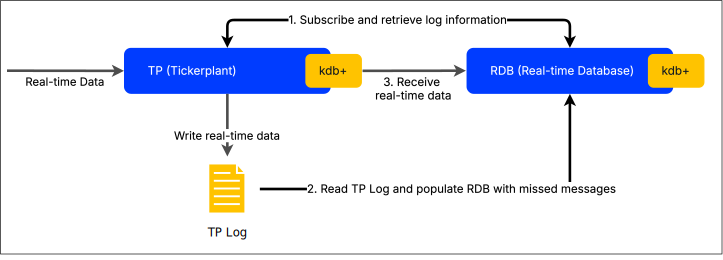

# Data recovery for kdb+tick

KX freely offers a complete tick-capture product which allows for the processing, analysis and historical storage of huge volumes of tick data in real time. This product, known as kdb+tick, is extremely powerful, lightweight and forms the core of most kdb+ architectures. 

The tickerplant lies at the heart of this structure. It is responsible for receiving data from external feedhandlers and publishing to downstream subscribers. 

Perhaps the most important aspect of the tickerplant is how it logs every single message it receives to a binary log file. In the event of a subscriber process failing, this log file can be used to restore any missing data.

## kdb+tick

This paper will primarily consider the relationship between the TP ([tick.q](../architecture/tickq.md)) and RDB ([r.q](../architecture/rq.md)) in a [kdb+tick architecture](../architecture/index.md). In particular, the use of tickerplant logs when recovering lost data in an RDB.

A log file created by a tickerplant is often referred to as a `TP log`.

The following diagram shows the steps taken by an RDB to recover from a TP log on start-up:



## Writing a TP log

A log file can be created by any kdb+ process to record instructions/data in binary format, which can be later replayed to recover state.

A tickerplant ([tick.q](../architecture/tickq.md)) has the option to create and records messages sent to its subscribing clients so that they may recover in situations were they may fail. 
The tickerplant creates and records logs using the methods as described [here](../kb/logging.md#manual-handling).

Should the TP fail, or be shut down for any period of time, no downstream subscriber will receive any published data for the period of its downtime. This data typically will not be recoverable. 
Thus it is imperative that the TP remain always running and available.

The tickerplant maintains some key [variables](../architecture/tickq.md#variables) which can be requested by subscribers in order to read the current TP log.

```bash
# start tickerplant
$ q tick.q sym . -p 5010
```
```q
q).u.L
`:./sym2014.05.03
q).u.l
376i 
q).u.i 0
```

The tickerplant calls the `upd` function on any of its subscribing processes. 
Therefore the tickerplant logs the `upd` function call and any data passed, so that any subscribers can replay the log to regain state. 
```q
//from u.q
upd:{[t;x] ...

//if the handle .u.l exists, write (`upd;t;x) to the TP log; 
//increment .u.j by one
if[l; l enlist(`upd;t;x); j+:1]
```

### kdb+ messages and `upd` function

A tickerplant message takes the form of a list.

```q
(updfunctioname;tablename;tabledata)
```

Here, `functionname` and `tablename` are symbols, and `tabledata` is a row of data to be inserted into `tablename`. 

Updates using trade schema
```q
trade:([]time:`timespan$();sym:`$();side:`char$();size:`long$();price:` float$() );
```
would appear in the tp log as
```q
`upd `trade (0D14:56:01.113310000;`AUDUSD;"S";1000;96.96)
`upd `trade (0D14:56:01.115310000;`SGDUSD;"S";5000;95.45)
`upd `trade (0D14:56:01.119310000;`AUDUSD;"B";1000;95.08)
`upd `trade (0D14:56:01.121310000;`AUDUSD;"B";1000;95.65)
`upd `trade (0D14:56:01.122310000;`SGDUSD;"B";5000;98.14)
```

## Replaying a TP log

Replay of a log file and dealing with a _corrupt_ log file is described [here](../kb/logging.md#replaying-log-files).

Clients of a tickerplant that may wish to recover state may be an RDB or custom developed RTEs.
Its important to note that tickerplant does not playback the log file. An individual client of the tickerplant (e.g. a RDB)
replays the log file when required.

An example of an RDB that uses the TP log to recover state on a restart is [r.q](../architecture/rq.md).

On startup, r.q subscribes to a TP and receives the following information:
- message count ([`.u.i`](../architecture/tickq.md#variables)) 
- location of the TP log ([`.u.L`](../architecture/tickq.md#variables)). 

It then replays this TP log to recover all the data that has passed through the TP up to that point in the day. 
This is called within [`.u.rep`](../architecture/rq.md#urep), which is executed when the RDB connects to the TP.

```q
//from r.q
.u.rep:{...;-11!y;...};
```

kdb+ messages were described above in [_kdb+ messages and upd function_](#kdb-messages-and-upd-function). 
In a typical RDB, `upd` performs an insert. 
Therefore, executing a single line in the logfile is equivalent to ``insert[`tablename;tabledata]``.

### Filtering TP log

A TP log will contain all messages published. 
A client of the tickerplant may have originally been subscribed to a subset of that data e.g. one of many tables published, or may wish to 
perform alternative logic on the data recovered from the log file. 

To filter on the data from the tp log, we can set the function(s) originally logged e.g. `upd` to a different value prior to playback and reinstate it after
playback completes. With this playback specific function, logic can be implemented to filter on the data provided or perform alternative logic.§

## Logging via an RTE/RDB

### Example 

Consider a Real-Time Engine designed to keep track of trading account position limits, 
The limits for each account can be used against realtime data from the tickerplant, and could be
updated in the RTE by account managers.

The account positions will use this schema

```q
accounts:([] time:`timespan$(); sym:`$(); curr:`$(); action:`$(); limit:`long$());
```

This could take the form of a keyed table, where sym is an account name.

```q
q) `sym xkey `accounts
`accounts
q)accounts
sym         | time                          curr   action limit 
------------|---------------------------------------------------- 
fgAccount   | 2014.05.04D10:27:00.288697000 AUDJPY insert 5000000 
pbAcc       | 2014.05.04D10:27:00.291699000 GBPUSD insert 1000000 
ACCOUNT0023 | 2014.05.04D10:27:01.558332000 SGDUSD insert 1000000
```

If we wanted this keyed table to be recoverable within this process, we would publish any changes to the table via the tickerplant and have a customized `upd` function defined locally in the RTE to take specific action on changes to the accounts table

```q
upd:{[t;x]
  $[t~`accounts;
    $[`insert~a:first x`action;[t insert x];
      `update~a;@[`.;t;,;x];
      `delete~a;@[`.;t;:;delete from value[t] where sym=first x`sym ]; 
      '`unknownaction];
    t insert x]; }
```

Here we have three operations we can perform on the `accounts` table: `insert`, `update` and `delete`. We wish to record the running of these operations in the TP log, capture in the RDB (in an unkeyed version of the table), and perform customized actions in the RTE. We create a function to publish the data to the TP. The TP will publish to both the RDB and RTE, and the `upd` function will then be called locally on each. Assuming TP is running on same machine on port 5010, with no user access credentials required, we can define a function named `pub` on the RTE which will publish data from the RTE to the TP where it can be logged and subsequently re-published to the RDB and RTE.

```q
.tp.h:hopen`:localhost:5010
pub:{[t;x]
  neg[.tp.h](`upd;t;x);
  h"" }
```

Example usage on the RTE:

```q
// - insert new account
q)k:`sym`time`curr`action`limit
q)pub[`accounts; enlist k!(`ACCOUNT0024;.z.p;`SGDUSD;`insert;1000000)]
q)accounts
sym        | time                          curr   action limit 
-----------|---------------------------------------------------- 
fgAccount  | 2014.05.04D10:51:49.288168000 AUDJPY insert 5000000
pbAcc      | 2014.05.04D10:51:49.291168000 GBPUSD insert 1000000 
ACCOUNT0023| 2014.05.04D10:51:50.950002000 SGDUSD insert 1000000 
ACCOUNT0024| 2014.05.04D10:54:41.796915000 SGDUSD insert 1000000

// - update the limit on account ACCOUNT0024
q)pub[`accounts; enlist k!(`ACCOUNT0024;.z.p;`SGDUSD;`update;7000000)] 
q)accounts
sym        | time                          curr   action limit 
-----------|----------------------------------------------------
fgAccount  | 2014.05.04D10:51:49.288168000 AUDJPY insert 5000000
pbAcc      | 2014.05.04D10:51:49.291168000 GBPUSD insert 1000000
ACCOUNT0023| 2014.05.04D10:51:50.950002000 SGDUSD insert 1000000
ACCOUNT0024| 2014.05.04D11:05:30.557228000 SGDUSD update 7000000

// - delete account ACCOUNT0024 from table
q)pub[`accounts; enlist k!(`ACCOUNT0024;.z.p;`SGDUSD;`delete;1000000)] 
q)accounts
sym         | time                          curr   action limit 
------------|---------------------------------------------------- 
fgAccount   | 2014.05.04D10:27:00.288697000 AUDJPY insert 5000000
pbAcc       | 2014.05.04D10:27:00.291699000 GBPUSD insert 1000000 
ACCOUNT0023 | 2014.05.04D10:27:01.558332000 SGDUSD insert 1000000
```

Each action will be recorded in an unkeyed table in the RDB, resulting in the following.

```q
q)accounts
sym          time                          curr   action limit 
----------------------------------------------------------------
fgAccount    2014.05.04D10:27:00.288697000 AUDJPY insert 5000000
pbAcc        2014.05.04D10:27:00.291699000 GBPUSD insert 1000000
ACCOUNT0023  2014.05.04D10:27:01.558332000 SGDUSD insert 1000000
ACCOUNT0024  2014.05.04D10:54:41.796915000 SGDUSD insert 1000000
ACCOUNT0024  2014.05.04D11:05:30.557228000 SGDUSD update 7000000
ACCOUNT0024  2014.05.04D11:05:30.557228000 SGDUSD delete 1000000
```

The order in which logfile messages are replayed is hugely important in this case. All operations on this table should be made via the tickerplant so that everything is logged and order is maintained. After the three operations above, the TP log will have the following lines appended.

```q
q)get`:TP_2014.05.04
(`upd;`accounts; +`sym`time`curr`action`limit!
  (`ACCOUNT0024; 2014.05.04D10:54:41.796915000;`SGDUSD;`insert;1000000);
(`upd;`accounts; +`sym`time`curr`action`limit!
  (`ACCOUNT0024; 2014.05.04D11:05:30.557228000;`SGDUSD;`update;7000000); 
(`upd;`accounts; +`sym`time`curr`action`limit!
  (`ACCOUNT0024; 2014.05.04D11:05:30.557228000;`SGDUSD;`delete;1000000);
```

Replaying this logfile will recover this table. If we wanted every operation to this table to be recoverable from a logfile, we would need to publish each operation. However, manual user actions that are not recorded in the TP log can cause errors when replaying. Consider the following table on the RTE.

```q
q)accounts
sym        | time                          curr   action limit 
-----------|----------------------------------------------------

// - insert new account
q)k:`sym`time`curr`action`limit
q)pub[`accounts; enlist k!(`ACCOUNT0024;.z.p;`SGDUSD;`insert;1000000)]
sym        | time                          curr   action limit 
-----------|---------------------------------------------------- 
ACCOUNT0024| 2014.05.04D10:54:41.796915000 SGDUSD insert 1000000

// - delete this entry from the in-memory table without publishing to the TP
q)delete from `accounts where sym=`ACCOUNT0024
q)accounts
sym        | time                          curr   action limit 
-----------|----------------------------------------------------

// - insert new account again
q)pub[`accounts; enlist k!(`ACCOUNT0024;.z.p;`SGDUSD;`insert;1000000)] 
sym        | time                          curr   action limit 
-----------|---------------------------------------------------- 
ACCOUNT0024| 2014.05.04D10:54:41.796915000 SGDUSD insert 1000000
```


Only two of these three actions were sent to the TP so only these two messages were recorded in the TP log:

```q
q)get`:TP_2014.05.04
(`upd;`accounts; +`sym`time`curr`action`limit!
  (`ACCOUNT0024; 2014.05.04D10:54:41.796915000;`SGDUSD;`insert;1000000); 
(`upd;`accounts; +`sym`time`curr`action`limit!
  (`ACCOUNT0024; 2014.05.04D10:54:41.796915000;`SGDUSD;`insert;1000000);
```

Replaying the TP log, the kdb+ process tries to perform an insert to a keyed table, but there is a restriction that the same key cannot be inserted in the table twice. The delete that was performed manually between these two steps was omitted.

```q
 q)-11!`:TP_2014.05.04
'insert
```


#### Recovering from q errors during replay

As seen in the previous section, replaying a TP log can result in an error even if the log file is uncorrupted. We can utilize error trapping to isolate any rows in the TP log which cause an error while transferring the other, error-free rows into a new log file. The problematic TP log lines will be stored in a variable where they can be analyzed to determine the next course of action.

```q
old:`:2014.05.03
new:`TP_2014.05.03_new
new set ()                  / write empty list to the new logfile
h:hopen new                 / open handle to new log file 
updOld:upd                  / save original upd fn
baddata:()                  / variable to hold msgs that throw errors
upd:{[t;x]                  / redefine upd with error trapping
  .[{[t;x] updOld[t;x];     /   try the original upd fn on the log line
      h enlist(`upd;t;x) }; /     if successful, write to new logfile
    (t;x);                  /   input params
    {[t;x;errmsg]           /   else log error and append to variable
      (0N!"error on upd: ",errmsg baddata,:enlist(t;x)) }[t;x] ]
  };
```

:fontawesome-regular-hand-point-right:
Reference: [Trap](../ref/apply.md#trap)

We now replay the original TP log.

```q
q)-11!old
2
q)accounts
sym        | time                          curr   action limit 
-----------|----------------------------------------------------
ACCOUNT0024| 2014.05.04D10:54:41.796915000 SGDUSD insert 1000000
```

Here, both lines of the TP log have been replayed, but only one has actually been executed. The second insert has been appended to the `baddata` variable.

```q
q)baddata
(`upd;`accounts; +`sym`time`curr`action`limit!
  (`ACCOUNT0024; 2014.05.04D10:54:41.796915000;`SGDUSD;`insert;1000000);
```

We may wish to write the bad data to its own logfile.

```q
(`:tp_2014.05.03_new) set enlist each `upd,/: baddata;
```

