White paper
{: #wp-brand}

# Data visualization with kdb+ using ODBC: <br/>A Tableau case study

by [Michaela Woods](#author)
{: .wp-author}


Business intelligence (BI) tools are widely used across many industries
for their interactive nature, which enables users to create and
customize dynamic data visualizations easily. Kx provides its own
visualization tool, [_Dashboards for Kx_](/dashboards/), but clients might have incumbent solutions they wish to connect to kdb+.

Alternatively, many organizations might wish to migrate their back-end
database to kdb+ for increased efficiency and scalability, while
retaining their current visualization front end. This paper
offers guidance.

[Tableau](https://www.tableau.com) is an example of a widely-used BI tool. 
This paper
outlines how it can be used to access kdb+ via ODBC
(Open Database Connectivity), a standard application-programming
interface used to connect different database management
systems, specifically designed to be independent of
databases and operating systems. Version 3.4 of kdb+ included an updated
version of its Windows ODBC driver (ODBCv3) to support wider access to
kdb+ data.

This paper illustrates the flexibility with which kdb+ data can be
accessed by Tableau using ODBC. It explains further how kdb+’s caching
feature may be used to improve performance by
optimizing repeated queries. 

Keep in mind that there
will always be limitations on third-party solutions not
designed from the outset for processing real-time streaming data. 
Kx’s own visualization tool _Dashboards for Kx_ is optimized for
streaming queries and inherits functionality such as user management, load
balancing, access control, caching and queuing from the underlying
platform as well as direct access to q for comprehensive querying
capabilities. Such features and their ability to support high-volume,
low-latency access to streaming data cannot be assumed in third-party
products.

Guidelines on connection, setup, queries and advice on how to maximize
performance are discussed. For both new and
existing users, this paper aims to reduce the learning curve, boost
efficiency and increase usability when combining these two technologies.

All tests were run using kdb+ version 3.5 and Tableau 10.3.


## Connecting to kdb+ using ODBC

Instructions on how to connect kdb+ from Tableau Desktop for both
Windows and Linux can be found at [Interfaces: Kdb+ server for ODBC3](../../interfaces/q-server-for-odbc3.md).

For an ODBC driver to connect to an application, it needs a DSN
(Data Source Name). 
A DSN contains the name, directory and driver of the database, and (depending on the type of DSN) the access credentials of the user.

With administrator rights, adding a new DSN is relatively
straightforward. See the instructions linked
to above. 

A second way to add a
DSN does not require administrator access, and might be useful
for some users. This defines the DSN connection
details in a Registry file rather than adding new DSNs directly in the
ODBC Data Source Administrator. This is an alternative to steps
3, 4 and 5 in the instructions linked to above.

1.  Copy `qodbc.dll` to the correct location.

2.  Define the Registry file and save it to `C:\Users\<username>` with
    a `.reg` extension. Here is an example of what the file might look
    like.

    <pre><code class="language-txt">
    Windows Registry Editor Version 5.00
    [HKEY_CURRENT_USER\SOFTWARE\ODBC\ODBC.INI\DEV]
    "Driver"="P:\…\qodbc3\w64\qodbc3.dll"
    "Description"="KDB ODBC3 Driver"
    "HOST"="hostname:port"
    "UID"="username"
    "PWD"="password"
    [HKEY_CURRENT_USER\SOFTWARE\ODBC\ODBC.INI\ODBC Data Sources]
    "DEV"="KDB ODBC3 Driver"
    </code></pre>

3.  Double-click on the file when saved. This will create the correct
    driver entries, which for this example will be a new kdb+ DSN called
    `DEV`.

This second method makes it easier to
maintain and share connection details with multiple users, as the DSN
details reside in a separate text file rather than in the Windows
Registry.


### Connecting to Tableau Desktop

Once a kdb+ DSN has been added, and the rest of the set-up instructions
are followed, you are ready to connect to kdb+ from
Tableau. On opening Tableau, you will be prompted to select the type of
database you wish to connect to, select the option _Other Databases
(ODBC)_.

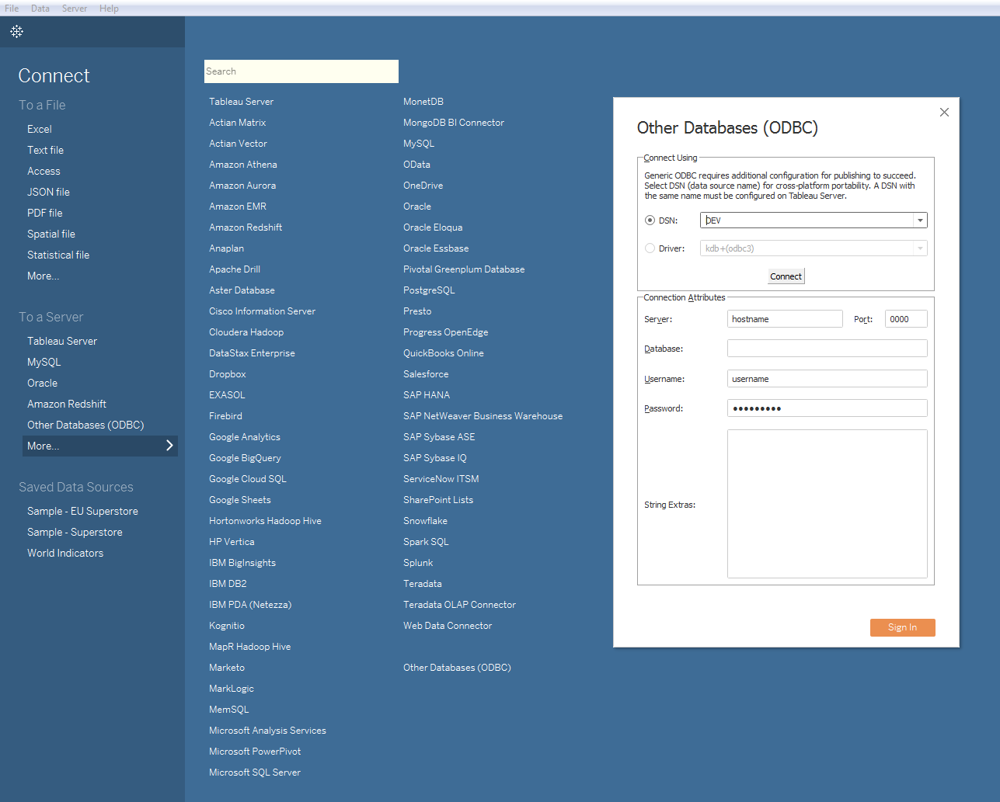

Next, select the correct DSN from the dropdown list and click _Connect_.
This will automatically populate the Connection Attributes in the bottom
half of the window using the details defined earlier in the Registry
file. The final step is to click the _Sign In_ button, which creates a
connection to the kdb+ process, enabling the database to be queried via
Tableau’s Custom SQL, as demonstrated in the following section.


### Connecting to Tableau Server

The set-up instructions above, both explicit and linked, are
specifically for a user connecting from Tableau Desktop. This is the
local version of Tableau installed on a desktop or laptop. Tableau
Server, on the other hand, is installed on a Windows server and is
accessible to users via a browser. Tableau Server brings additional
collaboration, security and scalability capabilities not available using
only Tableau Desktop.

Tableau workbooks can be shared between both by publishing from Tableau
Desktop to Tableau Server. This procedure is detailed in the
section _Publishing to Tableau Server_.

To connect via Tableau Server, the Registry file that was presented in
the previous section needs to be configured. This process may be handled
by an organization’s support team, depending on the installation setup.
The driver also needs to be installed, and then the connection can be
initialized much as for Tableau Desktop.


### Other considerations

Since a [release on 2017.09.11](https://github.com/KxSystems/kdb/blob/master/c/qodbc3.zip), qodbc3 allows specification of
connection details without a DSN. This means all details, except the
password, will be saved by Tableau in a workbook or saved data source.
However, this change only affects desktop users. Because the password is
not embedded, the DSN is still required to be defined on the server as
this is the only way the password will be picked up for published
reports.

It is also important to note that connection details are embedded in
both the Tableau workbook and the DSN definition. For version
management, when sharing workbooks between developers or when publishing
them to Tableau Server, this can become problematic. One workaround
solution to manage this is to wipe these details from the workbook with
a script before sharing or publishing workbooks. This concept is
explored below in _Publishing to Tableau Server_.


## Tableau functionality for kdb+

### Calling q from Tableau

Once a successful connection has been made, the next step is to begin by
running some sample queries. Tableau’s Custom SQL is the method by which
q queries can be run from Tableau. In particular, the `q()` function can
be used to send synchronous queries to kdb+, as shown below.

To demonstrate this, define a table `tab` in the kdb+ process you are
connecting to.

```q
q)N:8
q)dates:2018.03.28 + til 3
q)tab:([] date:N?dates;category:N?`CORP`EQ`GOV;volume:N?til 10000)
```

Then, in Tableau run the following in the _Custom SQL_.

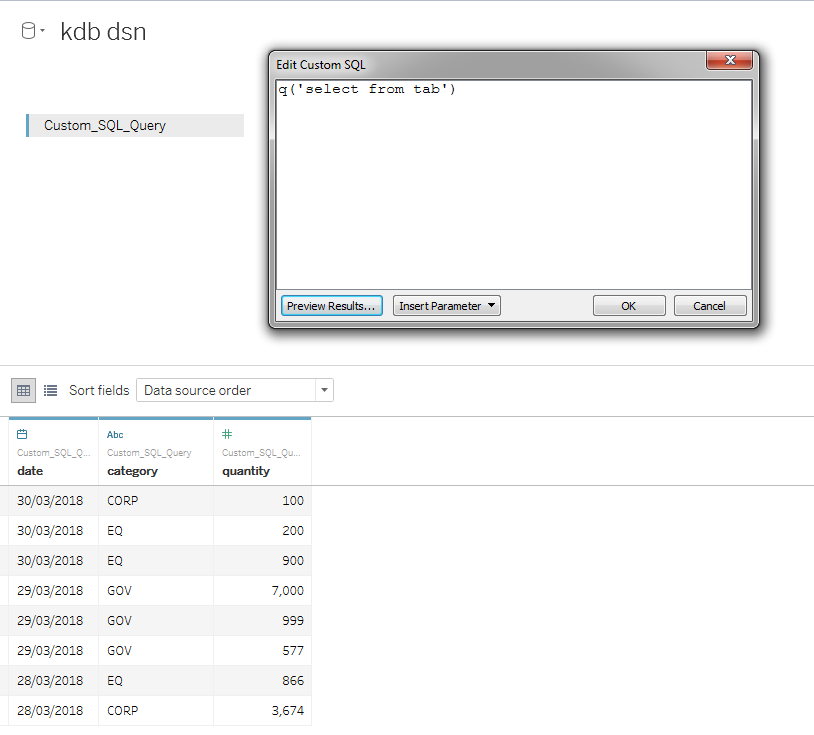

Now the data in the table `tab` is available for use in Tableau. Note
that if `tab` is a not a partitioned table (and is small enough to be
handled via SQL), you can just type its name into the table selector,
there is no need to use `q('select from tab')`. Other acceptable syntaxes
are:

```txt
q('tablename')
q('select from table where date in 2018.07.02')
q('function',<Parameters.Date>)
q('{[mydate] func[…]}',<Parameters.Date>)
```

Queries can be a simple select statement or can become much more complex
and flexible using inbuilt parameters supplied by Tableau, which will be
demonstrated in the next section.

!!! warning "Known SQL compatibility issues"

    -   SQL string literals are trimmed like q symbols
    -   `MIN()` and `MAX()` don’t work on strings
    -   q strings and booleans lack nulls, therefore SQL operations on null data resulting in these types ‘erase’ nulls
    -   `COUNT` and `COUNT DISTINCT` don’t ignore nulls
    -   SQL selects from partitioned tables are not supported – one should pre-select from a partitioned table using the `q()` function instead


### Datatypes

Tableau caters for multiple q datatypes.

Tableau               | q 
--------------------- | -------------- 
String                | Symbol, String 
Date                  | Date           
Date & Time           | Timestamp      
Numerical             | Int, float     
Boolean               | Boolean        

On loading data, Tableau automatically interprets the datatype of a
field. It is recommended that the user checks these have been
interpreted correctly after the data is loaded. If it is incorrect, the
datatype can then be easily changed on the _Data Source_ page or in the
_Data_ pane as shown below.

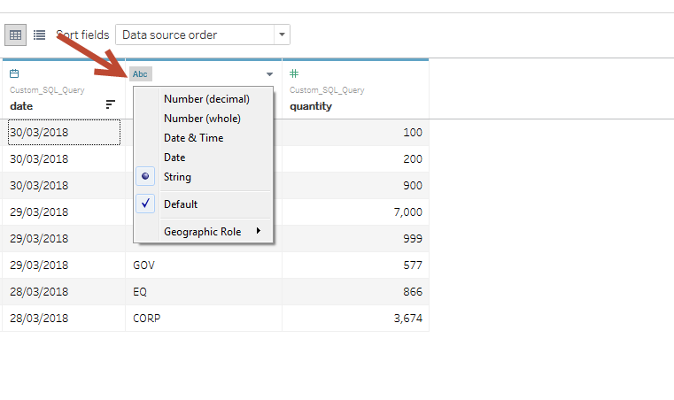

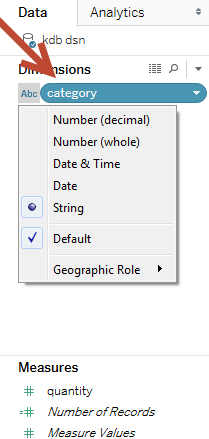


### Simple parameters

Tableau parameters provide further flexibility when working with q
functions. To demonstrate, define a function `func` that selects from
the table `tab` defined above. This function can be
called from Tableau using Tableau-defined parameters.

```q
func:{[mydate;mycategory]
  select from tab where date in mydate, category in mycategory
  };
```

Take the parameter `mycategory`: in this example, a list of allowable
symbols that are acceptable for the parameter `mycategory` can be
defined in Tableau.

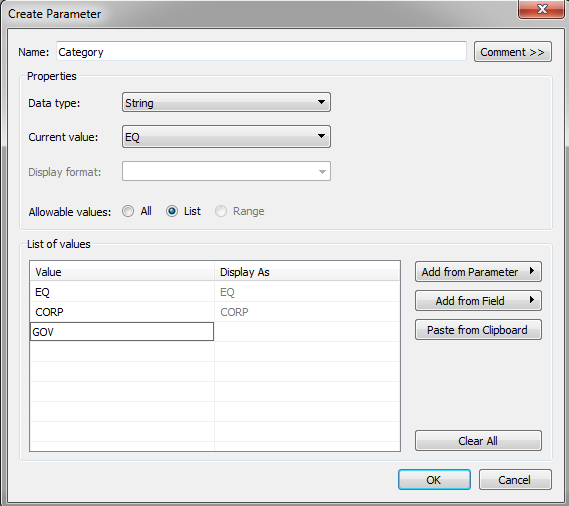

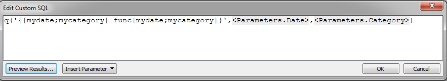

This can be done in the Custom SQL stage when you are writing your
query. These parameters can then be shown and made available for users
as a dropdown list on worksheets and dashboards as can be seen below.

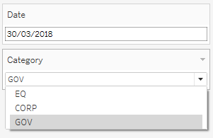

Tableau parameters are limited to static values, and a single select
option when placed in a view. However, there are ways to make them more
dynamic and flexible. This will be explored below in
_Dynamic Parameters_.


### Tableau filters

As shown above, parameters are a useful tool for creating user-defined
inputs to visualizations. However, there are cases where the user may
want to return the entire data set first and only afterwards reduce the
data set. This can be achieved using Tableau’s filters.

  
<small>_Tableau Category Parameter as defined in the previous section_</small>

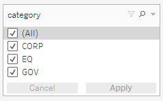  
<small>_Tableau Category Filter_</small>

Filters are the standard way to reduce the set of data displayed
on a worksheet. Note from the above screenshots that filters are not
limited to a single select option as parameters are.

Filters are most effective with fast queries on small datasets. For
longer queries and/or larger datasets, filters become challenging from a
performance point of view. This is because every time a filter selection
is changed, the Custom SQL query runs the same query multiple times per
view to build dimensions. Therefore the more filters and dimensions you
add to a view, the slower performance becomes.


### Caching

One way to get around this inefficiency is to introduce
caching in kdb+. Caching is storing results from previous queries or
calculations in an internal lookup table (or cache) for faster data retrieval on subsequent queries. Caching
here is being used to address the problem of filters causing queries to
be re-run.

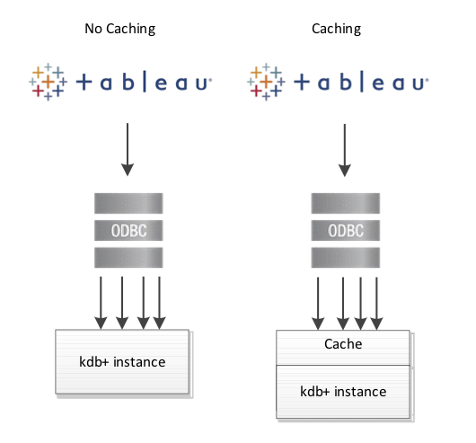  

The following example demonstrates the performance improvement of
caching when incorporated into a simple q function, `getTotalVolume`
(below), which extracts the total volume by symbol from a table `t`.

The demonstration table `t` contains randomly-generated mock data of symbol and volume values.

```q
N:100000000;
t:([] sym:N?`3;volume:N?10.0);
// Function used to compute the total volume by symbol from the table t
getTotalVolume:{[syms]
  select totalVolume:sum volume by sym from t where sym in syms
  };
```

Below is sample output of this function when called from Tableau.
Query response times for an increasing number of symbols runs from
hundreds of milliseconds to seconds:

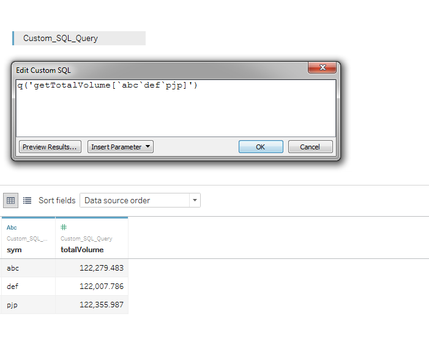

number of symbols     | time
--------------------- | --------
1,000,000             | 13 ms   
10,000,000            | 120 ms  
100,000,000           | 1038 ms 

To incorporate caching, the existing function can be modified to store
the total volume result for each queried symbol in a keyed table, called
`volumeCache`. Whenever the function is called from Tableau, an
internal lookup is performed on the `volumeCache` table to determine
if the calculation for the requested symbol has already been performed.
If so, the result can be immediately returned, otherwise a calculation
against the table `t` is performed.

```q
volumeCache:([sym:`u#`symbol$()];totalVolume:`float$())
getTotalVolume:{[syms]
  if[-11h~type syms;syms:enlist syms];
  // Get the list of syms which contain entries in the volumeCache
  // Extract the totalVolume values for those symbols
  if[count preCalculated:([]sym:syms) inter key[volumeCache];
     result:select from volumeCache where ([]sym) in preCalculated
  ];
  // If all syms are contained in the volumeCache then return result
  if[not count notPreCalculated:([]sym:syms) except key[volumeCache];
    :result
  ];
  // For syms not present in volumeCache, perform lookup
  result,:newEntries:select totalVolume:sum volume by sym from t where
    ([]sym) in notPreCalculated;
  // upsert new results to volumeCache
  upsert[`volumeCache;newEntries];
  result 
  };
```

Tableau queries against this modified function are significantly faster
and become sub-millisecond when symbols are already present within the
`volumeCache`. This approach greatly reduces the effect of filtering previously highlighted:

number of symbols | time (1st query) | time (2nd query)
----------------- | --------------- | ---------------
1,000,000         | 3 ms            | <0ms                         
10,000,000        | 96 ms           | <0ms                         
100,000,000       | 1021 ms         | <0ms                         


### Dynamic parameters

As mentioned above in _Simple parameters_, Tableau
parameters are limited to static values, and a single select option when
placed in a view. However, there are a number of ways to make parameters
smarter, and can increase their usability and flexibility. Below, two
such methods are described. 


#### Predefining parameter options in a q function

From the previous example, the input parameter Category is limited to
single values. This can be made more flexible by
defining in the function a range of acceptable values.
In the example below, the
argument `` `all`` leads to a select with no restriction on `category`.

```q
func:{[mydate;mycategory]
  $[mycategory=`all;
    select from tab where date in mydate;
    select from tab where date in mydate, category in mycategory]
  };
```

Then `all` can be added to the list of predefined values in Tableau’s
definition of Category:

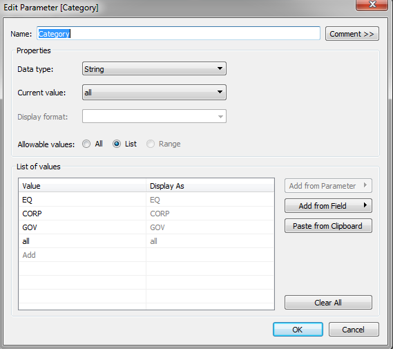


#### Using parameters with calculated fields

Using parameters in conjunction with Tableau’s calculated-field
functionality can be a convenient and flexible tool in calculations as
well as graphical representation. This is useful when the output the
user wants to see is dependent on an input parameter, and a field needs
to be adjusted accordingly.

For example, in the user-defined `Calculation1` logic below, the quantity
field will be divided by a different amount depending on the chosen
Category value. 

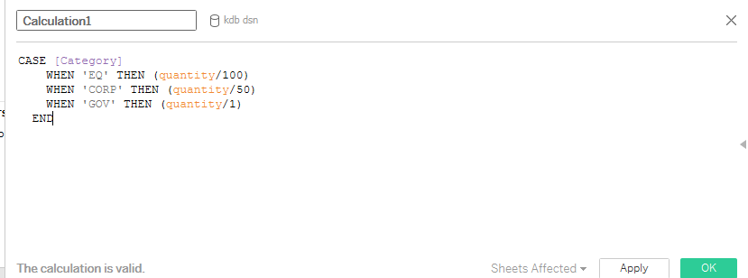

Below is sample output from when the user selects
a _Category_ value of `EQ`.

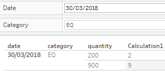

In contrast, when the user selects `CORP` the calculated field will be
divided by 50.

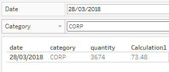


### Multiple data sources

Kdb+ is efficient at joining data sets,
and can easily do so in memory at the gateway level. However,
it is also worth noting that it is possible to join two or more
different datasets in Tableau if they share a common dimension or key.
This can be useful when it is desirable to join certain datasets for
reporting purposes only.

Tableau maintains connections to multiple data sources via a number of
open live connections to a q instance. This functionality makes it
possible to use the results from one data source to filter
another. So far, in this paper, the examples have described
functionality using only one data source. For the rest of this section,
working with multiple data sources and joining them in Tableau will be
explored.

One of the first things to note is that fields from different data
sources can be included on the same worksheet, provided the sources are
mapped to each other. In Tableau, fields from different data sources can
be mapped to each other even if they have a different name, so long as
they are the same datatype. This can be controlled and edited in 
_Data > Edit Relationships_.


#### Actions

Once a dashboard is created, the filters are controlled in _Dashboard >
Actions_. When setting up actions for kdb+ data sources, it is important
to note how the selection is cleared. For large datasets, it is
recommended that you select the action _Exclude all values_. This
feature prevents data from being displayed in `Sheet 2` until data is
first selected in `Sheet 1`. This has a very significant effect on
performance as it means Tableau only builds dimensions for views within
the dataset that has been filtered.


The following example demonstrates how much of an improvement on
performance this feature can have. Once a table `t` is defined and
subsequently called from Tableau, the next step is to create a
dashboard.

```q
q) N:10000000
q) t:([] sym:N?`3;volume:N?10.0)
```

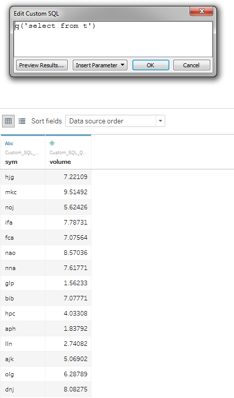

Step-by-step instructions on how to build the dashboard shown below and
performance tests can be found in Appendix A.


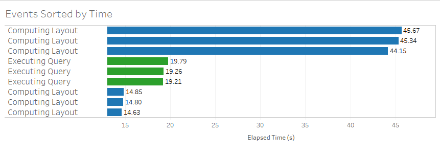  
<small>_Action Selection: Show all values_</small>


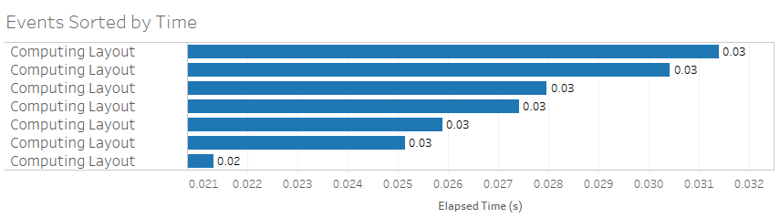  
<small>_Action Selection: Exclude all values_</small>

Using the _Exclude all values_ option yields a
clear performance improvement. Computing time reduces from ~45secs per
select/deselect down to ~0.3ms. Also, when using _Exclude all values_
there is no Executing Query time.

Exploiting this feature can be hugely useful when working with kdb+ and
Tableau where the volume of datasets can be very large.


## Publishing to Tableau Server

As mentioned above, to share workbooks
between Tableau Desktop and Tableau Server you can publish the former to
the latter. 
Tableau provides [detailed documentation and instructions](https://help.tableau.com/current/pro/desktop/en-us/publish_workbooks_howto.htm)
on the general publishing procedure, which involves publishing from within an already-open workbook.

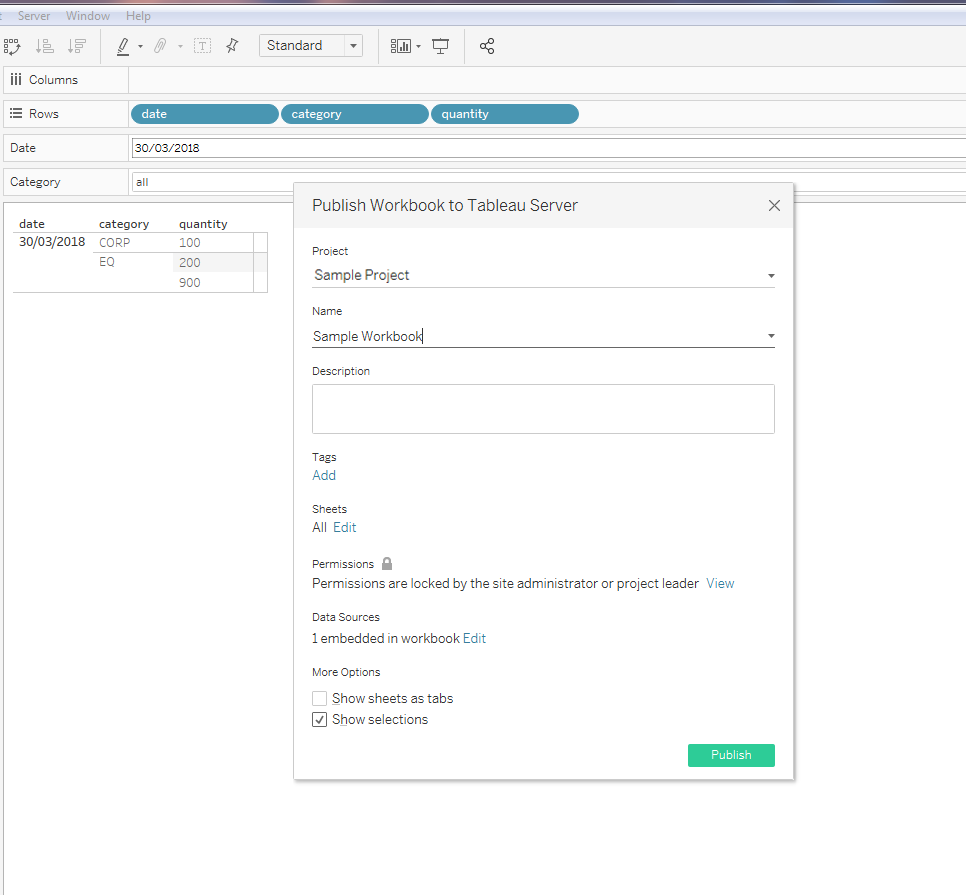

This is not an ideal way to publish workbooks that are connected to a
kdb+ database, because connection details are stored
within the workbook itself. Take the following scenario:

-   A workbook has been developed in Tableau Desktop and is ready to share to the `Testing` partition in Tableau Server.
-   Throughout development, a development DSN has been used. But the workbook needs to be published to a UAT DSN.
-   So the DSN details need to be changed to the UAT DSN before publication.
-   The workbook again needs to be promoted, this time to the `Production` partition.
-   The workbook must be reopened, and the DSN details changed to the production DSN, before final promotion to `Production`.

This process is manual and prone to errors. For kdb+
connections, it is recommended to use the `tabcmd` command-line utility
which, among other things, enables the user to publish to Tableau Server
from the command line. This utility allows the user to deploy sheets
programmatically, streamlining the process hugely. It also means that as
part of the deploy procedure, the workbook can be edited by a script
before publishing via `tabcmd`. This means you can do some efficient
things like:

-   Wipe out the connection details that are automatically embedded in the workbook
-   Pick which DSN to point to, e.g. `DEV`, `UAT`, `QA`, `Prod`
-   Pick which Tableau server to publish e.g. `tableau.net` or `tableau-uat.net`
-   Pick which Tableau environment to publish to e.g. `Development`, `Testing` or `Production`
-   Edit the Tableau project name

Using `tabcmd` and a script to edit the workbook can be an effective
way to make the publishing process smoother when connecting to
kdb+, especially when scaling use cases and looking to publish across
multiple environments and DSNs.


## Conclusion

Kdb+ is well known as the world’s fastest time-series database. Kx’s
own visualization tool, _Dashboards for Kx_, is optimized for this
technology. However, kdb+ is flexible enough to connect with a
range of different visualization tools. This white paper demonstrates how to connect to one such visualization tool,
Tableau, by means of the Kx ODBC driver.

You have seen how to set up a connection between kdb+ and Tableau
using ODBC, with detailed instructions on how best to use Tableau’s query
functionality, datatypes, parameters and filters with the q language.

The key takeaways include how kdb+’s caching feature may be used to
improve performance by optimizing repeated queries from Tableau. Further
to this, improving performance when using filters with multiple data
sources was explored. The methods provided in this paper demonstrate
that kdb+ and Tableau can be combined in an efficient way despite
limitations that occur when combining the two technologies.

If the question is “Is Tableau the best, and best performing visualization
tool when combining with kdb+?”, the answer is “No. There are other
visualization tools better tailored to the kdb+
technology, for example Kx’s visualization solution _Dashboards for Kx_.”
But if the question is “Can you combine these two technologies in an
effective way?” the answer is “Yes”, and by applying the functionality
described in this paper to work around limitations, to connect a Tableau
visualization front-end to a kdb+ back end.

[:fontawesome-solid-print: PDF](/download/wp/data-visualization-a4.pdf)

## Author

**Michaela Woods** is a kdb+ consultant for Kx. Based in London for the past three years, she is now an industry leader in combining kdb+ with Tableau through her development of a data visualization platform currently used at one of the world’s leading investment banks.


## Appendix A

1.  Create `Sheet 1`
    
    1.  Drag and drop `sym` to _Columns_.
    
    2.  Drag and drop `Number of Records` to _Rows_.
    
    3.  Drag and drop `volume` to the _Marks_ pane on color. Right-click
        and pick _Discrete_.

2.  Create `Sheet 2`
    
    4.  Drag and drop `sym` to _Rows_.
    
    5.  Drag and drop `volume` to _Rows_. Right-click and pick both
        _Dimension_ and _Discrete_. This means every row will be displayed
        and not just the summed value.

3.  Create `Dashboard 1`
    
    6.  Drag `Sheet 1` onto the top of the dashboard.
    
    7.  Drag `Sheet 2` onto the bottom of the dashboard.

4.  Make `Sheet 1` a filter for `Sheet 2` on the dashboard.
    
    8.  Hover over `Sheet 1` and on the top right-hand side select the
        middle icon that looks like a filter.

5.  Testing performance with default filter selection
    
    9.  Pick _Help > Settings and Performance > Start Performance Recording_
    
    10. Select and deselect some of the bars in the top graph. You
        should notice much slower performance on deselect.
    
    11. Pick _Help > Settings and Performance > Stop Performance Recording_

    A performance workbook will then pop up, and you can analyze the performance.

6.  Testing performance with selection _Exclude all values_
    
    12. Pick _Dashboard > Actions > Edit > Select 'Exclude all values'_
    
    13. Repeat step 5

    A second performance workbook will pop up and can be compared with the previous one to analyze performance.
