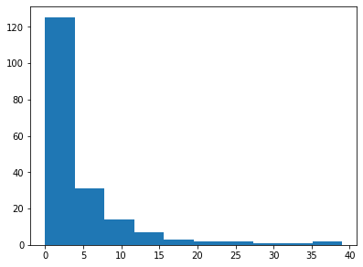
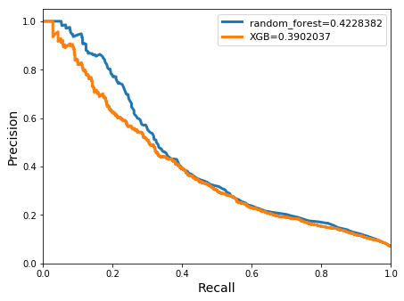
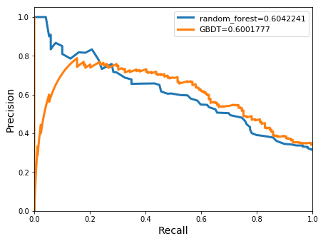
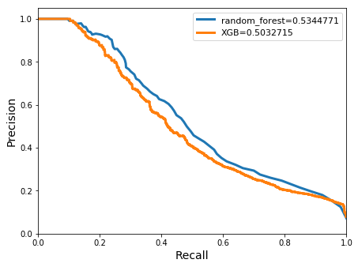
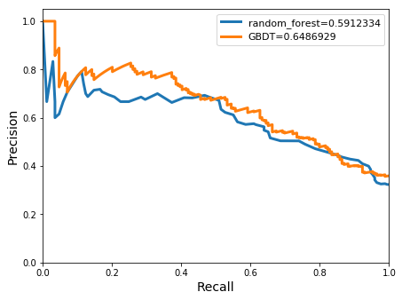
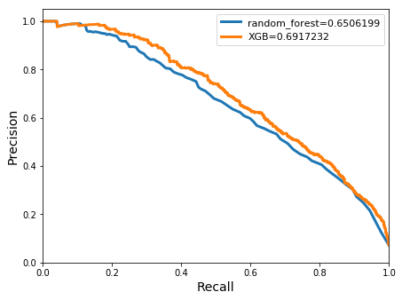
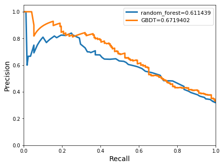
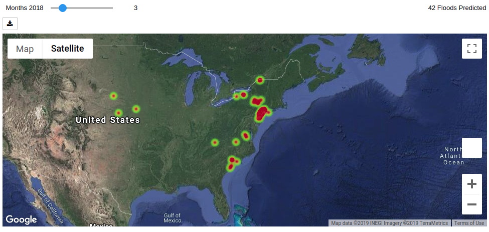
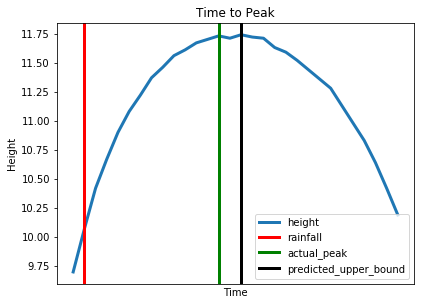

# Predicting floods with q and machine learning


==DRAFT==

The Frontier Development Lab (FDL) is a public-private partnership run annually with both the European Space Agency (ESA) and National Aeronautics and Space Administration (NASA). The objective of FDL is to bring together researchers from the Artificial Intelligence (AI) and space science sectors to tackle a broad spectrum of challenges in the space industry. The projects this year include challenges in lunar and heliophysics research, astronaut health and disaster prevention. This paper will focus on the Disaster Prevention, Progress and Response (Floods) challenge, for which Kx was a sponsor.


## The need for AI in disaster prevention

Floods are the most destructive and dangerous natural disasters worldwide =='the most destructive worldwide' is a bit strong. one of the most destructive perhaps? Or the most destructive in the US? - since you have some data at the end of this para to support this claim?==. All regions can be affected by flooding events and, with the increased variability in weather patterns due to global warming, this is [likely to become even more prevalent](https://www.nrdc.org/stories/flooding-and-climate-change-everything-you-need-know). The speed at which flooding events can occur, and difficulties in predicting their occurrence, create huge logistical problems for both governmental and non-governmental agencies. Over the past 10 years, floods have caused on average [95 deaths a year in the US alone](https://weather.com/safety/floods/news/2018-11-08-flood-related-deaths-increasing-in-united-states), making them [the deadliest weather-related phenomenon](https://www.nssl.noaa.gov/education/svrwx101/floods/). Worldwide, [floods cost in excess of 40 billion dollars per year](https://www.nationalgeographic.com/environment/natural-disasters/floods/), impacting property, agriculture and the health of individuals.

During the duration of the project, we collaborated with the United States Geological Survey (USGS), a scientific agency within the US Department of the Interior. The objective of the organization is to study the landscape of the US and provide information about its natural resources and the natural hazards that affect them. Currently, hydrologists use physical models to help predict floods. These models require predictions to be carefully calibrated for each stream or watershed and careful consideration must be taken for dams, levees, etc. Producing these models is extremely costly due to resource requirements. This limits the areas within the US that can use such systems to better prepare for flood events.


## The challenge

To predict the flood susceptibility of a stream area, the project was separated into two distinct problems.

_Monthly model_

Predicting, per month, if a stream height will reach a flood threshold or not. These flood thresholds were set by the National Oceanic and Atmospheric Administration (NOAA) and were location-specific. Knowing which areas are susceptible to flooding, allows locations to better prepare for a flood event.

_Time-to-peak model_

Predicting the time to peak of a flood event. When a major rain event occurs, knowing how long it will take for a river to reach its peak height is necessary in order to inform potentially affected individuals if and when they need to evacuate. This can help to reduce structural damage and loss of life during a disaster.


## Dependencies

All development was done with the following software versions:

```txt
kdb+     3.6
Python   3.7.0
```

The following Python modules were also used:

```txt
TensorFlow      1.14.0
NumPy           1.17.2
pandas          0.24.2
Matplotlib      2.2.2
scikit_learn    1.1.0
xgboost         0.9.0
gmaps           0.9.0
geopandas       0.5.1
ipywidgets 	    7.5.1
```

In addition, a number of kdb+ libraries and interfaces were used:

```txt
embedPy         1.3.2
JupyterQ        1.1.7
ML toolkit      0.3.2
```


## The data

This project focuses on six states within the US, over a period of 10 years. Data was taken from ~800 gauge sites, between July 2009 and June 2019. Not all gauge sites had continuous historical data over the period, but all the available data for each site was used.

The six states were: New Jersey, Nebraska, South Carolina, New York, South Dakota, and Virginia. A primary reason for choosing these states, was that each exhibits ==they exhibit== similar climate and landscape ==to one another==. Focusing on similar geographies helped to ensure that the models produced were precise ==what do you mean by precise in this context? you mean the models produced precise predictions? Or models were precise for this specific type of climate and geography? how do similar geographies help with that - not an expert but I would think you want variability in the data if the model is to be general?==.

Required datasets and providers:

USGS

: USGS provided its [Surface Water dataset](https://waterdata.usgs.gov/nwis/sw). This consisted of the height of a stream as measured by gauges for over 11,000 sites in the US. The data was updated every 15 minutes, with some locations having historical data for over 50 years. As previously mentioned, the data chosen in this case was a subset of these sites based on geographical location.


PRISM

: [The PRISM Climate Group](http://www.prism.oregonstate.edu/) provides climate observations across the whole of the US. This data contains information on total precipitation, minimum/maximum temperature and dew point for each requested latitude and longitude. Spatial and climate datasets are then developed to reveal short and long-term climate patterns. This dataset was used to extract daily precipitation readings from the site locations for each day during the requested 10 year period.

National Land Cover Database (NLCD)

: The [NLCD database](https://www.usgs.gov/centers/eros/science/national-land-cover-database) was collected using [Landsat](https://www.nasa.gov/mission_pages/landsat/main/index.html). This satellite has a 30-meter resolution and provides information for the entire US ==this statement feels out of place here==. The Landsat satellite program is a NASA/USGS collaboration which provides [the longest continuous space-based record of Earth’s landscape](https://landsat.gsfc.nasa.gov/). Landsat’s ground resolution and observation wavelengths allow the current use of land and its change over time to be detected and documented. This provides information such as land-use classification (urban, agriculture, forest, etc.), how well the land allows water to pass through it (impervious surface information) and tree cover. This dataset has updated records every five years from 2006. The granularity of this dataset is related to how quickly land use changes over time.

National Hydrology Dataset Plus (NHDPlus)

: [NHDPlus](http://www.horizon-systems.com/nhdplus/) is a geo-spatial hydrologic framework dataset associated with USGS, released in 2006. It is based off the NHD dataset, which provides information about the streams, rivers, canals, lakes and ponds throughout the US. The features used from this dataset were the catchment and drainage area characteristics at the stream site locations. Catchment areas are particularly important, as these are the areas of a river/stream in which water is collected and accumulates. This is vital information for predicting whether a flood is likely to occur or not.


Flooded Locations And Simulated Hydrographs Project (FLASH)

: [FLASH](https://blog.nssl.noaa.gov/flash/) is a database containing information about flood events within the US. The main goal of the FLASH project was to improve the accuracy and timing when predicting these flash floods. The information used from this dataset was the time taken for a river to reach its peak height after a major rain event.

NOAA

: [NOAA](https://www.noaa.gov/) is a US governmental agency for monitoring and preserving the climate and environment. This dataset provided flood-level thresholds for locations across the US. These thresholds consisted of four warning stages and the river height for a given location that causes them to reach these levels. The four warning stages are

    warning  | meaning
    ---------|---------------
    Action   | Mitigation action needs to be taken in order to prepare for possible hydrological activity.
    Flood    | The river height poses a threat to lives, property and businesses.
    Moderate | Some inundation of roads or buildings. A flood warning should be released.
    Major    | Extensive inundation of roads and buildings. Considerable evacuations of areas may occur.


## Feature engineering

==I read this whole paragraph and it's a bit confusing what a feature is. Is a feature one of these 3 subsets of data you talk about? I think this section would benefit by clarifying what a feature is, and by explaining why we want to do this specific 3 way split, i.e. why not just look at perfect forecasts?==

Given the data available, it was possible to split the information into three datasets.

Ungauged basin

: Information available at sites that do not contain stream gauge or future forecasting information. Data was limited to land use, past rainfall and upstream information.

Gauged basin

: All information contained within the ungauged basin dataset, as well as stream gauge information. This included previous river heights and lagged/aggregated flooding information.

Perfect Forecasts

: All information contained within the gauged basin dataset, as well as precipitation information around the time of the event.

To obtain these features, the `feat` function was used. This enabled previous information ==which is previous information?== along with windowed features ==what are windowed features?== to be extracted. This function takes the following arguments:

1.  table that is being updated
1.  how many values to calculate (integer list)
1.  column to apply the function to (symbol)
1.  new column name (symbol)
1.  dictionary of where, groupby and what type of functional statement is used
1.  function that is applied to the grouped columns

==the definition of the feat function should be here, immediately after defining its parameters instead of all the way in the bottom==
==in general reverse the approach - define and explain top level function first followed by lower level functions, i.e. feat first followed by functions that feat calls - the majority of readers care about top level function.==
==max_mavg isn't actually used in feat until much later in the paper, so I wouldn't include it here but later when you actually use it to call feat==
==it's a style thing but parameters named x,y,z in feat would be better named something meaningful - as you're trying to explain here how this function works.==
==it is a good idea to also stay away from generic function names like func... name it something meaningful; I am not a great function namer myself but applyAndRename or something liek that looking at definition?==

```q
// Create new column name
colname:{enlist`$string[y],"_",string[x],"_",string[z]}
// Calculate maximal moving average
max_mavg:{(max;(mavg;y;x))}
// Calculate value of lagged features
prv:{(xprev;y;x)}

// Apply functions to appropriate columns
// and rename columns appropriately
func:{[x;y;z;b]
  raze{[x;y;z;b]colname[x;y;z]!enlist b[x;z]}[z;y;;b]each raze x }

// Upstream, previous, windowed and lagged extraction function
feat:{[x;y;z;col;d;fnc]
  d[`w][x;d`wh;d`gr;$[1<count[z];raze;] func[y;col;;fnc] each z] }
```


To obtain the upstream values ==what are upstream values?== the `feat` function was used ==this doesn't read well ; maybe something like 'This is how upstream values are defined would be better.'==. The ID number of each stream site consisted of over eight digits. The first two digits were the grouping number of the river-basin catchment. The remaining digits were in ascending order based on the location of the gauge along the stream ==Can we give a small example of data? It would be easier to follow the remainder of the code==.

```q
/Grouping site numbers by catchment, using the first 2 digits
catch_site:((';#);2;($:;`site_no))
site_date :`site_no`date!(catch_site;`date)
dict:`w`wh`gr!(!;();site_date)

upstr_ppt   :feat[precip;1;`ppt;`upstr;dict;prv]
upstr_height:feat[maxht;1;`height;`upstr;dict;prv]
```

The `feat` function was also used to obtain previous values of both rainfall- and stream-gauge height readings before each date, for both the current location and sites upstream.

==I think we need more explanation about why we're doing this...why do we need previous values? How did you come up with the second parameter to feat?== 

```q
dict[`gr]:site:(enlist `site_no)!enlist `site_no

prev_rain:feat[
  upstr_ppt;
  enlist 1_til 10;
  `ppt`upstr_ppt_1;
  `prev;
  sited:dict;
  prv]

all_height:feat[
  upstr_height;
  enlist 1_til 10;
  `height`upstr_height_1;
  `prev;
  dict;
  prv]
```

The above features were applicable to both aspects of this project ==do you mean monthly model and time to peak model? if so worth reiterating what these are here==. However, additional features that were problem-specific were also added.

_Monthly model_

When forecasts were provided for each model, it was important to have information on the average historical rainfall over different time windows. This feature was added to the dataset using the functions displayed below.

==this is where you should introduce max_mavg==

```q
dict[`gr]:(`date`site_no)!(($;enlist`month;`date);`site_no)

all_rain:feat[
  prev_rain;
  enlist 1_til 15;
  `ppt`upstr_ppt_1;
  `window;
  dict;
  max_mavg]
```

_Time-to-peak model_

The hours before a flood event can provide important information on how quickly the stream gauge height is moving. This is incredibly useful to a model predicting how long it will take for the stream to reach its peak height. The information extracted at a given stream location, comprised of the maximum moving averages over different bucket sizes for the two days before the event. This was found using stream height data from USGS, which was updated at 15-minute intervals.

To make the times from the stream-height dataset consistent with the FLASH dataset, the times were converted to be time-zone agnostic.

These zones are:

```txt
EDT  Eastern Daylight Time
CDT  Central Daylight Time
EST  Eastern Standard Time
```

==what follows is a lot of code that's hard to follow - perhaps a snippet of output from each stage so that we can follow what's being constructed would be good==

```q
// Obtain timezone (unk) information for each site
// from the gauges hdb (str)
time_zone:raze{
  si:x 0; dd:x 1;
  select `$first site_no,`$first unk from str
    where date=first dd,si=`$site_no
  }each site_date

// Join time-zone information to the peak dataset
peak_data:peak_data ij`site_no xkey time_zone

// Modify the time-zone based on extracted information from gauges hdb
change_zone:{
  tm:x 0; tz:x 1;
  $[tz=`EDT;tm-04:00;tz=`CDT;tm-05:00;tm-06:00] }
```

The features, along with information about the projected rainfall in the days following the event, were also extracted and joined onto the dataset.

```q
// The date range of interest
range:{(within;x;(,;(+;(-:;2);y);y))}
// The where clause to be applied
wh:{(
  range[`date;x 1];
  range[`datetime;x 2];
  (=;enlist first x; ($;enlist`;`site_no)) ) }

// Dictionary to be passed to the feat function
dict:{`w`wh`gr!(?;wh x;0b)}

wind_ht_prev:{
  feat[str; enlist 2 4 12 48; `height; `wind_prev; dict x; max_mavg]
  } each flip peak_data `site_no`date`start_time

wh:{((within;`date;(,;y 1;(+;y 1;x)));(=;enlist first y;`site_no))}
dict:{`w`wh`gr!(?;wh[x;y];0b)}

rain_pred:{feat[
  all_rain;
  enlist 1_til x;
  `ppt`upstr_ppt_1;
  `fut_window;
  dict[x;y];
  max_mavg] }[3] each flip peak_data `site_no`date
```


## Target data

_Monthly model_

The target data used in this case was the flood-level warning, extracted from the NOAA dataset.

The latitude and longitude of these provided thresholds did not exactly match the stream-gauge locations. As such, the latitudes and longitudes of both the stream locations and NOAA threshold readings were joined using a k-dimensional tree (kd-tree) nearest-neighbors algorithm. This algorithm is explained in Appendix 1.

The code used to achieve this nearest-neighbors calculation is seen below with the algorithm implementation contained in full in the GitHub repository associated with this paper.

```q
wlatl:raze each
  warning[`Latitude`Longitude],'gauges[`dec_lat_va`dec_long_va]

tabw:kd.buildtree[wlatl;2]
gauge_val:count[warning]+til count gauges

nnwarn:kd.nns[
  ;
  tabw;
  (count[warning]#0),count[gauges]#1;
  flip wlatl;
  `edist] each gauge_val

joins:([site_no:gauges`site_no]nn:nnwarn[;0];ndw:nnwarn[;1])

floodlvl:(maxht ij joins)lj`nn xkey warning
```

This dataset was then joined onto the stream-gauge data, adding columns counting the number of times a given stream gauge reached each warning level per month.

For the sake of this project, we only wanted to focus on the Flood stage. This level was chosen in an attempt to achieve a more balanced dataset while still predicting a meaningful target. Choosing either of the more severe levels would result in a very low number of targets making it more difficult to discern events of interest.  Our target data was a binary label denoting whether the flood warning level was reached in a given month. Any site that claimed to flood more than 28 days per month were omitted from the dataset as we only wanted to focus on events that occured infrequently and were more difficult to predict.

```q
q)threshold:0!select
                first Action, first Flood, first Moderate, first Major,
                no_Action:count where height>Action,
                no_Flood:count where height>Flood,
                no_Mod:count where height>Moderate,
                no_Major:count where height>Major
                by site_no, "m"$date
                from floodlvl
q)threshold:select from threshold where no_Flood<28
q)threshold[`target]:threshold[`no_Flood]>0
q)threshold
site_no  date    Action Moderate Major target ...
---------------------------------------------
01200000 2009.07 6      10       12    0
01200000 2009.08 6      10       12    0
01200000 2009.09 6      10       12    0
01200000 2009.10 6      10       12    0
01200000 2009.11 6      10       12    0
01200000 2009.12 6      10       12    0
01200000 2010.01 6      10       12    0
01200000 2010.02 6      10       12    0
01200000 2010.03 6      10       12    0
01200000 2010.04 6      10       12    0
01200000 2010.05 6      10       12    0
01200000 2010.06 6      10       12    0
...
```


_Time-to-peak model_

The FLASH dataset was then used for the time-to-peak model, which highlights how long it will take a stream gauge location to reach its peak height after the rain event.

Only dates within the 10 year period and site numbers within the 6 states mentioned were included. The target data was calculated by subtracting the start-time (denoted by the start of a major rainfall event at the location) from the time that the peak height was found to occur.

This was then converted into a binary classification problem by setting a threshold for a ‘flash flood’ at 3.5 hours after the major rainfall event. Any time above this was set to `0b` and less than this time was `1b`. This threshold was chosen after discussions with hydrologists, who found this to be a reasonable split in the dataset.

```q
peak[`delta_peak]:(peak[`peak_time]-peak[`start_time])*24

peak[`target]:peak[`delta_peak]<3.5
```


## Spatial and temporal joins

_Monthly model_

After joining the stream-height and precipitation tables from USGS and PRISM, the dataset was then broken up into monthly values. By taking the first day of each month at a site, it was possible to obtain the maximum moving averages of precipitation for different window sizes for a given month, along with the precipitation and height values for the last few days of the month prior. This data was then joined to the `stream_char` dataset, which consisted of the basin and landcover characteristcs, and the “threshold” dataset, based on month and site number.

Lagged features were then added to this dataset, which included information like did a flood occur in the month prior, the year prior and also how often on average did the given location flood.

```q
all_monthly_data:feat[
  all_monthly_data;
  enlist 1 12;
  `target;
  `lagged;
  sited;
  prv]

tgts:value exec no_Flood by site_no from all_monthly_data

all_monthly_data[`lagged_target_all]:raze{count[x]mavg raze x}each tgts
```

_Time-to-peak model_

The daily rain and height, FLASH, and the `stream_char` were then joined based on site number and date to create the time-to-peak dataset.


## Train and test split

A dictionary was created for each of the three separate datasets:

-   Ungauged
-   Gauged
-   Perfect Forecasts

The dictionary contained the different feature columns required to make up the above datasets for each of the monthly (`M`) and time to peak (`P`) models.

```q
fc:{x where x in y}    / find column

ungauged_colsM:        fc[ungauged_cols;cols cleaned_monthly]
gauged_colsM:          fc[gauged_cols;cols cleaned_monthly]
perfect_forecast_colsM:fc[perfect_forecast_cols;cols cleaned_monthly]

ungauged_colsP:        fc[ungauged_cols;cols cleaned_peak]
gauged_colsP:          fc[gauged_cols;cols cleaned_peak]
perfect_forecast_colsP:fc[perfect_forecast_cols;cols cleaned_peak]

ungauge: `M`P!(ungauged_colsM;ungauged_colsP)
gauge:   `M`P!(ungauge[`M],gauged_colsM;ungauge[`P],gauged_colsP)

forecast:`M`P!
  (gauge[`M],perfect_forecast_colsM;gauge[`P],perfect_forecast_colsP)
```
```q
q)forecast
M| `month`cos_t`sin_t`elv`imp`CatAreaSqKm`WsAreaSqKm`CatAreaSqKmRp100..
P| `month`cos_t`sin_t`elv`imp`CatAreaSqKm`WsAreaSqKm`CatAreaSqKmRp100..
```

These dictionaries were then used to extract the appropriate columns from each table, to make them suitable inputs to machine-learning models. This was achieved by using the `split_dict` function which takes a table as input, as well as `M` or `P` indicating which model was being used.

```q
q)split_dict:{(!). flip(
  (`ungauged;flip x ungauge y);
  (`gauged;flip x gauge y);
  (`forecast;flip x forecast y) ) }

q)split_dict[all_monthly_data;`M]
ungauged| 7i  -0.959493  -0.2817326    456f 1.454468 0.7407  526.9086..
gauged  | 7i  -0.959493  -0.2817326    456f 1.454468 0.7407  526.9086..
forecast| 7i  -0.959493  -0.2817326    456f 1.454468 0.7407  526.9086..
```
The function returned a dictionary containing the matrix for each of the ungauged, gauged and perfect forecast datasets.

```q
q)(split_dict[all_monthly_data;`M])`ungauged
7i  -0.959493  -0.2817326    456f 1.454468 0.7407 526.9086 0.1926 87..
8i  -0.6548607 -0.7557496    456f 1.454468 0.7407 526.9086 0.1926 87..
9i  -0.1423148 -0.9898214    456f 1.454468 0.7407 526.9086 0.1926 87..
10i 0.415415   -0.909632     456f 1.454468 0.7407 526.9086 0.1926 87..
11i 0.8412535  -0.5406408    456f 1.454468 0.7407 526.9086 0.1926 87..
12i 1f         -2.449294e-16 456f 1.454468 0.7407 526.9086 0.1926 87..
2i  0.8412535  0.5406408     456f 1.454468 0.7407 526.9086 0.1926 87..
3i  0.415415   0.909632      456f 1.454468 0.7407 526.9086 0.1926 87..
4i  -0.1423148 0.9898214     456f 1.454468 0.7407 526.9086 0.1926 87..
5i  -0.6548607 0.7557496     456f 1.454468 0.7407 526.9086 0.1926 87..
6i  -0.959493  0.2817326     456f 1.454468 0.7407 526.9086 0.1926 87..
7i  -0.959493  -0.2817326    456f 1.454468 0.7407 526.9086 0.1926 87..
..
```

_Monthly model_

When splitting the data for this model, it was deemed important that no time leakage occurred between the training and test sets (e.g. the training set contained information from 2009 to 2017, while the test set contained the remaining years). This ensured that the model was being tested in a way that was similar to a real-world deployment. A split was chosen so that 20 percent of the data for each site was in the test set.

```q
// The cutoff dataset is produced and date defined
// at which the datasets are to be cutoff
cutoff:update cutoff_date:min[date]+floor 0.8*max[date]-min[date]
  by site_no from cleaned_monthly

// Extract data and targets from the dataset
XtrainMi:select from cutoff where date<cutoff_date
XtestMi :select from cutoff where date>=cutoff_date
ytrainM :exec target from cutoff where date<cutoff_date
ytestM  :exec target from cutoff where date>=cutoff_date

// From the master training and testing datasets extract
// appropriate information for the monthly data
XtrainM:split_dict[XtrainMi;`M]
XtestM:split_dict[XtestMi;`M]
```

_Time-to-peak model_

The time-to-peak data was separated so that sites did not appear in both the train and test datasets. This was done to ensure that the models being produced could be generalized to new locations. The target data was binned into a histogram as below and the train-test split completed such that the distribution of targets in the training and testing sets were stratified.

```q
sites:0!select sum target by site_no from cleaned_peak
plt[`:hist][sites`target]
plt[`:xlabel]["Number of events per site"]
plt[`:ylabel]["Number of associated sites"]
plt[`:show][]
```



```q
// Set the number of events associated with each bin of the dataset
bins:0 5 15 25.0

// Split the target data into the associated bin
y_binned:bins bin`float$sites`target

// Using embedPy, stratify site numbers and targets
// into an 80-20 train-test split of the data
tts:train_test_split[
  sites `site_no;
  sites `target;
  `test_size pykw 0.2;
  `random_state pykw 607;
  `shuffle pykw 1b;
  `stratify pykw y_binned ]`

// Update the cleaned_peak data
// to add a flag indicating training/testing
cleaned_peak[`split]:`TRAIN
peak_split:update split:`TEST from cleaned_peak where site_no in`$tts 1
```


## Building models

For both problems a variety of models were tested, but for the sake of this paper, models and results from an eXtreme Gradient Boost (XGBoost) and random forest classifier are presented below. These models were chosen due to their ability to deal with complex, imbalanced datasets. With this type of dataset, overfitting is a common feature. Overfitting occurs when the model fits too well to the training set, capturing a lot of the noise from the data. This leads to the model preforming successfully in training, while not succeeding as well on the testing or validation sets. Another problem that can occur, is that a naïve model can be produced, always predicting that a flood will not occur. This leads to high accuracy but not meaningful results. As seen below in the results section, XGBoosts and random forests were able to deal much better with these issues by tuning their respective hyper-parameters. A more detailed description of these models can be found in Appendix 2.

To visualize the results, a precision-recall curve was used, illustrating the [trade-off between the positive predictive value and the true positive rate over a variety of probability thresholds](https://machinelearningmastery.com/roc-curves-and-precision-recall-curves-for-classification-in-python/). This is a good metric for the success of a model when the classes are unbalanced, compared with similar graphs such as the ROC curve. Precision and recall were also used because getting a balance between these metrics when predicting floods, was vital to ensure that all floods were given warnings. Yet also to ensure that a low number of false positives were given, the penalty for which was that warnings would be ignored.

A function named `pr_curve` was created to output the desired results from the models. This function outputs the accuracy of prediction, the meanclass accuracy, a classification report highlighting the precision and recall per class, along with a precision-recall curve. This function also returned the prediction at each location in time for the models used, this can be seen later in this paper to create a map of flooding locations.

The arguments to the `pr_curve` function are:

1.  matrix of feature values
1.  list of targets
1.  dictionary of models being used

The dictionary of models consisted of XGBoost and a random-forest model, with varying hyper-parameters for each model.

```q
build_model:{[Xtrain;ytrain;dict]
  rf_hyp_nms:`n_estimators`random_state`class_weight;
  rf_hyp_vals:(dict`rf_n;0;(0 1)!(1;dict`rf_wgt));
  rf_clf:RandomForestClassifier[pykwargs rf_hyp_nms!rf_hyp_vals]
    [`:fit][Xtrain; ytrain];

  xgb_hyp_nms:`n_estimators`learning_rate`random_state,
    `scale_pos_weight`max_depth;
  xgb_hyp_vals:(dict`xgb_n;dict`xgb_lr;0;dict`xgb_wgt;dict`xgb_maxd);
  xgb_clf: XGBClassifier[pykwargs xgb_hyp_nms!xgb_hyp_vals]
    [`:fit]
    [np[`:array]Xtrain; ytrain];

  `random_forest`XGB!(rf_clf;xgb_clf) }
```


## Results

The results below were separated based on the three datasets.


### Model testing


#### Ungauged models

_Monthly_

```q
q)dict:`rf_n`rf_wgt`rf_maxd`xgb_n`xgb_lr`xgb_wgt`xgb_maxd!
    (200;1;8;200;.2;15;7)
q)models:build_model[XtrainM`ungauged;ytrainM;dict]
q)pltU1:pr_curve[XtestM`ungauged;ytestM;models]

Accuracy for random_forest: 0.9380757


Meanclass accuracy for random_forest: 0.8382345


class    | precision recall    f1_score  support
---------| -------------------------------------
0        | 0.9424622 0.9939699 0.967531  13101
1        | 0.7340067 0.2152024 0.3328244 1013
avg/total| 0.8382345 0.6045861 0.6501777 14114

Accuracy for XGB: 0.9197959


Meanclass accuracy for XGB: 0.69065


class    | precision recall    f1_score  support
---------| -------------------------------------
0        | 0.9512177 0.9629799 0.9570627 13101
1        | 0.4300823 0.3613031 0.3927039 1013
avg/total| 0.69065   0.6621415 0.6748833 14114
```


_Time-to-peak_

```q
q)dict:`rf_n`rf_wgt`rf_maxd`xgb_n`xgb_lr`xgb_wgt`xgb_maxd!
    (220;1;17;340;.01;1.5;3)
q)models:build_model[XtrainP`ungauged;ytrainP;dict]
q)pltU2 :pr_curve[XtestP`ungauged;ytestP;models]

Accuracy for random_forest: 0.7330896


Meanclass accuracy for random_forest: 0.7312101


class    | precision recall    f1_score  support
---------| -------------------------------------
0        | 0.7336066 0.9572193 0.8306265 374
1        | 0.7288136 0.2485549 0.3706897 173
avg/total| 0.7312101 0.6028871 0.6006581 547

Accuracy for XGB: 0.7751371


Meanclass accuracy for XGB: 0.7474176


class    | precision recall    f1_score  support
---------| -------------------------------------
0        | 0.7995227 0.8957219 0.8448928 374
1        | 0.6953125 0.5144509 0.5913621 173
avg/total| 0.7474176 0.7050864 0.7181275 547
```



#### Gauged models

_Monthly_

```q
q)dict:`rf_n`rf_wgt`rf_maxd`xgb_n`xgb_lr`xgb_wgt`xgb_maxd!
    (100;16;8;100;0.2;16;9)
q)models:build_model[XtrainM`gauged;ytrainM;dict]
q)pltG1:pr_curve[XtestM`gauged;ytestM;models]

Accuracy for random_forest: 0.9430843
Meanclass accuracy for random_forest: 0.9163495


Accuracy for random_forest: 0.9422559


Meanclass accuracy for random_forest: 0.9000509


class    | precision recall    f1_score  support
---------| -------------------------------------
0        | 0.9439867 0.9969468 0.9697442 13101
1        | 0.8561151 0.2349457 0.3687064 1013
avg/total| 0.9000509 0.6159463 0.6692253 14114

Accuracy for XGB: 0.9332578


Meanclass accuracy for XGB: 0.7507384


class    | precision recall    f1_score  support
---------| -------------------------------------
0        | 0.9559055 0.9729792 0.9643668 13101
1        | 0.5455712 0.4195459 0.4743304 1013
avg/total| 0.7507384 0.6962625 0.7193486 14114
```


_Time-to-peak_

```q
q)dict:`rf_n`rf_wgt`rf_maxd`xgb_n`xgb_lr`xgb_wgt`xgb_maxd!
    (100;1;17;350;0.01;1.5;3)
q)models:build_model[XtrainP`gauged;ytrainP;dict]
q)pltG2 :pr_curve[XtestP`gauged;ytestP;models]

Accuracy for random_forest: 0.7367459


Meanclass accuracy for random_forest: 0.763421


class    | precision recall    f1_score  support
---------| -------------------------------------
0        | 0.7309237 0.973262  0.8348624 374
1        | 0.7959184 0.2254335 0.3513514 173
avg/total| 0.763421  0.5993478 0.5931069 547

Accuracy for XGB: 0.7842779


Meanclass accuracy for XGB: 0.7650789


class    | precision recall    f1_score  support
---------| -------------------------------------
0        | 0.7990654 0.9144385 0.8528678 374
1        | 0.7310924 0.5028902 0.5958904 173
avg/total| 0.7650789 0.7086643 0.7243791 547
```



#### Perfect Forecasts models

_Monthly_

```q
q)dict:`rf_n`rf_wgt`xgb_n`xgb_lr`xgb_wgt`xgb_maxd!
    (100;15;100;0.2;15;7)
q)models:build_model[XtrainM`forecast;ytrainM;dict]
q)pltP1:pr_curve[XtestM`forecast;ytestM;models]


Accuracy for random_forest: 0.9448066


Meanclass accuracy for random_forest: 0.9130627


class    | precision recall    f1_score  support
---------| -------------------------------------
0        | 0.9462553 0.9971758 0.9710484 13101
1        | 0.8798701 0.2675222 0.4102952 1013
avg/total| 0.9130627 0.632349  0.6906718 14114

Accuracy for XGB: 0.9471447


Meanclass accuracy for XGB: 0.8045102


class    | precision recall    f1_score  support
---------| -------------------------------------
0        | 0.9695219 0.9736661 0.9715896 13101
1        | 0.6394984 0.6041461 0.6213198 1013
avg/total| 0.8045102 0.7889061 0.7964547 14114
```


_Time-to-peak_

```q
q)dict:`rf_n`rf_wgt`rf_maxd`xgb_n`xgb_lr`xgb_wgt`xgb_maxd!
    (100;1;17;300;0.01;2.5;3)
q)models:build_model[XtrainP`forecast;ytrainP;dict]
q)pltP2 :pr_curve[XtestP`forecast;ytestP;models]

Accuracy for random_forest: 0.7550274


Meanclass accuracy for random_forest: 0.7668274


class    | precision recall    f1_score support
---------| ------------------------------------
0        | 0.751046  0.959893  0.842723 374
1        | 0.7826087 0.3121387 0.446281 173
avg/total| 0.7668274 0.6360159 0.644502 547

Accuracy for XGB: 0.7440585


Meanclass accuracy for XGB: 0.7027966


class    | precision recall    f1_score  support
---------| -------------------------------------
0        | 0.8031088 0.828877  0.8157895 374
1        | 0.6024845 0.5606936 0.5808383 173
avg/total| 0.7027966 0.6947853 0.6983139 547
```



### Scoring summary


#### Ungauged models

_Monthly_

The accuracies of both classifiers in the monthly model were relatively high in this case. Random forests achieved a slightly higher score of 0.938. The meanclass accuracy was lower for both classifiers, ranging from ~0.7-0.84 in the random forests and XGBoost respectively. However, considering that the class distribution was extremely imbalanced, the accuracy is an unreliable metric to evaluate the models fairly. Both classifiers returned low precision and recall scores when evaluating the positive class, indicating that the models were not adept at discerning flood events. Low scores of ~0.4 were also seen in the precision-recall curves for both classifiers.

_Time-to-peak_

XGBoosts achieved both a higher accuracy of 0.78 and a more stable precision recall ratio, 0.7 to 0.51, for the positive class when compared with random forests. This indicates that a relatively large amount of flood events occurring under the 3.5 hour threshold were being identified by the model. The meanclass accuracies for both classifiers were similar at ~0.75. The area under the precision-recall curve were also seen to be comparable for both classifiers.


#### Gauged models

_Monthly_

Improvements in both the accuracy and meanclass accuracy were evident in the gauged models when compared to the ungauged example. In this case, higher accuracies were achieved by the random-forest classifier. The meanclass accuracy also performed better at 0.9 when compared with the XGBoost classifier result of 0.75. Although still low, a slightly improved balance between the precision and recall scores, 0.54 to 0.42, for the positive class was reached by the XGBoost. The area under the precision-recall curve improved in both classifiers to 0.51 (XGBoost) and 0.54 (random forests) from the previous ungauged model.

_Time-to-peak_

The accuracy and meanclass accuracy achieved with the gauged datasets were very similar to the results obtained in the ungauged model. This in conjunction with similarities to the precision and recall scores indicates that the addition of previous stream/river heights does not impact the models. The areas under with the precision-recall curves however, were also similar when compared with the previous models curves.


#### Perfect Forecast models

_Monthly_

Similar accuracy results were seen between the random forests and XGBoost with results on the order of 0.945. The random-forest classifier achieved a greater meanclass accuracy score of 0.91 compared with that of XGBoosts 0.8. Precision and recall scores for the positive class were also high at ~0.62 for both metrics. However the random-forest classifier produced a high imbalance between the precision and recall scores which were 0.88 and 0.27 respectively. Both precision-recall curves improved from the previous gauged model, achieving areas of 0.69 and 0.64 for XGBoost and the random forest classifier respectively.

_Time-to-peak_

A slight decrease in accuracy occurred in both classifiers compared with previous models, although an improved balance between the precision and recall scores of 0.6 and 0.56 were seen for the XGBoost. The area under the precision-recall curves increased slightly when compared to the the previous models’ results, reaching scores of 0.65 for the XGBoost and and 0.62 for the random forests classifiers.


### Feature significance

There was also a lot to be learned from determining which features contributed to predicting the target for each model. To do this, the function `ml.fresh.significantfeatures` was applied to the data, to return the statistically significant features based on a p-value. Combining this with `ml.fresh.ksigfeat[x]` enabled the top `x` most significant features to be extracted from each dataset.

```q
title:{"The top 15 significant features for ",x," predictions are:"}
nums :{string[1+til x],'x#enlist". "}
q_kfeat:.ml.fresh.ksigfeat 15
```

_Monthly model_

```q
q)title["monthly"]
q)X_Month:flip forecast[`M]!cleaned_monthly forecast[`M]
q)y_Month:cleaned_monthly`target
q)3 cut`$nums[15],'
    string .ml.fresh.significantfeatures[X_Month;y_Month;kfeat]

"The top 15 significant features for monthly predictions are:"
Out[40]:
1. lagged_target_all     2. window_ppt_1          3. window_ppt_2
4. window_ppt_3          5. window_ppt_4          6. window_ppt_5
7. window_ppt_6          8. window_upstr_ppt_1_1  9. window_upstr_ppt_1_2
10. window_upstr_ppt_1_3 11. window_upstr_ppt_1_4 12. lagged_target_1
13. lagged_target_12     14. window_upstr_ppt_1_5 15. window_ppt_7
```

_Time-to-peak model_

```q
q)title["time-peak"]
q)X_t2p:flip forecast[`P]!cleaned_peak[forecast[`P]]
q)y_t2p:cleaned_peak`target
q)3 cut`$nums[15],'
    string .ml.fresh.significantfeatures[X_t2p;y_t2p;kfeat]

"The top 15 significant features for time-peak predictions are:"
Out[41]:
1. WsAreaSqKmRp100       2. WsAreaSqKm          3. wind_prev_height_48
4. prev_upstr_height_1_1 5. wind_prev_height_12 6. prev_height_1
7. WetIndexCat           8. prev_height_5       9. prev_height_4
10. prev_height_6        11. prev_height_7      12. prev_height_2
13. wind_prev_height_4   14. prev_height_8      15. prev_height_3
```


### Graphics

_Monthly model_

Using these results, it was also possible to build a map that highlighted per month which areas were at risk of flooding. This could be used by governmental bodies to prioritize funding in the coming weeks.

```q
preds:last pltP1`model
newtst:update preds:preds from XtestMi
newt:select from newtst where date within 2018.01 2018.12m,preds=1
dfnew:.ml.tab2df newt
graphs:.p.get`AcledExplorer
graphs[`df pykw dfnew][`:render][];
```


_Time-to-peak model_

Data relating to the peak height of a stream from an actual flooding event was also compared with the upper bound peak time from our model.

```q
// The predictions for the ungauged model are extracted
pred:last pltU2`model

// For a specific site the start, peak and end times of an produced
pg:raze select site_no, start_time, end_time, peak_time
  from XtrainPi
  where unk=`EDT,i in
  where pred=XtestPi`target,site_no=`02164110, target=1,delta_peak>2

// Define parameters to be taken into account in plotting
rainfall   :`x_val`col`title!(pg[`start_time];`r;`rainfall)
actual_peak:`x_val`col`title!(pg[`peak_time];`g;`actual_peak)
pred_bound :`x_val`col`title!
  (03:30+pg[`start_time];`black;`predicted_upper_bound)

// Extract relevant information for each site
// at the time of a major rainfall event
graph:select from str where
  date within (`date$pg[`start_time];`date$pg[`end_time]),
  datetime within (neg[00:15]+pg[`start_time];[00:10]+pg[`end_time]),
  (pg`site_no)=`$site_no

// Plot stream height as a function of time
times  :graph`datetime
heights:graph`height
plt_params:`label`linewidth!(`height;3)
plt[`:plot][times;heights;pykwargs plt_params]

// Plot lines indicating relevant events
pltline:{
  dict:`color`label`linewidth!(x`col;x`title;3);
  plt[`:axvline][x`x_val;pykwargs dict]; }

pltline each(rainfall;actual_peak;pred_bound)

plt[`:legend][`loc pykw `best]
plt[`:title]["Time to Peak"]
plt[`:ylabel]["Height"]
plt[`:xlabel]["Time"]
plt[`:xticks][()]
plt[`:show][]
```



## Conclusion

From the above results we could predict, with relatively high accuracy, whether an area was likely to flood or not in the next month. We could also produce a model to predict if a stream would reach its peak height within 3.5 hours.

For the monthly models, the future weather predictions played an important role in predicting whether an area would flood or not. Accuracy increased as the weather predictions and gauged information columns were added to the dataset. This corresponds with the results from the significant feature tests, where `lagged_target` information and the windowed rain volumes of the current month were deemed to be the most features for inclusion. For the majority of the models, the random-forests classifier obtained high-accuracy results, however this often coincided with imbalanced precision and recall scores. In some scenarios, high-precision scores were achieved along with corresponding low recall, indicating that flooding events could be missed. Although XGBoosts didn’t achieve as high accuracy, the precision and recall scores were much more balanced, which is a favorable trait to have in this type of model when predicting complex events such as flooding.

The opposite was true for the time-to-peak models, as previous rain- and stream-gauge information, along with the basin characteristics, were deemed to be the most significant features when predicting these values. Including additional information about the future predicted rainfall did not improve the accuracy of the results. The best results were obtained from the gauged model by the XGBoost classifier. Despite this, the Perfect Forecasts dataset achieved the best balance between the precision and recall of the positive class, compared with the ungauged model that favoured high precision alongside low recall scores.

Both of these results are to be physically expected. In the case of the monthly prediction, information regarding future rainfall information is vital to predicting if an area will flood in the next month. Whereas in the case of a time-to-peak value, it would extremely unlikely that information about rainfall in the days following the peak height being reached would add any predictive power to the model.

Knowing the features that contribute to flood susceptibility and the length of time it takes for a river to reach its peak height, are important pieces of information to extract from the model. From this, organizations such as USGS can better prepare for flood events and understand how changing climates and placement of impervious surface can affect the likelihood of flooding.

The best results from the models above were obtained by continuously adjusting the hyper-parameters of the model. The unbalanced target data in the monthly model, meant that weighting the classes was an important feature to experiment with. This was particularly important when trying to obtain high precision and recall results. Between the two models, balance in the recall and precision was better for the XGBoost model.


## Author

Diane O’Donoghue joined First Derivatives in June 2018 as a data scientist in the Capital Markets Training Program and is currently on the Machine Learning team based in London.


## Code

The code presented in this paper is available from
<i class="fab fa-github"></i>
[kxcontrib/==FIXME==](FIXME)


## Acknowledgements

I gratefully acknowledge the Disaster Prevention team at FDL: Piotr Bilinski, Chelsea Sidrane, Dylan Fitzpatrick, and Andrew Annex for their contribution and support, along with my colleagues in the Machine Learning team.


## Appendixes 

### 1. Kd-tree

A kd-tree is used in k-dimensional space to create a tree structure. In the tree each node represents a hyperplane which divides the space into two seperate parts (the left and the right branch) based on a given direction. This direction is associated with a certain axis dimension, with the hyperplane perpendicular to the axis dimension. What is to the left or right of the hyperplane is determined by whether each data point being added to the tree is greater or less than the node value at the splitting dimension. For example, if the splitting dimension of the node is `x`, all data points with a smaller `x` value than the value at the splitting dimension node will be to the left of the hyperplane, while all points equal to or greater than will be in the right subplane.

The tree is used to efficiently find a datapoint’s nearest neighbor, by potentially eleminating a large portion of the dataset using the kd-tree’s properties. This is done by starting at the root and moving down the tree recursively, calculating the distance between each node and the datapoint in question, allowing branches of the dataset to be eliminated based on whether this node-point distance is less than or greater than the curent nearest neighbor distance. This enables rapid lookups for each point in a dataset.


<br/>
<small>_[Visual Representation of a kd-tree](https://opendsa-server.cs.vt.edu/ODSA/Books/Everything/html/KDtree.html)_</small>


### 2. Ensemble methods

An ensemble learning algorithm combines multiple outputs from a wide variety of predictors to achieve improved results. A combination of ‘weak’ learners are typically used with the objective to achieve a ‘strong’ learner. A weak predictor is a classifier that is only slightly correlated to the true predictions, while a strong learner is highly correlated. One of the advantages of using ensemble methods is that overfitting is reduced by diversifying the set of predictors used and averaging the outcome, lowering the variance in the model.

XGBoosts

: XGBoosts, commended for its speed and performance, is an ensemble method built on a gradient-boosting framework of decision trees. This method uses boosting techniques by building the model sequentially, using the results from the previous step to improve the next. This method relies on subsequent classifiers to learn from the mistakes of the previous classifier.


Random Forests

: This is also an ensemble method, where classifiers are trained independently using a randomized subsample of the data. This randomness reduces overfitting, while making the model more robust than if just a single decision tree was used. To obtain the output of the model, the decisions of multiple trees are merged together, represented by the average.

<br/>
<small>_[Visual representation of a random forest](https://medium.com/@williamkoehrsen/random-forest-simple-explanation-377895a60d2d)_</small>
