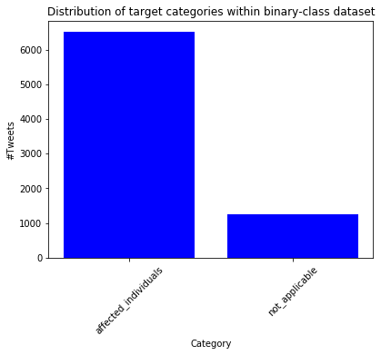
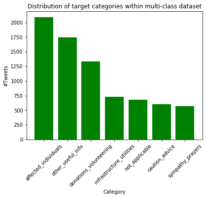
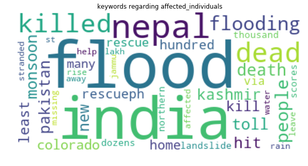
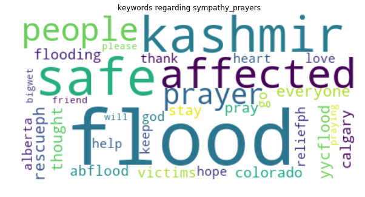
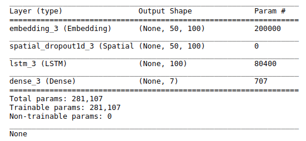

White paper
{: #wp-brand}

# FDL Europe: Analyzing social media data for disaster management

by [Conor McCarthy](#author)
{: .wp-author}


Frontier Development Lab (FDL) Europe is an applied artificial-intelligence (AI) research accelerator, in partnership with the European Space Agency (ESA) and Oxford University and leaders in commercial AI. The overall goal of the program is to solve challenges in the space-science sector using AI techniques and cutting-edge technologies.

[FDL Europe 2019](https://fdleurope.org/fdl-europe-2019) focused on three main areas of research – Atmospheric Phenomena and Climate Variability, Disaster Prevention Progress and Response, and Ground Station Pass Optimization for Constellations. This paper will focus on the second of these challenges and, more specifically, the response aspect of flood management.


## Project overview

Annually, flooding events worldwide affect on the order of 80 million people, both in the developed and developing world. Such events create huge social and logistical problems for first responders and interested parties, including both governmental and non-governmental organizations. There are limitations within these groups, associated with the ability to reliably contact affected individuals and maintain up-to-date information on the extent of flood waters. These issues in particular, pose challenges to effective resourcing and efficient response. 

The primary goal of the European research team focusing on disaster management, was to investigate the use of AI to improve the capabilities of organizations to respond to flooding using orbital imagery and social media data. The central problem tackled by the team, was the development of deep-learning algorithms to map flood extent for deployment on a [CubeSat](https://en.wikipedia.org/wiki/CubeSat) satellite. This project used a [VPU](https://en.wikipedia.org/wiki/Vision_processing_unit) microprocessor chip in the hope that a neural-network architecture could be embedded on the chip, thus allowing for on-the-edge mapping of floods on cheap satellite systems. The cost of such satellites is on the order of 100 times cheaper than a typical imaging satellite, thus allowing a larger number to be deployed for tailored purposes such as flood mapping.

Given the use of extremely specialized hardware for this task, a complementary project was designed to leverage kdb+ and the machine-learning and interface libraries. In this paper, we will examine the use of deep-learning methods to classify tweets relating to natural disasters and, more specifically, flooding events. The goal is to allow concerned parties to filter tweets and thus contact individuals based on their needs. 

This project was seen as complementary to the CubeSat project for a number of reasons. Firstly, tweets sourced from the Twitter API often contain GPS information thus providing locations for the CubeSats to focus the production flood maps. Secondly, the flood maps provided can give first responders and NGOs information about which affected areas to avoid during a flood event.

This work was completed across two distinct sections:

1.  The training of a binary classifier to discern relevant vs irrelevant tweets and following this a multi-class model in an attempt to label the tweets according to sub-classes including but not limited to:
	1.  affected individuals
	2.  infrastructural damage

2.  Creation of a multi-class model on a kdb+ tickerplant architecture to produce a framework for the live classification and querying of tweets. 

All development was done with the following software versions.

software | version
-------- | -------
kdb+     | 3.6
Python   | 3.7.0

Python modules used and associated versions are as follows.

library        | version
-------------- | -------
beautifulsoup4 | 4.5.3
keras          | 2.0.9
numpy          | 1.16.0
pickle         | 4.0
spacy          | 2.0.18
wordcloud      | 1.5.0

In addition to this, a number of kdb+ libraries and interfaces were used.

library/interface | Release
----------------- | -------
embedPy           | 1.3.2
JupyterQ          | 1.1.7
ML-Toolkit        | 0.3.2
NLP               | 0.1


## Data

The data used for this work was sourced from the [Crisis NLP](https://crisisnlp.qcri.org) datasets. This datasource contains human-annotated tweets collected from Twitter and relating directly to a wide variety of crises. These crises range from earthquakes and virus outbreaks, to typhoons and war events. The data of interest within this use case, is that relating to floods. Flood data from the following events were chosen.

1. 2012 Phillipines
2. 2013 Alberta, Canada 
3. 2013 Colorado, USA
4. 2013 Queensland, Australia
5. 2014 India
6. 2014 Pakistan

These events were chosen both due to the availability of the datasets themselves, and the geographical and socio-economic variability in those affected. In total, the dataset contains approximately 8,000 tweets. The data comes from two distinct macro datasets, which contain both the tweet text and classifications of the tweets. Following preprocessing to standardize the classes across the datasets, the following are the sub-classes used within the multi-class section of this project.

1. Affected individual
2. Sympathy and prayers
3. Infrastructure or utilities
4. Caution and advice
5. Other useful information
6. Donations and volunteering
7. Useless information


## Modelling issues in social media data

Dealing with social-media data and in particular Twitter data, poses a number of problems for producing reliable machine-learning models.

1.  The first of these issues is the [character limit of tweets](https://techcrunch.com/2018/10/30/Twitters-doubling-of-character-count-from-140-to-280-had-little-impact-on-length-of-tweets/?guccounter=1&guce_referrer_us=aHR0cHM6Ly93d3cuZ29vZ2xlLmNvbS8&guce_referrer_cs=rbvyYOiaknVKOAxueczesw). While this has been increased over the years to 280 characters, the median tweet length is 33 characters. This creates the potential for a tweet to add ‘noise’ due to the lack of a clear discernible signal, thus making it difficult to derive meaning from the tweet.

2. The ambiguity of language also poses an issue. The same phrase in different contexts can have wildly different meanings. For example, if an individual were to tweet “I just got free ice-cream and now looking forward to the theater later. How much better could my day get?” vs someone tweeting "It's been raining all day and I missed my bus. How much better could my day get?", clearly the first use of better is positive while the second is sarcastic. In each case, information about the correct interpretation is contained within the first sentence.

3. Colloquialisms and the names of locations can also pose an issue. One of the most important target categories used in this work is infrastructure and utilities. This target has a strong association with place names. For example, “Terrible to see the damage on the Hoover due with the flooding in Colorado”. For anyone aware of the Hoover Dam in Colorado, it is clear that there is likely infrastructural damage to the dam. However, a computer is likely to miss this without context.

These are just a small number of potential issues which can arise when dealing with social media data but can be rectified in the following manner.

-   Dealing with noise is handled in the preprocessing step through the removal of emojis, email links etc. The decisions made here can improve the ability to classify the data through standardizing the text, but can also remove important information if taken too far.            
-   Both the 2nd and 3rd issues are mitigated through the use of models or techniques with an understanding of the ordering of language. For example, in the the Hoover dam example, knowing that the words _damage_ and _terrible_ preceded the word _Hoover_ may indicate that there has been some infrastructural damage. The use of a model to solve this issue is presented within this paper.


## Pre-processing

To highlight the need to preprocess the data used in this paper, the following are examples of some tweets seen within the corpus

Tweet contains user handle with leading at symbol and numeric values:
```txt
rescueph @cesc_1213: please help us seek rescue for our friend!
:(Jala Vigilia, 09329166833
```

Tweet contains hashtags, times and numeric values:

```txt
river could now reach 15-metre flood peak after midnight 
(it's 11:05pm up here). 
bundaberg still the big #dangerzone#flooding
```

Tweet contains URL and emojis:

```txt
Colorado flooding could help keep tourists away 
http://t.co/vqwifb51hk Denver 🤔
```

For this work, the following steps were taken to standardize the data being presented to the model.

1. Remove all capitalization by lowering each tweet.
2. Remove full stops, commas and other common single character.
3. Replace hashtags with a space allowing individual words to be taken out of the tweet hashtags.
4. Remove emojis from the tweets.
5. Remove the `rt` tag.
6. Remove the at symbol indicating user name.

The code to achieve this in its entirety is wrapped in several helper functions within `code/fdl_disasters.q` and is executed as follows within the notebook provided.

```q
rmv_list   :("http*";"rt";"*,";"*&*";"*[0-9]*")
rmv_single :rmv_master[;",.:?!/@'";""]
rmv_hashtag:rmv_master[;"#";""]
data_m[`tweet_text]:data_b[`tweet_text]:
  (rmv_ascii rmv_custom[;rmv_list] rmv_hashtag rmv_single@)
  each data_m`tweet_text
```

Taking these changes into account, the tweets above are transformed into the following

```q
"rescueph cesc please help us seek rescue for our friend jala vigilia"

"river could now reach metre flood peak after midnight its up here 
  bundaberg still the big dangerzone flooding"

"colorado flooding could help keep tourists away denver"
```


## Data exploration

When producing a machine-learning model, it is important to understand the content of the data being used. Doing so provides us with the ability to choose and tune an appropriate model to apply. This is heavily influenced by an understanding of how the target data is distributed and what information is contained in the data itself.


### Data distribution

Firstly I looked at the distributions of the targets in the binary example:

```q
distrib_b:desc count each group data_b`target

plt[`:bar][til count distrib_b;value distrib_b;`color pykw `b];
plt[`:title][`$"Distribution of target categories within binary-class dataset"];
plt[`:xlabel][`Category];
plt[`:xticks][til count distrib_b;key distrib_b;`rotation pykw `45];
plt[`:ylabel][`$"#Tweets"];
plt[`:show][];
```



We can see from this that the dataset contains significantly more of the `affected_individuals` class. Given the dataset being used, this is unsurprising as every effort has been made to make the dataset as relevant as possible by the collators of this dataset.

Looking at the multi-class example, we can see how the dataset as a whole breaks down into categories. The code to achieve this is similar to that above and thus not displayed again.



As with the binary case, there are a number of classes that are more prominent within the data, such as affected individuals and donations/volunteering. Some classes are seen less often, such as sympathy and prayers. As such it may be expected that the models produced will be more likely to correctly classify tweets surrounding donations than those relating to prayers. 


### Word cloud

Similar to the data-distribution case, it is possible to gain some insights into the content of the dataset by looking at commonly occurring words within the classes. This was achieved here through the use of the wordcloud library in Python. The code to achieve this was wrapped in the function `wordcloud`, which functionally is as follows

```q
args:`background_color`collocations`min_font_size`max_font_size
vals:(`white;0b;10;90)

wordcloudfn:{
  cloud:z[`:generate]raze(?[x;enlist(=;`target;enlist y);();`tweet_text]),'" ";
  plt[`:figure][`figsize pykw (10;20)];
  plt[`:title]["keywords regarding ", string y];
  plt[`:imshow][cloud;`interpolation pykw `bilinear];
  plt[`:axis]["off"];
  plt[`:show][];}[;;wcloud[pykwargs args!vals]]
```

Execution of this code is completed as follows.

```q
q)wordcloudfn[data_m;`affected_individuals]
```

This produces the following output.



In the above example, surrounding the affected individuals class, it is clear that tweets in this category contain some distinguishing characteristics. For example, words such as death, killed, missing and rescue all are associated with people who have had their lives disrupted by flooding. Meanwhile words contained in the sympathy and prayers class, use language strongly relating to religion as seen below.

  

This indicates that while words such as _flood_ and _kashmir_ are prominent in tweets associated with each class, there are words that seem to be indicative of the base class of the tweets themselves.


### Sentiment analysis

The final step in the data-exploration phase was to look at the positive and negative sentiment of tweets within the corpus. This was achieved using functionality within the NLP library released by Kx. The code for it is as follows.

```q
q)sentiment:.nlp.sentiment each data_m`tweet_text

q)// Positive tweets
q)3?100#data_m[`tweet_text] idesc sentiment`compound
"request to all Twitter friends pray and help the flood victims of pak..
"joydas please use kashmir flood hashtag only if u need help or offeri..
"south ab flood relief fund supports local charities that help those i..

q)// Negative tweets
q)3?100#data_m[`tweet_text] iasc  sentiment`compound
"news update floods kill in eastern india new delhi - flooding in east..
"in qlds criminal code stealing by looting subs carries a max penalty ..
"at least dead in colo flooding severe flooding in jamestown in colora..
```

This allows us to gain insights into the state of mind of individuals who are tweeting and an understanding of some of the characteristics that may be associated with individual classes. For example, the positive tweets above both offer the sympathy and donations, whereas the negative tweets talk about the death of individuals and criminal activity. This could have a bearing on how tweets are classified, based on the absence or presence of specific words or phrases.


## Model

The model that was applied to both the binary- and multi-classification problems, is a Long Short-Term Memory (LSTM) model. This type of deep-learning architecture is a form of recurrent neural network (RNN). Its use stems from the need to gain an understanding of the ordering of words within the tweets, in order for context to be derived. 

To gain this understanding, the model uses a structure known as a memory cell to regulate weights/gradients within the system. Commonly RNNs suffer issues with [exploding](https://machinelearningmastery.com/exploding-gradients-in-neural-networks/) or [vanishing](https://towardsdatascience.com/the-vanishing-gradient-problem-69bf08b15484) gradients during back propagation but these are mitigated through the memory structure of the model.

The following is a pictorial representation of an LSTM cell, with the purpose of each gate outlined.

 

gate   | function
-------|------------
input  | Controls how new information flows into the cell
forget | Controls how long a value from the input gate stays in the cell (memory)
output | Controls how the cell value is used to compute the activation of an LSTM unit


### Model structure

Producing an LSTM model was done in [embedPy](../../interfaces/embedpy.md) using Keras. The following is the model used for the multi-class use case in this paper,

```q
// Define python functionality to produce the model
kl:{.p.import[`keras.layers]x}
seq    :.p.import[`keras.models]`:Sequential
dense  :kl`:Dense
embed  :kl`:Embedding
lstm   :kl`:LSTM
spdrop1:kl`:SpatialDropout1D
dropout:kl`:Dropout

// Create the model to be fit
mdl_m:seq[]
mdl_m[`:add][embed[2000;100;`input_length pykw (.ml.shape X)1]]
mdl_m[`:add]spdrop1[0.1]
mdl_m[`:add]lstm[100;pykwargs `dropout`recurrent_dropout!(0.1;0.1)]
mdl_m[`:add]dense[7;`activation pykw `sigmoid]
mdl_m[`:compile][pykwargs `loss`optimizer`metrics!
  (`categorical_crossentropy;`adam;enlist `accuracy)]

print mdl_m[`:summary][]
```

The summary of this model is as follows:



A few points of note on this model:

-   A number of forms of dropout were used to prevent model overfitting.
-   The dense layer contained seven nodes, one associated with each of the output classes in the multi-class example.
-   The number of LSTM units chosen was 100, these are 100 individual layers with independent weights.
-   The loss function used is categorical cross-entropy, this accounts for the target being categorical and non-binary.


### Model data preparation

Prior to fitting this model, a number of steps were taken to manipulate the data, such that it could be ‘understood’ by the LSTM and scored correctly.

Due to how computers handle information, data cannot be passed to the model as strings or symbols. Instead, it must be encoded numerically. This can be achieved through a number of methods, including tokenization and one-hot encoding, both of which were used here.

Tokenization in Natural Language Processing is the splitting of data into distinct pieces known as tokens. These tokens provide natural points of distinction between words within the corpus and thus allow the text to be converted into numerical sequences. 

This conversion was completed as follows using Keras text processing tools on the tweets:

```q
// Python text processing utilities
token:.p.import[`keras.preprocessing.text]`:Tokenizer
pad  :.p.import[`keras.preprocessing.sequence]`:pad_sequences

// Set the maximum number of important words in the dataset
max_nb_words:2000
// Set the maximum allowable length of a tweet (in words)
max_seq_len :50

// Convert the data to a numpy array
tweet_vals :npa data_b`tweet_text

// Set up and fit the tokenizer to create 
// the numerical sequence of important words
tokenizer:token[`num_words pykw max_nb_words;`lower pykw 1b]
tokenizer[`:fit_on_texts]tweet_vals;

// Convert the individual tweets into numerical sequences
X:tokenizer[`:texts_to_sequences]tweet_vals
```

Finally, once the data has been converted into numerical sequences, it is ‘padded’ such that the input length of each of the tweets is the same. This ensures that the neural network is passed consistent lengths of data. Padding refers to the addition of leading zeros to the numeric representation of the tweets, such that each is a list of 50 integers. 

The display of the tweets below is truncated to ensure the final non-zero values can be seen. It is representative of a subset of the data that was used in this paper.

```q
q)X:pad[X;`maxlen pykw max_seq_len]`
// display the integer representation of the tweets
q)5#(30_)each X
0 0   0   0  0   0   0   0    0    0    0    0    0    732 12   1    ..
0 0   0   0  0   649 2   90   158  520  308  252  1    57  501  1357 ..
0 0   0   0  0   0   0   0    0    0    0    158  380  12  50   201  ..
0 0   0   0  0   0   0   0    0    0    0    0    0    0   0    732  ..
0 0   0   0  216 6   233 63   3    116  1    141  99   195 68   138  ..
```

As mentioned above, one-hot encoding can also be used to create a mapping between text and numbers. As the target categories themselves are symbols, these must also be encoded. This was done using a utility function contained within the [machine-learning toolkit](https://github.com/kxsystems/ml).

```q
q)show y:data_m`target
`sympathy_prayers`other_useful_info`other_useful_info`other_useful_in..
q)5#Y_m:flip value ohe_m:.ml.i.onehot1 data_m`target
0 0 0 0 0 0 1
0 0 0 0 0 1 0
0 0 0 0 0 1 0
0 0 0 0 0 1 0
0 0 0 0 0 0 1
```


### Model fitting

Once the categorical and textual data had been converted into a numerical representation, it was split into a training and testing set. This is done in order to maintain separation of the data, such that results could be judged fairly. This was completed as follows:

```q
// train-test split binary data
tts_b:.ml.traintestsplit[X;Y_b;0.1]
xtrn_b:tts_b`xtrain;ytrn_b:tts_b`ytrain
xtst_b:tts_b`xtest;ytst_b:tts_b`ytest

// train-test split multi-class data
tts_m:.ml.traintestsplit[X;Y_m;0.1]
xtrn_m:tts_m`xtrain;ytrn_m:tts_m`ytrain
xtst_m:tts_m`xtest;ytst_m:tts_m`ytest
```

With the data split, both the binary and multi-class models can be fit such that new tweets can be classified and the results scored.
```q
// Fit binary model on transformed binary datasets
mdl_b[`:fit][npa xtrn_b;npa ytrn_b;`epochs pykw epochs;`verbose pykw 0]

// Fit multi-class model on transformed multi-class data
mdl_m[`:fit][npa xtrn_m;npa ytrn_m;`epochs pykw epochs;`verbose pykw 0]
```


## Results

Once the models had been fit on the training set the results could be scored on the held out test set, the scoring was done in a number of parts:

1.  Percentage of correct predictions vs misses per class.
2.  Confusion matrix for predicted vs actual class.
3.  Classification report outlining precision and recall and f1-score for each class.

This functionality is wrapped in a function `class_scoring` in the `code/fdl_disasters.q` script

```q
// Binary classification prediction and scoring
q)class_scoring[xtst_b;ytst_b;mdl_b;ohe_b]
The following is the integer mapping between class integer representation 
and real class value:

affected_individuals| 0
not_applicable      | 1

Actual Class vs prediction

Class Prediction Hit
--------------------
0     0          1  
0     0          1  
1     1          1  
0     0          1  
0     0          1  

Displaying percentage of Correct prediction vs misses per class:

Class| Hit       Miss      
-----| --------------------
0    | 0.9550225 0.04497751
1    | 0.6111111 0.3888889 
TOTAL| 0.9070968 0.09290323

Displaying predicted vs actual class assignment matrix:

Class| Pred_0 Pred_1
-----| -------------
0    | 637    30    
1    | 42     66    

Classification report showing precision, recall and f1-score for each class:

class               | precision recall    f1_score  support
--------------------| -------------------------------------
affected_individuals| 0.9381443 0.9550225 0.9465082 667    
not_applicable      | 0.6875    0.6111111 0.6470588 108    
avg/total           | 0.8128222 0.7830668 0.7967835 775    
```

In the case of the binary classifier, accuracies in the region of 91% show that the model was capable of discerning between relevant and irrelevant tweets. More informative, however, is the recall on the affected individuals class, which was 95%. As such, we are only missing 5% of the total true positives of affected individuals. In this case, recall is the most important characteristic for model performance.

```q
// Multi-class prediction and scoring
q)class_scoring[xtst_m;ytst_m;mdl_m;ohe_m]
The following is the integer mapping between class integer representation 
and real class value:

affected_individuals    | 0
caution_advice          | 1
donations_volunteering  | 2
infrastructure_utilities| 3
not_applicable          | 4
other_useful_info       | 5
sympathy_prayers        | 6

Actual Class vs prediction

Class Prediction Hit
--------------------
0     0          1  
2     2          1  
2     0          0  
4     4          1  
5     3          0  

Displaying percentage of Correct prediction vs misses per class:

Class| Hit       Miss     
-----| -------------------
0    | 0.8831776 0.1168224
1    | 0.5625    0.4375   
2    | 0.7424242 0.2575758
3    | 0.4756098 0.5243902
4    | 0.7068966 0.2931034
5    | 0.5906433 0.4093567
6    | 0.6666667 0.3333333
TOTAL| 0.6967742 0.3032258

Displaying predicted vs actual class assignment matrix:

Class| Pred_0 Pred_1 Pred_2 Pred_3 Pred_4 Pred_5 Pred_6
-----| ------------------------------------------------
0    | 189    3      6      3      1      6      6     
1    | 3      36     4      4      0      15     2     
2    | 10     3      98     1      4      12     4     
3    | 7      5      7      39     1      22     1     
4    | 1      2      0      0      41     10     4     
5    | 20     16     14     11     3      101    6     
6    | 4      2      4      0      1      7      36    

Classification report showing precision, recall and f1-score for each class:

class                   | precision recall    f1_score  support
------------------------| -------------------------------------
affected_individuals    | 0.8076923 0.8831776 0.84375   214    
caution_advice          | 0.5373134 0.5625    0.5496183 64     
donations_volunteering  | 0.7368421 0.7424242 0.7396226 132    
infrastructure_utilities| 0.6724138 0.4756098 0.5571429 82     
not_applicable          | 0.8039216 0.7068966 0.7522936 58     
other_useful_info       | 0.583815  0.5906433 0.5872093 171    
sympathy_prayers        | 0.6101695 0.6666667 0.6371681 54     
avg/total               | 0.6788811 0.6611312 0.6666864 775    
```

The multi-class example also appears to be working well, with overall accuracy of ~70%. In the most important category (affected individuals), recall was ~88%. The most common misclassification was the classification of ‘infrastructure/utilities’ damage as ‘other useful information’, which is a reasonable miscategorization as outlined below in _Conclusions_.


## Live system

As outlined in the _Results_ section above, given the scores produced for the categorization of multi-class tweets, the production of a model was broadly successful. The _Conclusions_ section below outlines the limiting factors that affect the ability to produce a better model. However, the results are sufficient to move onto producing a framework, which could be used for the live classification of tweets.

The first step was the saving of the tokenizer and model, which were to be applied to the data as it is fed through the system. This can be seen within the notebook in the following commands

```q
// python script which uses pickle to save tokenizer
\l ../code/token_save.p
sv_tok:.p.get[`save_token]
sv_tok[tokenizer];

// save model as a h5 file
mdl_m[`:save]["../live/multiclass_mdl.h5"]
```

Given limited availability to data, data from the notebook was used to produce the ‘live’ system. 

The outline for this system is based heavily on the ‘vanilla’ [kdb tickerplant architecture](https://github.com/KxSystems/kdb-tick).

The first step to run the system is to initialize the tickerplant. Here the port is being automatically set to `\`, any other port assignment would be overwritten.

```bash
$ q tick.q sym ./log/

For the purposes of this example -p must be set to 5140, 
setting port accordingly

q)
```

Once the tickerplant is listening for messages from the feed handler, we can start to look at how this feed was produced. The code sections of note within this are the following.

```q
// Open a connection to the tickerplant
h:neg hopen`:localhost:5140

// Classes
c:`affected_individuals`caution_advice`donations_volunteering`sympathy_prayers
c,:`other_useful_info`infrastructure_utilities`useless_info
// Create a dictionary showing rolling number of tweets per class
processed_data:c!count[c]#0

// Function to update the appropriate tables on the tickerplant 
// update the number of values classified in each class
upd_vals:{(h(".u.upd";x;y);processed_data[x]+:1)}

// time-sensitive data feed 
.z.ts:{[c]
  if[(0=n mod 50)and n>1;
     -1"\nThe following are the number of tweets in each class for ",
       string[n]," processed tweets";
     show processed_data];
  clean_tweet:
    (rmv_ascii rmv_custom[;rmv_list] rmv_emoji rmv_hashtag rmv_single@) 
    tweets[n];
  X:pad[tokenizer[`:texts_to_sequences]enlist clean_tweet;`maxlen pykw 50];
  pred:key[ohe]raze{where x=max x}(svd_mdl[`:predict][X]`)0;
  pkg:(.z.N;pred[0];clean_tweet);
  upd_vals[;pkg] {$[x in c; x; last c]}first pred;
  n+:1; }[c]
```

Looking closely at the feed function above, it is clear that this is generally following the data pipeline used within the notebook.

1.  Tweets are purged of ASCII characters, emojis, special characters and hashtags.
2.  The tweets are tokenized and padded to an appropriate length.
3.  The trained model is used to predict the class of the tweet.

The divergence comes once tweets have been classified. At this point, the table appropriate for the class is updated using the `upd_vals` function. The classification time, the class label and the cleaned tweet are inserted into the appropriate tables.

The feed is started, at which point the required libraries are loaded into the feed process.

```q
$q feed.q
Loading utils.q
Loading regex.q
Loading sent.q
Loading parser.q
Loading time.q
...
// set system to publish a message every 100ms
q)\t 100
```

At this point, an RDB can be set up to allow a user to query the tables associated with each class. For the sake of simplicity, the RDB in this example is subscribed to all the tables. However, this could be modified based on use case.

```q
$q tick/r.q -p 5011
q)caution_advice
time                 sym            tweet                                    ..
-----------------------------------------------------------------------------..
0D13:19:27.402944000 caution_advice "abcnews follow our live blog for the lat..
0D13:19:28.898058000 caution_advice "davidcurnowabc toowoomba not spared wind..
0D13:19:31.498798000 caution_advice "acpmh check out beyondblue looking after..
0D13:19:33.797604000 caution_advice "ancalerts pagasa advisory red warning fo..
0D13:19:34.798857000 caution_advice "flood warning for the dawson and fitzroy..

q)donations_volunteering
time                 sym                    tweet                            ..
-----------------------------------------------------------------------------..
0D13:19:27.300326000 donations_volunteering "rancyamor annecurtissmith please..
0D13:19:27.601642000 donations_volunteering "arvindkejriwal all aap mlas to d..
0D13:19:28.198921000 donations_volunteering "truevirathindu manmohan singh so..
0D13:19:29.001481000 donations_volunteering "bpincott collecting donations in..
0D13:19:30.297868000 donations_volunteering "vailresorts vail resorts gives p..
```


## Conclusions

In conclusion, it is clear from the results above that the use of an LSTM architecture to create a classifier for tweet content was broadly successful. 

A number of limiting factors hamper the ability to create a better model with the data available. These are as follows:

1.  The dataset used was limited in size with only 7,800 classified tweets readily available. Given the ‘noisy’ nature of tweets this creates difficulties around producing a reliable model. A larger corpus would likely have produced a better representation of the language used in flooding scenarios and thus allow a better model to be produced.

2.  The human-annotated data can be unreliable. While the data was collected and tagged by CrisisNLP, given the similarity of some of the classes, it may be the case that mistakes being made by the model are accurate representation of the true class. This is certainly true in the case of the data from India and Pakistan, where a reference for the quality of the classifications is provided in the raw dataset.

3.  Decisions regarding information to remove from the dataset can have an impact. The inclusion of hashtags or the removal of user handles or `rt` tags, can impact the model’s ability to derive context from the tweets. For example, a search of this parameter space showed that the removal of user names had a negative effect. This is likely a result of tweets from news organizations, which are prevalent and are more likely to relate to a small number of classes. For example, infrastructure/utilities and caution/advice.

The production of a framework to ‘live’ score data was also outlined. As mentioned when discussing the limits in model performance, there are also a number of limiting factors with this live system. The processing and classification time for an individual tweet limits the throughput of the system to approximately 40 messages per second. In order to scale this system to a larger dataset with higher throughput requirements, a more complex infrastructure or simplified machine learning pipeline would be required.

However, this system shows the potential for the use of kdb+ in the sphere of machine learning when applied to natural language processing tasks.


## Author

**Conor McCarthy** joined First Derivatives in March 2018 as a Data Scientist in the Capital Markets Training Program and currently works as a machine learning engineer and interfaces architect in London. 


## Code

The code presented in this paper is available on GitHub.

:fontawesome-brands-github:
[kxcontrib/fdl_europe_2019](https://github.com/kxcontrib/fdl_europe_2019)


## Acknowledgements

I gratefully acknowledge the help of all those at FDL Europe for their support and guidance in this project and my colleagues on the Kx Machine Learning team for their help vetting technical aspects of this paper.
