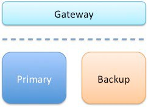
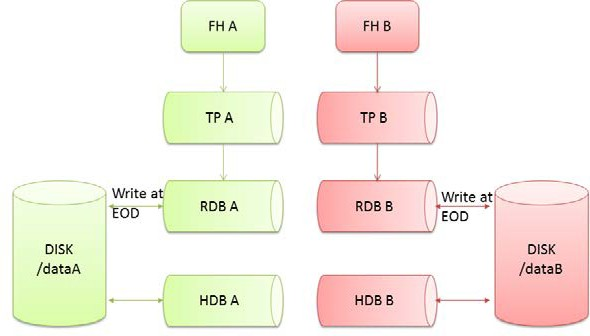

White paper
{: #wp-brand}

# Disaster-recovery planning for kdb+ tick systems

by [Stewart Robinson](#author)
{: .wp-author}


Disasters are inevitable; hardware failure, network problems, and data
corruption are all events that could play havoc with a system. If
these events are not fully understood and planned for they may lead to
significant downtime and potentially severe business impact, including
revenue loss, legal and financial implications, and impact to business
reputation and brand. Recent high-profile systems failures of a large
cloud computing provider and an international airline highlight the
importance for IT systems to have a comprehensive disaster recovery
plan in place.

This white paper discusses disaster recovery (DR) and failover concepts
from the perspective of the gateway layer accessing a typical kdb+
tick system used in capital-markets applications. The end goal of
constructing this plan is to ensure high availability of the
application via the gateway where possible, considering all
conceivable failure scenarios and outlining any actions required to
prevent data loss, minimize any downtime and keep the application
accessible.



As part of business-continuity and DR planning, the RTO, or Recovery
Time Objective, is the maximum target time set for recovery of the
systems after a disaster has
struck. How quickly the system needs to recover can dictate the type
of preparations required and determine the overall budget you should
assign to business continuity. If for example, the RTO is three hours,
meaning your business can only survive with systems down for this
amount of time, then you will need to ensure a high level of
preparation and a higher budget to ensure that systems can be
recovered quickly. On the other hand, if the RTO is two weeks, then
you can probably budget less and invest in less advanced solutions.

The RPO, or Recovery Point Objective, is the maximum targeted period
in which data might be lost from the system due to a major incident.
Alternatively, the RPO is the maximum tolerable period in which data
might be lost from a critical IT service or system.

A disaster recovery plan is usually based on requirements from both
the RTO and RPO specifications which can guide the design of a
cost-effective solution. However, every system has its own unique
requirements and challenges; therefore, this paper does not propose a
“one-size-fits-all” approach. Rather, it suggests the best practice
methods for dealing with the various possible failures one needs to be
aware of and plan for when building a kdb+ tick-based system. This
paper does not deal with many failure conditions of a kdb+ system
outside of the ticker plant model used in capital markets.

Kdb+ tick is an architecture which allows the capturing, processing
and querying of data in real time and historically. It typically
consists of:

Feedhandler/s 

: a process used to capture external data and translate it into kdb+

Tickerplant

: a specialized kdb+ process that operates as a link
between the client’s data feed and a number of subscribers. It
receives data from the feedhandler, appends a time stamp to it and
saves it to a log file. It publishes this data to a real-time
database and any clients which have subscribed to it and then purges
its tables of data. In this way, the tickerplant uses very little
memory, whilst a full record of intra-day data is maintained in the
real-time database.

Real-time Database (RDB)

: holds all the intra-day data in memory to allow for fast, powerful queries.


Historical Database (HDB)

: consists of on-disk kdb+ data, typically
split into date partitions. A q process can read this data and
memory-map it, allowing for fast queries across a large volume of
data. The RDB is instructed to save its data to the HDB at EOD (end of day).

:fontawesome-regular-hand-point-right: White paper:
[Data Recovery for kdb+ tick](../data-recovery.md)


## What does a kdb+ database look like on disk?

Before we consider creating a disaster-recovery plan, we first must
understand the layout of a typical kdb+ database on-disk. Kdb+
databases are stored as a series of files and directories on disk.
This makes handling databases extremely easy because database files
can be manipulated as operating system files. Backing up a kdb+
database can therefore be implemented by using any standard file-system 
backup utility. This is a key difference from traditional
databases, which have their own backup utilities and do not allow
direct access to the database files.

Kdb+’s use of the native file system is also reflected in the way it
uses standard operating-system features for accessing data
(memory-mapped files), whereas traditional databases use proprietary
techniques in an effort to speed up the reading and writing processes.
The typical kdb+ database layout for a tick-based system is
partitioned by date, although integer partitioning is also possible.
Below is an example of an on-disk layout with date partitions as
represented using the Linux program `tree`.


The example above displays the various file-system entities which
constitute a kdb+ database. Highlighted in bold are directories, which
can be either a partition or a splayed table directory. The splayed
table directories contain individual column files and a kdb+ `.d` file
which contains the column ordering. A file called `sym` also exists
at the top level and is used for enumerations of table columns of
symbol type.

Splayed or flat tables can also exist in the database at the top level
but are excluded here for simplicity.

The standard approach to saving data to an on-disk database (HDB) is
to use the `.Q.dpft` utility, usually from an in-memory real-time
database via an end-of-day write-down function (see `.u.end` in
`r.q`). This utility creates the files and directories as laid out in
the table above, along with applying a _parted_ attribute to the
specified column.

```q
.Q.dpft[`:/kx/hdb;2017.01.01;`sym;`trade]
```

However, the constituent parts of the utility can be run individually
and used to construct or amend a database. The basic steps are:

1.  Enumerate the table to be saved against the sym file (`.Q.en`)

    <pre><code class="language-q">
    .Q.en[`:/kx/hdb] trade
    </code></pre>

2.  Save enumerated table splayed to date partition. Parent directories
    are created by set if they do not yet exist.

    <pre><code class="language-q">
    \`:/kx/hdb/2017.01.01/trade/ set .Q.en[\`:/kx/hdb] trade
    </code></pre>

Note that as part of setting a splayed table, the column `.d` file is
automatically written by kdb+. After these steps, the database can now
be loaded into q via a simple `\l` command.

These step-by-step methods can become useful for fixing issues that
may occur on specific files or date partitions. For example, if we
need to reorder our table columns, or we have a schema change, then the `.d`
file can be overwritten with a simple `set`.

```q
`:/kx/hdb/2017.01.01/trade/.d set `time`sym`price`size`side`ex
```

The [`dbmaint.q` script](https://github.com/KxSystems/kdb/blob/master/utils/dbmaint.md))
provides some useful utilities for editing and maintaining a
historical database (HDB). Generally, these functions are safer and
should be used in place of the raw commands for any database
amendments.

In the event that a database needs to be restored to the latest backup
version, it is as simple as restoring the file-system entities from
the backup location and reloading any HDB processes via the load
command.

```q
system "l ."
```


## What is failover?

> Failover is the capability to switch over to a redundant or standby
server, system or network upon the failure or termination of an
existing asset. Failover should happen without any kind of human
intervention or warning.
— [_Computer Weekly_](https://www.computerweekly.com/feature/Idea-lab)

In a kdb+ tick setup, failover can be designed and configured at a
whole system level or at a process-by- process level. Generally, if a
critical process goes down and does not restart then the entire system
will failover to a mirrored secondary or backup system. However, if a
non-critical process goes down and does not restart then it may be
judged unnecessary to failover the entire system to the secondary
server. The mirrored process on the secondary server may be able to
take over from the failed process.

Alternatively, in the case where there are multiple processes in a
group (e.g. HDBs) on the primary side for load balancing reasons all
accessing the same data, then the remaining processes within the group
will simply pick up the slack after the failure and no switching would
be required. However, the issue of failure must be investigated and
fixed to restore full functionality of the system.

In all the various combinations of failover operations that can be
designed, the end goal is always to maintain availability of the
application and minimize any disruption to the business.


## What does hot-hot mean?

In a production environment, some level of redundancy is always
required. Depending on the use case, requirements may vary but in
nearly all instances requiring high availability, the best option is
to have a hot-hot (or ‘active-active’) configuration.

_Hot-hot_ is the term for an identical
mirrored secondary system running, separate to the primary system,
capturing and storing data but also serving client queries.
In a system with a secondary server available, hot-hot is the typical
configuration as it is sensible to use all available hardware to
maximize operational performance.

Alternative configurations include:

Hot-warm 

: The secondary system captures data but does not serve queries


Hot-cold 

: The secondary system has a complete backup or copy
  of the primary system at some previous point in time (recall that
  kdb+ databases are just a series of operating system files and
  directories) with no live processes running. A failover in this
  scenario involves restoring from this latest backup, with the
  understanding that there may be some data loss between the time of
  failover to the time the latest backup was made.

Pilot light (or cold hot-warm) 

: The secondary is on standby
  and the entire system can quickly be started to allow recovery in a
  shorter time period than a hot-cold configuration.

Typically kdb+ is deployed in a high-value system; hence, downtime can
impact business, which justifies the hot-hot setup to ensure high
availability.

Usually, the secondary will run on completely separate infrastructure,
with a separate file system, and
save the data to a secondary database directory, separate from the
primary. In this way, if the primary system or underlying
infrastructure goes offline, the secondary would be able to take over
completely.

The following diagram shows the basic kdb+ tick components, with the
primary (A) processes in green and the secondary (B) processes in red.
In addition to the standard tick processes shown below, there could be
a combination of gateways, Complex Event Processor engines (CEPs) or
query router processes. These generally provide various methods to
carefully manage any querying of the database.



:fontawesome-regular-hand-point-right: White paper –
[Query Routing: a kdb+ framework for a scalable load-balanced system](../query-routing/index.md)

As mentioned above, the usual strategy for failover is to have a
complete mirror of the production system (feedhandler, tickerplant,
and real-time subscriber), and when any critical process goes down,
the secondary is able to take over. Switching from production to
disaster recovery systems can be implemented seamlessly using kdb+
[interprocess communication](../../basics/ipc.md) (via `.z.pc`).

An alternative method is to have a parent control process monitoring
everything within the system with heart-beating: a simple message sent
from the control process to another asking _Are you alive?_ In the
event that a process is unreachable, the parent control process
signals failover of the whole system to the secondary. This is
obviously more complex than using `.z.pc` between system processes to
trigger the failover, but the advantage is that the whole system can
be controlled from a single process pair (primary and secondary).

While there are other ways to provide additional backup, there is
generally no real alternative to having a parallel collection system
for a high-availability kdb+ tick solution.

In designing the disaster-recovery plan, all possible failure events
should be identified, assessed in terms of overall risk, impact and
likelihood of occurrence, and planned for. The following section
considers the options available for the various kdb+ tick system
components within this simplified architecture.


## What to do when…


### …a real-time database goes down

It is important to design the system so it is resilient and
fault-tolerant, including adequately specifying the memory
requirements for the RDB and the system as a whole. Considerations for
determining these requirements include the peak message rate, expected
daily data volumes, schema width, query load and complexity and many
others.

If a real-time database does go down, then it is usual practice to
trigger a failover to the secondary RDB, such that the gateway will
only route queries to the secondary RDB while the primary is offline
or recovering. Failover can be signaled via `.z.pc`. Usually, the
handles to the secondary RDB are opened prior to any failover
occurring, and it is simply a case of pointing the query to the
secondary RDB handle, in place of the primary RDB handle. In larger
applications, an application delivery controller (ADC) is often used
to control the routing of queries between the application and the
client. It is up to the system architect to decide if the secondary
RDB should continue to serve queries when the primary is available
again, or revert to using the primary RDB again.

A failback process includes data recovery of any data loss during the
downtime and restoring the operations back to a pre-failed over state,
i.e. primary and secondary systems are running and available.
Generally, it is recommended that fail-back to the primary be
scheduled during a downtime window. This is to ensure sufficient time
to validate that data is synchronized, functional and that processing
is fully restored at the primary system. There are some applications
where you may not have maintenance or downtime windows available for
fail-back. If this is the case the restoration of the primary must
occur in parallel with normal operations on the secondary system and
the data synchronization, reconciliation and fail-back processes
automated.

To recover the primary RDB it should be restarted either manually, or
using system tools, but it will have lost all the intra-day data
published by the tickerplant so far for the day. To recover this
intra-day data and regain a subscription to the data feed on restart,
the RDB sends a subscription request to the tickerplant which returns
a message containing the location of the log file and the number of
lines to read. The RDB replays the number of lines specified from the
log file, storing the results in memory. In this way, the RDB has
recovered all tickerplant data up to the line number received at the
start of replay. If required to recover other non-tick data, recovery
steps should be built into the initial state function, which would run
during the start-up of the RDB and with this data being loaded from
the specified source.

The restarted RDB receives all subsequent updates from the
tickerplant. If updates arrive whilst the RDB is reading from the log
file, they are buffered in the TCP/IP buffer. If the log file is large
enough, then the replay may take enough time that the buffers fill. In
this case, the messages are kept in the main tickerplant process
memory (this can be seen in `.z.W` in the TP).

Replaying the log can potentially take several minutes or more,
depending on the size of the tickerplant log file, therefore the
gateway queries should continue to be routed to the secondary until
recovery and failover are complete, and the primary RDB is available
to capture data and serve queries again.

:fontawesome-regular-hand-point-right: White paper 
[Data recovery for kdb+tick](../data-recovery.md)
for a complete understanding of the recovery from a tickerplant log
file, including how to deal with a corrupted log file


### …a historical database fails to load

Some well-developed kdb+ systems survived many market events which
brought other systems to their knees, however, it is possible that an
HDB may become unreachable, but through proper database maintenance,
access rights, correct dimensioning and recovery procedures, users can
avoid incapacitating an HDB. HDB process failures and `wsfull` errors
are usually an indication that a process has been incorrectly
dimensioned, or access control has not been applied.

If an HDB fails to load, there could be various underlying causes
(corrupted partition, corrupted sym file, spurious file in the HDB
directory, read/write access), but the most usual case is a corrupted
partition. This could potentially be due to an error in the end-of-day
write from the RDB.

If the HDB is serving queries to the gateway similar to those
described in the preceding section, then it would be recommended to
route future queries to the secondary HDB. This could be signaled via
error handling in the end-of-day function when the re-load of the HDB
following write down fails.

To restore functionality of the HDB, due to the complexity and variety
of potential issues, it is not recommended to automate any editing
onto database partitions. However, auto detection of many bad states
of an HDB is possible and desirable in a lot of cases and this can
guide any necessary manual intervention to fix the issue.

Some common issues along with possible fixes:


#### A missing table from a partition

This is fixed using either `.Q.chk`
to save empty copies of all tables or `.Q.bv` to create in-memory
mapping of missing tables. This may arise due to a lack of data
having been received for this date, and the end-of-day write
function therefore skips this save. Unless `.Q.bv` is in use within
HDB processes then the end-of-day write function should save empty
tables as well as those containing data, either directly, or via
`.Q.chk`.


#### Schema changes

These can cause issues if not implemented correctly. Often
this could be missing files in older partitions for the new fields.
This can be resolved by saving a file of null values of the same
type and the same length as the other fields for that date. The `.d`
file should be updated also. `fixtable` from dbmaint can be used to
save these empty columns, but a manual example is given below:

```q
/hdb
/set a list of null floats as newcol in trade table for an older partition 
`:./2016.12.01/trade/newcol set count[get `:./2016.12.01/trade/sym]#0nf 
/update .d file in old date partition
`:./2016.12.01/trade/.d set cols trade
```


#### A length error 

This is usually due to a column vector being a different
length from the rest of the table. The only method to fix it is to
count each column file and compare, then manually saving the
erroneous one to the correct length. This can occur when not using
the standard save commands (.e.g `.Q.dpft`), but rather setting each
column individually, and some logic has caused the column lengths to
vary.


### …the tickerplant fails

In an adequately specified 64-bit system, one tickerplant is usually
enough to capture all the data from a feed. A kdb+ process is able to
process and store up to 4.5 million streaming records per second per
core and up to 10 million if batching. If the throughput is expected
to exceed these figures then additional tickerplants or cores may be
required.

It is very unusual that a tickerplant process would fail on its own,
as it is limited to certain specialized tasks; though if incorrectly
configured it may fail. If a tickerplant does go down and fails to
restart, then there will likely be significant data loss on the
primary system. If the tickerplant is capturing high volumes of market
data, even being down for a few seconds could lead to hundreds of
thousands of missed rows of data.

Failure in a multiple tickerplant environment can be treated in
several different ways, depending on the application and failure type.
One possibility is to switch the entire system to the secondary
system. This is the standard approach taken in most applications. The
easiest way of failing over in this way is to shut down the primary
processes, causing all further queries to route to the secondary.
Then, during a scheduled downtime period, the underlying cause of the
failure can be investigated and addressed.

Alternatively, in some more complex systems, it may be preferable to
only failover individual processes or a selection of relevant
processes instead of the entire system. In this scenario, if the
tickerplant dies, this could trigger a failover of the subscriber to
the secondary process. The subscriber isn’t lost and could reconnect
to the secondary TP, allowing seamless transition. Clients that have
subscribed to the tickerplant will receive a closed connection
callback to `.z.pc`. They could then use this to seamlessly switch over
to the secondary. Depending on the time taken to switch and connect to
the secondary tickerplant, there may be some data loss. However, the
primary and secondary systems are usually in separate data centers,
therefore this procedure would force data to be considered in large
volumes between sites. Hence, this option needs to be carefully
considered against the specific architecture of the system.

Following failover of the system or subscribers, due to the data loss
or risk thereof, it is necessary to reconcile the data between the
primary and secondary databases. Refer to the following section on
data reconciliation for further details.

As mentioned previously, during replay of a large tickerplant log
file, pending messages will sit in the IPC queue waiting until the
subscriber (RDB) has completed the replay. If however, the log file is
sufficiently large that the IPC buffer fills with pending messages,
then the overflow can bloat the TP memory. In the financial world,
this can be the case late in the trading day when the log files are
nearly at the maximum size, so restarting an RDB just before market
close is the worst scenario. Unless protected from slow subscribers,
the tickerplant memory footprint may, in extreme circumstances, grow
to an unmanageable level, resulting in a `wsfull` error. Therefore,
aside from suitable dimensioning of the TP host machine for RDB
restarts, the tickerplant log files should reside on high-performance,
dedicated drives with no contention from other processes. This ensures
the RDBs will have shortest recovery time, and therefore reduce the
risk of `wsfull` failures on the tickerplant.

In some implementations intra-day write-down solutions are used to
limit the size of these tickerplant log files to less than a whole day
to limit the recovery time of any replaying of these logs. Other
implementations have a ring-fenced instance for write-downs often
termed PDB (persisting database) or WDB (write database).


### …the hardware fails

Infrastructure should be designed and implemented with no single
points of failure at the primary and disaster recovery facilities.
Even with these precautions, hardware failures do happen. To help
recover from a hardware failure or reduce its impact, we recommend
that a system have multiple copies of data running on different
infrastructure, in addition to point-in-time backups stored on
physically separate storage devices.

Data can be copied, backed up and synchronized using a combination of
file system utilities, kdb+ processes, and storage hardware and
software disk-based replication. The choice of approach depends on
availability, RTO, RPO, performance requirements and available budget.

Data recovery from a point-in-time backup will require restoring the
system using both the point-in-time backup and tickerplant log files,
which will contain any messages received since the last backup.
Therefore it is extremely important to have sufficient backups of
tickerplant log files in addition to backups of the database.

During a hardware failure, such as a disk failure, the performance of
a primary system may be degraded during the recovery process, which
may necessitate failing over to a secondary or disaster recovery
system. Provided the secondary systems are running on different
hardware, a hardware failure can be treated similarly to a software
failure and failover can again be controlled via `.z.pc` signaling. If
however, the secondary system is running on the same server or
infrastructure, no recovery can easily be made until the hardware
issue has been resolved. There will possibly be data loss as well in
this scenario.


### …there are network connection issues

Network connection problems can sometimes be hard to diagnose. However
they are treated similarly to a software failure as an unreachable
process is deemed indistinguishable from a non-running process. A full
failover to the secondary system should be made if there is a network
failure on the primary. This can again be controlled via `.z.pc`
signaling.


## Data reconciliation and synchronization

In the event of a failover from the primary to the secondary system,
there will always be a risk of data loss on the primary side. Even if
callbacks were used to switch subscription to the secondary, during
this switching period there may be some data missed, for example, the
secondary tickerplant may have processed additional messages prior to
the receipt of the subscription request (`.u.sub`) from the primary
RDB. As such, it is usual for a process of data reconciliation to be
configured for the end of the day.

In the most basic setup, this could simply be a copy of today’s HDB
partition (and syncing the *sym* file). A more thorough method would
be running some checks on the primary data for the day to check if
any data was missed prior to any copies.
Control reports are often used to perform periodic checks to ensure
both systems remain in sync near-real time. These checks can be used
as part of the reconciliation period to ensure that the process
worked, or to check which data is required for syncing. A basic
example would be getting the totals or counts from each table. As most
data feeds publish sequence numbers these can also be used for
assessing data correctness.

In most systems, there are other types of non-tick data stored in the
database, such as reference data. Depending on the design of the
reference data loading process and the nature of the DR event this
data may be required to be synced between both systems during the
reconciliation process. Again this may be a copy from the secondary
system to the primary system, but more often reference data is loaded
directly into the primary system, usually from a CSV file, and then
checks are performed to ensure that the correct reference data was
loaded.


## What is the best configuration for high availability?

A hot-hot configuration (primary and secondary) along with a cold
offline/offsite backup (DR) is usually the best configuration to
support high-availability and data security, but dependent on hardware
resources and availability requirements, a cold DR copy/backup may be
sufficient.

Of critical importance is backing up the sym file within the HDB
root, sufficiently and regularly. This file is the key to the HDB,
(all symbol type fields within the database are enumerated against
this file) and if lost then the data will be very difficult to
recover.

The sym file is an ordered list of symbols, (e.g.
`` `GOOG`APPL`MSFT…``) sometimes tens of thousands of items long.
Symbol type columns within the HDB are stored as integers that map to
the position index within the sym vector on loading of the HDB. If
the ordering is lost, or incorrect then the mapping of symbol type
columns within the HDB will be wrong.

If it is necessary to recover the sym file, then the previous sym
file backup should be used, against which any new symbols received
into the system may be added, in order. Fortunately the tickerplant log
files contain these new symbols, so it is simply a matter of
replaying the necessary TP logs files in order and enumerating the
replayed data against the restored sym file. However it is important
to enumerate the data in the same order that the data was originally
saved, and also be aware of any other non-tick data which may have
been enumerated against the *sym* file since the last backup.


## How does the system recover?

When a system has failed over to the secondary side, this is the last
line of defense and usually, there are no more levels of active
redundancy. If anything further should happen, the system will likely
be offline, and depending on the nature of the failure event, there
could be data loss and potential problems with recovery. As such, it
is important to restore the primary to a functional state as soon as
possible.

For a process to have failed, there could have been a variety of
reasons. Therefore the first step in fully recovering the system is
understanding why the failure occurred in the first place. Perhaps the
rate of streaming data increased significantly beyond the expectations
when the server was originally specified. Perhaps a poorly-formed
query caused the memory usage in the RDB to spike.

Usually failing back to the primary node should be done outside of
operational hours. This allows for the necessary downtime to
investigate the underlying cause and allows for the possibility of
other issues occurring on restart. However as mentioned previously
this may not be possible in systems that have no
maintenance or downtime window available for fail-back. 

If this is the
case the restoration of the primary must occur in parallel with normal
operations on the secondary system. During this period all queries
should be routed to the secondary, and it is only when recovery is
complete and functionality is validated that the primary should be
made available for receiving new data and serving queries. As the
typical configuration is hot-hot, then once the primary is restored
fail-back is complete as both primary and secondary are available for
data capture and to serve queries. 

In alternative configurations such
as hot-warm, an additional step is required to fully restore the
primary as the hot system. This can be as simple as re-routing
queries to only hit the primary system.


## Additional kdb+ features for disaster recovery

The previous sections describe the suggested approach for designing
disaster recovery and failover from a kdb+ tick point of view, with
database backups and ticker-plant log files used to avoid data loss.
However, kdb+ also provides in-built logging, checkpointing and
replication which can provide a level of redundancy in more complex
setups.

A basic example of these features could be using the replication to
support CEP processes in syncing a table between primary and
secondary. This process pair can be configured such that the secondary
subscribes to the primary, and all state changes on the primary are automatically replicated to the secondary. These changes
are logged to disk as well, to allow for recovery in the event that
the process fails.

:fontawesome-regular-hand-point-right: 
Knowledge Base: [Logging](../../kb/logging.md)
for full details on these options


## Control for Kx

_Control for Kx_ is a code- and process-management system that provides
robust failover management along with standardized logging, error
handling, and process monitoring. These features, coupled with the
process templates, provide the framework for quicker and easier
development of custom kdb+ applications. Tried-and-tested failover
solutions provide the flexibility and scalability needed to meet any
resilience or availability requirements.

:fontawesome-regular-hand-point-right:
[kx.com/solutions](https://kx.com/solutions/#EnterpriseFeatures)


## Conclusion

This white paper has stressed the importance of disaster-recovery planning. 
There is always a possibility of disastrous events
occurring, therefore it is vital to plan effectively to mitigate any
impact on the system if problems occur. The paper has covered the
majority of possible failure scenarios which can occur in a kdb+ tick
system and explained how the operations should be designed to handle
these failures. DR should cover permutations based on a risk
assessment (impact and likelihood), therefore as part of DR planning
one of the main questions to consider is “does the plan account for
all possible permutations considered in the risk assessment?” That is,
does the design include steps if all/any of the critical and/or
non-critical components are compromised? If not, then the DR plan is
incomplete. 

Murphy’s Law states that if it can go wrong, it will go
wrong. By this adage, if the DR design has omitted a potential failure
path, then it will happen. Therefore, all possible event paths must be
accounted and planned for in the design, such that any system impact
caused by future events can be minimized.

In our example system, the main goal was to minimize downtime and
maintain availability of the system following major incidents and DR
events. Depending on the use case, minimizing downtime may be
prioritized over preventing data loss. In both cases, if the design
has not correctly allowed for regular data backups, there will be
issues when trying to recover during failover. This is why backups of
the tickerplant log files are necessary in addition to backups of the
database, as any ‘lost’ tick data can be replayed from these logs.

It is important to note that even with the best planning, unknown
events can still occur. The issues experienced by an airline in the
example given in the opening paragraph were caused by human error,
which was completely unplanned for. With this in mind, it is important
to understand the implications of these failure events, and through a
proper recovery plan based on a risk assessment and RPO and RTO
specifications design a solution which can minimize
downtime (i.e. high availability), recover quickly and accurately from
these events, and most importantly prevent and minimize data loss.

[fontawesome-solid-print: PDF](/download/wp/disaster-recovery-a4.pdf)


### Author

**Stewart Robinson** is a kdb+ consultant currently based in Belfast. He
has developed various kdb+ tick applications, focusing on market
surveillance, for some of the world’s largest financial institutions.


## Appendix

The examples here are edits of `r.q` from kdb+ tick.

As discussed in the main paper, often the primary and secondary sites
are separate, hence large data transfer between the two could be
problematic.

```q
/If TP subscription is killed fail over to backup
TP .z.pc:{neg[hopen[`:localhost:6010]]".u.sub[`;`]";}
```

Opening a handle to a separate process takes some time. Additionally,
as the server may be busy it is recommended that the all necessary
handles are opened on startup.

```q
/Add to r.q
/open handles to primary and backup tp, using details passed in at startup 
.tp.handles:(),@[{hopen `$":",x};;()] each .u.x 0 1;
/replace default .u.rep call with one referencing .tp.handles 
.u.rep .(first .tp.handles)"(.u.sub[`;`];`.u `i`L)";
/.z.pc now just has to subscribe to the backup TP and the handle is already open 
.z.pc:{.tp.handles:.tp.handles except x;(first .tp.handles)".u.sub[`;`]";}
```

Full details on GitHub at :fontawesome-brands-github:
[KxSystems/kdb-tick/tick/r.q](https://github.com/KxSystems/kdb-tick/blob/master/tick/r.q)


