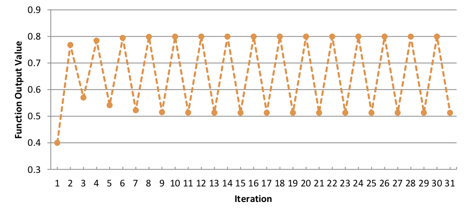

# Efficient use of unary operators


In addition to the large number of built-in functions, and the ability
to create your own functions quickly and easily, kdb+ provides unary operators,
which can alter function behavior to improve efficiency and
keep code concise. Employing unary operators correctly can bypass the need for
multiple loops and conditionals, with significant performance
enhancements.

This whitepaper provides an introduction to the basic use of the
different unary operators in q, with examples of how they
differ when applied to unary, binary and higher-rank functions.

It also covers how unary operators can be combined to extend the
built-in functions. Common use cases, such as
using operators for recursion and to modify nested columns
in a table, are looked at in more detail. These examples provide
solutions to common problems encountered when building
systems in kdb+ and demonstrate the range of situations where unary operators
can be used to achieve the desired result.

All tests were run using kdb+ version 3.1 (2013.08.09)

>!!! note "Maps"
>
>    Unary operators take maps as their arguments. 
>    A function is a map: it maps its domain/s to its range.
>    But so too are lists and dictionaries. 
>
>    This introductory paper addresses only the use of functions with unary operators.
>

## Function types

Functions in q can be one of several basic types, each associated with a range of type numbers. 

range   | type
--------|------
100     | lambda
101     | unary keyword
102     | binary operator
103     | unary operator
104     | projection
105     | composition
106-111 | derivative

In general, how a unary operator applies a function `f` depends only on the number <!-- and type --> of the parameters passed to the function they derive, not on the type of `f`. So we will not distinguish between function types when talking about unary operators.


## Basic use of unary operators with functions

There are eight unary operators. This paper addresses the seven that take function arguments. (The eighth, [Case](/ref/case), takes an integer list as argument.)

The operator takes a function argument and derives a new function, the _derivative_, based on the argument.
The derivative applies the original function in a new way.

-   Some unary operators take only argument functions of certain rank. E.g. Each Right and Each Left take only binary functions.
-   In some cases the derivative is [ambivalent](/ref/ambivalence): it can be applied as a unary function or as a binary.
-   Some operators derive functions with more than one way to apply the original function. How the original function is applied depends on whether the derivative is applied as a unary, a binary, or a higher-rank function. 

<!-- , each of which will either modify the
functionality of a function, modify the way a function is applied over
its parameters or – in some cases – make no changes at all. 
 -->
Understanding the basic behavior of each unary operator and how this behavior varies is key to both writing and debugging q code. 
This understanding is grounded in rank and syntax.


## Types of operator

There are two groups of unary operators: the _distribution_ and the _progression_ operators. 

group        | glyph | operator      | argument rank
-------------|:-----:|---------------|--------------
distribution | `'`   | Each          | any
distribution | `\:`  | Each Left     | 2
distribution | `/:`  | Each Right    | 2
distribution | `':`  | Each Parallel | 1
distribution | `':`  | Each Prior    | 2
progression  | `/`   | Over          | any
progression  | `\`   | Scan          | any

Each Parallel and Each Prior have the same glyph. 
They are distinguished by the rank of the argument function. 

The distribution operators evaluate their functions **itemwise** across their arguments. The evaluations are independent of each other.

The progression operators evaluate their functions **successively**. 
The result of each evaluation becomes the first argument of the next.


## Syntax

The unary operators are themselves a type of function and can be applied with bracket notation.

```q
q)/[+]2 3 4
9
```

Here the unary Over operator `/` takes the binary Add operator `+` as its argument, deriving the sum function `/[+]`, which is applied prefix to the vector `2 3 4`.

Unlike any other q function, the unary operators can also be applied postfix, and usually are.
For example, the sum function above is more usually derived `+/` with the Over operator `/` taking `+` _on its left_ as the sole argument. 

```q
q)+/[2 3 4]
9
```

>!!! important "A function derived postfix has infix syntax regardless of its rank."

The sum function is in fact [ambivalent](/ref/ambivalence). It can be applied as rank 1 or 2. 
It can take one or two arguments.

```q
q)+/[2 3 4]               / unary application
9
q)+/[1000 2000;2 3 4]     / binary application
1009 2009
```

Because postfix derivation yields an infix, `+/` can be applied infix.

```q
q)1000 2000+/2 3 4        / binary application, infix
1009 2009
```

Whether unary or ambivalent, an infix derivative can be applied prefix only when parenthesized.

```q
q)(+/)2 3 4
9
q)(count')("the";"quick";"brown";"fox")
3 5 5 3
```

>!!! detail "Deriving with bracket notation"
>
>    Deriving with bracket notation (unusual) can also produce an ambivalent function, but never an infix.
>
>    <pre><code class="language-q">
>    q)/[+][2 3 4]        / unary application
>    9
>    q)/[+][1000;2 3 4]   / binary application
>    9
>    q)1000/[+]2 3 4
>    'type
>    </code></pre>

A named derivative retains any ambivalence, but not infix syntax.

```q
q)tot:+/
q)tot[1000;2 3 4]     / binary application
1009
q)tot[2 3 4]          / unary application - still ambivalent
9
q)1000 tot 2 3 4      / not infix
'Cannot write to handle 1000. OS reports: Bad file descriptor
q)tot 2 3 4           / not infix, so prefix without parens
9
```

While operators and derivatives are functions and so can always be applied with bracket notation, this paper follows common practice and prefers to apply

-   unary operators postfix, e.g `+/`
-   binary derivatives infix, e.g. `x f\:y`
-   unary derivatives prefix, e.g. `(+\)x`


---
authors: 
    - Conor Slattery
    - Stephen Taylor
title: Efficient use of unary operators
date: August 2018
keywords: distribution, Each, Each Both, Each Left, Each Parallel, Each Prior, Each Right, kdb+, operator, q, unary
---

# Distribution operators


The distribution operators are Each and its variants. 

-   Each Left and Each Right are syntactic sugar for `f[x;]'` and `f[;y]'`.
-   Each Parallel has the same semantics as Each but distributes processing across slave tasks.
-   Each Prior applies a binary function between adjacent items of a list or dictionary.

The derivatives are all uniform functions. 
Arguments of non-unary derivatives must conform: they can be either atoms or same-count lists.


## Each


### Unary argument

The derivative applies the function to each element of a list or dictionary.

```q
q)(type')(1;2h;3.2)
-7 -5 -9h
q)(ssr[;"an";"in"]')("thank";"prance";"pants")
"think"
"prince"
"pints"
```

If the function is atomic, Each has no effect.
In fact, this is the definition of atomic. 

>!!! info "A function `f` is atomic if `f[x;y;z;…]~f'[x;y;z;…]`."

The keyword `each` can be used to avoid parentheses.

```q
q)type each (1;2h;3.2)
-7 -5 -9h
```


### Binary argument

Each applies a binary function to corresponding items of two list or dictionary arguments.

If both arguments are lists, they must be of the same length.

```q
q) 1 2 3 in' (1 2 3;3 4 5;5 6 7)
100b
q) 1 2 3 in' (1 2 3;3 4 5)
'length
```

Either or both arguments may be atoms. If both, the operator has no effect.

```q
q)1 ~' 1
1b
```

If one of the arguments is an atom, it is treated as a list of the same length as the other argument.

```q
q)1 ~' 1 2 3
100b
```

Each with a binary argument is sometimes called _Each Both_.


### Higher-rank argument

With a function of higher rank, the same rules apply by extension. 
As above, the derivative’s arguments must be conformable: atoms or same-count lists.

```q
q)ssr'[("thank";"prance";"pants");"a";"iiu"]
"think"
"prince"
"punts"
```


## Each Right and Each Left

Each Right `/:` and Each Left `\:` take a **binary** function `f`.

Syntax: `x f/:y`, `x f\:y`

The derivative `f/:` applies `f[x;]` to every item in `y`. 

```q
q)d:`a`b`c!("cow";"sheep";"dog")
q)"a ",/:d
a| "a cow"
b| "a sheep"
c| "a dog"
```

Correspondingly, Each Left applies `f[;y]` to each item of `x`.

```q
q)d,\:" in a field"
a| "cow in a field"
b| "sheep in a field"
c| "dog in a field"
```

>!!! tip "See how they lean"
>
>    You can remember which glyph denotes Each Right and which Each Left: the characters ‘lean’ towards the list argument.

Ponder the following identities.

```txt
x f/:y      <==>   (f[x;]')y           Each Right
x f\:y      <==>   (f[;y]')x           Each Left
```

And for atoms `a` and `b`

```txt
a f/:y      <==>   a f'y
x f\:b      <==>   x f'b
```

Find the file handle of each column of a table.

```q
q)`:/mydb/2013.05.01/trade,/:key[`:/mydb/2013.05.01/trade]except `.d
`:/mydb/2013.05.01/trade`sym
`:/mydb/2013.05.01/trade`time
`:/mydb/2013.05.01/trade`price
`:/mydb/2013.05.01/trade`size
`:/mydb/2013.05.01/trade`ex
```

The above statement joins the file handle of the table to each element
in the list of columns, creating five 2-lists. 
Each Right can then be used with `sv` to create the file handles of each column.

```q
q)` sv/: `:/mydb/2013.05.01/trade,/:key[`:/mydb/2013.05.01/trade]except`.d
`:/mydb/2013.05.01/trade/sym
`:/mydb/2013.05.01/trade/time
`:/mydb/2013.05.01/trade/price
`:/mydb/2013.05.01/trade/size
`:/mydb/2013.05.01/trade/ex
```


## Each Parallel

Each Parallel applies a **unary** function `f` to each element of a list or dictionary, using slave threads when available. 

Syntax: `(f':)x`

The result is the same as it would be for `f'`. That is, `f'[x]~f':[x]`.

Slave threads can be set using the `–s` command-line parameter. 
If no slave threads are available, Each Parallel is indistinguishable from Each.

The keyword `peach` can be used to avoid parentheses.

```q
q)count peach d
a| 3
b| 5
c| 3
```


## Each Prior

Each Prior applies a **binary** function to each item of a list or dictionary and to the previous item. For the i-th item of argument list `x`, the corresponding item of `(f':)x` is `f[x[i];x[i-1]]`.

A common use of this is in the `deltas` keyword.

```q
q)deltas
-':
q)deltas 4 8 3 2 2
4 4 -5 -1 0
```

It can also be useful in tracking down errors within lists which
should be identical, e.g. the `.d` files for a table in a partitioned
database. The below example uses the `differ` keyword to check for
inconsistencies in `.d` files. 
(`differ` uses Each Prior and is equivalent to `not ~':`.)

```q
q){1_date where differ get hsym `$"/mydb/",string[x],"/trade/.d"} each date
2013.05.03 2013.05.04
```

In this case the values of the `.d` files are extracted from each
partition. The `differ` keyword, which uses Each Prior, is
then used to compare each item in the list with the item before it. 
If a `.d` file
is different to the previous `.d` file in the list, then that date will
be returned by the above statement. 
The first date returned is dropped, as the first element of the list will be compared to -1-th element of the list, which is always null, and so they will never match. 
For the above example, the `.d` files for the 2013.05.03 and 2013.05.04
partitions are different, and should be investigated further.

>!!! detail "Each Prior derivatives are ambivalent"
>
>    Functions derived by Each Prior are ambivalent. 
>    They can be applied to one or two arguments, e.g.
>
>    <pre><code class="language-q">
>    q)2000-':2010 2013 2015 2020
>    10 3 2 5
>    </code></pre>
>
>    See the [Each Prior reference](/basics/distribution-operators/#each-prior) for more on this.

The keyword `prior` can be used to avoid parentheses. 
The example below returns all adjacent pairs of the argument list. 
Note that the first element of the first item of the result is null.

```q
q){y,x}prior til 5
  0
0 1
1 2
2 3
3 4
```


---
authors: 
    - Conor Slattery
    - Stephen Taylor
title: Efficient use of unary operators
date: August 2018
keywords: distribution, kdb+, operator, Over, progression, Scan, q, unary
---

# Progression operators


The [progression operators](/basics/progression-operators) are Scan `\` and Over `/`.

Scan and Over derivatives apply their function arguments _successively_:
the result of each evaluation becomes the (first) argument of the next.

Scan and Over have the same syntax and perform the same computations.
They differ in that Scan derivatives return the result of each evaluation, 
while Over derivatives return only the last.
That is:

```txt
(f/)x    <==>    last (f\)x
x f/y    <==>    last x f\y
```

>!!! tip "Map reduce"
>
>    Derivatives of Over with non-unary functions correspond to _map reduce_ in some other programming languages.

The number of evaluations the derivative performs is determined according to the rank of the argument function:

-   for a **unary** argument, by the derivative’s left argument – or its absence
-   otherwise, by the count of the derivative’s argument/s

>!!! detail "Memory usage: Scan vs Over"
>
>    For any given argument function, Scan and Over derivatives perform the same computation. But Over, in general, requires less memory, as it discards intermediate results.
>

## Unary argument

The function derived by a progression operator from a unary argument is ambivalent: it can be applied to one or two arguments. 

<br/>Scan | <br/>Over | application<br/>rank | <br/>iteration
----------|-----------|:--------------------:|---------------
`(f\)x`   | `(f/)x`   | 1                    | Converge
`n f\x`   | `n f/x`   | 2                    | Repeat
`t f\x`   | `t f/x`   | 2                    | While

```txt
Key:
f:  unary function      n: non-negative integer     t: truth map
```

The left argument of the derivative – or its absence – determines how many evaluations are performed.


### Converge

Syntax: `(f\)x`, `(f/)x`

When the derivative is applied as a **unary**, `f` is applied until either 

-   two successive evaluations match 
-   an evaluation matches `x`

```q
q)(raze/)(1 2;(3 4;5 6);7;8)
1 2 3 4 5 6 7 8
```

Matching is governed by [comparison tolerance](/kb/precision/#comparison-tolerance).


### Repeat

Syntax: `n f\x`, `n f/x`

When the derivative is applied as a **binary**, with a **non-negative integer** left argument, `f` is evaluated `n` times. 
The result has count `n+1`; its first item is `x`. 

```q
q)10{2*x}\2
2 4 8 16 32 64 128 256 512 1024 2048
```


### While

Syntax: `t f\x`, `t f/x`

When the derivative is applied as a **binary**, with a **truth map** as left argument, `f` is evaluated until `t` evaluated on the result returns zero. 
(The truth map `t` can be a function, list or dictionary.)

```q
q)(10>){2*x}\2
2 4 8 16
```


## Binary argument

The function derived by a progression operator from a binary argument `f` is ambivalent: it can be applied to one or two arguments. 

application | Scan    | Over
------------|---------|---------
unary       | `(f\)x` | `(f/)x`
binary      | `x f\y` | `x f/y`

The Scan derivative `f\` is a uniform function: `(f\)x` has the same count as `x`, and `x f\y` has the same count as `y`.

application | Scan      | `count r` | `r 0`       | `r i`
------------|-----------|-----------|-------------|---------
unary       | `r:(f\)x` | `count x` | `x 0`       | `f[r i-1;x i]`
binary      | `r:x f\y` | `count y` | `f[x;y 0]`  | `f[r i-1;y i]`

The i-th item of result `r` is 

-   for **unary** application, `f[r i-1;x i]`
-   for **binary** application, `f[r i-1;y i]`

Unary and binary applications differ in the evaluation of `r[0]`:

-   for **unary** application `r[0]` is `x[0]`
-   for **binary** application, `r[0]` is `f[x;y[0]]`

The Over derivatives perform the same computation but return only the result of the last evaluation.

```q
q)(+\)12 10 1 90 73
12 22 23 113 186
q)100+\12 10 1 90 73
112 122 123 213 286
q)(+/)12 10 1 90 73
186
q)100+/12 10 1 90 73
286
```

The keywords `scan` and `over` can be used to avoid parenthesizing binaries that are not also infixes.

```q
q){x+y} scan 12 10 1 90 73    / lambda is not an infix
12 22 23 113 186
q)(+) over 12 10 1 90 73      / + is an infix
186
```


## Higher-rank arguments

Syntax: `f\[x;y;z…]`, `f/[x;y;z…]`

Derivatives of higher-rank argument functions are not ambivalent: they have the same rank as their functions. 

They follow the derivatives of binary arguments applied as binary functions.
This may appear more clearly using bracket notation.

`f`     | `r:`        | `r 0`          | `r i`
--------|-------------|----------------|----------------
binary  | `f\[x;y]`   | `f[x;y 0]`     | `f[r i-1;y i]`
ternary | `f\[x;y;z]` | `f[x;y 0;z 0]` | `f[r i-1;y i;z i]`

And so on for higher ranks of `f`.

```q
q)ssr\["hello word." ;("h";".";"rd");("H";"!";"rld")]
"Hello word."
"Hello word!"
"Hello world!"
```

In the above example the successive evaluations are

```q
ssr["hello word.";"h";"H"]
ssr["Hello word.";".";"!"]
ssr["Hello word!";"rd";"rld"]
```

The right arguments of the derivative must conform: they must be lists or dictionaries of the same count, or atoms. 
The following two statements are equivalent.

```q
q){x+y+z}\[1;2 3 4;5]
8 16 25
q){x+y+z}\[1;2 3 4;5 5 5]
8 16 25
```


## Empty lists

The derivatives of non-unary functions are

-   **uniform** with Scan
-   **aggregates** with Over

Applied to empty lists, the Scan derivatives return empty lists without evaluating the function. The result is not always of the same type as the argument list/s.

Applied to empty lists, the Over derivatives return an atom without evaluating the function. 

See [Progression operators](/basics/progression-operators/#empty-lists) for details.


## Exponential moving average

Since V3.1 (2013.07.07), the exponential moving average of a list can be calculated using Scan.
While it was previously possible to define an exponential moving average function, the new syntax shortens execution times.

```q
//Function defined using the old syntax
q) ema_old: {{z+x*y}\[first y;1-x;x*y]}
//Function defined using the new syntax
//Requires V3.1 2013.07.07 or later 
q) ema_new:{first[y](1-x)\x*y}
q) t:til 10
q) ema_new[0.1;t]
0
0.1
0.29
0.561
0.9049
1.31441
1.782959
2.304672
2.874205
3.486784
//Functions produce the same results but ema_new is significantly faster
q) ema_old[0.1;t]~ema_new[0.1;t]
1b
q) t2:til 1000000
q) \t ema_old[0.1;t2]
421
q) \t ema_new[0.1;t2]
31
```


---
title: Combining operators
authors: 
    - Conor Slattery
    - Stephen Taylor
date: August 2018
keywords: efficiency, kdb+, operators, q
---

# Combining operators


Multiple operators can be used within the same expression, or even
applied to the same function, to achieve a result which cannot
be obtained using only one. 

In this section, we will look at some common and useful examples. 
While the results produced by these examples might seem confusing initially, by
taking each operator in turn and applying it to its unary, binary or
higher-rank argument we can see the rules already described are still
being followed.

The example below uses both Each Prior and Scan to return the first rows of Pascal’s Triangle.

```q
q) pascal:{[numRows] fn:{(+':)x,0} ; numRows fn\1};
q) pascal 7
1
1 1
1 2 1
1 3 3 1
1 4 6 4 1
1 5 10 10 5 1
1 6 15 20 15 6 1
1 7 21 35 35 21 7 1
```

To understand what is happening here first look at the definition of `fn`. 
Here, Each Prior is applied to the Add operator. 
The derivative returns the sum of all adjacent pairs in its argument.
Zero is appended to the argument to retain the final 1 in each evaluation.
 
The Scan operator applied to the unary function `fn` derives a function that uses the results of one iteration as the argument of the next.
After `numRows` iterations the result of each iteration,
along with the initial argument, is returned.
 
A commonly used example of applying multiple operators to a function is
illustrated in the following piece of code `,/:\:`, which returns
all possible combinations of two lists by applying Each Left
and Each Right to the Join function `,`. 
The order of the operators affects the result.

```q
q) raze 1 2 3 ,/:\: 4 5 6
1 4
1 5
1 6
2 4
2 5
2 6
3 4
3 5
3 6
q) raze 1 2 3 ,\:/: 4 5 6
1 4
2 4
3 4
1 5
2 5
3 5
1 6
2 6
3 6
```
 
To grasp how q interprets the above, note the following equivalences.

```txt
1 2 3 ,/:\: 4 5 6     <==>     ((1,/:4 5 6);(2,/:4 5 6);(3,/:4 5 6))
1 2 3 ,\:/: 4 5 6     <==>     ((1 2 3,\:4);(1 2 3,\:5);(1 2 3,\:6))
```

Another example of combining operators is `,//`. 
This repeatedly flattens a nested list until it cannot be flattened any more.

The two Over operators in this example do different things. 
The left-hand Over is applied to the Join operator, deriving `,/`, 
which joins the first item of its argument to the second, 
the result to the third item, and so on through the rest of the list. 
(The aggregate `,/` is in fact the `raze` function.)

```q
q)l:(1 2 3;(4 5;6);(7;8;(9;10;11)))        / mixed list
q)(,/)l
1
2
3
4 5
6
7
8
9 10 11
q)raze[l]~(,/)l
1b
```

The derivative `,/` is ambivalent. 
We shall pass it to the second Over as a unary argument: `(,/)/`.
This form is Converge. 
The derivative `,/` is applied until it has no further effect.

```q
q)((,/)/)l
1 2 3 4 5 6 7 8 9 10 11
```

But the inner parentheses are unnecessary. 

```q
q)(,//)l
1 2 3 4 5 6 7 8 9 10 11
```

In `,//` the argument of the second `/` is `,/`. 

The Each operator can also be combined with itself in order to apply a function to the required level of depth in nested lists.

```q
q) lst:(3 2 8;(3.2;6h);("AS";4))
q) type lst
0h
q) (type')lst
7 0 0h
q) (type'')lst
-7 -7 -7h
-9 -5h
10 -7h
q) (type''')lst
-7 -7 -7h
-9 -5h
(-10 -10h;-7h)
```


---
title: Iterating with operators
authors: 
    - Conor Slattery
    - Stephen Taylor
date: August 2018
keywords: converge, iteration, kdb+, loop, operators, q, repeat, while
---

# Iterating with operators


With unary functions, Scan and Over control iteration.
Evaluation is _successive_: the first evaluation is of the argument.
Subsequent evaluations are of the result of the previous evaluation.

There are three forms.

Scan    | Over    | form
--------|---------|-------
`(f\)x` | `(f/)x` | Converge
`n f\x` | `n f/x` | Repeat
`t f\x` | `t f/x` | While

```txt
Key:
f: unary function   n: non-negative integer   t: truth map
```

Converge

: Apply `f` until the result matches either the previous evaluation or `x`.

Repeat

: Apply `f` `n` times. If `n` is 0, return `x`.

While

: Apply `f` until truth map `t` applied to the result is 0. A truth map may be a function, list or dictionary.

```q
q) //Calculate a Fibonacci sequence using Over
q) fib: {x,sum -2#x}/
q) //Call the function with an integer as the first parameter
q) fib[10;1 1]
1 1 2 3 5 8 13 21 34 55 89 144
q) //Call the function with a function as the first parameter
q) fib[{last[x]<200};1 1]
1 1 2 3 5 8 13 21 34 55 89 144 233
```


## Infinite loops

Certain expressions result in infinite loops. 
Consider the function defined and illustrated below.

```q
q)30{3.2*x*(1-x)}\.4      / 30 iterations
0.4 0.768 0.5701632 0.7842468 0.541452 0.7945015 0.5224603 0.7983857 0.515091..
q)({3.2*x*(1-x)}\)0.4     / does not return!
```

  
<small>_Infinite looping function example_</small>

From the chart it is evident this results in a loop with
period 2 (at least within floating-point tolerance). 
If no exit condition is supplied the function will not terminate.

>!!! tip "Set a timeout"
>
>    When using Converge, it may be a good idea to set the timeout in your session via the `\T` command. This will terminate evaluation after a set number of seconds; infinite loops will not lock your instance indefinitely.
>

## Recursion

The self function `.z.s` can be used in recursion, allowing
more flexibility than Over or Scan. 

```q
q)l:(`a`n;(1 2;"efd");3;("a";("fes";3.4)))
q){}0N!{$[0h=type x;.z.s'[x];10h=abs type x;upper x;x]}l
(`a`n;(1 2;"EFD");3;("A";("FES";3.4)))
```

The above function will operate on a list of any structure and data
types, changing strings and characters to upper case and leaving all
other elements unaltered. 
Note that when using `.z.s` the function will error out with a `'stack` error message after 2000 loops.
This can be seen in the example below:

```q
{.z.s[0N!x+1]}0
```

No such restriction exists when using Scan or Over.
Use `.z.s` only where it is not possible to use Scan or Over.


## Operators vs loops

Many native q operators are overloaded to work with atoms, lists, dictionaries or a combination of them.
For example, the Add operator `+` can take two atoms, an atom and a list or dictionary or two lists or dictionaries as arguments. 

For more control over execution, or to work with user-defined functions, either loops or unary operators can be used. 
In almost all cases, unary operators allow shorter code with lower latency, and avoid creating unnecessary global variables.

Often the implementation is relatively easy, using Each, Each Left and
Each Right to cycle through a list and amend items.
As an example, we can check if either of the integers 2 or 3
are present in a list, using a `while` loop:

```q
q) chk:{i:0;a:();while[i<count x;a,:enlist any 2 3 in x[i];i+:1];a}
q) chk (1 2 3;3 4 5;4 5 6)
110b
q)\t:100000 chk (1 2 3;3 4 5;4 5 6)
515
```

However, operators allow neater, more efficient code.

```q
q) any each 2 3 in/: (1 2 3;3 4 5;4 5 6)
110b
q)\t:10000 any each 2 3 in/: (1 2 3;3 4 5;4 5 6)
374
```

Similarly we can use Over to deal with tasks which would be handled by loops in C-like languages. 
Suppose you want to join a variable number of tables.

```q
//Create a list of tables, of random length
q)tl:{1!flip(`sym;`$"pr",x;`$"vol",x)!(`a`b`c;3?50.0;3?100)}each string til 2+rand 10

//Join the tables using a while loop
q) {a:([]sym:`a`b`c);i:0;while[i<count[x];0N!a:a lj x[i];i+:1];a}tl
sym pr0      vol0 pr1      vol1 pr2      vol2
---------------------------------------------
a   35.2666  53   38.08624 95   1.445859 57
b   19.28851 39   6.41355  50   12.97504 24
c   23.24556 84   13.62839 19   6.89369  46

q)\t:100 {a:([]sym:`a`b`c);i:0;while[i<count[x];0N!a:a lj x[i];i+:1];a}tl
101

//Join the tables using Over
q) 0!(lj/)tl
sym pr0      vol0 pr1      vol1 pr2      vol2
---------------------------------------------
a   35.2666  53   38.08624 95   1.445859 57
b   19.28851 39   6.41355  50   12.97504 24
c   23.24556 84   13.62839 19   6.89369  46
q)\t:100 0!(lj/)tl
82
```

---
title: Nested columns
authors: 
    - Connor Slattery
    - Stephen Taylor
date: August 2018
keywords: columns, kdb+, nested, operators, q
---

# Nested columns


While it is usually best to avoid nested columns, there are
situations where operating on nested data is necessary or may
result in lower execution time for certain queries. 

The main reason for this is that the function `ungroup`, which flattens a table
containing nested columns, is computationally expensive, especially
when you are only dealing with a subset of the entire table. 
There are also other situations where storing the data in a nested structure makes more sense.
For example you may want to use strings, which are lists
of characters, instead of symbols, which are atoms, in order to avoid
a bloated sym file. 
For this reason we will now look at using unary operators to apply functions to a table as a whole, and to apply functions within a select statement.

Unary operators can be used to examine and modify tables. 
To do this, an understanding of how tables are structured is necessary. 
In kdb+, a table is a list of dictionaries.

This means we can apply functions to individual items, just
like any other nested list or dictionary.

```q
q)show a:([]a:`a`b`c`d;b:1 2 3 4;c:(1 2;2 3;3 4;4 5))
a b c
-------
a 1 1 2
b 2 2 3
c 3 3 4
d 4 4 5
q)type a
98h
q)(type')a
99 99 99 99h
q)(type'')a
a   b  c
--------
-11 -7 7
-11 -7 7
-11 -7 7
-11 -7 7
```

We see here that 

-   `type a` returns 98, the type of a table
-   `(type')a` returns the type of each item of the list `a`: the type of ictionaries 
-   `(type'')a` finds the type of each item in the range of each dictionary in `a`: a list of dictionaries, which collapses back to a table showing the type of each field in the table `a`

```q
q)distinct (type'')a
a   b  c
--------
-11 -7 7
```

In this way, the statement can be used to ensure all rows of the
table are the same type. This is useful if your table contains nested
columns, as the `meta` function only looks at the first row of
nested columns. If the table is keyed then the function will only be
applied to the non-key columns in this case.

```q
q)a:([]a:`a`b`c`d;b:1 2 3 4;c:(1 2;2 3;3 4.;4 5))
q)meta a
c| t f a
-| -----
a| s
b| j
c| J
q)distinct (type'')a
a   b  c
--------
-11 -7 7
-11 -7 9
```

Looking only at the results of `meta`, we might conclude the column `c`
contains only integer lists. However `distinct (type'')a` clearly
shows column `c` contains lists of different types, and thus is
not mappable. 
This is a common cause of error when writing to a splayed table.

Dealing with nested data in a table via a select or update statement
often requires the use of unary operators. 
To illustrate this, let us define a table with three columns, two of which are nested.

```q
q)tab:([]sym:`AA`BB`CC;time:3#enlist 09:30+til 30;price:{30?100.0}each til 3)
```

Suppose we want to find the range of each row. 
This can be done easily by defining a range function as:

```q
q)rng:{max[x]-min[x]}
```

We can then make use of this function within a select statement, with Each to apply the function to each row of the table.

```q
q)select sym, (rng')price from tab
sym price
------------
AA  96.3872
BB  95.79704
CC  98.31252
```

Suppose instead we want to find the range of a subset of the data in the table.
One way would be to ungroup the table and then find the range as follows.

```q
q)select rng price by sym from ungroup tab where time within 09:40 09:49
sym| price
---| --------
AA | 77.67457
BB | 80.14611
CC | 67.48254
```

However, it is faster to index into the nested list, as this avoids the costly `ungroup` function.
First find the index of the prices which fall within our time range.

```q
q)inx:where (exec first time from tab) within 09:40 09:49
```

Then use this to index into each price list and apply `rng` to the resulting prices.

```q
q)select sym, (rng')price@\:inx from tab
sym inx
------------
AA  77.67457
BB  80.14611
CC  67.48254
```

This offers a significant improvement in latency over using `ungroup`.

```q
q)\t:10000 select rng price by sym from ungroup tab where time within 09:40 09:49
198
q)\t:10000 inx:where (exec first time from tab) within 09:40
09:49;select sym, (rng')price@\:inx from tab
65
```

If the nested lists are not uniform the code needs to be changed to the following:

```q
q)inx:where each (exec time from tab) within 09:40 09:49
q)select sym, (rng')price@'inx from tab
sym inx
------------
AA  77.67457
BB  80.14611
CC  67.48254
```

---
title: Conclusion
authors: 
    - Conor Slattery
    - Stephen Taylor
date: August 2018
keywords: kdb+, operators, q
---

# Conclusion

This whitepaper provides a summary of the unary operators available in q,
showing how they modify the behavior of different types of functions.

It showed, through the use of examples, that the operation of the derived function is determined by

-   the unary operator
-   the rank of the argument function (for Each, Scan and Over)
-   the rank at the derivative is applied (for binary functions with Each Prior, Scan, and Over)

More elaborate examples with multiple operators can be analyzed wih these rules.

Certain applications of unary operators 
(creating iterating functions, applying operators to functions within select statements) 
were examined in more detail, as these are useful for many tasks, but often poorly understood.
Some common uses were examined to show the ability of unary operators to reduce
execution times.

This whitepaper illustrates how unary operators can extend the functionality of built-in and user-defined functions, allowing code to take full advantage of kdb+’s ability to process large volumes of data quickly.
Correctly using adverbs on data minimizes manipulation, and allows more concise code, which is easier to maintain.

All tests were run using kdb+ V3.1 (2013.08.09)


## Authors

Conor Slattery is a Financial Engineer who has designed kdb+
applications for a range of asset classes. Conor is currently working
with a New York-based investment firm, developing kdb+ trading
platforms for the US equity markets.

Stephen Taylor is the Kx Librarian and the editor of the code.kx.com site.

