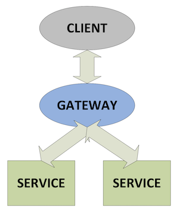
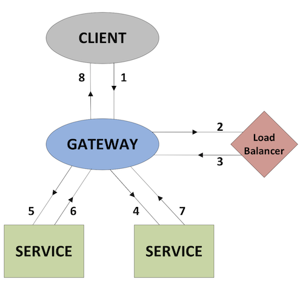

White paper
{: #wp-brand}

# Common design principles for kdb+ gateways

by [Michael McClintock](#author)
{: .wp-author}


In the vast majority of kdb+ systems, data is stored across several processes. These setups can range from a single real-time and historic database on the same server to multi-site architectures where data of various forms is stored in hundreds of different processes. In either scenario there is likely to be the same requirement to access data across processes. This is typically achieved using a ‘gateway’ process.

The primary objective of a gateway is to act as a single interface point and separate the end user from the configuration of underlying databases or ‘services’. With this, users do not need to know where data is stored or make multiple requests to retrieve it. An optimal solution serves to assist the user without imposing any unnecessary constraints or loss in performance. While the implementation of any particular gateway is likely to differ, dependent on specific system requirements, there are a number of shared technical challenges and solutions.

This paper aims to outline the common design options and examine the advantages and disadvantages associated with each method. In doing so, it seeks to offer a best-practice guide on how to implement an efficient and scalable kdb+ gateway framework. Where appropriate, sample code extracts are included to illustrate techniques.


## Gateway design

Figure 1 outlines the general principle of how a gateway acts as a single point of contact for a client by collecting data from several underlying services, combining data sets and if necessary performing an aggregation operation before returning the result to the client.



<small>_Figure 1: Gateway schematic_</small>

Whilst the above diagram covers the principle of all gateways, the specific design of a gateway can vary in a number of ways according to expected use cases. The implementation of a gateway is largely determined by the following factors.

-   Number of clients or users
-   Number of services and sites
-   Requirement of data aggregation
-   Level of redundancy and failover

In addition the extent to which functionality is exposed to the end user can be controlled using one of the following options. The first approach serves to act as a standard kdb+ process to the user, offering ad-hoc qSQL query access. The specific implementation of this approach is outside the scope of this paper. The second and more common approach offers a number of stored procedures for specific data retrieval scenarios. This more structured API form of gateway is generally easier to implement and arguably offers a more robust solution for production kdb+ applications than supporting free form qSQL-type requests.

Let’s consider a basic example where a user makes a request for trade data for a single stock across yesterday and today. The task of the gateway can be broken down into the following steps.

-   Check user entitlements and data-access permissions
-   Provide access to stored procedures
-   Gain access to data in the required services
-   Provide best possible service and query performance

As the gateway serves as the sole client interface it is the logical point for entitlement validation. Permissioning is commonly broken into two components; user level access using the `.z.pw` function, and execution access using either `.z.pg` or `.z.ps`. These functions can be customized to control access at several levels including by symbol, table, service or region.

:fontawesome-regular-hand-point-right:
Reference:
[`.z.pg`](../../ref/dotz.md#zpg-get),
[`.z.ps`](../../ref/dotz.md#zps-set),
[`.z.pw`](../../ref/dotz.md#zpw-validate-user)

Any user requests that fail entitlement checks should be returned to the client with an appropriate message without proceeding any further. At this point it is worth noting that gateways are primarily used for data retrieval and not for applying updates to data.

Once the user’s request has been verified, the gateway needs to retrieve the data from the real-time and historic services that store the data for the particular symbol requested. The most basic gateway would create and maintain connections to these services on startup. The gateway would then send the query to these services using a function similar to the sample outlined below, in which we make use of an access function to correctly order the constraint clause of the query.

```q
/ stored procedure in gateway
/ sd:start date; ed:end date; ids:list of ids or symbols
getTradeData:{[sd;ed;ids]
  hdb:hdbHandle(`selectFunc;`trade;sd;ed;ids);
  rdb:rdbHandle(`selectFunc;`trade;sd;ed;ids);
  hdb,rdb }

/ access function in RDB/HDB
selectFunc:{[tbl;sd;ed;ids]
  $[`date in cols tbl;
  select from tbl where date within (sd;ed),sym in ids;
  [res:$[.z.D within (sd;ed); select from tbl where sym in ids;0#value tbl];
    `date xcols update date:.z.D from res]] }

/ client request
gatewayHandle "getTradeData[.z.D-1;.z.D;`ABC.X]"
```

Whilst the above may satisfy a single user setup with a small number of underlying services, it quickly becomes inefficient as the number of processes grows and we look to handle the processing of concurrent requests. As this example uses synchronous messaging between the client and the gateway, the gateway is effectively blocked from receiving any additional user requests until the first completes. Also as the requests made by the gateway to the services are synchronous they can only be made in succession, rather than in parallel.

These issues obviously reduce the performance in terms of time taken to complete user requests. By using asynchronous communication it is possible for the gateway to process a second request which may only require a RDB whilst the gateway is idle awaiting the response from a first query which may have only required a HDB.

Extending this principle, if we then wanted to be able to process two simultaneous requests requiring the same service, we could start additional services and introduce load balancing between them. These two principles of load balancing and IPC messaging are considered further in the following sections.


## Load balancing

As we scale the number of user requests we will need to scale both the number of gateways, to handle the processing of requests and responses, and the number of underlying services to retrieve the required data. The number of gateways required is likely to be determined by the scope of the stored procedures and the intensity of any joining or aggregation of data being performed. In practice the number of gateways required is usually small compared to the number of data services.

In the initial example the configuration for all services was loaded into the gateway; however in systems with multiple processes the load balancing of services is typically achieved using a separate standalone process. There are a couple of different ways in which this process can function.


### As a pass-through

In this setup the gateway sends each individual service request to the load-balancer process, which distributes them to the least busy service in its pool of resources and returns the result to the gateway when it is received from the service. Figure 2 shows this flow between processes.


<small>_Figure 2: Pass-through load balancer schematic_</small>

The `mserve` solution written by Arthur Whitney and Simon Garland provides a sample implementation of how a load-balancing process can allocate the query to the least busy service and return the result to the client, which in this case is the gateway.

:fontawesome-regular-hand-point-right:
Knowledge Base: [A load-balancing kdb+ server](../../kb/load-balancing.md)

In this script the load balancer process determines which service to issue the request to according to which has the minimum number of outstanding requests queued at the time the request is received.

Nathan Perrem has also provided an extended version of this solution, which queues outstanding requests in the load-balancer process if all services are busy and processes the queue as services complete their request. This script ensures requests are processed in the order in which they are received and provides support for scenarios where services crash before completing a request. This solution makes it easier to track the status of all incoming queries as well as allowing clients to provide callback functions for results
of queries.

:fontawesome-brands-github:
[nperrem/mserve](https://github.com/nperrem/mserve)


### As a connection manager

In this configuration the gateway process makes a request to the load balancer for connection details of one or more services required to process the request. When the gateway receives the connection details it then sends the request directly to the service. In Figure 3, the numbers show the sequence of communications between each of the processes, before the result is returned to the client.



<small>_Figure 3: Connection manager load balancer schematic_</small>

This process can act such that it immediately returns the connection details for a service on a simple round-robin basis. Alternatively it can only return connection details to the gateway whenever a particular service is free to receive a query. The key difference with the latter method is that the load-balancing process can be used for thread management. In the basic round-robin approach the load balancer is distributing details based on a simple count of how many requests have been allocated to a particular service within a period of time.

The communication between the gateway and the load balancer is only on the initial request for connection details for the service. There is no requirement for the gateway to notify the load balancer when it has received results from the service. A sample extract of the code for this method is shown as follows.

```q
/ table of services configuration in load balancer
t:([]
  service:`rdb`rdb`hdb`hdb;
  addr:hsym@/:`$”localhost:”,/:string 5000+til 4;
  handle:4#0n;
  counter:4#0)

/ function in load balancer
requestForService:{serv]
  det:select from t where service=serv,not null handle;
  res:(det(sum det`counter)mod count det)`addr;
  update counter:counter+1 from `t where addr=res;
  res }

/ gateway request
loadBalancerHandle "requestForService[`rdb]"
```

A disadvantage with this method is that an equal distribution of queries of different duration could result in one service being idle having processed its requests, whilst another is still queued.

A more intelligent solution involves both communication with the load balancer for the initial connection request and also whenever the service completes a request. The benefit of this is an efficient use of services where there will not be requests queued whenever a suitable server is idle. The additional requirement with this approach is that if all services are currently busy, any subsequent requests need to be maintained in a queue and processed whenever a service becomes available again. The following outlines the functions and
callbacks required for this approach.

```q
/ service table and queue in load balancer
t:([]
  service:`rdb`rdb`hdb`hdb;
  addr:hsym@/:`$”localhost:”,/:string 5000+til 4;
  handle:4#0n;
  inUse:4#0b)

serviceQueue:()!()

/ functions in load balancer
requestForService:{[serv]
  res:exec first addr from t where service=serv,not inUse;
  $[null res;
    addRequestToQueue[.z.w;serv];
    [update inUse:1b from `t where addr=res;
     neg[.z.w](`receiveService;res)]]; }

addRequestToQueue{[hdl;serv]
  serviceQueue[serv]::serviceQueue[serv],hdl; }

returnOfService:{[ad] update inUse:0b from `t where addr=ad; }

/ gateway callback and requests
receiveService:{[addr]-1”Received Service:”,string[addr]; }

loadBalancerHandle(`requestForService;`rdb)
loadBalancerHandle(`returnOfService;`:localhost:5000)
```

Whilst both the pass-through and connection-manager methods can incorporate similar logic for service allocation, the pass-through approach has the disadvantage that it adds an additional and unnecessary IPC hop, with the data being returned via the load balancer, whereas with the latter method the data is sent directly from the service to the gateway. For a system with a smaller number of user requests the simpler round-robin approach may be sufficient, however in general the additional benefit of thread management from using the last method offers a more efficient use of services.


## Synchronous vs asynchronous

With each of the communications, outlined in Figure. 3, between the client and the gateway (1,8), gateway and load balancer (2,3), and gateway and service (4-7), we have the option of making synchronous or asynchronous requests. In addition to the standard asynchronous request type we can also make use of blocking-asynchronous requests where the client sends a request asynchronously and blocks until it receives a callback from the server. Which method is used is largely driven by the communication between the client and the gateway.

If the client makes a synchronous request to the gateway, both the subsequent requests to the load balancer and the service are required to be synchronous or blocking-asynchronous requests. In this case each gateway is only able to process a single user request at a time. As noted earlier this is an inefficient design as the gateway will largely be idle awaiting responses from the load balancer or service.

A much more efficient design is where communication between the client and the gateway uses either asynchronous or blocking-asynchronous messaging. With this arrangement the gateway is able to make multiple asynchronous requests to the load balancer or services without having to wait on a response from either. To support multiple concurrent requests the gateway needs to track which processes have been sent a request related to the original client request. This can be easily achieved by tagging each user request with an identifier which is then passed between processes and used when handling callbacks. With the asynchronous method the gateway maintains the state of each request in terms of caching results returned from services and any outstanding service requests. When all results are returned and processed the gateway then invokes a callback in the client with the result set.


## Data transport and aggregation

As a general principle it is more efficient to perform aggregation at the service level instead of pulling large datasets into the gateway process. By doing so we can take full advantage of the map-reduce method built in to kdb+.

However there are use cases which may require gateway-level aggregation, for example the correlation of two datasets. In these cases the location of processes is important and can have a significant effect on performance. By positioning the gateway as close as possible to the underlying sources of data, we can reduce any latency caused by unnecessary data transport over IPC.

In practice this means it is preferable to have gateways located on the same server as the data services, which perform the aggregation locally and return the much smaller dataset to the remote client. Expanding this principle to a system where there may be multiple distinct zones, for a request requiring data from multiple services in two different zones, it may be quicker to send two separate requests to a gateway in each zone rather than one single request to a single gateway. This approach has the additional overhead of requiring the client to maintain connections to multiple gateways and to know how the data is separated – the very same problem the use of gateways seeks to avoid.

Depending on the application and the nature of requests, it may be beneficial to use a tiered gateway setup. In this configuration a client would make a single connection to a primary-level gateway, which would break up the request into sub-requests and distribute to their relevant zones.

An example could be the calculation of correlation between two pairs of stocks, were the data for the first pair is split across different HDBs in one zone and the data for the second pair is split between two HDBs in another zone. In this example, each lower level gateway would process a sub-request for the single pair that is stored in that zone. By performing the aggregation close to the data source, the amount of data transport required between zones is reduced and the result can be joined in the primary gateway and returned to the client.


<small>_Figure 4: Tiered-gateway schematic_</small>


## Resilience

To offer the most reliable service to clients it is important to consider the potential for failure within any application. In the context of gateways, failure generally relates to one of the following issues.


### Service failure

Service failure can relate to any reason which prevents a service from being available or functional. In this case we need to have a similar service available which can process the request.

Failover can either be incorporated using a hot-hot set up where duplicate processes and data are used on an equal basis, or where redundant processes are used as a secondary alternative.

For the majority of systems where failover is provided by hardware of the same specification, the hot-hot setup provides the more efficient use of resources. As the load balancer process acts as a single point of failure between the gateway and service level, each gateway should be configured to use an additional failover load balancer process in the event the primary side is not available. To handle failure of any individual data service each load balancer process should have knowledge of a number of similar processes.

Incorporating failover at each level also makes it possible to create maintenance windows whilst providing a continuous client service.


### Disconnections

In addition to service failure which may result in a sustained outage of a particular process or server, there can also be shorter-term disconnect events caused by network problems. This can occur between any of the three connections we looked at earlier, client to gateway, gateway to load balancer and gateway to service. While client-to-gateway disconnects will require failure logic to be implemented on the client side, disconnects between the gateway and the other processes should be handled seamlessly to the client. By using the [`.z.pc`](../../ref/dotz.md#zpc-close) handler, the gateway can recognize when processes with outstanding requests disconnect before returning a result. In these scenarios the gateway can reissue the request to an equivalent process using the failover mentioned above.


### Code error

Whilst every effort can be made to prevent code errors a robust gateway framework should also be designed to handle unexpected errors at each point.

Code errors may result in an explicit error being reached, in which case protected evaluation of callbacks between processes should be used so that any error can be returned through the process flow to the client. It is generally safer to handle and return errors than reissue the same request to multiple equivalent services which are likely to return the same error. Some code errors may result in no explicit error being reached, but a failure to return a response to a process which expects it.

This point raises the issue of client expectation and whether it may be desirable to terminate requests at the gateway level after a period of time.


### Service expectation

For systems where there may be legitimate requests that take an extended period of time at the service level, compared to an average request, it would obviously not be desirable to terminate the request, particularly when it would not be possible for the gateway to terminate the request at the service level.

In these cases it may be preferable to use the query timeout `-T` parameter selectively at the service level to prevent any individual requests impacting the application. In other scenarios were the quantity of requests may be too large, resulting in long queuing in the load balancer process, it can be desirable to reject the request for a service and return an error to the client. This method can provide stability where it isn’t possible for the underlying services to process the requests at the rate at which they are being made.


## Data caching

In general gateways are used as a means through which underlying data servers are accessed and the gateway isn’t responsible for storing any data itself. However, there are two scenarios in which it may be efficient for it to do so. Depending on the nature of the application and the client requests, it may be efficient for the gateway to store aggregated responses from a number of underlying services.

In use cases where cached data wont become ‘stale’ and where it is likely that additional users will make similar requests there can be benefit in storing the response rather than going to the service level, reading the same data and performing the aggregation, on each request.

What data is cached in the gateway can either be determined by configuration and calculated on startup or driven dynamically by user requests for a particular type of data. It is likely that any such data would come from a HDB as opposed to a RDB where the data is constantly updating. The additional memory overhead in storing the response means this method is only appropriate for highly-aggregated data which is time-consuming to calculate from a number of different sources. For most cases where clients are frequently requesting the same aggregated data it is preferable to have this calculated in a separate service level process which is accessed by the gateway.

The second and more common case for storing data in the gateway process is with reference data. Depending on the extent of the stored procedures available this relatively static data can either be applied to incoming requests or to the result set. Storage of reference data at the gateway level removes the need for the same data to be stored by multiple processes at the service level as well as being used to determine which underlying services are required for a particular user request.


## Conclusion

As outlined in the initial overview, the implementation of any particular gateway framework is likely to be different and it is important to consider all potential requirements of an application in its design. In this paper we have addressed the most common technical challenges associated with gateways and looked at the reasoning for selecting various design options. As applications can evolve over time it is also beneficial to maintain usage and performance metrics which can be used to verify framework suitability over time or identify when any changes in design may be required. In summary:

-   Gateway frameworks should provide a means to load-balance data processes and achieve an efficient use of resources. The use of a separate process is an effective way of centralizing configuration and making it straightforward to scale the number of data services.
-   Gateways using asynchronous messaging allow simultaneous execution of multiple requests with no unnecessary latency caused by blocking.
-   The location of gateway processes is important to minimize data transport and use of a tiered gateway arrangement can provide an optimal solution with multi-zoned applications.
-   Failover procedures for process failures and disconnections are required to create a manageable environment which can provide a continuous and reliable service to clients.

All code included is using kdb+ 3.0 (2012.11.12).

[:fontawesome-solid-print: PDF](/download/wp/common_design_principles_for_kdb_gateways.pdf)


## Author


{: .small-face}

**Michael McClintock** has worked as consultant on a range of kdb+ applications for hedge funds and leading investment banks. Based in New York, Michael has designed and implemented data-capture and analytics platforms across a number of different asset classes.
&nbsp;
[:fontawesome-solid-envelope:](mailto:mmcclintock@kx.com?subject=White paper: Gateway design) 
&nbsp;
[:fontawesome-brands-linkedin:](https://www.linkedin.com/in/michael-mcclintock-93488841/)
