White paper
{: #wp-brand}

# An introduction to graphical interfaces for kdb+ using C&#35;

by [Michael Reynolds](#author)
{: .wp-author}


Over the course of fifteen years, C# has become one of the most
common programming languages in the world. It has been used
in applications ranging from computer games to medical systems to
storage systems.

When deployed in an environment which requires database connections,
it is traditional for C# to use a form of SQL for the back end, be it
MySQL or SQLite to provide data storage and the ability to execute
queries. Though functional, kdb+ offers substantial improvements in
performance and processing power over this standard method of
operation.

In this paper, we will explain the basics of using C# to open
connections to kdb+ processes running on remote servers as well as
setting up a basic API that will allow for authentication, error
recovery and basic queries through an interface. In this case, all C#
code will be pointing to the same kdb+ process.

C# is heavily integrated into Windows software. It allows for the
implementation of the .NET environment into applications and can be
utilised in the creation of websites using PHP and ASP.NET as well as
stand-alone Windows applications.

The paper makes use of the standard `c.cs` file offered by KX to enable
connections to C#. This can be found at :fontawesome-brands-github:
[KxSystems/kdb](https://github.com/KxSystems/kdb/blob/master/c/c.cs).

It is important to note that this paper does not aim to provide a full
C# library, but instead give guidance on how to quickly and easily
allow a C# application to connect to and run queries against a kdb+
process.

The C# source code for this paper can be found at :fontawesome-brands-github: [kxcontrib/csharpgui](https://github.com/kxcontrib/csharpgui).


## Connecting kdb+ and C#

    
### C# socket to enable client connection

To connect from C# to a running kdb+ process, it is first necessary
to import the `c.cs` file mentioned in the introduction. While it is
possible to construct a bespoke plugin for use between kdb+ and C#,
and may be required depending on the requirements of the project, for
basic connections and queries, the default KX plug-in will be
satisfactory. This must then be called by referencing the namespace
provided (in this case, it is `kx`). After importing `c.cs` into a C#
project, it can then be called via the `using` directive:

```csharp
using kx;
```

This will allow all objects, classes and methods within the `kx`
namespace provided by the `c.cs` file to be used throughout the project,
allowing connections to the kdb+ process via TCP network sockets. It
will also permit querying and updates to be performed on the same kdb+
process.

To open a connection between C# and the kdb+ process, an object of
class `c` needs to be called and instantiated. This is a KX-provided
class that will act as an interface between kdb+ and C#. This will be
used in a method called `OpenConnection`. In the below example, a
server and process will be hard-coded to private variables though these
could be modified to accept values from a configuration file. The
methods have also been set up to accept a username and password if
desired; this will be described in more detail later.

```csharp
private static String HOST = "localhost";
private static int PRIMARY_PORT = 5010;

public static c GetConnection(String user, string password)
{
    c connection;
    if ((connPool.Count > 0) && (counter < MaxPoolSize))
    {
        connection = RetrieveFromPool(HOST, PRIMARY_PORT,user,password);
    }
    else
    {
        connection = OpenConnection(HOST, PRIMARY_PORT, user, password);
        counter++; 
    }
    return connection;
}
```

```csharp
private static c OpenConnection(String host,int port,string user,string password)
{
    try
    {
        c conn;
        if ((user == null) || (password == null))
        {
            conn = new c(host, port); //Takes host and port
        }
        else
        {
            conn = new c(host, port, user, password);
        }
        if (conn == null) //Returns null if no connection was made
        {
            throw new Exception("Connection could not be established");
        }
        else
        {
            return conn; //If connection was made, return conn object
        } 
    }
    catch (Exception e)
    {
        System.Diagnostics.Debug.Write("An unexpected error occurred: " + e.ToString());
        //Catch any unexpected errors and fail gracefully.
        throw e;
    } 
}
```

The above code shows a simple, generic connection method which can be
called when starting a C# application to create a connection to a
running kdb+ process. We return the `c` object in this case as we will need
it in the main method to execute queries.

Note that a lot of the method consists of error catching. This is to
ensure that the application can recover in the event of the connection
not being made successfully or another, unexpected error occurring. In
this example, we have merely outputted a message to the Visual Studio
console to say that we have an error but later, we will see how this
error handling can be used to provide error recovery or business
continuity.

This method will be used as part of a `ConnectionPool` which will be
used to monitor and assign connections to users rather than having a
haphazard collection of connections with each process. This will
reduce the load and traffic on the kdb+ instance as it cuts down on
the number of handles that could be attempting to query
simultaneously.

```csharp
private void button1_Click(object sender, EventArgs e)
{
    c conn = ConnectionPool.GetConnection();
    //This pulls an object of type c from the shared connection pool.
    if (conn != null) {
        textBox1.Text = "You have connected to localhost:5010 successfully";
    } else {
        textBox1.Text = "Error, you have not successfully connected to the server";
    }
    ConnectionPool.ReturnConnection(conn);
}
```

This is an example of the `OpenConnection` method in operation (via the
`ConnectionPool`) with a simple click event for a button. It will check
if the method has returned a `c` object for further use and, if not, it
will throw an error.

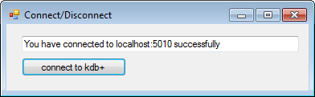  
<small>_Successful connection_</small>

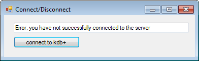  
<small>_Unsuccessful connection_</small>


### Validation with passwords

As previously mentioned, a bonus of using kdb+ as the back end for a
C# or Java application is that the code on the server side is independent
of both languages. This greatly eases the development required to make
such a service available and enables platforms operating either
language to access the same services. This also enables developers to
take advantage of kdb+ as a language and move much of the processing
to the server side. An example of this is validation to prevent users
from connecting to the server without permission.

In the below process, we have created a simple table with a user and
their password. The password could be further encrypted using a
hashing algorithm such as MD5 for extra security (this will not be
shown in this white paper but is highly recommended).

```q
q)user_table:([users:`mreynolds`user1`user2]password:("password";"password2";"password3"))
q)user_table
users    | password
---------| -----------
mreynolds| "password"
user1    | "password2"
user2    | "password3"
```

This involves changing the `c.cs` file provided by KX as this is not set
up to accept customised usernames (it instead takes the username
stored in `Environment.UserName`) or any passwords at all. We will also
need to modify the `OpenConnection` method and define `.z.pw`.

First of all, the `c` constructor for `c.cs`:

```csharp
public c(string h, int p, string u, int maxBufferSize)
{
    serverName = h; //This is the hostname
    serverPort = p; //This is the port number
    _maxBufferSize = maxBufferSize;
    Connect(h, p); //This is what makes the connection to kdb+
    s = this.GetStream();
    B = new byte[2 + u.Length];
    //This defines the length of the bytesteam as username + 2
    // for termination characters
    J = 0;
    w(u + "\x3"); //This is as above with termination characters ‘x3’ sent
    s.Write(B, 0, J); //This line sends data to kdb+ as stream of bytes;
    if (1 != s.Read(B, 0, 1))
        throw new KException("access"); vt = Math.Min(B[0], (byte)3);
        //Throws error if connection is not accepted.
}
```

This works by opening a byte stream to the kdb+ process and then
feeding user input as bytes to the handle.

A byte stream is an open connection that sends a collection of bytes
from sender to receiver in a bidirectional format. This connection is
reliable and the use of bytes allows the C# query to be sent to a
kdb+ process and the kdb+ response to be returned and deserialised.

As defined currently, along with the host `h` and port `p`, it will
take a further parameter for the username `u`, but none for the
password. To make it accept passwords as well, we need to modify the `c`
constructor in the `c.cs` file to the following:

```csharp
//We have added pw argument to this to take in our password
public c(string h, int p, string u, string pw, int maxBufferSize)
{
    serverName = h; //This is the hostname
    serverPort = p; //This is the port number
    _maxBufferSize = maxBufferSize; //This is what makes the connection to kdb+
    Connect(h, p);
    s = this.GetStream();
    B = new byte[3 + u.Length + pw.Length];
    //This differs from above as we have added the length of the password as well, 
    // plus an extra character to take account of the separator between u and pw ':' 
    J = 0;
    w(u + ":" + pw + "\x3");
    //We can now send through both username and password to the kdb+
    // session for authentication.
    s.Write(B, 0, J); //This line sends data to kdb+ as stream of bytes;
    if (1 != s.Read(B, 0, 1)) throw new KException("access"); vt=Math.Min(B[0],(byte)3);
}
```

We have specified a new variable `pw`, which is now being read into the byte stream along with `u`. In particular, it is `w(u + ":" + pw + "\x3")` that will be interpreted by `.z.pw` or the `-u` argument as a username and password. We can use a simple definition for `.z.pw` to query the users table whenever a connection is made through C#.

This will return `0b` if the user does not have permission to access the
process. Within C#, this will throw a KException with the message
`access`. This can be used to track if the user has been refused
access in the C# API.

:fontawesome-regular-hand-point-right: 
Tom Martin’s white paper [“Permissions with kdb+”](../permissions/index.md)
for more detailed information on validation and authentication

```csharp
private void button1_Click(object sender, EventArgs e)
{
    try
    {
        c conn = OpenConnection("localhost",5010,usernameText.Text, pwText.Text);
        label3.Text = "Hello " + usernameText.Text +
        ". You are permitted to make this connection";
    }
    catch (KException kEx)
    {
        if (kEx.Message == "access") //Permission denied
        {
            label3.Text = "Sorry "+usernameText.Text+". You may not make this connection";
        }
        else
        {
            label3.Text = "An unexpected kdb+ error occurred";
        } 
    }
    catch (Exception ex)
    {
        label3.Text = ex.Message;
    }
}
```

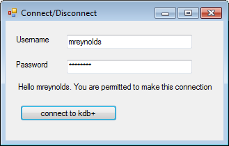  
<small>_Successful connection_</small>

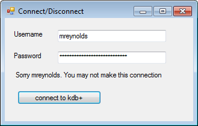  
<small>_Unsuccessful connection_</small>


## Queries


### Simple queries

With a connection established between the C# application and the kdb+
process, it is now possible to send queries from the front end and
receive data from the back end. This is done through the use of the `c`
object which is created after opening the connection. This is why it
is important to keep track of the object in methods such as
OpenConnection.
 
The method used to perform operations over the kdb+ connection is
simply called `k` and is called as a child method of the `c` class. The
same method is used to query, update and delete data from kdb+ and
accepts a string as a parameter.

```csharp
conn.k("select from tab");
```
 
This is then fed into a method called `c`, which breaks it into bytes
and passes it into kdb+. The result is then received by the C# client
as a stream of bytes which is deserialised by the `c` method into C#
compatible types. The result itself is a two-dimensional array when
used with `select` or a one-dimensional array when used with `exec`. This
can then be cast to the type `c.Flip`, which mimics a table with similar
functionality and methods available.
 
In the below example, an app has been written with a hard-coded query
to a simple trade table. This will update the table in the application
by use of a `DataGridView` every time the update button is clicked. To
push the data to a `DataGridView`, it first needs two loops to copy the
data into the correct formats (one loop for rows and one loop for
columns).

```csharp
private void button1_Click(object sender, EventArgs e)
{
    if (conn == null)
    {
        conn = ConnectionPool.GetConnection();
    }
    object result = (object)conn.k("select from trade"); 
    c.Flip table = (c.Flip)result;
    
    QueryView.Columns.Clear();
    //Clear columns first to allow clean population of table
    foreach (string colName in table.getColumns())
    {
        QueryView.Columns.Add(colName, colName); //Add the columns to the Queryview 
    }
    
    QueryView.Rows.Add(table.getNoRow());
    
    for (int row = 0; row < table.getNoRow(); row++) {
        for (int col = 0; col < (table.getColumns().Length); col++)
        {
            QueryView[col, row].Value = c.at(table.y[col], row);
            //Populate each cell of the Queryview with its associated value
        } 
    }
    ConnectionPool.ReturnConnection(conn);
}
```
 
This produces the following output:

```q
q)select from trade
symbol price size
-----------------
DEN.O  38    13
ASI.O  36    41
GOOG.O 94    11
APL.O  60    2
ASI.O  47    27
GOOG.O 40    10
APL.O  85    27
DEN.O  71    44
MSN.O  66    27
APL.O  33    38
APL.O  56    21
GOOG.O 24    30
```

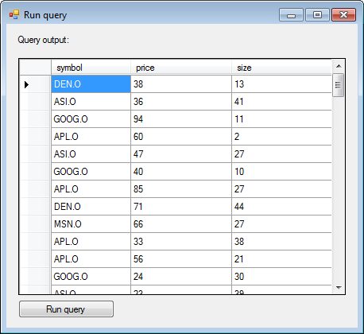  
<small>_Query output_</small>


### Building dynamic queries

As the query consists of only a single string value, it is easy to
modify and adjust dynamically based on user inputs, allowing easy
creation of GUIs to interact with kdb+.

It should be noted that while it is possible to build a dynamic query
as shown in the below example, it is vulnerable to injection attacks.
Production systems should be more robust in dealing with these kinds
of attacks, though this is beyond the scope of this white paper.

Below is an example of a class and GUI that has been constructed using
simple dropdowns and text boxes yet creates a flexible and powerful
editor we can use to query the trade table:

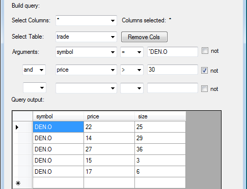  
<small>_Example GUI_</small>

To carry this out, we use a new method called `BuildQuery` (presented below) and replace the hard-coded query with:

```csharp
conn.k(BuildQuery());
```

The `BuildQuery` method takes the inputs of each textbox, checkbox and
combo box seen above and combines them to build a query to
send to kdb+. This allows those without much knowledge of kdb+ queries
or optimisation of queries to view data stored on kdb+ processes
without exposing them to the qSQL language.

This is the `BuildQuery` method, which takes all the available inputs and
creates a query string from them:

```csharp
private string BuildQuery()
{
    String check1 = "";
    String check2 = "";
    String check3 = "";
    StringBuilder queryString = new StringBuilder();

    if (checkBox1.Checked)
    {
        check1 = " not ";
    }
    if (checkBox2.Checked)
    {
        check2 = " not ";
    }
    if (checkBox3.Checked)
    {
        check3 = " not ";
    }
    if ((selectedCols.Text == null) || (selectedCols.Text == "*"))
    {
        queryString.Append("select from ");
    }
    else
    {
        queryString.Append("select " + selectedCols.Text + " from ");
    }
    queryString.Append(tableComboBox.SelectedItem);
    if (argComboBox1.SelectedItem != null)
    {
        queryString.Append(" where (" + check1 + argComboBox1.SelectedItem +
            signComboBox1.SelectedItem + argInput1.Text + ")");
        //Append the above strings and the text boxes of the UI into 
        //a single string query that can be sent to the kdb+ process
    }
    if ((argComboBox2.SelectedItem != null) && (argComboBox1.SelectedItem != null))
    {
        queryString.Append(andor1.SelectedItem + " (" + check2 +
            argComboBox2.SelectedItem + signComboBox2.SelectedItem + 
            argInput2.Text + ")");
    }
    if ((argComboBox2.SelectedItem != null) && (argComboBox1.SelectedItem != null) &&
        (argComboBox3.SelectedItem != null))
    {
        queryString.Append(andor2.SelectedItem + " (" + check3 +
            argComboBox3.SelectedItem + signComboBox3.SelectedItem + 
            argInput3.Text + ")");
    }

    return queryString.ToString();
}
```

## Managing connections

A key requirement of a business application and particularly a
trading-based application is continuity of service. Loss of business
continuity can happen for a number of reasons including server crashes
due to technical or environmental faults, a failure in the API or a
loss of connection between the two components. In this regard, it is
important that any C# application that connects to kdb+ be designed
to handle these events and fail over if necessary to backup processes
or inform the user of the problem and take measures to reconnect as
soon as possible if this is desired.

On the client side, we will utilize the `KException` and use this to
fail over to a secondary connection if a query cannot go through
successfully. This method will then attempt to run the query again
using the backup connection and publish the data as normal. This can
ensure continuity of business in the event that the kdb+ process is
rendered unable to respond.

```csharp
catch (Exception ex)
{
    if (ex.Message == "read" || ex.Message == "stop")
    {
        try
        {
            if (ex.Message == "read")
            {
                errorLabel.Text = "ALERT: using secondary connection"; 
            }
            else
            {
                errorLabel.Text = "ALERT: query timed out, using second connection";
            }
            conn = ConnectionPool.GetConnection();
            c.Flip table = GetData(queryBox.Text);
            PublishQuery(table);
        }
        catch (Exception ee)
        {
            errorLabel.Text = "ERROR - unable to connect: " + ee.Message;
        }
    }
    else
    {
        errorLabel.Text = "ERROR: " + ex.Message;
    }
}
```

In the above example, we are capturing any exception that is thrown
with the `read` error. This means the GUI was unable to successfully
send the query to the kdb+ back-end. To reconnect to the secondary
connection, we call the `ConnectionPool.GetConnection` method again and
re-send the query. The `PublishQuery` method simply publishes the result
of the query into a `DataGridView` as before. On the kdb+ side we have
two processes running the same functions and trade table but on
different ports.

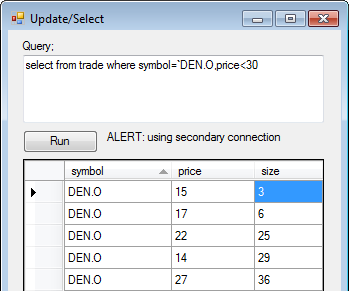

We can expand this functionality to take account of a process being
busy, such as when it is processing a large query or hanging for
another reason. In this case, we have artificially increased the
amount of time it will take the query to run to test the below code.
Timeout errors are supplied on the kdb+ end and will return a stop
error, which we can catch.

```q
q)\T 1
```

The catch statement can then be modified to trap the stop error and
rerun the query on another process:

```csharp
catch (Exception ex)
{
    if (ex.Message == "read" || ex.Message == "stop")
    {
        try
        {
            if (ex.Message == "read")
            {
                errorLabel.Text = "ALERT: using secondary connection";
            }
            else
            {
                errorLabel.Text = "ALERT: query timed out, using second connection";
            }
            conn = ConnectionPool.GetSecondaryConnection();
            c.Flip table = GetData(query);
            publishQuery(table);
        }
        catch (Exception ee)
        {
            errorLabel.Text = "ERROR - unable to connect: " + ee.Message;
        }
    } 
}
```

This is used by a method within the connection pool called
`GetSecondaryConnection`, which will use a predefined port and the same
host to open a new connection. This will add the connection to the
same pool, preventing the application from exceeding its maximum
number of connections:

```csharp
public static c GetSecondaryConnection(String user, string password)
{
    c connection;
    if ((connPool.Count > 0) && (counter < MaxPoolSize))
    {
        connection = RetrieveFromPool(HOST, SECONDARY_PORT, user, password);
    }
    else
    {
        connection = OpenConnection(HOST, SECONDARY_PORT, user, password);
        counter++; 
    }
    return connection;
}
```

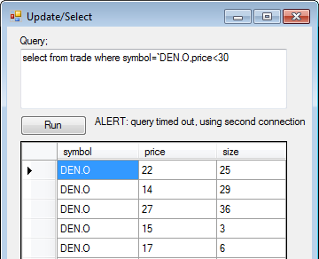


## Running analytics

Until now, we’ve been using kdb+ to deliver raw trade data to our C#
front end. While viewing raw data can be useful, many users will want
to see an enriched view of each trade. We can take the example from
[Queries](#queries) above and expand it so that each row in the `DataGridView` will be
selectable, allowing us to drill into each trade to provide further
analysis on the product being traded. The analytics will include:

-   Minimum daily price
-   Maximum daily price
-   Daily VWAP price
-   Average price

We will also plot these on a line graph to allow users to better
identify patterns and outliers throughout the day.

To calculate these, we will create a new function called `analyseData`
on the kdb+ side, which will then be called from C#.

```q
q) analyseData:{[x] 
    0!select 
    minPrice:min price, 
    maxPrice:max price, 
    vwap:size wavg price, 
    avgTab:avg price, 
    cntTab:count i by 15 xbar time.minute 
    from trade where sym=x}
```

This will calculate the min, max, average and VWAP prices for a given
symbol in 15-minute buckets. We will also write a function called
`getSummary` which provides the overall min, max, average, and VWAP for the
entire day. Note that we must unkey the table before returning it to
C# as `c.Flip` would treat this keyed table (type 99) as a dictionary
and cause an error.

```q
q) getSummary: {[x]
    0!select 
    distinct sym,
    minPrice:min price, 
    maxPrice:max price, 
    vwap:size wavg price, 
    avgTab:avg price, 
    cntTab:count i 
    from trade where sym=x}
```

If we perform these on the table trade for one symbol `` `FDP.O`` in the
kdb+ session, we can see the results:

```q
q)4#details
sym   | fullName
------| -----------------------
FDP.O | "First Derivatives PLC"
BMW.O | "BMW AG"
MSFT.O| "Microsoft Corporation"
INTC.O| "Intel Corp"
```

```q
q)getSummary[`FDP.O]
sym   minPrice maxPrice avgPrice vwap  total 
-------------------------------------------- 
FDP.O 1.021    1.109    1.064    1.064 5082

q)10#analyseData[`FDP.O]
minute minPrice maxPrice vwapPrice avgPrice totalTransactions 
------------------------------------------------------------- 
00:00  1.022    1.108    1.063     1.063    93
00:15  1.022    1.108    1.063     1.064    114
00:30  1.022    1.108    1.061     1.061    132
00:45  1.022    1.108    1.065     1.066    139
01:00  1.021    1.108    1.066     1.068    143
01:15  1.021    1.108    1.069     1.069    126
01:30  1.021    1.108    1.061     1.061    137
01:45  1.022    1.108    1.063     1.062    144
02:00  1.022    1.108    1.066     1.066    130
02:15  1.022    1.108    1.067     1.067    129
```

The methods to pull this data into a graph in the case of `analyseData`,
and text boxes in the case of `getSummary`, are simple to implement,
involving query calls to kdb+ to collect the data and then using loops
to process it.

```csharp
public Form3(String symbol, c conn)
{
    InitializeComponent();

    symLabel.Text = symbol;
    this.conn = conn;
    c.Flip details = GetData("select details from details where sym=`" + symbol); 
    compLabel.Text = c.at(details.y[0], 0).ToString();
    //This will execute the above functions using the symbol taken from the UI
    details = GetData("getSummary[`" + symbol + "]");
    GetDaily(details);

    details = GetData("analyseData[`" + symbol + "]");
    SetAxis(details);
    PopulateChart(details); //Populates Example Chart
    PopulateGrid(details);  //Populates Example Grid
}
```

This calls the methods `GetData` (which was used in the previous
section), `GetDaily`, `SetAxis` and `PopulateChart`. Note that the form
takes as arguments a string to represent the symbol and the connection
object. This is to avoid opening up new connections with each
selection. These values are supplied from the parent form in a
`CellEvent` for the `DataGrid`, making it selectable:

```csharp
private void QueryView_CellClick(object sender, DataGridViewCellEventArgs e)
{
    if (e.RowIndex >= 0) //We need to check that user has not clicked column header
    {
        int rowIndex = e.RowIndex;
        DataGridView senderGrid = (DataGridView)sender; //The cell selected
        String selSym = senderGrid.Rows[rowIndex].Cells[1].Value.ToString();
        Form3 frm3 = new Form3(selSym, conn); //Open new window with arguments 
        frm3.ShowDialog(this);
    } 
}
```

The `GetDaily` method uses the `getSummary` function on our kdb+
process to query the table and return values for that single symbol
over the entire day. We then use these to populate the boxes on the
left hand to provide a quick visual summary of the data:

```csharp
private void GetDaily(c.Flip details)
{
    min = (double)c.at(details.y[1], 0);
    max = (double)c.at(details.y[2], 0);
    dAvg = (double)c.at(details.y[3], 0);
    dVwap = (double)c.at(details.y[4], 0);
    transNo = (int)c.at(details.y[5], 0);

    minBox.Text = min.ToString("#.#####");
    maxBox.Text = max.ToString("#.#####");
    avgBox.Text = dAvg.ToString("#.#####");
    dailyVwap.Text = dVwap.ToString("#.#####");
    transNoBox.Text = transNo.ToString();
}
```

The `SetAxis` method is optional but provides a more pronounced set of
peaks and troughs in the data by setting the maximum and minimum
values of the Y axis depending on the data itself. This is done by
using a simple loop to find the maximum returned value and minimum
returned value from the subset of data. This does not include maximum
or minimum prices over the period as this would reduce the sensitivity
of the chart.

```csharp
private void SetAxis(c.Flip details)
{
    double min = 1000;
    double max = 0;
    for (int i = 0; i < details.getNoRow(); i++)
    {
        for (int j = 3; j < details.getNoColumns(); j++)
        {
            double minVal = (double)c.at(details.y[j], i);
            double maxVal = (double)c.at(details.y[j], i);

            if (minVal < min)
            {
                min = minVal;
            }
            if (maxVal > max)
            {
                max = maxVal;
            }
        }
    }
    reportChart.ChartAreas[0].AxisY.Minimum = min - 0.0025; //Add margin
    reportChart.ChartAreas[0].AxisY.Maximum = max + 0.0025; //Add Margin
}
```

Finally, we need to plot the graph itself. This is done with a
`DataVisualization.Charting.Chart` object in the GUI, with the co-ordinates in each series being added via a loop:

```csharp
private void PopulateChart(c.Flip details)
{
    for (int i = 0; i < details.getNoRow(); i++)
    {
        reportChart.Series["vwap"].Points.AddXY((c.at(details.y[0], i)).ToString(),
            (double)c.at(details.y[3], i));
        reportChart.Series["avg"].Points.AddXY((c.at(details.y[0], i)).ToString(),
            (double)c.at(details.y[4], i));
        reportChart.Series["dailyAvg"].Points.AddXY((c.at(details.y[0], i)).ToString(),
            dAvg);
        reportChart.Series["dailyVwap"].Points.AddXY((c.at(details.y[0], i)).ToString(),
            dVwap);
    } 
}
```

As clients may also wish to see the data in its grid form, a grid is
populated along with the chart with a button to switch between the two
views whenever required:

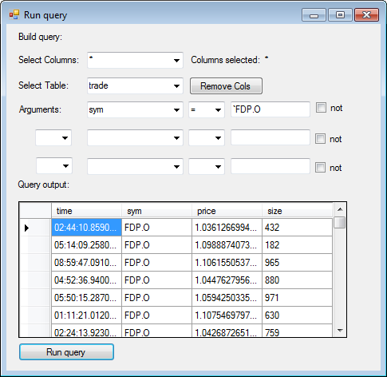

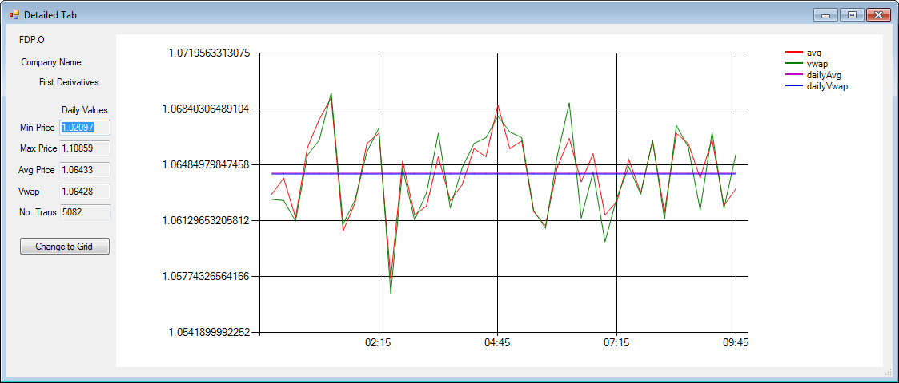  
<small>_Example Chart_</small>

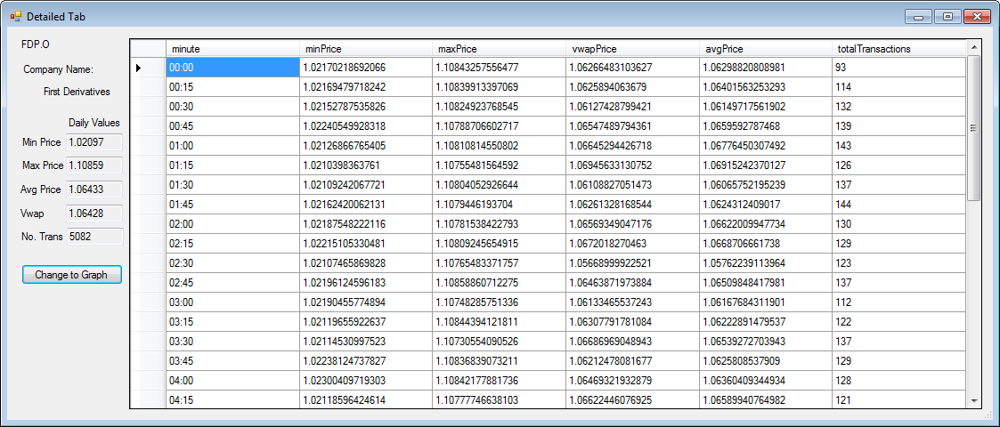  
<small>_Example Grid_</small>

Though this has only been set up to query the trade table as it
currently exists, it would not be difficult to implement a timer to
periodically query kdb+ (every minute, for example) and retain up-to-date figures and charts. By the same measure, adding the ability to
compare different symbols or different time frames would not take much
more effort, nor would giving the user the ability to choose what
period time they analyse. Furthermore, WebSockets could be used to
deliver streaming data from the kdb+ back end to the C# GUI.


## Conclusion

Despite its popularity and the potential opportunities for
development, combining C# and kdb+ remains a relatively unexploited
area. We have demonstrated a few simple processes and applications
which could be useful in developing a trading application using kdb+
and C#.

The applications developed for this example are simple in nature and
in implementation but the potential for creating more sophisticated
and powerful tools exists. We have shown very limited analytical and
GUI elements but these could be expanded upon by the use of Cascading
Style Sheets and more extensive configuration.

The paper has also demonstrated the potential versatility of kdb+, not
just in the banking and financial sectors but in all sectors where C#
is popular and a database is required for back-end data storage and
management. These examples could be pushed out to analytical or
performance-based sectors or markets inexperienced in kdb+ but
requiring tools to help utilise the rapidly growing Big Data
environment.

All examples of kdb+ were run using version 3.2 (2015.01.14). All
tests of C# were run using .NET version 4.0. The example applications
were built with Visual Studio 2010. 

The C# source code for this paper
can be found on GitHub at :fontawesome-brands-github:
[kxcontrib/csharpgui](https://github.com/kxcontrib/csharpgui).

[:fontawesome-solid-print: PDF](/download/wp/csharp-gui-a4.pdf)


## Author

**Michael Reynolds** works as a kdb+ consultant for one of the largest investment banks in the world. As part of his daily job, Michael is responsible for maintaining kdb+ databases as well as a C# APIs and plug-ins.


