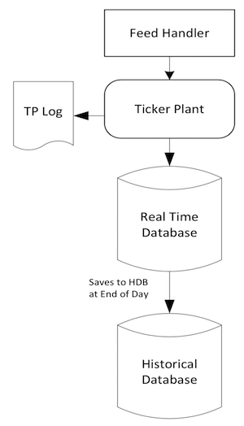
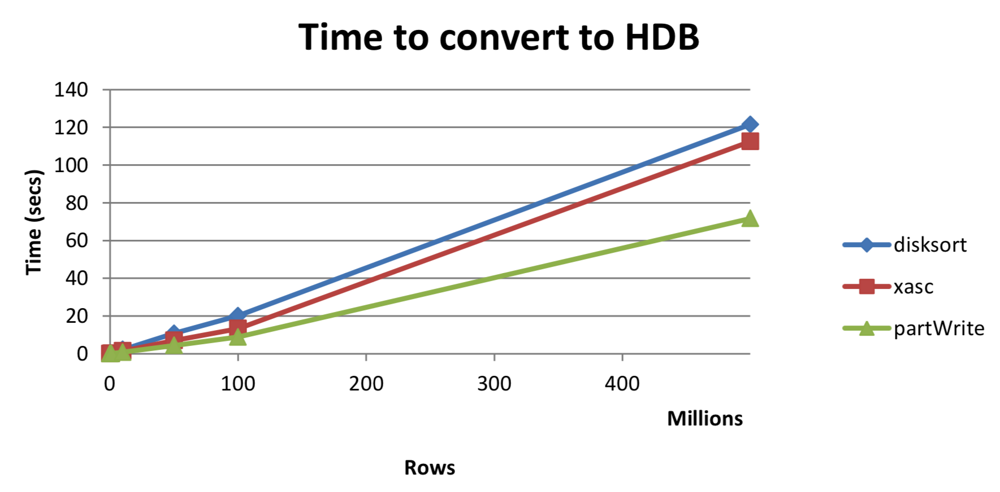
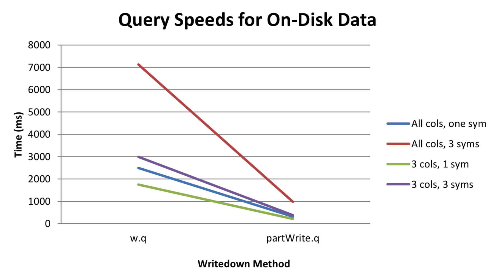

White paper
{: #wp-brand}

# Intraday writedown solutions

by [Colm McCarthy](#author)
{: .wp-author}


With data volumes in the financial-services sector continuing to grow at exponential rates, kdb+ is the data-storage technology of choice for many financial institutions due to its efficiency in storing and retrieving large volumes of data. Kdb+ is uniquely equipped to deal with these growing data volumes as it is extremely scalable and can deal with increasing data volumes with ease. As volumes grow the amount of data that can be kept in memory will eventually be limited by the RAM available on the server. There exist two types of solution to this problem.

The easiest and most obvious is the hardware solution which would involve increasing the RAM available or to scale across multiple machines, splitting the data up across servers by region, table or symbol. However, some existing users who are experiencing large data growth may be prevented from using this solution because of operational restrictions or hardware limitations.

The second solution – the software solution – continues to use a server which has inadequate RAM to store a whole day’s data. In this solution, the reliance on RAM is reduced by periodically writing the data to disk and then purging it from memory. This intraday write to disk allows a full day’s worth of data to be contained on a single server. This is not the ideal setup for kdb+ and as such will come with some penalties attached.

This paper discusses various software approaches to performing intraday writedowns in kdb+, which help overcome memory limitations.

Tests performed using kdb+ version 3.1 2014.02.08


## Standard tick setup

Most kdb+ users will be familiar with a vanilla tick setup which has a tickerplant (TP) receiving data and then logging it to disk and publishing to an in-memory realtime database (RDB) which keeps all of the current day’s data in memory. At the end of the day the RDB then commits this data to disk in a separate historical database (HDB) which stores all of this historical data. This means that the most recent data (and often most important) always has the fastest access time as it is stored in RAM.



The standard approach above can be limited by available RAM if daily data volumes grow too large. It is important to realise also that extra RAM is required to query the data, on top of what is required to keep it in memory. The extra amount required will vary depending on the different use cases and queries that are run on it. Consideration must also be given to other processes such as chained RDBs or HDBs which will need to share the resources on the server.

One solution is to write down some of the data from the RDB to a temporary directory on disk at different points throughout the day and then delete the data from memory, thus freeing up RAM. Various methods to achieve this will be discussed. Initially, the TP is publishing data asynchronously to the RDB and calling a `upd` function equivalent to the `insert` function.


## `w.q`

:fontawesome-brands-github:
[simongarland/tick](https://github.com/simongarland/tick)

This script can easily be modified to work with any standard kdb+ setup. The important changes begin with the callback function `upd` which no longer simply inserts data into the table.


```q
append:{[t;data]
  t insert data;
  if[MAXROWS<count value t;
    // append enumerated buffer to disk
    .[` sv TMPSAVE,t,`;();,;.Q.en[`:.]`. t];
    // clear buffer
    @[`.;t;0#] ] }
upd:append
```

The new `upd` function inserts the data into the table, and then if the count has exceeded a pre-configured value – `MAXROWS` – all data in the table is enumerated and is appended to a splayed table on disk in the `TMPSAVE` temporary directory. The data is then deleted from the RDB, thus reducing the memory used by the process.

At the end of the day all data has been written to disk in splayed tables, in time order. Most HDBs however are partitioned by date and a parted attribute is applied to the `sym` column, while also retaining time order within each sym. Therefore the on-disk temporary tables need to be reorganized before they can be added to the HDB as a new date partition.

The end-of-day logic is invoked by calling `.u.end`. This generally consists of writing the RDB data to a new partition and then deleting all data from the RDB tables. In `w.q`, `.u.end` is overridden to save any remaining data in the tables to the temporary directory before purging them. The data is then sorted on disk, moved from the temporary directory to a new date partition in the main HDB directory and made available to clients by reloading the HDB.

```q
/ end of day: save, clear, sort on disk, move, hdb reload
.u.end:{
  t:tables`.;
  t@:where 11h=type each t@\:`sym;
  / append enumerated buffer to disk
  {.[` sv TMPSAVE,x,`;();,;.Q.en[`:.]`. x]}each t; / clear buffer
  @[`.;t;0#];
  / sort on disk by sym and set `p#
  / {@[`sym xasc` sv TMPSAVE,x,`;`sym;`p#]}each t;
  {disksort[` sv TMPSAVE,x,`;`sym;`p#]}each t;
  / move the complete partition to final home, 
  / use mv instead of built-in r if filesystem whines
  system"r ",(1_string TMPSAVE)," ",-1_1_string .Q.par[`:.;x;`];
  / reset TMPSAVE for new day
  TMPSAVE::getTMPSAVE .z.d;
  / and notify hdb to reload and pick up new partition
  if[h:@[hopen;`$":",.u.x 1;0];h"\\l .";hclose h]; }
```

Instead of using [`xasc`](../../ref/asc.md#xasc) to sort the table, the script implements an optimized function for sorting tables on disk. This function `disksort` takes three arguments: 

-   the handle to the on-disk table
-   the column name to part the table by, generally `sym`
-   a function to [apply an attribute](../../ref/set-attribute.md), e.g. `` `p#`` for parted

```q
disksort:{[t;c;a]
  if[not`s~attr(t:hsym t)c;
    if[count t;
      ii:iasc iasc flip c!t c,:();
      if[not$[(0,-1+count ii)~(first;last)@\:ii;@[{`s#x;1b};ii;0b];0b];
        {v:get y;
          if[not$[all(fv:first v)~/:256#v;all fv~/:v;0b];
            v[x]:v;
            y set v];}[ii] each ` sv't,'get ` sv t,`.d 
            ] 
      ];
  @[t;first c;a]];
  t}
```

The table is not reorganized if the column we are parting the table by is already sorted – it may actually already have a `s` attribute applied. If the table needs to be sorted, each column is sorted in turn except if all values in a particular column are identical. Rather than check the whole column, initially just the first 256 entries are checked for uniqueness. Finally the `p` attribute is set on the `sym` column. To ensure best performance, `xasc` times should be compared with `disksort` on each table.

The `w.q` script has an additional option to delete the temporary data on exit to handle recovery scenarios. The default behavior is to delete the temporary data and recover from the TP log as it is difficult to locate the point in the TP log which was last committed to disk.


## Limitations of `w.q` 


### Downtime

When rolling the RDB at end of day it is very important to minimize the downtime of the RDB and to have the new date partition available as quickly as possible in the HDB. However, sorting very large tables on disk can add significant delay, no matter which sorting method is used. Table 1 describes the time taken (in seconds) to sort a quote table for increasing numbers of rows. The schema of the quote table is described below:

```q
quote:([]
  time:`time$();
  sym:`symbol$();
  bid:`float$();
  ask:`float$();
  bsize:`int$();
  asize:`int$() )
```

```txt
Table 1:
       rows  disksort     xasc
------------------------------
    100,000     0.017    0.011
  1,000,000     0.207    0.125
 10,000,000     2.240    1.447
 50,000,000    10.778    7.046
100,000,000    20.102   13.285
500,000,000   121.485  112.452
```

As can be seen, the amount of time taken to sort a simple table like the above is quite large. This may be a serious problem as yesterday’s data may not be queriable for a significant period each morning.


### Performance

The `w.q` solution was intended more as an effective method to alleviate RAM problems during data capture than to be a queriable process. Since the most recent data will be in-memory and everything else is splayed on disk, any queries for intraday data will have to be run against both tables and be combined. The query against the on-disk splay with no attributes will have a significant impact on query performance.

This problem may be somewhat mitigated as the most recent data is of most interest. For example, we could keep the last 5 minutes of data in memory. This could be achieved by amending the `append` function described above.

```q
append:{[t;data]
  t insert data;
  // find if any rows older than 5 mins
  if[(first t`time) <minT:.z.t-00:05;
    // append enumerated buffer to disk
    cnt:count tab:select from t where time<minT;
    .[` sv TMPSAVE,t,`;();,;.Q.en[`:.] tab];
    // clear buffer
    @[`.;t;cnt _] ] }
upd:append
```

However, for a table with many updates, a small number of rows will be written to disk very often making this approach inefficient. A better solution would be to write the data to disk on a timer. The timer could be set to trigger every 5 minutes, meaning that at all times the most recent 5 minutes worth of data in each table is available (up to 10 minutes). This would have a much smaller cost per writedown and operate more like a standard RDB.

```q
upd:insert
writedown:{[t]
  // find if any rows older than 5 mins
  if[(first t`time) <minT:.z.t-00:05;
    // append enumerated buffer to disk
    cnt:count tab:select from t where time<minT;
    .[` sv TMPSAVE,t,`;();,;.Q.en[`:.] tab];
    // clear buffer
    @[`.;t;cnt _] ] }

.z.ts:{writedown each tables[]}   // timer function
system"t 300000"                  // set timer to 5 mins
```

Alternatively, instead of keeping between 0 and `MAXROWS` in memory, we could keep between `MINROWS` and `MAXROWS`, thus guaranteeing a certain number of rows at all times in the RDB. Another consideration may be that some tables (perhaps smaller reference tables) may not need to be written down as much or indeed at all. Therefore a method to differentiate between the tables is required.

```q
WRITETBLS:`trade`quote                // tables to write down intra day 
MAXROWS:30000                         // default max value
MINROWS:20000                         // default min value
MAXTBL:(enlist `quote)!enlist 100000  // dict of max values per table 
MINTBL:(enlist `quote)!enlist 50000   // dict of min values per table
append:{[t;data]
  t insert data;
  if[t in WRITETBLS;                  // if table over its allowable size
    if[(mx:MAXROWS^MAXTBL[t])<count value t;
      // append enumerated buffer to disk (specific to table)      
      .[` sv TMPSAVE,t,`;();,;.Q.en[`:.](cnt:mx-MINROWS^MINTBL[t]) sublist `. t];
      // clear buffer
      @[`.;t;cnt _] ] ] }
upd:append
```

Using the above, the `quote` table would write down in chunks of 50,000 whenever it hit 100,000 rows, thus always having at least 50,000 in memory. The `trade` table, however, has no specific values set and so it would default back to writing in chunks of 10,000 rows, thus always having 20,000 in memory. Any other table would be unaffected and hold all data in memory until end of day.

The end-of-day (EOD) function would have to change as some of the tables are not subject to the intraday writedown. These tables can be written straight to the HDB as previously.

```q
.u.end:{
  t:tables`.;t@:where `g=attr each t@\:`sym;
  / append enumerated buffer to disk for write tables 
  {.[` sv TMPSAVE,x,`;();,;.Q.en[`:.]`. x]}each WRITETBLS; 
  / clear buffer for write tables
  @[`.;WRITETBLS;0#];
  / write normal tables down in usual manner
  {[x;t].Q.dpft[`:.;x;`sym;]each t;@[`.;t;0#]}[x;]each t except WRITETBLS;
  / special logic to sort and move tmp tables to hdb
  .u.endWTbls[x;WRITETBLS];
  / reapply grouped attribute
  @[;`sym;`g#] each t;
  / and notify hdb to reload and pick up new partition
  if[h:@[hopen;`$":",.u.x 1;0];h"\\l .";hclose h] }

/ end of day: save, clear, sort on disk, move
.u.endWTbls:{[x;t]
  t@:where 11h=type each t@\:`sym;
  / sort on disk by sym, set `p# and move
  {disksort[` sv TMPSAVE,x,`;`sym;`p#]}each t;
  system"r ",(1_string TMPSAVE)," ",-1_1_string .Q.par[`:.;x;`]; 
  / reset TMPSAVE for new day
  TMPSAVE::getTMPSAVE .z.d; }
```

Another customization, although beyond the scope of this paper, would be to have a separate process carry out the disksort-and-move for any tables that were written down intraday. This would mean the RDB could very quickly do its end-of-day processing (mostly writing any remaining rows to the temporary directory) and continue to receive data as usual from the TP.

However, while this significantly reduces downtime for the RDB, the HDB will still not be able to pick up the new partition until the `disksort` is complete which may take quite some time as detailed earlier.


## Intraday write with partitioned temporary directory

A partitioned table in kdb+ may be partitioned by one of four separate datatypes, namely date, month, year and int. Date is the most commonly used, however, our solution for intraday writedowns involves partitioning by int. Partitioning by int offers some extra possibilities that can be used to help mitigate some of the problems associated with intraday writedowns. We will also make use of the fact that symbols in an HDB are enumerated against a simple int list.

Each partition in our intraday writedown directory will store data for a single sym and the partition value will be the enumerated integer value for that sym. If, for example, in your HDB’s symfile the enumerated value of `` `eurusd`` is 223, then during the day EURUSD updates that are being written to disk will be appended to the relevant table in the 223 int partition. These entries will be sorted by time as they are being appended and so will have a `s` attribute on time in the temporary directory.

The advantage of of this method is that the data in the temporary directory can be queried much more efficiently as it is essentially partitioned by sym and sorted by time. The second processing time-saving is seen at EOD: no sort is required since the data is already divided by sym. Therefore, adding to the HDB reduces from an append-and-sort to a simple append.

This solution, of course, comes with its own drawbacks, namely added complexity in maintaining the data in the RDB and in creating the HDB partition. Also, querying the data will be much more complicated as result of the data being stored in a different format in memory and in the temporary directory. However, depending on the use case, the benefits may outweigh the drawbacks.

The solution begins by setting the following in the RDB.

```q
// config
TMPSAVE:`$":/home/local/FD/cmccarthy/wp/tmpPW" 
HDBDIR:`$":/home/local/FD/cmccarthy/wp/hdb/schema" 
WRITETBLS:`trade`quote
MAXROWS:2000; MINROWS:1000
MAXTBL:MINTBL:(0#`)!0#0N
MAXTBL[`quote]:100000; MINTBL[`quote]:0
MAXTBLSYM:MINTBLSYM:enlist[`]!enlist(0#`)!0#0N
MAXTBLSYM[`quote;`eurusd]:100000; MINTBLSYM[`quote;`eurusd]:0

// number of rows to write to disk by table by sym 
minrows:{[t;s]MINROWS^MINTBL[t]^MINTBLSYM[t;s]} 
maxrows:{[t;s]MAXROWS^MAXTBL[t]^MAXTBLSYM[t;s]} 
writecount:{[t;s]maxrows[t;s]-minrows[t;s]}

// time of last record saved to TMPSAVE by table and sym 
LASTTIME:enlist[`]!enlist(0#`)!0#0Nt
```

Initially, the location of the HDB and temporary intraday DB are set, and the tables that need to be written down intraday are defined, as well as the minimum and maximum number of rows to keep in memory. This configuration is similar to some of the customizations described in previously for `w.q`, but slightly more granular in that it allows values to be set for each table and for each sym within that table. This is done using a dictionary of dictionaries, which can be easily indexed.

```q
q)MAXTBLSYM:MINTBLSYM:enlist[`]!enlist(0#`)!0#0N
q)MAXTBLSYM[`quote;`eurgbp]:75000;MAXTBLSYM[`quote;`eurusd]:100000 
q)MAXTBLSYM[`trade;`eurgbp]:40000;MAXTBLSYM[`trade;`eurusd]:50000

q)MAXTBLSYM
     | (`symbol$())!`long$()
quote| `eurgbp`eurusd!75000 100000
trade| `eurgbp`eurusd!40000 50000
 
q)MAXTBLSYM[`trade;`eurgbp]
40000
q)MAXTBLSYM[`quote;`eurgbp`eurusd]
75000 100000
```

The `minrows`, `maxrows` and `writecount` functions simply take a table and sym and return the relevant counts. `LASTTIME` stores the time of the last record for each sym per table that was written to the temporary directory. This may be used later to help speed up some queries.

```q
// store table schemas and column names for all tables
system "l /home/local/FD/cmccarthy/wp/tick/schema.q" 
TBLSCHEMAS.:(); TBLCOLS.:()
{TBLSCHEMAS[x]:0#value x}each tables[]; {TBLCOLS[x]:cols value x}each tables[]

// create structure for tables in the in memory portion of WRITETBLS
createTblStruct:{(` sv`.mem,x,`)set TBLSCHEMAS x}
createTblStruct each WRITETBLS

// retrieve sym file from HDB directory
HDBSYM:` sv HDBDIR,`sym
sym:@[get;HDBSYM;`symbol$()]

// remove all but an empty 0 directory and symlink to HDB sym file
clearTmpDir:{[]
  system"rm -rf ",(1_string TMPSAVE),"/0/*";
  {system"rm -rf ",x;}each 1_'string` sv'TMPSAVE,'key[TMPSAVE]except`sym`0; }

// run on startup in case TMPSAVE directory is not empty i.e. recovery
clearTmpDir[]
```

The table schema is loaded and the schema of each table is stored in `TBLSCHEMAS` as they will be needed at EOD. This is also stored in a dictionary of dictionaries. The same method is used to store the column names of each table in `TBLCOLS`.

As we are planning on storing the data in the temporary directory divided by sym, it also makes sense to store it in memory divided by sym. This is achieved by creating a tree-like structure which allows us to easily retrieve data for a particular sym in a particular table. The tables are stored in a top level namespace, `.mem`. Using the `quote` table from earlier as an example:

```q
q)eurusd:eurgbp:0#quote 
q)insert[`eurusd;(2#12:10:01.000;2#`eurusd;2#1.0;2#1.1;2#10;2#20)]
q)insert[`eurgbp;(2#12:10:01.000;2#`eurgbp;2#1.0;2#1.1;2#10;2#20)]
q).mem[`quote;`eurusd]:eurusd
q).mem[`quote;`eurgbp]:eurgbp

q).mem.quote
      | +`time`sym`bid`ask`bsize`asize!(`time$();`symbol$();`float...
eurusd| +`time`sym`bid`ask`bsize`asize!(12:10:01.000 12:10:01.000;... 
eurgbp| +`time`sym`bid`ask`bsize`asize!(12:10:01.000 12:10:01.000;...

q).mem[`quote;`eurgbp]
time         sym    bid ask bsize asize 
--------------------------------------- 
12:10:01.000 eurgbp 1   1.1 10    20 
12:10:01.000 eurgbp 1   1.1 10    20
```

When creating the temporary directory initially, it is advisable to create an empty 0 partition inside it. This is to avoid the case whereby the first sym written down is mistaken by kdb+ to be a year e.g. 2021. By having an empty 0 folder kdb+ recognises the whole directory to be partitioned by integer.

It is also helpful to create a symlink to the actual HDB symfile rather than attempting to copy it between the two directories. The `clearTmpDir` function will empty the temporary directory of everything except the symlink and an empty 0 partition. This is run on startup in case there is still data in the temporary directory e.g. in case of running recovery. It is also run at EOD to clear the temporary directory in preparation for the next day.

This temporary directory will be loaded into kdb+ like a regular HDB. Thus these memory-mapped tables will override the empty tables loaded from the table schema on start up of the RDB. These on-disk tables can then be queried (akin to a HDB). As with `w.q`, the `upd` function needs to be overridden to work with this new solution.

```q
// adjusted upd
upd:{[t;x]
  $[t in WRITETBLS;
    // insert data into new table structure
    [.[` sv `.mem,t;();,';x group x`sym];
      // append to disk any sym segments over the allowable count
      writeToTmp[t;;0b]each s 
        where maxrows[t;s]<=count each .mem[t]s:distinct x`sym;];
    // if not a WRITETBL then insert as normal 
    .[insert;(t;x);{}] ]; }
```

First, the table is grouped by sym. This function assumes that bulk updates are being received. If it is known that only single rows will be received (i.e. no buffering of data in the TP) then this group is unnecessary and should be removed. Next, for each sym the rows are appended to the relevant table in the `.mem` dictionary structure.

After this there is a check, using the `maxrows` function, to determine if any of the tables for these syms have now exceeded their max allowable rowcount. If they have then this table name and sym name are sent to the `writeToTmp` function. If the table was not in the `WRITETBLS` list then it is inserted as normal.

```q
// function to append a table/sym to the temporary directory
writeToTmp:{[t;s;e]
  // enumerate against symfile
  i:sym?(HDBSYM?s);
  newTbl:not t in key LASTTIME; 
  newPart:not(`$string i)in key TMPSAVE;
  // if EOD append full table (else writecount) to int partition
  cnt:$[e;count .mem[t;s]; writecount[t;s]];
  (dir:` sv .Q.par[TMPSAVE;i;t],`)upsert .Q.en[HDBDIR] 
  $[e;.mem[t;s];cnt sublist .mem[t;s]];
  // apply sort attribute to on disk partition
  @[dir;`time;`s#];
  // update LASTTIME with time from last row appended to disk
  LASTTIME[t;s]:.mem[t;s;`time]cnt-1;
  // delete the rows that have been written and apply sort attribute
  .[`.mem;(t;s);cnt _]; .[`.mem;(t;s);@[;`time;`s#]];
  // if new partition/table then populate all partitions and reload
  if[newTbl or newPart;.Q.chk[TMPSAVE];system"l ",1_ string TMPSAVE] }
```

The `writeToTmp` function takes three arguments: the table name, symbol name and an end-of-day flag. This end-of-day flag is added because at EOD the tables will need to emptied completely instead of a partial write and purge. This function:

-   Enumerates the symbol against the sym file.
-   If a new partition or new table is being created, then `.Q.chk` is run to populate all partitions correctly and the temporary directory is reloaded.
-   The number of rows to write is calculated using `writecount` (or `count table` if EOD).
-   These rows are upserted to the correct table in the temporary directory with a sorted attribute.
-   `LASTTIME` stores the time of the last row appended to disk.
-   The rows written down are deleted from the RDB and the sorted attribute is reapplied. 

Our logic for EOD processing now becomes:

```q
// modified EOD funct
.u.end:{[d]
  // set new path for HDB and date
  hdbDateDir:` sv HDBDIR,`$string d;

  // writedown for normal tables
  {[x;t].Q.dpft[HDBDIR;x;`sym;]each t;@[`.;t;:;TBLSCHEMAS t]}[d;]each 
    tables[] except WRITETBLS;

  // flush yet to be written data to TPMSAVE (with end of day flag)
  {[t]writeToTmp[t;;1b]each where 0<count each .mem[t];
  // reset the table to initial schema and reset .mem structure
  @[`.;t;:;TBLSCHEMAS t];![`.mem;();0b;enlist t];createTblStruct t}each WRITETBLS;

  // append partitioned tables from TMPSAVE into one table in HDB
  appendHDB[WRITETBLS;hdbDateDir];

  // notify HDB to reload
  if[h:@[hopen;`$":",.u.x 1;0];h"\\l .";hclose h];

  // clear temp directory
  clearTmpDir[];

  // reset global LASTTIME
  LASTTIME::enlist[`]!enlist(0#`)!0#0Nt; }
```

The first step of this `.u.end` is to write down any tables that are not part of the intraday writedown as normal. Next, any data still left in the `.mem` structure needs to be flushed to the temporary directory with the end-of-day flag.

At this point, the tables can be emptied, and reset to their initial schema, as can the `.mem` structure. The `appendHDB` function is detailed below and moves/appends the temporary directory into a regular HDB partition.

Similarily to `w.q`, this step could easily be performed by a separate process, thus freeing up the RDB to continue to receive data for the next day. Finally, the HDB process is notified to reload, the temporary directory is cleared and the `LASTTIME` variable is reset.

The EOD move/append logic is divided into four functions/steps:

`appendCol`

```q
// # columns can be omitted (used for list columns including strings)
appendCol:{[dtDir;tbl;col;colPath]
  if[not col like"*#";upsert[` sv dtDir,tbl,col;get colPath]] }
```

: This function appends the data from one column in the temporary directory onto the similarly-named column in that table in the HDB date partition. Any `#` columns should not be moved as these will be generated automatically in the HDB partition. (`#` columns are used to store the lengths of each row for a list column.)

`appendPart`

```q
// append one temp partition table to HDB
appendPart:{[dtDir;tbl;tblPart] 
  colz:key[tblPart]except`.d;colzPaths:` sv'tblPart,'colz;
  // write each column to disk
  appendCol[dtDir;tbl]'[colz;colzPaths]; }
```

: The `appendPart` function works on a single table in a partition in the temporary directory and determines all the columns present in that table, and their fully qualified paths. `appendCol` is then invoked for each of these columns.

`appendTable`

```q
// append each temp partition table into one table in hdb
appendTable:{[dtDir;tbl;parts]
  tblParts:{[tbl;part]` sv TMPSAVE,part,tbl}[tbl]each parts;
  appendPart[dtDir;tbl;]each tblParts;
  // create .d file with sym before time as normal for hdb
  @[hdb:` sv dtDir,tbl,`; `.d; :;
    `sym`time,get[` sv (first tblParts),`.d]except`time`sym ]; }
```

: For one table, this works out the fully-qualified path of that table in each partition in the temporary directory and sends each of them to the `appendPart` function, which appends all theses table into one in the HDB date partition. Finally, a new `.d` file is created in the HDB partition as generally the order of the `sym` and `time` columns are switched compared to the RDB.

`appendHDB`

```q
// append all data in TMPSAVE to HDB
appendHDB:{[tbls;dtDir]
  parts:key[TMPSAVE]except`sym;
  appendTable[dtDir;;parts] each key` sv TMPSAVE,first parts; 
  .Q.chk[HDBDIR]; // ensure all tables present in hdb
  // apply p# to each table directory
  {[dir;t]@[` sv dir,t,`;`sym;`p#]}[dtDir] each tbls; }
```

: This function works out what partitions are present (i.e. 0 20 56 222 etc.) and also what tables. After appending all the tables using `appendTable`, `.Q.chk` is performed on the new HDB partition to ensure no table has been missed out (e.g. if a `WRITETBLS` table received no updates that day). Finally each table in the HDB date partition has a `p` (parted) attribute applied.


## Querying partitioned writedown

Before the query speeds for the different solutions can be compared, the method for querying the partitioned writedown must be discussed. The data for each table is no longer stored in one in-memory table but divided into a different table for each sym, both on-disk and in-memory. This is far from ideal but is one of the penalties that comes with this solution for dealing with low memory.

To query the partitioned portion the correct int value of the sym must be used. This is an example of how querying the intraday partition would work:

```q
q)select from quote where int=sym?`eurusd
int time         sym    bid       ask       bsize asize 
-------------------------------------------------------
3   00:00:01.000 eurusd 0.6735184 0.1566519 0     9
3   00:00:02.000 eurusd 0.4668601 0.3365118 0     1
...

q)select bid,bidsize from quote where int in sym?`gbpusd`eurusd 
sym    bid       bsize
----------------------
gbpusd 0.2159371 5
gbpusd 0.6669928 3
...
```

To query the equivalent in-memory portions of the tables. the following should be run:

```q
q)select from .mem[`quote;`eurusd]
time         sym    bid       ask       bsize asize 
------------------------------------------------
16:32:40.946 eurusd 0.6387174 0.2846485 9     7
16:32:40.947 eurusd 0.704888  0.2335227 4     9
...

q){[t;s]raze{[t;s]select sym,bid,bsize from .mem[t;s]}[t;]each s}[`quote;`gbpusd`eurusd]
sym    bid       bsize
-------------------
gbpusd 0.6735184 0
gbpusd 0.4668601 0
...
```

Obviously, we will want to run just one query/function which will do all the selects and joining of different tables and return the desired result.

Ideally, the query should always limit the results by sym and use as few columns as possible. The general solution is to select the raw columns from both in memory and on disk for each sym and combine them into one table. While Where clauses can be added to the individual selects relatively easily, group-bys or aggregations should be carried out afterwards on the combined dataset. If the aggregations were to be done while performing the selects some sort of map-reduce functionality would be necessary.

The aim should always be to get the smallest raw dataset possible and then apply aggregations and group-bys. This may mean some large queries would end up pulling in too much data (considering lack of memory was the initial problem) or unnecessarily large amounts of data are returned for relatively simple queries such as first/last. User behavior will have to adjust to take account of some of these limitations.

One approach would be to implement a general query function which will
combine results from the on-disk and in-memory datasets. If a particular user’s query is not catered for by this function, a bespoke function would need to be written for that user.

The following is an example of a query function which combines in-memory data with data from the intraday partition:

```q
// general function for querying WRITETBLS
genQuery:{[t;s;c;whr;st;et]
  // t    table name
  // s    list of syms to return, ` will return all syms
  // c    columns to return, ` will return all columns
  // whr  a functional Where clause
  // st   start of time interval
  // et   end of time interval

  // treat ` as requesting all syms
  s:(),$[s~`;key[.mem t]except`;s];

  // treat ` as requesting all cols
  c:(),$[c~`;TBLCOLS t;c];

  // use time window to narrow down search using within
  win:enlist(within;`time;(st;et));

  // if start time greater than last time on disk for sym, no disk select required
  memFlag:st>LASTTIME[t;s];

  // functional select for each sym from rdb/temp and join 
  // (unenumerating the historic data), also takes Where clause
  tabs:{[t;c;win;whr;s;memFlag]
    $[memFlag; ();
      unEnum delete int from ?[t;(enlist(=;`int;sym?s)),win,whr;0b;c!c]] ,
        ?[.mem[t;s];win,whr;0b;c!c]}[t;c;win;whr;;]'[s;memFlag];
  raze tabs }
```

The time interval specifies the times that the data requested should be within. This can be very helpful when used in conjunction with `LASTTIME`, which can tell you whether the desired data for a given sym is completely in-memory, or in-memory and on disk. If it is all in memory then the more expensive disk read can be omitted.

The actual selects are carried out using the functional format, one sym at a time and the results joined together using `raze`. It is important to un-enumerate any sym columns from the on disk selection so that when the tables are razed together the tables sym columns will be consistent and type 11 instead of a mix of 11 and 20. This is achieved using the `unEnum` function:

```q
// unenumerate the sym columns from the HDB
unEnum:{[tab]
  {[t;c]$[20=type t[c];@[t;c;:;sym@t[c]];t]}/[tab;cols tab] }
```

In the following example, the Where clause is applied to each of the individual selects before the whole result set is combined:

```q
q)genQuery[`quote;`eurusd`gbpusd;`;((<;`bsize;5);(<;`bid;0.5));10:00;23: 59]
time         sym    bid       ask       bsize asize 
-------------------------------------------------- 
10:40:21.210 eurusd 0.2440827 0.8446513 2     7 
10:40:21.240 eurusd 0.2088232 0.1153054 1     1
10:40:21.520 eurusd 0.2007019 0.1717345 2     2
...
```

The `genQuery` function could easily be expanded and refined based on what type of queries are run most often and how they are best optimized. However this function demonstrates the principles of how to query both the in-memory and the partitioned data structure together.


## Comparison of `w.q` and partitioned writedown

Although not exactly like-for-like, an attempt will be made to compare `w.q` with the partitioned writedown discussed above. This will be done in two areas: end-of-day processing speed and query speed intraday. While `w.q` was not designed to be queried intraday, it will serve as a useful benchmark for querying the partitioned writedown solution.


### End-of-day speed

This test measures how long it takes for the temporary intraday directory to be converted into a standard HDB date partition. At EOD, `w.q` must first sort the tables on disk and then move them to the HDB, whereas a simple append is all that is required for the partitioned writedown. This offers significant performance benefits for EOD processing, as seen in Table 2 and Figure 2.

This test was performed using the earlier `quote` table with varying numbers of rows.

```txt
Table 2:
       rows disksort   xasc partWrite
-------------------------------------
    100,000   0.017   0.011     0.014
  1,000,000   0.207   0.125     0.091
 10,000,000   2.240   1.447     0.826
 50,000,000  10.778   7.046     4.363
100,000,000  20.102  13.285     8.844
500,000,000 121.485 112.452    71.658
```


<small>_Figure 2: Time to convert to HDB_</small>

As can be seen, using the partitioned write offers between 40-60%
speedup on the end of day processing compared to `w.q`.


### Query speed

To compare the query speeds between `w.q` and the partitioned writedown we must compare how long it takes to select data from the respective temporary directories, keeping in mind that `w.q` stores the data as a single splayed table for each table.

To demonstrate, four different queries were run on a quote table as
defined in [_Limitations of w.q_](#limitations-of-wq) above, with 100 million rows and 10 distinct syms and the time measured in milli-seconds:

 
query             | solution    | syntax                                                                      | time
------------------|-------------|-----------------------------------------------------------------------------|----:
All cols, one sym | w.q         | ``select from quote where sym=`eurusd``                                     | 2491
All cols, 3 syms  | w.q         | ``select from quote where sym in `eurusd`eurgbp`gbpusd``                    | 7128
3 cols, 1 sym     | w.q         | ``select time,bid,bsize from quote where sym=`eurusd``                      | 1750
3 cols, 3 syms    | w.q         | ``select time,bid,bsize from quote where sym in `eurusd`eurgbp`gbpusd``     | 2990
All cols, one sym | partWrite.q | ``select from quote where int=sym?`eurusd``                                 | 312
All cols, 3 syms  | partWrite.q | ``select from quote where int in sym?`eurusd`eurgbp`gbpusd``                | 982
3 cols, 1 sym     | partWrite.q | ``select time,bid,bsize from quote where int=sym?`eurusd``                  | 209
3 cols, 3 syms    | partWrite.q | ``select time,bid,bsize from quote where int in sym?`eurusd`eurgbp`gbpusd`` |382

<small>_Table 3_</small>

  
<small>_Figure 3: Query speeds for on-disk data_</small>

As can be seen in Table 3 and Figure 3, the speed-up in query times is substantial and thus may be worth the more complex storage and querying method.


## Conclusion

This paper has outlined two different methods for dealing with insufficient RAM on a server, meaning a full day’s worth of data cannot be held in memory. It looked at `w.q`, available from GitHub, which writes to a splayed table on disk and examined a number of customizations that could be made to it.

It also detailed an alternative method using a partitioned temporary directory and how to query this data. The paper also compared the query speed and speed of the end-of-day process of the two solutions and discussed the reasons for their relative performance.

It is important to point out that any of these solutions come with their own drawbacks and as such the best solution for your individual project will depend on the specific requirements. No one solution will provide the performance and ease of use equal to just maintaining a full day’s worth of data in memory. The complexity of how that data is stored and queried will inevitably increase. However, by using some or a combination of the ideas presented in this paper, a workable solution that fits your needs may be possible.

Tests performed using kdb+ version 3.1 (2014.02.08)

[:fontawesome-solid-print: PDF](/download/wp/intraday_writedown_solutions.pdf)


## Author

**Colm McCarthy** is a kdb+ consultant who has developed data management systems for some the world's largest financial institutions. Colm is currently based in London, where he maintains an FX analytics application a major investment bank.

