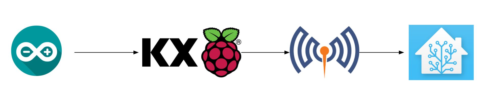
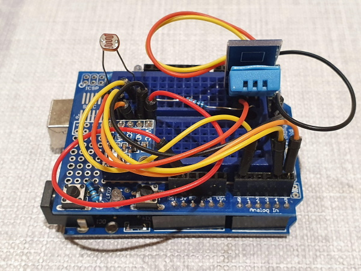
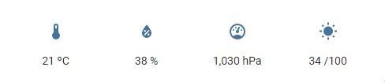
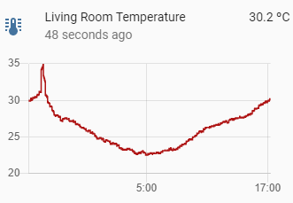
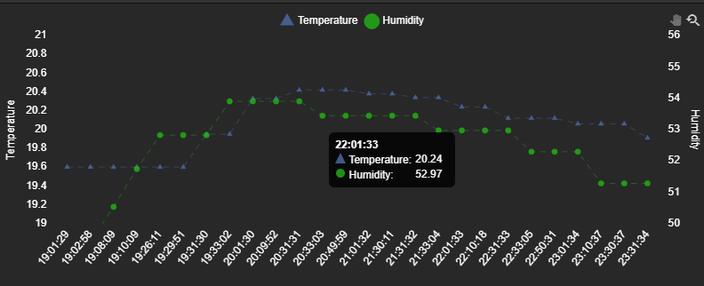

# Internet of Things with MQTT


by [Rian Ó Cuinneagáin ](#author)
{: .wp-author}

[MQTT](http://mqtt.org/) is a messaging protocol for the Internet of Things (IoT). It was designed as an extremely lightweight publish/subscribe messaging transport. It is useful for connections with remote locations where a small code footprint is required and/or network bandwidth is at a premium.

??? detail "Internet of Things"

    _Internet of Things_ denotes the network of things embedded with sensors, software, and other technologies that connect and exchange data with other devices and systems over the internet.

KX has released an MQTT interface with source code available on [GitHub](https://github.com/KXSystems/mqtt). The interface supports Linux, macOS, and Windows platforms.

This interface can be used with the enterprise [KX Streaming Analytics](https://kx.com/platform/) platform. For this paper the underlying [kdb+](../../) language will be used to explore the core functionality available.


!!! detail "Edge devices"

    Edge devices process data at its source rather than in a centralized location. This is efficient and robust: it reduces data-transfer requirements and allows edge devices to continue to operate without a consistent network link to a central server. Edge devices must be compact, efficient and even ruggedized for harsh environments.

    For this paper a [Raspberry Pi 3 Model B+](https://www.raspberrypi.org/products/raspberry-pi-3-model-b-plus/) is used as an example of an edge-class device. This is a low-powered single-board computer. The Linux ARM 32-bit release of kdb+ enables it to run on the Raspberry Pi.


## Install, set up, test

### Install and test a broker

An MQTT broker is a process that receives all messages from publishers and then routes the messages to the appropriate destination clients.
[Eclipse Mosquitto](https://mosquitto.org/) is one of [many](https://github.com/mqtt/mqtt.github.io/wiki/brokers) implementations. We will use it for our example.

Install the broker with:

```bash
sudo apt-get install mosquitto
```

To test the broker, install the command line tools:

```bash
sudo apt-get install mosquitto-clients
```

In one shell subscribe to messages on the `test` topic:

```bash
mosquitto_sub -h localhost -t test
```

In another shell publish a message on the same topic:

```bash
mosquitto_pub -h localhost -t test -m "hello"
```

You should see `hello` print to the subscriber shell.


### Install kdb+

Download the [Linux-ARM](https://kx.com/download/) version of 32-bit kdb+ and follow the [install instructions](
https://code.kx.com/q/learn/install/linux/), making sure to rename `l32arm` to `l32` during install:

```bash
unzip linuxarm.zip
mv q/l32arm q/l32
mv q ~/
```

Add `QHOME` to your `.bashrc`:

```bash
export PATH="$PATH:~/q/l32"
export QHOME="~/q"
```

### Install the KX MQTT interface

Full instructions for all platforms are on [GitHub](https://github.com/KXSystems/mqtt).
Other platforms have fewer steps, as there are pre-compiled releases. For ARM we will compile from source.

Install the dependencies needed to compile the projects:

```bash
sudo apt-get install libssl-dev cmake
```

The [Paho MQTT C client library](https://www.eclipse.org/paho/files/mqttdoc/MQTTClient/html/index.html) needs to be available before the interface can be compiled.
Take the link to the latest `paho.mqtt.c` library from its [Releases](https://github.com/eclipse/paho.mqtt.c/releases) tab on GitHub.

```bash
mkdir paho.mqtt.c
wget https://github.com/eclipse/paho.mqtt.c/archive/v1.3.8.tar.gz
tar -xzf v1.3.8.tar.gz -C ./paho.mqtt.c --strip-components=1
cd paho.mqtt.c
make
sudo make install
export MQTT_INSTALL_DIR=$(pwd)
```

Now the system is ready for the KX MQTT interface to be installed.

Generally it is best practice to use the [Releases](https://github.com/KXSystems/mqtt/releases) tab on GitHub to find a link to the latest available and download it.

```bash
wget -O mqtt.tar.gz https://github.com/KxSystems/mqtt/archive/1.0.0.tar.gz
tar -xzf mqtt.tar.gz
cd mqtt-1.0.0
```

Instead, as we wish to use some unreleased, recently-added functionality, we  compile directly from the repository source.

```bash
git clone https://github.com/KxSystems/mqtt.git
cd mqtt
```

These next steps are the same whether you are building a release or directly from source.

```bash
mkdir cmake && cd cmake
cmake ..
cmake --build . --target install
```

### Test the KX MQTT interface

Start a q process then:

1. Load the MQTT interface using [`\l`](../../basics/syscmds.md#l-load-file-or-directory)
2. Connect to the broker using [`.mqtt.conn`](https://github.com/KXSystems/mqtt/tree/master/docs/reference.md#mqttconn)
3. Subscribe to the `test` topic using [`.mqtt.sub`](https://github.com/KXSystems/mqtt/tree/master/docs/reference.md#mqttsub)

```q
\l mqtt.q
.mqtt.conn[`localhost:1883;`src;()!()]
.mqtt.sub[`test]
```

Publish a message using [`.mqtt.pub`](https://github.com/KXSystems/mqtt/tree/master/docs/reference.md#mqttpub). The default message receive [function](https://github.com/KXSystems/mqtt/tree/master/docs//reference.md#mqttmsgrcvd) will print the incoming message:

```q
q).mqtt.pub[`test;"hello"] /Publish to the test topic
2
q)(`msgsent;2)
(`msgrecvd;"test";"hello")
```

[More examples](https://github.com/KXSystems/mqtt/tree/master/docs/examples.md)


## Reading sensor data in kdb+

For an example project we will collect some sensor data and publish it to an IoT platform.
The full project is available at 
:fontawesome-brands-github:
[rianoc/environmentalmonitor](https://github.com/rianoc/EnvironmentalMonitor).




### Arduino microcontroller

The data source here is an [Arduino](https://www.arduino.cc/) microcontroller.
A microcontroller is a single chip microcomputer; it is simplified and does not run an operating system. The Arduino [UNO](https://store.arduino.cc/arduino-uno-rev3) in use here has 32KB of storage and 2KB of SRAM.

To program an Arduino we upload a single [sketch](https://www.arduino.cc/en/tutorial/sketch) to it. The file [EnvironmentalMonitor.ino](https://github.com/rianoc/EnvironmentalMonitor/blob/master/EnvironmentalMonitor.ino) is written in a C/C++ dialect which is simplified specifically to run on microcontrollers.

The uploaded sketch gathers temperature, pressure, humidity, and light readings from attached sensors and sends it back to the Raspberry Pi over a serial USB connection.




### Reading serial data with kdb+

The origins of the serial communication protocol data back to 1960. It is still in use in devices due to its simplicity.

Reading the serial data in kdb+ is quick using [named pipe](../../kb/named-pipes.md) support:

```q
q)ser:hopen`$":fifo://",COM
q)read0 ser
"26.70,35,736,1013,-5.91,26421"
```

The comma-separated fields contain:

1. Temperature (Celsius)
2. Humidity (percent)
3. Light (analog value between 0 and 100)
4. Pressure (pa)
5. Altitude (m – rudimentary estimate)
6. CRC-16 (checksum of data fields)

### Calculate an error detecting checksum

The final field is particularly important. This is a [checksum](https://en.wikipedia.org/wiki/Cyclic_redundancy_check) which enables error-detection, a requirement as serial data can be unreliable. Without this, incorrect data could be interpreted as correct. For example a temperature reading such as `26.70` missing its decimal point would be published as `2670`.

In kdb+ a function is needed to generate a checksum to compare against the one sent by the Arduino. If the two values do not match the data is rejected as it contains an error.

To create the function the logic from C functions [`crc16_update`](https://www.nongnu.org/avr-libc/user-manual/group__util__crc.html#ga95371c87f25b0a2497d9cba13190847f) and [`calcCRC`](https://github.com/rianoc/Arduino/blob/39539f3352771bb879ec47dc2cdd6dc7aab369bc/EnvironmentalMonitor/EnvironmentalMonitor.ino#L58) was created as `crc16`. The [Over](../../ref/accumulators.md#over) and [Do](../../ref/accumulators.md#do) (`/` form) accumulators are used in place of for-loops:

```q
rs:  {0b sv y xprev 0b vs x}       / right shift
xor: {0b sv (<>/)   0b vs'(x;y)}   / XOR
land:{0b sv (&).    0b vs'(x;y)}   / AND

crc16:{
  crc:0;
  {
    8{$[land[x;1]>0;xor[rs[x;1];40961];rs[x;1]]}/xor[x;y]
  } over crc,`long$x }
```

In this example temperature can be seen to have arrived incorrectly as 195 rather than 19.5:

```txt
Error with data: "195,39,12,995,8804,21287" 'Failed checksum check
```

We can see that `crc16` will return the expected checksum 21287 only if the message is valid:

```q
q)crc16 "195,39,12,995,8804"
15720
q)crc16 "19.5,39,12,995,8804"
21287
```


## Publishing data to an IoT platform

### Home Assistant

[Home Assistant](https://www.home-assistant.io/) is a home-automation platform. To make the sensor data captured available to Home Assistant, it can be published over MQTT.


### Configuring sensors

On any IoT platform metadata is needed about sensors such as their name and unit of measure.
Home Assistant includes [MQTT Discovery](https://www.home-assistant.io/docs/mqtt/discovery/) to allow sensors to configure themselves. This is a powerful feature as a sensor can send rich metadata once, allowing for subsequent sensor state updates packets to be small. This helps reduce bandwidth requirements, which is important in an IoT environment.

For this project we will use a table to store metadata:

```q
q)sensors
name        class       unit        icon                 
---------------------------------------------------------
temperature temperature "ºC"        ""                   
humidity    humidity    "%"         ""                   
light                   "/100"     "mdi:white-balance-sunny"
pressure    pressure    "hPa"       ""                   
```

<div markdown="1" class="typewriter">
name   the name of the sensor
class  Home Assistant has some predefined [classes](https://www.home-assistant.io/integrations/sensor/#device-class) of sensor
unit   the unit of measure of the sensor
icon   an icon can be chosen for the UI
</div>

As our light sensor does not fall into a known `class`, its value is left as null and we must choose an `icon`, as without a default `class` one will not be automatically populated.

Now we have defined the metadata we need to publish it. MQTT uses a hierarchy of topics when data is published. To configure a Home Assistant sensor, a message must arrive on a topic of the structure:

```txt
<discovery_prefix>/<component>/[<node_id>/]<object_id>/config
```

An example for a humidity sensor would be:

```txt
homeassistant/sensor/livingroomhumidity/config
```

The payload we publish on this topic will include our metadata along with some extra fields.

field           | content
----------------|-----------------
unique_id       | A unique ID is important throughout IoT systems to allow metadata to be related to sensor data
state_topic     | The sensor here is announcing that any state updates will arrive on this topic
value_template  | This template enables the system to extract the sensor value from the payload

A populated JSON config message for the humidity sensors:

```json
{
  "device_class":"humidity",
  "name":"humidity",
  "unique_id":"livingroomhumidity",
  "state_topic":"homeassistant/sensor/livingroom/state",
  "unit_of_measurement":"%",
  "value_template":"{{ value_json.humidity}}"
}
```

The `configure` function publishes a config message for each sensor in the table. It builds up the dictionary of information and uses [`.j.j`](../../ref/dotj.md#jj-serialize) to serialize to JSON before publishing:

```q
configure:{[s]
  msg:(!). flip (
   (`name;room,string s`name);
   (`state_topic;"homeassistant/sensor/",room,"/state");
   (`unit_of_measurement;s`unit);
   (`value_template;"{{ value_json.",string[s`name],"}}"));
   if[not null s`class;msg[`device_class]:s`class];
   if[not ""~s`icon;msg[`icon]:"mdi:",s`icon];
   topic:`$"homeassistant/sensor/",room,msg[`name],"/config";
   .mqtt.pubx[topic;;1;1b] .j.j msg; }

configure each sensors
```

Note that [`.mqtt.pubx`](https://github.com/KXSystems/mqtt/tree/master/docs/reference.md#mqttpubx) rather than the default `.mqtt.pub` is used to set [Quality of Service](#quality-of-service) to `1` and [Retain](#birth-and-last-will) to true (`1b`) for these configuration messages.

```q
.mqtt.pubx[topic;;1;1b]
```


### Quality of Service

[Quality of Service](https://www.hivemq.com/blog/mqtt-essentials-part-6-mqtt-quality-of-service-levels/) (QoS) can be specified for each published message. There are three QoS levels in MQTT:

```txt
0  At most once 
1  At least once
2  Exactly once 
```

To be a lightweight system, MQTT will default to QoS 0, a fire-and-forget approach to sending messages. This may be suitable for temperature updates in our system as one missed update will not cause any issues. However, for our configuration of sensors we do want to ensure this information arrives. In this case we choose QoS 1. QoS 2 has more overhead than 1 and here is of no benefit as there is no drawback to configuring a sensor twice.


### Retained messages

Unlike other messaging systems such as a kdb+ [tickerplant](../../learn/startingkdb/tick.md#tickerplant), [Kafka](https://github.com/KXSystems/kafka), or [Solace](https://github.com/KXSystems/solace) MQTT does not retain logs of all data that flows through the broker. This makes sense as the MQTT broker should be lightweight and able to run on an edge device with slow and limited storage. Also in a bandwidth limited environment attempting to replay large logs could interfere with the publishing of the more important real-time data.
The MQTT spec does however allow for a single message to be retained per topic. Importantly, what this allows for is that our downstream clients no matter when they connect will receive the configuration metadata of our sensors.

### Birth and Last Will

In an environment with unreliable connections it is useful to know if a system is online.

To announce that our sensor is online we can add a "birth" message. This does not have a technical meaning rather it is a practice. We will add a line in the `connect` function to publish a message to say the sensor is online as soon as we connect. QoS 2 and retain set to true are used to ensure this message is delivered.

The [Last Will and Testament](https://www.hivemq.com/blog/mqtt-essentials-part-9-last-will-and-testament/) is part of the technical spec for MQTT. When connecting to the MQTT broker we can specify the topic, message, QoS, and retain rules by populating the final dictionary `opts` parameter of `.mqtt.conn`. The broker does not immediately publish this message to subscribers. Instead it waits until there is an unexpected disconnection from the publisher.

With these added the `connect` function now looks like:

```q
connect:{
  statusTopic:`$"EnvironmentalMonitor/",room,"/status";
  opts:`lastWillTopic`lastWillQos`lastWillMessage`lastWillRetain!(statusTopic;2;"offline";1);
  .mqtt.conn[`$broker_address,":",string port;clientID;opts];
  .mqtt.pubx[statusTopic;;2;1b] "online";
  conn::1b;
  configure each sensors; }
```

Starting and stopping our process we can now see these messages being triggered.
Note the usage of the `+` character which acts as a single-level wildcard, unlike `#` which is multilevel.

```bash
mosquitto_sub -h localhost -v -t "EnvironmentalMonitor/+/status"
EnvironmentalMonitor/livingroom/status online
EnvironmentalMonitor/livingroom/status offline
```

### Retaining flexibility

Reviewing our `sensors` table and `configure` function we can spot some patterns. Optional configuration variables such as `icon` tend to be sparsely populated in the table and require specific `if` blocks in our `configure` function. Further reviewing the [MQTT Sensor](https://www.home-assistant.io/integrations/sensor.mqtt/) specification we can see there are a total of 26 optional variables. If we were to support all of these our table would be extremely wide and sparsely populated and the `configure` function would need 26 `if` statements. This is clearly something to avoid. Furthermore if a new optional variable were added to the spec we would need to update our full system and database schema.

This example shows the importance of designing an IoT system for flexibility. When dealing with many vendors and specifications the number of possible configurations is huge.

To address this in our design we change our table to move all optional parameters to an `opts` column which stores the values in dictionaries. Other databases might limit datatypes within cells but in kdb+ we can insert any possible data structure available to the language.

```q
sensors:([] name:`temperature`humidity`light`pressure;
            opts:(`device_class`unit_of_measurement!(`temperature;"ºC");
                  `device_class`unit_of_measurement!(`humidity;"%");
                  `unit_of_measurement`icon!("/100";"mdi:white-balance-sunny");
                  `device_class`unit_of_measurement!(`pressure;"hPa")) )
```

Doing this allows the sensors to include any optional variable they wish and we do not need to populate any nulls.

```q
name        opts                                                            
----------------------------------------------------------------------------
temperature `device_class`unit_of_measurement!(`temperature;"\302\272C")
humidity    `device_class`unit_of_measurement!(`humidity;"%")           
light       `unit_of_measurement`icon!("/100";"mdi:white-balance-sunny")    
pressure    `device_class`unit_of_measurement!(`pressure;"hPa")     
```

Our `configure` function is then simplified as there need not be any special handling of optional variables.

```q
configure:{[s]
  msg:(!). flip (
    (`name;room,string s`name);
    (`state_topic;"homeassistant/sensor/",room,"/state");
    (`value_template;createTemplate string[s`name]));
    msg,:s`opts;
    topic:`$"homeassistant/sensor/",msg[`name],"/config";
    .mqtt.pubx[topic;;1;1b] .j.j msg; }
```


### Publishing updates

Now that the sensors are configured the process runs a timer once per second to publish state updates.

1.  Data is read from the serial port.
2.  The checksum value is checked for correctness.
3.  The data is formatted and published to the `state_topic` we specified.

```q
pub:{[]
  rawdata:last read0 ser;
  if[any rawdata~/:("";());:(::)];
  @[{
      qCRC:crc16 #[;x] last where x=",";
      data:"," vs x;
      arduinoCRC:"J"$last data;
      if[not qCRC=arduinoCRC;'"Failed checksum check"];
      .mqtt.pub[`$"homeassistant/sensor/",room,"/state"] .j.j sensors[`name]!"F"$4#data;
    };
    rawdata;
    {-1 "Error with data: \"",x,"\" '",y}[rawdata]
  ]; }

.z.ts:{
  if[not conn;connect[]];
  pub[] }

\t 1000
```

Here we use `.mqtt.pub` which defaults QoS to `0` and Retain to false (`0b`) as these state updates are less important.

An example JSON message on the topic `homeassistant/sensor/livingroom/state`:

```json
{"temperature":21.4,"humidity":38,"light":44,"pressure":1012}
```

It can be noted here that we published a configure message per sensor but for state changes we are publishing a single message. This is chosen for efficiency to reduce the overall volume of messages the broker must relay. The `value_template` field we populated allows Home Assistant to extract the data for each sensor from the JSON collection. This allows for the number of sensors per update to be flexible.

### Reducing data volume

In our example we are publishing four values every second. In a day this is 86k updates, resulting in 344k sensor values being stored in our database.
Many of these values will be repeated. As these are state changes and not events there is no value in storing repeats. In an IoT project for efficiency this should be addressed at the source and not the destination.
This edge processing is necessary to reduce the hardware and network requirements throughout the full stack.

The first step we take is to add a `lastPub` and `lastVal` column to our `sensors` metadata table:

```q
sensors:([] name:`temperature`humidity`light`pressure;
            lastPub:4#0Np;
            lastVal:4#0Nf;
            opts:(`device_class`unit_of_measurement!(`temperature;"ºC");
                  `device_class`unit_of_measurement!(`humidity;"%");
                  `unit_of_measurement`icon!("/100";"mdi:white-balance-sunny");
                  `device_class`unit_of_measurement!(`pressure;"hPa")) )
```

```q
name        lastPub lastVal opts                                                            
--------------------------------------------------------------------------------------------
temperature                 `device_class`unit_of_measurement!(`temperature;"\302\272C")
humidity                    `device_class`unit_of_measurement!(`humidity;"%")           
light                       `unit_of_measurement`icon!("/100";"mdi:white-balance-sunny")    
pressure                    `device_class`unit_of_measurement!(`pressure;"hPa")    
```

Then rather than publishing any new data from a sensor when available we instead pass it through a `filterPub` function.

From:

```q
.mqtt.pub[`$"homeassistant/sensor/",room,"/state"] .j.j sensors[`name]!"F"$4#data
```

To:

```q
filterPub "F"$4#data
```

The function will publish data only when either the sensor value changes or if 10 minutes has elapsed since the last time a sensor had an update published:

```q
filterPub:{[newVals]
  now:.z.p;
  toPub:exec (lastPub<.z.p-0D00:10) or (not lastVal=newVals) from sensors;
  if[count where toPub;
    update lastPub:now,lastVal:newVals[where toPub] from `sensors where toPub;
    msg:.j.j exec name!lastVal from sensors where toPub;
    .mqtt.pub[`$"homeassistant/sensor/",room,"/state";msg];
  ]; }
```

Setting the 10-minute minimum publish window is important to act as a heartbeat. This will ensure that the difference between a broken or disconnected sensor can be distinguished from a sensor whose value is simply unchanged over a large time window. Also, considering MQTT does not retain values, we wish to ensure any new subscribers will receive a timely update on the value of all sensors.

Now when we start our process there are fewer updates and only sensors with new values are included:

```txt
homeassistant/sensor/livingroom/state "{\"temperature\":21.1,\"humidity\":38,\"light\":24,\"pressure\":1002}"
homeassistant/sensor/livingroom/state "{\"light\":23}"
homeassistant/sensor/livingroom/state "{\"light\":24}"
homeassistant/sensor/livingroom/state "{\"pressure\":1001}"
homeassistant/sensor/livingroom/state "{\"temperature\":21.2,\"pressure\":1002}"
homeassistant/sensor/livingroom/state "{\"temperature\":21.1}"
```

The UI also needed more complex `value_template` logic in metadata to extract the data if present but use the prevailing state value if not.

From:

```jinja2
{{ value_json.pressure }}
```

To:

```jinja2

  {{ value_json.pressure }}

  {{ states('sensor.livingroompressure') }}

```

Rather than daily 86k updates resulting in 344k sensor values being stored in our database this small changes reduced those to 6k updates delivering 6.5k sensor values. Reducing updates by 93% and stored values by 98%!


### Home Assistant UI

Home Assistant includes a UI to view data. A display for the data can be configured in the UI or defined in YAML.

```yaml
type: glance
entities:
  - entity: sensor.livingroomtemperature
  - entity: sensor.livingroomhumidity
  - entity: sensor.livingroompressure
  - entity: sensor.livingroomlight
title: Living Room
state_color: false
show_name: false
show_icon: true
```

An overview of all the sensors:



Clicking on any one sensor allows a more detailed graph to be seen:




## Creating a sensor database

:fontawesome-brands-github:
[rianoc/qHomeAssistantMQTT](https://github.com/rianoc/qHomeAssistantMQTT)


### Subscribing to data in kdb+

Subscribing to the published data from another kdb+ process is quick. MQTT uses `/` to split a topic hierarchy and when subscribing `#` can be used to subscribe to all subtopics:

```q
\l mqtt.q
.mqtt.conn[`localhost:1883;`src;()!()]
.mqtt.sub `$"homeassistant/#"
```

Immediately on connection the broker publishes any retained messages on topics:

```q
(`msgrecvd;"homeassistant/sensor/livingroomtemperature/config";"{\"device_class\":\"temperature\",\"name\":\"temperature\",\"unique_id\":\"livingroomtemperature\",\"state_topic\":\"homeassistant/sensor/livingroom/state\",\"unit_of_measurement\":\"\302\272C\",\"value_template\":\"{{ value_json.temperature}}\"}")
(`msgrecvd;"homeassistant/sensor/livingroomhumidity/config";"{\"device_class\":\"humidity\",\"name\":\"humidity\",\"unique_id\":\"livingroomhumidity\",\"state_topic\":\"homeassistant/sensor/livingroom/state\",\"unit_of_measurement\":\"%\",\"value_template\":\"{{ value_json.humidity}}\"}")
(`msgrecvd;"homeassistant/sensor/livingroomlight/config";"{\"device_class\":\"None\",\"name\":\"light\",\"unique_id\":\"livingroomlight\",\"state_topic\":\"homeassistant/sensor/livingroom/state\",\"unit_of_measurement\":\"hPa\",\"value_template\":\"{{ value_json.light}}\"}")
(`msgrecvd;"homeassistant/sensor/livingroompressure/config";"{\"device_class\":\"pressure\",\"name\":\"pressure\",\"unique_id\":\"livingroompressure\",\"state_topic\":\"homeassistant/sensor/livingroom/state\",\"unit_of_measurement\":\"/1024\",\"value_template\":\"{{ value_json.pressure}}\"}")
```

Any newly published messages will follow.

```q
(`msgrecvd;"homeassistant/sensor/livingroom/state";"{\"temperature\":21.5,\"humidity\":38,\"light\":172,\"pressure\":1011}")
(`msgrecvd;"homeassistant/sensor/livingroom/state";"{\"temperature\":21.5,\"humidity\":37,\"light\":172,\"pressure\":1012}")
```


### Storing MQTT sensor data

Home Assistant does include an [SQLite](https://www.sqlite.org/index.html) embedded database for storing data. However it is not suitable for storing large amounts of historical sensor data.
Instead we can look to kdb+ to do this for us.


#### Config data

Storing config data is straightforward by monitoring for incoming messages in topics matching `homeassistant/sensor/*/config`.
As each new sensor configuration arrives we extract its `state_topic` and subscribe to it.

```q
sensorConfig:([name:`$()] topic:`$();state_topic:`$();opts:())
discoveryPrefix:"homeassistant"
.mqtt.sub `$discoveryPrefix,"/#"

.mqtt.msgrcvd:{[top;msg]
  if[top like discoveryPrefix,"/sensor/*/config";
    opts:.j.k msg;
    .mqtt.sub `$opts`state_topic;
    `sensorConfig upsert (`$opts`name;`$top;`$opts`state_topic;opts)]; }
```

This data then populates the `sensorConfig` table.

```q
q)first sensorConfig
topic      | `homeassistant/sensor/livingroomtemperature/config
state_topic| `EnvironmentalMonitor/livingroom/state
opts       | `name`state_topic`value_template`device_class`unit_of_measurement!("livingroomtemperature";"EnvironmentalMonitor/livingroom/state";"{{ value_json.temperature }}{{ states('sensor.livingroomtemperature') }}";"temperature";"\302\272C")
```


#### State data

As configuration has subscribed to each `state_topic`, sensor state data will begin to arrive.
A new `if` block can then be added to check if the incoming `topic` matches a configured `state_topic` in the `sensorConfig` table and store it if so.

```q
  if[(`$top) in exec state_topic from sensorConfig;
     store[now;top;msg]];
```


#### Extracting data from JSON templates using Jinja

The `value_template` system used by Home Assistant is a Python templating language called [Jinja](https://jinja.palletsprojects.com/).
To use this in kdb+ we can use [PyKX](https://code.kx.com/pykx) to expose Python functions.

We can write a short `qjinja.py` script to expose the exact function we need:

```python
from jinja2 import Template
import json

def states(sensor):
    return None;

def extract(template, msg):
    template = Template(template)
    template.globals['states'] = states
    return template.render(value_json=json.loads(msg));
```

Then `qjinja.q` can import and expose the Python library:

```q
.qjinja.init:{[]
  .qjinja.filePath:{x -3+count x} value .z.s;
  slash:$[.z.o like "w*";"\\";"/"];
  .qjinja.basePath:slash sv -1_slash vs .qjinja.filePath;
  if[not `p in key `;system"l ",getenv[`QHOME],slash,"p.q"];
  .p.e"import sys";
  .p.e "sys.path.append(\"",ssr[;"\\";"\\\\"] .qjinja.basePath,"\")";
  .qjinja.py.lib:.p.import`qjinja; }

.qjinja.init[]

.qjinja.extract: .qjinja.py.lib[`:extract;;]
```

Values can now be extracted easily in kdb+:

```q
q)tmp:"{{ value_json.temperature }}"  / template
q)msg:"{\"temperature\":22.2,\"humidity\":37,\"light\":20,\"pressure\":1027}"
q).qjinja.extract[tmp;msg]
"22.2"
```

The more complex templates are also handled by making a `states` function available to the template: `template.globals['states'] = states`

```q
q)tmp"{{ value_json.temperature }}{{ states('sensor.livingroomtemperature') }}"
q)msg:"{\"humidity\":37,\"light\":20,\"pressure\":1027}"
q).qjinja.extract[tmp;msg]
"None"
```

Now that the correct information can be extracted we can check each message arriving and apply the correct set of `value_template` values:

```q
store:{[now;top;msg]
  sensors:select name,value_template:opts[;`value_template] 
    from sensorConfig where state_topic=`$top;
  sensors:update 
    time:now,
    val:{{$[x~"None";0Nf;"F"$x]}.qjinja.extract[x;y]}[;msg] each 
      value_template from sensors;
  `sensorState insert value exec time,name,val from sensors where not null val }
```


#### Persisting data to disk

For the purposes of this small project the persisting logic is kept to a minimum. The process keeps data in memory for one hour and then persists to disk.
A blog on [partitioning data in kdb+](https://kx.com/blog/partitioning-data-in-kdb/) goes into detail on this type of storage layout and methods which could be applied to further manage memory usage which is critical in a low-power edge node.
The same process exposes both in-memory and on-disk data. To enable this the on-disk table names are suffixed with `Hist`.

```q
sensorConfigHist:([] name:`$();topic:`$();state_topic:`$();opts:())
sensorStateHist:([] int:`int$();time:`timestamp$();name:`$();state:())

writeToDisk:{[now]
  .Q.dd[HDB;(`$string cHour;`sensorStateHist;`)] upsert .Q.ens[HDB;sensorState;`sensors];
  `sensorState set 0#sensorState;
  `cHour set hour now;
  .Q.dd[HDB;(`sensorConfigHist;`)] set .Q.ens[HDB;0!sensorConfig;`sensors];
  system"l ",1_string HDB; }
```


#### Creating a basic query API

A very basic query API can be created to extract the data from the system.

```q
queryState:{[sensor;sTime;eTime]
  hist:delete int from select 
    from sensorStateHist 
    where int within hour (sTime;eTime),name like sensor,time within (sTime;eTime);
  realtime:select 
    from sensorState 
    where name like sensor, time within (sTime;eTime);
  hist,realtime }
```

By using `like` a wildcard `*` can then be passed to return several sensors:

```q
q)queryState["0x00124b001b78047b*";2021.03.05D0;2021.03.07D0]
time                          name                           state
------------------------------------------------------------------
2021.03.06D19:01:29.912672000 0x00124b001b78047b battery     64   
2021.03.06D19:01:29.912672000 0x00124b001b78047b temperature 19.6 
2021.03.06D19:01:29.912672000 0x00124b001b78047b humidity    48.22
2021.03.06D19:01:29.912672000 0x00124b001b78047b linkquality 139  
2021.03.06D19:02:58.884287000 0x00124b001b78047b battery     64   
2021.03.06D19:02:58.884287000 0x00124b001b78047b temperature 19.6 
2021.03.06D19:02:58.884287000 0x00124b001b78047b humidity    49.42
2021.03.06D19:02:58.884287000 0x00124b001b78047b linkquality 139  
```


## Zigbee

[Zigbee](https://zigbeealliance.org/) is a wireless mesh network protocol designed for use in IoT applications. Unlike wi-fi its data transmission rate is a low 250 kbit/s but its key advantage is simplicity and lower power usage.

A device such as a [Sonoff SNZB-02](https://sonoff.tech/product/smart-home-security/snzb-02) temperature-and-humidity sensor can wirelessly send updates for months using only a small coin-cell battery.

Most often to capture data a bridge/hub device is needed which communicates over both Zigbee and wi-fi/Ethernet. An example of this would be a [Philips Home Bridge](https://www.philips-hue.com/en-us/p/hue-bridge/046677458478#overview), used to communicate with their range of Hue smart bulbs over Zigbee. In our example a more basic device is used, a [CC2531 USB Dongle](https://www.itead.cc/cc2531-usb-dongle.html) which captures data from the Zigbee radio and communicates this back to the Raspberry Pi over a serial port.


### Zigbee2MQTT

To bring the data available from the USB dongle on our MQTT IoT ecosystem we can use the [Zigbee2MQTT](https://www.zigbee2mqtt.io/) project. This reads the serial data and publishes it on MQTT. Many devices are supported including our [SNZB-02](https://www.zigbee2mqtt.io/devices/SNZB-02.html) sensor.
Through configuration we can also turn on the supported [Home Assistant integration](https://www.zigbee2mqtt.io/integration/home_assistant)

```yaml
homeassistant: true
permit_join: false
mqtt:
  base_topic: zigbee2mqtt
  server: 'mqtt://localhost'
serial:
  port: /dev/ttyACM0
```

After running Zigbee2MQTT `mosquitto_sub` can quickly check if data is arriving

```bash
mosquitto_sub -t 'homeassistant/sensor/#' -v
```

The sensor can be seen configuring four sensors:

1. `temperature`
2. `humidity`
3. `battery`
4. `linkquality`

The topics follow the pattern we have seen previously:

```txt
homeassistant/sensor/0x00124b001b78047b/temperature/config
```

The configuration message includes many more fields that we populated in our basic sensors:

```json
{
   "availability":[
      {
         "topic":"zigbee2mqtt/bridge/state"
      }
   ],
   "device":{
      "identifiers":[
         "zigbee2mqtt_0x00124b001b78047b"
      ],
      "manufacturer":"SONOFF",
      "model":"Temperature and humidity sensor (SNZB-02)",
      "name":"0x00124b001b78047b",
      "sw_version":"Zigbee2MQTT 1.17.0"
   },
   "device_class":"temperature",
   "json_attributes_topic":"zigbee2mqtt/0x00124b001b78047b",
   "name":"0x00124b001b78047b temperature",
   "state_topic":"zigbee2mqtt/0x00124b001b78047b",
   "unique_id":"0x00124b001b78047b_temperature_zigbee2mqtt",
   "unit_of_measurement":"°C",
   "value_template":"{{ value_json.temperature }}"
}
```

Subscribing to the `state_topic` sensor updates can be shown:

```bash
mosquitto_sub -t 'zigbee2mqtt/0x00124b001b78047b' -v
zigbee2mqtt/0x00124b001b78047b {"battery":64,"humidity":47.21,"linkquality":139,"temperature":19.63,"voltage":2900}
```

### Capturing Zigbee sensor data in kdb+

Because we designed our DIY sensors to meet a spec our system in fact needs no changes to capture the new data.
The choice to break optional variables out to the `opts` proves useful here as many more fields have been populated:

```q
q)sensorConfig`$"0x00124b001b78047b temperature"
topic      | `homeassistant/sensor/0x00124b001b78047b/temperature/config
state_topic| `zigbee2mqtt/0x00124b001b78047b
opts       | `availability`device`device_class`json_attributes_topic`name`state_topic`unique_id`unit_of_measu..
```

Updates for all four configured sensors are available in the `sensorState` table:

```q
q)select from sensorStateHist where name like "0x00124b001b78047b*"
int    time                          name                           state
-------------------------------------------------------------------------
185659 2021.03.06D19:10:09.694120000 0x00124b001b78047b battery     64   
185659 2021.03.06D19:10:09.694120000 0x00124b001b78047b temperature 19.6 
185659 2021.03.06D19:10:09.694120000 0x00124b001b78047b humidity    51.74
185659 2021.03.06D19:10:09.694120000 0x00124b001b78047b linkquality 139  
185659 2021.03.06D19:26:11.522660000 0x00124b001b78047b battery     64   
185659 2021.03.06D19:26:11.522660000 0x00124b001b78047b temperature 19.6 
185659 2021.03.06D19:26:11.522660000 0x00124b001b78047b humidity    52.82
185659 2021.03.06D19:26:11.522660000 0x00124b001b78047b linkquality 139  
```


## Graphing the data

Using [KX Dashboards](https://code.kx.com/dashboards/) the captured data can then be graphed:




## Conclusion

The world of IoT is complex, with many languages, systems, and protocols. To be successful interoperability and flexibility are key. Here with the MQTT interface, along with pre-existing Python and JSON functionality, kdb+ shows what can be achieved with a subset of its many [interfaces](../../interfaces/index.md). Then, as a database layer, kdb+ shows its flexibility allowing us to tailor how data is captured, stored, and queried based on the data, use case, and hardware for the application.

:fontawesome-solid-hand-point-right:
_KX POC Blog Series_: 
[Edge Computing on a Low-Profile Device](https://kx.com/blog/kx-poc-blog-series-edge-computing-on-a-low-profile-device/)

:fontawesome-brands-github:
[rianoc/EnvironmentalMonitor](https://github.com/rianoc/EnvironmentalMonitor)
<br>
:fontawesome-brands-github:
[rianoc/qHomeAssistantMQTT](https://github.com/rianoc/qHomeAssistantMQTT)
<br>
:fontawesome-brands-github:
[rianoc/MQTT_blog](https://github.com/rianoc/MQTT_blog)
<br>
:fontawesome-brands-github:
[rianoc/qZigbee](https://github.com/rianoc/qZigbee)


## Author


{: .small-face}

**Rian Ó Cuinneagáin** is a manager at KX.
Rian is currently based in Dublin working on industrial applications of kdb+.
<br>
[:fontawesome-solid-envelope:](mailto:rocuinneagain@kx.com?subject=White paper: IoT with MQTT) 
&nbsp;
[:fontawesome-brands-linkedin:](https://www.linkedin.com/in/rocuinneagain/)
&nbsp;
[:fontawesome-brands-twitter:](https://twitter.com/rianoc)

Other papers by Rian Ó Cuinneagáin
{: .publications}

<ul markdown="1" class="publications">
-   [Kdb+/q Insights: Parsing data in kdb+](https://kx.com/blog/kx-product-insights-parsing-data-in-kdb/)
-   [Kdb+/q Insights: Parsing JSON files](https://kx.com/blog/kdb-q-insights-parsing-json-files/)
-   [Partitioning data in kdb+](https://kx.com/blog/partitioning-data-in-kdb/)
-   [How to Avoid a Goat in Monte Carlo – Elegantly](https://kx.com/blog/how-to-avoid-a-goat-in-monte-carlo-elegantly/)
</ul>
