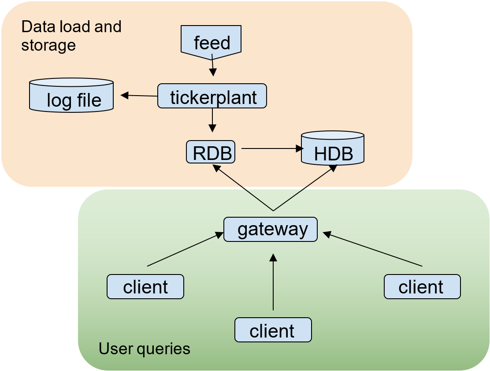
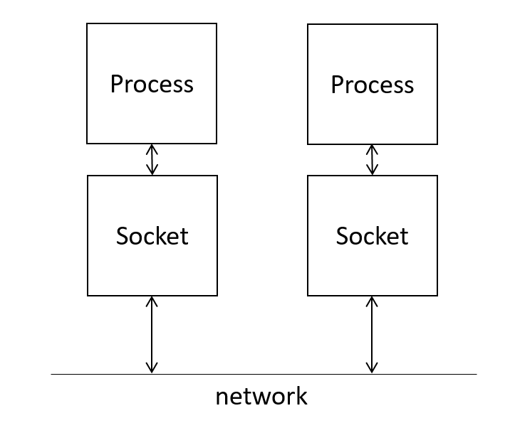

White paper
{: #wp-brand}

# Interprocess communications

by [Katrina McCormack](#author)
{: .wp-author}


!!! summary

    A look at the mechanisms underlying interprocess communication in kdb+ begins with an overview of TCP connections and discusses applications for using Unix domain sockets across processes on a local host, and the use of TLS/SSL for more secure communication. It describes the main message handlers invoked in the process of opening a connection, running a query and closing a connection to a process, with various examples to illustrate each step. 

    It then takes a closer look at how IPC is applied in a vanilla tickerplant application, from when the data is first received from an upstream feed process to how tables are saved at the end of the day.


Microsoft defines Interprocess Communications (IPC) as the collective term for mechanisms facilitating communications and data sharing between applications. This paper explores some core concepts related to IPC in kdb+ before investigating the role of IPC in a kdb+ tick application.


## Core concepts

### Set port

A port is used by TCP as a communications endpoint: in other words, a point through which information flows to and from a process.

A kdb+ process can be set to listen on a port in two ways. For this example, we will listen on port 1234 using either

-   `\p 1234` or `system"p 1234"` within the process
-   `-p 1234` on the command line at process startup

To stop listening on a port, set the server to listen on port 0:

```q
q)\p
4567i
q).z.i
2493i
q)\p 5678
q)\p
5678i
q)system"p 6789"
q)\p
6789i
q)\p 0
```

It is possible to see this listening port using `lsof` (list all open files) to view TCP connections for this PID. If the port number is changed, using `lsof` will show the process listening on the new port only.

```q
q).z.i
97082i
q)\p 4567
q)\p 6789
```

```bash
$ lsof -p 97082 -i tcp -a
$ lsof -p 97082 -i tcp -a
COMMAND   PID    USER   FD   TYPE  DEVICE SIZE/OFF NODE NAME
q       97082 katrina    4u  IPv4 2140799      0t0  TCP *:4567 (LISTEN)

$ lsof -p 97082 -i tcp -a
COMMAND   PID    USER   FD   TYPE  DEVICE SIZE/OFF NODE NAME
q       97082 katrina    4u  IPv4 2149383      0t0  TCP *:6789 (LISTEN)
```

Port numbers between 0 and 1024 are called _system_ or _well known_ ports and are used by the application layer of the Internet Protocol suite for the establishment of host-to-host connectivity. Root privileges are required to open these ports. Ports 1024 to 49151 are called _user_ ports. Some of these may also be reserved; for example, port 8080 is commonly used as a server port. 

:fontawesome-brands-wikipedia-w:
[List of TCP and UDP port numbers](https://en.wikipedia.org/wiki/List_of_TCP_and_UDP_port_numbers "Wikipedia")

Both system and user ports are used by transport protocols to indicate an application or service.


### Connecting to a process listening on a port

When the client process executes the function `hopen` with a server’s details as its argument, it starts a connection and returns a positive integer used to identify the connection handle. This integer is assigned to a variable, `h` in the following examples demonstrating different connection protocols.

### TCP

`hopen` can be used to open a TCP handle to another process by passing the process host and port as argument: user and password can also be included.

```q
q)h:hopen`:localhost:4567
q)h"2+2"
4
```

The hostname can be omitted when connecting to a process running on the same machine.

```q
q)i:hopen`::4567
q)i"2+2"
4
```

This can also be written with the target process port number only:

```q
q)j:hopen 4567
q)j"2+2"
4
```

It is also worth noting that for the purposes of this white paper we will be assigning open handles to variables; but this is not required.

```q
q)hopen 4567
4i
q)4"1+1"
2
q)4"\\p"
4567i
```

Using `netstat` we can see the process listening on port 4567 and the established TCP connection between the client and server processes.

```bash
$ netstat | grep 4567
tcp        0      0 localhost:50254         localhost:4567          ESTABLISHED
tcp        0      0 localhost:4567          localhost:50254         ESTABLISHED
unix  3      [ ]         DGRAM                    14567    
```

It is also possible to open a ‘one-shot’ connection to another process. This will establish a connection for only as long as it takes to execute the query. Since V4.0 a one-shot query can be run with a timeout, as in the second example below.

```q
q)`::4567"2+2"
4
q)`::[(`::4567;100);"1+1"]
2
```

It is possible for a kdb+ process to have too many open connections. 
The max is defined by the system limit for protocol (operating system configurable). Prior to 4.1t 2023.09.15, the limit was hardcoded to 1022.
After the limit is reached, you see the error `'conn` on the server process. (All successfully opened connections remain open.)


```q
q)\p 5678
q)'conn
```

```q
q)openCon:{hopen 5678}
q)do[2000;openCon[]]
'hop. OS reports: Connection reset by peer
  [1]  openCon:{hopen 5678}
                ^
```

`hopen` also accepts a timeout parameter in its argument. This will prevent the process hanging when attempting to connect to a process which is alive but unresponsive; for example, due to a long running query.

```q
q)// system"sleep 30" running on port 4567
q)l:hopen(`::4567;1)
'timeout
  [0]  l:hopen(`::4567;1)
         ^
```

Attempts to connect to a non-existent process signal an error.

```q
q)l:hopen 5678
'hop. OS reports: Connection refused
  [0]  l:hopen 5678
         ^
```

Opening a connection to the current port will execute any queries on handle 0, the file descriptor for standard input.

```q
q)\p 4567
q)h:hopen 4567
q)h
0i
q)h"0N!`hi"
`hi
`hi
```

`hopen` can also be used to open a handle to a file location. This is discussed below with regard to writing to a log file within a kdb+ tickerplant setup. 

:fontawesome-solid-book:
[`hopen`](../../ref/hopen.md)


### Unix Domain Socket

A Unix Domain Socket ([UDS](../../basics/listening-port.md#unix-domain-socket)) can be used for connections between processes running on the same host. A UDS allows bidirectional data exchange between processes running on the same machine. They are similar to internet sockets (TCP/IP socket) but, rather than using a network protocol, all communication occurs entirely within the operating system kernel. Using a UDS to communicate when processes are on the same machine will avoid some checks and operations in the TCP/IP protocol, making them faster and lighter. There is no Windows equivalent.

```q
q)h:hopen`:unix://4567
q)h
4i
```

Use `netstat` to view this connection vs tcp

```bash
// unix domain socket established
$ netstat |grep 4567
unix  3      [ ]         DGRAM                    14567    
unix  3      [ ]         STREAM     CONNECTED     100811   @/tmp/kx.4567
```

### TLS/SSL

The TLS protocol is used to communicate across a network in a way designed to prevent eavesdropping and tampering. It is possible to initiate a TLS connection between kdb+ processes for secure communication. Note that a TLS connection requires certificates to be in place before initializing and it should currently only be considered for long-standing, latency-insensitive, low-throughput connections given high overheads. 

:fontawesome-solid-graduation-cap:
[Secure Socket Layer](../../kb/ssl.md)


### Negative ports

A kdb+ process can be started in multithreaded input mode by setting a negative port number. A multithreaded process will use separate threads for every process that connects, which means that each client request can be executed on a separate CPU.

Although secondary processes are used to farm queries out to multiple processes, they still have a single-threaded input queue. By using a negative port number, it is possible to multithread that queue too.

```bash
$ q -p -4567
KDB+ 4.0 2020.03.17 Copyright (C) 1993-2020 Kx Systems
l64/ 2(16)core 1959MB katrina ubuntu 127.0.1.1 EXPIRE 2021.05.05 kmccormack@kx.com ..

q)\p
-4567i
```

Connections can be opened to this process in the same way as described previously for positive port numbers.

Note that there are a number of restrictions in multithreaded mode:

-   Queries cannot update globals
-   `.z.pc` is not called on disconnect
-   `.z.W` has a view of main thread sockets only
-   Cannot send async messages
-   Cannot serve HTTP requests
-   Views can be recalculated from the main thread only

```q
q)h:hopen 4567
q)h"1+1"
2
q)h"a:2"
'noupdate: `. `a
  [0]  h"a:2"
       ^
```


:fontawesome-solid-graduation-cap:
[Multithreaded input](../../kb/multithreaded-input.md)


### IPC handlers

The `.z` namespace is the main namespace used in kdb+ IPC programming. When a client sends a query via IPC, the message is [serialized](../../kb/serialization.md), sent, then deserialized on the server side after passing through a number of `.z` IPC handlers. This paper discusses the main handlersonly. 

:fontawesome-solid-book:
[`.z` namespace](../../ref/dotz.md)

When a process attempts to open a connection to a kdb+ process, two main handlers are invoked; `.z.pw` and `.z.po`.


### `.z.pw`

If [`.z.pw`](../../ref/dotz.md#zpw-validate-user) is set, it is the first handler invoked on the server when a client attempts to connect. This happens immediately after ['-u' checks](../..//basics/cmdline.md#-u-usr-pwd) if this option has been specified in the process command line. `.z.pw` is simply a function that can be used to perform custom validation so user and password info, as well as any other rules, can be validated as required by the application.

By default `.z.pw` will return `1b`. The arguments passed to the function are user name (symbol) and password (string). These are optional in arguments to `hopen`. If the output of `.z.pw` is `1b`, the login can proceed (next stop `.z.po`). If it returns `0b`, login fails and the client gets an `access` error. 

:fontawesome-regular-map:
[Permissions with kdb+](../permissions/index.md "White paper") 

```q
q)// client process
q)h:hopen`::4567:katrina:password
```

```q
q)// server process
q)\p 4567
q).z.pw:{[u;p] 0N!(u;p);1b}
q)(`katrina;"password")
```

If no username or password is passed to `hopen`, `u` and `p` are as below where the default username is the output of `.z.u` on the client process.

```q
q)// client process
q).z.u
`katrina
q)hopen 4567
4i
```

```q
q)// server process
q).z.pw:{[u;p] 0N!(u;p);1b}
q)(`katrina;"")
```


### `.z.po`

[`.z.po`](../../ref/dotz.md#zpo-open) (port open) is evaluated when a connection to a kdb+ process has been initialized and after it has been validated against `.z.pw` checks. Similar to `.z.pw`, `.z.po` will not be evaluated by default but only if it is assigned a user-defined function. Its argument is the handle to the connecting client process. This is typically used to build a dictionary of handles (`.z.w`) with session information such as [`.z.a`](../../ref/dotz.md#za-ip-address) (IP address) and [`.z.u`](../../ref/dotz.md#zu-user-id) (user). It is also commonly used, together with `.z.pc`, to track open connections to the process.

```q
q).z.po:{0N!(x;.z.w;.z.a;.z.u)}
q)(7i;7i;2130706433i;`katrina)
```


### Synchronous vs asynchronous communication

Once we have established a connection, the next step is to query data available on the server process. This query can be either [synchronous or asynchronous](../../learn/startingkdb/ipc.md#synchronousasynchronous).


### Synchronous queries

If the client queries the server synchronously, the client will be unavailable until the server responds with the result of the query or an error. The handle, the positive integer assigned to the variable `h` in this example, is used to send the query.

When a query is sent synchronously any messages queued on this handle are sent and no incoming messages will be processed on any handle until a response to this sync query is received.

```q
q)h:hopen 4567
q)h"2+2"
4
```

The basic method used to execute a query via IPC is sending the query as a string as in the above example. A function can also be executed on the server by passing a [parse tree](../../basics/parsetrees.md) to the handle: a list with the function as first item, followed by its arguments.

To execute a function defined on the client side, simply pass the function name so it will be resolved before sending. To execute a function defined on the server, pass the function name as a symbol.

```q
q)add:{x+2*y}
q)h:hopen 4567
q)h"add"
{x+y}
q)
q)h(add;2;3)
8
q)h(`add;2;3)
5
```

If a synchronous query is interrupted, for example if the server process is killed, the client process will receive an error. In the example below the process running on port 5678 was killed before the query completed successfully. The variable `h` will still be assigned to the handle number but any further attempts to communicate across this handle will fail.

```q
q)h:hopen 5678
q)
q)h"system\"sleep 10\""
'os
  [0]  h"system\"sleep 10\""
       ^
q)h
4i
q)h"1+1"
'Cannot write to handle 4. OS reports: Bad file descriptor
  [0]  h"1+1"
       ^
```

The stale handle will be recycled if a new connection is made: `4` and therefore `h` could now point to a completely different process.

It is possible to interrupt a long-running sync query with `kill -s INT *PID*`. As with the previous example, any subsequent attempt to communicate across this handle will fail.

```q
q)h"system\"sleep 30\""
'rcv handle: 4. OS reports: Interrupted system call
  [0]  h"system\"sleep 30\""
       ^
q)
q)h"a"
'Cannot write to handle 4. OS reports: Bad file descriptor
  [0]  h"a"
       ^
```

!!! tip "Deferred response" 

    [Deferred reponse](../../kb/deferred-response.md) with `-30!` allows a server to defer the response to a synchronous query, allowing other messages to be processed before responding. This is useful where synchronous messaging is necessary on the client side. 

    An example implementation of deferred sync message handling is discussed in the blog [Kdb+/q Insights: Deferred Response](https://kx.com/blog/kdb-q-insights-deferred-response/).


### Asynchronous queries

A query can be sent asynchronously using a negative handle. An async query will not return a result and the client process does not wait. Async messages can be serialized and queued for sending, but the messages will not necessarily be dispatched immediately. Since the process is not waiting for a response, async querying is critical in situations where waiting for an unresponsive subscriber is unacceptable, e.g. in a tickerplant.

```q
q)h:hopen 4567
q)neg[h]"a:2+2"
q)
q)h"a"
```

### Flushing

Outgoing aysnc messages are sent periodically on each iteration of the underlying process timer. This can cause messages to be queued such that it is necessary to flush all messages through a handle. This can be achieved as below:

-   execute `neg[handle][]` or `neg[handle](::)`
-   send a synchronous message on the same handle: this will confirm execution as all messages are processed in the order they are sent

:fontawesome-solid-book-open:
[Block, queue, flush](../../basics/ipc.md#block-queue-flush)


### Deferred synchronous

[Deferred sync](../../kb/load-balancing.md) is when a message is sent asynchronously to the server using the negative handle and executes a function which includes an instruction to return the result though the handle to the client process (`.z.w`), again asynchronously. After the client sends its async request it blocks on the handle waiting for a result to be returned.

```q
q)h:hopen 4567
q)h"add"
{x+y+z}
q)h"proc"
{r:add . x;0N!r;neg[.z.w]({0N!x};r)}
q)
q)neg[h](`proc;1 2 3);res:h[];
q)res
q)6
```


### Asynchronous callback

In a kdb+ application there is generally a gateway process that will manage queries from multiple clients. In this situation it is not practical or useful to query data synchronously. Instead, it will use async callbacks. The initial async query from the client invokes a function on the server which will use `.z.w` (handle of the client) to return the result asynchronously to the client process.

```q
q)// server process on port 4567
q)\p 4567
q)getLastPriceBySym:{select last price by sym from quote}
q)quote:([]date:.z.d; size:100?250; price:100?100.; sym:100?`a`b`c)
```

```q
q)// server process on port 4567
q)// client process
q)h:hopen 4567
q)onPriceReceived:{[x] -1 "Received async callback"; show x};
q)neg[h]({neg[.z.w](`onPriceReceived;getLastPriceBySym x)};`)
q)Received async callback
sym| price   
---| --------
a  | 79.20702
b  | 35.29016
c  | 43.7764 
```

:fontawesome-solid-graduation-cap:
[Callbacks](../../kb/callbacks.md)


### Broadcast 

Much of the overhead of sending a message via IPC is in serializing the data before sending. It is possible to ‘async broadcast’ the same message to multiple handles using the internal `-25!` function. This will serialize the message once and send to all handles to reduce CPU and memory load. An error in publishing to any handle will result in the message not being sent to any of the handles, regardless of the handle’s position in the list.

```q
q)h1:hopen 5551
q)h2:hopen 5552
q)h3:hopen 5553
q)
q)h1"a:1"
q)h3"a:1"
q)
q)-25!((h1;h2;h3);({c::a+1};`))
q)h1"c"
2
q)h3"c"
2
q)// close process on 5552, try to assign 'd'
q)-25!((h1;h2;h3);({d::a+1};`))
'5 is not an ipc handle
  [0]  -25!((h1;h2;h3);({d::a+1};`))
          ^
q)h1"d"
'd
  [0]  h1"d"
       ^
q)h3"d"
'd
  [0]  h3"d"
       ^
```

This can be applied to a tickerplant publishing asynchronously to multiple subscribers: RDBs, chained tickerplants, or other processes performing realtime calculations. 

:fontawesome-solid-code:
[Examples](../../basics/internal.md#-25x-async-broadcast)


### `.z.pg` (get) and `.z.ps` (set)

When the query reaches the server, it invokes a different message handler according to whether the query was sent synchronously ([`.z.pg`](../../ref/dotz.md#zpg-get) – get) or asynchronously ([`.z.ps`](../../ref/dotz.md#zps-set) – set). The return value from `.z.pg` is sent as the response message and the return value from `.z.ps` is ignored unless it is an error. If it is an error, the message is printed to the console of the process the query is being executed on. The error will not be visible to the querying process (the client).

By default, `.z.pg` and `.z.ps` are equivalent to `{value x}` but are commonly edited to implement user-level permissioning. The default behavior of these (or any `.z.p*` handlers defined before `.q.k` is loaded) can be restored by `\x`.

:fontawesome-regular-map:
[Permissions with kdb+](../permissions/index.md "White paper")

Note that outside of the common applications discussed above, any value can be sent across a handle and `.z.pg` or `.z.ps` defined to evaluate it.

```q
q)// server process
q)\p 4567
q).z.pg:{99h=type x}
```

```q
q)// client process
q)h:hopen 4567
q)h"1+1"
0b
q)h`a`b`c!`d`e`f
1b
```


### Closing a connection

Now the client has connected to the server and run the query, the last step is to close the handle.

To close the handle inside a process, use [`hclose`](../../ref/hopen.md#hclose).

```q
q)h:hopen 4567
q)h
4i
q)h"2+2"
4
q)hclose h
q)h"2+2"
'Cannot write to handle 4. OS reports: Bad file descriptor
  [0]  h"2+2"
       ^
```

This can also be used to close a handle from the server side.

```q
q)// server process
q)// use .z.po to store a list of opened handles
q)l:()
q).z.po:{`l set l,.z.w}
q)l
q)
q)// connection opened from client
q)l
,6i
q)hclose 6
```


### `.z.pc` (close)

Running `hclose[handle]` on the client will cause [`.z.pc`](../../ref/dotz.md#zpc-close) to be invoked on the server. Unlike the message handlers we have seen before, it is not possible to obtain information relating to the client process in `.z.pc` because at this point that connection no longer exists. The integer identifying the handle that was just closed is passed as argument to `.z.pc` and can be used together with `.z.po`, to track connections to the server process.

Besides when a handle is closed gracefully using `hclose`, `.z.pc` is also invoked on the server if the client process is killed.

```q
q).z.po:{0N!"connection opened, handle: ",string[.z.w]}
q).z.pc:{0N!("handle closed";x;.z.w)}
q)
q)"connection opened, handle: 6"
("handle closed";6i;0i)
```


### Tracking open connections

As mentioned above, it is common for a server process to use the `.z.po` and `.z.pc` message handlers to track all connections from client processes. In the below example, we create a table in memory on the server side, keyed on handle. When a new connection is opened, a new row is added to the table; and when the connection is closed, the row can be deleted or preferably updated to reflect the new status.

```q
q)// on the server side
q)\p 4567
q)trackConnections:([handle:()]ip:();user:();status:())
q).z.po:{`trackConnections upsert (.z.w;.z.a;.z.u;`OPEN)}
q).z.pc:{`trackConnections set update status:`CLOSED from trackConnections where handle=x}
```

```q
q)// on the client side
q)h:hopen 4567
q)h"trackConnections"
handle| ip         user    status
------| -------------------------
892   | 2130706433 katrina OPEN
q)hclose h
q)
q)h:hopen 4567
q)h"trackConnections"
handle| ip         user    status
------| -------------------------
892   | 2130706433 katrina CLOSED
736   | 2130706433 katrina OPEN
```

If the handle is closed from the server side, `trackConnections` is not updated by default, and `.z.pc` must be invoked manually.

```q
q)trackConnections
handle| ip         user    status
------| -------------------------
6     | 2130706433 katrina OPEN  
q)
q)hclose 6
q)trackConnections
handle| ip         user    status
------| -------------------------
6     | 2130706433 katrina OPEN  
q)6"2+2"
'Cannot write to handle 6. OS reports: Bad file descriptor
  [0]  6"2+2"
       ^
q).z.pc[6]
`trackConnections
q)trackConnections
handle| ip         user    status
------| -------------------------
6     | 2130706433 katrina CLOSED
```


## Application of IPC in a kdb+ tick system



:fontawesome-solid-graduation-cap:
[Realtime database](../../learn/startingkdb/tick.md)
<br>
:fontawesome-regular-map:
[Building real-time tick subscribers](../rt-tick/index.md)

The core elements of this kdb+ tick setup are

-   A tickerplant
-   A realtime database (RDB)
-   A historical database (HDB)
-   A source of data (feed)

The discussion uses the KX tick code to explore how IPC is used in a vanilla tick application.

:fontawesome-brands-github:
[KxSystems/kdb-tick](https://github.com/KxSystems/kdb-tick) 

In the following section, code taken from the kdb+ tick scripts is flagged.


### Initialize tickerplant

When a vanilla tickerplant is first started up a number of variables are assigned, the process port is set, and the `u.q` utilities and the table schema scripts are loaded.

```q
//tick.q extract
system"l ",tickdir,"/u.q"
```

The tickerplant process is set to listen on port 5010 unless a port is specified on the command line at startup.

```q
//tick.q extract
if[not system"p";system"p 5010"]
```

All messages published to a tickerplant are immediately logged to a file. In the event of a process crashing, this file can be used to replay all messages up to the point of failure. A handle (`.u.l`) is opened to the desired file (`.u.L`) using `hopen`. Messages sent to this handle are appended to the file.

:fontawesome-regular-map:
[Data recovery](../data-recovery.md#recovery)

```q
q).u.L:`:sampleLog
q).u.L set ()
`:sampleLog
q).u.l:hopen .u.L
q).u.l enlist (`upd;`tab;([]"first record"));
q)get .u.L
`upd `tab +(,`x)!,"first record"
q).u.l enlist (`upd;`tab;([]"second record"))
q)get .u.L
`upd `tab +(,`x)!,"first record"
`upd `tab +(,`x)!,"second record"
```


### Initialize RDB

During RDB initialization, the functions below are invoked to initialize table schemas and, if necessary, replay data from the tickerplant log (tplog) to catch up to the current state.

```q
//tick.q extract
/ connect to ticker plant for (schema;(logcount;log))
.u.rep .(hopen `$tpport)"(.u.sub[`;`];`.u `i`L)"
```

The RDB process opens a handle to the tickerplant using `hopen`, runs a synchronous query to subscribe this RDB to all tables and all symbols available from the tickerplant, and return the table names and schemas to the rdb. The result is passed to `.u.rep` in order to initialize these table schemas in memory. We can split this sequence out as below:

```q
q)h:hopen `$tpport
q)x:h"(.u.sub[`;`];`.u `i`L)"
q).u.rep . x
```


### Publish data to a tickerplant

In a vanilla tickerplant `.z.pg` and `.z.ps` use the default `{value x}` and `.u.upd` is defined as below:

```q
//tick.q extract
\d .u
upd:{[t;x]t insert x;if[l;l enlist (`upd;t;x);j+:1]}
```

Data is first inserted into a table in memory, then logged to the tplog on disk such that running `{value x}` on any line will invoke the `upd` function with the table name and data as arguments.

Data is published synchronously from a feedhandler to the tickerplant. This is not recommended for time-critical feeds with a large number of updates but can be used for feeds where you need confirmation that each message was received correctly.


### Managing tickerplant subscriptions

In a tickerplant, current subscriptions are maintained in `.u.w`, an in-memory dictionary which stores each subscriber’s handle and subscription information. When a process subscribes to the tickerplant, the process handle and any symbol filters are added to `.u.w`. 

Below is an example of `.u.w` in a tickerplant with two tables: `trade` and `quote`. In this example the RDB is the only subscriber and it is subscribed to all symbols for both tables.

```q
q).u.w
quote| 7i `
trade| 7i `
```

`.z.pc` is invoked when a handle to the process is closed. In the context of a tickerplant this means that a connection from a subscriber has closed and this subscription must be removed from `.u.w`.

```q
//tick.q extract
\d .u
del:{w[x]_:w[x;;0]?y}
.z.pc:{del[;x]each t}
```

The function `.u.del` takes two arguments: `x`, the handle to the now closed subscriber, and `.u.t`, a global list of all tables defined in the tickerplant. This function will remove the handle from the subscription list for each of these tables. In this example, if the single RDB subscribing to the process is killed, `.u.w` will be empty.

```q
q).u.w
quote|
trade|
```


### Publishing from the tickerplant to subscribers

Data is published from the tickerplant by invoking `.u.pub` on the tickerplant periodically on a timer. `.u.pub` takes two arguments: `t`, the table name, and `x`, the data (`value t`).

```q
//tick.q extract
\d .u
pub:{[t;x]{[t;x;w]if[count x:sel[x]w 1;(neg first w)(`upd;t;x)]}[t;x]each w t}
```

If on a timer tick (whatever `\t` is set to, 1000ms by default) the count of the in-memory table `x` is greater than zero, these rows are published asynchronously to each handle subscribed to table `t` in `.u.w`.

This publishing is considered the critical path of data in a low-latency tick system. As such, it is best practice to use async messaging so that no unnecessary delays in streaming data are caused by the process waiting for a response from a hanging or unresponsive subscriber.

It is possible that a client subscribed to a tickerplant might not be processing the data it is being sent quickly enough, causing a backlog to form and the TCP buffer of the subscriber to fill. When this happens the pending messages will sit in an output queue in the memory space of the tickerplant process itself until the slow subscriber becomes available. It is possible to view a dictionary of open handles mapped to the size of messages queued for this handle using [`.z.W`](../../ref/dotz.md#zw-handles). In extreme cases the tickerplant memory footprint might grow to an unmanageable level, resulting in a [`wsfull` error](../../basics/errors.md). If writing logic for the tickerplant to remove a slow consumer to protect the tickerplant, `.z.pc` must be manually invoked to perform subscription cleanup after the bad client is kicked as shown in the _Tracking open connections_ example above. 

:fontawesome-regular-map:
[Disaster recovery](../disaster-recovery/index.md)


### End of day

The timer has another important function within the tickerplant: the end-of-day rollover. The [`.z.ts`](../../ref/dotz.md#zts-timer) timer function takes the system’s date as an argument and passes it to `.u.ts`. Below we can see the function definitions of `endofday` and `ts` within the `.u` namespace.

```q
//tick.q extract
endofday:{
  end d;
  d+:1;
  if[l;hclose l;l::0(`.u.ld;d)]};

ts:{if[d<x;if[d<x-1;system"t 0";'"more than one day?"];endofday[]]};
```

Once the midnight threshold passes, `.u.endofday` will run, which in turn runs `.u.end`. On the tickerplant, `.u.end` closes the open connection to the tplog using `hclose` and initializes a tplog for the new date.

```q
//tick.q extract
\d .u
end:{(neg union/[w[;;0]])@\:(`.u.end;x)}
```

When `.u.end` is triggered at end of day it will asynchronously run the local `.u.end` function on each of the subscribers with today’s date as its argument. In a vanilla tickerplant this will trigger the end-of-day save on the RDB. Again, this is an async query because an unresponsive subscriber should not affect the performance of a tickerplant.

This was a short review of how IPC is implemented in the course of processing and storing data in a realtime tick system.

:fontawesome-regular-map:
[Common design principles for kdb+ gateways](../gateway-design/index.md)


## Author


{: .small-face}

**Katrina McCormack** is a senior kdb+ consultant for KX. Katrina is currently based in London working for one of the world’s largest investment banks.
<br>
[:fontawesome-solid-envelope:](mailto:kmccormack@kx.com)
&nbsp;
[:fontawesome-brands-linkedin:](https://www.linkedin.com/in/katrina-mccormack-35379359/)


## Notes

TCP/IP

: The Internet Protocol Suite, commonly known as TCP/IP, is a conceptual model and set of communications protocols which specifies how data is exchanged. It provides end-to-end communications that identify how the data should be broken into packets, addressed, transmitted, routed and received at the destination with little central management.

TCP/IP sockets

: The term _socket_ usually refers to a TCP socket. A socket is one end point of a two-way communication link. These network sockets allow communication between two different processes on the same or on different machines. These sockets are assumed to be associated with a specific socket address: the combination of an IP address and port number. The local process can communicate with another (foreign) process by sending data to or receiving data from the foreign socket address which will have its own associated socket.



A process can refer to a socket using a file descriptor or handle, an abstract indicator used to access a file, or other resource.


### Major IPC-related releases

version | date       | feature
--------|------------|--------
2.4     | 2012.03.31 | Added [Multi-threaded input](../../releases/ChangesIn2.4.md#multi-threaded-input) using a negative port number
| | [`.z.pw`](../../releases/ChangesIn2.4.md#zpw): username and password passed to `.z.pw` to enable option for custom validation
2.5	    | 2012.03.31 | Added [`.z.W`](../../releases/ChangesIn2.5.md#zw) to return a dictionary of IPC handles with the total number of bytes in each output queue
2.6     | 2012.08.03 | Added [IPC compression](../../releases/ChangesIn2.6.md#ipc-compression)
| | [`.z.W`](../../releases/ChangesIn2.6.md#zw) updated to return the size in bytes of each messages in the input queue
2.7	    | 2013.06.28 | Added an [IPC message validator](../../releases/ChangesIn2.7.md#ipc-message-validator)
[3.4](../../releases/ChangesIn3.4/)	| 2019.06.03 | IPC message size limit raised from 2GB to 1TB
| | Added support for IPC via Unix Domain Sockets
| | Secure Sockets Layer(SSL)/Transport Layer Security (TLS)
| | Added async broadcast as `-25!(handles;msg)`
3.5	    | 2020.02.13 | Added `hopen` timeout for [TLS](../../releases/ChangesIn3.5.md#ssltls)
3.6	    | 2020.02.24 | [Deferred response](../../releases/ChangesIn3.6.md#deferred-response): a server process can now use `-30!x` to defer responding to a sync query
