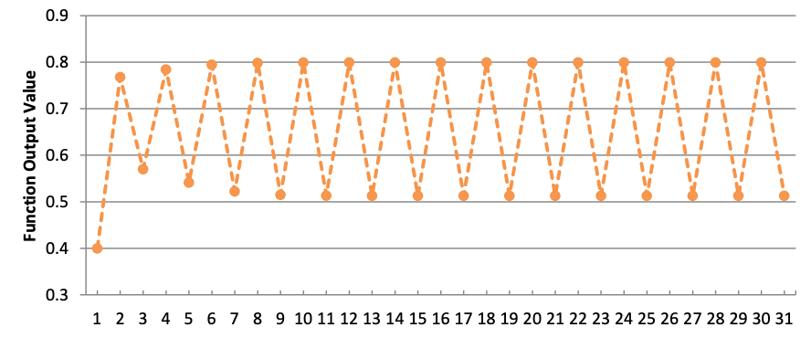

White paper
{: #wp-brand}

# Iterators

by [Conor Slattery &amp; Stephen Taylor](#authors)
{: .wp-author}


[Iterators](../../ref/iterators.md) (formerly known as _adverbs_) are the primary means of iteration in q, and in almost all cases the most efficient way to iterate. Loops are rare in q programs and are almost always candidates for optimization. Mastery of iterators is a core q skill.

The first part of this paper introduces iterators informally. This provides ready access to the two principal forms of iteration: _maps_ and _accumulators_.

The second part of the paper reviews iterators more formally and with greater attention to syntax. We see how iterators apply not only to functions but also to lists, dictionaries and tables. From their syntax we see when parentheses are required, and why. 

We discuss examples of their use.


## Basics

Iterators are higher-order unary [operators](../../ref/index.md#operators): they take a single argument and return a derived function. The single argument is an [_applicable value_](../../basics/glossary.md#applicable-value): a list, dictionary, table, process handle, or function. The derived function iterates its normal application.

Iterators are the only operators that can be applied postfix. They almost always are.

For example, the iterator [Scan](../../ref/accumulators.md), written `\`, applied to the Add operator `+` derives the function Add Scan, written `+\`, which extends Add to return cumulative sums. 

```q
q)+\[2 3 4]
2 5 9
```

Applied to the Multiply operator `*` it derives the function Multiply Scan, written `*\`, which returns cumulative products.

```q
q)*\[2 3 4]
2 6 24
```

(Writers of some other programming languages might recognize these uses of Scan as _fold_.)

Another example. The iterator [Each](../../ref/maps.md#each), written `'`, applied to the [Join](../../ref/join.md) operator `,`, derives the function Join Each, written `,'`.

```q
q)show a:2 3#"abcdef"
"abc"
"def"
q)show b:2 3#"uvwxyz"
"uvw"
"xyz"
q)a,b
"abc"
"def"
"uvw"
"xyz"
q)a,'b
"abcuvw"
"defxyz"
```

Above, `a` and `b` are both 2×3 character matrixes. That is to say, they are both 2-lists, and their items are character 3-lists. While `a,b` joins the two lists to make a 4-list, the derived function Join Each `a,'b` joins their corresponding items to make two character 6-lists. 

Scan and Each are the cores of the [accumulator](../../ref/accumulators.md) and [map](../../ref/maps.md) iterators. The other iterators are variants of them. 


## Three kinds of iteration


### Atomic iteration

Many native q operators have iteration built into them. They are atomic. They apply to conforming arguments.

```q
q)2+2           / two atoms
4
q)2 3 4+5 6 7   / two lists
7 9 11
q)2+5 6 7       / atom and list
7 8 9
```

<!-- Pairing an atom to every item of a list is called _scalar extension_.  -->

Two arguments conform if they are lists of the same length, or if one or both is an atom. In atomic iteration this definition recurses _to any depth of nesting_. 

```q
q)(1;2;3 4)+( (10 10 10;20 20); 30; ((40 40; (50 50 50; 60)); 70) )
(11 11 11;21 21)
32
((43 43;(53 53 53;63));74)
```

Because atomic iteration burrows deep into nested structure it is not easy to parallelize. A simpler form of it is.


### Mapping

The map iterators apply a function across items of a list or lists. They do not burrow into a nested structure, but simply iterate across its top level. 
That is just what [**Each**](../../ref/maps.md#each) does.

```q
q)x:("the";"quick";"brown";"fox")
q)count[x]          / count x
4
q)count'[x]         / count each item of x
3 5 5 3
```

The Each iterator has four variants. A function derived by [**Each Right**](../../ref/maps.md#each-left-and-each-right) `/:` applies its entire left argument to each item of its right argument. Correspondingly, a function derived by [**Each Left**](../../ref/maps.md#each-left-and-each-right) `\:` applies its entire right argument to each item of its left argument.

```q
q)"abc",/:"xyz"     / Join Each Right
"abcx"
"abcy"
"abcz"
q)"abc",\:"xyz"     / Join Each Left
"axyz"
"bxyz"
"cxyz"
```

!!! tip "Each Left and Each Right"

    Remember which is which by the direction in which the slash leans.

[**Each Prior**](../../ref/maps.md#each-prior) takes a binary value as its argument. The derived function is unary: it applies the binary between each item of a list (or dictionary) and its preceding item. 
The differences between items in a numeric or temporal vector:

```q
q)-':[1 1 2 3 5 8 13 21 34]     / Subtract Each Prior
1 0 1 1 2 3 5 8 13
```

[**Each Parallel**](../../ref/maps.md#each-parallel) takes a unary argument and applies it, as Each does, to each item in the derived function’s argument. Unlike Each, it partitions its work between any available secondary processes. Suppose `analyze` is CPU-intensive and takes a single symbol atom as argument.

```q
q)analyze':[`ibm`msoft`googl`aapl]
```

With a unary function, the mnemonic keyword `each` is generally preferred as a cover for the iterator Each. Similarly, `prior` is preferred for Each Prior and `peach` for Each Parallel.

```q
q)count each ("the";"quick";"brown";"fox")
3 5 5 3
q)(-) prior 1 1 2 3 5 8 13 21 34
1 0 1 1 2 3 5 8 13
q)analyze peach `ibm`msoft`googl`aapl
..
```

With map iterators the number of evaluations is the number of top-level items in the derived function’s argument/s. These functions are right-uniform.

The map iterators:

glyph    | name          | mnemonic keyword
:-------:|---------------|:---------------:
`'`      | Each          | `each`
`\:`     | Each Left     | 
`/:`     | Each Right    |
`':`     | Each Prior    | `prior`
`':`     | Each Parallel | `peach`
`'`      | Case          |


### Accumulation

In accumulator iterations the value is applied repeatedly, first to the entire (first) argument of the derived function, next to the result of that evaluation, and so on. 

The number of evaluations is determined according to the value’s rank. 

For a **unary** value, there are three forms:

-   Converge: iterate until a result matches either the previous result or the original argument
-   Do: iterate a specified number of times
-   While: iterate until the result fails a test

```q
q){x*x}\[0.1]                        / Converge
0.1 0.01 0.0001 1e-08 1e-16 1e-32 1e-64 1e-128 1e-256 0
q)5{x*x}\0.1                         / Do
0.1 0.01 0.0001 1e-08 1e-16 1e-32
q)(1e-6<){x*x}\0.1                   / While
0.1 0.01 0.0001 1e-08
```

For values of **higher-rank** the number of evaluations is the count of the right argument/s. For example, the result `r` of applying a ternary derived function `f\` to arguments `x`, `y`, and `z`:

```txt
r[0]:f[x;   y 0; z 0]
r[1]:f[r 0; y 1; z 1]
r[2]:f[r 1; y 2; z 2]
..
```

From this we see that the right arguments `y` and `z` must conform and that `count r` – the number of evaluations – is `count[y]|count[z]`.

There are two accumulator iterators. 

-   Functions derived by [**Scan**](../../ref/accumulators.md) `\` return as a list the results of each evaluation. They are thus right-uniform functions: their results conform to their right arguments. They resemble _fold_ in some other programming languages.
-   Functions derived by [**Over**](../../ref/accumulators.md) `/` perform the same computation as those from Scan, but return only the last result. They resemble _map reduce_ in some other programming languages.

```q
q)+\[2 3 4]    / Add Scan
2 5 9
q)+/[2 3 4]    / Add Over
9
```

With Scan and Over and binary values, the mnemonic keywords `scan` and `over` are generally preferred. 

```q
q)(+) scan 2 3 4
2 5 9
q)(+) over 2 3 4
9
```

The accumulators:

glyph    | name | mnemonic keyword
:-------:|------|:---------------:
`\`      | Scan | `scan`
`/`      | Over | `over`


## Brackets and parentheses

The result of applying an iterator to a value is a derived function. 
Like any other function, a derived function can be applied with brackets. 

```q
q)+\[3 4 5]
3 7 12
q)+\[1000;3 4 5]
1003 1007 1012
```

Notice that the derived function here is [_variadic_](../../basics/variadic.md): it can be applied as a unary or as a binary. 

!!! info "Postfix yields infix"

    An iterator applied postfix derives a function with infix syntax.

    This is true regardless of the derived function’s rank.
    For example, `count'` is a unary function but has infix syntax.

We can also apply `+\` as a binary using infix syntax.

```q
q)1000+\3 4 5
1003 1007 1012
```

The syntax of q allows clear expression of a sequence of operations. 
To apply a function `primus` to `x`, then `secundus` to the result, then `tertius` to the result of that, we could write:

```q
q)tertius[secundus[primus[x]]]
```

but better style would be to apply the unaries prefix and write:

```q
q)tertius secundus primus x
```

Good q style minimises use of both brackets and parentheses. 
(Where they must be used, the less that appears between an opening bracket or parenthesis and its close, the better.) 
So prefix application is usually better.

!!! info "An infix function can be applied prefix as a unary by parenthesizing it." 

```q
q)(+\)3 4 5 6 7
3 7 12 18 25
```

Some common derived functions are covered by keywords for readability. 
Good q style prefers them.

```q
q)sums 3 4 5 6 7
3 7 12 18 25
```

The iterator Each is covered by the keyword `each` for unary values.
Good q style prefers it.

```q
q)(count')  ("the";"quick";"brown";"fox")
3 5 5 3
q)count each("the";"quick";"brown";"fox")  / better q style
3 5 5 3
```

!!! tip "Parenthesize an infix function to use it as the left argument of a another function."

```q
q)(+) scan 3 4 5 6 7
3 7 12 18 25
```


## Map iterators

### Each, Each Parallel

The Each iterator applies a unary to each item of an argument.

```q
q)x:("the";"quick";"brown";"fox")
q)reverse x
"fox"
"brown"
"quick"
"the"
q)reverse each x
"eht"
"kciuq"
"nworb"
"xof"
```


<br>
<small>_Each Both_</small>
{: style="float: right; margin-left: 1em; text-align: center;"}

With a binary value, the iterator is sometimes known as _each both_. 
You can think of it as a zip fastener, applying the value between pairs of items from its arguments. 

```q
q)2 0 1 -2 rotate' x
"eth"
"quick"
"rownb"
"oxf"
q)show m:4 5#"the  quickbrownfox  "
"the  "
"quick"
"brown"
"fox  "
q)1 2 1 1 1 0 0 m' 3 1 2 3 4 2 0        / scattered indexing
"cricket"
```

The Each Parallel iterator takes unary values. It derives functions that perform exactly the same computation as functions derived by Each, but delegates computation to secondary tasks, if any are available. 

Good q style prefers use of the `peach` keyword.

```q
q)sum peach 3?'5000#10
13 12 13 22 3 14 17 14 7 12 13 17 19 15 8 16 17 18 19 10 16 10 9 13 15 8 25 8..
```

The Each iterator has three variants that take binary values as arguments: Each Left, Each Right and Each Prior.


### Each Left, Each Right

With a function derived from Each and a binary, if one of the two arguments is an atom, it is paired with each item of the other argument.

```q
q)3,'til 4
3 0
3 1
3 2
3 3
q)"o" in' ("the";"quick";"brown";"fox")
0011b
q)2 m' 0 2 1 2 4
"boron"
```

 
<br>
<small>_Each Right_</small>
{: style="float: right; margin-left: 1em; text-align: center;"}

To extend this behavior to non-atom arguments, use Each Left or Each Right.

```q
q)x:("the";"quick";"brown";"fox")
q)y:("brown";"windsor";"soup")
q)z:("red";"riding";"hood")
q)"brown" in/: (x;y;z)                  / Each Right
110b
```

For example, find the file handle of each column of a table.

```q
q){x,/:key[x]except `.d} `:/mydb/2013.05.01/trade
`:/mydb/2013.05.01/trade`sym
`:/mydb/2013.05.01/trade`time
`:/mydb/2013.05.01/trade`price
`:/mydb/2013.05.01/trade`size
`:/mydb/2013.05.01/trade`ex
```

The file handle of the table is joined to each element in the list of columns, creating five 2-lists. The Each Right iterator can then apply the `sv` keyword to create the file handles of each column.

```q
q)` sv/: {x,/:key[x]except `.d} `:/mydb/2013.05.01/trade
`:/mydb/2013.05.01/trade/sym`:/mydb/2013.05.01/trade/time`:/mydb/2013.05.01/t..
```


### Each Prior

The Each Prior iterator applies its binary to each item of a list `x` and to the previous item; i.e. to each adjacent pair in the list. The result is a list of the same length as `x`: the derived function is a uniform function.

```q
q)(-':) 4 8 3 2 2
4 4 -5 -1 0
```

Good q style prefers use of the `prior` keyword.

```q
q)(-) prior 4 8 3 2 2
4 4 -5 -1 0
```

One use of `-':` is so common it is built in as the `deltas` keyword.

```q
q)deltas 4 8 3 2 2
4 4 -5 -1 0
```

As a uniform function `-':` returns a list as long as its argument. 
The first item of the result corresponds to the first item of the argument. 
But, by definition, the first item of the argument has no previous item. 
So, in the expression $4-y$, what is $y$? Above, it is zero. Zero is the [identity element](../../basics/glossary.md#identity-element) for Subtract: when $y$ is zero, $x-y$ is always $x$. (See [Each Prior](../../ref/maps.md#each-prior) in the Reference for more on this and what happens with values which do not have a known identity element.) 

We can use `{x,y}` to display the pairs that Each Prior finds.

```q
q){x,y}prior til 5
0
1 0
2 1
3 2
4 3
```

Here we see that the first item, `0`, is paired with `0N`. The Join operator has no identity element, so it uses the argument `til 5` as a prototype.

```q
q)(0,1#0#x) ~ first {x,y}':[x]
1b
```

A [table in the Reference](../../ref/iterators.md#glyphs) tells us that with a binary value Each Prior derives a variadic function. So Subtract Each Prior can also be applied as a binary. 

```q
q)0 -': 4 8 3 2 2
4 4 -5 -1 0
```

The zero left argument is the ‘seed’ – the $y$ substracted from the first item, 4. We can use another ‘seed’ value.

```q
q)1 -': 4 8 3 2 2
3 4 -5 -1 0
```

**Watch out** Using a float as the seed shifts the type of the first item of the result.
But _only_ the first item: the result is no longer a vector, but a mixed list. 

```q
q)0.5 -': 4 8 3 2 2
3.5
4
-5
-1
0
q)type each 0.5 -': 4 8 3 2 2
-9 -7 -7 -7 -7h
```

Each Prior can be useful in tracking down errors within lists which should be identical, e.g. the `.d` files for a table in a partitioned database. 
Let’s use the `differ` keyword to check for inconsistencies in `.d` files. 
It uses the Each Prior iterator and is equivalent to `{not(~':)x}`.

```q
q)1_ date where differ {get hsym `$"/mydb/",x,"/trade/.d"} each string date
2013.05.03 2013.05.04
```

The values of the `.d` files are extracted from each partition. 
The `differ` keyword then compares each item with the one before it. 
If a `.d` file differs from the previous `.d` file in the list, then that date will be returned.
The first item of the result is dropped, because the first item of list `x`will be compared to `x[-1]`, which is always null and so will never match. 
In the example above, the `.d` files for the `2013.05.03` and `2013.05.04` partitions differ, and should be investigated further.


### Higher ranks

Each Parallel, `peach`, and `each` apply unary values. 
Each Left, Each Right, Each Prior, and `prior` apply binary values.

The Each iterator applies values of any rank.

```q
q)1 2 3 in' (1 2 3;3 4 5;5 6 7)
100b
q)ssr'[("mad";"bud";"muy");"aby";"umd"]
"mud"
"mud"
"mud"
```

As with atomic iteration, the arguments must conform: if lists, their lengths match; if atoms, they are replicated to the length of the list/s.

```q
q)ssr'[("mad";"bud";"muy");"d";"pnx"]
"map"
"bun"
"muy"
```


## Accumulating iterators

There are two accumulating iterators (or _accumulators_) and they are really the same. The Scan iterator is the core; the Over iterator is a slight variation of it. 

Here is Scan at work with `ssr`.

```q
q)ssr\["hello word."; ("h";".";"rd"); ("H";"!";"rld")]
"Hello word."
"Hello word!"
"Hello world!"
```

Where we want only the final result, we use the Over iterator.

```q
q)ssr/["hello word."; ("h";".";"rd"); ("H";"!";"rld")]
"Hello world!"
```

It is generally true that for a value `v`, `v/[x]` is the same as `last v\[x]`. Otherwise, what is true for Scan is true for Over. (Using Over rather than Scan allows kdb+ to use a little less memory by dropping interim results.) 

!!! tip "Debugging"

    If puzzled by the result of using Over, replace it with Scan and examine the intermediate results. They are usually illuminating.

Consider the application of the functions Scan derives from values of ranks 1, 2, 3…

```txt
v1\[x]          (v1\)x          Converge
v1\[i;x]       i v1\ x          Do
v1\[t;x]       t v1\ x          While
v2\[x;y]       x v2\ y
v3\[x;y;z]
…
```

And so on, up to `f8\`. In each form, `x` is the (first) argument of the first evaluation. The result of the first evaluation becomes the (first) argument for the next evaluation, if any. And so on. 

For how many evaluations? It depends first on the rank of the value.

value rank | number of evaluations
:-: | ---------------------------------------------------------------------
2-8 | length of the right argument/s
1   | depends on the results, and the left argument (if any) of the derived function

If `f` is rank 2 or higher, the number of evaluations is determined by the length of the [right argument/s](../../basics/glossary.md#argument). In the `ssr` example above, the right arguments have length 3 and `ssr` is evaluated three times. 

There are three ways to determine the number of evaluations of `f1` performed by `f1\`. 

A [table in the Reference](../../ref/iterators.md#glyphs) tells us `f1\` is [variadic](../../basics/variadic.md) and can be applied as a unary (Converge) or as a binary (Do or While). 


### Converge

Applying `f1\` as a unary is known as Converge because `f1\` is evaluated until the result matches either the previous result or the original argument. 

```q
q)({x*x}\)0.1         / converge on result
0.1 0.01 0.0001 1e-08 1e-16 1e-32 1e-64 1e-128 1e-256 0
q)(not\)0b            / return to first argument
01b
```

**Watch out** Not all sequences converge in this way. You can use the accumulators to throw kdb+ into an infinite loop.

!!! tip "Set a timeout"

    When developing with Converge, it is wise to set the timeout in your session via the `\T` command. This will cause any functions to terminate after a set number of seconds. An infinite loop will not lock your session.


### Recursion with `.z.s`

The ‘self’ function `.z.s` can also be used for recursion, and is more flexible than Scan. 

```q
q)list:(`a`n;(1 2;"efd");3;("a";("fes";3.4)))
q){$[0h=type x;.z.s'[x];10h=abs type x;upper x;x]}list
`a`n
(1 2;"EFD")
3
("A";("FES";3.4))
```

The above function operates on a list of any structure and data types, changing strings and characters to upper case and leaving all other elements unaltered. 

Note that when using `.z.s` the function will signal a stack error after 2000 loops. 

```q
{.z.s[0N!x+1]}0
```

No such restriction exists on Scan and Over. 

!!! tip "Use `.z.s` only where it is not possible to use iterators."


### Do and While

Applying `f1\` as a binary allows us to set an exit condition as the left argument:

-   an integer: exit after this number of evaluations (Do)
-   a truth function: apply this to each result and exit when it evaluates to zero (While)

Consider the function defined and illustrated below.

```q
q)30 {3.2*x*1-x}\ 0.4
0.4 0.768 0.5701632 0.7842468 0.541452 0.7945015 0.5224603 0.7983857 0.515091..
```



It is evident the function results in a loop with period 2 (at least within floating point tolerance). Without the exit condition (above, 30 evaluations) it will not terminate.

Fibonacci numbers are calculated by joining an integer vector to the sum of its last two items.

```q
q)fib:{x,sum -2#x}
q)5 fib\1 1                         / exit after 5 evaluations
1 1
1 1 2
1 1 2 3
1 1 2 3 5
1 1 2 3 5 8
1 1 2 3 5 8 13
q){last[x]<200} fib/1 1             / exit when result exceeds 200
1 1 2 3 5 8 13 21 34 55 89 144 233
```


## Lists and dictionaries

The arguments of iterators are [applicable values](../../basics/glossary.md#applicable-value): functions, file- and process handles, lists and dictionaries. 
Functions are the most familiar as iterator arguments, but lists and dictionaries reward study.

```q
q)yrp                               / a European tour
from   to     wp
----------------
London Paris  0
Paris  Genoa  1
Genoa  Milan  1
Milan  Vienna 1
Vienna Berlin 1
Berlin London 0
q)show route:yrp[`from]!yrp[`to]
London| Paris
Paris | Genoa
Genoa | Milan
Milan | Vienna
Vienna| Berlin
Berlin| London
```

The dictionary `route` is a finite-state machine: its values are also valid keys. 

```q
q)(route\)`Genoa                           / a circular tour
`Genoa`Milan`Vienna`Berlin`London`Paris
q)3 route\`London                          / 3 legs of the tour
`London`Paris`Genoa`Milan
q)(`Berlin<>)route\`Paris                  / Paris to Berlin
`Paris`Genoa`Milan`Vienna`Berlin
q)waypoints:(!/)yrp`from`wp
q)waypoints route\`Paris                   / Paris to the end
`Paris`Genoa`Milan`Vienna`Berlin
```

In the last expression, both the value and the truth value are dictionaries. No functions are involved. 


## Combining iterators

We can calculate [Pascal’s Triangle](https://en.wikipedia.org/wiki/Pascal%27s_triangle "Wikipedia") using Scan and Each Prior. 

We already have a sufficient grasp of the accumulators to see the Triangle immediately as successive results from some use of Scan. We need only a function to define one row of the Triangle in terms of the row above it. That could hardly be simpler. Each row is derived from its parent by summing adjacent pairs of items.

```q
q)(+) prior 1 3 3 1       / nearly...
1 4 6 4
q)(+) prior 1 3 3 1,0     / ...there!
1 4 6 4 1
q)7 {(+)prior x,0}\ 1
1
1 1
1 2 1
1 3 3 1
1 4 6 4 1
1 5 10 10 5 1
1 6 15 20 15 6 1
1 7 21 35 35 21 7 1
```

Notice that the last expression gave us _eight_ rows of the Triangle, not seven.
The first item of the result was the original argument, followed by the results of seven successive evaluations.

If the left argument of the derived function is zero, there will be no evaluations. The original argument will still be returned as the first (and only) item of the result. It doesn’t even have to be in the domain of the value.

```q
q)0 {(+)prior x,0}\ 1
,1
q)0 {(+)prior x,0}\ "foo"
"foo"
```

You can use Do in this way as a  conditional. 

The argument of an iterator is a function, list, or dictionary. 
Its result is a derived function – so that too can be the argument to an iterator.

Generate all possible pairs from two lists:

```q
q)raze 1 2 3,/:\:4 5 6
1 4
1 5
1 6
2 4
2 5
2 6
3 4
3 5
3 6
```
Here the derived function `,/:` (Join Each Right) is the argument to the iterator `\:` (Each Left). 
The resulting binary derived function `,/:\:` (Join Each Right Each Left) has infix syntax – remember _Postfix yields infix_. 
In the example above it returns a 3×3 matrix of pairs, here razed into a list of pairs because the default display does not reveal the matrix structure. 

Switch the iterators to change the order of the result.

```q
q)raze 1 2 3,\:/:4 5 6
1 4
2 4
3 4
1 5
2 5
3 5
1 6
2 6
3 6
```

The `raze` keyword is no more than `,/` (Join Over). It is often combined with Converge to flatten deeply nested structures. Good q style prefers the keywords, but `,//` illustrates again how a derived function can be the argument to another iterator.

```q
q)raze over ("the ";("quick ";("brown ";"fox.")))
"the quick brown fox."
q)(,//)("the ";("quick ";("brown ";"fox.")))
"the quick brown fox."
```

You can use the Each operator to apply a function at a specific depth in a nested list.

```q
q)lst:(3 2 8;(3.2;6h);("AS";4))
q)type lst
0h
q)type'[lst]
7 0 0h
q)type''[lst]
-7 -7 -7h
-9 -5h
10 -7h
q) type'''[lst]
-7 -7 -7h
-9 -5h
(-10 -10h;-7h)
```

Good q style avoids brackets and parentheses, and prefers keywords where available. These principles conflict when composing multiple iterators.

```q
q)((type each)each)each lst         / NOT recommended
-7 -7 -7h
-9 -5h
(-10 -10h;-7h)
```

When composing iterators, prefer concise forms. They are easier to analyze. 


## Iterators versus loops

The control words `do` and `while` allow q programmers to write explicit loops. Sometimes this is the only way to write an iteration. However, most common forms of iteration can be defined using the iterators, yielding code that is shorter, faster and less prone to error. 

Often the implementation is relatively easy, using Each, Each Left and Each Right to cycle through a list and amend its items. 

Suppose we wanted to check if either of the integers 2 or 3 are present in some lists. This can be achieved with a `while` loop.

```q
q)m:(1 2 3;3 4 5;4 5 6)   / three lists
q){i:0;a:();while[i<count x;a,:enlist any 2 3 in x[i];i+:1];a} m
110b
q)\t:100000 {i:0;a:();while[i<count x;a,:enlist any 2 3 in x[i];i+:1];a} m
475
```

However, iterators allow neater, more efficient code; easier to read and cheaper to maintain.

```q
q)any each 2 3 in/: m
110b
q)\t:10000 any each 2 3 in/: m
30
```

Similarly we can use the Over iterator to deal easily with situations which would be handled by loops in C-like languages. 

Suppose you wanted to join several tables.

```q
//Create a list of tables, of random length
q)tt:{1!flip(`sym;`$"pr",x;`$"vol",x)!(`a`b`c;3?50.0;3?100)}each string til 2+rand 10
//Join the tables using a while loop
q){a:([]sym:`a`b`c);i:0;while[i<count[x];a:a lj x[i];i+:1];a}tt
sym pr0      vol0 pr1      vol1 pr2      vol2 pr3      vol3 pr4       vol4 pr..
-----------------------------------------------------------------------------..
a   25.41992 86   3.315151 58   22.37118 81   7.696889 56   14.84522  80   27..
b   2.124254 50   19.3025  82   34.57479 69   47.95351 85   0.5641467 45   33..
c   37.36208 19   41.11905 31   33.52813 90   30.03506 78   1.949377  8    28..
q)\t:10000 {a:([]sym:`a`b`c);i:0;while[i<count[x];a:a lj x[i];i+:1];a}tt
271
//Join the tables using Over
q)0!(lj/)tt
sym pr0      vol0 pr1      vol1 pr2      vol2 pr3      vol3 pr4       vol4 pr..
-----------------------------------------------------------------------------..
a   25.41992 86   3.315151 58   22.37118 81   7.696889 56   14.84522  80   27..
b   2.124254 50   19.3025  82   34.57479 69   47.95351 85   0.5641467 45   33..
c   37.36208 19   41.11905 31   33.52813 90   30.03506 78   1.949377  8    28..
q)\t:10000 0!(lj/)tt
257
```

!!! tip "Write loops only when you can find no solution using iterators."


## Nested columns

Best practice avoids nested columns wherever possible.
However in some situations operating on nested data is necessary or may lower execution time for certain queries. 
The most common occasion for this is that the keyword `ungroup`, which flattens a table containing nested columns, is computationally expensive, especially when you are dealing only with a subset of the entire table.

There are also situations in which storing the data in a nested structure makes more sense. For example, you may want to use strings instead of symbols, to avoid a bloated sym file. 

So we will now take a look at using iterators to apply functions to a table as a whole, and to apply functions within a select statement.

Iterators can be used to examine and modify tables. 
To do this we need to understand how tables are structured. 
In kdb+, a table is a list of dictionaries, which may have non-integer values.
This means we can apply functions to individual values, just like any other nested list or dictionary structure. For example:

```q
q)a:([]a:`a`b`c`d;b:1 2 3 4;c:(1 2;2 3;3 4;4 5))
q)type[a]
98h
q)type'[a]
99 99 99 99h
q)type''[a]
a   b  c
--------
-11 -7 7
-11 -7 7
-11 -7 7
-11 -7 7
```

We see here that `type[a]` returns `98h`, so `a` is a table. 
Then `type'[a]` returns the type of each item of `a` – they are dictionaries, with type `99h`. 
Next, `type''[a]` finds the type of each value of each dictionary. The result is a list of dictionaries, which collapses back to a table showing the type of each field in the table.

```q
q)distinct type''[a]
a   b  c
--------
-11 -7 7
```

This statement can be used to ensure all rows of the table are the same type. This is useful if your table contains nested columns, as the [`meta`](../../ref/meta.md) keyword looks only at the first row of nested columns. And if the table is keyed then `meta` will be applied only to the non-key columns.

```q
q)a:([]a:`a`b`c`d;b:1 2 3 4;c:(1 2;2 3;3 4.;4 5))
q)meta a
c| t f a
-| -----
a| s
b| j
c| J
q)distinct type''[a]
a b c
--------
-11 -7 7
-11 -7 9
```

Looking only at the results of `meta`, we might suppose column `c` contains only integer lists.
However `distinct type''[a]` clearly shows column `c` contains lists of different types, and thus is not mappable. This is a common cause of error when writing to a splayed table.
Dealing with nested data in a table via a select/update statement often requires the use of iterators.
To illustrate this, let us define a table with three columns, two of which are nested. 

```q
q)show tab:([]sym:`AA`BB`CC;time:3#enlist 09:30+til 30;price:{30?100.0}each til 3)
sym time                                                                     ..
-----------------------------------------------------------------------------..
AA  09:30 09:31 09:32 09:33 09:34 09:35 09:36 09:37 09:38 09:39 09:40 09:41 0..
BB  09:30 09:31 09:32 09:33 09:34 09:35 09:36 09:37 09:38 09:39 09:40 09:41 0..
CC  09:30 09:31 09:32 09:33 09:34 09:35 09:36 09:37 09:38 09:39 09:40 09:41 0..
```

Suppose we wanted the range of each row. 

```q
q)rng:{max[x]-min[x]}
```

We can use `rng` with Each within a `select` statement to apply the function to each row of the table.

```q
q) select sym, rng'[price] from tab
sym price
------------
AA  96.3872
BB  95.79704
CC  98.31252
```

Suppose instead we wanted the range of a subset of the data in the table. 
One way would be to `ungroup` the table and find the range.

```q
q)select rng price by sym from ungroup tab where time within 09:40 09:49
sym| price
---| --------
AA | 77.67457
BB | 80.14611
CC | 67.48254
```

However, it is faster to index into the nested list as this avoids the costly `ungroup` function. 
First find the index of the prices within our time range.

```q
q)inx:where (exec first time from tab) within 09:40 09:49
```

Then use this to index into each price list and apply `rng` to the resulting prices.

```q
q)select sym, rng'[price@\:inx] from tab
sym inx
------------
AA  77.67457
BB  80.14611
CC  67.48254
```

This offers a significant improvement in latency over using `ungroup`.

```q
q)\t:10000 select rng price by sym from ungroup tab where time within 09:40 09:49
175
q)\t:10000 inx:where (exec first time from tab) within 09:40 09:49;select sym, rng'[price@\:inx] from tab
83
```

If the nested lists are not uniform, change the code:

```q
q)inx:where each (exec time from tab) within 09:40 09:49
q)select sym, rng'[price@'inx] from tab
sym inx
------------
AA  77.67457
BB  80.14611
CC  67.48254
```


## Conclusion

This white paper summarizes the q iterators, showing how they derive new functions from values – functions, file- and process handles, lists and dictionaries. 

It showed with examples how the effect of the iterator is determined sometimes by the rank of the applicable value, and sometimes also by the rank at which the derived function is applied. Even complicated examples, composing multiple iterators, can be analyzed to understand the behavior.

Certain uses of iterators, such as the creation of recursive functions and applying iterators to functions within select statements, were examined in more detail, as these are often poorly understood, but useful in many situations. 
Some common uses were looked at in to demonstrate the ability of iterators to reduce execution times.

This white paper illustrates how iterators can be used easily to extend the
application of inbuilt and user-defined functions, allowing code to take full advantage of kdb+’s ability to process large volumes of data quickly. 

Using iterators correctly minimizes the amount of data manipulation and produces code that is concise and easier to maintain.

All tests were run using kdb+ 3.6 (2018.10.23).


## Authors 

**Conor Slattery** is a financial engineer who has designed kdb+ applications for a range of asset classes. Conor is currently working with a New York-based investment firm, developing kdb+ trading platforms for the US equity markets.

An earlier version of this paper by Slattery was published in 2013 as [“Efficient use of adverbs”](/download/wp/efficient_use_of_adverbs.pdf).


{: .small-face}

**Stephen Taylor** FRSA is the Kx Librarian. He has followed the evolution of the Iversonian languages through APL, J, k, and q, and is a former editor of [_Vector_](https://vector.org.uk), the journal of the British APL Association.
<br>
[:fontawesome-solid-envelope:](mailto:stephen@kx.com?subject=White paper: Iterators) &nbsp;
[:fontawesome-brands-linkedin:](https://www.linkedin.com/in/stephen-taylor-b5ba78/) &nbsp;
[:fontawesome-brands-twitter:](https://twitter.com/sjt5jt)

Other papers by Stephen Taylor
{: .publications}

<ul markdown="1" class="publications">
-   :fontawesome-regular-map: [Parse trees and functional forms](../parse-trees.md)
-   :fontawesome-solid-globe: [Pair programming with the users](http://archive.vector.org.uk/art10009900)
-   :fontawesome-solid-globe: [Three principles of coding clarity](http://archive.vector.org.uk/art10009750)
</ul>

