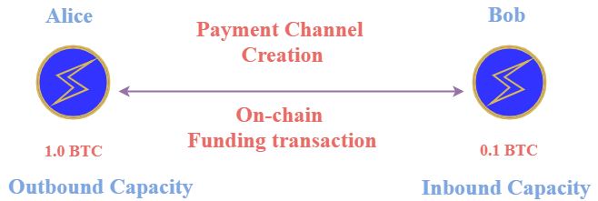
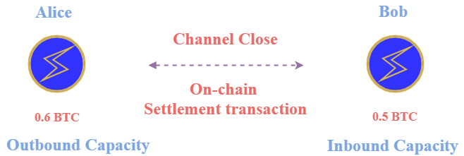
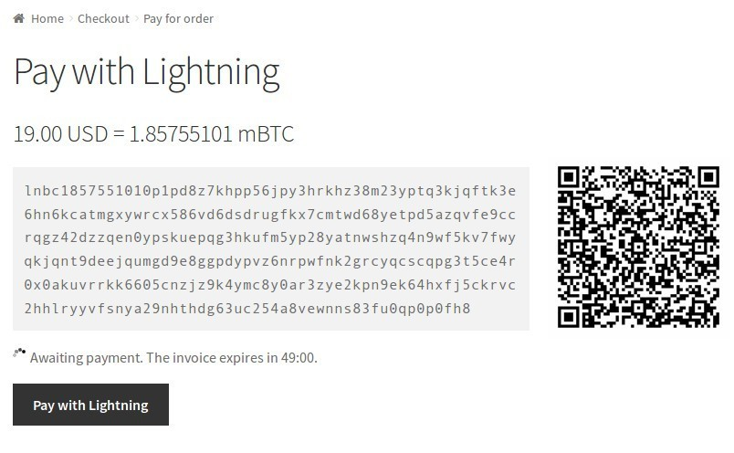
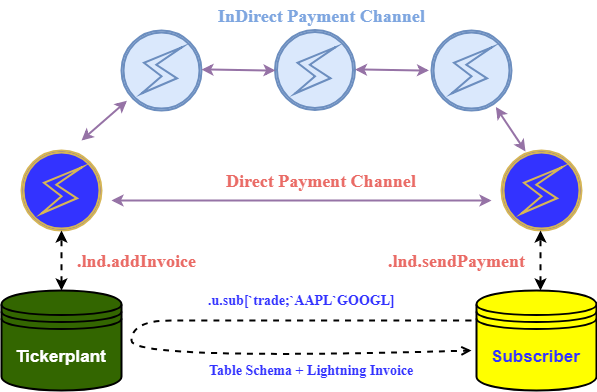

White paper
{: #wp-brand}

# Lightning tickerplants: Pay-per-ticker with micropayments on the Lightning network

by [Jeremy Lucid](#author)
{: .wp-author}


[Lightning](https://lightning.network/lightning-network-paper.pdf) is a technology designed to scale Bitcoin and other compatible blockchains by enabling high transaction throughput with greater privacy while preserving decentralized qualities. It is a layer two infrastructure which builds upon the security and [smart contract](https://en.wikipedia.org/wiki/Smart_contract) functionality of the underlying base blockchain, analogous to how the HTTP application layer protocol builds on an underlying and reliable TCP layer. 
Lightning succeeds by allowing payments to be made off-chain through the technology of bidirectional [payment channels](#payment-channels), wherein the underlying network of nodes do not need to validate and record every transaction. Consequently, peer-to-peer payments made over the Lightning network can be performed in high volume, with micro value (order of cents and lower), with low or zero fees and with near instant settlement times. Today, Lightning is one of the most rapidly growing networks (see [Real-time Network Statistics](https://1ml.com/statistics)) and adopted technologies in the cryptocurrency space and is at the cutting edge of blockchain innovation.

Lightning application (LApp) development is progressing quickly and includes [eCommerce integrations](https://blockstream.com/2018/01/16/lightning-charge/), [micropayment paywalls](https://github.com/ElementsProject/wordpress-lightning-publisher) for content creators, [micropayment tipping](https://tippin.me/) services (Twitter), and multiple Custodial and Non-Custodial [wallet](https://www.lopp.net/lightning-information.html) implementations. The micropayment application, in particular, has the potential to transform how online content
is monetized by facilitating a micro fee pay-per-view model, as opposed to an ad based or yearly subscription model.
Lightning payments are also highly applicable to the **IoT space**, as the network can be used to implement a decentralized peer-to-peer payment layer for transactions between IoT devices, utilizing all of the networks key features, see [IoT and Lightning](https://medium.com/meetbitfury/the-internet-of-things-and-the-lightning-network-41b93dbb8456), [Bitcoin Payment-Channels for Resource Limited IoT Devices](https://arxiv.org/pdf/1812.10345.pdf) and [Micropayments between IoT devices](http://www.diva-portal.org/smash/get/diva2:1272048/FULLTEXT01.pdf).

For cryptocurrency exchanges,
integrating Lightning has the advantage of allowing clients to more rapidly deposit and withdraw funds, or move funds seamlessly between exchanges. Increasing the velocity of value transfer should, in turn, lead to greater market efficiency and reduce arbitrage opportunities. The exchange [ZebPay](https://blog.zebpay.com/zebpay-launches-lightning-network-payments-44cfaad0b1c7) has become the first to begin integrating the payment system. Lightning can also enable exchanges to monetize market data in a completely new way, as showcased in a recent [Suredbits](https://suredbits.com/) POC application, where streaming futures data from the BitMEX and Kraken exchanges was made available to users on-the-fly with Lightning micropayments.

This paper will explore Lightning network technology in the context of its application to the monetization of streaming data. 
As an example of how Lightning can be integrated into kdb+ based applications, this paper will illustrate how a kdb+ tickerplant can be easily modified to communicate with a Lightning node to accept payments for market, or sensor data, on a per request (ticker) basis, with a fast settlement. In particular, the paper will describe how the [kdb+ qlnd](https://github.com/jlucid/qlnd) library can be used to communicate with a Lightning node to 

-   create payment channels with peers
-   generate invoices for payment
-   route payments rapidly across the network. 

The paper will also discuss briefly how this setup can be extended to the case of multiple IoT devices exchanging data for payment.

All tests were made using the following software versions. 

software | version
--- | ---
kdb+ | 3.5
Python | 3.7.0
Bitcoin Core daemon | 0.17.1.0 (`gef70f9b52b851c7997a9f1a0834714e3eebc1fd8`)
Lightning daemon (`lnd`) | 0.6.0-beta (`commit=v0.6.0-beta-41-g1c22474ad31b5f7fe18f9cc8df7c08cd445eaacb`)


### Optional software

[qbitcoind](https://github.com/jlucid/qbitcoind) is a q library designed to interact with a Bitcoin core full node.

This library is used herein to transfer funds from a Bitcoin core wallet to a Lightning wallet. For more information on running a node, and using qbitcoind, see [Kdb+ Securing Digital Assets](https://kx.com/blog/securing-digital-assets-a-bitcoin-full-node-api-for-kdb/) and [Storing and exploring the Bitcoin blockchain](../blockchain/index.md).

The reader should be aware that the above software is a beta version and the technology is still relatively new and experimental. 
Keep funds held on Lightning to a minimum.


## Payment channels

One of the primary building blocks of the Lightning network is bidirectional (two-way) payment channels.
Payment channels allow users to make millions of Bitcoin transactions without broadcasting all of them to the Bitcoin network.

A payment channel is constructed between two Lightning network peers, or nodes, by creating a 2-of-2 multisignature address on the
Bitcoin blockchain which requires both participants signatures for funds to be spent. This first on-chain transaction
determines the balance (or capacity) of the channel and is referred to as the _funding transaction_.
(See [Opening a channel](#opening-a-channel-with-a-funding-transaction).)

In the diagram below, Alice opens a channel to Bob with a channel capacity of 1.1 BTC. The opening balance is
1.0 BTC on Alice's end and 0.1 BTC on Bob’s end. The 1.0 BTC on Alice’s end is 
referred to as Alice’s outbound capacity and is the amount she is able to spend, or send to Bob. The 0.1 BTC on Bob’s end of the channel is referred to as Alice’s inbound capacity. This inbound capacity determines how much Alice can receive.



Once this funding transaction is confirmed by the Bitcoin network, both participants are then free
to transact instantly by exchanging mutually signed _commitment transactions_ that modify the initial balance of the channel. 
(See [Making a payment](#making-a-payment-with-a-commitment-transaction).) 
For example, Alice can send 0.1 BTC to Bob over Lightning, updating their respective balances, as shown below.
These commitment transactions are not broadcast to the Bitcoin blockchain, allowing thousands of 
such transactions to be performed per second without incurring a mining fee. The transaction settlement speed is only limited by the time needed by the parties to create, sign and send each other commitment transactions.
While the Bitcoin blockchain can process anywhere between 3-7 transactions per second, the Lightning
network allows for millions of transactions per second using this approach.


Channels can be closed between peers at any time. At which point, the most recent transaction specifying the latest balances is broadcast to the Bitcoin network. This is
known as the _settlement transaction_, and is when the funds held on the multisignature address are spent
to the wallet addresses of the participants.
See [Closing a channel](#closing-a-channel-with-a-settlement-transaction).



While single-payment channels between pairs of peers are very useful, the major innovation of the Lightning
network is enabling payments to be routed between parties who do not have a direct bidirectional payment
channel between them, by passing payments along a network of chained payment channels. This is achieved by
the use of smart contract technology, namely [HTLC](https://medium.com/softblocks/lightning-network-in-depth-part-2-htlc-and-payment-routing-db46aea445a8) (Hash-TimeLock-Contracts), which ensures funds can be transferred in a secure way. For example, if a customer wishes to make a retail payment, but doesn’t have a direct channel open with the retailer, they can instead route the payment along
a network of connected channels. Below is an illustration of this idea, where Alice has a choice
of multiple payment paths to Bob. A real-world example of a Lightning payment being routed through intermediate
nodes can also be seen in the [Appendix – Shopping](#shopping).


The following image is taken from a Lightning node explorer and shows the geographic distribution of public Lightning nodes
and the known channels between them. The network has seen dramatic growth over the past year, with
the value held on Lightning increasing continuously.

  
<small>_World map of the Lightning network. Source: https://explorer.acinq.co _</small>

For a more detailed explanation of how Lightning works see
[Payment Channels Explained](https://medium.com/softblocks/lightning-network-in-depth-part-1-payment-channels-b943607950dd)
and [Lightning Network Resources](https://www.lopp.net/lightning-information.html).


## Installing and configuring a Lightning node

There are currently multiple implementations of the Lightning protocol, including [`lnd`](https://github.com/lightningnetwork/lnd) from [Lightning Labs](https://lightning.engineering/), [`eclair`](https://github.com/ACINQ/eclair) from [ACINQ](https://acinq.co/) and [`c-lightning`](https://github.com/ElementsProject/lightning) from [Blockstream](https://blockstream.com/lightning/). 

To ensure interoperability between implementations, the community of developers have created the Basis of Lightning Technology ([BOLT](https://github.com/lightningnetwork/lightning-rfc)) specification. This enables development teams to work and specialize on different aspects of the technology, like mobile integration, browser plugins, and enterprise products, while retaining cross-compatibility.

While multiple Lightning implementations exist, the [qlnd](https://github.com/jlucid/qlnd) library discussed here is designed specifically to communicate with the `lnd` daemon from Lightning Labs. Therefore, the steps described below correspond only to the installation of this implementation.

The steps are broken down into the following parts

-   Installation of the Bitcoin Core Full node, `bitcoind`  
-   Installation of the `lnd` daemon
-   Running `lnd` and creating a wallet


### Installing bitcoind

In order to run `lnd`, it is required that a Bitcoin full-node daemon is running and available, preferably, on the same host. 
This is because the Lightning node needs a way to communicate with the underlying blockchain in order to send
on-chain payments, create channel open/close transactions and monitor relevant transactions on the network. 
While there are novel approaches which do not require a local full node, such as [Neutrino](https://github.com/lightninglabs/neutrino), these are outside the scope of this paper.

Detailed steps on how to install and run `bitcoind`, for different operating systems, can be found on the recommended [instructions](https://bitcoin.org/en/full-node#linux-instructions) page.

For Linux-based operating systems, the install procedure can be as simple as running

```bash
$sudo apt-get install bitcoind
```

Before starting the daemon, a `bitcoin.conf` file should be created in the install folder (usually `$HOME/.bitcoin`),
as described in white paper [Storing and exploring the Bitcoin blockchain](../blockchain/index.md#installing-a-bitcoin-full-node).
However, the sample `bitcoin.conf` file presented in that white paper should now be extended, as shown below, to
include the [ZeroMQ](https://github.com/bitcoin/bitcoin/blob/master/doc/zmq.md) wrapper, which will allow the Lightning
node to be notified of events like the arrival of new blocks or transactions. Note that in the configuration file below, the
`rpcuser` and `rpcpassword` values need to be changed.

```python
# Maintain a full transaction index, used to query the node historically.
txindex=1
# [rpc]
# Accept command line and JSON-RPC commands.
server=1
rpcuser=<username>
rpcpassword=<password>
# Additional lines to enable ZeroMQ
zmqpubrawblock=tcp://127.0.0.1:28332
zmqpubrawtx=tcp://127.0.0.1:28332
```

After starting `bitcoind`, using the command below, syncing the entire blockchain may take up to one 
week depending on connectivity. Your Lightning node should not be started until after the Bitcoin node is in sync.

```bash
$ bitcoind -daemon
```

One way to confirm the local node is in sync with the rest of the network is by comparing the 
block height with another public node. In the example below, a comparison is made against
[blockexplorer.com](https://blockexplorer.com).

```bash
# Extract the block height from blockexplorer.com
$ wget -q -O- https://blockexplorer.com/q/getblockcount; echo
{"info":{
    "version":120100,
    "protocolversion":70012,
    "blocks":563793,
    "timeoffset":-1,
    "connections":26,
    "proxy":"",
    "difficulty":6061518831027.271,
    "testnet":false,
    "relayfee":0.0001,
    "errors":"Warning: unknown new rules activated (versionbit 1)",
    "network":"livenet"
}}

# Extract the block height from bitcoind using the bitcoin-cli utility
$ bitcoin-cli getblockcount
563793

## Extract the block height from bitcoind using the qbitcoind library 
$q
q).utl.require"qbitcoind"
q).bitcoind.getblockcount[]
result| 563793
error |
id    | 0
```


### Installing lnd

To install and run `lnd` and its dependencies, follow the official [Lnd-Guide](https://github.com/lightningnetwork/lnd/blob/master/docs/INSTALL.md#installation). 

Once this installation process is complete, create your own Lightning Network 
configuration file.

Start by creating the config file in the default location:

```bash
mkdir ~/.lnd && cd ~/.lnd
touch lnd.conf
```

Open the `lnd.conf` file in your favorite editor and add the following details.
The `alias` and `color` values can be freely chosen by the node operator and can be used to
distinguish and find the node on various [public node explorers](#connecting-to-peers).
For additional configuration file options and details, see the following [sample file](https://github.com/lightningnetwork/lnd/blob/master/sample-lnd.conf). 


```bash
[Application Options]
debuglevel=info
alias=<Fill with sudo name. This name helps identify the node on the network>
color=<Fill with a color value given in hex format, for example, #00FF00>

datadir=~/.lnd/data
logdir=~/.lnd/logs
tlscertpath=~/.lnd/tls.cert
tlskeypath=~/.lnd/tls.key

#Specify the interfaces to listen on for p2p connections
listen=<localhost:9735>
externalip=<localhost:9735>

#Specify the interfaces to listen on for REST connections.
restlisten=0.0.0.0:8080

#Specify the interfaces to listen on for gRPC connections
rpclisten=<localhost:10009>

[Bitcoin]
bitcoin.active=1
bitcoin.mainnet=1
bitcoin.node=bitcoind

[Bitcoind]
```


### Running a Lightning node


Once `lnd` is installed, it can be started by running the following command.
Below we explicitly give the path to the `lnd.conf` file, however, by default `lnd` will look for it in the home directory if not specified.

```bash
$cd $GOPATH/bin
$./lnd --configfile=~/.lnd/lnd.conf
```

It is possible to run multiple instances of `lnd`, all connected to the same `bitcoind` to assist in testing.
In this case, a separate `lnd.conf` file can be created for each instance in a separate folder, being careful to
change the `listen`, `externalip`, `restlisten`, `rpclisten`, `alias`, `color`, `datadir`, `logdir`, `tlscertpath`, `tlskeypath` values as appropriate, and starting the nodes as follows

```bash
$./lnd --configfile=~/.lnd1/lnd.conf
$./lnd --configfile=~/.lnd2/lnd.conf
$./lnd --configfile=~/.lnd3/lnd.conf
```

For more information on possible command-line arguments see the help option.

```bash
$./lnd --help
```


### Creating a wallet

During node startup the following output will appear, requesting the user to either `create` a new wallet or `unlock` an
existing wallet. 

```bash
$./lnd --configfile=~/.lnd/lnd.conf
Attempting automatic RPC configuration to bitcoind
Automatically obtained bitcoind's RPC credentials
...
2019-03-02 13:47:28.952 [INF] LTND: Waiting for wallet encryption password. 
    Use `lncli create` to create a wallet, 
    `lncli unlock` to unlock an existing wallet,
    or `lncli changepassword` to change the password of an existing wallet 
    and unlock it.
```

At this point, you will need to run `lncli create` and follow the instructions to generate a new wallet.
Below is the explicit command listing the `lnddir` and `rpcserver` which may also be required. 

```bash
$./lncli --lnddir=~/.lnd --rpcserver=localhost:10009 create
Input wallet password:
Confirm wallet password:

Do you have an existing cipher seed mnemonic you want to use? (Enter y/n): n

Your cipher seed can optionally be encrypted.
Input your passphrase if you wish to encrypt it 
(or press enter to proceed without a cipher seed passphrase):

Generating fresh cipher seed...

!!!YOU MUST WRITE DOWN THIS SEED TO BE ABLE TO RESTORE THE WALLET!!!

---------------BEGIN LND CIPHER SEED---------------
 1. xxxxx      2. xxxxx    3. xxxxx     4. xxxxx
 5. xxxxx      6. xxxxx    7. xxxxx     8. xxxxx
 9. xxxxx     10. xxxxx   11. xxxxx    12. xxxxx
13. xxxxx     14. xxxxx   15. xxxxx    16. xxxxx
17. xxxxx     18. xxxxx   19. xxxxx    20. xxxxx
21. xxxxx     22. xxxxx   23. xxxxx    24. xxxxx
---------------END LND CIPHER SEED-----------------
```

Be sure to record the 24-word seed, which is essential for wallet recovery.


## Interacting with Lightning using `qlnd`

The [qlnd](https://github.com/jlucid/qlnd) library enables a q process to communicate with a locally running `lnd` node
via the [LND REST API](https://api.lightning.community/rest/index.html#lnd-rest-api-reference). Moreover, the library makes
use of the powerful embedPy interface, recently released by KX, which allows the kdb+ interpreter to manipulate Python objects, call Python functions and load Python libraries. This is particularly useful for this application given that the REST API Reference documentation has explicit and well-tested examples using Python. (There are many other applications of embedPy and kdb+.)


### EmbedPy setup

EmbedPy is available on [GitHub](https://github.com/kxsystems/embedpy) to use with kdb+ V3.5+ and Python 3.5 or higher, for macOS or Linux operating systems and Python 3.6 or higher on the Windows operating system. The installation directory also contains a `README` about embedPy, and an example directory containing thorough examples.
The reader is encouraged to follow the [online documentation](../../ml/embedpy/index.md) to become familiar with the functionality.


### Running `qlnd`

Once embedPy is installed, the `qlnd` library can be loaded into a q process as follows.

```bash
$q qlnd.q
```

However, prior to loading, you may need to set the `LND_DIR` environmental variable to the location of your `.lnd.conf` file,
if it is not in the default location `$HOME/.lnd`.

```bash
  export LND_DIR=/path/to/my/.lnd
```

During library loading, this environment variable is used to locate and read the TLS certificate
and Macaroon token created by `lnd` on startup, which are used for secure communication and
authentication with the node, respectively.

By default, the `qlnd.q` script tries to load the `admin.macaroon`, which gives full API access without caveats. For applications
requiring lower privileged access, an `invoice.macaroon` and `readonly.macaroon` are also available, 
see [Macaroons Guide](https://github.com/lightningnetwork/lnd/blob/master/docs/macaroons.md).

In order to change the values of the `lnd` URL, TLS Certificate path or Macaroon token path post script loading,
the following methods are available.

```q
$q qlnd.q
q).lnd.setURL "https://localhost:8080/v1/"
q).lnd.setTLS "/new/path/to/.lnd/tls.cert"
q).lnd.setMACAROON "/new/path/to/.lnd/data/chain/bitcoin/mainnet/admin.macaroon"
```

To confirm that everything is set up correctly, run [`.lnd.getInfo`](https://api.lightning.community/rest/index.html#v1-getinfo) to return some basic information from the node.

```q
q).lnd.getInfo[][`version]
"0.6.0-beta commit=v0.6.0-beta-41-g1c22474ad31b5f7fe18f9cc8df7c08cd445eaacb"

q).lnd.getInfo[][`identity_pubkey]
"This returns the public key identifier which is unique to the node"
```


### Funding a Lightning wallet

With the node running, and the qlnd functions returning as expected, the first step towards creating a payment channel is to fund the Lightning wallet with Bitcoin. To do this, instruct the wallet to first generate a new address with [`.lnd.newaddress`](https://api.lightning.community/rest/index.html#v1-newaddress).

```q
q).lnd.newaddress[]
address| "bc1qajll8zl8ycflv42rczj5erpt83vzr2ky429t73"
```

Next, send some funds to this address using a mobile, hardware or exchange wallet of choice. Alternatively, the [`.bitcoind.sendtoaddress`](https://github.com/jlucid/qbitcoind/wiki/Sending-from-a-Hot-Wallet) function within the [qbitcoind](https://github.com/jlucid/qbitcoind) library can be used to transfer funds directly from the internal `bitcoind` node wallet.


```q
q)toAddr:"bc1qajll8zl8ycflv42rczj5erpt83vzr2ky429t73"
q)amount:0.0106
q).bitcoind.sendtoaddress[toAddr;amount]
result|"df9e4987c8ea8a2dd5c41d8677d8151e02e3e69745ae102e75ae9b636c408706"
error | 0n
id    | 0f
```

To track the status of this wallet funding transaction, we can query either the `bitcoind` node using [`.bitcoind.gettransaction`](https://github.com/jlucid/qbitcoind/wiki/Transaction-IDs), or the `lnd` node using [`.lnd.getTransactions`](https://api.lightning.community/rest/index.html#v1-transactions), as shown below.


```q
// Confirm the transaction has been confirmed on the Bitcoin network by
// using the transaction ID output from the sendtoaddress function
q)txid:"df9e4987c8ea8a2dd5c41d8677d8151e02e3e69745ae102e75ae9b636c408706"
q).bitcoind.gettransaction[txid][`result]
amount            | -0.0106
fee               | -1.57e-05
confirmations     | 2678f
```

Transaction details can also be confirmed on the Lightning node. Below, all transaction details
are first converted into a more convenient kdb+ table format to make for easier selection.

```q
q)t:(uj/) enlist@'.lnd.getTransactions[][`transactions]
q)first select from t where tx_hash like txid
tx_hash          | "d61dafc3436973d0ae3f9e820c661a681ab6074b510b5fd51c6f3ca5ed914a0f"
amount           | "-1001481"
num_confirmations| 7470
block_hash       | "0000000000000000002bb995ed3b5022aa4fd8fe73b8130296c5852634cd345d"
block_height     | 560669
time_stamp       | "1548795246"
dest_addresses   | ("bc1q3zy2zdyp77er7rc40xn2udxj888x2qjdun9zdm";"bc1qa4gjgfsuf…")
total_fees       | "1481"
```

Once enough confirmations are received, the Lightning wallet can be instructed to display the balance by calling [`.lnd.walletBalance`](https://api.lightning.community/rest/index.html#v1-balance-blockchain), as shown below. 
A confirmed balance means the deposit is complete and the node is ready to open channels.

```q
// Funds are reported in Satoshis
q).lnd.walletBalance[]
total_balance    | "1060000"
confirmed_balance| "1060000
```


### Connecting to peers

Before a channel can be opened between Lightning nodes, both nodes need to be able to communicate
with one another securely. This can be achieved using the [`.lnd.connectPeer`](https://api.lightning.community/rest/index.html#v1-peers) API. This API requires the user to pass the Lightning node address, which is of the format `publickey@host`, with a few examples 
shown below.

```q
Bitrefill           030c3f19d742ca294a55c00376b3b355c3c90d61c6b…@52.50.244.44:9735
LivingRoomOfSatoshi 026b105ac13212c48714c6be9b11577a9ce10f10e1c…@52.224.178.244:9735
PeerNode            02e7c42ae2952d7a71398e23535b53ffc60deb269ac…@93.123.80.47:9735
BitMEX Research     0395033b252c6f40e3756984162d68174e2bd8060a1…@86.162.11.249:9735
```

Nodes can be found by browsing the node directory available at the various explorer services listed below. These explorers are akin to phone books for public Lightning nodes.

-   [1ml.com](https://1ml.com/)
-   [explorer.acinq.co](https://explorer.acinq.co/)
-   [graph.lndexplorer.com](https://graph.lndexplorer.com/)

For the purposes of this paper, a connection will be made with the node whose alias is [`TICKERPLANT`](https://1ml.com/node/023bc00c30acc34a5c9cbf78f84aa775cb63f578a69a6f8ec9a7600753d4f9067c), and
whose details are as follows.

```q
TICKERPLANT     023bc00c30acc34a5c9cbf78f84aa775cb63f578a69a6f8…@217.160.185.97:9736
```

To open a connection with the `TICKERPLANT` node, listed above, pass `.lnd.connectPeer` a dictionary
with keys `addr` and `perm`, where

`addr`

: A dictionary with keys `pubkey` and `host`, corresponding to the public key and host address

`perm`

: A boolean, where a value of `1b` instructs the daemon to persistently connect to the target peer, whereas `0b` will be synchronous and timeout if the node is not available


```q
q)tp_pubkey:"023bc00c30acc34a5c9cbf78f84aa775cb63f578a69a6f8ec9a7600753d4f9067c" 
q)host:"217.160.185.97:9736"
q).lnd.connectPeer[`addr`perm!(`pubkey`host!(tp_pubkey;host);1b)]
```

Confirm the node was added as a connection by searching the list of connected peers using [`.lnd.listPeers`](https://api.lightning.community/rest/index.html#v1-peers). Below, the peer details
are first converted into a more convenient kdb+ table format to make for easier selection.

```q
q)t:(uj/) enlist each .lnd.listPeers[][`peers]
q)first select from t where pub_key like tp_pubkey
pub_key   | "023bc00c30acc34a5c9cbf78f84aa775cb63f578a69a6f8ec9a7600753d4f9067c"
address   | "217.160.185.97:9736"
bytes_sent| "2163151"
bytes_recv| "2120034"
inbound   | 0b
ping_time | "476"
```


### Opening a channel with a funding transaction

To open a channel with the now connected `TICKERPLANT` `lnd` node, we can use the [`.lnd.openChannel`](https://api.lightning.community/rest/index.html#v1-channels) API.

In the example below, a channel can be opened by passing a dictionary with the following key-value pairs.

`node_pubkey_string`

:  Hex-encoded pubkey of the node to open a channel with

`local_funding amount`

: The number of satoshis the wallet should commit to the channel

`push_sat`

: Number of satoshis to push to the remote side as part of the initial commitment state

: This option is useful in cases where the connecting party wishes to make a payment at the same time as the channel is being opened.

`private`

: Whether this channel should be private, not announced to the greater network           

```q
q)d:()!()
q)d[`node_pubkey_string]:tp_pubkey
q)d[`local_funding_amount]:1000000
q)d[`push_sat]:2000
q)d[`private]:0b
q).lnd.openChannel d
funding_txid_bytes| "D0qR7aU8bxzVXwtRSwe2GmgaZgyCnj+u0HNpQ8OvHdY="
output_index      | 1f
```

In order to track the funding transaction on a block explorer, the `funding_txid_bytes` value (above) 
needs to be converted to a base32 txid. The library provides a convenience function to perform this conversion, `.lnd.decodeTxid`.

```q
q).lnd.decodeTxid["D0qR7aU8bxzVXwtRSwe2GmgaZgyCnj+u0HNpQ8OvHdY="]
"d61dafc3436973d0ae3f9e820c661a681ab6074b510b5fd51c6f3ca5ed914a0f"
```

This ID can then be tracked on a [block explorer](https://www.blockchain.com/btc/tx/d61dafc3436973d0ae3f9e820c661a681ab6074b510b5fd51c6f3ca5ed914a0f) or, as shown previously, by using `.lnd.getTransactions`.

Opening a channel is an on-chain event, so it may take a few confirmations before the channel is open and ready for use.
In the meantime, the channel details can be observed using [`.lnd.pendingChannels`](https://api.lightning.community/rest/index.html#v1-channels-pending).

```q
q).lnd.pendingChannels[][`pending_open_channels][`channel]
```

Once the channel is opened, its details should appear on the list of opened channels maintained by the node.
This list can be accessed using the [`.lnd.listChannels`](https://api.lightning.community/rest/index.html#v1-channels-transactions-route) API. This is a good way to keep track of the local and remote balances associated with the channel.

```q
q)t:(uj/) enlist@'.lnd.listChannels[][`channels]
q)select from t where remote_pubkey like tp_pubkey
```


### Creating an invoice

In order to receive payment for a service, a [Lightning network invoice](https://medium.com/suredbits/lightning-101-what-is-a-lightning-invoice-d527db1a77e6) should be generated by the payee and sent to the payer.
The [`.lnd.addInvoice`](https://api.lightning.community/rest/index.html#v1-payreq) API provides a simple way to generate invoices.
In the example below, an invoice is generated by the `TICKERPLANT` `lnd` node, by passing the function a dictionary containing 
the following information.

`memo`

: A simple message which can be used as a reference for the payment

`value`

:  The amount in Satoshis the payer should send 

`expiry`

: Payment request expiry time in seconds; the default is 3600 (1 hour)


```q
q)d:`memo`value`expiry!("Data Request Received: Pay 100Sat to receive";100;"3600")
q).lnd.addInvoice d
r_hash         | "IIkFKbonG4kD3ih6qlUntfFa4fXLlzEZ7Wx0+7Ek8Bo="
payment_request| "lnbc1u1pwfvnzspp5yzys22d6yudcjq779pa254f8khc44c04ewtnzx0dd360hv…"
add_index      | "29"
```

The resulting `payment_request` string contains all the information the payer needs to send a payment.

The following sample invoice was generated by a Lightning-enabled e-commerce website.
Here the `payment_request` string is presented along with its associated QR code.




### Making a payment with a commitment transaction

Once the payer has received the `payment_request` string, the message can be decoded using [`.lnd.decodePayReq`](https://api.lightning.community/rest/index.html#v1-payreq), as shown below. 

```q
q)paymentRequest:"lnbc1u1pwfvnzspp5yzys22d6yudcjq779pa254f8khc44c04ewtnzx0dd360hv…"
q).lnd.decodePayReq[paymentRequest]
destination | "023bc00c30acc34a5c9cbf78f84aa775cb63f578a69a6f8ec9a7600753d4f9067c"
payment_hash| "20890529ba271b8903de287aaa5527b5f15ae1f5cb973119ed6c74fbb124f01a"
num_satoshis| "100"
timestamp   | "1553353808"
expiry      | "3600"
description | "Data Request Received: Pay 100Sat to receive"
cltv_expiry | "144"
```

If the payer is satisfied with the invoice details, the [`.lnd.sendPayment`](https://api.lightning.community/rest/index.html#v1-channels-transactions) API can be used to pay the invoice over Lightning. The payment below settles in milliseconds.

```q
q)show d:.lnd.sendPayment[(enlist `payment_request)!(enlist paymentRequest)]
payment_preimage| "DjqayRRXI3DRlMlEc2nxl7fLEUaQCNJeDD8WVZD8dZ4="
payment_route   | `total_time_lock`total_amt`hops`total_amt_msat!(568597;"100";+`ch..
payment_hash    | "IIkFKbonG4kD3ih6qlUntfFa4fXLlzEZ7Wx0+7Ek8Bo="

q)d[`payment_route]
total_time_lock| 568597
total_amt      | "100"
hops           | +`chan_id`chan_capacity`amt_to_forward`expiry`amt_to_forward_ms..
total_amt_msat | "100000"

q)d[`payment_route;`hops]
chan_id            | "625016285429039105"
chan_capacity      | "900000"
amt_to_forward     | "100"
expiry             | 568597
amt_to_forward_msat| "100000"
pub_key            | "023bc00c30acc34a5c9cbf78f84aa775cb63f578a69a6f8ec9a7600…"
```


Both parties can continue making payments back and forth on this channel without any additional data footprint
on the underlying Bitcoin blockchain. This ability to create off-chain transactions, secured by the
underlying base layer, helps scale transactions dramatically and gives increased privacy to
channel participants. 


## Creating a Lightning-enabled tickerplant

To demonstrate how Lightning payments could be integrated into kdb+ based applications, below
is an example which modifies a vanilla tickerplant, an application most kdb+ developers are familiar with.

Kdb+ tickerplants are high-performance processes designed for the consumption 
of real-time streaming data and the publishing of that data to multiple downstream
subscribers. Tickerplants operate within a pub/sub messaging model where subscriber processes request
data from the tickerplant on a per topic basis and receive all messages relating to that topic, enabling event-driven architectures.

A sample vanilla implementation of tickerplant subscribe-and publish-logic
can be found at [kdb-tick](https://github.com/KxSystems/kdb-tick), and can be started
easily from the command line using


```text
$q tick.q tableSchemas . -p 5010
```

For this example, the `tableSchemas.q` file, which should be present in the `tick` folder, will contain 
the following table definition

```q
trade:([] 
  time:`timespan$(); 
  sym:`symbol$(); 
  price:`float$(); 
  size:`long$() 
 )
```

The main library functions this tickerplant implementation uses are shown below, and they will
form the basis for subsequent modifications. 

:fontawesome-regular-hand-point-right:
White paper: 
[Building Real-Time Tick Subscribers](../rt-tick/index.md)

```q
\d .u
init:{w::t!(count t::tables`.)#()}

del:{w[x]_:w[x;;0]?y};.z.pc:{del[;x]each t};

sel:{$[`~y;x;select from x where sym in y]}

pub:{[t;x]{[t;x;w]if[count x:sel[x]w 1;(neg first w)(`upd;t;x)]}[t;x]each w t}

add:{
  $[(count w x)>i:w[x;;0]?.z.w; .[`.u.w; (x;i;1); union; y]; w[x],:enlist(.z.w;y)];
  (x;$[99=type v:value x;sel[v]y;0#v])}

sub:{if[x~`;:sub[;y]each t];if[not x in t;'x];del[x].z.w;add[x;y]}

end:{(neg union/[w[;;0]])@\:(`.u.end;x)}
```


In the standard setup, subscribers make a synchronous request to the tickerplant, calling the `.u.sub` function
and specifying their request topic. The `.u.sub` function takes two arguments, a table name and list of symbols, where for market
data the symbols usually correspond to ticker symbols.
For example, below a subscriber opens a handle to a tickerplant which is listening on port 5010 and requests data from
the trade table for ticker symbols `AAPL` and `GOOGL`.

```q
q)h:hopen 5010;
q)h".u.sub[`trade;`AAPL`GOOGL]"
`trade
+`time`sym`price`size!(`timespan$();`g#`symbol$();`float$();`long$())
```

Above, the subscriber is returned a two-item list containing the table name and the table schema which
the subscriber should define in order for records to be received correctly and immediately.
The subscriber details are registered on the tickerplant within the `.u.w` dictionary, which stores the
users handle value and their request information, as shown below.

```q
q).u.w
trade| 7i `AAPL`GOOGL
```

If the subscriber has set the table definition, along with a `upd` function (`upd:insert`) the data
will be received for only the data subscribed to.
A sample feed handler which pushes mock market data to this tickerplant can be found at [`feed.q`](https://github.com/jlucid/capi/blob/master/feed.q)


### Diagrammatic overview

The diagram below shows the high-level setup for enabling payments between a subscriber and tickerplant process. 
Both the subscriber and tickerplant are communicating with their own `lnd` nodes, highlighted
in blue. In this case, a direct channel is opened between the tickerplant and subscriber node for near-instant
and fee-less payments; however, a direct channel is not required. Transactions can also be made where 
payments are routed via intermediate nodes which connect both, highlighted in grey.




### Subscribe-pay-publish

The integration of Lightning will modify the standard sub/pub model to a sub/pay/pub model where
subscribers requests for data will be enabled only after a Lightning payment is received.
For this, the first step will be to modify the `.u.sub` function such that it returns a Lightning
payment invoice to the subscriber indicating the amount to pay in satoshis for the data requested.
While this payment is pending, the users request details will be stored in a table called
`.u.pendingInvoices` before ultimately being added to the `.u.w` dictionary, shown previously.

```q
pendingInvoices:([] 
 handle:`int$();
 request:();
 index:`long$();
 settled:`boolean$()
 )
```
```q
sub:{[tableName;symList]
  if[tableName~`;
    :sub[;symList] each t
  ];

  if[not tableName in t;
   'tableName
  ];

  del[tableName].z.w;
  delete from `.u.pendingInvoices where handle in .z.w;
  add[tableName;symList]
 }
 
 add:{[tableName;symList]
  memo:"Invoice:",.Q.s (!). enlist@'r:(tableName;symList);
  invoice:.lnd.addInvoice[`memo`value`expiry!(memo;100*count symList;3600)];
  insert[`.u.pendingInvoices;enlist@'(.z.w;r;"J"$invoice[`add_index];0b)];
  (tableName;$[99=type v:value tableName;sel[v]symList;0#v];invoice)
 }
```

In the above `.lnd.addInvoice` call, the amount argument is being determined by a simple calculation
whereby the number of symbols being requested is multiplied by 100 satoshis.
A small memo message is also being derived along with a request time of 1 hour.

With the above modifications, the response message returned from a synchronous call to `.u.sub` contains a third
element, the Lightning payment invoice.


```q
q)h:hopen 5010
q)result:h".u.sub[`trade;`AAPL`GOOGL]"
q)result
`trade
+`time`sym`price`size!(`timespan$();`g#`symbol$();`float$();`long$())
`r_hash`payment_request`add_index!("QZKFOR+nzeHw…";"lnbc20n1pwxspr…";"27")
```

As shown previously, the subscriber can decode this invoice to see the payment details in plain text.

```q
q).lnd.decodePayReq (result[2])[`payment_request]
destination | "023bc00c30acc34a5c9cbf78f84aa775cb63f578a69a6f8ec9a7600753d4f9067c"
payment_hash| "419285391fa7cde1f0bf9de83e59d94e664fecb996298de7e11d7ec2d7a6838b"
num_satoshis| ,"2"
timestamp   | "1550320751"
expiry      | "3600"
description | "Invoice:trade| AAPL GOOGL\n"
cltv_expiry | "144"
```

On the tickerplant, the subscribers’ request details have been populated in the `.u.pendingInvoices`
table, however, `.u.w` is still empty, pending payment.

```q
q).u.pendingInvoices
handle request            index settled
---------------------------------------
7      `trade `AAPL`GOOGL 27    0
q).u.w
trade|
```


### Subscriber: making payment

On the subscriber end, making a payment is straightforward using the [`.lnd.sendPayment`](https://api.lightning.community/rest/index.html#v1-channels-transactions) function.


```q
q)d:(enlist `payment_request)!(enlist (result[2])[`payment_request])
q)result:.lnd.sendPayment d
q)result
payment_preimage| "EJClS1fuq9owXAe7rpgdjuyMPsIvNegsPLZ6Wz38cnw="
payment_route   | `total_time_lock`total_amt`hops`total_amt_msat!(563411f;,"2";+`_..
payment_hash    | "QZKFOR+nzeHwv53oPlnZTmZP7LmWKY3n4R1+wtemg4s="
```

The list of all past transactions can also be accessed using [`.lnd.listPayments`](https://api.lightning.community/rest/index.html#v1-payments).

```q
q)select value_sat, path from .lnd.listPayments[][`payments]
value_sat path
------------------------------------------------------------------------------
"100"     "023bc00c30acc34a5c9cbf78f84aa775cb63f578a69a6f8ec9a7600753d4f9067c"
,"8"      "023bc00c30acc34a5c9cbf78f84aa775cb63f578a69a6f8ec9a7600753d4f9067c"
,"1"      "023bc00c30acc34a5c9cbf78f84aa775cb63f578a69a6f8ec9a7600753d4f9067c"
,"1"      "023bc00c30acc34a5c9cbf78f84aa775cb63f578a69a6f8ec9a7600753d4f9067c"
,"1"      "023bc00c30acc34a5c9cbf78f84aa775cb63f578a69a6f8ec9a7600753d4f9067c"
,"1"      "023bc00c30acc34a5c9cbf78f84aa775cb63f578a69a6f8ec9a7600753d4f9067c"
,"1"      "023bc00c30acc34a5c9cbf78f84aa775cb63f578a69a6f8ec9a7600753d4f9067c"
,"2"      "023bc00c30acc34a5c9cbf78f84aa775cb63f578a69a6f8ec9a7600753d4f9067c"
,"1"      "023bc00c30acc34a5c9cbf78f84aa775cb63f578a69a6f8ec9a7600753d4f9067c"
,"2"      "023bc00c30acc34a5c9cbf78f84aa775cb63f578a69a6f8ec9a7600753d4f9067c"
,"2"      "023bc00c30acc34a5c9cbf78f84aa775cb63f578a69a6f8ec9a7600753d4f9067c"
```


### Tickerplant: confirming payment

The Lightning node API provides a [SubscribeInvoices](https://api.lightning.community/rest/index.html#v1-invoices-subscribe)
option which returns a uni-directional stream from the `lnd` server to the client, which can be used to notify the client of newly added/settled invoices. By subscribing to this stream the tickerplant can be notified immediately of payment.
However, because this is a blocking call, we will instead use a dedicated q process to listen and push events onto
the tickerplant immediately.

Below is shown the embedPy script and command to run this listener process. 
(See [`invoiceListener.q`](https://github.com/jlucid/qlnd/blob/master/invoiceListener.q)). 
Notice that the `portnumber` (tickerplant), `authHeader`, `url` and TLS `cert` values have been hardcoded and should be changed if necessary.
A listening process like this one would only require a (least privilege) `invoice.macaroon` token when making requests
so that access is limited to only invoice related APIs.

```python
p)import base64, codecs, json, requests, os
p)from qpython import qconnection
p)url = 'https://localhost:8080/v1/'
p)LND_DIR = os.getenv('LND_DIR', os.getenv('HOME')+'/.lnd')
p)cert_path =  LND_DIR+'/tls.cert'
p)macaroon = codecs.encode(open(LND_DIR+'/data/chain/bitcoin/mainnet/invoice.macaroon', 
    'rb').read(), 'hex')
p)headers = {'Grpc-Metadata-macaroon': macaroon}

p)q = qconnection.QConnection(host='localhost', port=5010)
p)q.open()

p)def listener(queryParameters=''):
  endpoint  = 'invoices/subscribe'+queryParameters
  r = requests.get(url+endpoint, headers=headers, verify=cert_path, stream=True)
  for raw_response in r.iter_lines():
      json_response = json.loads(raw_response)
      print("Invoice message event received")
      print(raw_response)
      q('.u.processInvoices', raw_response)

q).lnd.listener:.p.get[`listener;<]
q).lnd.listener[]
```

The program can be run using the following command.
The first message is an invoice creation, generated when the tickerplant calls `.lnd.addInvoice`.

```q
$q invoiceListener.q

Invoice message event received: 
    {"result":
        {"memo":"Invoice:trade| AAPL GOOGL\n",
         "r_preimage":"EJClS1fuq9owXAe7rpgdjuyMPsIvNegsPLZ6Wz38cnw=",
         "r_hash":"QZKFOR+nzeHwv53oPlnZTmZP7LmWKY3n4R1+wtemg4s=",
         "value":"2",
         "creation_date":"1550320751",
         "payment_request":"lnbc20n1pwxspr0pp5gxfg2wgl5lx7ru9lnh5rukwefeny…",
         "expiry":"3600",
         "cltv_expiry":"144",
         "add_index":"27"
        }
    }
```

The second message is an invoice settlement, generated after the subscriber calls `.lnd.sendPayment` and the payment is confirmed by the tickerplant node.

```q
Invoice message event received: 
    {"result":
        {"memo":"Invoice:trade| AAPL GOOGL\n",
         "r_preimage":"EJClS1fuq9owXAe7rpgdjuyMPsIvNegsPLZ6Wz38cnw=",
         "r_hash":"QZKFOR+nzeHwv53oPlnZTmZP7LmWKY3n4R1+wtemg4s=",
         "value":"2",
         "settled":true,
         "creation_date":"1550320751",
         "settle_date":"1550320834",
         "payment_request":"lnbc20n1pwxspr0pp5gxfg2wgl5lx7ru9lnh5rukwefeny…",
         "expiry":"3600",
         "cltv_expiry":"144",
         "add_index":"27",
         "settle_index":"11",
         "amt_paid":"2000",
         "amt_paid_sat":"2",
         "amt_paid_msat":"2000",
         "state":"SETTLED"
        }
    }
```


### Tickerplant: Enabling subscriber

Of note in the above code is the synchronous call to the kdb+ tickerplant which
executes the function `.u.processInvoices` with the event message sent from the node.

```q
q('.u.processInvoices', raw_response)
```

On the tickerplant, this is a simple function which extracts the invoice
index number and uses it to take records from `.u.pendingInvoices` table
and adds them to `.u.w`.

```q
processInvoices:{[x]
  msg:first .j.k x;   // Convert msg (string) into a kdb+ dictionary
  if[`state in key msg; // If state key is present, then invoice is settled
    settledIndex:"J"$msg[`add_index]; // Extract invoice index number
    settled:select from .u.pendingInvoices where index=settledIndex;
    .u.addPayes[;;]'[settled`handle;(settled`request)[;0];(settled`request)[;1]];
    delete from `.u.pendingInvoices where index in settledIndex
  ];
 }
 
addPayes:{[handle;tableName;symList]
  $[(count w tableName)>i:w[tableName;;0]?handle;
    .[`.u.w;(tableName;i;1);union;symList];
    w[tableName],:enlist(handle;symList)
  ];
 }
```

Once a settled invoice is received the `.u.w` dictionary will be updated and the
`.u.pendingInvoices` will be cleared

```q
q).u.w
trade| 7i `AAPL`GOOGL
q)delete from `.u.pendingInvoices
`.u.pendingInvoices
q).u.pendingInvoices
handle request index settled
----------------------------
```

From this moment on, the subscriber will begin receiving updates.


### Closing a channel with a settlement transaction

At any point, either participant in the channel can choose to close it.
A channel closing event is an on-chain transaction where the multisig address
spends the funds back to each party according to their agreed-upon channel amount.
To close a channel you first need to identify the channel point associated with the channel, as shown below.

```q
q)last .lnd.listChannels[][`channels]
active                 | 1b
remote_pubkey          | "02d0d487572a10c1d4dc486f03f09205c657abc471d0f3258ce37b034…"
channel_point          | "d61dafc3436973d0ae3f9e820c661a681ab6074b510b5fd51c6f3ca5e…"
chan_id                | "616462084875288577"
capacity               | "1000000"
local_balance          | "2120"
remote_balance         | "994052"
commit_fee             | "3828"
commit_weight          | "724"
fee_per_kw             | "5288"
total_satoshis_received| "120"
num_updates            | "488"
csv_delay              | 144
```

The first part of this channel point value, before the colon, is the Bitcoin transaction ID of the funding transaction, 
and the second part, after the colon, is the index of the transaction output.
The transaction and index need to be passed to the `.lnd.closeChannel` API to close the channel.

```q
q)result:.lnd.closeChannel["d61dafc3436973d0ae3f9e820c661a681ab6074b510b5fd51…";"1"]
q)result
-------------------------------------------------------------------------------
(,`close_pending)!+(,`txid)!,,"qAyOhsqXUmswSCTrF/20YOr93wbXmj4pTTOyK+PA4zg="
(,`chan_close)!+(,`closing_txid)!,,"qAyOhsqXUmswSCTrF/20YOr93wbXmj4pTTOyK+PA4..
```

As shown previously, the `txid` value above needs to undergo a conversion in order
to retrieve the `txid` in the appropriate format to enable searching in a [block explorer](https://www.blockchain.com/btc/tx/38e3c0e32bb2334d293e9ad706dffdea60b4fd17eb2448306b5297ca868e0ca8).

```q
q).lnd.decodeTxid["qAyOhsqXUmswSCTrF/20YOr93wbXmj4pTTOyK+PA4zg="]
"38e3c0e32bb2334d293e9ad706dffdea60b4fd17eb2448306b5297ca868e0ca8"
```

Once the channel close has completed, the wallet balance should display the received amount.

```q
q).lnd.walletBalance[]
total_balance    | "2120"
confirmed_balance| "2120"
```

In summary, only two on-chain transactions were required, one to open the channel and one to close it.
All the intermediate transactions which occurred over the bi-directional payment channel have not
hit the blockchain and did not incur any on-chain fees.


### Channel management

Currently, one of the main technical challenges within Lightning is around channel management and the
maintenance of sufficient inbound and outbound capacity to facilitate payments. Channels can be thought
of as being analogous to rechargeable batteries, in that their full value
is realized with multiple usages, not with single use, because there is a financial overhead
associated with their creation and destruction. There is also a wait time associated with
channel creation and channel closing due to the need for multiple on-chain confirmations.

Therefore, proper channel management is required to keep channels opened and balanced 
to ensure funds can keep flowing bi-directionally.
For example, in the case of a subscriber sending payments to a tickerplant via a direct 
payment channel, eventually all funds will accumulate on the tickerplant (receiving) end
of the channel which will prevent the tickerplant side from receiving more funds due to 
depleted inbound capacity. At this point, either party could close the existing channel and
reopen a new channel with a new channel capacity, but this can be avoided by re-balancing channel funds instead.

One way for the receiving side to cash-out accumulated outbound capacity, without closing, is to use a service like [`loop`](https://github.com/lightninglabs/loop) ([blog-post](https://blog.lightning.engineering/posts/2019/03/20/loop.html)) 
where channel outbound capacity can be exchanged for on-chain funds while topping up the inbound (or receiving) capacity.
Details on how this can be performed are outside of the scope of this paper and, for now, are left
to the reader as an exercise. It is hoped that future follow-up papers will explore this aspect
in more details. 

For further insights into channel-managment best practices see this [video](https://www.youtube.com/watch?v=HlPIB6jt6ww).


### Extension to multiple IoT devices

The approach followed for the tickerplant and subscriber setup can be extended to the use case of multiple IoT devices 
that are sending and receiving payments.
A set of devices can authenticate and communicate with a single `lnd` node using just the TLS certificate
file and an `invoice.macaroon` in order to generate invoices for subscribers. From a security perspective, the `invoice.macaroon`
limits `lnd` node access to just the required functionality. Similarly, the listener process can broadcast
invoice settlement messages back to individual devices to release data to subscribers.
In this way, individual devices do not need to run their own node or store Bitcoin private keys.


## Conclusion

The technology of Bitcoin and layer-two solutions like Lightning open up the possibility for applications
to interact directly with a decentralized peer-to-peer payments layer through the use of simple APIs, where the value 
transfer reduces to the exchange of encoded text messages over TCP/IP.
 
This ability to easily send and receive payments in a peer-to-peer fashion, especially micropayments, has the potential 
to enable the construction of new innovative applications not hindered by third-party friction.

In the tickerplant example, a simple template was provided to demonstrate how market data, or any other form of streaming data, 
could be monetized with the creation of a pay-per-request system utilizing Lightning micropayments.

While Lightning remains an experimental and rapidly changing technology, with many outstanding challenges, 
it is hoped that this paper has at least helped explain some of the key concepts and techniques, and also showcased some synergies between the technology and kdb+ for potential integrations.

[:fontawesome-solid-print: PDF](/download/wp/lightning-a4.pdf)


## Author


{: .small-face}

**Jeremy Lucid** is a kdb+ consultant, based in Ireland, who has worked on real-time Best Execution projects for a major multinational banking institution and a _Kx for Surveillance_ implementation at a leading options and futures exchange.

<ul markdown="1" class="publications">
-   :fontawesome-regular-map: [Storing and exploring the Bitcoin blockchain](../blockchain/index.md)
-   :fontawesome-regular-map: [C API for kdb+](../capi/index.md)
</ul>


## Acknowledgments

I would like to thank the Lightning Development Community for providing their insight and assistance on
many technical queries and issues.


## Appendix

### Setting channel fees

Lightning node operators can charge a fee for routing payments for other peers. 
The [`.lnd.updateChannelPolicy`](https://api.lightning.community/rest/index.html#v1-chanpolicy) API can be used to set the fee rate.
For more info on the economics of fees on Lightning, see the recent article from [BitMEX research](https://blog.bitmex.com/the-lightning-network-part-2-routing-fee-economics/).

```q
.lnd.updateChannelPolicy[`global`fee_rate`time_lock_delta!(1b;1000;6)]
```


### Shopping

Users can test the API by buying small items on the various Lightning-enabled stores. 
Below is an example of a payment request generated by the [Blockstream store](https://store.blockstream.com/), and presented at checkout time to the customer.
By decoding the string we can see the amount to be paid and the description of the item being
bought, in this case, a \$4.99 sticker.

```q
q)paymentRequestFromBlockstream:"lnbc1252532570p1pwf84ldpp557ypsquf8lyvuwrytnjnykqu…"
q).lnd.decodePayReq[paymentRequestFromBlockstream]
destination | "02df5ffe895c778e10f7742a6c5b8a0cefbe9465df58b92fadeb883752c8107c8f"
payment_hash| "a7881803893fc8ce38645ce532581cb3f814593c487a401308d8e0d88445dd84"
num_satoshis| "125253"
timestamp   | "1553192941"
expiry      | "3600"
description | "Blockstream Store: 4.99 USD for \"Don't Trust. Verify.\" Sticker x 1"
cltv_expiry | "10"
route_hints | +(,`hop_hints)!,,+`node_id`chan_id`fee_base_msat`fee_proportional_mi..
```

As shown previously, payment can be made easily using the `.lnd.sendPayment`

```q
q)d:(enlist `payment_request)!(enlist paymentRequestFromBlockstream)
q)result:.lnd.sendPayment d
```

The message returned by the API, for the successful payment, includes the route hop information.
Here we see that the payment was routed to the Blockstream `lnd` node through one intermediate node.
This is an example of an indirect payment where funds were routed to the destination through an intermediate node.

```q
q)result[`payment_route][`hops]
`chan_id`chan_capacity`amt_to_forward`fee`expiry`amt_to_forward_msat`fee_msat`pub..
`chan_id`chan_capacity`amt_to_forward`expiry`amt_to_forward_msat`pub_key!("621446..
q)first result[`payment_route][`hops]
chan_id            | "623480267613601793"
chan_capacity      | "1000000"
amt_to_forward     | "125253"
fee                | "13"
expiry             | 568172
amt_to_forward_msat| "125253257"
fee_msat           | "13525"
pub_key            | "03864ef025fde8fb587d989186ce6a4a186895ee44a926bfc370e2c3665…"
```


