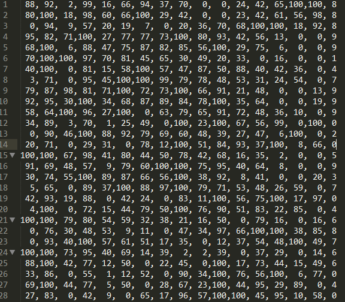
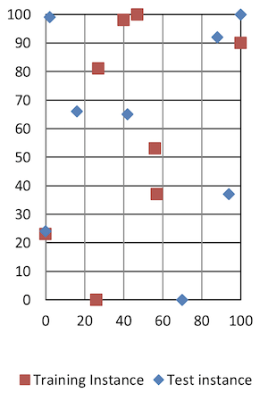
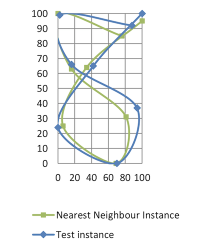
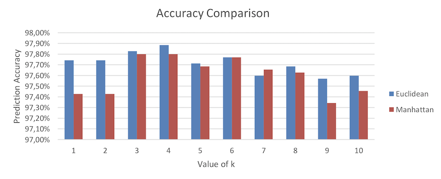

White paper
{: #wp-brand}

# Machine Learning in kdb+:<br>k-Nearest Neighbor classification and pattern recognition with q

by [Emanuele Melis](#author)
{: .wp-author}


Amongst the numerous algorithms used in machine learning, k-Nearest Neighbors (k-NN) is often used in pattern recognition due to its easy implementation and non-parametric nature. A k-NN classifier aims to predict the class of an observation based on the prevailing class among its k-nearest neighbors; “nearest” is determined by a distance metric between class attributes (or features), and k is the number of nearest neighbors to consider.

Class attributes are collected in n-dimensional arrays. This means that the performance of a k-NN classifier varies depending on how quickly it can scan through, apply functions to, and reduce numerous, potentially large arrays.

The UCI website contains several examples of such datasets; an interesting example is the [Pen-Based Recognition of Handwritten Digits](https://archive.ics.uci.edu/ml/datasets/Pen-Based%2BRecognition%2Bof%2BHandwritten%2BDigits). 

:fontawesome-regular-hand-point-right: Lichman, M. (2013). [UCI Machine Learning Repository](http://archive.ics.uci.edu/ml). Irvine, CA: University of California, School of Information and Computer Science.

This dataset contains two disjointed collections:

-   `pendigits.tra`, a collection of 7494 instances with known class labels which will be used as training set;
-   `pendigits.tes`, a collection of 3498 instances (with known labels, but not used by the classifier) which will be used as test set to assess the accuracy of the predictions made.

Class features for each instance are represented via one-dimensional arrays of 16 integers, representing X-Y coordinate pairs in a 100×100 space, of the digital sampling of the handwritten digits. The average number of instances per class in the training set is 749.4 with a standard deviation of 30.00.

Due to its compute-heavy features, k-NN has limited industry application compared to other machine-learning methods. In this paper, we will analyze an alternative implementation of the k-NN, using the array-processing power of kdb+. Kdb+ has powerful built-in functions designed and optimized for tables and lists. Together with qSQL, these functions can be used to great effect for machine-learning purposes, especially with compute-heavy implementations like k-NN.

All tests were run using kdb+ version 3.5 2017.06.15, on a Virtual Machine with four allocated 4.2GHz cores. Code used can be found at :fontawesome-brands-github: [kxcontrib/wp-knn](https://github.com/kxcontrib/wp-knn).


## Loading the dataset in q

Once downloaded, this is how the dataset looks in a text editor:



<small>_Figure 1: CSV dataset_</small>

The last number on the right-hand side of each line is the class label, and the other sixteen numbers are the class attributes; 16 numbers representing the 8 Cartesian coordinates sampled from each handwritten digit.

We start by loading both test and training sets into a q session:

```q
loadSet:{
  n:16;                   / # columns
  c:(`$'n#.Q.a),`class;   / column names
  t:"ic" where n,1;       / types
  x set`class xkey flip c! (t; ",") 0: ` sv`pendigits,x }
```
```q
q)loadSet each `tra`tes;
q) tes
class| a   b   c  d   e   f   g   h   i   j  k   l  m   n   o   p
-----| ------------------------------------------------------------
8    | 88  92  2  99  16  66  94  37  70  0  0   24 42  65  100 100
8    | 80  100 18 98  60  66  100 29  42  0  0   23 42  61  56  98
8    | 0   94  9  57  20  19  7   0   20  36 70  68 100 100 18  92
9    | 95  82  71 100 27  77  77  73  100 80 93  42 56  13  0   0
9    | 68  100 6  88  47  75  87  82  85  56 100 29 75  6   0   0
..

q)tra
class| a   b   c  d   e   f   g   h   i   j  k   l  m   n   o   p
-----| ------------------------------------------------------------
8    | 47  100 27 81  57  37  26  0   0   23 56  53 100 90  40  98
2    | 0   89  27 100 42  75  29  45  15  15 37  0  69  2   100 6
1    | 0   57  31 68  72  90  100 100 76  75 50  51 28  26  16  0
4    | 0   100 7  92  5   68  19  45  86  34 100 45 74  23  67  0
1    | 0   67  49 83  100 100 81  80  60  60 40  40 33  20  47  0
..
```

For convenience, the two resulting dictionaries are flipped into tables and keyed on the class attribute so that we can later leverage qSQL and some of its powerful features. Keying at this stage is done for display purposes only. Rows taken from the sets will be flipped back into dictionaries and the class label will be dropped while computing the distance metric.

The column names do not carry any information and so the first 16 letters of the alphabet are chosen for the 16 integers representing the class attributes; while the class label, stored as a character, is assigned a mnemonic tag `class`.


## Calculating distance metric

As mentioned previously, in a k-NN classifier the distance metric between instances is the distance between their feature arrays. In our dataset, the instances are rows of the `tra` and `tes` tables, and their attributes are the columns. To better explain this, we demonstrate with two instances from the training and test set:

```q
q) show tra1:1#tra
class| a   b   c  d   e   f   g   h   i   j  k   l  m   n   o   p
-----| ------------------------------------------------------------
8    | 47  100 27 81  57  37  26  0   0   23 56  53 100 90  40  98

q) show tes1:1#tes
class| a   b   c  d   e   f   g   h   i   j  k   l  m   n   o   p
-----| ------------------------------------------------------------
8    | 88  92  2  99  16  66  94  37  70  0  0   24 42  65  100 100
```




<small>_Figure 2-1: tra1 and tes1 point plot Figure 2-2: tra1 and tes1 visual
approximation_</small>

Both instances belong to the class `8`, as per their class labels. However, this is not clear by just looking at the plotted points and the `class` column is not used by the classifier, which will instead calculate the distance between matching columns of the two instances. That is, calculating how far the columns `a`, `b`, …, `p` of `tes1` are from their counterparts in `tra1`. While only an arbitrary measure, the classifier will use these distances to identify the nearest neighbor/s in the training set and make a prediction.

In q, this will be achieved using a binary function whose arguments can be two tables. Using the right [iterators](../../ref/iterators.md), this function is applied column by column, returning one table that stores the result of each iteration in the columns `a`, `b`, …, `p`. A major benefit of this approach is that it relieves the developer from the burden of looping and indexing lists when doing point-point computation.

The metric that will be used to determine the distance between the feature points of two instances is the _Manhattan distance_:

$$\sum_{i=1}^{k} | x_i - y_i |$$

It is calculated as the sum of the absolute difference of the Cartesian coordinates of the two points. Using a Cartesian distance metric is intuitive and convenient as the columns in our set represent X or Y coordinates:

```q
q)dist:{abs x-y}
q)tra1 dist' tes1
class| a  b c  d  e  f  g  h  i  j  k  l  m  n  o  p
-----| ---------------------------------------------
8    | 41 8 25 18 41 29 68 37 70 23 56 29 58 25 60 2
```

Now that the resulting table represents the distance metric between each attribute of the two instances, we can sum all the values and obtain the distance between the two instances in the feature space:

```q
q)sums each tra1 dist' tes1
class| a  b  c  d  e   f   g   h   i   j   k   l   m   n   o   p
-----| -----------------------------------------------------------
8    | 41 49 74 92 133 162 230 267 337 360 416 445 503 528 588 590
```

The q keyword `sums` adds up the columns from the left to the right starting at `a`. Thus, the last column, `p`, holds the total: 590, which represents the Manhattan distance between `tra1` and `tes1`. Expanding to run this against the whole training set, `tra`, will return the Manhattan distances between `tes1` and all the instances in `tra`.

Calculating the distance metric is possibly the heaviest computing step of a k-NN classifier. We can use `\ts` to compare the performance between the use of [Each Left and Each Right](../../ref/maps/#each-left-and-each-right), displaying the total execution time after many iterations (5000 in the example below was enough to show a difference). As both data sets are keyed on `class`, and `tra` contains more than one instance, a change of paradigm and iterator is necessary:

-   Un-key and remove the `class` column from `tes1`

-   Update the iterator so that `dist` gets applied to all rows of the `tra` table:

```q
q)\ts:5000 tra dist\: 1_flip 0!tes1
203770 5626544

q)\ts:5000 (1_flip 0!tes1) dist/: tra
167611 5626544
```

Keeping `tes1` as the left argument while using the Each Right iterator makes the execution a little more time-efficient due to how `tes1` and `tra` are serialized and how `tra` is indexed. Additionally, Each Right makes the order of the operations clearer: we are calculating the distance between the left argument (validation instance) and each row on the table in the right argument (training set).

In q, lambda calculus is supported and functions are “first-class citizens”:

```q
q){sums each (1_x) dist/: tra} flip 0!tes1
class| a  b   c   d   e   f   g   h   i   j   k   l   m   n   o   p
-----| --------------------------------------------------------------
8    | 41 49  74  92  133 162 230 267 337 360 416 445 503 528 588 590
2    | 88 91  116 117 143 152 217 225 280 295 332 356 383 446 446 540
1    | 88 123 152 183 239 263 269 332 338 413 463 490 504 544 628 728
4    | 88 96  101 108 119 121 196 204 220 254 354 375 407 449 482 582
1    | 88 113 160 176 260 294 307 350 360 420 460 476 485 530 583 683
6    | 12 20  106 106 139 147 224 234 304 320 357 381 412 461 541 621
4    | 88 96  97  124 134 165 174 176 206 277 350 423 446 462 496 596
..
```

Note there is no argument validation done within the lambda (this has minimal memory footprint and compute cost). The `x` argument must be a dictionary with the same keys as the table `tra`, `class` column excluded.

Assigning the operations to calculate the distance metric to a function (`dist`) is a convenient approach for non-complex metrics and testing, and it can be changed on the command line. However, it is executed 16 times each row in `d`, which makes it worth exploring if dropping `dist` results in better performance:

```q
q) \ts:250 {[d;t] sums each t dist/: d}[tra;] raze delete class from tes1 
3427 2315424 
q)// 13.34ms per run

q)\ts:250 {[d;t] sums each abs t -/: d}[tra;] raze delete class from tes1
3002 2314720  
q)// 12.00ms per run
```

As mentioned earlier, q is an array-processing language. If we take advantage of this by extracting the columns from the table and doing the arithmetic on them, we may gain performance by removing a layer of indirection. Let’s test converting `tra` into vectors (`flip value flip value`) before applying the distance metric:

```q
q)\ts:250 {[d;t] flip `class`dst!(exec class from d; sum each abs 
    t -/: flip value flip value d)} [tra;] raze delete class from tes1
2297 2783072 
q)// 9.18ms per run
```

We have identified a performant approach and can store the lambda as `apply_dist_manh`:

```q
apply_dist_manh:{[d;t] 
  dist:sum each abs t -/: flip value flip value d;
  flip `class`dst!(exec class from d; dist) }
```

The test instance can be passed as a dictionary removing the `class` column; or as a table using the iterator [Each](../../ref/maps/#each) after removing the column `class`. The returned result will be a list of tables if the parameter is passed as a table of length&gt;1, otherwise, a single table.

```q
q) apply_dist_manh[tra;]each delete class from tes1
+`class`dst!("821416405098597339225158640481857093549275633632543101453206..

q) apply_dist_manh[tra]each 2#delete class from tes1
+`class`dst!("821416405098597339225158640481857093549275633632543101453206..
+`class`dst!("821416405098597339225158640481857093549275633632543101453206..

q) apply_dist_manh[tra;]raze delete class from tes1
class dst
------------
8     590
2     540 
..
```

The performance gained by dropping the function `dist`, and converting
`d` and `t` into vectors before calculating the distance, will become crucial when using more complex metrics as examined below in [_Benchmarks_](#benchmarks).


## K-Nearest Neighbors and prediction

The classifier is almost complete. As the column `p` now holds the distance metric between the test instance and each training instance, to validate its behaviur we shall find if there are any instances of `tra` where `dst`&lt;590.


### Nearest Neighbor k=1

If k=1 the prediction is the class of the nearest neighbor – the instance with the smallest distance in the feature space. As all distance metrics are held in the column `dst`, we want to “select the class label of the row from the result of applying the distance metric where the distance is the minimum distance in the whole table”. In qSQL:

```q
q)select Prediction:class, dst from 
    apply_dist_manh[tra;]raze[delete class from tes1] where dst=min dst
Prediction dst
-------------------
8          66

q)select from tra where i in exec i from 
    apply_dist_manh[tra;]raze[delete class from tes1] where dst=min dst
class| a  b  c d   e  f  g  h  i  j k l  m  n  o   p
-----| ----------------------------------------------
8    | 76 85 0 100 16 63 81 31 69 0 6 25 34 64 100 95
```

Querying the virtual column `i`, we can find the row index of the nearest neighbor used for the prediction. Plotting this neighbor we see some points now overlap, while the distance between non-overlapping points is definitely
minimal compared to the previous example (Figure 2-2):



<small>_Figure 3: tes1 and its nearest neighbor_</small>

Another approach to finding the k-nearest neighbor is to sort the result of `apply_dist_manh` in ascending order by `dst`. This way, the first k rows are the k-nearest neighbors. Taking only the first row is equivalent to selecting the nearest neighbor.

```q
q)select Prediction:class from
    1#`dst xasc apply_dist_manh[tra;]raze delete class from tes1
Prediction
----------
8
```

Or instead limit to the first row by using the row index:

```q
q)select Prediction:class from 
    `dst xasc apply_dist_manh[tra;]raze[delete class from tes1] where i<1
Prediction
----------
8
```

Sorting `dst` has the side effect of applying the sorted attribute to the column. This information allows kdb+ to use a binary search algorithm on that column.


### k&gt;1

For k&gt;1, the prediction is instead the predominant class among the k-nearest neighbors. Tweaking the above example so that 1 is abstracted into the parameter `k`:

```q
q)k:3
q)select Neighbor:class,dst from 
    k#`dst xasc apply_dist_manh[tra;]raze delete class from tes1
Neighbor  dst
-------------
8         66 
8         70 
8         75

q)k:5
q)select Neighbor:class,dst from 
    k#`dst xasc apply_dist_manh[tra;]raze delete class from tes1
Neighbor  dst
-------------
8         66
8         70
8         75
8         92
8         94
```

At this point, knowing which results are the k-nearest neighbors, the classifier can be updated to have class “prediction” functionality.

The steps needed to build the k-NN circle table can be summarized into a function `get_nn`:

```q
q)get_nn:{[k;d] select class,dst from k#`dst xasc d} 
```


### Prediction test

The next step is to make a prediction based on the classes identified in the k-NN circle. This will be done by counting the number of occurrences of each class among the k-nearest neighbors and picking the one with the highest count.

As the k-NN circle returned by `get_nn` is a table, the qSQL `fby` keyword can be used to apply the aggregating keyword `count` to the virtual column `i`, counting how many rows per each `class` are in the in k-NN circle table, and compare it with the highest count:

```q
qpredict:{
  1#select Prediction:class 
    from x 
    where ((count;i)fby class)=max(count;i)fby class }
```

For k&gt;1, it is possible that `fby` can return more than one instance, should there not be a prevailing class. Given that `fby` returns entries in the same order they are aggregated, class labels are returned in the same order they are found. Thus, designing the classifier to take only the first row of the results has the side effect of defaulting the behavior of `predict` to k=1. Consider this example:

```q
foo1:{
  select Prediction:class 
  from x 
  where ((count;i)fby class)=max (count;i)fby class }

foo2:{
  1#select Prediction:class 
  from x 
  where ((count;i)fby class)=max (count;i)fby class }
```
```q
q)dt:([]nn:"28833"; dst:20 21 31 50 60) // dummy table, random values
q)(foo1;foo2)@\: dt
+(,`Prediction)!,"8833"     // foo1, no clear class
+(,`Prediction)!,,"2"       // foo2, default to k=1; take nearest neighbor
```

Let’s now test `predict` with k=5 and `tes1`:

```q
q) predict get_nn[5;] apply_dist_manh[tra;]raze delete class from tes1
Prediction
----------
8
```

Spot on!


## Accuracy checks

Now we can feed the classifier with the whole test set, enriching the result of `predict` with a column `Test`, which is the class label of the test instance, and a column `Hit`, which is only true when prediction and class label match:

```q
apply_dist: apply_dist_manh

test_harness:{[d;k;t]
  select Test:t`class, Hit:Prediction=' t`class from
    predict get_nn[k] apply_dist[d] raze delete class from t }
```


### Running with k=5

```q
q) R5:test_harness[tra;5;] peach 0!tes
q) R5
+`Test`Hit!(,"8";,1b)
+`Test`Hit!(,"8";,1b)
+`Test`Hit!(,"8";,1b)
+`Test`Hit!(,"9";,1b)
..
```

As the result of `test_harness` is a list of predictions. It needs to be razed into a table to extract the overall accuracy stats. The accuracy measure is the number of hits divided by the number of predictions made for the correspondent validation class:

```q
q)select Accuracy:avg Hit by Test from raze R5
Test| Accuracy
----| ---------
0   | 0.9614325
1   | 0.9505495
2   | 0.9945055
3   | 0.9940476
4   | 0.978022
5   | 0.9761194
6   | 1
7   | 0.9532967
8   | 0.9970238
9   | 0.9672619
```


### Running with k=3

```q
q)R3:test_harness[tra;3;] peach 0!tes

q)select Accuracy:avg Hit by Test from raze R3
Test| Accuracy
----| ---------
0   | 0.9641873
1   | 0.9587912
2   | 0.9917582
3   | 0.9940476
4   | 0.9807692
5   | 0.9701493
6   | 1
7   | 0.967033
8   | 0.9970238
9   | 0.9583333
```


### Running with k=1

```q
q)R1:test_harness[tra;1;] peach 0!tes

q)select Accuracy:avg Hit by Test from raze R1
Test| Accuracy
----| ---------
0 | 0.9614325
1 | 0.9505495
2 | 0.9917582
3 | 0.9940476
4 | 0.978022
5 | 0.961194
6 |1
7 | 0.956044
8 | 0.9940476
9 | 0.9583333

q)select Accuracy: avg Hit from raze R1
Accuracy
---------
0.974271
```


## Further approaches


### Use secondary threads

Testing and validation phases will benefit significantly from the use of secondary threads in kdb+, applied through the use of the `peach` keyword: 

`-s 0` (0 secondary processes) – Run time: ~13s

```q
q)\ts:1000 test_harness[tra;1;] each 0!test
13395217 2617696 
q)// ~ 13.4s
```

`-s 4` (4 secondary processes) – Run time: ~4s

```q
q)\ts:1000 test_harness[tra;1;] peach 0!test
3951224 33712 
q)// ~3.9s
```

The following sections will make use of four secondary processes when benchmarking.


### Euclidean or Manhattan distance?

The Euclidean distance metric 

$$\sqrt{\sum_{i=1}^{k} (x_i - y_i)^2}$$

can be intuitively implemented as:

```q
apply_dist_eucl:{[d;t] 
  dist:{sqrt sum x xexp 2}each t -/: flip value flip value d;
  flip `class`dst!(exec class from d; dist) }
```

However, the implementation can be further optimized by squaring each difference instead of using `xexp`:

```q
q)\ts:1000 r1:{[d;t] {x xexp 2}each t -/: flip value flip value d}[tra;]
    raze delete class from tes1
42296 4782304 
q)// Slower and requires more memory

q)\ts:1000 r2:{[d;t] {x*x} t -/: flip value flip value d}[tra;]
    raze delete class from tes1
4511 3241920
```

The function `xexp` has two caveats:

-   for an exponent of 2 it is faster _not_ to use `xexp` and, instead, multiply the base by itself
-   it returns a float, as our dataset uses integers, so every cell in the result set will increase in size by 4 bytes

```q
q)min over r1=r2
1b   // Same values

q)r1~r2
0b   // Not the same objects

q)exec distinct t from meta r1
,"f"

q)exec distinct t from meta r2
,"i"  // {x*x} preserves the datatype

q)-22!'(r1;r2)
966903 487287 // Different size, xexp returns a 64bit datatype
```

Choosing the optimal implementation, we can benchmark against the full
test set:

```q
q)apply_dist: apply_dist_eucl

q)\ts R1:test_harness[tra;1;] peach 0!tes
4720 33856 
q)// ~1 seconds slower than the Manhattan distance benchmark

q)select Accuracy: avg Hit from raze R1
Accuracy
---------
0.9774157

q)select Accuracy:avg Hit by Test from raze R1
Test| Accuracy
----| ---------
0   | 0.9752066
1   | 0.9587912
2   | 0.9945055
3   | 0.9910714
4   | 0.9752747
5   | 0.9701493
6   | 1
7   | 0.956044
8   | 0.9970238
9   | 0.9583333
```


### Benchmarks

For the purpose of this benchmark, `get_nn` could be adjusted. Its implementation was to reduce the output of `apply_dist` to a table of two columns, sorted on the distance metric. However, if we wanted to benchmark multiple values of `k`, `get_nn` would sort the distance metric tables on each `k` iteration, adding unnecessary compute time. With that in mind, it can be replaced by:

```q
{[k;d} k#\:`dst xasc d}
```

Where `k` can now be a list, but `d` is only sorted once. Changing `test_harness` to leverage this optimization:

```q
test_harness:{[d;k;t] 
  R:apply_dist[d] raze delete class from t; 
  select Test:t`class, Hit:Prediction=' t`class,k 
    from raze predict each k#\:`dst xasc R }
```

Manhattan distance:

```q
q)apply_dist:apply_dist_manh // Manhattan Distance

q)// 2 cores, 4 secondary threads (-s 4)
q)\ts show select Accuracy:avg Hit by k from 
    raze test_harness[tra;1+til 10]peach 0!tes
k | Accuracy
--| ---------
1 | 0.974271
2 | 0.974271 
3 | 0.9779874 
4 | 0.9779874 
5 | 0.9768439 
6 | 0.9777015 
7 | 0.976558 
8 | 0.9762722 
9 | 0.9734134 
10| 0.9745569 
4892 4198224

q)4892%count tes
1.398513  
q)// ~1.4 ms average to classify one instance

q)// 4 cores, 8 secondary threads (-s 8)
q)\ts show select Accuracy:avg Hit by k from 
    raze test_harness[tra;1+til 10]peach 0!tes
k | Accuracy
--| ---------
1 | 0.974271
2 | 0.974271 
3 | 0.9779874 
4 | 0.9779874 
5 | 0.9768439 
6 | 0.9777015 
7 | 0.976558 
8 | 0.9762722 
9 | 0.9734134 
10| 0.9745569 
2975 4198224

q)2975%count tes
0.850486  
q)// .8 ms average to classify one instance
```

Euclidean distance:

```q
q)apply_dist:apply_dist_eucl // Euclidean Distance

q)// 2 cores, 4 secondary threads (-s 4)
q)\ts show select Accuracy: avg Hit by k from 
    raze test_harness[tra;1+til 10]peach 0!tes
k | Accuracy
--| ---------
1 | 0.9774157
2 | 0.9774157 
3 | 0.9782733 
4 | 0.9788451 
5 | 0.9771298 
6 | 0.9777015 
7 | 0.9759863 
8 | 0.9768439 
9 | 0.9757004 
10| 0.9759863 
6717 4196416

q)6717%count tes
1.92  // ~1.9ms average to classify one instance
// 4 cores, 8 secondary threads (-s 8)
q)\ts show select Accuracy:avg Hit by k from 
    raze test_harness[tra;1+til 10]peach 0!tes
k | Accuracy
--| ---------
1 | 0.9774157
2 | 0.9774157 
3 | 0.9782733 
4 | 0.9788451 
5 | 0.9771298 
6 | 0.9777015 
7 | 0.9759863 
8 | 0.9768439 
9 | 0.9757004 
10| 0.9759863 
3959 4200144
q)3959%count tes
1.13  
q)// ~1.1ms average to classify one instance
```



<small>_Figure 4: Accuracy comparison between Euclidean and Manhattan_</small>


## Conclusions

In this paper, we saw how trivial it is to implement a k-NN classification algorithm with kdb+. Using tables and qSQL it can be implemented with three select statements at most, as shown in the util library at
:fontawesome-brands-github:
[kxcontrib/wp-knn](https://www.github.com/kxcontrib/wp-knn).
We also briefly saw how to use iterators to optimize the classification time, and how data structures can influence performance comparing tables and vectors.

Benchmarking this lazy implementation, with a random dataset available on the UCI website and using the Euclidean distance metric showed an average prediction accuracy of ~97.7%. The classification time can vary greatly, based on the number of cores and secondary threads used. With 2 cores and 4 secondary threads (`-s 4`) the classification time of a single instance after optimization of the code was ~1.9ms per instance and the total validation time decreased significantly when using 4 cores and 8 secondary threads (`-s 8`), showing how kdb+ can be used to great effect for machine-learning purposes, even with heavy-compute implementations such as the k-NN.

[:fontawesome-solid-print: PDF](/download/wp/machine_learning_in_kdb.pdf)


## Author

**Emanuele Melis** works for KX as kdb+ consultant. Currently based in the UK, he has been involved in designing, developing and maintaining solutions for equities data at a world-leading financial institution. Keen on machine learning, Emanuele has delivered talks and presentations on pattern-recognition implementations using kdb+.

