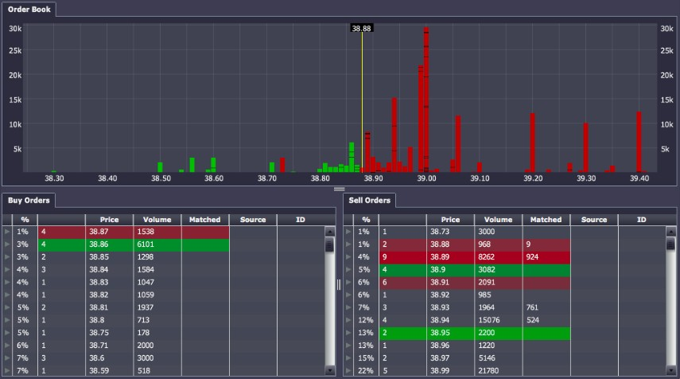

White paper
{: #wp-brand}

# Sample aggregation engine for market depth

by [Stephen Dempsey](#author)
{: .wp-author}


Throughout the past decade the volume of data in the financial markets has increased substantially due to a variety of factors, including access to technology, decimalization and increased volatility. As these volumes increase it can pose significant problems for applications consuming market depth, which is summarized as the quantity of the instrument on offer at each price level. The purpose of this white paper is to describe a sample method for efficiently storing and producing views on this depth data.

Due to the large data volume most applications won’t want to consume or process the full depth of book. Having the process subscribe to the full depth and calculate a top-of-book (TOB) will be computationally expensive and take up valuable processing time. Additionally, if there were multiple applications looking to consume the same data it might not make sense to repeat the effort. Offloading the work to a separate calculation engine would be appropriate since it could then calculate the required data and publish to any interested consumers. An example of this might be a mark-to-market engine that only wants a TOB price. There are other benefits to this approach and these will be outlined in the discussion section.



<small>_Sample order book displaying price level and depth information for a stock_</small>

Using TOB calculation as a use case, we will describe a flexible framework for approaching the problem and touch on some possible enhancements. Kdb+ is highly optimized for vector operations so the framework will use this strength. For example, instead of re-running the same code multiple times, it will use vector operations and shared code where possible. We will also introduce the concept of filtering data sources so multiple downstream consumers can see different views on the same quote landscape. For the purpose of this paper the examples use FX data, which requires price aggregation across liquidity sources. However, this requirement to aggregate across venues is also increasingly becoming the case in the equity market, where the large exchanges are losing volume and liquidity is more fragmented across pools and alternative sources.

For simplicity it is assumed the engine operates in a pub/sub framework where updates are received from upstream liquidity sources through a `upd` function and published downstream using a `pub` function. The `upd` function is a generic callback for incoming data and is called with the schema name and table of updates. The definition of these functions will be implementation-specific and is deliberately ignored for the purpose of this paper. The logic will not be applicable in every case and there are a few caveats, which will be discussed at the end. It should be noted that this paper assumes the consumers of depth information are computer programs. However, human consumers including traders and surveillance personnel also find it useful to visualize the book. While this paper does not focus on the visualization of market depth, there are visualization tools available that can assist in viewing the full depth of the order book. [Kx Dashboards](/dashboards/index.html), seen above in Figure 1, is one example of such tools.

All code was run using kdb+ version 3.1 (2013.11.20).


## Approach

As the volume of incoming data increases, sorting the book on every tick becomes computationally expensive and might be unnecessary. For this reason a timer-based approach might be more appropriate, where the TOB is calculated and published periodically. The timer value will need to be calibrated according to requirements and performance considerations since it depends on multiple factors. A few examples are listed below:

-   Volume of quotes being received – if the volume of quotes is quite low, it wouldn’t make sense for the timer interval to be small
-   Type of consumer processes – consumers may want the data only in quasi-realtime, i.e. a longer timer interval might be more appropriate
-   Latency of code – if it typically takes 10ms for the timer code to run, then a timer interval of 5ms wouldn’t make sense
-   Number of subscriptions – as the number of subscriptions/consumers grows, the likelihood is that the timer function will take longer to run


## Schemas and data structures

In this section, some sample schemas and data structures are defined for storing the quote data. The `marketQuotes` schema is displayed below; this is assumed to be the format of the data received from our upstream feeds. An assumption is being made is that only the last quote per distinct price level is valid, i.e. if a EURUSD quote from `FeedA` and level 0 is received twice then the second quote overwrites the first. For this reason the table is keyed by the `sym`, `src` and `level` columns in the engine process.

```q
marketQuotes:([]
    time:`timestamp$();
    sym:`symbol$();
    src:`symbol$();
    level :`int$();
    bid:`float$();
    ask:`float$();
    bsize:`int$();
    asize:`int$();
    bexptime:`timestamp$();
    aexptime:`timestamp$() ) 

`sym`src`level xkey `marketQuotes
quote:update bok:1b, aok:1b from marketQuotes
```


The second schema defined is a modified version of `marketQuotes`. This will be used internally and updated on every timer run. The `aok` & `bok` columns are flags to indicate whether a quote is still valid and will be updated periodically. The reason for keeping two similar schemas instead of one will become clearer later. The internal quote is updated on every timer call and is only ever appended to, which allows the engine to take advantage of a useful feature of keyed tables in kdb+. The row index of a specific key combination doesn’t change from the moment it’s added (assuming rows are never removed).

The following is an example using a simplified version of the `marketQuotes` table, mentioned above, with the same key columns. We assume the table below is the application’s current snapshot of the market.

```q
q)marketQuotes
sym    src   level| time                          bid     ask    ..
------------------| ---------------------------------------------..
EURUSD FeedA 2    | 2013.11.20D19:05:00.849247000 1.43112 1.43119..
EURUSD FeedB 2    | 2013.11.20D19:05:00.849247000 1.43113 1.4312 ..
```

Now another quote arrives for EURUSD, FeedA with a level of 2. This would overwrite the previous one, as highlighted below. The row index or position in the table of that key combination remains the same but the time and price columns update.

```q
q)/ table after new quote
q)show marketQuotes upsert `time`sym`src`level`bid`ask! 
    (.z.p;`EURUSD;`FeedA;2;1.43113;1.43118)
sym    src   level| time                          bid     ask    ..
------------------| ---------------------------------------------..
EURUSD FeedA 2    | 2019.09.25D02:58:03.729837000 1.43113 1.43118..
EURUSD FeedB 2    | 2013.11.20D19:05:00.849247000 1.43113 1.4312 ..
```

Using the behavior from the previous example it’s possible to map each instrument to its corresponding row index so that it’s easy to quickly extract all entries for an instrument, i.e. the EURUSD instrument would map to row numbers 0 and 1 in the previous example. This functionality could also be extended to do additional filtering, which will be touched on in more detail later.

The structures below (`bids` and `asks`) will store the row indexes of occurrences of each instrument, sorted from best to worst on each side of the market and will be updated on each timer call. The second set of structures (`validbids` and `validasks`) is used to store the indexes of unexpired prices by instrument. By using the `inter` keyword, the unexpired rates can be extracted quickly and pre-sorted.

```q
asks:bids:(`u#"s"$())!() 
validbids:validasks:(`u#"s"$())!()
```

The following example shows how the sorted row indexes for EURUSD are extracted. The important thing to note here is that the `inter` keyword preserves the order of the first list, i.e. the result of the third command results in a list of unexpired bids for EURUSD, still sorted by price.

```q
q)bids[`EURUSD] 
1 3 5 8 2 6
q)validbids[`EURUSD] 
1 8 3 6
q)bids[`EURUSD] inter validbids[`EURUSD] 
1 3 8 6
```


### Stream groupings

As mentioned previously, the engine might need to handle some additional filtering and an example was outlined where filtering was performed to remove expired quotes. To extend this, the concept of stream groupings is introduced where there are multiple subscribers in the system, for the derived data with each having different entitlements to the feeds/streams. This is a common requirement in real-world applications where institutions need to manage their pricing and counterparties. The table below is an example of how those entitlements might look.

```txt
Instrument  Stream group  Streams
-------------------------------------------
EURUSD      A             Feed1,Feed2,Feed3
EURUSD      B             Feed1,Feed4
```

If the engine could create groups of subscriptions (stream groups) then it could create mappings as before and use the inter function to apply them. For example if there were two stream groups (A and B) for EURUSD, then the engine could then extract the best, unexpired prices for each group.

Some structures and functions to handle the maintenance of stream groups per instrument are detailed below; this will be achieved by giving each subscription a distinct group name. The structures and a description of each are as follows:

structure     | description
--------------|--------------
symtogroup    | maps an instrument to list of stream groups
grouptosym    | maps a group name back to an instrument
streamgroups  | maps a stream name to a list of feeds/sources
streamindices | maps a stream name to a list of row indexes (corresponding to rows with the instrument and sources in the group)

```q
symtogroup:(`u#"s"$())!()
grouptosym:(`u#"s"$())!"s"$()
streamgroups:(`u#"s"$())!()
streamindices:(`u#"s"$())!()
```


The function below is used to create a stream group for an instrument by instantiating the data structures. Arguments to the function are:

```txt
sym     instrument name
strgrp  stream group name
strms   symbol list of streams in the group
```

A sample call to register a stream group is displayed below along with how data structures would be populated. The stream group name is appended to the instrument to ensure further uniqueness across instruments (though this might not be necessary):

```q
registerstreamgroup:{[sym;strgrp;strms] 
  sg:` sv (sym;strgrp);
  if[sg in key streamgroups; :(::)]; 
  @[`symtogroup; sym; union; sg];
  @[`grouptosym; sg; :; sym]; 
  @[`streamgroups; sg; :; strms]; 
  @[`streamindices; sg; :; "i"$()]; }
```


At this point, an SG1 stream group with two component feeds has been created for EURUSD. `streamindices` is initialized for the stream group as an empty list of integers. It is assumed that all the stream groups are registered before any quotes are received and that the indexes will be updated whenever new quotes enter the system. As new quotes arrive, if the key combination is new to our internal quote table then the source might be part of a stream group and the engine will have to update the `streamindices` structure to account for this. The following function is called in this event, where the input is a table containing the new quotes. If any of the new quotes are part of a stream group then their row numbers are appended to the structure in the appropriate places:

```q
updstreamgroups:{[tab]
  sg:raze symtogroup distinct exec sym from tab;
  s:grouptosym sg;
  .[`streamindices; (); ,'; ] sg!
    {[x;s;srcs] 
      $[count r:exec row from x where sym=s, src in srcs; r; "i"$()]
    }[tab]'[s;streamgroups sg]; }
```

Using the stream groupings from the previous section, the following example shows how the `streamindices` structure is updated for new quotes. The `tab` parameter is assumed to be as below (price, size and other columns have been omitted):

```q
q)tab / New incoming quotes table
sym    src   level row
----------------------
EURUSD FeedA 0     5
EURUSD FeedB 2     6

q)streamindices        / before
EURUSD.SG1| 0 2 3
EURUSD.SG2| 1 4

q)updstreamgroups tab

q)streamindices         / after
EURUSD.SG1| 0 2 3 5
EURUSD.SG2| 1 4 5 6
```

FeedA is a member of both stream groups so row index 5 is added to both groups whereas FeedD is only a member of SG2.


## Implementation

### Quote preparation

Quotes are assumed to be received from upstream through a generic `upd` function, the definition of which is displayed below. Incoming quotes are appended to the `marketQuotes` schema and between each timer call quotes may be conflated due to the key columns. This will only happen if a quote is republished during the timer interval for the same instrument, source and level. This function could be modified to include custom code or table handling. On each timer call, the entire `marketQuotes` table will be passed into the sorting algorithm (the `quoteTimer` function).

```q
upd:{[t;x]
  // .....
  if[t=`marketQuotes; t upsert x];
  // .....
  }

.z.ts:{[]
  quoteTimer[0!marketQuotes];
  marketQuotes:0#marketQuotes; }
```

After the sorting algorithm finishes, the `marketQuotes` table is cleared of records. This is the reason two schemas are used instead of one. The internal quote schema holds the latest quotes from each timer call and `marketQuotes` holds only the data between timer calls. This means that only new quotes are processed by the sorting algorithm each time.


### Sorting algorithm

The main body of the algorithm is done in the `quoteTimer` function and is called each time the timer fires. The incoming data is appended to the `quote` table with the expiry flags set to true (unexpired). If the count of the `quote` table has increased then there has been a new quote key received and the engine needs to update the stream group indexes as described in the stream grouping section.

The algorithm then proceeds to sort the bid and ask sides of the market separately, these are then appended to the `bids` and `asks` structures for each updated instrument. The sorting algorithm in the example is from best-to-worst (descending on bid, ascending on ask).

```q
quoteTimer:{[data]
  qc:count quote;
  `quote upsert update bok:1b, aok:1b from data;

  s:distinct data`sym;
  if[not count s; :()];

  if[qc<count[quote]; updstreamgroups[qc _ update row:i from quote]; ];

  bids,:exec i {idesc x}[bid] by sym from quote where sym in s; 
  asks,:exec i {iasc x}[ask] by sym from quote where sym in s;

  checkexpiry[];
  updsubscribers[s]; }
```

The `checkexpiry` function is used to update the expiry flags on the `quote` table and update the valid quote structures. The row indexes of each valid quote are extracted by instrument and appended as before:

```q
checkexpiry:{[]
  now:.z.p;
  update bok:now<bexptime, aok:now<aexptime from `quote; 
  validbids,:exec i where bok by sym from quote; 
  validasks,:exec i where aok by sym from quote; }
```
```q
q)exec i where bok by sym from quote
EURUSD| 0 2 5 6 8 9 12 13 14
GBPUSD| 1 3 4 7 10 11 15
```

At this point the algorithm should be able to extract the unexpired and sorted quotes. This will be performed by a function using the method described before. The functions below take a list of instruments and extract the best, valid quote indexes for each instrument:

```q
q)getactivebids:{[s] bids[s] inter' validbids[s]}
q)getactiveasks:{[s] asks[s] inter' validasks[s]}
q)getactivebids[`EURUSD`GBPUSD]
0 6 8 14 5 9 12 13 2
3 15 4 7 10 1 11
```


### Grouping algorithm

The last part of the algorithm creates the output to be published downstream. It extracts the best quotes per instrument and applies the filters per stream group. Taking the list of updated instruments as an input, it extracts the list of applicable stream groups. The best valid quotes are extracted and the `inter` keyword is used to filter them to include only indexes that are valid for each stream group:

```q
updsubscribers:{[s]
  sg:raze symtogroup[s];
  s:grouptosym[sg];

  aix:getactiveasks[s] inter' streamindices[sg]; 
  bix:getactivebids[s] inter' streamindices[sg];

  qts:(0!quote)[`bid`ask`bsize`asize`src];

  bind:{[amnts;sz;s] s first where amnts[s] >= sz} [qts[2];1000000]'[bix];
  aind:{[amnts;sz;s] s first where amnts[s] >= sz} [qts[3];1000000]'[aix];

  new:([] time:.z.p;
    sym:s; 
    stream:sg; 
    bid:  qts[0;bind]; 
    ask:  qts[1;aind]; 
    bsize:qts[2;bind]; 
    asize:qts[3;aind]; 
    bsrc: qts[4;bind]; 
    asrc: qts[4;aind] );

  pub[`quoteView; new];
};
```

Local variables `sg` and `s` are assigned the stream groups for the list of updated instruments and the corresponding instruments, i.e. if there are two stream groups for EURUSD in `sg`, there will be two instances of EURUSD in `s`. This ensures the two variables conform when `aix` and `bix` are defined. In these lines of code the best quotes are extracted using the `getactivebids` and `getactiveasks` functions. The row indexes returned for each instrument are then filtered to include only rows corresponding to each stream group. The two variables `aix` and `bix` then contain the sorted indexes per stream group.

```q
q)sg
`EURUSD.SG1`EURUSD.SG2
q)s
`EURUSD`EURUSD
q)getactiveasks[s] inter' streamindices[sg] 
2 5 0
5 6
```

Obviously the best or TOB quote would be the first element for each stream group. However, to add slightly more complexity, the engine may only require prices for sizes above 1 million. The definition of `qts`  extracts a list of columns to be used when building the result. `qts` is a five-item list with each item consisting of column data. These are used to extract price, size and source information for the row indexes.

```q
q)qts
1.295635 1.295435 1.295835 1.295835
1.295835 1.295635 1.296035 1.296035
500000   500000   1000000  1000000
500000   500000   1000000  1000000
FeedA    FeedB    FeedB    FeedA
```

For each stream group, the engine has a list of sorted indexes. In the definitions of `bind` and `aind` it indexes into the lists of sizes to extract quotes with size greater than the 1-million limit. This is then applied back to the list of rows so the `bind` and `aind` variables then contain the index of the best quote per stream group.

Using the example from before, with two stream groups for EURUSD and the `qts` table, the index of the best bid (with a size above 1 million) per stream group is extracted.

```q
q)show bind:{[amnts;sz;s] s first where amnts[s]>=sz}[qts[2];1000000]'[bix]
33
```

A table of output is built using these indexes with a row for each stream group. The `pub` function will be implementation-specific and is left undefined in this example.


## Discussion

This paper has discussed a framework for aggregating market depth using FX data as an example, as well as managing multiple subscriptions. For simplicity, the code was kept relatively succinct and is not production-ready. It would need to be optimized for each use case, but at least describes the approach and highlights the enhancements or optimizations that could be integrated.

There are many benefits to the method suggested above. As discussed in the introduction, sorting the book in each engine and duplicating the work in each of them can be costly, so offloading this effort to another process makes sense. The downstream engines will then only have to listen to an incoming message instead of doing some expensive sorting. They will also be insulated from spikes in the amount of market data being published. For example, during market announcements these spikes may cause the engines to peg CPU and cause delays executing their normal functions. It will also take pressure off upstream publishers if they have to publish to one or two processes instead of multiple.

Obviously there are a few caveats with this approach and some situations where it may not be appropriate. Some engines may be sensitive to latency and need quotes as soon as possible: an execution engine would be an example. The approach described in this paper would introduce an extra hop of latency between the feed and the quote hitting the execution engine. This would probably be unacceptable, though the size of that latency would vary depending on a lot of factors such as the number of input streams and number of applications subscribing. There are also a couple of assumptions as part of the approach that may not be valid in every situation. Handling of order-book data in this type of situation is examined by white paper [“Kdb+ and FIX messaging”](../fix-messaging.md).

The sorting algorithm is shared across all stream groups, which might not always be the case. Adding multiple sorting algorithms would be possible but might adversely affect performance. Another assumption that was made concerned the validity of incoming market data, i.e. only the last quote per price stream (`sym`, `src` and `level` combination) is assumed to be valid. This is dependent upon the incoming data and might differ across applications.

A number of enhancements could easily be made to the engine. For instance, the stream groups currently need to be initialized prior to quotes being received and it would be relatively easy to have these initialized dynamically when a subscriber comes online. The output mode is also fixed to be TOB above a certain size and this could be enhanced to have a dynamic amount or use a VWAP price across multiple quotes for Immediate or Cancel (IOC) type views. Multiple output layers per stream group could also be added instead of just the TOB price.

In the example given, the engine sorts only by best-to-worst price but it could easily be modified to sort on multiple criteria. Sorting could be done on multiple columns as required: price and size, price and expiry, etc. The example below describes how sorting by price and size could be undertaken:

```q
tab:([]sym:`EURUSD; 
  src:`FeedA`FeedB`FeedC`FeedC;
  bid:1.2344 1.2345 1.2343 1.2344; 
  bsize:10000 5000 3000 12000 )
```
```q
q)/Quote table prior to sorting
q)tab 
sym    src   bid    bsize
-------------------------
EURUSD FeedA 1.2344 10000
EURUSD FeedB 1.2345 5000
EURUSD FeedC 1.2343 3000
EURUSD FeedD 1.2344 12000

q)/Quote table after sorting
q)tab {i idesc x i:idesc y} . tab`bid`bsize
sym    src   bid    bsize
-------------------------
EURUSD FeedB 1.2345 5000
EURUSD FeedD 1.2344 12000
EURUSD FeedA 1.2344 10000
EURUSD FeedC 1.2343 3000
```

It is worth noting that the `u` attribute is applied to the majority of data structures. This is used to ensure quick lookup times on the structure keys as they grow. 

:fontawesome-solid-street-view:
_Q for Mortals_: [§8.8 Attributes](/q4m3/8_Tables/#88-attributes)
<br>
:fontawesome-solid-book:
[Set Attribute](../../ref/set-attribute)

[:fontawesome-solid-print: PDF](/download/wp/sample_aggregation_engine_for_market_depth.pdf)


## Author


{: .small-face}

**Stephen Dempsey** is senior kdb+ developer on the Kx R&D team. His core responsibility has been developing the [Kx Platform](../../devtools.md#kx-platform) and supporting the wide range of applications built upon it. Earlier he implemented various kdb+ applications including large-volume exchange backtesting, and eFX trading.
&nbsp;
[:fontawesome-solid-envelope:](mailto:sdemspey@kx.com?subject=White paper: Market Depth) &nbsp;
[:fontawesome-brands-linkedin:](https://www.linkedin.com/in/stephen-dempsey-6b1b5319/)

