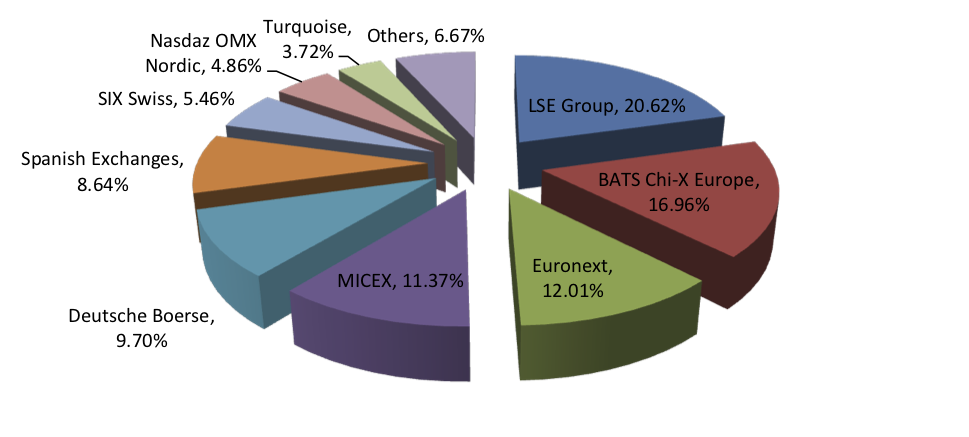
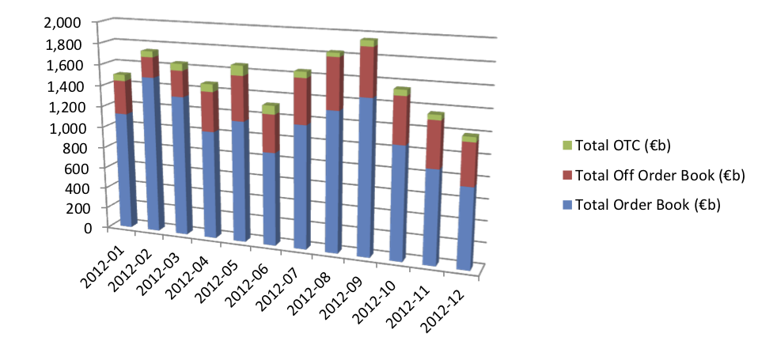

White paper
{: #wp-brand}

# Market Fragmentation:<br/>A kdb+ framework for multiple liquidity sources

by [James Corcoran](#author)
{: .wp-author}


Kdb+ plays a large part in the trading and risk management activities of many financial institutions around the world. For a large-scale kdb+ system to be effective, it must be designed efficiently so that it can capture and store colossal amounts of data. However, it is equally important that the system provides intelligent and useful functionality to end-users. In the financial world, increasing participation and advances in technology are resulting in a progressively more fragmented market with liquidity being spread across many trading venues. It is therefore crucial that a kdb+ system can store and analyze information for a financial security from all available sources. This paper presents an approach to the challenge of consolidating share price information for equities that trade on multiple venues.


### Motivation

Since the inception of the Markets in Financial Instruments Directive (MiFID), Multilateral Trading Facilities (MTFs) have sprung up across Europe. Alternative Trading Systems are the US equivalent. Prior to the MiFID, trading typically took place on national exchanges. Other types of trading venues in existence today include crossing networks and dark pools. All of these venues compete with each other for trading activity.

For market participants, the increased fragmentation forces more sophisticated trading strategies in the form of smart order routing. A number of additional factors add to the argument that the ability to consolidate real-time market data in-house can add real value to the trading strategies of an organization, including technical glitches at exchanges which can lead to suboptimal pricing and order matching.

  
<small>_Breakdown of the traded volume that occurred on the main trading venues for all EMEA equities in December 2012_</small>

Bearing in mind that the data output by a kdb+ system can often be the input into a trading decision or algorithm, the timely and accurate provision of consolidated real-time information for a security is vital.


### The data

The goal for kdb+ financial engineers is to analyze various aspects of a stock’s trading activity at each of the venues where it trades. In the equities world, real-time market data vendors provide trade, level-1 and level-2 quote feeds for these venues. Securities trading on different venues will use a different suffix, enabling data consumers to differentiate between venues – for example, Vodafone shares traded on the LSE are reported by Reuters on the Reuters Instrument Code (RIC) VOD.L, whereas shares of the same company traded on Chi-X are recorded on VODl.CHI. In the FX world, we might have feed handlers connecting directly to each ECN. The symbol column in our table would generally be a currency pair and we might use a venue column to differentiate between venues. Regardless of the asset class, in order to get a complete picture of a security’s trading activity the kdb+ system must collect and store data for all venues for a given security.

For the purposes of this paper, we will assume standard equity trade and quote tables. We will use Reuters cash equities market data in the examples and assume that our feed handler subscribes to the RICs we require and that it publishes the data to our tickerplant.


## The building blocks

In order to be able to effectively analyze and consolidate data for securities from multiple venues, we must first have in place an efficient mechanism for retrieving data for securities from a single venue. Here we introduce the concept of a gateway: a kdb+ process that acts as a connection point for end- users. The gateway’s purpose is to:

-   accept client queries and/or calls made to analytic functions;

-   to dispatch appropriate requests for data to the RDB or HDB, or both; and

-   to return the data to the client.

Data retrieval, data filtering, computation and aggregation, as a general rule, should all be done on the database. The gateway, once it has retrieved this data, can enrich it. Examples of enrichment are time zone conversion, currency conversion and adjustment for corporate actions. We make the case below that consolidation at the security level is also best done in the gateway.


### Analytic setup

A typical analytic that end-users might wish kdb+ to provide is an interval function, which gives a range of different analytic aggregations for a stock or list of stocks based on data between a given start time and end time on a given date, or for a range of dates. For simplicity, we will focus on analytics which span just one date. Let us call this function `getIntervalData`. Examples of the analytics the function could provide are `open`, `high`, `low`, `close`, `volume`, `avgprice`, `vwap`, `twap`, `meanspread`, `spreadvolatility`, `range`, and `lastmidprice`. We would like the ability to pass many different parameters into this function, and potentially more than the maximum number allowed in q, which is 8. We may also decide that some parameters are optional and need not be specified by the user. For these reasons we will use a dictionary as the single parameter, rather than defining a function signature with a specific number of arguments. A typical parameter dictionary looks like the following:

```q
q)params
symList  | `VOD.L
date     | 2013.01.15
startTime| 08:30
endTime  | 09:30
columns  | `vwap`volume
```


### Data filtering

It is important at this stage that we introduce the notion of data filtering. Trading venues have a regulatory requirement to report all trades whether they have been executed electronically or over the counter. Not all trades, particularly in the equities world, should be included in all calculations. For example, one user may want only lit order book trades to be included in his/her VWAP calculation, but another user may prefer that all order book trades appear in the VWAP figure.

  
<small>_Monthly breakdown of on-and-off order book traded volume across all EMEA equity markets for the year to December 2012_</small>

Market data vendors break trade data into different categories including auction, lit, hidden and dark order book, off order book and OTC trades, and use data qualifier flags to indicate which category each trade falls into. Data should be filtered based on these qualifiers, and according to the end-user’s requirements, prior to aggregation. This specification should be configurable within the parameter dictionary passed to the `getIntervalData` function.

The various qualifier flags used to filter the raw data for each category can be held in configuration files on a per-venue basis and loaded into memory in the database so that filtering can be done during execution of the query by the use of a simple utility function. An approach to storing this configuration is outlined as follows:

Define a dictionary, `.cfg.filterrules`, keyed by filtering rule, e.g. Order Book, Total Market, Dark Trades, where the corresponding values are tables holding the valid qualifier flags for each venue for that rule.

```q
q).cfg.filterrules
TM | (+(,`venue)!,`LSE`BAT`CHI`TOR)!+(,`qualifier)!,(`A`Auc`B`C`X`DARKTRADE`m..
OB | (+(,`venue)!,`LSE`BAT`CHI`TOR)!+(,`qualifier)!,(`A`Auc`B`C`m;`A`AUC`OB`C..
DRK| (+(,`venue)!,`LSE`BAT`CHI`TOR)!+(,`qualifier)!,(,`DARKTRADE;,`DARK;,`DRK..

q).cfg.filterrules[`OB]
venue| qualifier
---- | --------------
LSE  | `A`Auc`B`C`m
BAT  | `A`AUC`OB`C
CHI  | `a`b`auc`ob
TOR  | `A`Auc`X`Y`OB
```

Assuming we have access to a params dictionary, we could then construct our query as follows.

```q
select vwap:wavg[size;price], volume:sum[size] by sym from trade 
       where date=params[`date],
             sym in params[`symList],
             time within (params`startTime;params`endTime), 
             .util.validTrade[sym;qualifier;params`filterRule]
```

`.util.validTrade` makes use of the above config data, returning a Boolean indicating whether the qualifier flag for a given record is valid for that record’s sym according to the given filter rule. Due to the fact that we have defined valid qualifiers on a per-rule per-venue basis, we will of course require a method for retrieving a venue for a given sym. This is best done through the use of a simple dictionary lookup.

```q
q).cfg.symVenue
BARCl.BS | BAT
BARCl.CHI| CHI
BARC.L   | LSE
BARC.TQ  | TOR
VODl.BS  | BAT
VODl.CHI | CHI
VOD.L    | LSE
VODl.TQ  | TOR

q).util.getVenue[`VOD.L`BARC.BS] 
`LSE`BAT
```

This data processing takes place on the RDB and/or HDB. The query will have been dispatched, with parameters, by the gateway. We will now demonstrate a mechanism for consolidating data from multiple venues by passing an additional `multiMarketRule` parameter in our call to the gateway.


## Reference data

Having already briefly touched on it, we introduce the role of reference data more formally here. With the above analytic setup, we retrieve data only for the given symbol/s passed to the function. When a multimarket parameter is included however, we need to retrieve and aggregate data for all instrument codes associated with the entity mapped to the sym parameter.

With that in mind, the first thing we need to have is the ability to look up the venues on which a given stock trades. We also need to know the instrument codes used for the stock in question on each venue. As described above (_The data_), these will differ. This information is usually located in a reference data system. The reference data system could be a component of the kdb+ system or it could be an external application within the bank. Regardless of where the reference data is sourced, it should be processed and loaded into memory at least once per day. The databases (RDB and HDB) require access to the reference data, as does the gateway. In terms of size, reference data should be a very small fraction of the size of market data, so memory overhead will be minimal.

The most effective layout is to have a table keyed on sym, mapping each sym in our stock universe to its primary sym. By primary sym, we mean the instrument code of the company for the primary venue on which it trades. For example, VOD.L’s is simply VOD.L since Vodafone’s primary venue is the LSE whereas VODl.CHI’s is also VOD.L.

```q
q).cfg.multiMarketMap
sym      | primarysym venue
---------| ----------------
BARCl.BS | BARC.L     BAT
BARCl.CHI| BARC.L     CHI
BARC.L   | BARC.L     LSE
BARC.TQ  | BARC.L     TOR
VODl.BS  | VOD.L      BAT
VODl.CHI | VOD.L      CHI
VOD.L    | VOD.L      LSE
VODl.TQ  | VOD.L      TOR
```


## Consolidating the data


### Extending parameters

Providing a consolidated analytic for a stock requires that we query the database for all syms associated with an entity. With the above reference data at our disposal, we can now write a utility function,

`.util.extendSymsForMultiMarket`, which will expand the list of syms passed into the params dictionary. This function should be called if and only if a `multiMarketRule` parameter is passed. We should also be careful to preserve the original sym list passed to us, as we will aggregate back up to it during the final consolidation step. The following is an implementation of such a utility function:

```q
.util.extendSymsForMultiMarket:{[symList] 
    distinct raze {update origSymList:x from
                   select symList:sym from .cfg.multiMarketMap
                   where primarysym in .cfg.multiMarketMap[x]`primarysym 
                   } each (),symList
    }
```

```q
q).util.extendSymsForMultiMarket[`BARC.L`VOD.L] 
symList   origSymList
---------------------
BARCl.BS  BARC.L
BARCl.CHI BARC.L
BARC.L    BARC.L
BARC.TQ   BARC.L
VODl.BS   VOD.L
VODl.CHI  VOD.L
VOD.L     VOD.L
VODl.TQ   VOD.L
```

We can now use this utility in the `getIntervalData` function defined on the gateway so that we dispatch our query to the database with an extended `symList`, as follows:

```q
if[params[`multiMarketRule]~`multi; 
    extended_syms:.util.extendSymsForMultiMarket[params`symList]; 
    params:@[params;`symList;:;extended_syms`symList];
  ];
```

Once we have adjusted the parameters appropriately, we can dispatch the query to the database/s in the exact same manner as before. The only thing that happens differently is that we are querying for additional syms in our `symList`. This will naturally result in a slightly more expensive query.


### Multi-market aggregation

The final, and arguably the most critical step in consolidating the data is to aggregate our analytics at the entity level as opposed to the sym level.

Having dispatched the query to the database/s, we now have our data held in memory in the gateway, aggregated on a per-sym basis. Assuming that all venues are trading in the same currency, all that remains is for us to aggregate this data further up to primary sym level. We will use configuration data to define multi-market aggregation rules.

!!! detail "Multiple currencies"

    If the various venues trade in different currencies, we would invoke a function in the gateway to convert all data to a common currency prior to aggregation. This method assumes that FX risk is hedged during the lifetime of the trade.

The method of aggregation is dependent on the analytic in question. Therefore it is necessary for us to define these rules in a q file. For a volume analytic, the consolidated volume is simply the sum of the volume on all venues. The consolidated figure for a maximum or minimum analytic will be the maximum or minimum of all data points. We need to do a little more work however for a weighted-average analytic such as a VWAP. Given a set of VWAPs and volumes for a stock from different venues, the consolidated VWAP is given by the formula:


( &Sigma; _vwap_ × _volume_ ) &divide; ( &Sigma; _volume_ )
{: style="text-align: center"}

It is evident that we need access to the venue volumes as well as the individually-calculated VWAPs in order to weight the consolidated analytic correctly. This means that when a consolidated VWAP is requested, we need the query to return a `volume` column as well as a `vwap` column to our gateway.

Similarly, for a consolidated real-time snapshot of the midprice (let’s call it `lastmidprice`), rather than working out the mid price for a stock on each venue, we need to return the last bid price and the last ask price on each venue. We then take the maximum of the bid prices and the minimum of the ask prices. This represents the tightest spread available and from there we can work out a meaningful consolidated mid price.

The knowledge required for additional column retrieval could be implemented in a utility function, `.util.extendExtraColParams`, prior to the query dispatch.

Here we present a list of consolidation rules for a few common analytics.

```q
.cfg.multiMarketAgg:()!();
.cfg.multiMarketAgg[`volume]:"sum volume" 
.cfg.multiMarketAgg[`vwap]:"wavg[volume;vwap]" 
.cfg.multiMarketAgg[`range]: "(max maxprice)-(min minprice)" 
.cfg.multiMarketAgg[`tickcount]:"sum tickcount" 
.cfg.multiMarketAgg[`maxbid]:"max maxbid" 
.cfg.multiMarketAgg[`minask]:"min minask" 
.cfg.multiMarketAgg[`lastmidprice]:"((max lastbid)+(min lastask))%2"
```

With the consolidation rules defined, we can use them in the final aggregation before presenting the data. The un-aggregated data is presented as follows.

```q
q)res
sym       volume    vwap    maxprice minprice lastbid lastask 
--------------------------------------------------------------
BARCl.BS  5202383   244.05  244.25   243.85   244      244.1
BARCl.CHI 5847878   244.1   244.3    243.9    244.05   244.15
BARC.L    30283638  244.1   244.3    243.9    244.05   244.15
BARC.TQ   3928294   244.15  244.35   243.95   244.1    244.2
VODl.BS   10342910  160.9   161.245  159.85   160.895  160.9
VODl.CHI  10383645  160.9   161.5    159.85   160.89   160.895
VOD.L     108378262 160.895 161.245  159.9    160.895  160.9
VODl.TQ   10252838  160.895 161.245  159.89   160.895  160.9
```

We can now aggregate it through the use of a clever functional select, utilizing q’s parse feature to bring our configured aggregation rules into play. First, left-join the original user-passed `symList` back to the results table. This is the entity that we want to roll up to.

```q
res:lj[res;`sym xkey select sym:symList, origSymList from extended_syms]
```

The result of this gives us the following table.

```q
sym       volume    vwap    maxprice minprice lastbid  lastask origSymList 
--------------------------------------------------------------------------
BARCl.BS  5202383   244.05  244.25   243.85   244      244.15  BARC.L
BARCl.CHI 5847878   244.1   244.3    243.9    244.05   244.15  BARC.L
BARC.L    30283638  244.1   244.3    243.9    244.05   244.15  BARC.L
BARC.TQ   3928294   244.15  244.35   243.95   244.1    244.2   BARC.L
VODl.BS   10342910  161.195 161.245  159.85   161.195  161.205 VOD.L
VODl.CHI  10383645  161.19  161.25   159.85   161.195  161.21  VOD.L
VOD.L     108378262 161.195 161.245  159.9    161.195  161.205 VOD.L
VODl.TQ   10252838  161.195 161.245  159.9    161.195  161.205 VOD.L
```

The final step is to aggregate by the originally supplied user `symList`.

```q
/ aggregate by origSymList and rename this column to sym
byClause:(enlist`sym)!enlist`origSymList;
```

We then look up the multimarket rules for the columns we are interested in, use `-5!` to parse each string, and create a dictionary mapping each column name to its corresponding aggregation. This dictionary is required for the final parameter into the functional select.

```q
aggClause:columns!-5!'.cfg.multiMarketAgg[columns:params`columns]
```

`aggClause` is thus defined as:

```q
volume      | (sum;`volume)
vwap        | (wavg;`volume;`vwap)
range       | (-;(max;`maxprice);(min;`minprice))
lastmidprice| (%;(+;(max;`lastbid);(min;`lastask));2)
```

And our functional select is constructed as follows:

```q
res:0!?[res;();byClause;aggClause];
```

Giving the final result-set, the consolidated analytics, ready to be passed back to the user:

```q
sym    volume    vwap     range  lastmidprice 
---------------------------------------------
BARC.L 45262193  244.0986 0.5.   244.125 
VOD.L  139357655 161.1946 1.4    161.2
```


## Conclusion

This paper has described a methodology for analyzing data across multiple liquidity sources in kdb+. The goal was to show how we could aggregate tick data for a financial security from multiple data sources or trading venues. The main features of a simple analytics system were briefly outlined and we described how to dispatch vanilla analytic requests from the gateway. The concept of data filtering was then introduced and its importance when aggregating time series data was outlined. After this, we explained the role of reference data in a kdb+ system and how it fits into the analytic framework. Armed with the appropriate reference data and consolidation rules, we were then able to dispatch relevant requests to our databases and aggregate the results in the gateway in order to return consolidated analytics to the user.

The framework was provided in the context of an equities analytics system, but is extendable to other major asset classes as well as electronically traded derivatives. In FX, the ECNs provided by brokerages and banks act as the trading venues, and instead of using the symbol suffix to differentiate between venues, one can use a combination of the currency pair and the venue. Similarly in commodities, provided there is enough liquidity in the instrument, the same rules and framework can be applied. Other use cases, such as aggregating positions, risk and P&L from the desk or regional level to the department level, could be implemented using the same principles described in this paper.

A script is provided in the Appendix below so that users can work through the implementation described in this paper.

All tests were performed with kdb+ 3.0 (2012.09.26)

[:fontawesome-solid-print: PDF](/download/wp/market-fragmentation-a4.pdf)


## Author


{: .small-face}

**James Corcoran** has worked as a kdb+ consultant in some of the world’s largest financial institutions and has experience in implementing global software and data solutions in all major asset classes. He has delivered talks and presentations on various aspects of kdb+ and most recently spoke at the annual Kx user conference in London. As a qualified professional risk manager he is also involved in various ongoing risk-management projects at Kx.


## Appendix

The code in this appendix can be found on Github at :fontawesome-brands-github: [kxcontrib/market-fragmentation](https://github.com/kxcontrib/market-fragmentation).

```q
////////////////////////////////
// Set up configuration data
////////////////////////////////

.cfg.filterrules:()!();
 .cfg.filterrules[`TM]:([venue:`LSE`BAT`CHI`TOR]
                       qualifier:(
                          `A`Auc`B`C`X`DARKTRADE`m;
                          `A`AUC`B`c`x`D ARK;
                          `a`auc`b`c`x`DRK;
                          `A`Auc`B`C`X`DARKTRADE`m)
                        );
.cfg.filterrules[`OB]:([venue:`LSE`BAT`CHI`TOR]
                       qualifier:(`A`Auc`B`C`m;`A`AUC`B`c;`a`auc`b`c;`A`A uc`B`C`m));
.cfg.filterrules[`DRK]:([venue:`LSE`BAT`CHI`TOR]
                         qualifier:`DARKTRADE`DARK`DRK`DARKTRADE);

.cfg.symVenue:()!();
.cfg.symVenue[`BARCl.BS]:`BAT;
.cfg.symVenue[`BARCl.CHI]:`CHI;
.cfg.symVenue[`BARC.L]:`LSE;
.cfg.symVenue[`BARC.TQ]:`TOR;
.cfg.symVenue[`VODl.BS]:`BAT;
.cfg.symVenue[`VODl.CHI]:`CHI;
.cfg.symVenue[`VOD.L]:`LSE;
.cfg.symVenue[`VODl.TQ]:`TOR;

.cfg.multiMarketMap:(
  [sym:`BARCl.BS`BARCl.CHI`BARC.L`BARC.TQ`VODl.BS`VODl.CHI`VOD.L`VODl.TQ] 
  primarysym:`BARC.L`BARC.L`BARC.L`BARC.L`VOD.L`VOD.L`VOD.L`VOD.L;
  venue:`BAT`CHI`LSE`TOR`BAT`CHI`LSE`TOR);

.cfg.multiMarketAgg:()!();
.cfg.multiMarketAgg[`volume]:"sum volume"
.cfg.multiMarketAgg[`vwap]:"wavg[volume;vwap]"
.cfg.multiMarketAgg[`range]: "(max maxprice)-(min minprice)"
.cfg.multiMarketAgg[`tickcount]:"sum tickcount"
.cfg.multiMarketAgg[`maxbid]:"max maxbid"
.cfg.multiMarketAgg[`minask]:"min minask"
.cfg.multiMarketAgg[`lastmidprice]:"((max lastbid)+(min lastask))%2"

.cfg.defaultParams:`startTime`endTime`filterRule`multiMarketRule!
                   (08:30;16:30;`OB;`none);
```

```q
////////////////////////////////
// Analytic functions
////////////////////////////////

getIntervalData:{[params]
    -1"Running getIntervalData for params: ",-3!params;
    params:.util.applyDefaultParams[params]; 
    if[params[`multiMarketRule]~`multi;
        extended_syms:.util.extendSymsForMultiMarket[params`symList]; 
        params:@[params;`symList;:;extended\_syms`symList];
    ];

res:select volume:sum[size], vwap:wavg[size;price], range:max[price]-min[price], 
           maxprice:max price, minprice:min price,
           maxbid:max bid, minask:min ask,
           lastbid:last bid, lastask:last ask, lastmidprice:(last[bid]+last[ask])%2 
    by sym from trade
    where date=params[`date],
          sym in params[`symList],
          time within (params`startTime;params`endTime),
          .util.validTrade[sym;qualifier;params`filterRule];

if[params[`multiMarketRule]~`multi;
    res:lj[res;`sym xkey select sym:symList, origSymList from extended_syms]; 
    byClause:(enlist`sym)!enlist`origSymList;
    aggClause:columns!-5!'.cfg.multiMarketAgg[columns:params`columns]; 
    res:0!?[res;();byClause;aggClause];
  ];
  :(`sym,params[`columns])\#0!res
};
```

```q
////////////////////////////////
// Utilities
////////////////////////////////

.util.applyDefaultParams:{[params]
    .cfg.defaultParams,params
    };

.util.validTrade:{[sym;qualifier;rule] 
    venue:.cfg.symVenue[sym];
    validqualifiers:(.cfg.filterrules[rule]each venue)`qualifier; 
    first each qualifier in' validqualifiers
    };

.util.extendSymsForMultiMarket:{[symList] 
    distinct raze {update origSymList:x from
                   select symList:sym from .cfg.multiMarketMap
                   where primarysym in .cfg.multiMarketMap[x]`primarysym
                   } each (),symList
    }
```

```q
////////////////////////////////
// Generate trade data
////////////////////////////////
\P 6

trade:([]date:`date$();sym:`$();time:`time$();price:`float$();size:`int$());

pi:acos -1;
/ Box-muller from kx.com/q/stat.q
nor:{$[x=2*n:x div 2;raze sqrt[-2*log n?1f]*/:(sin;cos)@\:(2*pi)*n?1f;-1_.z.s 1+x]} 

generateRandomPrices:{[s0;n] 
    dt:1%365*1000;
    timesteps:n; 
    vol:.2; 
    mu:.01;
    randomnumbers:sums(timesteps;1)#(nor timesteps); 
    s:s0*exp[(dt*mu-xexp[vol;2]%2) + randomnumbers*vol*sqrt[dt]]; 
    raze s}

n:1000;
`trade insert (n#2013.01.15;
               n?`BARCl.BS`BARCl.CHI`BARC.L`BARC.TQ; 
               08:00:00.000+28800*til n;
               generateRandomPrices[244;n]; 10*n?100000);

`trade insert (n#2013.01.15;
               n?`VODl.BS`VODl.CHI`VOD.L`VODl.TQ; 
               08:00:00.000+28800*til n;
               generateRandomPrices[161;n]; 
               10*n?100000);

/ add dummy qualifiers
trade:{
  update qualifier:1?.cfg.filterrules[`TM;.cfg.symVenue[sym]]`qualifier from x
  } each trade;

/ add dummy prevailing quotes 
spread:0.01;
update bid:price-0.5*spread, ask:price+0.5*spread from `trade;

`time xasc `trade;
```

```q
////////////////////////////////
// Usage
////////////////////////////////

params:`symList`date`startTime`endTime`columns!(
    `VOD.L`BARC.L; 
    2013.01.15;
    08:30;
    09:30;
    `volume`vwap`range`maxbid`minask`lastmidprice);

/ default, filterRule=orderbook & multiMarketRule=none 
a:getIntervalData params;

/ change filterRule from 'orderbook' to 'total market' 
b:getIntervalData @[params;`filterRule;:;`TM];

/ change multiMarketRule from 'none' to 'multi' to get consolidated analytics 
c:getIntervalData @[params;`multiMarketRule;:;`multi];
```