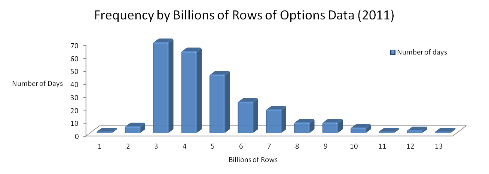

White paper
{: #wp-brand}

# Multi-partitioned kdb+ databases: <br/>an equity options case study

by [James Hanna](#author)
{: .wp-author}


Kdb+ is well suited to managing massive datasets and offers an
unrivalled performance advantage when it comes to processing and
analyzing data. This is a case study highlighting some of the key
points we have found with regard to the storage and maintenance of
financial equity options data in kdb+. We also provide some examples
of possible ways to design and query these large databases
efficiently.


## Overview of the dataset

The equity-options data universe is one of the largest financial
datasets generated, and more often than not the most challenging
dataset for trading firms to manage and extract value from in a timely
manner. Hundreds of gigabytes of trade and quote records are published
daily from the equity options feeds, with recent daily row count
volumes for Q1 of 2012 having an average and maximum count close to 4
billion and 6 billion rows respectively. These numbers represent a
relief of sorts from the peaks of 2011 where we saw a maximum daily
row count of over 13 billion as highlighted in the chart below.



The dataset we use for our examples in this paper includes level 1
trade and quote data for financial options contracts, the associated
reference data and the corresponding equity level 1 trades and quotes
for the same time period. All data has been sourced from tickdata.com.

The sample dataset has a maximum of approximately 200 million rows for
a single date and includes data for 10 underlying securities. The full
universe that our clients load is typically much larger, covering
thousands of underlying securities. For some of these securities, for
example AAPL, the ratio of the number of option quotes to underlying
quotes can be in excess of 60:1 on some dates.

It is thus inevitable that when storing equity options data for a
large universe of underlying securities, the number of rows per
partition will regularly exceed 2 billion. When kdb+ 3.0 was released
in 2011 it removed the limit to the number of rows that can be stored
in a single partition. This gives us two
options for storing massive tables, either storing each day of data in
a single partition, or storing each day of data in multiple
partitions.

In this paper we cover the use of a multi partitioned database, as
whilst kdb+ 3.0 allows the very straight forward option of having a
single partition for each date, there are still potential advantages
to the approach of storing data across multiple partitions for a
single date.

Firstly, when saving data, multiple partitions can be written
concurrently, potentially reducing the time required to load data from
flat files or persist it from memory. Secondly, when running queries
against the database, data from multiple partitions can be read in
parallel using secondary threads. In the same way as queries on a database
with a single partition per date can read data for multiple days in
parallel, now data for the same date can be read in parallel. A third
advantage related to database maintenance is that since the size of
the individual column data files is reduced, the memory required to
apply a sort to the data on disk will be reduced.

Kdb+ provides a simple method to store the data in multiple partitions
for each date by using the `par.txt` file. When attempting to read data
from a database like this a large number of queries will behave
exactly as they would in a database with only one partition per date.
However there are some cases in which it’s necessary to rework things
a little, most notably in the case of as-of joins. This is covered
below.

## Options schema

Sorting and indexing the options data is straightforward. If we have
the data sorted by underlying security, option contract and finally
timestamp we can apply the partitioned attribute to both underlying
security and option contract, allowing us to filter quickly on either
column.

More interesting is the way in which we choose to store the underlying
security market data so that we can link it to the options data
efficiently. The simplest way of accomplishing this would be to store
the prevailing value of each underlying alongside the option trades
and quote data. These extra columns would either be provided in the
source data (as was the case in our sample dataset) or could be 
pre-calculated with an as-of join and then stored.

The advantage of this method is that we do not need to store any
additional underlying market data and there is no overhead when
performing lookups to find the prevailing underlying quote or last
trade for an option quote or trade. However there are two obvious
downsides to using this approach.

The first is that it does not offer any flexibility with regard to how
the market data for an underlying security maps to the corresponding
option data, e.g. if we wanted to do a window join to look at multiple
underlying quotes surrounding each option quote. The second is that a
significant amount of extra storage space will be required when the
data is de-normalized in this way compared to storing the underlying
market data in separate tables and doing joins on demand. Even with a
frugal schema for the underlying data, this might add 40-50 bytes of
storage for each record (depending on whether condition code and
exchange fields can be stored as single characters or symbols are
required for example). Given that there will be billions of option
quotes per day, this can add hundreds of gigabytes to the daily
storage requirements. It is worth noting that this may not be as large
a problem as it first appears given the possibilities for data
compression.

A second possibility is to store underlying market data as completely
separate tables and do any joins we require between the two datasets
on a purely ad-hoc basis. This option offers the lightest storage
requirements and also gives us full flexibility in how we do the
joins. It does, however, come with the cost of extra processing time
when searching for the underlying market data related to the option
data at query time. Examples of how this is done can be found in the
queries section below.

A third option, a combination of the first two, would be to save the
option and underlying data as separate tables, but to compute row
indices in the underlying market data tables and store them in the
option tables as link columns. This requires less space (a single
integer column per link to each underlying table) than storing full
underlying trade/quote information along with each option table row,
avoids having to find the correct underlying trade/quote at query time
and also gives flexibility by having all the underlying data available
for ad-hoc joins.

Using the third option requires us to ensure that the underlying and
option data for the same securities always reside in the same
partition. We can achieve this as part of the load process outlined
below.


## Loading and saving data

Here we assume some familiarity with loading large data files by
splitting the file and loading in chunks using `.Q.fs` and `.Q.fsn`. 


### Striping data over multiple partitions per date

Firstly we demonstrate how to save a chunk of loaded and parsed data
into a database with multiple partitions per date. In our case we will
split the data alphabetically by underlying symbol into groups as
follows: ABC, DEF, GHI, JKL, MNO, PQR, STU and VWXYZ

We should have a `par.txt` file containing paths to directories for each
of these symbol groups. The contents of our `par.txt` file are thus as
follows:

```txt
/data/0
/data/1
/data/2
/data/3
/data/4
/data/5
/data/6
/data/7
```

Before demonstrating how we can stripe the data over these
directories, it is worth noting that if future data volumes increase
and we wish to partition the data into a greater number of stripes, we
can do this by adding new directories to `par.txt` without the need to
go back and repartition old data. We would only need to create empty
tables for each existing date for each partitioned table in our db.

With regard to saving a chunk of data, there are many ways to do this
but we provide an example below where we read in a list of available
partitions and create some helper functions to allow us to easily
partition and save the data. In the code below the directory is
assumed to be a global variable (`DIR`) giving the path to our `par.txt`
file in q format (symbol with a leading colon).

```q
// A dictionary mapping alphabetical group to the directory
// in the database we wish to save to
dirs:`ABC`DEF`GHI`JKL`MNO`PQR`STU`VWXYZ!hsym each`$read0 ` sv DIR,`par.txt

// A function which will return a list of partitions
// to which each of a list of symbols should be saved.
getpart:.Q.fu {[symlist]
  key[dirs]0 3 6 9 12 15 18 21 bin .Q.A?first each string symlist,()}

saveonepart:{[dt;tablename;data;part2save]
  (` sv dirs[part2save],(`$string dt),tablename,`)set 
  .Q.en[DIR]
  delete part from select from data where part=part2save}
```

We could use the following snippet to save some quote data stored in a
variable `CHUNK` inside a function called by `.Q.fs` or `.Q.fsn`. `DATE` is
assumed to be a global variable here representing the date for which
we are loading data. It is elementary to modify this to include the
possibility of data for more than one date in a particular file load.
This is excluded here for the sake of simplicity.

```q
{
…
CHUNK:update part:getpart underlyingSym from CHUNK;
saveonepart[DATE;`QUOTE;CHUNK]each distinct exec part from CHUNK;
…
}
```

By implementing the previously-defined `getpart` function to generate
the partition to save down to based on either the `underlyingSym` column
for options data or the `sym` column for underlying market data, we can
be sure that related options and underlying data will be stored in the
same partitions.

Once the data has been loaded and saved we will often need to apply an
attribute to one or more of the columns of the data. This is a fairly
easy step as we just need to apply the attribute to a table spread
over multiple directories instead of one. In our example of option
quotes we would like to apply the _partitioned_ attribute (`` `p#``) to
both the `sym` and `underlyingSym` columns. We can do this as follows:

```q
// function applies p# attribute to sym and underlyingSym columns
// of the quote table for the specified date and directory
addphashes:{[dt;dir]
  {[dt;dir;f]@[` sv dir,(`$string dt),`QUOTE;f;`p#]}[dt;dir]
  each `sym`underlyingSym} 
```

This may be called after loading all the data in our script:

```q
addphashes[DATE]each value dirs;
```


### Adding links to market data

If we wish to store links to the underlying data within the option
data, a sensible time to generate and store these links would be just
after we have loaded, sorted and added attributes to the data. We can
do this as part of a loader script with the following code. Here we
just create one link stored in the `QUOTE` table to the corresponding
quote in the `EQUOTE` (underlying quote) table:

```q
dirs: `$read0 ` sv DIR,`par.txt 
addlinks:{[dt;dir]
  dir:` sv dir,`$string dt;
  // compute links as an as-of join. 
  inds:select ind: x from
  aj[`sym`timestamp;
    select sym:underlyingSym,timestamp from dir`QUOTE; 
    select sym,timestamp,i from dir`EQUOTE];
  // save the links
  (` sv dir,`QUOTE`underlying)set `EQUOTE!exec ind from inds;
  // update the metadata of the QUOTE table
  u set distinct get[u:` sv dir,`QUOTE`.d],`underlying}
```

Again we should use this for each partition for the date we have just loaded.

```q
addlinks[DATE]each value dirs;
```


## Example queries

In all of the examples below variables in caps are used instead of
specific values.

### Raw options quote data retrieval with underlying quote

In the simplest case where we have the prevailing underlying quote
stored alongside the option quote as columns `lastbidPrice` and
`lastaskPrice` our query is:

```q
select sym, timestamp, bidPrice, askPrice, lastBidPrice, lastAskPrice from QUOTE
  where date=DATE, sym=SYM, time within (STARTTIME;ENDTIME)
```

For the dataset where we have links to the prevailing underlying quote
stored we can use:

```q
select sym, timestamp, bidPrice, askPrice, underlying.bid, underlying.ask from QUOTE 
  where date=DATE, sym=SYM, time within (STARTTIME;ENDTIME)
```

In the case where we have the options data and underlying data stored
in separate tables, we could usually use an as-of join. However, since
our database has multiple partitions per date, specifying the right-most
argument of the as-of join in the usual way does not behave in the
same manner as in the case of databases with a single partition per
date. For example, if we look at a standard query to get the
prevailing quote as of each trade we encounter some problems.

```q
aj[`sym`time;
  select price from TRADE where date=SOMEDATE, sym in SYMLIST; 
  select sym, time, bid, ask from quote where date=SOMEDATE]
```

In the case of a database with a single partition per date, this as-of
join does not read the entire sym, time, bid and ask columns into
memory before performing the lookup, rather it searches for the
correct rows from a memory map of the quote table. In a database with
multiple partitions per date, the following part of the previous query
proves problematic:

```q
select sym, time, bid, ask from EQUOTE where date=SOMEDATE
```

This now causes all of the data to be mapped and read into memory so
that the as-of join can be performed. Not only is this undesirable due
to the extra I/O required but because multiple memory-mapped
partitions are being collapsed into one in memory table, it also has
the detrimental side effect of removing the partitioned attribute
normally found on the `sym` column since rows with the same symbol could
occur in multiple partitions. This is not something that should
actually occur in this database but since it is possible, kdb+ will
defensively remove the partitioned attribute. In addition, because
part of the reason we chose a database with multiple partitions for
each date was to ensure no single partition was bigger than 2 billion
rows, we may even hit a limit error when trying to do as-of joins
against large tables. (This could only occur when using a version of
kdb+ older than 3.0).

The result of the above is that not only would a join take longer
because more data is being read from the disk but also the join itself
will be performed much more slowly. A particular technique to work
around this would be to create our own function which will perform
joins against each memory-mapped partition for a certain date without
reading the full table into memory, then aggregate the results from
each partition.

In the function below the parameters are specified as follows:

parameter | denotes
----------|----------------------------------
c         | A list of column names upon which to perform the as-of join, just as we would have with a regular `aj`
t1        | The first table, just as in the case of a regular `aj`
t2        | The second table name, a symbol giving the name of a partitioned table. (To do an as-of join on a non-partitioned table, use a regular `aj`.)
t2d       | The date upon which to do the join. (Do one date at a time if there are multiple dates.)
t2c       | A list of column expressions for the selection from the partitioned table, e.g. ``(`Ticker;`Timestamp;`Trade;`TradeSize;(log;`TradeSize))`` – usually some subset of the column names in the table
t2cn      | A list of column aliases in the partitioned table e.g. `` `Ticker`Timestamp`price`size`lnprice``

```q
ajparted:{[c;t1;t2n;t2d;t2c;t2cn] 
  if[not all c in t2cn;'`missingcols];
  / we want just one row per row in the input, so put a row id as a key
  / and just fill values in the input table with
  / rows that are found for the second table
  / build table a table with the right schema to start 
  t1:`rid xkey update rid:`s#i from 
    aj[c;t1;?[t2n;enlist(<;`date;first date);0b;t2cn!t2c]];
  / do aj's on each partition of the second table with the first table,
  / only return rows that we have values for,
  / then upsert these to the keyed t1 
  delete rid from 0!t1,/
    {[c;t1;t2n;t2d;t2c;t2cn;x] 
      inds@:vinds:where not null inds:
        (c#M:?[(` sv`$string x,t2d)t2n;();0b;t2cn!t2c])bin (c#value t1); 
      1!(0!t1)[vinds],'M inds}[c;t1;t2n;t2d;t2c;t2cn]
  peach distinct .Q.pd}
```

Returning to our original example query of getting the prevailing
underlying quote information for a particular set of option quotes, we
can use the following call to the `ajparted` function:

```q
t1: select sym,timestamp,bidPrice,askPrice from QUOTE 
  where date=SOMEDATE,sym in SYMLIST,timestamp within (STARTTIME:ENDTIME)

ajparted[`underlyingSym`timestamp;t1;`EQUOTE;SOMEDATE;
  `sym`timestamp`bid`ask;`underlyingSym`timestamp`bid`ask]
```


## Snapshot of option chain

This is an example where we have an underlying symbol and want to get
a snapshot of the quotes available for all options at a given time.

Firstly, we will need to query the security master table (called `mas`
in our case) for all option data available on the given date for this
underlying and then find the last quote available for each option at,
or prior to, the given time.

The available option contracts may be queried from a security master
table, `mas`, using the following:

```q
optsyms:select sym from mas 
  where date=OURDATE, underlyingSym=OURSYM
```

Now that we have all of the options contracts we require, the question
becomes how to query the `QUOTE` table to get the available quote for
each option at the given time. One way to do this would be to write a
query to extract the last quote prior to the time in question for each
option:

```q
select last bid, last ask by sym from QUOTE 
  where date=OURDATE, sym in optsyms, time<=OURTIME
```

However, this is another place where we would normally use an as-of
join since it allows us to efficiently search for the last record
prior to the time in question rather than scan through all of the
records for each symbol to see if the timestamp constraint is
fulfilled. We can use the same function from the previous example to
do an as-of join here. Firstly, we use the `cross` function to create a
table of symbol and time pairs in order to carry out the as-of join:

```q
rack:optsyms cross ([]timestamp:1#OURTIME)
```

Now we can use `ajparted` to find the correct rows from the `QUOTE`
table

```q
ajparted[`sym`timestamp;rack;`QUOTE;OURDATE;
  `sym`timestamp`bid`ask;`sym`timestamp`bid`ask]
```

In the previous example we were able to avoid an ad-hoc as-of join
provided we had underlying data (or pre-calculated links to it) stored
alongside the options quote data. In this case however, we will need
to use an as-of join regardless of how the data is stored.


## Building a minutely time series of at-the-money option contracts

In our final example, we demonstrate the creation of a minutely time
series based on the idea of a generic option contract. In this case we
choose a condition specifying this contract as the next expiring call
contract nearest to at-the-money.

Initially, we create a time series of minutely bars for the underlying
symbol so we can determine which actual option contract we should use
at each point. Given we are working with relatively low-volume trade
data, we do this with a regular grouping and aggregation query. Note
that we could also use `ajparted` with a rack of symbol and time pairs
as in the above example.

```q
bars:select last price by time.minute from ETRADE 
  where date=ourdate, sym=OURSYM
```

We now need to find the particular contracts that are available on our
chosen date and the one that is closest to at-the-money at each point
in our series.

We can wrap up the logic for choosing a contract into a function with
parameters for date, underlying security, contract type (call or put)
and price:

```q
closest2atm:{[d;s;t;p]
/ A list of all the nearest expiring contracts on this date
cands:`strike xasc select sym,strike from mas
  where date=d, underlyingSym=s, typ=t, expir=(min;expir)fby underlyingSym;
  / A list of all strike prices with midpoints between,
  / we can then use bin to find the contract with a strike price to our prices 
  searchlist:1_raze{avg[x,y],x}':[cands`strike];
  inds:searchlist bin p;
  / Any odd indices in inds mean price is closer to strike above
  / add one to these and divide everything by 2 to give the indices into cands
  inds[where 1=inds mod 2]+:1;
  inds:inds div 2;
  / return the list of at-the-money symbols 
  cands[`sym]inds}

update sym:closest2atm[OURDATE;OURSYM;"C";price] from `bars
```

Finally we query the closing bid and ask for each of these bars:

```q
ajparted[
  `sym`timestamp;
  select sym, minute, timestamp:`timespan$minute, price from bars;
  `QUOTE; OURDATE;
  `sym`timestamp`bid`ask; `sym`timestamp`bid`ask]
```


## Compression

The use of compression for all or part of the dataset here is outside
the scope of this white paper, however, this is undoubtedly an
important feature to consider using for options data. 

:fontawesome-regular-hand-point-right: 
Knowledge Base: [File compression](../../kb/file-compression.md)


## Conclusion

Storing and querying options data can present challenges due to the
volume of data involved. While the introduction of kdb+ 3.0 lets
clients easily handle the ever-increasing data volumes by removing the
per-partition limit of 2 billion rows, there are still several
potential benefits to storing the tick data in multiple partitions per
date as outlined in _Overview of the dataset_. As we have seen however, in choosing this approach it
will be necessary to write some queries in a different way to achieve
the best performance.

Regardless of whether the data is stored in a single partition per
date or in a multi-partitioned manner, the choice of schema will still
impact the storage space required for the data and queries against the
database. Here we have presented several different schema choices and
examples of several simple queries implemented for each schema.

[:fontawesome-solid-print: PDF](/download/wp/multi-partitioned-dbs-a4.pdf)


## Author

James Hanna has helped design and develop kdb+ implementations and proof of concepts for more than 40 customers. Based in New York, James is a Technical Architect for Kx, a high-performance data-management, event-processing and trading platform.

