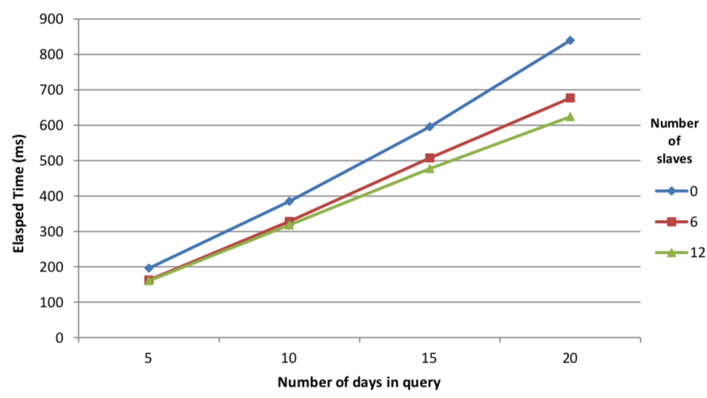
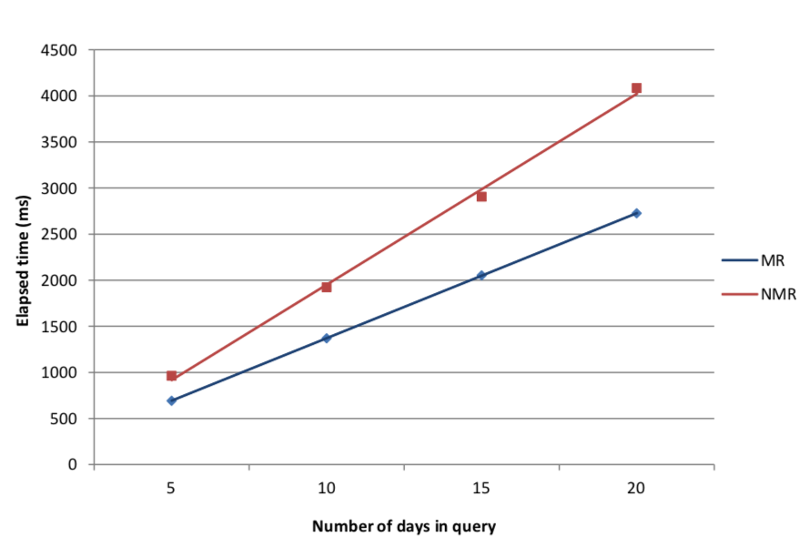
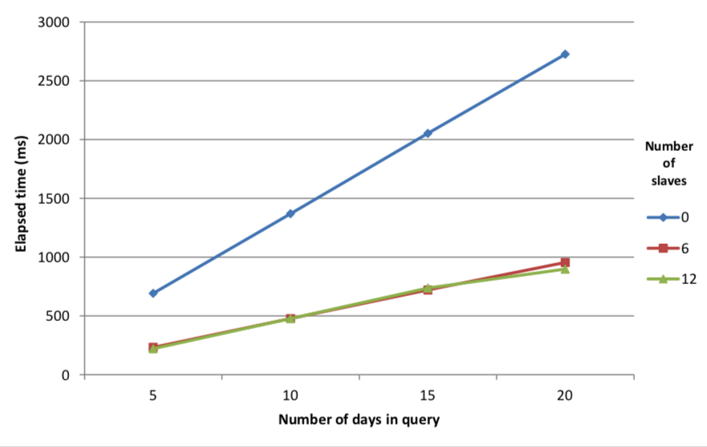

White paper
{: #wp-brand}

# Multi-threading in kdb+<br>Performance optimizations and use cases

by [Edward Cormack](#author)
{: .wp-author}


Parallel-processing techniques have become increasingly prevalent in mainstream computing as a result of developments in computer architecture. Multi-core processors are now widely used in all systems from mobile devices to high-performance servers.

With this comes the need to develop applications that can make full use of parallel architecture to realise performance gains. Parallel computing techniques typically involve dividing large tasks into several parts, which can be executed simultaneously, taking less time than it would take to run all the parts sequentially. This concurrent operation shares the load, using the full resources of the system to optimize performance.

This white paper intends to introduce the methods available for parallel processing in kdb+. We will demonstrate a number of cases where parallel techniques can be employed and discuss the potential performance enhancements.

In many cases, operations on large vector datasets, which are typical of those processed and analysed by kdb+, are easily parallelized. Where this is the case, complex operations on long lists can be broken up and executed on multiple threads.

We will also address use cases where parallel processing may not be appropriate in kdb+ and some of the important factors to consider in each case.

The OS disk cache is flushed when required using the `io.q` script, available from GitHub.

:fontawesome-brands-github:
[simongarland/io](https://github.com/simongarland/io/blob/master/io.q)

All tests performed using kdb+ version 3.1 (2013.06.25)


## Setting up kdb+ for parallel processing

Kdb+ starts in single-threaded mode by default. This ensures data consistency and that there are no race conditions, as all commands are executed in the order they are received. Multi-threading in kdb+ is achieved by spawning multiple secondary threads.

To perform parallel operations in kdb+, the process is started up using the [`–s n` command-line option](../../basics/cmdline.md#-s-secondary-processes). When called with a value of `n`>1, kdb+ will start `n` secondary threads. For optimal performance when using multi-threading, the number of secondary processes should be equal to or greater than the number of available cores. One should take into consideration the overall usage of the host when determining the number of secondary processes to allocate.

Parallel execution is explicitly invoked by using two built-in functions: [`peach`](../../ref/each/) and [`.Q.fc`](../../ref/dotq.md#qfc-parallel-on-cut). Parallel execution is also implicitly invoked in kdb+ when used as part of a multi-threaded HDB. This mode of operation will be reviewed in more detail below.


### Functions for parallel execution

`peach` is used in the same way as the [`each`](../../ref/each.md) keyword. It will execute the function over multiple secondary processes, passing the arguments and results between the secondary processes and the main thread using IPC serialization.

```q
q)f peach x // execute function f on x over secondary threads
```

Additionally, there is the parallel-on-cut function `.Q.fc`. This modifies an existing function such that a vector argument is distributed across multiple threads. The differences between `peach` and `.Q.fc` and the various use cases are covered in more detail below.

```q
q).Q.fc[f] z // cuts z into n parts and executes f in parallel
```

There are however, some limitations on what operations can be executed in parallel. In order to maintain thread safety, kdb+ uses thread-local storage. Global variables may be read directly from the main thread but each thread maintains its own copy of local variables and arguments.

To avoid concurrency issues, only the main thread may update global variables. Attempting to set or modify a global while in a secondary thread will result in a `noupdate` error. There are also restrictions on calling system commands while using `peach`.

```q
q){update ex:”N” from `trade where sym=x} peach `GOOG`AAPL`YHOO 
'noupdate
```


## Vector operations in parallel

In this section, we will look in more detail at the use of `peach` and `.Q.fc` for operations on vectors. We analyze the performance of a range of use cases using `\t` to time execution on a process with six secondary threads for both sequential and parallel operations.

Consider the lambda shown below. This will create a list of floats of the same length as the argument and raise it to a specific power, then return the sum of the result.

```q
// Run operation 6 times, for a 1-million item list on each iteration
q)\s
6
q)\t { sum (x?1.0) xexp 1.7 } each 6#1000000
802
q)\t { sum (x?1.0) xexp 1.7 } peach 6#1000000
136
```

The advantage of using `peach` in this case is clear. Distributing the operation over all six threads increases the speed by a factor of approximately 5.9.

Data and results are copied between secondary threads and the main thread using IPC serialization. As such, there is an associated overhead cost with transferring data, which should be taken into account. If we modify the existing function so that it returns the entire vector instead of the sum then we can see this effect.

```q
// Returning the full result is worse as the overhead is increased
q)\t { (x?1.0) xexp 1.7 } each 6#1000000
795
q)\t { (x?1.0) xexp 1.7 } peach 6#1000000
152
```

Now, the single-threaded operation is slightly faster than before as it does not need to compute the sum. The parallel operation must now return a 1-million item vector to the main thread, and it is slower as a result. The performance scaling is now reduced to 5.2.

The parallel overhead from copying data to secondary threads can be
estimated by using the [`-8!` operator](../../basics/internal.md#-8x-to-bytes) to serialize the argument and then de-serializing with the [`-9!` operator](../../basics/internal.md#-9x-from-bytes).

```q
q)\t:100 -9!-8!1000000?1.0
732
```

The operation must be computationally expensive enough to justify this messaging overhead. In the case of a very simple operation, using `peach` can be slower than just executing sequentially.

```q
// Peach takes longer when just doing a product
q)\t:1000 { x*1?10 } each 10?1.0
3
q)\t:1000 { x*1?10 } peach 10?1.0
18
// Increasing the complexity makes the overhead worthwhile
q)\t:100 {  sqrt (1000?x) xexp 1.7 } each 10?1.0
145
q)\t:100 {  sqrt (1000?x) xexp 1.7 } peach 10?1.0
33
```


### Vector operations and parallel cut

Just as when operating in single-threaded mode, operations on vectors are generally more efficient. Where appropriate, it is preferable to call a single function with one long vector argument than to call the function many times; i.e. iterating over a list of atomic arguments.

```q
// Single-threaded mode. Atomic vs. vector argument
q)a:1000000?1.0
// Taking the exponent of each value and sum the result
q)sum { x xexp 1.7 } each a
370110f
q)\t sum { x xexp 1.7 } each a
321
// Apply sum and exponent operations to the whole vector instead
q){ sum x xexp 1.7 } a
370110f
q)\t { sum x xexp 1.7 } a
132
```

To carry out vector operations in parallel we use `.Q.fc`, or parallel cut. As the name suggests, this will break a vector argument into `n` parts, and pass each part to a secondary thread for execution.

In the worst-case example below, `peach` is used over a long list of atomic values so that each value must be passed to the secondary thread and the value returned. This maximizes the data-transfer overhead. Using `.Q.fc` is much more efficient as the function is only executed six times – once on each thread.

```q
// Performance of peach is slower than single-thread each
q)\t { sum x xexp 1.7 } peach a
448
// Parallel speed-up is observed using .Q.fc
q)\t .Q.fc[{ sum x xexp 1.7 }] a
28
```


### Workload balancing

Another factor to take into consideration when using multi-threading is the distribution of work across the threads. This is particularly important when the process is handling a large number of tasks of uneven size.

The way in which kdb+ splits work between threads depends on which mode of parallel execution is used. Both parallel functions use pre-assignment, but with slightly different behavior. When using `peach` over two secondary processes the first secondary thread will get arguments 0, 2, 4… and the second secondary thread gets arguments at position 1, 3, 5… etc.

This allocation can be shown in q using the number of secondary processes and the modulus function `mod`.

```q
// 6 input arguments over 2 cores
q)(til 6) mod 2 
0 1 0 1 0 1
// 14 input arguments over 6 cores
q)(til 14) mod 6 
0 1 2 3 4 5 0 1 2 3 4 5 0 1
```

As discussed earlier, `.Q.fc` distributes work by cutting the vector argument into `n` slices. Each thread will then execute one slice of the original list.

To demonstrate the effect of uneven distribution we define a function `f` with an execution time proportional to the input argument.

```q
q)f: { x:7000*x;sum sqrt (x?1.0) xexp 1.7;};
q)\t f[100]
102
q)\t f[1000]
1053
```

A kdb+ process is now started up with two secondary processes; this makes it clearer to follow the operation. The test function is executed over a list of varying input arguments. We demonstrate with the examples below that the ordering of the large and small arguments can have a significant effect on performance.

```q
// Single threaded
q)\t f each 10 10 10 10 1000 1000 1000 1000
4162
// Single threaded unbalanced
q)\t f each 10 1000 10 1000 10 1000 10 1000
4163
// Multi threaded unbalanced
q)\t f peach 10 1000 10 1000 10 1000 10 1000
4131
// Multi threaded balanced
q)\t f peach 10 10 10 10 1000 1000 1000 1000
2090
```

Executing in single-threaded mode, we find the total time is similar to the sum of the arguments, as we would expect. In the second case however, there is little to no improvement from using `peach`. This is because the fast and slow jobs alternate in the input list, which means all the slow tasks are assigned to a single thread. The main process must wait for the second thread to execute all four slow jobs even though the first thread is finished. The final case is a balanced distribution, with fast and slow jobs assigned evenly to each thread. Now we see a parallel speed-up factor of approximately 2 as expected.

For `.Q.fc`, the situation is reversed. This function splits a vector argument evenly along its length and assigns one slice to each secondary thread. Alternating values in the list will result in balanced threads but contiguous blocks of large or small values will not.

```q
// Unbalanced – first 4 fast arguments sent to first thread
q)\t .Q.fc[{f each x}] 10 10 10 10 1000 1000 1000 1000 4134
// Balanced distribution
q)\t .Q.fc[{f each x}] 10 1000 10 1000 10 1000 10 1000
2112
```

This pre-assignment can be overridden by passing a nested list to `peach`. If you wanted to send specific arguments to each thread, then these can be positioned in the input with the index of the top-level list corresponding to the thread number.

For example, the following input will execute values 0, 1, 4 from `x` on the first thread and 2, 3, 5 on the second.

```q
q)x
10 10 1000 1000 10 1000
q)\t f peach x[0 1 4], x[2 3 5]
2075
```


## Query optimizations using multi-threading

The partitioned database structure in kdb+ is well suited to parallel processing. In a standard date-partitioned DB, the data is arranged such that all data for a given day resides in a specific directory under the root. The advantage of this is that the kdb+ process is only required to read data from the partitions specified in the date constraint.

This ability to access sections of the database independently can be extended using secondary processes, with each secondary thread being assigned a date from the Where clause to process. Considering the following query.

```q
q) { select from trade where date = x } peach d
```

We can see how `peach` will assign each date in the list `d` to a secondary thread for processing. In practice, kdb+ handles multi-threaded HDB queries under the covers without the need for any additional functions. It will automatically distribute work across secondary processes and aggregate the results back to the main thread.

This section discusses various applications for the multi-threaded HDB and what performance improvements can be achieved.


### Overview of test data

The test database is a standard TAQ schema containing simulated data for the S&P 500 components for one month, partitioned by date. There are approximately 20,000 quotes per tick symbol per day.

The data is sorted by symbol and time. The parted attribute is applied on sym.

```q
q)meta quote 
c    | t f a 
-----| ----- 
date | d
sym  | s   p 
time | t
bid  | e
ask  | e 
bsize| j 
asize| j
ex   | c
q)meta trade 
c    | t f a 
-----| ----- 
date | d
sym  | s   p 
time | t 
price| e 
size | j
ex   | c
```

The use of attributes to optimize datasets has been reviewed in another white paper, [Columnar database and query optimization](../columnar-database/index.md).

In each of the test cases outlined in this section, the kdb+ session is restarted between each test and the disk cache flushed using `io.q`.


### Performance effects of standard queries with secondary processes

If we consider a normal select from the quote table, for a range of
symbols:

```q
q)select from quote where date in d, sym in `GOOG`AAPL`YHOO`AMZN`EBAY
```

This query will return approximately 100,000 rows per day. The query is executed for an increasing number of days, and the performance measured. The test is then repeated on a process using additional secondary threads for comparison. The results are shown in Table 1 below.


days in query | 0 secondary processes | 6 secondary processes | 12 secondary processes
:------------:|---------:|---------:|---------:
5             | 195.8    | 162.5    | 160.5
10            | 384.6    | 328.0    | 317.9 
15            | 595.6    | 507.5    | 477.3
20            | 839.8    | 677.0    | 624.1

<small>Table 1: Execution time (ms) of normal select_</small>

  
<small>_Figure 1: Effect of number of secondary threads on query time_</small>

The results in Figure 1 show a gradual increase in performance as we add  secondary threads. The relation between execution time and query time remains roughly linear; however the factor by which it increases is reduced.


### Map-reduce with multi-threading

One area in which there are significant advantages to using parallel operation is when we are performing aggregations over a partitioned HDB. For most common aggregation operations, kdb+ has a built in map-reduce feature.

For example, if we wanted to calculate an average value over multiple days we can calculate the sum and count for each partition. We then take the total sum over the total row count to reduce to a final value. This saves the overhead of loading the data from all partitions into memory to perform the calculation.

Map-reduce can be used for the following operations: `avg`, `cor`, `count`,
`cov`, `dev`, `first`, `last`, `max`, `min`, `prd`, `sum`, `var`, `wavg`, and `wsum`. If kdb+ detects that a compatible operation is being used in the query then it will map the query over the partitions.

The advantage of map-reduce can be seen by comparing the following queries which calculate a VWAP over multiple days.

```q
// Standard query form using map-reduce
q)t1:select vwap: size wavg price by sym from trade where date in 5#date
// Non map-reduced form of the same query
q)t2:select vwap:(sum size*price)%sum size by sym from select sym,size,price from trade where date in 5#date
// Both queries return the same result
q)t1 ~ t2 1b
```

The second query is written such that it will delay the aggregation step until after data has been loaded from all partitions. This will not be optimized by map-reduce.

days in query | map-reduce | non map-reduce
:------------:|-----------:|--------------:
5             |  692.4     | 963.4
10            | 1370.2     | 1923.8
15            | 2053.0     | 2906.6
20            | 2726.6     | 4085.6

<small>_Table 2: Comparison of execution time (ms) using map-reduce for aggregations_</small>

  
<small>_Figure 2: Performance increases from using map-reduce_</small>

It can be seen in Figure 2 that there is a significant slowdown when not using map-reduce operations. The execution time increases more rapidly with query size than the map-reduced version.

The multi-day VWAP query above is now repeated using secondary processes. In this case, kdb+ will distribute the map calculations to its secondary processes. Again, this functionality is automatic and requires no specific functions to be called.

days in query | 0 secondary processes  | 6 secondary processes | 12 secondary processes
:------------:|----------:|---------:|---------:
5             |  692.4    | 233.6    | 221.2
10            | 1370.2    | 477.6    | 477.8
15            | 2053.0    | 720.8    | 737.6
20            | 2726.6    | 954.6    | 898.2

<small>_Table 3: Map-reduce performance using secondary processes_</small>

  
<small>_Figure 3: Execution time of multi-threaded map-reduce queries with date range_</small>

Figure 3 shows that there is a significant increase in the performance of the map-reduce query when used in multi-threaded mode. This is in line with our expectations, as the calculations can be spread across secondary processes and executed in parallel.

It is notable that there is little increase in performance from using 12 secondary processes instead of 6. A slight increase can be observed for the maximum number of dates in this sample database, although we can extrapolate that a greater number of secondary processes will perform better as the size of the query increases. The likely explanation for this behavior is I/O saturation. Increasing the number of secondary processes available for calculation does not improve performance significantly as reading the data from disk becomes the limiting factor. Adding additional secondary processes will only increase the number of processes attempting to read from the disk simultaneously.

!!! tip "Your mileage will vary"

    This result is illustrative only. The actual usage of parallel queries will depend on the specific system set-up of each user. Thorough testing across a range of database parameters is recommended before implementing any parallel query arrangement.


### Parallel access and segmentation

Kdb+ supports parallel I/O to address the disk-contention issue outlined earlier. This requires a specific hardware arrangement, usually direct-attached storage, with multiple disks residing on separate I/O channels.

To allow simultaneous access across partitions, the database structure is modified to use segments. Segmentation adds an additional layer above the partitioned structure. A simple example of this structure would be to split a date-partitioned database across two disks, by saving alternating days on each segment.

When using a segmented database for parallel queries, it is recommended to have at least one secondary thread per disk array. This will allow maximum access for date-range queries. In the case of computationally expensive queries, e.g. calculating VWAP, then two threads can be assigned per core. In this case, one thread is performing the calculations while another is loading the data.

A fully multi-threaded segmented database requires a custom hardware set up and is generally tailored to the needs of a specific system. As such, benchmarking the performance of this sort of database is beyond the scope of this paper.


## File operations
   

### DB maintenance

Adding or modifying a column to a partitioned database can be slow when carried out on large tables. This operation can be improved using `peach`. A shorter execution time for these maintenance operations can help reduce the duration required to make changes to production systems.

In the example below, we have added a column to the quote table on the test database. This is done using the functions in the `dbmaint.q` script.

:fontawesome-brands-github:
[KxSystems/kdb/utils/dbmaint.md](https://github.com/KxSystems/kdb/blob/master/utils/dbmaint.md)

```q
q)\t addcol[hsym `$"/tmp/db"; `quote; `newcol; 0N] 
2013.05.26 14:26:12 adding column newcol (type -7) to `:/tmp/db/2013.07.01/quote ...
4388
q)deletecol[hsym `$"/tmp/db"; `quote; `newcol] 
2013.05.26 14:26:33 deleting column newcol from `:/tmp/db/2013.07.01/quote ...
```

The standard `addcol` operation takes just over 4 seconds to run across one month of test data. The new column is then removed, and then test repeated using a modified version, which updates all partitions in parallel: `p_addcol`.

```q
// Define p_addcol using peach
p_addcol: {[dbdir;table;colname;defaultvalue]
    if[not validcolname colname;'(`)sv colname,`invalid.colname]; 
    add1col[;colname;enum[dbdir;defaultvalue]] peach allpaths[dbdir;table];}
```
```q
q)\s
6
q)\t p_addcol[hsym `$"/tmp/db"; `quote; `newcol; 0N] 
2013.05.26 14:27:26 adding column newcol (type -7) to `:/tmp/db/2013.07.06/quote ...
1743
```

The disk-maintenance operation is now measured to take less than half the time when executing in parallel.


### Writing flat files

Reading and writing data from disk, particularly in comma- or tab-delimited format, can be a time-consuming operation. We can use secondary processes to speed up this process, particularly when we need to write multiple files from one process.

For example, we may wish to save the result of a kdb+ query which spans several days in CSV format, creating a separate file for each date. Alternatively, there may be a number of flat files which we want to load into a kdb+ session.

The example below uses an extract from the `trade` table on the test database. The table is cut into five slices and each slice is saved to disk with a separate filename.

```q
q)\s
6
q)td: select from trade where date=2013.05.01, sym in 5?sym
q)count td
49815
q)tds: (floor (count td)%5) cut td
q)\t {(hsym `$"/tmp/testfile",string 1+x) 0: csv 0: tds[x]} each til 5 
75
q)\t {(hsym `$"/tmp/testfile",string 1+x) 0: csv 0: tds[x]} peach til 5 
29

q)count each tds
9963 9963 9963 9963 9963
q)system "ls /tmp | grep test*"
"testfile1"
"testfile2"
"testfile3"
"testfile4"
"testfile5"
```

The second query, using `peach`, is measured to take less than half the time to execute. The reverse operation is then demonstrated, reading all of the files back into the kdb+ session.

```q
q)read0 `$"/tmp/testfile1" 
"date,sym,time,price,size,ex" 
"2013-07-01,GOOG,09:30:00.069,1.657921,2,A"
"2013-07-01,EBAY,09:30:00.232,1.463019,3,A" 
"2013-07-01,AAPL,09:30:00.266,0.569119,3,N" 
"2013-07-01,EBAY,09:30:00.333,1.681702,2,N" 
...
```
```q
q)f:{flip(cols trade)!1_/:("DSTFIC";csv) 0: (hsym`$"/tmp/testfile",string 1+x)}
q)\t raze f each til 5
50
q)\t raze f peach til 5
17
q)td: raze f peach til 5
q)count td
49815
q)meta td
c    | t f a 
-----| ----- 
date | d
sym  | s 
time | t 
price| f 
size | i
ex   | c
```

Again, the parallel operation is more than twice as fast at reading the data. Combining all the results together we get the same schema and row count as the original data.


## Conclusion

This paper has summarized a range of applications for multi-threading in kdb+. These included optimization of queries, parallel execution of algorithms, vector operations and file operations. The mechanism behind secondary threads has been introduced and the relevant functions explained.

For each of these cases, the potential improvements have been measured and any limitations or potential problems identified. While there is a lot to be gained from using parallel operation appropriately, it is far from a catch-all solution to performance problems. Prior to attempting parallelization, operations should be fully vectorized to ensure maximum benefit.

Used incorrectly, parallel processing can be less efficient than the equivalent single-threaded operation due to the overheads of transferring data between threads or unbalanced workloads. Also, some operations are unsuitable for multi-threading, as they may require access to global variables.

The use of multi-threading in kdb+ should therefore be treated on a case-by-case basis. It is a feature which should often be considered by developers, but performance testing is recommended before implementation.

System-management solutions are available to assist with administering multi-process environments, like [Kx Control](../../devtools.md#kx-control) which provides a range of tools for visualizing process workflow, task scheduling and system-resource monitoring. These features are especially helpful at managing primary/replica configurations, where client queries or the loading of data is divided between processes in order to increase throughput.

All tests performed using kdb+ version 3.1 (2013.06.25)

[:fontawesome-solid-print: PDF](/download/wp/multi_threading_in_kdb_performance_optimisations_and_use_cases.pdf)


## Author

**Edward Cormack** is a financial engineer who has worked on developing financial data solutions for a range of clients. Edward is currently based at a top-tier investment bank in London, developing a kdb+ platform for global equity risk.

