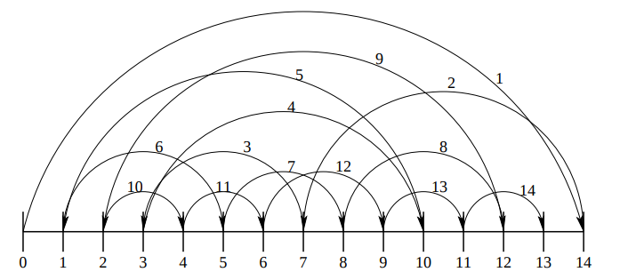
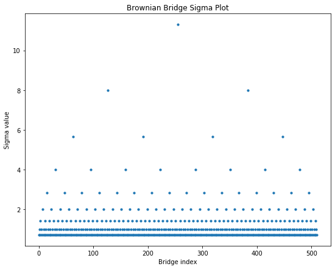
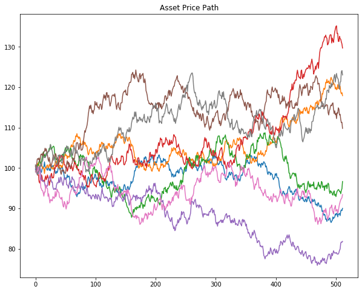

White paper
{: #wp-brand}

# Comparing option pricing methods in q

by [Deanna Morgan](#author)
{: .wp-author}


In this paper, we compare the use of both Monte Carlo (MC) and Quasi-Monte Carlo (QMC) methods in the process of pricing European and Asian options. In doing so, we consider the use of two discretization schemes - standard discretization and Brownian-bridge construction. Results produced by the different methods are compared with the deterministic Black-Scholes price for each option type, using Global Sensitivity Analysis (SA). Note that the methods demonstrated below follow the work presented by [S. Kucherenko et al. 2007](http://www.broda.co.uk/gsa/wilmott_GSA_SK.pdf "Wilmott").

:fontawesome-regular-hand-point-right:
S. Kucherenko et al. 2007, [“The Importance of Being Global – Application of Global Sensitivity Analysis in Monte Carlo Option Pricing”](http://www.broda.co.uk/gsa/wilmott_GSA_SK.pdf "Wilmott"), _Wilmott_, pp. 82–91


## Black-Scholes

The most common model used to calculate the price of options is Black-Scholes, where the formula for each market is derived from the [Black-Scholes equation](https://en.wikipedia.org/wiki/Black%E2%80%93Scholes_equation "Wikipedia"). In this paper, we look specifically at the Black-Scholes models for European and Asian call options. The standard Black-Scholes model for European options assumes a payoff based on the underlying price at exercise. The [modified model for Asian options](https://en.wikipedia.org/wiki/Asian_option#European_Asian_call_and_put_options_with_geometric_averaging "Wikipedia") assumes a payoff based on the average underlying price over a predefined time period. In each case, the Black-Scholes model produces a closed-form solution with a deterministic result.

For European call options, the price of the corresponding option at time $t$, $P(S_{t},t)$, is given by:

$$\begin{eqnarray}
d_{1} = \frac{1}{\sigma\sqrt{T-t}}\Big[ln\Big(\frac{S_{t}}{K}\Big)+\Big((r-q)+\frac{\sigma^{2}}{2}\Big)(T-t)\Big]
\end{eqnarray}$$

$$\begin{eqnarray}
d_{2} = d_{1}-\sigma\sqrt{T-t}
\end{eqnarray}$$

$$\begin{eqnarray}
P(S_{t},t) = S_{t}e^{-q(T-t)}N(d_{1})-Ke^{-r(T-t)}N(d_{2})
\end{eqnarray}$$

Where $T$ is the expiry, $S_{t}$ is the price of the underlying asset at time $t$, $K$ is the strike price of the option, $\sigma$ is the volatility and $r$ is the interest rate. Note that the price is discounted by the dividends, $q$, throughout.

:fontawesome-brands-wikipedia-w:
[Black-Scholes model](https://en.wikipedia.org/wiki/Black%E2%80%93Scholes_model "Wikipedia")

For Asian call options, we implement the same formula, using an adjusted $S_{t}$, $\sigma^{2}$ and drift rate, $\mu$:

$$\begin{eqnarray}
\mu_{adj} = \frac{1}{2}\Big(r-\frac{\sigma}{2}\Big)\Big(1+\frac{1}{n}\Big)
\end{eqnarray}$$

$$\begin{eqnarray}
\sigma^{2}_{adj} = \frac{\sigma^2}{3}\Big(1+\frac{1}{n}\Big)\Big(1+\frac{1}{2n}\Big)
\end{eqnarray}$$

$$\begin{eqnarray}
{S_{t}}_{adj} = S_{t}e^{\frac{1}{2}\sigma^{2}_{adj}(T-t)+\mu_{adj}-r}
\end{eqnarray}$$

Where $n$ is the number of timesteps.


## Monte Carlo and Quasi-Monte Carlo simulations

Within the financial industry, there is a need to price complex financial instruments. Despite this need, there are a lack of analytical solutions to do so. [MC methods are used with the financial industry](https://en.wikipedia.org/wiki/Monte_Carlo_methods_in_finance "Wikipedia") to mimic the uncertainty associated with the underlying price of an instrument and to subsequently generate a value based on the possible underlying input values. One example of where MC is used in finance, is in evaluating an option on an equity. For each underlying asset, an MC simulation is used to create thousands of random price paths, with an associated payoff. The option price for each path is calculated by taking the average over the future payoffs and discounting them to the present.

These models are based on pseudo-random numbers which, despite being commonly used, exhibit very slow convergence, with a rate of $O(1/\sqrt{N})$ where $N$ is the number of sampled points. To improve upon these models, QMC methods have been developed which use low-discrepancy sequences (LDS) to produce a rate of convergence ~ $O(1/N)$. LDS are deterministic uniformly distributed sequences which are specifically designed to place sample points as uniformly as possible. Practical studies have shown that the most effective QMC method for applicaton in financial engineering is based on Sobol' LDS.

:fontawesome-regular-hand-point-right:
S. Kucherenko et al. 2001, [“Construction and Comparison of High-Dimensional Sobol’ Generators”](http://www.broda.co.uk/doc/HD_SobolGenerator.pdf), _Wilmott_, Nov, pp. 64-79<br>
[broda.co.uk](http://www.broda.co.uk)<br>
P. Jäckel 2001, _Monte Carlo Methods In Finance_, pp. 122.<br>
P. Glasserman 2003, _Monte Carlo Methods in Financial Engineering_, Springer.


## Wiener path

The starting point for asset price simulation is the construction of a Wiener path (or Brownian motion). Such paths are built from a set of independent Gaussian variates, using either standard discretization or Brownian-bridge construction.

In the standard approximation, the Wiener path is found by taking the cumulative sum of the Gaussian variates.

When constructing a Brownian bridge, the last step of the Wiener path is calculated first, followed by the mid-step, and then the space left between steps is bisected until all steps have been determined.

An example of building up a Brownian bridge is shown in the diagram below, where we have a total of 14 timesteps (from 1 to 14). Note that we also have an additional timestep `0`, which is assumed to have a value of 0.



<small>_The construction of a Brownian bridge over 14 steps. See Jäckel, 2001, op. cit._</small>

Both standard discretization and Brownian-bridge construction share the same variance and therefore the same resulting convergence when used with MC models. However, performance differs between the two when QMC methods are introduced, with faster convergence seen for Brownian-bridge construction.

In order to showcase how performant the QMC simulation is when paired with Brownian-bridge construction, we use Global SA as outlined in [S. Kucherenko et al. 2007](http://www.broda.co.uk/gsa/wilmott_GSA_SK.pdf "Wilmott"). This method allows us to estimate the contribution of individual input parameters in the final variance of the output over a number of experiments. In each experiment, we:

1. Randomly generate $n$ random numbers, either pseudo-random (MC) or [Sobol’ sequence (QMC)](http://www.broda.co.uk/doc/HD_SobolGenerator.pdf). (See also [broda.co.uk](https://www.broda.co.uk/))
2. Convert into a [normal distribution](https://en.wikipedia.org/wiki/Normal_distribution).
3. Convert into a Wiener-path random walk using standard discretization or Brownian-bridge construction.
4. Convert into an asset-price path based on parameters:

	* `s`: Asset price at $t=0$
	* `v`: Volatility
	* `r`: Interest rate
	* `q`: Dividends
	* `t`: Expiry

5. Convert into an option price based on the option type and strike price, `k`.

The prices produced are then averaged to find a final predicted price.

## Implementation

In the following sections, we compare the methods of option pricing mentioned above. The Black-Scholes price for each market is compared to an average price generated using the following combinations of simulation and discretization methods:

-   Pseudo-random number generation (MC) with standard discretization.
-   Sobol’ sequences (QMC) with standard discretization.
-   Sobol’ sequences (QMC) with Brownian-bridge construction.

The Black-Scholes function for each market produces a closed-form solution with a deterministic result, while the MC/QMC functions perform a number of random experiments and return an average price, based on the option type and the strike price.

Once both the Black-Scholes and MC/QMC prices have been calculated for each market, the root mean square error (RMSE) is calculated between the two. This is demonstrated in the final example below, where the process is repeated for an increasing number of paths, with resulting errors compared.

The technical dependencies required for the below work are as follows:

-   [Option Pricing kdb+/q library](https://github.com/kxcontrib/optionpricing) 
-   [embedPy](https://github.com/KxSystems/embedPy)
-   Sobol’ C++ library - `SobolSeq1024` function provided in the Option Pricing kdb+/q library with max dimension of 1024.
-   [matplotlib](https://matplotlib.org/)

!!! tip "Utility functions"

    For simplicity, utility functions are omitted from the code snippets below. These can be found within the Option Pricing library linked above.


### Load scripts

As mentioned previously, the implementations of option pricing methods outlined below are based on original C++ scripts used in [S. Kucherenko et al. 2007](http://www.broda.co.uk/gsa/wilmott_GSA_SK.pdf "Wilmott"). All code is contained within the option-pricing repository:

:fontawesome-brands-github:
[kxcontrib/optionpricing](https://github.com/kxcontrib/optionpricing)

Wrappers for the C++ pseudo-random and [Sobol’ sequence number generators](http://www.broda.co.uk/doc/HD_SobolGenerator.pdf) (see also [broda.co.uk](http://www.broda.co.uk/)) are contained within `rand.q`, along with the cumulative and inverse cumulative normal distribution functions in `norm.q`.

To run the below examples, q scripts are loaded including the C++ wrappers and graphics functions used throughout.

```q
\l code/q/rand.q
\l code/q/norm.q
\l notebooks/graphics/graphics.q
```

### Black-Scholes option pricing

The following functions provide q implementations of the Black-Scholes formula for each market, outlined above. They take in parameter dictionary `pd` as an argument, containing the parameters `s`, `v`, `r`, `q`, `k`, and `t` detailed in the previous section. Note that the Black-Scholes price of an Asian call option depends on the number of timesteps `n`, which must also be passed as an argument. 

```q
/ European
bsEuroCall:{[pd]
  / Calculate volatility*sqrt delta T coefficient
  coeff:(v:pd`v)*sqrt t:pd`t;
  / Calculate d1
  d1:(log[pd[`s]%pd`k]+t*(pd[`r]-pd`q)+.5*v*v)%coeff;
  / Calculate d2
  d2:d1-coeff;
  / Calculate the option price - P(S,t)
  (pd[`s]*exp[neg t*pd`q]*cnorm1 d1) -
    pd[`k]*exp[neg t*pd`r]*cnorm1 d2 }

/ Asian
bsAsiaCall:{[n;pd]
  / Calculate adjusted drift rate
  adjmu:.5*((r:pd`r)-.5*v2:v*v:pd`v)*n1:1+1.%n;
  / Calculate adjusted volatility squared
  adjv2:(v2%3)*n1*1+.5%n;
  / Calculate adjusted price
  adjS :pd[`s]*exp(t:pd`t)*(hv2:.5*adjv2)+adjmu-r;
  / Calculate d1
  d1:(log[adjS%k:pd`k]+t*(r-q:pd`q)+hv2)%rtv2:sqrt adjv2*t;
  / Calculate d2
  d2:d1-rtv2;
  / Calculate the option price - P(S,t)
  (adjS*exp[neg q*t]*cnorm1 d1)-k*exp[neg r*t]*cnorm1 d2 }
```

The outputs of these functions are demonstrated below for 512 timesteps.

```q
nsteps:512                           / number of timesteps
pd:`s`k`v`r`q`t!100 100 .2 .05 0 1   / parameter dictionary

/ Calculate BS price for European/Asian options
"European Black Scholes Price: ",string bseuro:bsEuroCall pd
"Asian Black Scholes Price:    ",string bsasia:bsAsiaCall[nsteps]pd
```
```txt
European Black Scholes Price: 10.45058
Asian Black Scholes Price:    5.556009
```


### Monte Carlo and Quasi-Monte Carlo option pricing

#### Generate random numbers

The first stage in predicting an option price is to generate a set of random numbers using either MC or QMC methods. In the example below we generate 512 pseudo-random and Sobol’ sequence numbers, with results plotted for comparison.

Random numbers are generated using the [Mersenne Twister](https://en.wikipedia.org/wiki/Mersenne_Twister "Wikipedia") number generator which has one parameter, the number of steps.

The Sobol’ sequence generator takes two arguments:

-   the index of the point (0 &lt; i &lt; 2<sup>31</sup> - 1)
-   the dimension of the Sobol’ sequence, i.e. the number of steps (0 &lt; d &lt; 1025).

```q
/ Function to generate n random numbers in d dimensions
rdmngen:{[n;d](d;n)#mtrand3 d*n}

/ Function to generate n sobol numbers in d dimensions
sobngen:{[n;d]flip sobolrand[d]each 1+til n}

/ Generate n random and sobol numbers in 2D
data:(rdmngen;sobngen).\:nsteps,2
subplot[data;("Random";"Sobol");2;2#`scatter]
```


It is clear that the pseudo-random numbers are not evenly distributed, with points clustering together in some sections, while leaving large portions of white space in others.

In contrast, the Sobol’ sequence plot exhibits a much more even distribution, with few points clumping together.


#### Convert to a Gaussian distribution

The generated sequences are converted from a uniform distribution to a Gaussian distribution. Following this conversion, around 68% of the values lie within one standard deviation, while two standard deviations account for around 95% and three account for 99.7%.

<br>
<small>_Gaussian distribution_</small>

In the example below we convert the uniform generated Sobol’ sequence to a Gaussian distribution, using the inverse cumulative normal function, `invcnorm`.

```q
/ Convert sobol sequence to normal distribution
zsob:invcnorm each sob:last data
subplot[(sob;zsob);("Sobol Uniform";"Sobol Gaussian");2;2#`scatter]
```


The differences between the Gaussian distributions produced for random and Sobol’ sequences are best demonstrated for a small number of timesteps, e.g. 64. Below we plot the 1-D Gaussian distributions for both random and Sobol’ number generation across 64 timesteps.

```q
/ Returns 1D Gaussian distribution to plot
gausscnv:{[g;n;d]first invcnorm each$[g~`rdm;rdmngen;sobngen][n;d] }

/ Calculates Gaussian variates for 64 steps, in 2 dimensions
dist:gausscnv[;64;2]each`rdm`sob
subplot[dist;("Random";"Sobol");2;2#`hist]
```


[As expected](http://www.broda.co.uk/doc/SobolSeq_report.pdf), the Sobol’ sequence exhibits a Gaussian curve with much better statistical properties than the random-number sequence.


#### Convert into a Wiener-path random walk

The q code to build both a Brownian-bridge and Wiener-path random walk is shown below.

Brownian bridge:

```q
/* n  = number of timesteps
/* dt = length of timesteps
bbridge:{[n;dt]
  / create initial brownian bridge with indices for all timesteps
  bb:first flip(n-1).[util.initbb n]\(`bidx`ridx`lidx!3#n-1;((n-1)#0b),1b);
  / calculate weights and sigma value for each point in the path
  bb:update lwt:bidx-lidx,rwt:ridx-bidx,sigma:ridx-lidx from bb;
  bb:update lwt%sigma,rwt%sigma,sigma:sqrt dt*lwt*rwt%sigma from bb;
  / create a projection for weiner path creation containing new bbridge
  util.buildpath .[bb;(0;`sigma);:;sqrt n*dt] }
```

Wiener path:

```q
/ Performs cumulative sum 
/ or inverse cumulative normal for random/sobol numbers
/* u = gaussian variates
/* d = dictionary containing bbridge and boolean for sobol/random numbers
wpath:{[u;d]$[(::)~d`bb;sums;d`bb]invcnorm u }
```

An example of how the Brownian bridge is built is shown below using `bbdemo`. The function outputs a table with `n` timesteps.

```q
/ Demonstrates build up of bbridge indices
bbdemo:{[n]
  / Create matrix showing steps taken
  / Step already taken = 1b, 0b otherwise
  x:1b,'enlist[n#0b],
    last flip(n-1).[util.initbb n]\(`bidx`ridx`lidx!3#n-1;((n-1)#0b),1b);
  / Print "X" where 1b, showing path taken
  flip(`$"i",'string til count x)!x:flip(" X")x }
```

An example is shown below using 8 timesteps, showing the order in which steps are added to the path. Note that `i0` was added here, where we assume that it has a value equal to 0.

```q
q)bbdemo 8
i0 i1 i2 i3 i4 i5 i6 i7 i8
--------------------------
X
X                       X
X           X           X
X     X     X           X
X     X     X     X     X
X  X  X     X     X     X
X  X  X  X  X     X     X
X  X  X  X  X  X  X     X
X  X  X  X  X  X  X  X  X
```

When recording the order of steps in the path, we take note of the left and right weights and indexes, and the corresponding sigma value for each step in the sequence. This is shown for 512 timesteps and 1 unit of time, with the sigma value for each index in the Brownian bridge subsequently plotted.

```q
q)dt:1
q)10#b:last value bbex:bbridge[nsteps;dt]
bidx ridx lidx lwt rwt sigma
-------------------------------
511  511  511          22.62742
255  511  -1   0.5 0.5 11.31371
127  255  -1   0.5 0.5 8
383  511  255  0.5 0.5 8
63   127  -1   0.5 0.5 5.656854
191  255  127  0.5 0.5 5.656854
319  383  255  0.5 0.5 5.656854
447  511  383  0.5 0.5 5.656854
31   63   -1   0.5 0.5 4
95   127  63   0.5 0.5 4
```


Once the Brownian bridge has been intialized, it can be used to transform Gaussian variates into a Wiener-path random walk. Below, a Wiener path with 512 timesteps is constructed using a Sobol’ sequence (of length 512) and the Brownian bridge constructed previously. Note that the function `wpath` takes two arguments:

1.  Sequence of generated numbers, Sobol’ or random.
2.  Dictionary indicating whether to use standard discretization or Brownian-bridge construction, and whether to use Sobol’ sequences (`1b`) or pseudo-random numbers (`0b`). If using a Brownian bridge, the initial Brownian bridge must be passed in, if not use `(::)`.

```q
q)d:`bb`sobol!(bbex;1b)
q)show w:wpath[sobolrand[nsteps;2];d]
-0.4450092 0.06385387 -0.1017726 -1.221271 -0.9099617 -1.552524 -0.56..
q)plt[`:title]"Wiener path random walk";
q)plt[`:plot]w;
q)plt[`:show][];
```


#### Convert into asset price path

At this point, the Wiener path is converted into an asset-price path using the methods outlined in [S. Kucherenko et al. 2007](http://www.broda.co.uk/gsa/wilmott_GSA_SK.pdf "Wilmott"), where the asset-price path is calculated as:

$$\begin{eqnarray}
S(t) = S_{0}exp\Big[(r-\frac{1}{2}\sigma^{2})t+\sigma W(t)\Big]
\end{eqnarray}$$

Where $S_0$ and $S(t)$ are the asset prices at time $0$ and $t$ respectively, $r$ is the interest rate, $\sigma$ is the volatility and $W(t)$ is a Wiener path up to time $t$.

This process can be done using the function `spath`, detailed below.

```q
/* u  = guassian variates
/* n  = number of timesteps
/* d  = dictionary with bbridge and boolean for random/sobol
/* pd = dictionary of parameters s,v,r,t,q
spath:{[u;n;d;pd]
  / Original asset price
  pd[`s]*
   / Wiener path*volatility*time for one timestep
   exp(wpath[u;d]*pd[`v]*sqrt dt)+
    / Calculate sum of interest rate (discounted by dividends)
    /  and half volitility squared for each timestep
    (1+til n)*(pd[`r]-pd[`q]+.5*v*v:pd`v)*dt:pd[`t]%n }
```

Here we calculate six different asset-price paths and overplot them for comparison. We start by generating the Sobol’ sequences for 8 paths with 512 timesteps, incrementing the Sobol’ index each time. Brownian-bridge approximation is also used.

```q
-1"\nGenerated sequences: \n";
show u:sobolrand[nsteps;]each 2+til 8
plt[`:title]"Asset Price Path"
plt[`:plot] each spath[;nsteps;d;pd]each u
plt[`:show][]
```
```txt
Generated sequences

0.25   0.75   0.25   0.75   0.25   0.75   0.25   0.25   0.75   0.75  ..
0.75   0.25   0.75   0.25   0.75   0.25   0.75   0.75   0.25   0.25  ..
0.375  0.625  0.125  0.875  0.875  0.125  0.625  0.125  0.875  0.625 ..
0.875  0.125  0.625  0.375  0.375  0.625  0.125  0.625  0.375  0.125 ..
0.125  0.375  0.375  0.125  0.625  0.875  0.875  0.375  0.125  0.375 ..
0.625  0.875  0.875  0.625  0.125  0.375  0.375  0.875  0.625  0.875 ..
0.3125 0.3125 0.6875 0.5625 0.1875 0.0625 0.9375 0.5625 0.0625 0.8125..
0.8125 0.8125 0.1875 0.0625 0.6875 0.5625 0.4375 0.0625 0.5625 0.3125..
```




#### Convert into option price

Lastly, to find a single option price, an average is taken across the asset-price path for the MC/QMC method. This allows for comparison between the predicted price and the Black-Scholes equivalent. The formulae for both the European and Asian options are outlined in [S. Kucherenko et al. 2007](http://www.broda.co.uk/gsa/wilmott_GSA_SK.pdf "Wilmott").

For a European call option, the final MC/QMC price is calculated using: 

$$\begin{eqnarray}
C = e^{-rT} \Big[\frac{1}{N}\sum^{N}_{i=1} max(S^{(i)}_{T}-K,0)\Big]
\end{eqnarray}$$

Where $C$ is the final price of the call option, $r$ is the interest rate, $T$ is the length of timestep, $N$ is the finite number of simulated price paths and $K$ is the strike price. Note that $max(S^{(i)}_{T}-K,0)$ represents the [payoff for a call option](https://en.wikipedia.org/wiki/Option_style#American_and_European_options).

This has been translated into the below function:

```q
/ MC/QMC Price of European Call Option
/* m  = number of paths
/* u  = sequence of random numbers
/* d  = dictionary with bbridge and boolean for random/sobol
/* pd = dictionary of parameters s,v,r,t,q
mcEuroCall:{[u;n;d;pd]
  exp[neg pd[`r]*pd`t]*avg 0 |
    (last each spath[;n;d;pd]each u)-pd`k }
```

Similarly, for Asian call options, the below is used:

$$\begin{eqnarray}
C = e^{-rT} \int_{H^{n}} max[0,(S^{(i)}_{t})^{1/n}-K] du_{1}...du_{n}
\end{eqnarray}$$

Where we integrate over unit hypercube $H^{n}$. In this case, the payoff for an geometric average Asian call option is calculated as the maximum between 0 and the geometric average of the underlying price, $S(t)$, minus the strike price, $K$.

The final price for an Asian call option can therefore be determined generated by using the below function:

```q
/ MC/QMC Price of Asian Call Option
/* m  = number of paths
/* n  = number of timesteps
/* d  = dictionary with bbridge and boolean for random/sobol
/* pd = dictionary of parameters s,v,r,t,q
mcAsiaCall:{[u;n;d;pd]
  exp[neg pd[`r]*pd`t]*avg 0 | 
    (prd each xexp[;1%n]spath[;n;d;pd]each u)-pd`k }
```

We also need a number-generator function for `l` trials, `m` paths and `n` steps which can be used with the Sobol’ or random-number generators.

```q
numgen:{[ng;l;m;n]ng@''$[ng~mtrand3;(l;first m)#n;(0N;m)#1+til l*m]}
```

Here we demonstrate how to run these functions below for 512 timesteps, 256 paths and 5 trials. Sequences are generated for Sobol’ sequences using the above numgen function which will produce a sequence for each path and each trial.

```q
ntrials:5
npaths:256

"\nGenerated sequences:\n"
5#u:first numgen[sobolrand nsteps;ntrials;npaths;nsteps]

"European Monte Carlo Price: ",
  string mcEuroCall[u;nsteps;`bb`sobol!(bbex;1b);pd]

"Asian Monte Carlo Price:    ",  
  string mcAsiaCall[u;nsteps;`bb`sobol!(bbex;1b);pd]
```
```txt
Generated sequences:

0.5   0.5   0.5   0.5   0.5   0.5   0.5   0.5   0.5   0.5   0.5   0.5..
0.25  0.75  0.25  0.75  0.25  0.75  0.25  0.25  0.75  0.75  0.25  0.2..
0.75  0.25  0.75  0.25  0.75  0.25  0.75  0.75  0.25  0.25  0.75  0.7..
0.375 0.625 0.125 0.875 0.875 0.125 0.625 0.125 0.875 0.625 0.125 0.3..
0.875 0.125 0.625 0.375 0.375 0.625 0.125 0.625 0.375 0.125 0.625 0.8..

European Monte Carlo Price: 10.28224
Asian Monte Carlo Price:    5.365942
```

Remembering that the Black-Scholes option prices for the same number of timesteps were:

```q
"European Black Scholes Price: ",string bseuro
"Asian Black Scholes Price:    ",string bsasia
```
```txt
European Black Scholes Price: 10.45058
Asian Black Scholes Price:    5.556009
```


## Example

In this section we deploy all the aforementioned techniques and compare the results.

!!! tip "Multiple threads"

    The example below can be run from the terminal across multiple threads using the following commands:

    <pre><code class="language-q">
    \$ q -s 8
    q)\l op.q
    q)loadfile\`:init.q
    q)loadfile\`:code/q/run.q
    </code></pre>

	 where we load in the functions contained within the Option Pricing library using the first two commands and run the example by loading in `run.q`.


### Parameters

As shown previously, a dictionary of parameters is created which contains the initial asset price `s`, volatility `v`, interest rate `r`, dividends `q`, expiry `t` and strike price `k`. 

```q
q)show pd:`s`k`v`r`q`t!100 100 .2 .05 0 1
s| 100
k| 100
v| 0.2
r| 0.05
q| 0
t| 1
```

Additional parameters are also initialized for the number of paths (experiments), steps and trials.
```q
q)l:20                        / Number of trials
q)n:1024                      / Number of steps
q)show m:"j"$xexp[2;3+til 8]  / Number of paths
8 16 32 64 128 256 512 1024
```

Given that the initial Brownian bridge is the same throughout, it is also initialized and passed in as an argument.

```q
q)10#last value bb:bbridge[n;1]
bidx ridx lidx lwt rwt sigma
-------------------------------
1023 1023 1023         32
511  1023 -1   0.5 0.5 16
255  511  -1   0.5 0.5 11.31371
767  1023 511  0.5 0.5 11.31371
127  255  -1   0.5 0.5 8
383  511  255  0.5 0.5 8
639  767  511  0.5 0.5 8
895  1023 767  0.5 0.5 8
63   127  -1   0.5 0.5 5.656854
191  255  127  0.5 0.5 5.656854
```


### Run experiments

The functions below calculate the RMSE between the Black-Scholes and MC/QMC prices for each market and each MC/QMC technique. Note that we reset the `sobolrand` index after each set of trials have been completed.

```q
/ Run all techniques for option pricing
/* bb  = initial brownian bridge
/* pd  = dictionary of parameters
/* l   = number of trials
/* n   = number of timesteps
/* m   = number of paths
runall:{[bb;pd;l;n;m]
  / Start timer for European options
  st:.z.p;
  / Output column names
  0N!util.rcol;
  / Run experiments for European options
  e:util.run[`euro;bsEuroCall pd;bb;pd;l;n]each m;
  / Output total time taken for European
  -1"European: time taken = ",string[.z.p-st],"\n";
  / Start timer for Asian options
  st:.z.p;
  / Output column names
  0N!util.rcol;
  / Run experiments for Asian options
  a:util.run[`asia;bsAsiaCall[n;pd];bb;pd;l;n]each m;
  / Output total time taken for Asian
  -1"Asian: time taken = ",string .z.p-st;
  / Return table with European and Asian prices and errors
  e,a }

/ Dictionary keys
util.d:`bb`sobol! 

/ Output column names
util.rcol:`mkt`npaths`rmse_bb_sobol`rmse_std_sobol`rmse_std_rdm,
  `prx_bb_sobol`prx_std_sobol`prx_std_rdm`prx_bs

/ RMSE
util.rmse:{sqrt avg x*x-:y}

/ Run each technique for a specific market
/* mkt = market, European/Asian
/* bs  = Black-Scholes price
util.run:{[mkt;bs;bb;pd;l;n;m]
  / Create project with correct MC function for each market
  mc:$[mkt~`asia;mcAsiaCall;mcEuroCall][;n;;pd];
  / Generate MC option price and calculate error for bbridge and sobol
  ea:util.rmse[bs]a:mc[;util.d(bb;1b)]each sob:numgen[sobolrand n;l;m;n];
  / Generate MC option price and calculate error for standard and sobol
  eb:util.rmse[bs]b:mc[;util.d(::;1b)]each sob;
  / Generate MC option price and calculate error for bbridge and random
  ec:util.rmse[bs]c:mc[;util.d(bb;0b)]each numgen[mtrand3;l;m;n];
  / Return dictionary of results
  util.rcol!0N!(mkt;m;ea;eb;ec;last a;last b;last c;bs) }
```


### Compare results

At this stage it is possible to plot the results obtained for the option prices, RMSE and log RMSE values.

```q
q)r:runall[bb;pd;l;n;m]
q)select from r where mkt=`euro / European RMSEs and prices
mkt  npaths rmse_bb_sobol rmse_std_sobol rmse_std_rdm prx_bb_sobol pr..
---------------------------------------------------------------------..
euro 8      2.218523      3.328543       4.537168     13.86836     4...
euro 16     1.345787      2.442911       3.505794     9.206011     12..
euro 32     0.6865024     1.623545       3.618555     9.879788     11..
euro 64     0.3774031     0.9891046      1.93851      10.90519     11..
euro 128    0.2089234     0.5977986      1.532864     10.34505     11..
euro 256    0.117329      0.3648233      0.9575077    10.52265     10..
euro 512    0.05984563    0.3127605      0.7618771    10.50504     9...
euro 1024   0.03176637    0.2853521      0.5670563    10.43112     10..

q)/ Asian RMSEs and prices
q)select from r where mkt=`asia
mkt  npaths rmse_bb_sobol rmse_std_sobol rmse_std_rdm prx_bb_sobol pr..
---------------------------------------------------------------------..
asia 8      1.044296      2.126291       2.421675     6.461112     5...
asia 16     0.6879741     1.37292        1.80831      4.369775     6...
asia 32     0.3959254     0.90278        1.167337     5.445392     6...
asia 64     0.2453828     0.4006613      0.8905137    5.641087     5...
asia 128    0.1543742     0.3089822      0.5973851    5.473975     5...
asia 256    0.0771557     0.2283313      0.4139539    5.590241     5...
asia 512    0.03863931    0.1614974      0.3102061    5.576155     5...
asia 1024   0.01975347    0.166499       0.1831748    5.544304     5...
```


#### Option prices

The plot below shows the option prices produced for each number of paths, compared to the Black-Scholes equivalent (black-dashed line). It is clear that the Sobol-Brownian bridge method converges the fastest.

```q
q)prxerrplot[r;`prx]
```


#### RMSE

We can also plot the RMSE produced by comparing the prices for each method as they converge to the relative Black-Scholes price. The expected result is again exhibited, where the Sobol-Brownian bridge method converges the fastest.

```q
q)prxerrplot[r;`rmse]
```


#### Log RMSE

Lastly, we can look at the log RMSE plot as another means of comparison between the methods. Similarly, we see that the Sobol-Brownian bridge method (blue) exhibits superior performance.

```q
q)prxerrplot[r;`logrsme]
```


## Conclusion

In this paper we demonstrated that it is possible to calculate option prices using both Black-Scholes and Monte Carlo/Quasi-Monte Carlo methods in q. The Monte Carlo/Quasi-Monte Carlo methods deployed different implementations of both Wiener-path approximation and random-number generation.

Looking at the results produced, it is clear that both the option price produced and the resulting RMSE/log RMSE converged fastest when compared with the Black-Scholes price for the Quasi-Monte Carlo approach, with Sobol’ sequence number generation and Brownian-bridge construction.

Additionally, by plotting results we have shown that the q implementation replicates the original results produced in C++, presented in the paper by [S. Kucherenko et al. 2007](http://www.broda.co.uk/gsa/wilmott_GSA_SK.pdf "Wilmott").


## Author

**Deanna Morgan** joined First Derivatives in June 2018 as a data scientist in the Capital Markets Training Program and currently works as a machine-learning engineer in London.

Other papers by Deanna Morgan
{: .publications}

<ul markdown="1" class="publications">
-   :fontawesome-regular-map: [NASA Frontier Development Lab Space Weather Challenge](../space-weather/index.md){: .publications}
</ul>

## Acknowledgements

I gratefully acknowledge Sergei Kucherenko for allowing us to create a version of the C++ Option Pricing library in q and for providing technical knowledge throughout the project. I would additionally like to acknowledge my colleagues in the KX Machine Learning team for their guidance in the technical aspects of this paper.

