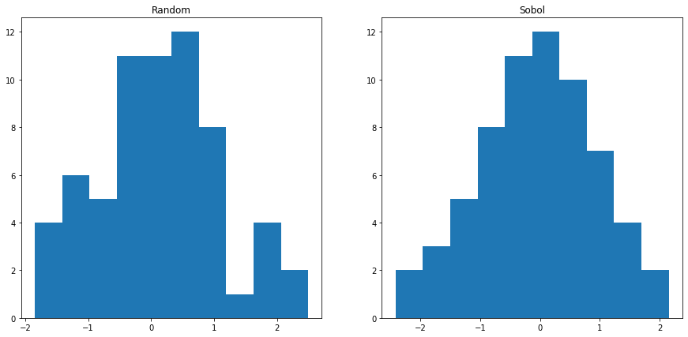

# Comparing Option Pricing Methods in kdb+/q

In this paper, we compare the use of both Monte Carlo (MC) and Quasi-Monte Carlo (QMC) methods in the process of pricing European and Asian options. In doing so, we consider the use of two discretization schemes - standard discretization and Brownian bridge construction. Results produced by the different methods are compared with the deterministic Black-Scholes price for each option type, using Global Sensitivity Analysis (SA). Note that the methods demonstrated below follow the work presented in the paper S. Kucherenko et. al 2007. <sup>[1]</sup>.

## Black-Scholes 

The most common model used to calculate the price of options is Black-Scholes, where the formula for each market is derived from the Black-Scholes equation <sup>[4]</sup>. In this paper, we look specifically at the Black-Scholes models for European and Asian call options. The standard Black-Scholes model for European options assumes a payoff based on the underlying price at exercise. The modified model for Asian options assumes a payoff based on the average underlying price over a pre-defined time period <sup>[5]</sup>. In each case, the Black-Scholes model produces a closed-form solution with a deterministic result.

For European call options, the price of the corresponding option at time $t$, $P(S_{t},t)$, is given by:

$$\begin{eqnarray}
d_{1} = \frac{1}{\sigma\sqrt{T-t}}\Big[ln\Big(\frac{S_{t}}{K}\Big)+\Big((r-q)+\frac{\sigma^{2}}{2}\Big)(T-t)\Big]
\end{eqnarray}$$

$$\begin{eqnarray}
d_{2} = d_{1}-\sigma\sqrt{T-t}
\end{eqnarray}$$

$$\begin{eqnarray}
P(S_{t},t) = S_{t}e^{-q(T-t)}N(d_{1})-Ke^{-r(T-t)}N(d_{2})
\end{eqnarray}$$

Where $T$ is the expiry, $S_{t}$ is the price of the underlying asset at time $t$, $K$ is the strike price of the option, $\sigma$ is the volatility and $r$ is the interest rate. Note that the price is discounted by the dividends, $q$, throughout <sup>[6]</sup>.
 
For Asian call options, we implement the same formula, using an adjusted $S_{t}$ and $\sigma^{2}$:

$$\begin{eqnarray}
\mu_{adj} = \frac{1}{2}\Big(r-\frac{\sigma}{2}\Big)\Big(1+\frac{1}{n}\Big)
\end{eqnarray}$$

$$\begin{eqnarray}
\sigma^{2}_{adj} = \frac{\sigma^2}{3}\Big(1+\frac{1}{n}\Big)\Big(1+\frac{1}{2n}\Big)
\end{eqnarray}$$

$$\begin{eqnarray}
{S_{t}}_{adj} = S_{t}e^{\frac{1}{2}\sigma^{2}_{adj}(T-t)+\mu_{adj}-r}
\end{eqnarray}$$

Where $n$ is the number of timesteps.

## Monte Carlo and Quasi-Monte Carlo Simulations

The use of MC simulations in the financial industry stems from the need to evaluate complex financial instruments and the lack of analytical solutions available to do so. MC is used to mimic the uncertainty associated with the underlying price of an instrument and subsequently generate a value based on the possible underlying input values. One example of where MC is used in finance, is in evaluating an option on an equity. For each underlying asset, an MC simulation is used to create thousands of random price paths, with an associated payoff. The option price for each path is calculated by taking the average over the future payoffs and discounting them to the present <sup>[7]</sup>.

These models are based on pseudo-random numbers which despite being commonly used, exhibit very slow convergence, with a rate of $O(1/\sqrt{N})$ where N is the number of sampled points. To improve upon these models, QMC methods have been developed which use low-discrepancy sequences (LDS) to produce a rate of convergence ~ $O(1/N)$. LDS are deterministic uniformly distributed sequences which are specifically designed to place sample points as uniformly as possible.  Many practical studies have proven that the Sobol’ LDS is superior to other LDS. The most effective QMC method for application in financial engineering is based on Sobol’ LDS.
<sup>[2][3][8][10]</sup>

## Wiener Path

The starting point for asset price simulation, is the construction of a Wiener path (or Brownian motion). Such paths are built from a set of independent Gaussian variates, using either standard discretization or Brownian bridge construction.

In the standard approximation, the Weiner path is found by taking the cumulative sum of the Gaussian variates.

When constructing a Brownian bridge, the last step of the Wiener path is calculated first, followed by the mid-step, and then bisecting to fill in the gaps until all steps are determined.

An example of building up a Brownian bridge is shown in the diagram below, where we have a total of 14 timesteps (from 1 to 14) and the 0th index, assumed to have a 0 value.

<center></center>

<center><u><b>The construction of a Brownian bridge over 14 steps</b></u> <sup>[8]</sup></center>

Both standard discretization and Brownian bridge construction share the same variance and therefore the same resulting convergence when used with MC models. However, performance differs between the two when QMC methods are introduced, with faster convergence seen for Brownian bridge construction.

In order to showcase how performant the QMC simulation is when paired with Brownian bridge construction, we use Global SA as outlined in S. Kucherenko et. al 2007 <sup>[1]</sup>. This method allows us to estimate the contribution of individual input parameters in the final variance of the output over a number of experiments. In each experiment, we:

1. Randomly generate n random numbers, either pseudo-random (MC) or sobol sequence (QMC) <sup>[2][3]</sup>.
2. Convert into a normal distribution.
3. Convert into a Wiener path random walk using standard discretization or Brownian bridge construction.
4. Convert into an asset price path based on parameters:

	* `s`: Asset price at $t=0$
	* `v`: Volatility
	* `r`: Interest rate
	* `q`: Dividends
	* `t`: Expiry

5. Convert into an option price based on the option type and strike price, `k`.

The prices produced are then averaged to find a final predicted price.

## Implementation

In the following sections, we compare the methods of option pricing mentioned above. The Black-Scholes price for each market is compared to an average price generated using the following combinations of simulation and discretization methods:

 * Pseudo-random number generation (MC) with standard discretization.
 * Sobol sequences (QMC) with standard discretization.
 * Sobol sequences (QMC) with Brownian bridge construction.

The Black-Scholes function for each market produces a closed-form solution with a deterministic result, while the MC/QMC functions perform a number of random experiments and return an average price, based on the option type and the strike price.

Once both the Black-Scholes and MC/QMC prices have been calculated for each market, the root mean square error (RMSE) is calculated between the two. This is demonstrated in the final example below, where the process is repeated for an increasing number of paths, with resulting errors compared.

The technical dependencies required for the below work are as follows:

- [Option Pricing kdb+/q library](https://github.com/dmorgankx/sobol/)
- [embedPy](https://github.com/KxSystems/embedPy)
- Sobol C++ library - `SobolSeq1024` function provided in the Option Pricing kdb+/q library with max dimension of 1024.
- [matplotlib](https://matplotlib.org/)

!!! note
	For simplicity, utility functions are omitted from the code snippets below. These can be found within the Option Pricing library linked above.

### Load scripts

As mentioned previously, the implementations of option pricing methods outlined below are based on original C++ scripts used in S. Kucherenko et. al 2007 <sup>[1]</sup>. Wrappers for the C++ pseudo-random and sobol sequence number generators <sup>[2][3]</sup> are contained within `rand.q`, along with the cumulative and inverse cumulative normal distribution functions in `norm.q`.

To run the below examples, q scripts are loaded including the C++ wrappers and graphics functions used throughout.

```q
\l code/q/rand.q
\l code/q/norm.q
\l notebooks/graphics/graphics.q
```

### Black-Scholes Option Pricing

The following functions provide q implementations of the Black-Scholes formulae for each market of interest.

European:
```q
q)bsEuroCall:{[pd]
   d1:(log[pd[`s]%pd`k]+t*(pd[`r]-pd`q)+.5*v*v)%vrtt:(v:pd`v)*sqrt t:pd`t;
   (pd[`s]*exp[neg t*pd`q]*cnorm1 d1)-pd[`k]*exp[neg t*pd`r]*cnorm1 d1-vrtt}
```

Asian:
```q
q)bsAsiaCall:{[n;pd]
   adjmu:.5*((r:pd`r)-.5*v2:v*v:pd`v)*n1:1+1.%n;
   adjv2:(v2%3)*n1*1+.5%n;
   adjS :pd[`s]*exp(t:pd`t)*(hv2:.5*adjv2)+adjmu-r;
   d1:(log[adjS%k:pd`k]+t*(r-q:pd`q)+hv2)%rtv2:sqrt adjv2*t;
   (adjS*exp[neg q*t]*cnorm1 d1)-k*exp[neg r*t]*cnorm1 d1-rtv2}
```

Each function must be passed a parameter dictionary containing values for `s`, `k`, `v`, `r`, `q` and `t`. Note that the Black-Scholes price of an Asian call option depends on the number of timesteps n, which must also be passed as an argument. The outputs of these functions are demonstrated below for 512 timesteps.

```q
q)nsteps:512
q)pd:`s`k`v`r`q`t!100 100 .2 .05 0 1
q)-1"European Black Scholes Price: ",string bseuro:bsEuroCall pd;
q)-1"Asian Black Scholes Price:    ",string bsasia:bsAsiaCall[nsteps]pd;
European Black Scholes Price: 10.45058
Asian Black Scholes Price:    5.556009
```

### Monte Carlo and Quasi-Monte Carlo Option Pricing

#### 1. Random number generation

The first stage in predicting an option price is to generate a set of random numbers using either MC or QMC methods. In the below example we generate 512 pseudo-random and Sobol sequence numbers, with results plotted for comparison.

Random numbers are generated using the Mersenne Twister <sup>[12]</sup> number generator which has 1 parameter, the number of steps.

The Sobol sequence generator takes in 2 arguments, the index of the point (0 < i < 2<sup>31</sup> - 1) and the dimension of the Sobol sequence, i.e. the number of steps (0 < d < 1025).

```q
/ Functions to generate n numbers (random or Sobol) in d dimensions
q)rdmngen:{[n;d](d;n)#mtrand3 d*n}
q)sobngen:{[n;d]flip sobolrand[d]each 1+til n}
q)data:(rdmngen;sobngen).\:nsteps,2
q)subplot[data;("Random";"Sobol");2;2#`scatter]
```


It is clear that the pseudo-random numbers are not evenly distributed, with points clustering together in some sections, while leaving large portions of white space in others.

In contrast, the Sobol sequence plot exhibits a much more even distribution, with few points clumping together.

#### 2. Convert to a Gaussian distribution

The generated sequences are converted from a uniform distribution to a Gaussian distribution. Following this conversion, around 68% of the values lie within one standard deviation, while two standard deviations account for around 95% and three account for 99.7%.

<center></center>

<center><u><b>Gaussian Distribution</b></u> <sup>[9]</sup></center>

In the example below we convert the uniform generated Sobol sequence to a Gaussian distribution, using the inverse cumulative normal function, `invcnorm`.

```q
q)zsob:invcnorm each sob:last data
q)subplot[(sob;zsob);("Sobol Uniform";"Sobol Gaussian");2;2#`scatter]
```


The differences between the Gaussian distributions produced for random and Sobol sequences are best demonstrated for a small number of timesteps, e.g. 64. Below we plot the 1D Gaussian distributions for both random and Sobol number generation across 64 timesteps.

```q
q)/ Returns 1D Gaussian distribution to plot
q)gausscnv:{[g;n;d]first invcnorm each$[g~`rdm;rdmngen;sobngen][n;d]}
q)/ Calculates Gaussian variates for 64 steps, in 2 dimensions
q)dist:gausscnv[;64;2]each`rdm`sob
q)subplot[dist;("Random";"Sobol");2;2#`hist]
```


As expected the Sobol sequence exhibits a Gaussian curve with much better statistical properties than the random number sequence <sup>[11]</sup>.

#### 3. Convert into a Wiener path random walk

The q code to build both a Brownian bridge and Wiener path random walk is shown below.

Brownian bridge:

```q
q)bbridge:{[n;dt]
   bb:first flip(n-1).[i.initbb n]\(`bidx`ridx`lidx!3#n-1;((n-1)#0b),1b);
   bb:update lwt:bidx-lidx,rwt:ridx-bidx,sigma:ridx-lidx from bb;
   bb:update lwt%sigma,rwt%sigma,sigma:sqrt dt*lwt*rwt%sigma from bb;
   i.buildpath .[bb;(0;`sigma);:;sqrt n*dt]}
```

Wiener path:

```q
q)wpath:{[u;d]$[(::)~d`bb;sums;d`bb]invcnorm u}
```

An example of how the Brownian bridge is built is shown below up using `bbdemo`. The function outputs a table with n timesteps, in this case n = 8, showing the order in which steps are added to the path. Note that `i0` was added here, where we assume that it has a value equal to 0.

```q
q)bbdemo:{[n;dt]
   x:1b,'enlist[n#0b],last flip(n-1).[i.initbb n]\(`bidx`ridx`lidx!3#n-1;((n-1)#0b),1b);
   stp::n+1;bbd::"\n"vs .Q.s flip(`$"i",'string til count x)!x:flip(" X")x;}
q).z.ts:{if[3<count bbd;-1 system syscmd;if[stp~count[bbd]-3;-1@'2#bbd];-1@'2_3#bbd;bbd::(2#bbd),3_bbd];}
q)\t 1000
q)bbdemo[8;1.]
i0 i1 i2 i3 i4 i5 i6 i7 i8
--------------------------
X                         

X                       X 

X           X           X 

X     X     X           X 

X     X     X     X     X 

X  X  X     X     X     X 

X  X  X  X  X     X     X 

X  X  X  X  X  X  X     X 

X  X  X  X  X  X  X  X  X 
```

When recording the order of steps in the path, we take note of the left and right weights and indices, and the corresponding sigma value for each step in the sequence. This is shown for 512 timesteps and 1 unit of time, with the sigma value for each index in the Brownian bridge subsequently plotted.

```q
q)dt:1
q)show 10#b:last value bbex:bbridge[nsteps;dt]
bidx ridx lidx lwt rwt sigma   
-------------------------------
511  511  511          22.62742
255  511  -1   0.5 0.5 11.31371
127  255  -1   0.5 0.5 8       
383  511  255  0.5 0.5 8       
63   127  -1   0.5 0.5 5.656854
191  255  127  0.5 0.5 5.656854
319  383  255  0.5 0.5 5.656854
447  511  383  0.5 0.5 5.656854
31   63   -1   0.5 0.5 4       
95   127  63   0.5 0.5 4       
```


Once the Brownian bridge has been intialized, it can be used to transform Gaussian variates into a Wiener path random walk. Below, a Wiener path with 512 timesteps is constructed using a Sobol sequence (of length 512) and the Brownian bridge constructed previously. Note that the function `wpath` takes the following arguments:
- `u` - Sequence of generated numbers, Sobol or random.
- `d` - Dictionary indicating whether to use standard discretization or Brownian bridge construction, and whether to use Sobol sequences (`1b`) or pseudo-random numbers (`0b`). If using a Brownian bridge, the initial Brownian bridge must be passed in, if not use `(::)`.

```q
q)d:`bb`sobol!(bbex;1b)
q)show w:wpath[sobolrand[nsteps;2];d]
-0.4450092 0.06385387 -0.1017726 -1.221271 -0.9099617 -1.552524 -0.5667251 -0.5347982 -0.3631799 -1.145434 ..
q)plt[`:title]"Wiener path random walk";
q)plt[`:plot]w;
q)plt[`:show][];
```


#### 4. Convert into asset price path
At this point, the Wiener path is converted into an asset price path using the function below.

```q
spath:{[u;n;d;pd]pd[`s]*exp(wpath[u;d]*pd[`v]*sqrt dt)+(1+til n)*dr:(pd[`r]-pd[`q]+.5*v*v:pd`v)*dt:pd[`t]%n}
```

Here we calculate six different asset price paths and overplot them for comparison. We start by generating the Sobol sequences for 8 paths with 512 timesteps, incrementing the Sobol index each time. Brownian bridge approximation is also used.

```q
q)-1"Generated sequences: \n";
q)show u:sobolrand[nsteps;]each 2+til 8;
q)plt[`:title]"Asset Price Path";
q)plt[`:plot] each spath[;nsteps;d;pd]each u;
q)plt[`:show][];
Generated sequences: 

0.25   0.75   0.25   0.75   0.25   0.75   0.25   0.25   0.75   0.75   0.25   0.25   0.75   0.75   0.25   0...
0.75   0.25   0.75   0.25   0.75   0.25   0.75   0.75   0.25   0.25   0.75   0.75   0.25   0.25   0.75   0...
0.375  0.625  0.125  0.875  0.875  0.125  0.625  0.125  0.875  0.625  0.125  0.375  0.375  0.125  0.625  0...
0.875  0.125  0.625  0.375  0.375  0.625  0.125  0.625  0.375  0.125  0.625  0.875  0.875  0.625  0.125  0...
0.125  0.375  0.375  0.125  0.625  0.875  0.875  0.375  0.125  0.375  0.375  0.125  0.625  0.875  0.875  0...
0.625  0.875  0.875  0.625  0.125  0.375  0.375  0.875  0.625  0.875  0.875  0.625  0.125  0.375  0.375  0...
0.3125 0.3125 0.6875 0.5625 0.1875 0.0625 0.9375 0.5625 0.0625 0.8125 0.1875 0.6875 0.6875 0.6875 0.1875 0...
0.8125 0.8125 0.1875 0.0625 0.6875 0.5625 0.4375 0.0625 0.5625 0.3125 0.6875 0.1875 0.1875 0.1875 0.6875 0...
```


#### 5. Convert into option price
Lastly, to find a single option price, an average is taken across the asset price path for the MC/QMC method. This allows for comparison between the predicted price and the Black-Scholes equivalent.

European:

```q
q)mcEuroCall:{[m;n;d;pd]exp[neg pd[`r]*pd`t]*avg 0|(last each spath[;d;pd]each m#n)-pd`k}
```

Asian:
```q
q)mcAsiaCall:{[m;n;d;pd]exp[neg pd[`r]*pd`t]*avg 0|(last each prds each xexp[;1%n]spath[;d;pd]each m#n)-pd`k}
```

We also need a number generator function for l trials, m paths and n steps which can be used with the Sobol or random number generators.
```q
numgen:{[ng;l;m;n]ng@''$[ng~mtrand3;(l;first m)#n;(0N;m)#1+til l*m]}
```

Here we demonstrate how to run these functions below for 512 timesteps, 256 paths and 5 trials. Sequences are generated for Sobol sequences using the above numgen function which will produce a sequence for each path and each trial.

```q
q)ntrials:5
q)npaths:256
q)-1"Generated sequences:\n";
q)show 5#u:first numgen[sobolrand nsteps;ntrials;npaths;nsteps]
q)-1"\nEuropean Monte Carlo Price: ",string mcEuroCall[u;nsteps;`bb`sobol!(bbex;1b);pd];
q)-1"Asian Monte Carlo Price:    ",  string mcAsiaCall[u;nsteps;`bb`sobol!(bbex;1b);pd];
Generated sequences:

0.5   0.5   0.5   0.5   0.5   0.5   0.5   0.5   0.5   0.5   0.5   0.5   0.5   0.5   0.5   0.5   0.5   0.5  ..
0.25  0.75  0.25  0.75  0.25  0.75  0.25  0.25  0.75  0.75  0.25  0.25  0.75  0.75  0.25  0.25  0.75  0.75 ..
0.75  0.25  0.75  0.25  0.75  0.25  0.75  0.75  0.25  0.25  0.75  0.75  0.25  0.25  0.75  0.75  0.25  0.25 ..
0.375 0.625 0.125 0.875 0.875 0.125 0.625 0.125 0.875 0.625 0.125 0.375 0.375 0.125 0.625 0.375 0.625 0.375..
0.875 0.125 0.625 0.375 0.375 0.625 0.125 0.625 0.375 0.125 0.625 0.875 0.875 0.625 0.125 0.875 0.125 0.875..

European Monte Carlo Price: 10.28224
Asian Monte Carlo Price:    5.365942
```

Remembering that the Black-Scholes option prices for the same number of timesteps were:

```q
q)-1"European Black Scholes Price: ",string bseuro;
q)-1"Asian Black Scholes Price:    ",string bsasia;
European Black Scholes Price: 10.45058
Asian Black Scholes Price:    5.556009
```

## Example

In this section we deploy all of the aforementioned techniques and compare the results.

!!!note
	The below example can be run from the terminal across multiple threads using the following commands:

	```$ q -s 8

	```q)\l op.q```

	```q)loadfile`:init.q```

	```q)loadfile`:code/q/run.q```

	where we load in the functions contained within the Option Pricing library using the first two commands and run the example by loading in `run.q`.

### Parameters

As shown previously, a dictionary of parameters is created.

```q
q)show pd:`s`k`v`r`q`t!100 100 .2 .05 0 1
s| 100
k| 100
v| 0.2
r| 0.05
q| 0
t| 1
```

Additional parameters are also initialized for the number of paths (experiments), steps and trials.

```q
q)l:20                        / Number of trials
q)show m:"j"$xexp[2;3+til 8]  / Number of paths
q)n:1024                      / Number of steps
8 16 32 64 128 256 512 1024
```

Given that the initial Brownian bridge is the same throughout, it is also initialized and passed in as an argument.

```q
q)show 10#last value bb:bbridge[n;1]
bidx ridx lidx lwt rwt sigma   
-------------------------------
1023 1023 1023         32      
511  1023 -1   0.5 0.5 16      
255  511  -1   0.5 0.5 11.31371
767  1023 511  0.5 0.5 11.31371
127  255  -1   0.5 0.5 8       
383  511  255  0.5 0.5 8       
639  767  511  0.5 0.5 8       
895  1023 767  0.5 0.5 8       
63   127  -1   0.5 0.5 5.656854
191  255  127  0.5 0.5 5.656854
```

### Run experiments
The below functions calculate the RMSE between the Black Scholes and MC/QMC prices for each market and each MC/QMC technique. Note that we reset the `sobolrand` index after each set of trials have been completed.

```q
q)/ Run all techniques for option pricing
q)runall:{[bb;pd;l;n;m]
   st:.z.p;0N!i.rcol;e:i.run[`euro;bsEuroCall pd;bb;pd;l;n]each m;
   -1"European: time taken = ",string[.z.p-st],"\n";
   st:.z.p;0N!i.rcol;a:i.run[`asia;bsAsiaCall[n;pd];bb;pd;l;n]each m;
   -1"Asian: time taken = ",string .z.p-st;
   e,a}
q)i.d:`bb`sobol!
q)i.rcol:`mkt`npaths`rmse_bb_sobol`rmse_std_sobol`rmse_std_rdm`prx_bb_sobol`prx_std_sobol`prx_std_rdm`prx_bs
q)i.rmse:{sqrt avg x*x-:y}
q)i.run :{[mkt;bs;bb;pd;l;n;m]
   mc:$[mkt~`asia;mcAsiaCall;mcEuroCall][;n;;pd];
   ea:i.rmse[bs]a:mc[;i.d(bb;1b)]each sob:numgen[sobolrand n;l;m;n];
   eb:i.rmse[bs]b:mc[;i.d(::;1b)]each sob;
   ec:i.rmse[bs]c:mc[;i.d(bb;0b)]each numgen[mtrand3;l;m;n];
   i.rcol!0N!(mkt;m;ea;eb;ec;last a;last b;last c;bs)}
```

### Compare results
At this stage it is possible to plot the results obtained for the option prices, RMSE and log RMSE values.

```q
q)r:runall[bb;pd;l;n;m]
q)select from r where mkt=`asia
mkt  npaths rmse_bb_sobol rmse_std_sobol rmse_std_rdm prx_bb_sobol prx_std_sobol prx_std_rdm prx_bs  
-----------------------------------------------------------------------------------------------------
asia 8      1.044296      2.126291       2.367783     6.461112     5.220244      7.388339    5.551409
asia 16     0.6879741     1.37292        1.377341     4.369775     6.440017      7.051311    5.551409
asia 32     0.3959254     0.90278        1.2315       5.445392     6.276696      7.052442    5.551409
asia 64     0.2453828     0.4006613      1.006066     5.641087     5.432976      5.68178     5.551409
asia 128    0.1543742     0.3089822      0.5366735    5.473975     5.609705      5.874212    5.551409
asia 256    0.0771557     0.2283313      0.6641969    5.590241     5.307291      5.522739    5.551409
asia 512    0.03863931    0.1614974      0.3205372    5.576155     5.22571       5.24652     5.551409
asia 1024   0.01975347    0.166499       0.2591332    5.544304     5.629553      5.718109    5.551409
q)select from r where mkt=`euro
mkt  npaths rmse_bb_sobol rmse_std_sobol rmse_std_rdm prx_bb_sobol prx_std_sobol prx_std_rdm prx_bs  
-----------------------------------------------------------------------------------------------------
euro 8      2.218523      3.328543       5.209454     13.86836     4.627863      20.38541    10.45058
euro 16     1.345787      2.442911       3.676035     9.206011     12.88644      12.20984    10.45058
euro 32     0.6865024     1.623545       3.015535     9.879788     11.36182      5.68257     10.45058
euro 64     0.3774031     0.9891046      1.967627     10.90519     11.03423      9.034532    10.45058
euro 128    0.2089234     0.5977986      1.619673     10.34505     11.26803      7.360597    10.45058
euro 256    0.117329      0.3648233      1.065048     10.52265     10.26664      8.453786    10.45058
euro 512    0.05984563    0.3127605      0.7586819    10.50504     9.799289      11.4056     10.45058
euro 1024   0.03176637    0.2853521      0.3566248    10.43112     10.29892      11.01441    10.45058
```

#### Option Prices

The plot below shows the option prices produced for each number of paths, compared to the Black-Scholes equivalent (black dashed-line). It is clear that the Sobol-Brownian bridge method converges the fastest.

```q
q)prxerrplot[r;`prx]
```


#### RMSE

We can also plot the RMSE produced by comparing the prices for each method as they converge to the relative Black-Scholes price. The expected result is again exhibited.

```q
q)prxerrplot[r;`rmse]
```


#### Log RMSE

Lastly, we can look at the log RMSE plot as another means of comparison between the methods. Similarly, we see that the Sobol-Brownian bridge method (blue) exhibits superior performance.

```q 
q)prxerrplot[r;`logrsme]
```


## Conclusion

In this paper we demonstrated that it is possible to calculate option prices using both Black-Scholes and Monte Carlo/Quasi-Monte Carlo methods in kdb+/q. The Monte Carlo/Quasi-Monte Carlo methods deployed different implementations of both Wiener path approximation and random number generation.

Looking at the results produced, it is clear that both the option price produced and the resulting RMSE/log RMSE converged fastest when compared with the Black-Scholes price for the Quasi-Monte Carlo approach, with Sobol sequence number generation and Brownian bridge construction.

Additionally, by plotting results we have shown that the kdb+/q implementation replicates the original results produced in C++, presented in the paper S. Kucherenko et. al 2007.

## Author

Deanna Morgan joined First Derivatives in June 2018 as a Data Scientist in the Capital Markets Training Program and currently works as a Machine Learning Engineer in London.


## Acknowledgements

I gratefully acknowledge Sergei Kucherenko for allowing us to create a version of the C++ Option Pricing library in kdb+/q and for providing technical knowledge throughout the project. I would additionally like to acknowledge my colleagues in the Kx Machine Learning team for their guidance in the technical aspects of this paper.

## References

1. S. Kucherenko et al. 2007, 'The Importance of Being Global - Application of Global Sensitivity Analysis in Monte Carlo Option Pricing', _Wilmott_, pp. 82–91. Available at http://www.broda.co.uk/gsa/wilmott_GSA_SK.pdf. Accessed September 3, 2019.
2. S. Kucherenko et al. 2001, 'Construction and Comparison of
  High-Dimensional SobolGenerators', _Wilmott_, Nov,
  pp. 64-79. Available at http://www.broda.co.uk/doc/HD_SobolGenerator.pdf. Accessed September 23, 2019.
3. Broda. Broda.co.uk. http://www.broda.co.uk. Published 2019. Accessed September 23, 2019.
4. Black–Scholes equation. En.wikipedia.org. https://en.wikipedia.org/wiki/Black%E2%80%93Scholes_equation. Published 2019. Accessed September 6, 2019.
5. Asian option. En.wikipedia.org. https://en.wikipedia.org/wiki/Asian_option#European_Asian_call_and_put_options_with_geometric_averaging. Published 2019. Accessed September 11, 2019.
6. Black–Scholes model. En.wikipedia.org. https://en.wikipedia.org/wiki/Black%E2%80%93Scholes_model. Published 2019. Accessed September 11, 2019. 
7. Monte Carlo methods in finance. En.wikipedia.org. https://en.wikipedia.org/wiki/Monte_Carlo_methods_in_finance. Published 2019. Accessed September 11, 2019.
8. P. Jäckel 2001, ‘Monte Carlo Methods In Finance’, pp. 122.
9. Normal distribution. En.wikipedia.org. https://en.wikipedia.org/wiki/Normal_distribution. Published 2019. Accessed September 11, 2019.
10. P. Glasserman 2003, 'Monte Carlo Methods in Financial Engineering', _Springer_.
11. S. Kucherenko 2008. 'High Dimensional Sobol's Sequences And Their Application'. Available at http://www.broda.co.uk/doc/SobolSeq_report.pdf. Accessed September 23, 2019.
12. Mersenne Twister. En.wikipedia.org. https://en.wikipedia.org/wiki/Mersenne_Twister. Published 2019. Accessed September 27, 2019.
