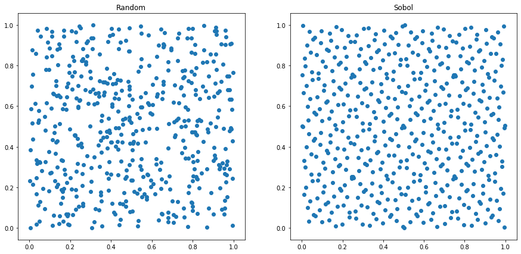
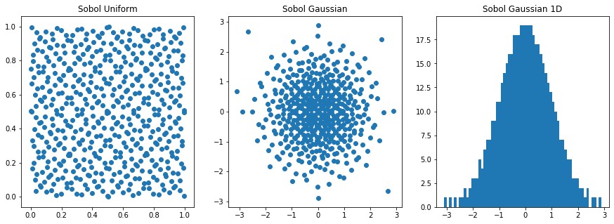
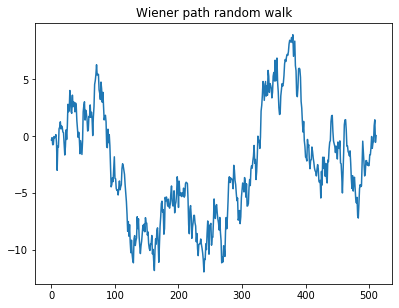
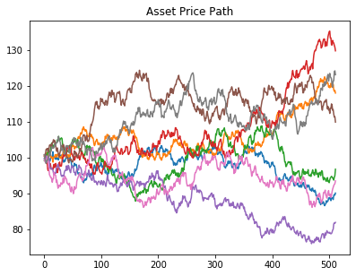
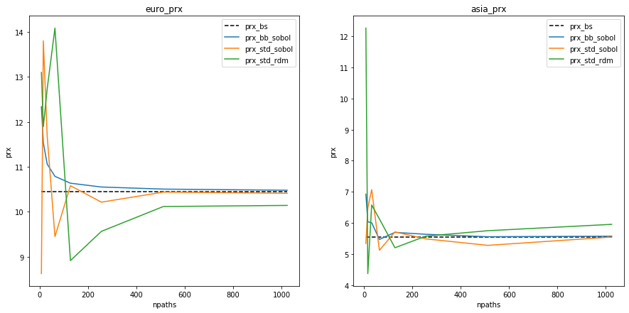
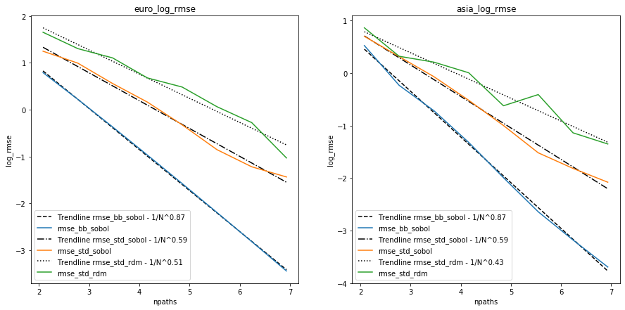

# Comparing Option Pricing Methods in kdb+/q

In this paper, we compare the use of both Monte Carlo (MC) and Quasi-Monte Carlo (QMC) methods in the process of pricing Asian and European call options. In doing so, we consider the use of two discretization schemes - standard discretization and Brownian bridge construction. Results produced by the different methods will be compared to the Black-Scholes price for each option type using Global Sensitivity Analysis (SA). Note that the methods demonstrated below follow the work presented in the paper S. Kucherenko et. al 2007 <sup>[1]</sup>.

## Black-Scholes 

A common model used in finance to calculate the price of call options is Black-Scholes, where the formula for each market is derived from the Black-Scholes equation <sup>[2]</sup>. In this paper, we look specifically at the Black-Scholes models for Asian and European options. The models differ from each other due to the fact that the payoff for an Asian option is given by the average underlying price over a pre-defined time period, whereas for European options the payoff is calculated based on the underlying price at exercise <sup>[3]</sup>. The function for each market produces a closed form solution with a deterministic result.

For European call options, the price of the corresponding option at time $t$, $P(S_{t},t)$, is given by:

$$\begin{eqnarray}
d_{1} = \frac{1}{\sigma\sqrt{T-t}}\Big[ln\Big(\frac{S_{t}}{K}\Big)+\Big((r-q)+\frac{\sigma^{2}}{2}\Big)(T-t)\Big]
\end{eqnarray}$$

$$\begin{eqnarray}
d_{2} = d_{1}-\sigma\sqrt{T-t}
\end{eqnarray}$$

$$\begin{eqnarray}
P(S_{t},t) = S_{t}e^{-q(T-t)}N(d_{1})-Ke^{-r(T-t)}N(d_{2})
\end{eqnarray}$$

Where $T$ is the expiry, $S_{t}$ is the price of the underlying asset at time $t$, $K$ is the strike price of the option, $\sigma$ is the volatility and $r$ is the interest rate. Note that the price is discounted by the dividends, $q$, throughout <sup>[4]</sup>.
 
For Asian call options, we implement the same formula, using an adjusted $S_{t}$ and $\sigma^{2}$:

$$\begin{eqnarray}
\mu_{adj} = \frac{1}{2}\Big(r-\frac{\sigma}{2}\Big)\Big(1+\frac{1}{n}\Big)
\end{eqnarray}$$

$$\begin{eqnarray}
\sigma^{2}_{adj} = \frac{\sigma^2}{3}\Big(1+\frac{1}{n}\Big)\Big(1+\frac{1}{2n}\Big)
\end{eqnarray}$$

$$\begin{eqnarray}
{S_{t}}_{adj} = S_{t}e^{\frac{1}{2}\sigma^{2}_{adj}(T-t)+\mu_{adj}-r}
\end{eqnarray}$$

Where $n$ is the number of timesteps.

## Monte Carlo and Quasi-Monte Carlo Simulations

The use of MC simulations in the financial industry stems from the need to evaluate complex financial instruments and the lack of analytical solutions available to do so. MC is used to mimic the uncertainty associated with the underlying price of an instrument and subsequently generate a value based on the possible underlying input values. One example of where MC is used in finance is in evaluating an option on equity. For each underlying share, a MC simulation is used to create thousands of random price paths, with a given option price for each path <sup>[5]</sup>.

These models are based on pseudo-random numbers and despite being commonly used, tend to have slow convergence, with a rate of $O(1/\sqrt{N})$ where N is the number of sampled points. To improve upon these models, QMC methods have been developed which use low-discrepancy sequences (LDS) to produce a rate of convergence ~ $O(1/N)$. LDS are deterministic uniformly distributed sequences, an example of which is the Sobol sequence used throughout this work <sup>[1]</sub>.

## Wiener Path

A large portion of financial problems can be solved by calculating the relevant Weiner path integral. Such solutions are formalized by using either standard discretization or Brownian bridge construction. In the standard approximation, this Weiner path can be found by taking the cumulative sum across the random values converted to a gaussian distribution.

To construct a Brownian bridge, the order of steps in the Weiner path have to be determined. The overall idea is to create a path with $n$ timesteps (from $0$ to $n-1$) where we want to calculate the last step first, followed by the mid-step and then fill in the rest.

The process is as follows:

1. Start by calculating the first and last steps, where we assume that the first index has a value equal to 0.
2. Calculate the mid-step, noting that for floating point values we round down.
3. Then follow an iterative bisecting process (see note below):

    1. Start with the current mid-point.
    2. Move to the right, to the next index which is already in the path.
    3. Find the midpoint between that index and the index to its right.
    4. Move to the new midpoint.

4. This process of moving to the right and finding the midpoint between indices is then repeated until there are no further indices left to add to the path.


!!!Note
	1. The sequence acts as a loop, such that moving to point n is equivalent to index 0.
	2. It is only possible to move between steps which have already been added to the final path.


An example of building up a Brownian bridge is shown in the diagram below, where we have a total of 14 timesteps (from 1 to 14) and the 0th index, assumed to have a 0 value.

<center></center>

<center><u><b>The construction of a Brownian bridge over 14 steps</b></u> <sup>[6]</sup></center>

Both standard discretization and Brownian bridge construction share the same variance and therefore the same resulting convergence when used with MC models. However, performance differs between the two when QMC methods are introduced, with faster convergence seen for Brownian bridge construction.

In order to showcase how performant the QMC simulation is when paired with Brownian bridge construction, we use Global SA as outlined in S. Kucherenko et. al 2007 <sup>[1]</sup>. This method allows us to estimate the contribution of individual input parameters in the final variance of the output over a number of experiments. In each experiment, we:

1. Randomly generate n random numbers, either pseudo-random (MC) or sobol sequence (QMC).
2. Convert into a normal distribution.
3. Convert into a Wiener path random walk using standard discretization or Brownian bridge construction.
4. Convert into an asset price path based on parameters:

	* `s`: Asset price at $t=0$
	* `v`: Volatility
	* `r`: Interest rate
	* `q`: Dividends
	* `t`: Expiry

5. Convert into an option price based on the option type and strike price, `k`.

The prices produced are then averaged to find a final predicted price.

## Implementation

In the following sections we detail the comparison of the above mentioned methods of option pricing. The Black-Scholes price for each market was compared to an average price generated using the following combinations of simulation and discretization methods:

 * Pseudo-random number generation (MC) with standard discretization.
 * Sobol sequences (QMC) with standard discretization.
 * Sobol sequences (QMC) with Brownian Bridge construction.

The Black-Scholes function for each market produces a closed form solution with a deterministic result, while the MC/QMC functions perform a number of random experiments and return an average price, based on the option type and the strike price.

Once both the Black-Scholes and MC/QMC prices had been calculated for each market, the RMSE was calculated between the two. This is demonstrated in the final example below where the process was repeated for an increasing number of paths, with resulting errors compared.

The technical dependencies required for the below work are as follows:

- [Option Pricing kdb+/q library](https://github.com/dmorgankx/sobol/)
- [embedPy](https://github.com/KxSystems/embedPy)
- [Sobol C++ library](https://www.broda.co.uk/software.html) - relevant code contained within the Option Pricing kdb+/q library.
- matplotlib

!!! note
	For simplicity, utility functions were omitted from the code snippets below. These can be found within the Option Pricing library linked above.

### Load scripts

As mentioned previously, the implementations of option pricing methods outlined below were based on original C++ scripts used in S. Kucherenko et. al 2007 <sup>[1]</sup>. Given the optimised performance exhibited by a number of elements in the original code, q wrappers were written for the C++ pseudo-random and sobol sequence number generators, contained within `rand.q`, along with the cumulative and inverse cumulative normal distribution functions in `norm.q`.

To run the below examples, q scripts were loaded in which include the C++ wrappers and graphics functions used throughout.

```q
\l code/q/rand.q
\l code/q/norm.q
\l notebooks/graphics/graphics.q
```

### Black-Scholes Option Pricing

Using the Black-Scholes formulae outlined above, the following functions were written in q for each market of interest.

European:
```q
q)bsEuroCall:{[pd]
   d1:(log[pd[`s]%pd`k]+t*(pd[`r]-pd`q)+.5*v*v)%vrtt:(v:pd`v)*sqrt t:pd`t;
   (pd[`s]*exp[neg t*pd`q]*cnorm1 d1)-pd[`k]*exp[neg t*pd`r]*cnorm1 d1-vrtt}
```

Asian:
```q
q)bsAsiaCall:{[n;pd]
   adjmu:.5*((r:pd`r)-.5*v2:v*v:pd`v)*n1:1+1.%n;
   adjv2:(v2%3)*n1*1+.5%n;
   adjS :pd[`s]*exp(t:pd`t)*(hv2:.5*adjv2)+adjmu-r;
   d1:(log[adjS%k:pd`k]+t*(r-q:pd`q)+hv2)%rtv2:sqrt adjv2*t;
   (adjS*exp[neg q*t]*cnorm1 d1)-k*exp[neg r*t]*cnorm1 d1-rtv2}
```

Each function must be passed a parameter dictionary containing values for `s`, `k`, `v`, `r`, `q` and `t`. Note that the Black-Scholes price of an Asian call option depends on the number of timesteps n, which must also be passed as an argument. The outputs of these functions are demonstrated below for 512 timesteps.

```q
q)nsteps:512
q)pd:`s`k`v`r`q`t!100 100 .2 .05 0 1
q)-1"European Black Scholes Price: ",string bseuro:bsEuroCall pd;
q)-1"Asian Black Scholes Price:    ",string bsasia:bsAsiaCall[nsteps]pd;
European Black Scholes Price: 10.45058
Asian Black Scholes Price:    5.556009
```

### Monte Carlo and Quasi-Monte Carlo Option Pricing

#### 1. Random number generation

The first stage in predicting an option price is to generate a set of random numbers using either MC or QMC methods. In the below example we generated 512 pseudo-random and Sobol sequence numbers, with results plotted for comparison.

```q
q)rdm:(2;nsteps)#mtrand3 2*nsteps
q)sob:flip sobolrand each nsteps#2
q)subplot[(rdm;sob);("Random";"Sobol");2;2#`scatter]
```


It is clear that the pseudo-random numbers are not evenly distributed, with a points clustering together in some sections, while leaving large portions of white space in others.

In contrast, the Sobol sequence plot exhibits a much more even distribution where points are better spaced out, with few points clumping together.

#### 2. Convert to a Gaussian distribution

The generated sequences were then converted from a uniform distribution to a gaussian distribution. Following this conversion, around 68% of the values lie within one standard deviation, while two standard deviations account for around 95% and three account for 99.7%.

<center></center>

<center><u><b>Gaussian Distribution</b></u> <sup>[7]</sup></center>

In the example below we converted the uniform generated Sobol sequence to a normal distribution using the inverse cumulative normal function, `invcnorm`.

```q
q)zsob:invcnorm each sob
q)subplot[(sob;zsob;first zsob);("Sobol Uniform";"Sobol Gaussian";"Sobol Gaussian 1D");3;`scatter`scatter`hist]
```


As expected the points exhibited a Gaussian curve when plotted in one dimension.

#### 3. Convert into a Wiener path random walk

The q code to build both a Brownian bridge and Wiener path random walk is shown below.

Brownian bridge:

```q
q)bbridge:{[n;dt]
   bb:first flip(n-1).[i.initbb n]\(`bidx`ridx`lidx!3#n-1;((n-1)#0b),1b);
   bb:update lwt:bidx-lidx,rwt:ridx-bidx,sigma:ridx-lidx from bb;
   bb:update lwt%sigma,rwt%sigma,sigma:sqrt dt*lwt*rwt%sigma from bb;
   i.buildpath .[bb;(0;`sigma);:;sqrt n*dt]}
```

Wiener path:

```q
q)wpath:{[n;d]$[(::)~d`bb;sums;d`bb]invcnorm$[d`sobol;sobolrand;mtrand3]n}
```

An example of how the Brownian bridge is built is shown below up using `bbdemo`. The function outputs a table with n timesteps, in this case n = 8, showing the order in which steps are added to the path. Note that `i0` was added here, where we assume that it has a value equal to 0.

```q
q)bbdemo:{[n;dt]
   x:1b,'enlist[n#0b],last flip(n-1).[i.initbb n]\(`bidx`ridx`lidx!3#n-1;((n-1)#0b),1b);
   stp::n+1;bbd::"\n"vs .Q.s flip(`$"i",'string til count x)!x:flip(" X")x;}
q).z.ts:{if[3<count bbd;-1 system syscmd;if[stp~count[bbd]-3;-1@'2#bbd];-1@'2_3#bbd;bbd::(2#bbd),3_bbd];}
q)\t 1000
q)bbdemo[8;1.]
i0 i1 i2 i3 i4 i5 i6 i7 i8
--------------------------
X                         

X                       X 

X           X           X 

X     X     X           X 

X     X     X     X     X 

X  X  X     X     X     X 

X  X  X  X  X     X     X 

X  X  X  X  X  X  X     X 

X  X  X  X  X  X  X  X  X 
```

When recording the order of steps in the path, we also took note of the left and right weights and indices, and the corresponding sigma value for each step in the sequence. This is shown for 512 timesteps and 1 unit of time, with the sigma value for each index in the Brownian Bridge subsequently plotted.

```q
q)dt:1
q)show 10#b:last value bbex:bbridge[nsteps;dt]
bidx ridx lidx lwt rwt sigma   
-------------------------------
511  511  511          22.62742
255  511  -1   0.5 0.5 11.31371
127  255  -1   0.5 0.5 8       
383  511  255  0.5 0.5 8       
63   127  -1   0.5 0.5 5.656854
191  255  127  0.5 0.5 5.656854
319  383  255  0.5 0.5 5.656854
447  511  383  0.5 0.5 5.656854
31   63   -1   0.5 0.5 4       
95   127  63   0.5 0.5 4       
```


The next step in generating an option price is to calculate the Wiener path random walk. In the cell below we found the Wiener path for a sobol sequence with 512 timesteps using the Brownian bridge constructed in the previous cell. Note that the function `wpath` takes the following arguments:

- `n` - Number of timesteps.
- `d` - Dictionary indicating whether to use standard discretization or Brownian bridge construction, and whether to use Sobol sequences (`1b`) or pseudo-random numbers (`0b`). If using a Brownian bridge, the initial Brownian bridge must be passed in, if not use `(::)`.

```q
q)wpath[nsteps;`bb`sobol!(bbex;1b)
-0.3261343 -0.124455 -0.7468779 -0.7283514 -0.02784596 -0.1341059 -0.09226226 0.1405605 -0.5829703 -2.99527..
```


#### 4. Convert into asset price path
At this point it was possible to convert the Wiener path to an asset price path using the function below.

```q
q)spath:{[n;d;pd]pd[`s]*exp(wpath[n;d]*pd[`v]*sqrt dt)+(1+til n)*dr:(pd[`r]-pd[`q]+.5*v*v:pd`v)*dt:pd[`t]%n}
```

Here we calculated six different asset price paths and overplot them for comparison. 512 timesteps were again used with Sobol sequences and Brownian bridge approximation.

```q
q)plt[`:title]"Asset Price Path";
q)do[6;plt[`:plot]spath[nsteps;d;pd]];
q)plt[`:show][];
```


#### 5. Convert into option price
Lastly, to find a single option price, an average was taken across the asset price path for the MC/QMC method. This allowed for comparison between the predicted price and the Black-Scholes equivalent.

European:

```q
q)mcEuroCall:{[m;n;d;pd]exp[neg pd[`r]*pd`t]*avg 0|(last each spath[;d;pd]each m#n)-pd`k}
```

Asian:
```q
q)mcAsiaCall:{[m;n;d;pd]exp[neg pd[`r]*pd`t]*avg 0|(last each prds each xexp[;1%n]spath[;d;pd]each m#n)-pd`k}
```

Here we ran the functions for 512 timesteps, 256 paths and 1 trial. Note that the index in `sobolrand` must be reset before each trial. This can be done using `sobolrand 0`.

```q
q)npaths:256
q)sobolrand 0;-1"European Monte Carlo Price: ",string mcEuroCall[npaths;nsteps;`bb`sobol!(bbex;1b);pd];
q)sobolrand 0;-1"Asian Monte Carlo Price:    ",string mcAsiaCall[npaths;nsteps;`bb`sobol!(bbex;1b);pd];
European Monte Carlo Price: 10.2713
Asian Monte Carlo Price:    5.367306
```

Remembering that the Black-Scholes option prices for the same number of timesteps were:

```q
q)-1"European Black Scholes Price: ",string bseuro;
q)-1"Asian Black Scholes Price:    ",string bsasia;
European Black Scholes Price: 10.45058
Asian Black Scholes Price:    5.556009
```

## Example

In this section we deploy all of the aforementioned techniques and compare the results.

!!!note
	The below example can be run from the terminal using the following commands:

	```q)\l op.q```

	```q)loadfile`:init.q```

	```q)loadfile`:code/q/run.q```

	where we load in the functions contained within the Option Pricing library using the first two commands and run the example by loading in `run.q`.

### Parameters

As shown previously, a dictionary of parameters was created.

```q
q)show pd:`s`k`v`r`q`t!100 100 .2 .05 0 1
s| 100
k| 100
v| 0.2
r| 0.05
q| 0
t| 1
```

Additional parameters we also initialized for the number of paths (experiments), steps and trials.

```q
q)l:20                        / Number of trials
q)show m:"j"$xexp[2;3+til 8]  / Number of paths
q)n:1024                      / Number of steps
8 16 32 64 128 256 512 1024
```

Given that the initial Brownian bridge would be the same throughout, it was also initialized and passed in as an argument.

```q
q)show 10#last value bb:bbridge[n;1]
bidx ridx lidx lwt rwt sigma   
-------------------------------
1023 1023 1023         32      
511  1023 -1   0.5 0.5 16      
255  511  -1   0.5 0.5 11.31371
767  1023 511  0.5 0.5 11.31371
127  255  -1   0.5 0.5 8       
383  511  255  0.5 0.5 8       
639  767  511  0.5 0.5 8       
895  1023 767  0.5 0.5 8       
63   127  -1   0.5 0.5 5.656854
191  255  127  0.5 0.5 5.656854
```

### Run experiments
The below functions calculate the RMSE between the Black Scholes and MC/QMC prices for each market and each MC/QMC technique. Note that we reset the `sobolrand` index after each set of trials have been completed.

```q
q)/ Run all techniques for option pricing
q)runall:{[bb;pd;l;n;m]
   st:.z.p;e:run[`euro;bsEuroCall pd;bb;pd;l;n]each m;
   -1"European: time taken = ",string[.z.p-st],"\n";
   st:.z.p;a:run[`asia;bsAsiaCall[n;pd];bb;pd;l;n]each m;
   -1"Asian:    time taken = ",string .z.p-st;
   e,a}
q)/ Show individual results tables
q)rt:{[t;m]show delete mkt from select from t where mkt=m}
q)/ Run Asian and European models for a single path
q)run:{[mkt;bs;bb;pd;l;n;m]
   mc:$[mkt~`asia;mcAsiaCall;mcEuroCall][;n;;pd];
   sobolrand 0;ea:i.rmse[bs]a:mc[;i.d(bb;1b)]each k:l#m;
   sobolrand 0;eb:i.rmse[bs]mc[;i.d(::;1b)]each k;
   ec:i.rmse[bs]mc[;i.d(bb;0b)]each k;
   i.rcol!(mkt;m;ea;eb;ec;last a;bs)}
```

### Compare results
At this stage it was possible to plot the results we obtained for the option prices, RMSE and log RMSE values.

```q
q)r:runall[bb;pd;l;n;m]
q)select from r where mkt=`asia
mkt  npaths rmse_bb_sobol rmse_std_sobol rmse_std_rdm prx_bb_sobol prx_std_sobol prx_std_rdm prx_bs  
-----------------------------------------------------------------------------------------------------
asia 8      1.68821       2.013819       3.147605     6.926262     5.342983      12.26076    5.551409
asia 16     0.7919814     1.368621       1.711212     6.038532     6.48064       4.374625    5.551409
asia 32     0.4884619     0.9335427      1.104675     6.008211     7.071975      6.579842    5.551409
asia 64     0.2670961     0.5958815      0.9631084    5.47246      5.124664      6.130296    5.551409
asia 128    0.1364009     0.3684939      0.5781844    5.699357     5.712784      5.205714    5.551409
asia 256    0.0712398     0.2190598      0.4188585    5.637535     5.490097      5.577969    5.551409
asia 512    0.04164343    0.162801       0.3104471    5.559133     5.282835      5.752811    5.551409
asia 1024   0.02488236    0.1251515      0.1838573    5.576541     5.548824      5.957194    5.551409
q)select from r where mkt=`euro
mkt  npaths rmse_bb_sobol rmse_std_sobol rmse_std_rdm prx_bb_sobol prx_std_sobol prx_std_rdm prx_bs  
-----------------------------------------------------------------------------------------------------
euro 8      2.201757      3.4776         3.98521      12.33432     8.626886      13.09728    10.45058
euro 16     1.246201      2.696852       3.699515     11.53213     13.80096      11.89048    10.45058
euro 32     0.6918545     1.746251       3.556733     11.06003     11.68062      12.73627    10.45058
euro 64     0.3797879     1.174968       1.870878     10.78884     9.449268      14.08304    10.45058
euro 128    0.2065756     0.7232412      1.521816     10.63613     10.58083      8.916734    10.45058
euro 256    0.1115481     0.426031       0.9262192    10.5514      10.21488      9.565821    10.45058
euro 512    0.05989714    0.2955258      0.7497614    10.50504     10.43822      10.11798    10.45058
euro 1024   0.03198992    0.2377595      0.5633116    10.4798      10.41221      10.14242    10.45058
```

#### Option Prices

The plot below shows the option prices produced for each number of paths, compared to the Black-Scholes equivalent (black dashed-line). It is clear that the Sobol-Brownian bridge method converged the fastest.

```q
q)prxerrplot[r;`prx]
```


#### RMSE

We can also plot the RMSE produced by comparing the prices for each method as they converge to the relative Black-Scholes price. The expected result is again exhibited.

```q
q)prxerrplot[r;`rmse]
```


#### Log RMSE

Lastly, we also look at the log RMSE plot as another means of comparison between the methods. Similarly, we see that the Sobol-Brownian bridge method (blue) exhibited superior performance.

```q 
q)prxerrplot[r;`logrsme]
```


## Conclusion

In this paper we demonstrated that it is possible to calculate option prices using both Black-Scholes and Monte Carlo/Quasi-Monte Carlo methods in kdb+/q. The Monte Carlo/Quasi-Monte Carlo methods used deployed different implementations of both Wiener path approximation and random number generation.

Looking at the results produced, it is clear that both the option price produced and the resulting RMSE/log RMSE converged fastest when compared to the Black-Scholes price for the Quasi-Monte Carlo approach, with Sobol sequence number generation and Brownian bridge construction.

Additionally, by plotting results we have shown that the kdb+/q implementation replicates the original results produced in C++, presented in the paper S. Kucherenko et. al 2007.

## Author

Deanna Morgan joined First Derivatives in June 2018 as a Data Scientist in the Capital Markets Training Program and currently works as a Machine Learning Engineer in London.


## Acknowledgements

I gratefully acknowledge Sergei Kucherenko for allowing us to create a version of the C++ Option Pricing library in kdb+/q and for providing technical knowledge throughout the project. I would additionally like to acknowledge my colleagues in the Kx Machine Learning team for their guidance in the technical aspects of this paper.

## References

1. S. Kucherenko et al. 2007, 'The Importance of Being Global - Application of Global Sensitivity Analysis in Monte Carlo Option Pricing', _Wilmott_, pp. 82–91. Available at http://www.broda.co.uk/gsa/wilmott_GSA_SK.pdf. Accessed September 3, 2019.
2. Black–Scholes equation. En.wikipedia.org. https://en.wikipedia.org/wiki/Black%E2%80%93Scholes_equation. Published 2019. Accessed September 6, 2019.
3. Asian option. En.wikipedia.org. https://en.wikipedia.org/wiki/Asian_option#European_Asian_call_and_put_options_with_geometric_averaging. Published 2019. Accessed September 11, 2019.
4. Black–Scholes model. En.wikipedia.org. https://en.wikipedia.org/wiki/Black%E2%80%93Scholes_model. Published 2019. Accessed September 11, 2019. 
5. Monte Carlo methods in finance. En.wikipedia.org. https://en.wikipedia.org/wiki/Monte_Carlo_methods_in_finance. Published 2019. Accessed September 11, 2019.
6. P. Jäckel 2001, ‘Monte Carlo Methods In Finance’, pp. 122. Available at http://inis.jinr.ru/sl/M_Mathematics/MV_Probability/MVspf_Stochastics%20in%20finance/Jaeckel%20Monte-Carlo.pdf. Accessed September 3, 2019.
7. Normal distribution. En.wikipedia.org. https://en.wikipedia.org/wiki/Normal_distribution. Published 2019. Accessed September 11, 2019.
