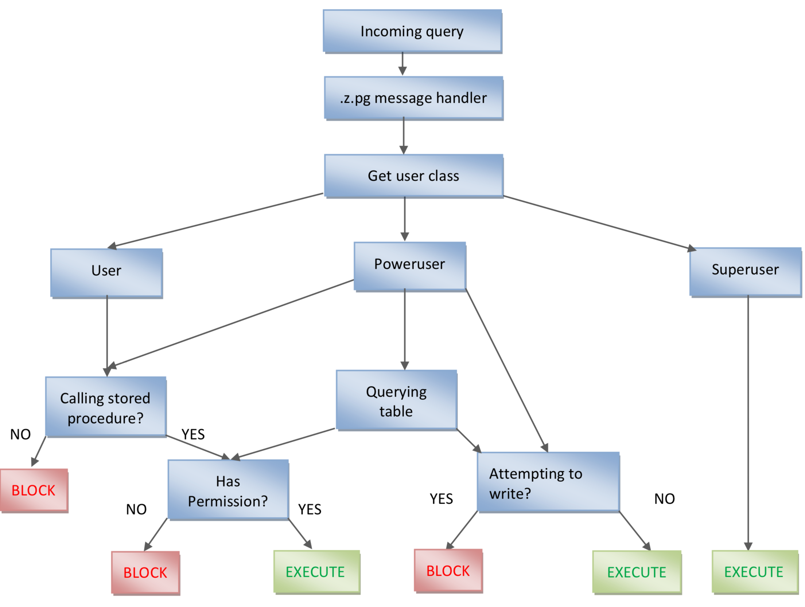
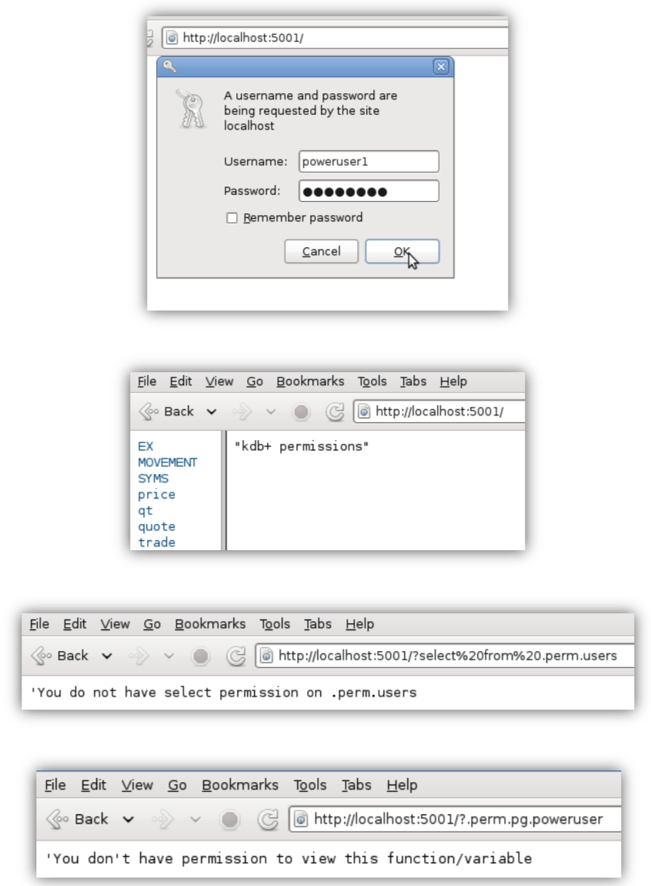

White paper
{: #wp-brand}

# Permissions with kdb+

by [Tom Martin](#author)
{: .wp-author}


Due to its efficiency in storing and retrieving large volumes of data, kdb+ is the data-storage technology of choice for many financial institutions. Kdb+ processes thus often contain sensitive, proprietary information in the form of data or proprietary code and so it is important to restrict who can and cannot access this information. Kdb+ offers a number of in-built access functions, though in a default kdb+ instance these are not activated. This paper discusses various methods in which a permissioning and entitlements system can be implemented in kdb+ by extending these in-built functions, allowing access to sensitive information to be controlled and restricted, exposing data to some clients but not to others.

!!! tip "Commercial-grade products"

    KX offers [commercial-grade products](../../devtools.md) to manage entitlements as well as other aspects of administration for kdb+. While this paper attempts to shed some light on the various approaches available to developers wishing to implement a permissioning system in kdb+, the approach presented here is merely intended as a starting point, and as such it should not be considered secure. Some workarounds to the system described here are discussed in the paper.

Tests performed using kdb+ 3.0 (2013.04.05)


## Restricting access to a kdb+ server

The first step in securing and permissioning a kdb+ server is to control who can and cannot connect to it. This is done using a combination of:

-   The `–u` command-line option
-   The `.z.pw` callback


### `–u` command-line option

If specified, the [`–u` command-line option](../../basics/cmdline.md#-u-usr-pwd-local) is the first check a kdb+ process will make when a user tries to connect. At startup, the `–u` option should point to a password file which maps usernames to passwords. The passwords can be stored either as plaintext or as an MD5 hash. When given a string, the `md5` keyword in kdb+ returns the hash of that string; when storing this value in the password file, the first two characters should be stripped. For example, the following two password files are equivalent:

```bash
$ cat users
user1:password
$ cat users_encrypted 
user1:5f4dcc3b5aa765d61d8327deb882cf99
```
```q
q)md5 "password"
0x5f4dcc3b5aa765d61d8327deb882cf99
```

When kdb+ is started with the `–u` option, any connecting user must specify a username and a password. If these do not match what is in the password file, then the user will not be allowed to access the server.

After the user successfully gains access to the process, the `–u` option implements further restrictions: the user can only access files that are under the root directory of kdb+ server i.e. the directory in which the server was
started. Consider the following directory structure:

```txt
|-- file1.q
`-- start_dir
    `-- file2.q
```

If we start the server in the `start_dir` directory and the `–u` option is specified, connecting clients will have access to `file2.q`, since it is under the root directory, but `file1.q` will be restricted. If `–U` is used in place of `–u`, the username/password check remains but the filesystem restriction is lifted.

Server1 (`-u`):

```bash
$ q -p 5001 -u ../passwordfiles/users_encrypted
KDB+ 3.0 2013.04.05 Copyright (C) 1993-2013 Kx Systems
l32/ 1()core 502MB tommartin debian-image 127.0.1.1 PLAY 2013.07.04
```

Server2 (`-U`):

```bash
$ q -p 6001 -U ../passwordfiles/users_encrypted
KDB+ 3.0 2013.04.05 Copyright (C) 1993-2013 Kx Systems
l32/ 1()core 502MB tommartin debian-image 127.0.1.1 PLAY 2013.07.04
```

Client:

```q
q)h:hopen`:localhost:5001
'access 
q)h:hopen`:localhost:5001:user1:pwd 
'access

q)//connect to the server which has filesystem restrictions 
q)h:hopen`:localhost:5001:user1:password
q)//file2.q loads successfully as it’s under the root 
q)h(system;”l file2.q”)
q)//file1.q produces an 'access error
q)h(system;”l ../file1.q”)
'access

q)//connect to server with no filesystem restrictions 
q)h:hopen`:localhost:6001:user1:password
q)//file1.q loads successfully
q)h(system;”l ../file1.q”)
```


### `.z.pw`

The [`.z.pw` callback](../../ref/dotz.md#zpw-validate-user) is called immediately after successful `–u`/`-U` authentication (if specified at startup – otherwise `.z.pw` is the first authentication check done by a kdb+ process). It allows for further customizations of the authentication process. For instance, this callback could be used to call out to an external LDAP server against which a connecting user could be validated. Kdb+ can also be integrated with Kerberos, but this is outside the scope of this paper. The `.z.pw` callback takes two arguments – a username and a password. If the validation check passes, `1b` is returned and the user is granted access. Otherwise, `0b` is returned and access to the server is denied.

In an unrestricted process, this callback will always return `1b`.

```q
.z.pw:{[u;p] 1b}
```

Rather than using `-u` with a password file, we could instead maintain a table of users on our kdb+ server and use the `.z.pw` callback to validate connecting clients.

First, define a simple table which stores users and their passwords.

```q
.perm.users:([user:`$()] password:())
```

Passwords can be stored in various ways, including plaintext, as a straight MD5 hash, or as an MD5 hash with added salt. For salt, we could just take a combination of the username and the specified password, apply an MD5 hash to it and use that as the stored password.

```q
q).perm.toString:{[x] $[10h=abs type x;x;string x]} 
q).perm.encrypt:{[u;p] md5 raze .perm.toString p,u} 
q).perm.add:{[u;p] `.perm.users upsert (u;.perm.encrypt[u;p]);}
q).perm.add[;`password] each `user1`user2`user3; 
q).perm.users
user | password
-----| ---------------------------------- 
user1| 0x9022daebd17737ba0bd9cd4732ea66b6 
user2| 0x6538d48739b8cb51beca1c7f65152d7f 
user3| 0xa757abc2c49f29cfd98bd5480b6fcdde
```

Inside the `.z.pw` callback, we add some logic that does a lookup on the users table and retrieves the password. It compares the stored password with the password supplied by the client and grants access if they match.

```bash
.z.pw:{[user;pwd] 
  $[.perm.encrypt[user;pwd]~.perm.users[user][`password];1b;0b]}
```


## User classes

Restricting access is only the first step towards implementing a permissioning system in kdb+. Once a user has connected, we can control and restrict what the user can do. To achieve this, we split users into three distinct user classes:

-   **Users** can only execute certain stored procedures that are defined on the server.
-   **Powerusers** have more privileges than ordinary users. They can write free-form queries, but cannot write to the database unless they are executing a stored procedure.
-   **Superusers** can execute any code they wish.

While queries can be executed synchronously (where the client expects a response and blocks until it receives one) or asynchronously (client expects no response), for the purposes of this paper we will restrict asynchronous queries (routed through the [`.z.ps` handler](../../ref/dotz.md#zps-set)) to superusers and instead focus on synchronous queries (routed through [`.z.pg`](../../ref/dotz.md#zpg-get)).

  
<small>_Permissioning system schematic_</small>

With this in mind, we re-define the users table to have an extra `class` column which indicates which class a user belongs to.

```q
q).perm.users:([user:`$()] class:`$(); password:()) 
q).perm.add:{[u;c;p] `.perm.users upsert (u;c;.perm.encrypt [u;p]);} 
q).perm.addUser:{[u;p] .perm.add[u;`user;p]} 
q).perm.addPoweruser:{[u;p] .perm.add[u;`poweruser;p]} 
q).perm.addSuperuser:{[u;p] .perm.add[u;`superuser;p]} 
q).perm.getClass:{[u] .perm.users[u][`class]}
q).perm.isSU:{[u] `superuser~.perm.getClass[u]}
q).perm.isPU:{[u] `poweruser~.perm.getClass[u]}
q).perm.addUser[`user1;`password] 
q).perm.addPoweruser[`poweruser1;`password] 
q).perm.addSuperuser[`superuser1;`password] 
q).perm.users
user      | class     password
----------| --------------------------------------------
user1     | user      0x9022daebd17737ba0bd9cd4732ea66b6
poweruser1| poweruser 0x1e948f5d3b634d15d91cfbaaa955e399
superuser1| superuser 0x9f233f505811d3fbdb2ee7a9bf5aa581
```

Having granted access to a user, we override the synchronous message handler `.z.pg` in order to determine what class the user belongs to and then act accordingly.

```q
.z.pg:{[query]
  user:.z.u;
  class:.perm.getClass[user];
  $[class~`superuser; value query;
    class~`poweruser; .perm.pg.poweruser[user;query]; 
    .perm.pg.user[user;query]] }
```


### Superusers

The most straightforward queries to validate are those pertaining to superusers. Since these users can execute any kind of query, no additional logic is required and we can simply evaluate the query. For the other two classes, we need to add logic to validate the query and if necessary, block it.


### Users

For users belonging to the ordinary-user class, the validation logic is relatively straightforward. Since these users can only execute predefined stored procedures, it is easy to identify when these users have attempted a restricted query. First, we define a stored procedure wrapper function, the arguments of which will be the stored procedure name and the arguments to pass it. Using a wrapper function provides a single point of entry for ordinary users and simplifies the validation logic. We also define a dictionary that maps stored-procedure names to the users who have permission to execute them. The wrapper function will do a lookup against this dictionary to see if the stored procedure exists and if the user has the necessary entitlements to execute the stored procedure.

```q
.perm.sprocs:()!()
.perm.addSproc:{[s] .perm.sprocs,:enlist[s]!enlist enlist`} 
.perm.grantSproc:{[s;u] @[`.perm.sprocs;s;union;u];} 
.perm.revokeSproc:{[s;u] @[`.perm.sprocs;s;except;u];} 
.perm.parse:{[x] if[-10h=type x;x:enlist x]; $[10h=type x;parse x; x]}

//Stored procedure wrapper function - Single point of entry
.perm.executeSproc:{[s;params]
  user:.z.u;
  if[not s in key .perm.sprocs;'string[s]," is not a valid stored procedure"];
  if[(not .perm.isSU user) and not user in .perm.sprocs[s];
    '"You do not have permission to execute this stored procedure"];
  f:$[1=count (value value s)[1];@;.];
  f[s;params] }
```

The validation logic is thus reduced to checking whether or not the user is calling the wrapper function.

```q
.perm.pg.user:{[user;query]
    em:"You only have permission to execute stored procedures: ";
    em,:".perm.executeSproc[sprocName;(list;of;params)]";
  if[not ".perm.executeSproc"~.perm.toString first .perm.parse query;'em;value query}
```

As a demonstration, we will define and register a stored procedure on a server and try to execute it from a client process.

Server:

```q
getVWAP:{[s;ivl] select 
  vwap:size wavg price by sym, 
  bucket:ivl xbar time.minute 
  from trade where sym in s }
```
```q
q).perm.addSproc[`getVWAP]
q)//Sproc is registered, but no users have permission to execute it 
q).perm.sprocs
getVWAP|
```

Client:

```q
q)h:hopen`:localhost:5001:user1:password
q)//try to execute a raw query
q)h"select count i by sym from trade"
'You only have permission to execute stored procedures: .perm.executeSproc[sprocName;(list;of;params)]
q)//try to execute a sproc that does not exist 
q)h".perm.executeSproc[`getVWAPP;(`AAPL;5)]" 
'getVWAPP is not a valid stored procedure
```

At this stage, the stored procedure exists on the server, but no users have permission to execute it. We grant permission to `user1` on the server side:

Server:

```q
q).perm.grantSproc[`getVWAP;`user1]
```

On the client side, `user1` can execute the stored procedure successfully:

Client:

```q
q)h".perm.executeSproc[`getVWAP;(`AAPL;5)]" 
sym  bucket| vwap
-----------| --------
AAPL 09:00 | 440.8216
AAPL 09:05 | 440.8516
AAPL 09:10 | 440.9229
AAPL 09:15 | 440.9324
AAPL 09:20 | 440.9074
AAPL 09:25 | 440.8243
AAPL 09:30 | 440.7459
AAPL 09:35 | 440.6386
AAPL 09:40 | 440.6522
AAPL 09:45 | 440.5254
..
```


### Powerusers

While the user and superuser classes have relatively simple validation logic, the poweruser class is slightly more complex. Like ordinary users, powerusers have the ability to execute stored procedures. They can also write raw, freeform queries, but we will add some additional logic here to enforce table- specific permissions, meaning a poweruser may be able to select from table A, but not from table B etc. Finally, we will enforce read-only entitlements on all powerusers.


<!-- #### Classifying incoming queries -->

In order to properly enforce these restrictions, we need to parse and classify every query a poweruser attempts to execute. For the purposes of this paper, we will restrict this to classifying the various table operations (`select`, `delete`, `insert`, `update` and `upsert`), though a fully-functional permissioning system would expand this to classify every type of query.

The `parse` keyword in q can be used to generate a parse tree from a string query, allowing you to see its functional form. We use this to classify each type of query. For example, consider the following select statement.

```q
 select 
   open:first price, 
   high:max price, 
   low:min price, 
   close:last price 
   by sym from trade where date=2013.05.15
```

We can wrap this in a string and then parse it to see its functional
form

```q
q)parse"select open:first price,high:max price,low:min price,close:last price by sym from trade where date=2013.05.15"
?
`trade
,,(=;`date;2013.05.15)
(,`sym)!,`sym
`open`high`low`close!((*:;`price);(max;`price);(min;`price);(last;`pri ce))
```

Generally we could classify a select statement by saying:

1.  It has 5 items
2.  The first item is `?`

However, there are optional 5th and 6th arguments to a functional select statement. The fifth argument is used to select the first or last rows from a table, while the 6th argument allows you to extract rows from the table based on indexes.

Our classification function for select statements is:

```q
.perm.is.select:{[x] (count[x] in 5 6 7) and (?)~first x}
```

We make no distinction between `select` statements and `exec` statements. This function will return `1b` for both.

```q
q)s: " open:first price, high:max price, low:min price, close:last price"
q)s,: " by sym from trade where date=2013.05.15"
q).perm.is.select parse "select",s
1b
q).perm.is.select parse "exec",s
1b
q).perm.is.select parse "update price+10 from trade" 
0b
```

While this logic successfully identifies any select statements, it’s also possible to view a table by simply typing its name. To incorporate this into our classification function, we first need to write some helper functions which will return a list of every table defined in a kdb+ session.

```q
//identify whether a variable name is a namespace
.perm.isNamespace:{[x] 
  if[-11h~type x;x:value x]; 
  if[not 99h~type x;:0b];
  (1#x)~enlist[`]!enlist(::) }

//Recursively retrieve a list of every table in a namespace
.perm.nsTables:{[ns]
  if[ns~`.;:system"a ."];
  if[not .perm.isNamespace[ns];:()];
  raze(` sv' ns,/:system"a ",string ns),.z.s'[` sv' ns,/:system"v ",string ns] }

//Get a list of every table in every namespace
.perm.allTables:{[] raze .perm.nsTables each `$".",/:string each `,key[`]}
```

```q
q).perm.allTables[]
,`.o.TI
q)t:([]a:1 2 3)
q).perm.allTables[]
`t`.o.TI
q).a.t:([]a:1 2 3)
q).perm.allTables[]
`t`.o.TI`.a.t
```

Our select statement classification thus becomes:

```q
.perm.is.select:{[x] 
  (any x~/: .perm.allTables[]) 
  or (count[x] in 5 6 7) and (?)~first x }
```

Expanding this to classify all table operations:

```q
.perm.is.select:{[x] 
  (any x~/: .perm.allTables[]) 
  or (count[x] in 5 6 7) and (?)~first x }
.perm.is.update:{[x] (5=count x) and ((!)~first x) and 99h=type last x}
.perm.is.delete:{[x] (5=count x) and ((!)~first x) and 11h=type last x}
.perm.is.insert:{[x] (insert)~first x} 
.perm.is.upsert:{[x] (.[;();,;])~first x}
```

We also define two utility functions which indicate whether an incoming query is a table operation, and what type of table operation it is:

```q
.perm.isTableQuery:{[x] any (value each `.perm.is,/:1_key[.perm.is])@\:x}

.perm.getQueryType:{[x]
  f:`.perm.is,/:g:1_key[.perm.is];
  first g where ((value each f)@\:x) }
```

```q
q).perm.getQueryType parse"select from trade"
`select
q).perm.getQueryType parse"update price:price%10 from trade" 
`update
q).perm.getQueryType parse"delete from trade where size=0" 
`delete
q).perm.getQueryType parse"`trade upsert (.z.t;`AAPL;440.1234;500000;`NYSE)"
`upsert
q).perm.getQueryType parse"`trade insert (.z.t;`AAPL;440.1234;500000;`NYSE)"
`insert
```

Now that the logic is in place to classify incoming table operations, we can add functionality to our permissioning system which allows us to grant table-specific and operation-specific entitlements to users. We maintain a table of table names and the types of operations each user is allowed to execute on that table.

```q
.perm.tables:([]table:`$();user:`$();permission:`$()) 
.perm.queries:`select`update`upsert`insert`delete;

.perm.grant:{[t;u;p] 
  if[not p in .perm.queries;'"Not a valid table operation"]; 
  `.perm.tables insert (t;u;p); }

.perm.revoke:{[t;u;p] 
  delete from `.perm.tables where table=t,user=u,permission=p; }

.perm.grantAll:{[t;u] 
  .perm.grant[t;u;] each .perm.queries; }

.perm.getUserPerms:{[t;u] 
  exec distinct permission from .perm.tables where table=t, user=u }
```

Then for our validation logic, we identify which table is being queried and what type of operation is being executed. We do a lookup on our permissions table to see if the user is allowed to attempt this particular operation on this particular table and if not we block the query.

```q
.perm.validateTableQuery:{[user;query]
table:first $[-11h~type query;query;query 1];
  p:.perm.getUserPerms[table;user];
  qt:.perm.getQueryType[query];
  if[not qt in p;'"You do not have ",string[qt]," permission on ",string[table]];
  eval query }
```

Our poweruser validation function becomes:

```q
.perm.pg.poweruser:{[user;query] 
  if[".perm.executeSproc"~.perm.toString first .perm.parse query; 
    :value query];
  if[.perm.isTableQuery q:.perm.parse query; 
    :.perm.validateTableQuery[user;q]] }
```

Server:

```q
q).perm.grant[`quote;`poweruser1;`select] 
q).perm.grantAll[`trade;`poweruser1] 
q).perm.tables
table user permission 
---------------------------
quote poweruser1 select
trade poweruser1 select
trade poweruser1 update
trade poweruser1 upsert
trade poweruser1 insert
trade poweruser1 delete
```

Client:

```q
q)h:hopen`:localhost:5001:poweruser1:password 
q)h"select from .perm.users"
'You do not have select permission on .perm.users 
q)//type table name is equivalent to select 
q)h".perm.users"
'You do not have select permission on .perm.users 
q)1#h"select from quote"
time         sym  bid     ask      bsize  asize ex 
---------------------------------------------------- 
09:00:00.863 AMZN 259.455 259.4499 100000 90000 NYSE 
q)1#h"quote"
time         sym  bid     ask      bsize  asize ex 
---------------------------------------------------- 
09:00:00.863 AMZN 259.455 259.4499 100000 90000 NYSE 
q)h"update mid:(bid+ask)%2 from quote"
'You do not have update permission on quote 
q)1#h"update vwap:size wavg price by sym from trade" 
time         sym  price    size   ex   vwap 
----------------------------------------------- 
09:00:05.878 GOOG 875.2613 190000 BATS 876.9627
```

:fontawesome-regular-hand-point-right:
Reference: [`reval`](../../ref/eval.md#reval) for read-only access

<!-- 
#### Read-only access

The standard way to prevent clients from writing to a kdb+ process is to start the process with the [`–b` command-line option](../../basics/cmdline.md#-b-blocked). While this will successfully restrict clients to read-only queries, it affects all clients equally: write access will be revoked from every single client who connects to the process. If we want to be more selective in to whom we do and do not grant write access, we have to take a different approach.

One such approach would be to parse every single incoming query and implement some logic that will determine if the query is attempting to write to the process. This is a very complex approach that would involve recursively stepping through the parse tree to analyse if a variable is being updated.

Instead, we will take advantage of a restriction that is built into kdb+ processes that are started with secondary threads: that is, only the main thread in a kdb+ process can update global variables. Secondary threads are restricted to updating local variables only. Thus, if we want to revoke write access from particular users, all we need to do is start our process with some secondary threads and then encapsulate their queries inside a function which then uses [`peach`](../../ref/each.md) to iterate over a list, forcing kdb+ to use secondary threads.

If `peach` is used with a one-item list, by default it will use the main thread. To force kdb+ to use its secondary threads, we have to iterate over at least two items, but we don’t want to have to execute each incoming query twice. To avoid this, we’ll iterate over a two-item boolean list where the first item is true and the second false. We use the items in this list to determine whether or not the query will be executed.

```q
.perm.readOnly:{[x]
  res:first {[q;exe] $[exe;@[value;q;{(`error;x)}]; ()]}[x;] peach 10b; 
  if[(2=count res) and `error~first res;
     $[last[res]~"noupdate";'"You do not have write access";'last res]]; 
  res }
```

We can now add this extra check to our poweruser validation function:

```q
.perm.pg.poweruser:{[user;query] 
  if[".perm.executeSproc"~.perm.toString first .perm.parse query; 
     :value query];
  if[.perm.isTableQuery q:.perm.parse[query];
     :.perm.readOnly .perm.validateTableQuery[user;q]]; 
  .perm.readOnly query }
```

And also to the function that verifies table operations:

```q
.perm.validateTableQuery:{[user;query]
  table:first $[-11h~type query;query;query 1];
  p:.perm.getUserPerms[table;user];
  qt:.perm.getQueryType[query];
  if[not qt in p;'"You do not have ",string[qt]," permission on ",string[table]];
  .perm.readOnly[(eval;query)] }
```

Server – start with secondary threads:

```bash
$ q permissions.q -p 5001 –s 1
KDB+ 3.0 2013.04.05 Copyright (C) 1993-2013 Kx Systems
l32/ 1()core 502MB tommartin debian-image 127.0.1.1 PLAY 2013.07.04
```

Client:

```q
q)h:hopen`:localhost:5001:poweruser1:password 
q)h"a:1"
'You do not have write access
q)h"`a set 1"
'You do not have write access
q)h"{`a set 1}[`]"
'You do not have write access
```

 -->

## Protecting proprietary code

Kdb+ processes often contain a large amount of proprietary code that is exposed to all users that connect to it. Simply typing the name of a function will display its definition. Q scripts can be compiled into binary objects using the [`\_ scriptname.q` system command](../../basics/syscmds.md#_-hide-q-code). This creates the file `scriptname.q_`. When this file is loaded into a q session, all code contained in the script is obscured. However like using the `–b` option to enforce write-only access, this solution hides the function definitions from every single user. Instead, we might prefer to be selective in who can and cannot see the definition of particular functions.

On the kdb+ server, we maintain a list of functions/variables which we wish to obscure. To prevent users from seeing their definition, we must first analyze the various ways in which the definition of a function can be displayed in a kdb+ process.

1)  Typing the name of the function

```q
q)getVWAP
{[s;ivl] select vwap:size wavg price by sym, bucket:ivl xbar time.minute from trade where sym in s}
```

2)  Using the `value` keyword on a function passed by reference

```q
q)value `getVWAP
{[s;ivl] select vwap:size wavg price by sym, bucket:ivl xbar time.minute from trade where sym in s}
```

3)  Using the `value` keyword on a function passed explicitly

```q
q)value getVWAP
0xa0a1a281a30a040005
`s`ivl
`symbol$()
``trade
(,`vwap)!,(wavg;`size;`price)
`sym`bucket!(`sym;(k){x*y div x:$[16h=abs[@x];"j"$x;x]};`ivl;`time.minute))
,(in;`sym;`s)
?
"{[s;ivl] select vwap:size wavg price by sym, bucket:ivl xbar time.minute from trade where sym in s}"
```

4)  Using the `value` keyword twice on a function passed by reference

```q
q)value value `getVWAP
0xa0a1a281a30a040005
`s`ivl
`symbol$()
``trade
(,`vwap)!,(wavg;`size;`price)
`sym`bucket!(`sym;(k){x*y div x:$[16h=abs[@x];"j"$x;x]};`ivl;`time.minute))
,(in;`sym;`s)
?
"{[s;ivl] select vwap:size wavg price by sym, bucket:ivl xbar time.minute from trade where sym in s}"
```

This is by no means an exhaustive list. For instance, (4) above could also be achieved using the following:

```q
q){@[value;x]}/[2;`getVWAP]
```

However, for the purposes of the paper we will just use the four means described above. We then define the following which allow us to determine if a client is attempting to view restricted code:

```q
.perm.hiddenFuncs:(); 
.perm.hideFunction:{`.perm.hiddenFuncs?x;} 

.perm.hidden:{[query]
  vv:{(x;(value;x); (value;enlist x); (value;(value;enlist x)))} 
  if[any .perm.parse[query] ~/: raze vv each .perm.hiddenFuncs;
    '"You don't have permission to view this function/variable"] }
```

It would be beneficial to hide entire namespaces from clients. For instance, all of our validation logic is stored in the `.perm` namespace, and this is certainly something we would want to hide from clients.

```q
//Get all variables in a namespace
.perm.nsFuncs:{[ns]
  if[ns~`.;:system"f ."];
  if[not .perm.isNamespace[ns];:()];
  raze(` sv' ns,/:system"f ",string ns),.z.s'[` sv' ns,/:system"v ",string ns] }

.perm.hideNamespace:{[ns].perm.hideFunction each ns,.perm.nsFuncs[ns]}
```

We can add this additional check to our poweruser validation function:

```q
.perm.pg.poweruser:{[user;query] 
  if[".perm.executeSproc"~.perm.toString first .perm.parse query;
    :value query]; 
  if[.perm.isTableQuery q:.perm.parse[query];
    :.perm.validateTableQuery[user;q]]; 
  .perm.hidden query;
  .perm.readOnly query }
```

Server:

```q
q).perm.hideNamespace[`.perm]
q).perm.hideFunction[`getVWAP]
```

Client:

```q
q)h".perm.addUser"
'You don't have permission to view this function/variable 
q)h".perm.pg.poweruser"
'You don't have permission to view this function/variable
q)h"getVWAP"
'You don't have permission to view this function/variable
q)h"getOHLC"
{[s] select open:first price, high:max price, low:min price, close:last price by sym from trade where sym in s}
```


## Code injection

While the approach presented in this paper so far has outlined various methods of restricting users from executing particular queries, it is not immune to circumvention. By formatting queries in certain ways, a user can bypass the parsing logic to execute a query that they do not have permission to execute. One such method would be to add a leading semi-colon to the query.

```q
q)h"select from .perm.users"
'You do not have select permission on .perm.users 
q)h";select from .perm.users"
user      | class     password
----------| --------------------------------------------
user1     | user      0x9022daebd17737ba0bd9cd4732ea66b6
poweruser1| poweruser 0x1e948f5d3b634d15d91cfbaaa955e399
superuser1| superuser 0x9f233f505811d3fbdb2ee7a9bf5aa581
```

Parsing this query can shed some light on how it can be blocked:

```q
q)parse";select from .perm.users"
";"
::
(?;`.perm.users;();0b;())
q)parse";;;;select from .perm.users"
";"
::
::
::
::
(?;`.perm.users;();0b;())
```

To stop this form of injection, we can block any queries whose parse
tree contains the generic null `(::)`.

```q
.perm.blockInjection:{[query] 
  if[any (::)~/:.perm.parse query;
    '"Invalid Query"] }
```

We add this function to our poweruser validation function:

```q
.perm.pg.poweruser:{[user;query] 
  if[".perm.executeSproc"~.perm.toString first .perm.parse query;
    :value query]; 
  if[.perm.isTableQuery q:.perm.parse[query];
    :.perm.validateTableQuery[user;q]]; 
  .perm.hidden query;
  .perm.blockInjection query;
  .perm.readOnly query }
```

On the client, attempts to circumvent the restrictions are blocked.

```q
q)h".perm.users"
'You do not have select permission on .perm.users 
q)h";.perm.users"
'Invalid Query 
q)h";;;;;;;;;;;;;;;;;;;;;;;;;;;;;;;.perm.users" 
'Invalid Query
```

This has the knock-on effect of blocking all niladic functions that are called with the form `function[]`. As a workaround, functions that need no arguments should be called as ``function[`]``.

Another potential backdoor is the stored-procedure wrapper function. Since we allow write access when executing stored procedures, users can use code injection to update global variables on the server. For instance, instead of calling

```q
h".perm.executeSproc[`getVWAP;(`AAPL;5)]"
```

`user1` could instead call

```q
h".perm.executeSproc[[.perm.addSuperuser[`user1;`password];`getVWAP];(`AAPL;5)]"
```

`user1` has thus become a superuser and now has the ability to execute anything on the server.

```q
q)h"delete from `trade"
'You can only execute stored procedures:.perm.executeSproc[sp;(x;y;z)]
q)h".perm.executeSproc[[.perm.addSuperuser[`user1;`password];`getVWAP] ;(`AAPL;5)]"
sym  bucket| vwap
-----------| --------
AAPL 09:00 | 440.8216
AAPL 09:05 | 440.8516
AAPL 09:10 | 440.9229
AAPL 09:15 | 440.9324
AAPL 09:20 | 440.9074
AAPL 09:25 | 440.8243
..
q)h"delete from `trade"
`trade
q)h"trade"
time sym price size ex
----------------------
```

The solution is to analyze the arguments the user is passing to `.perm.executeSproc` and determine if the user is attempting to write to the process, and if so reject the query. To do this, we create a slightly modified version of `.perm.readOnly` which suppresses all errors except for the noupdate error (i.e. the error that is signalled when attempting to writing to the process).

```q
.perm.readOnlyNoError:{[x]
  res:first{[q;exe]$[exe;@[value;q;{(`error;x)}];()]}[x;]peach 10b;
  if[(2=count res) and `error~first res;
    if[last[res]~"noupdate";'"You do not have write access"]] }
```

Our validation functions then become

```q
.perm.pg.user:{[user;query]
  if[not".perm.executeSproc"~.perm.toString first q:.perm.parse query;
    '"You can only execute stored procedures:.perm.executeSproc[sp;(x;y;z)]"];
  .perm.readOnlyNoError'[(eval;)each 1_q]; 
  value query }

.perm.pg.poweruser:{[user;query] 
  if[".perm.executeSproc"~.perm.toString first q:.perm.parse query;
    .perm.readOnlyNoError'[(eval;)each 1_q];
    :value query];
  if[.perm.isTableQuery q;
    :.perm.validateTableQuery[user;q]]; 
  .perm.hidden query;
  .perm.blockInjection query;
  .perm.readOnly query }
```

The attempt to elevate permissions is now blocked.

```q
q)h".perm.executeSproc[`getVWAP;(`AAPL;5)]" 
sym  bucket| vwap
-----------| --------
AAPL 09:00 | 440.8216
AAPL 09:05 | 440.8516
AAPL 09:10 | 440.9229
AAPL 09:15 | 440.9324
AAPL 09:20 | 440.9074
AAPL 09:25 | 440.8243
..
q)h".perm.executeSproc[[.perm.addSuperuser[`user1;`password];`getVWAP] ;(`AAPL;5)]"
'You do not have write access
```


## Restricting HTTP queries

So far, this paper has just discussed how to restrict and control access from a client process that connects via IPC. However, it is also possible to connect to a kdb+ process via HTTP. While the `.z.pw` callback works equally for both IPC and HTTP connections, HTTP queries are not routed through the `.z.pg` message handler. Rather, they are handled by [`.z.ph`](../../ref/dotz.md#zph-http-get). As defined in `q.k`, `.z.ph` is responsible for composing the HTML webpage, executing the query, and formatting the results into a HTML table.

`q.k` definition:

```k
k).z.ph:{x:uh$[@x;x;*x];$[~#x;hy[`htm]fram[$.z.f;x]("?";"?",*x:$."\\v" ); 
 x~,"?";hp@{hb["?",x]x}'$."\\v";"?["~2#x;hp jx["J"$2_x]R "?"=*x;@[{hp jx[0]
 R::1_x};x;he];"?"in x;@[{hy[t]@`/:tx[t:`$- 3#n#x]@.(1+n:x?"?")_x};x;he] 
 #r:@[1::;`$":",p:HOME,"/",x;""];hy[`$(1+x?".")_x]"c"$r;hn["404 Not Found";`txt]
 p,": not found"]}
```

Translated to q:

```q
.z.ph:{[x]
  x:.h.uh $[type x;x;first x];
  $[not count x;  //1
      .h.hy[`htm;.h.fram[string .z.f;x;("?";"?",first x:string system"v")]];
    x~enlist "?"; //2
      .h.hp[{.h.hb["?",x; x]}each string system"v"];
    "?["~2#x;      //3
      .h.hp[.h.jx["J"$2_x; .h.R]];
    "?"=first x; //4 
      @[{.h.hp[.h.jx[0;.h.R::1_x]]};x;.h.he];
    "?" in x;      //5
      @[{.h.ht[t;] ` sv .h.tx[t:`$-3#n#x;value (1+n:x?"?")_x]};x;.h.he];
    count r:@[1:;`$":",p:.h.HOME,"/",x;""]; //6
      .h.hy[`$(1+x?".")_x; "c"$r];
    .h.hn["404 Not Found";`txt;p,": not found"]] //7 }
```

`.z.ph` consists of seven branches, each of which is numbered above. We will focus mostly on branches 1 and 4. Branch 1 is responsible for composing the HTML page, populating the left-hand pane with a list of all variables in the root namespace. It then executes the first of these variables. In an unprotected kdb+ process, there is no problem with this, since every user has access to every variable. In a permissioned system however, the user may not have permission to view this variable. Rather than having an error display each time the user accesses the URL, we can instead define a specific variable that is loaded when the URL is accessed and which all users will be able to view.

```q
.perm.h.open:”kdb+ permissions”
```

Branch 1 then changes from this:

```q
.h.hy[`htm;.h.fram[string .z.f;x;("?";"?",first x:string system"v")]];
```

To this:

```q
.h.hy[`htm;.h.fram[string .z.f;x;("?";"?.perm.h.open")]];
```

Branch 4 is responsible for handling incoming queries (anything beginning with `?`). Inside this branch, the function [`.h.jx`](../../ref/doth.md#hjx-table) is called. This is responsible for executing the incoming query.

```q
q).h.jx
k){[j;x]x:. x;$[$[.Q.qt[x];(N:(*."\\C")-4)<n:#x;0];
 (" "/:ha'["?[",/:$(0;0|j-N),|&\(n- N;j+N);
 $`home`up`down`end],,($n),"[",($j),"]";"");()],hc'.Q.S[."\\C";j ]x}
```

The very first statement in `.h.jx` is `x:. x`, which is the k-equivalent of `x:value x` . To restrict the execution of queries that come into the process via HTTP, it is just a matter of replicating in `.h.jx` the logic we previously inserted into `.z.pg`. We define a new function, `.h.jx2`, which takes two additional arguments: user and class. We add our validation from `.z.pg` here, including the override for `.perm.h.open`.

```k
k).h.jx2:{[j;x;u;c] 
 x: $[(c=`superuser)|x~”.perm.h.open”;c=`poweruser; .perm.pg.poweruser[u;x] ; .perm.pg.user[u;x]];
 $[$[.Q.qt[x];(N:(*."\\C")-4)<n:#x;0];
  (" "/:.h.ha'[
    "?[",/:$(0;0|j- N),|&\(n- N;j+N);$`home`up`down`end], ,($n),"[",($j),"]";"");
    ()],
   .h.hc'.Q.S[."\\C ";j]x}
```

In `.z.ph` we then replace any references to `.h.jx` with `.h.jx2`, adding in our extract user and class arguments.

```q
.z.ph:{[x]
  .perm.h.user:.z.u;
  .perm.h.open:”kdb+ permissions”; 
  .perm.h.class: .perm.getClass[.perm.h.user]; 
  x:.h.uh $[type x;x;first x];
  $[not count x; //1
      .h.hy[`htm;.h.fram[string .z.f;x;("?";"?.perm.h.open")]];
    x~enlist "?";  //2
      .h.hp[{.h.hb["?",x; x]}each string system"v"]; 
    "?["~2#x; //3
      .h.hp[.h.jx2["J"$2_x; .h.R; .perm.h.user;.perm.h.class]]; 
    "?"=first x; //4
      @[{.h.hp[.h.jx2[0;.h.R::1_x;.perm.h.user;.perm.h.class]]};x;.h.he]; 
    "?" in x; //5
      @[{.h.ht[t;] ` sv .h.tx[t:`$-3#n#x;value (1+n:x?"?")_x]};x;.h.he];
    count r:@[1:;`$":",p:.h.HOME,"/",x;""]; //6 
      .h.hy[`$(1+x?".")_x; "c"$r];
    .h.hn["404 Not Found";`txt;p,": not found"]] //7 }
```

 


## Logging client activity

As stated previously, the restrictions described in this paper are not watertight. If so inclined, an industrious user could potentially find a workaround for the restrictions that have been imposed. The development of a permissioning system is a gradual process, with holes being patched as they are identified. To help with this process, all client activity on a kdb+ process should be logged so that if a user does manage to circumvent the system there will be a record of it.

There are two separate logs we wish to maintain:

-   Access – who accessed the system?
-   Query – what commands did they execute?

To store this information, we need to define two new tables.

```q
.perm.queryLog:([]
  time:`timestamp$();
  handle:`int$();
  user:`$();
  class:`$();
  hostname:`$();
  ip:`$();
  query:();
  valid:`boolean$();
  error:() )

.perm.accessLog:([]
  time:`timestamp$();
  handle:`int$();
  user:`$();
  class:`$();
  hostname:`$();
  ip:`$();
  state:`$();error:() )
```

`.perm.queryLog` 

: will keep a record of all queries entered on the system, including when they were executed, who executed them, whether they were valid queries and if not, why they failed.

`.perm.accessLog`

: keeps a record of all attempts to access the server. 

We then define some utility functions that will help populate the tables.

```q
.perm.getIP:{[] `$"."sv string `int$0x0 vs .z.a}

.perm.logQuery:{[q;valid;err]
  ip:.perm.getIP[];
  cls:.perm.getClass[.z.u];
  `.perm.queryLog insert (.z.P;.z.w;.z.u;cls;.z.h;ip;q;valid;enlist err) }

.perm.logValidQuery:{[q] .perm.logQuery[q;1b;""]} 
.perm.logInvalidQuery:{[q;err] .perm.logQuery[q;0b;err]}

.perm.logAccess:{[hdl;u;state;msg]
  ip:.perm.getIP[];
  cls:.perm.getClass[u];
  `.perm.accessLog insert (.z.P;hdl;u;cls;.z.h;ip;state;enlist msg) }

.perm.blockAccess:{[usr;msg].perm.logAccess[.z.w;usr;`block; msg]; 0b} 
.perm.grantAccess:{[usr] .perm.logAccess[.z.w;usr;`connect;""]; 1b}
```

Then it is just a matter of making some adjustments to our message handlers: `.z.pw`, `.z.pg`, and `.z.ph`.

For `.z.pw`, we want to log the cases where access has been denied. This happens if the requested username is not valid, or if the password supplied by the user does not match what is stored in the users table.

```q
.z.pw:{[user;pwd]
  $[not user in key .perm.users;
      .perm.blockAccess[user;"User does not exist"];
    not .perm.encrypt[user;pwd]~.perm.users[user][`password];
      .perm.blockAccess[user;"Password Authentication Failed"]; 
    .perm.grantAccess user] }
```


Client:

```q
q)h:hopen`:localhost:5001:POWERUSER1:password 
'access 
q)h:hopen`:localhost:5001:poweruser1:PASSWORD 
'access 
q)h:hopen`:localhost:5001:poweruser1:password
```

Server:

```q
q)select user,hostname,ip,state,error from .perm.accessLog
user       hostname     ip        state   error 
--------------------------------------------------------------------------
POWERUSER1 debian-image 127.0.0.1 block   "User does not exist"
POWERUSER1 debian-image 127.0.0.1 block   "User does not exist"
poweruser1 debian-image 127.0.0.1 block   "Password Authentication Failed" 
poweruser1 debian-image 127.0.0.1 block   "Password Authentication Failed"
poweruser1 debian-image 127.0.0.1 connect ""
```

!!! info "Retries"

    To resolve compatibility issues between the various versions, kdb+ attempts the IPC handshake twice if the authentication fails, so any errors will be duplicated in our logging table.

To log client queries, we need to make changes to `.z.pg` and `.z.ph`.
First, we rename `.z.pg` and `.z.ph` to `.perm.zpg` and `.perm.zph` respectively. We then use `.z.pg` and `.z.ph` as wrapper functions around our original handlers, allowing us to catch and log any errors.

```q
.z.pg:{[query] 
  res:@[.perm.zpg; query; {[x;y].perm.logInvalidQuery[x;y];'y}[query;]];
  .perm.logValidQuery query;
  res }
```

When a HTTP call results in an error, it doesn’t signal the error in the usual way, so we can’t use [protected evaluation](../../ref/apply.md#trap) to trap the error. Rather, it generates a HTTP response displaying the error.

```txt
HTTP/1.1 400 Bad Request
Content-Type: text/plain
Connection: close
Content-Length: N
'Error message
```

This means we can use pattern matching to identify when HTTP calls result in errors.

```q
.z.ph:{[query]
  res:.perm.zph query;
  if[res like "HTTP/1.1 400 Bad Request*";
    .perm.logInvalidQuery[1_first query;errMsg:5_"\r\n" vs res];
    :res];
  .perm.logValidQuery[1_first query];
  res }
```


Client:

```q
q)h:hopen`:localhost:5001:poweruser1:password 
q)h"select from .perm.users"
'You do not have select permission on .perm.users 
q)h"a:1"
'You do not have write access
q)h"select from trade"
'You do not have select permission on trade 
q)h"select from quote"
time         sym  bid      ask      bsize  asize  ex 
------------------------------------------------------ 
09:00:00.863 AMZN 266.0749 266.0697 100000 90000  NYSE 
09:00:02.416 MSFT 34.41319 34.41266 80000  80000  BATS 
09:00:03.440 AAPL 449.5043 449.4989 30000  110000 BATS 
09:00:03.959 MSFT 34.41286 34.41274 110000 110000 BATS 
09:00:04.340 AMZN 266.0636 266.0593 20000  150000 NYSE 
..
```

Server:

```q
q)select user,query,valid,error from .perm.queryLog 
user        query                    valid error
-------------------------------------------------------------------------- -------------------
poweruser1 "select from .perm.users" 0     "You do not have select permission on .perm.users"    
poweruser1 "a:1"                     0     "You do not have write access"
poweruser1 "select from trade"       0     "You do not have select permission on trade"    
poweruser1 "select from quote"       1     ""
```


## Conclusion

This paper was an introduction to permissioning in kdb+ without using LDAP or any other external entitlements system. As kdb+ is the market leader in the storage and retrieval of big data, it is the database technology of choice for the world’s top financial institutions and as such it is used to store sensitive, proprietary information. In order to pass a security audit, access to this data should be controlled and logged to ensure that only those who are entitled to view the information are able to do so.

We have described a number of methods of securing a kdb+ process. We examined the concept of splitting clients into separate groups or classes, each with different permission levels. We examined how to block write access on a kdb+ process, and how to restrict certain users from viewing proprietary code. While the system described in the paper offers a broad coverage, including blocking some forms of code injection, it is not intended to be complete.

While the approach outlined in this paper solely used q code to implement a permissioning system, there is scope to extend this to incorporate external protocols such as LDAP, Kerberos or Single Sign-On, allowing kdb+ to be fully integrated with a firm’s authentication infrastructure. One should also consider out-of-the-box solutions like [KX Control](../../devtools.md#kx-control) which, as well as handling permissioning, also delivers a well-defined framework for process workflow, scheduling, audit trails and system alerts.

[:fontawesome-solid-print: PDF](/download/wp/permissions_with_kdb.pdf)


## Author

**Tom Martin** is a senior kdb+ consultant for KX who has built kdb+ systems for some of the world’s leading financial institutions. Tom is currently based in London, where he works on FX auto-hedging and client algos at a top-tier investment bank.
&nbsp;
[:fontawesome-solid-envelope:](mailto:tmartin@kx.com?subject=White paper: Permissions with kdb+) 
&nbsp;
[:fontawesome-brands-linkedin:](https://www.linkedin.com/in/tom-martin-9ba96438/)
&nbsp;
[:fontawesome-brands-github:](https://github.com/t-martin)

