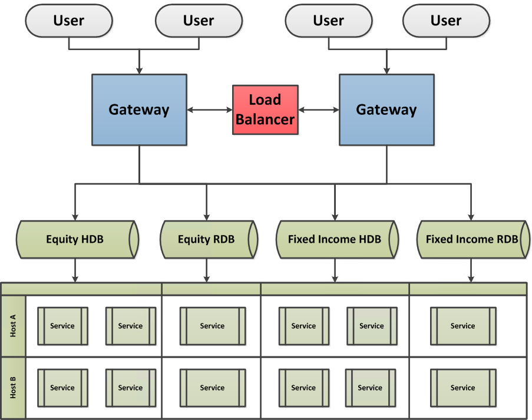
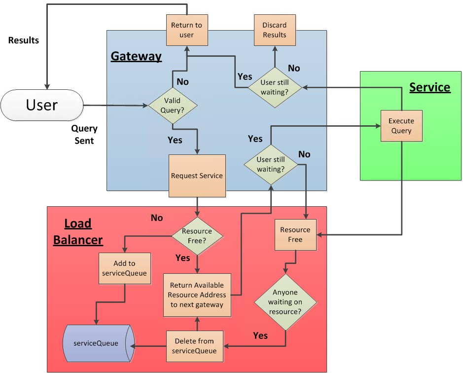

White paper
{: #wp-brand}

# Query Routing: A kdb+ framework for a scalable, load balanced system

by [Kevin Holsgrove](#author)
{: .wp-author}


Due to the large scale that kdb+ systems commonly grow to, it is
important to build solid foundations so that as the number of users
and size of databases increase, the system is able to easily absorb
the extra capacity.

Distributed kdb+ systems have been covered in a number of Kx Technical
White papers. The primary objective of this paper is to expand on
routing, query tagging and connectivity management of a large
distributing kdb+ system. The basic architecture used in this paper is
based heavily on the ideas discussed in another white paper:
[“Common design principles for kdb+ gateways”](../gateway-design/index.md).

It is recommended the reader understand these concepts before
progressing with this paper.

This paper focuses on the design principle of the Connection Manager
Load Balancer schematic whilst providing an asynchronous-only method
of communication between processes. In this paper, our Load Balancer
will also act as a Connection Manager with distributing access to all
services whilst minimizing the waiting time for gateways.

Traditional load-balancing techniques such as a straightforward
round-robin approach to resource allocation is an acceptable approach
for many systems, however it can result in several queries becoming
queued up behind a long-running query whilst other service resources
are idle. In this paper, the method used aims to be more efficient by
tagging user queries that enter a gateway, identifying free services,
and allocating queries on this basis.

There are many other potential solutions to building a kdb+ framework
for load balancing and query routing. Rather than presenting a golden
solution, this paper explores one method of implementation.

All tests were run using kdb+ version 3.3 (2015.11.03)


## Technical overview

Interaction between the user and a gateway
occurs through deferred synchronous communication, allowing multiple
users to interact with a single gateway at the same time. With
exception to the interaction between the user and the gateway, all
processes in our system communicate via asynchronous messaging.

  
<small>_Overview of system framework_</small>


### Gateway

The gateway is designed to accommodate multiple user requests, storing
each query in an internal table and assigning a unique sequence number
to each while keeping record of the handle to the user’s process. The
gateway requests a service from the load balancer and sends the user’s
query to the allocated service. The results are then returned to the
user via the handle associated with the query sequence number.


### Load Balancer

The Load Balancer has the following purposes:

-   A service provider informing gateways of all services within the
    system

-   Service allocator assigning gateways and their unique query sequence
    number to the next available service

-   Connectivity manager appropriately amending requests based on
    whether services/gateways are connected/disconnected to the system.


### Service

A _service_ is a broad term that can denote a typical HDB/RDB kdb+
database, or more complex report/function processes custom-designed to
perform any range of aggregations. By starting duplicate instances of
a service (e.g. HDBs pointing at the same data, RDBs subscribing to
the same Tickerplant), we provide a pool of resources per service that
can be deployed to different servers. This allows the potential for a
hot-hot set up in which our framework will not only efficiently
allocate between resources, but also automatically divert user queries
in the event of a service/host failure.


### User interaction and logic flow

Services for any of the above databases can be distributed on separate
servers, the quantity of which may be dependent on available hardware
or user demand and be configured per database type. For the purpose of
this paper, we minimize the complexity of the gateway query routing in
order to emphasize the functionality of the Load Balancer. We will
require the user to send her query to the gateway handle by calling
the function `userQuery` with a two-item list parameter: the required
service and the query to be executed. The user interacts with the
gateway using deferred synchronous messaging. 

Further information can be found at the Knowledge Base article on [load balancing](../../kb/load-balancing.md).

```q
gw:{h:hopen x;{(neg x)(`userQuery;y);x[]}[h]}[`:localhost:5555]
// `:localhost:5555 is an example gateway address
gw(`EQUITY_MARKET_RDB;"select from trade where date=max date")
// EQUITY_MARKET_RDB is the name of the required service
```

The diagram below outlines the logical steps taken when a user’s query
enters the system. Results are then returned to the user through the
gateway. Errors can be returned to users due to an invalid service
request from the gateway or an error from the service on evaluating a
user query.

  
<small>_Flow diagram of system logic_</small>

Instead of taking a standard round-robin approach to load balancing as
explained in
[“Common design principles for kdb+ gateways”](../gateway-design/index.md), 
our Load Balancer will keep track of what resources are free and 
allocate queries to services only when they are available. After executing
a query, the service provides a notification to the Load Balancer that
it is available. The only exception to this occurs when a service gets
allocated to a query but the user has since disconnected from the
gateway. Here, the gateway notifies the Load Balancer that the service
is no longer required.


## Gateways

When a connection is opened to the Load Balancer, the handle is set to
the variable `LB`, which will be referenced throughout this paper. As
asynchronous messages are used throughout this framework, we also
create the variable `NLB`, which is assigned with the negative handle to
the load balancer.

```q
\p 5555
manageConn:{@[{NLB::neg LB::hopen x};`:localhost:1234;{show x}]}; 
registerGWFunc:{addResource LB(`registerGW;`)};
```

The gateway connects to the Load Balancer and retrieves the addresses
of all service resources, establishing a connection to each. This is
the only time the gateway uses synchronous IPC communication to ensure
it has all of the details it requires before accepting user queries.
After the gateway registers itself as a subscriber for any new
resources that come available, all future communication is sent via
asynchronous messages.

```q
resources:([address:()] source:();sh:())

addResource:{
  `resources upsert `address xkey update 
    sh:{hopen first x}each address from x }
```

The gateway process creates and maintains an empty query table. The
complexity of this table is at the developer’s discretion. In this
example we’ll record:

-   Unique sequence number per query (`sq`)

-   Handle from user process (`uh`)

-   Timestamps for when the query was received, when the query got sent
    to an available resource, and when the query results are sent back to
    the user (`rec`, `snt`, `ret` respectively)

-   The user ID (`user`)

-   The service handle (`sh`)

-   The service requested by user (`serv`)

-   The user’s query

```q
queryTable:([sq:`int$()];
  uh:`int$();
  rec:`timestamp$();
  snt:`timestamp$();
  ret:`timestamp$();
  user:`$();
  sh:`int$();
  serv:`$();
  query:() )
```

This table could be extended to include more information by making
small changes to the code in this paper. These fields could include
the status of a query, error messages received from service or the
total time a query took from start to end.

As mentioned previously, users make requests by calling the `userQuery`
function on the gateway. This function takes a two-item list argument:
`(Service;Query)`. The gateway will validate the existence of a service
matching the name passed to `userQuery` and send an error if no such
resource exists. We are setting outside the scope of this paper any
further request validation, including access permissioning. 

For further details on access control, please refer to the technical
white paper [“Permissions with kdb+”](../permissions/index.md).

When a user sends her query via the `userQuery` function, we assign
the query a unique sequence number and publish an asynchronous
request to the Load Balancer to be assigned an available resource.

```q
userQuery:{
  $[(serv:x 0) in exec distinct source from resources; // valid service?
    [queryTable,:(SEQ+:1;.z.w;.z.p;0Np;0Np;.z.u;0N;serv;x 1); 
      NLB(`requestService;SEQ;serv)];
    (neg .z.w)(`$"Service Unavailable")] }
```

The `addResource` function defined earlier is used to add new service
instances to the plant, while the `serviceAlloc` function is used to
pass back an allocated resource for a given query sequence number. The
query is retrieved by its sequence number from `queryTable` and sent to
the allocated service resource. If the user has since disconnected
from the gateway before a resource could be provided, the gateway
informs the Load Balancer to make this resource free again by
executing the `returnService` function in the Load Balancer. After each
event, the timestamp fields are updated within the `queryTable`.

```q
serviceAlloc:{[sq;addr]
  $[null queryTable[sq;`uh];
  // Check if user is still waiting on results
    NLB(`returnService;sq);
  // Service no longer required
    [(neg sh:resources[addr;`sh]) (`queryService;(sq;queryTable[sq;`query]));
  // Send query to allocated resource, update queryTable
      queryTable[sq;`snt`sh]:(.z.p;sh)]] }
```

When a service returns results to the gateway, the results arrive
tagged with the same sequence number sent in the original query. This
incoming message packet executes the `returnRes` function, which uses
the sequence number to identify the user handle and return the
results. If the user has disconnected before the results can be
returned then the user handle field `uh` will be set to null (through
the `.z.pc` trigger) causing nothing further to be done.

```q
returnRes:{[res]
  uh:first exec uh from queryTable where sq=(res 0); 
  // (res 0) is the sequence number
  if[not null uh;(neg uh)(res 1)];
  // (res 1) is the result
  queryTable[(res 0);`ret]:.z.p }
```

In the situation where a process disconnects from the gateway, `.z.pc`
establishes what actions to take. As mentioned, a disconnected user
will cause `queryTable` to be updated with a null user handle. If the
user currently has no outstanding queries, the gateway has nothing to
do. If a service disconnects from the gateway whilst processing an outstanding user
request, then all users that have outstanding requests to this
database are informed and the database is purged from the available
`resources` table.

If our Load Balancer connection has dropped, all users with queued
queries will be informed. All connections are disconnected and purged
from the `resources` table. This ensures that all new queries will be
returned directly to users as the Load Balancer is unavailable to
respond to their request. A timer is set to attempt to reconnect to
the Load Balancer. On reconnection, the gateway will re-register
itself, pull all available resources and establish new connections.
The `.z.ts` trigger is executed once, on script startup, to initialize
and register the process.

```q
.z.pc:{[handle]
  // if handle is for a user process, set the query handle (uh) as null
  update uh:0N from `queryTable where uh=handle;
  // if handle is for a resource process, remove from resources
    delete from `resources where sh=handle;
  // if any user query is currently being processed on the service which 
  // disconnected, send message to user
  if[count sq:exec distinct sq from queryTable where sh=handle,null ret;
    returnRes’[sq cross `$”Service Disconnect”]]; 
  if[handle~LB; // if handle is Load Balancer
    // Send message to each connected user, which has not received results
    (neg exec uh from queryTable where not null uh,null snt)@\: 
      `$”Service Unavailable”;
    // Close handle to all resources and clear resources table
    hclose each (0!resources)`sh;
    delete from `resources;
    // update queryTable to close outstanding user queries
    update snt:.z.p,ret:.z.p from `queryTable where not null uh,null snt; 
    // reset LB handle and set timer of 10 seconds
    // to try and reconnect to Load Balancer process
    LB::0; NLB::0; value”\\t 10000”] }

.z.ts:{
  manageConn[]; 
  if[0<LB;@[registerGWFunc;`;{show x}];value”\\t 0”] }

.z.ts[]
```


## Load Balancer

Within our Load Balancer there are two tables and a list:

```q
\p 1234
services:([handle:`int$()]
  address:`$();
  source:`$();
  gwHandle:`int$();
  sq:`in t$();
  udt:`timestamp$() )

serviceQueue:([gwHandle:`int$();sq:`int$()]
  source:`$();
  time:`timestamp$() )

gateways:()
```

The `service` table maintains all available instances/resources of
services registered and the gateways currently using each service
resource. The `serviceQueue` maintains a list of requests waiting on
resources. A list is also maintained, called `gateways`, which contains
all gateway handles.

Gateways connecting to the Load Balancer add their handle to the
`gateways` list. New service resources add their connection details to
the `services` table. When a service resource registers itself using the
`registerResource` function, the Load Balancer informs all registered
gateways of the newly available resource. The next outstanding query
within the `serviceQueue` table is allocated immediately to this new
resource.

```q
registerGW:{gateways,:.z.w ; select source, address from services}

registerResource:{[name;addr]
  `services upsert (.z.w;addr;name;0N;0N;.z.p);
  (neg gateways)@\:(`addResource;enlist`source`address!(name;addr)); 
  // Sends resource information to all registered gateway handles 
  serviceAvailable[.z.w;name] }
```

Incoming requests for service allocation arrive with a corresponding
sequence number. The combination of gateway handle and sequence number
will always be unique. The `requestService` function either provides a
service to the gateway or adds the request to the `serviceQueue`. When a
resource is allocated to a user query, the resource address is
returned to the gateway along with the query sequence number that made
the initial request.

```q
sendService:{[gw;h]neg[gw]raze(`serviceAlloc;services[h;`sq`address])}
// Returns query sequence number and resource address to gateway handle

requestService:{[seq;serv]
  res:exec first handle from services where source=serv,null gwHandle; 
  // Check if any idle service resources are available
  $[null res;
    addRequestToQueue[seq;serv;.z.w]; 
    [services[res;`gwHandle`sq`udt]:(.z.w;seq;.z.p);
      sendService[.z.w;res]]] }
```

If all matching resources are busy, then the gateway handle + sequence
number combination is appended to the `serviceQueue` table along with
the service required.

```q
addRequestToQueue:{[seq;serv;gw]`serviceQueue upsert (gw;seq;serv;.z.p)}
```

After a service resource has finished processing a request, it sends
an asynchronous message to the Load Balancer, executing the
`returnService` function. As mentioned previously, if the user
disconnects from the gateway prior to being allocated a service
resource, the gateway also calls this function. The incoming handle
differentiates between these two situations.

```q
returnService:{
  serviceAvailable . $[.z.w in (0!services)`handle;
    (.z.w;x);
    value first select handle,source from services 
      where gwHandle=.z.w,sq=x ] }
```

On execution of the `serviceAvailable` function, the Load Balancer will
either mark this resource as free, or allocate the resource to the
next gateway + sequence number combination that has requested this
service, updating the `services` and `serviceQueue` tables accordingly.

```q
serviceAvailable:{[zw;serv]
  nxt:first n:select gwHandle,sq from serviceQueue where source=serv; 
  serviceQueue::(1#n)_ serviceQueue;
  // Take first request for service and remove from queue 
  services[zw;`gwHandle`sq`udt]:(nxt`gwHandle;nxt`sq;.z.p);
  if[count n; sendService[nxt`gwHandle;zw]] }
```

Any resource that disconnects from the Load Balancer is removed from
the `services` table. If a gateway has disconnected, it is removed from
the resource subscriber list `gateways` and all queued queries for any
resources must also be removed, and the resource freed up for other
gateways. Unlike other components in this framework, the Load Balancer
does not attempt to reconnect to processes, as they may have
permanently been removed from the service pool of resources. In a
dynamically adjustable system, service resources could be added and
removed on demand based on the size of the `serviceQueue` table.

```q
.z.pc:{[h]
  services _:h;
  gateways::gateways except h;
  delete from `serviceQueue where gwHandle=h;
  update gwHandle:0N from `services where gwHandle=h }
```

If a gateway dies, data services will continue to run queries that
have already been routed to them, which will not subsequently be
returned to the client. It is also possible that the next query
assigned to this resource may experience a delay as the previous query
is still being evaluated. As mentioned later, all resources should
begin with a timeout function to limit interruption of service.


## Example service

The example below takes a simple in-memory database containing trade
and quote data that users can query. An example timeout of ten seconds
is assigned, to prevent queries running for too long.

```q
\T 10
\p 2222
LB:0

quote:([]
  date:10#.z.D-1;
  sym:10#`FDP;
  time:09:30t+00:30t*til 10;
  bid:100.+0.01*til 10;
  ask:101.+0.01*til 10 )

trade:([]
  date:10#.z.D-1;
  sym:10#`FDP;
  time:09:30t+00:30t*til 10;
  price:100.+0.01*til 10;
  size:10#100 )
```

Each instance of a service uses the same service name. Within this
example, the service name is hard-coded, but this would ideally be set
via a command line parameter. In our example below, our service name
is set to `` `EQUITY_MARKET_RDB``. In designing a user-friendly system,
service names should be carefully set to clearly describe a service’s
purpose. Similar processes (with either a different port number or
running on a different host) can be started up with this service name,
increasing the pool of resources available to users.

The `serviceDetails` function is executed on connection to the Load
Balancer to register each service address.

```q
manageConn:{@[{NLB::neg LB::hopen x}; `:localhost:1234;
  {show "Can't connect to Load Balancer-> ",x}] }

serviceName:`EQUITY_MARKET_RDB

serviceDetails:(`registerResource; 
  serviceName;
  `$":" sv string (();.z.h;system"p") )
```

When a gateway sends the service a request via the `queryService`
function, a unique sequence number assigned by a given gateway arrives
as the first component of the incoming asynchronous message. The
second component, the query itself, is then evaluated. The results of
this query is stamped with the same original sequence number and
returned to the gateway handle.

As mentioned previously, query interpretation/validation on the
gateway side is outside of the scope of this paper. Any errors that
occur due to malformed queries will be returned via protected
evaluation from database back to the user. In the situation where the
process query times out, `'stop` will be returned to the user via the
projection `errProj`.

On completion of a request, an asynchronous message is sent to the
Load Balancer informing it that the service is now available for the
next request.

```q
execRequest:{[nh;rq]nh(`returnRes;(rq 0;@[value;rq 1;{x}]));nh[]}

queryService:{ 
  errProj:{[nh;sq;er]nh(sq;`$er);nh[]}; 
  @[execRequest[neg .z.w];x;errProj[neg .z.w;x 0]]; 
  NLB(`returnService;serviceName) }
```

Note that in the `execRequest` function, `nh` is the asynchronous handle
to the gateway. Calling `nh[]` after sending the result causes the
outgoing message queue for this handle to be flushed immediately. 

:fontawesome-regular-hand-point-right:
Basics: [Interprocess communications](../../basics/ipc.md)

Like our gateway, the `.z.pc` handle is set to reconnect to the Load
Balancer on disconnect. The `.z.ts` function retries to connect to the
Load Balancer, and once successful the service registers its details.
The `.z.ts` function is executed once on start-up – like the gateway –
to initialize the first connection.

```q
.z.ts:{manageConn[];if[0<LB;@[NLB;serviceDetails;{show x}];value"\\t 0"]}
.z.pc:{[handle]if[handle~LB;LB::0;value"\\t 10000"]}
.z.ts[]
```


## Example client

An example query from a user may look like the following:

```q
q)gw:{h:hopen x;{(neg x)(`userQuery;y);x[]}[h]}[`:localhost:5555] 
q)gw(`EQUITY_MARKET_RDB;"select from quote")
date       sym time         bid    ask 
-----------------------------------------
2016.01.31 FDP 09:30:00.000 100    101 
2016.01.31 FDP 10:00:00.000 100.01 101.01 
2016.01.31 FDP 10:30:00.000 100.02 101.02 
2016.01.31 FDP 11:00:00.000 100.03 101.03 
..
q)gw(`EQUITY_MARKET_RDB;"select from trade") 
date       sym time         price  size 
--------------------------------------- 
2016.01.31 FDP 09:30:00.000 100    100 
2016.01.31 FDP 10:00:00.000 100.01 100 
2016.01.31 FDP 10:30:00.000 100.02 100 
2016.01.31 FDP 11:00:00.000 100.03 100
..
```

An example query from a user requesting an invalid service name will
show the following:

```q
q)gw(`MADE_UP_SERVICE;"select from quote")
`Service Unavailable
```

All queries for valid data services can then be viewed by looking at
`queryTable` within the gateway:

```q
sq| uh  rec                           snt                            ..
--| ---------------------------------------------------------------- ..
1 | 244 2016.02.16D11:39:20.634490000 2016.02.16D11:39:20.634490000  ..
2 | 244 2016.02.16D11:39:22.994304000 2016.02.16D11:39:22.994304000  ..

ret                           user  sh  serv               ..
---------------------------------------------------------- ..
2016.02.16D11:39:20.634490000 Kevin 464 EQUITY_MARKET_RDB  ..
2016.02.16D11:39:22.994304000 Kevin 464 EQUITY_MARKET_RDB  ..

query
-------------------
"select from quote"
"select from trade"
```


## Conclusion

This paper has presented an approach to building a kdb+ framework for
query routing and load balancing. Within this example we’ve achieved
the following:

-   A minimal IPC hop architecture for users to retrieve results from a
    network distributed set of databases

-   Service provision with an aim to reduce waiting time of gateways and
    users.

-   Plant connection stability including smooth additions of new
    resources to help deal with query queue and methods for recovering
    due to a process drop within the plant.

-   Error tracking through protected evaluation.

-   Enforced asynchronous communication between processes to prevent
    blocking.

As an example framework focused on network routing, this paper covers
much of the core functionality, but the scope of this paper does not
encompass some desirable production features a system architect should
consider, such as permissions, query validation and capacity
management. Where topics haven’t been covered previously, the Kx
Technical White paper series will continue to drill down on important
components that provide the building blocks for a stable, scalable,
protected and efficient kdb+ system.

All tests were run using kdb+ version 3.3 (2015.11.03)

[:fontawesome-solid-print: PDF](/download/wp/query-routing-a4.pdf)


## Author

**Kevin Holsgrove** is a kdb+ consultant based in New York. He has developed data and analytic systems for some of the world’s largest financial institutions in a range of asset classes.


