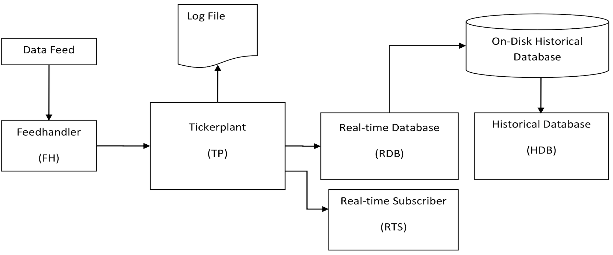

White paper
{: #wp-brand}

# Building real-time tick subscribers

by [Nathan Perrem](#author)
{: .wp-author}


The purpose of this white paper is to help q developers who wish to build their own custom real-time tick subscribers. Kx provides kdb+tick, a tick capture system which includes the core q code for the tickerplant process (`tick.q`) and the vanilla real-time subscriber process (`r.q`), known as the real-time database. This vanilla real-time process subscribes to all tables and to all symbols on the tickerplant. This process has very simple behavior upon incoming updates – it simply inserts these records to the end of the corresponding table. This may be perfectly useful to some clients, however what if the client requires more interesting functionality? For example, the client may need to build or maintain their queries or analytics in real time. How would one take `r.q` and modify it to achieve said behavior? This white paper attempts to help with this task. It breaks down into the following broad sections:

1.  Explain the existing code and principles behind `r.q`.
2.  Use `r.q` as a template to build some sample real-time analytic
    engines.

It is hoped this white paper will help dispel any notion of tick being a black box product which cannot be adapted to the requirements of the real-time data consumer.

All tests were run using kdb+ V3.1 (2013.09.19) on Windows.
The tickerplant and real-time database scripts can be obtained from GitHub.

:fontawesome-brands-github:
[KxSystems/kdb+tick](https://github.com/KxSystems/kdb-tick)

The tickerplant and real-time database scripts used are dated 2014.03.12 and 2008.09.09 respectively. These are the most up-to-date versions as of the writing of this white paper.

This paper is focused on the real-time database and custom real-time subscribers. However, some background will be provided on the other key processes in this environment.


## The kdb+tick environment

The real-time database (RDB) and all other real-time subscribers (RTS) do not exist in isolation. Instead they sit downstream of the feedhandler (FH) and tickerplant (TP) processes. The feedhandler feeds data into the tickerplant, which in turns publishes certain records to the real-time database and other real-time subscribers. Today’s data can be queried on the RDB. The historical data resides on disk and can be read into memory upon demand by the historical database process (HDB). The following diagram illustrates this simple architecture.



The incoming data feed could be from Reuters, Bloomberg, a particular exchange or some other internal data feed. The feedhandler receives this data and extracts the fields of interest. It will also perform some datatype casting and re-ordering of fields to normalize the data set with the corresponding table schemas present on the tickerplant. The feedhandler then pushes this massaged data to the tickerplant.


### Tickerplant (TP)

The tickerplant process is started up as follows.

```bash
q tick.q sym C:\OnDiskDB -p 5000
```

Although the inner workings of the tickerplant process are beyond the scope of this white paper, we will consider the significance of the two custom command-line arguments supplied:

`sym`

: refers to the schema file (in this case called `sym.q`), assumed to reside in the subdirectory called `tick` (relative to `tick.q`). This schema file simply defines the tables that exist in the TP – here we define two tables, `trade` and `quote`, as follows.

```q
quote:([]time:`timespan$();sym:`symbol$();bid:`float$();ask:`float$();
  bsize:`int$();asize:`int$())
trade:([]time:`timespan$();sym:`symbol$();price:`float$();size:`int$())
```

: The schemas for these tables are subject to the constraint that the first two columns be called `time` and `sym` and be of datatype timespan (nanoseconds) and symbol respectively. 

!!! note "Earlier version"

    Prior to the 2012.11.09 release of `tick.q`, the `time` column needed to be of datatype time (milliseconds) as opposed to timespan.

`C:/OnDiskDB` 

: the on-disk location where the TP logfile is stored. This process must have write access to whatever directory is specified here. Furthermore, since this process will be writing to this logfile every time an update is received by the feedhandler, the disk write speed should be high enough to deal with the frequency of these updates.


### Feedhandler (FH)

A sample feedhandler called `SampleFeed.q` is also instantiated. This simple process simply pumps dummy, random data to the tickerplant for the trade and quote tables on a regular interval. The data generated is consistent in schema with `sym.q`. For completeness, the code in `SampleFeed.q` is included below.

```q
h:neg hopen `:localhost:5000 /connect to tickerplant 
syms:`MSFT.O`IBM.N`GS.N`BA.N`VOD.L /stocks
prices:syms!45.15 191.10 178.50 128.04 341.30 /starting prices 
n:2 /number of rows per update
flag:1 /generate 10% of updates for trade and 90% for quote
getmovement:{[s] rand[0.0001]*prices[s]} /get a random price movement 
/generate trade price
getprice:{[s] prices[s]+:rand[1 -1]*getmovement[s]; prices[s]} 
getbid:{[s] prices[s]-getmovement[s]} /generate bid price
getask:{[s] prices[s]+getmovement[s]} /generate ask price
/timer function
.z.ts:{
  s:n?syms;
  $[0<flag mod 10;
    h(".u.upd";`quote;(n#.z.N;s;getbid'[s];getask'[s];n?1000;n?1000)); 
    h(".u.upd";`trade;(n#.z.N;s;getprice'[s];n?1000))];
  flag+:1; }
/trigger timer every 100ms
\t 100
```

Points to note from the above:

1.  The data sent to the tickerplant is in columnar (column-oriented) list format. In other words, the tickerplant expects data as lists, not tables. This point will be relevant later when the RDB wishes to replay the tickerplant logfile.
1.  The function triggered on the tickerplant upon receipt of these updates is `.u.upd`.
1.  If you wish to increase the frequency of updates sent to the tickerplant for testing purposes, simply change the timer value at the end of this script accordingly.


### Historical database (HDB)

The HDB instance typically mounts the on-disk, date-partitioned database. Clients who wish to query records prior to today will generally query this process. There is no canonical script for the HDB so for this paper the following simple script (`hdb.q`) was used:

```q
/Sample usage:
/q hdb.q C:/OnDiskDB/sym -p 5002
if[1>count .z.x;show"Supply directory of historical database";exit 0];
hdb:.z.x 0
/Mount the Historical Date Partitioned Database
@[{system"l ",x};hdb;{show "Error message - ",x;exit 0}]
```

Strictly speaking, an instance of the HDB is not required for this paper since all we really need is a tickerplant being fed data and then publishing this data downstream to the RDB and RTS. However, the RDB does communicate with the HDB at end of day once it has finished writing its records to the on-disk database.


## Real-time database (RDB)

The RDB is started off as

```bash
q tick/r.q localhost:5000 localhost:5002 -p 5001
```

argument         | semantics
-----------------|----------
`localhost:5000` | location of tickerplant process
`localhost:5002` | location of HDB process


### Real-time updates

Quite simply, the tickerplant provides the ability for a process (in this case the real-time database) to subscribe to certain tables, and for certain symbols (stock tickers, currency pairs etc.). Such a real-time subscriber will subsequently have relevant updates pushed to it by the tickerplant. The tickerplant asynchronously pushes the update as a 3-item list in the format `(upd;Table;data)`:

item     | semantics
---------|----------
`upd`    | name of the update function on the RDB to be invoked
 `Table` | name of the table being updated; e.g. `` `trade``, `` `quote``, etc.
`data`   | table containing one or more new records

Some example updates:

```q
/single-row update for the trade table
(`upd;
  `trade;
  ([]time:enlist 0D10:30:59.5;
    sym:`IBM.N;
    price:183.1;
    size:1000))
```
```q
/multi-row update for the trade table
(`upd;
  `trade;
  ([]time:0D10:30:59.5 0D10:30:59.6;
    sym:`IBM.N`MSFT.O;
    price:183.1 43.2;
    size:1000 2000))
```

Such a list is received by the real-time subscriber and is implicitly passed to the [`value`](../../ref/value.md) function. Here is a simple example of `value` in action:

```q
q)upd:{:x-y}
q)value (`upd;3;2)
1
```

In other words, the real-time subscriber passes two inputs to the function called `upd`. In the above examples, the inputs are the table name `` `trade`` and the table of new records.

The `upd` function should be defined on the real-time subscriber according to how the process is required to act in the event of an update. Often `upd` is defined as a binary (2-argument) function, but it could alternatively be defined as a dictionary which maps table names to unary function definitions. This duality works because of a fundamental and elegant feature of kdb+: [executing functions and indexing into data structures are equivalent](../../ref/apply.md). For example:

```q
/define map as a dictionary
q)map:`foo`bar!({x+1};{x-1}) /`foo and `bar map to unary functions 
q)map[`foo;10] /foo's function is triggered
11
q)map[`bar;10] /bar's function is triggered
9
/define map as a binary function to achieve similar results 
q)map:{[t;x]$[t=`foo;{x+1}[x];t=`bar;{x-1}[x];]}
q)map[`foo;10]
11
q)map[`bar;10]
9
```

So the developer of the process needs to define `upd` according to their desired behavior.

Perhaps the simplest definition of `upd` is to be found in the vanilla RTS – the RDB. The script for this process is called `r.q` and within this script, we find the definition:

```q
upd:insert
```

In other words, when records `y` for table `x` are received, simply insert these records into the table whose name is `x`. If a different behavior is required upon a new update, then a different definition of `upd` should be used. In this white paper we will build custom subscribers which maintain certain analytics in real time. The core of any such solution involves a custom definition for `upd`. To reinforce this point, here are some scenarios with different, valid definitions of `upd`.

```q
/upd is a binary function which increments MC and does an insert 
/the output is a list with the new row indices 
q)upd:{[t;d]MC+:1;t insert d}
```
```q
/demonstrate single row update
q)value (`upd;`trade;([]time:enlist 0D10:30:59.5;sym:`IBM.N;price:183.1;size:1000))
,0
q)MC /this variable (Message Counter) incremented by 1 
1
```
```q
/demonstrate multi-row update
q)value (`upd;`trade;([]time:0D10:30:59.5 0D10:30:59.6;sym:`IBM.N`MSFT.O;price:183.1 43.2;size:1000 2000)) 
12
q)count trade /row count of trade is now 3
3
q)MC
2
```
```q
/upd is a dictionary providing similar results to previous example
upd:`trade`quote!({MC+:1;`trade insert x};{MC+:1;`quote insert x})
/demonstrate single row update
q)value (`upd;`trade;([]time:enlist 0D10:30:59.5;sym:`IBM.N;price:183.1;size:1000)) 
,3
q)MC
3
```
```q
/demonstrate multi-row update
q)value (`upd;`trade;([]time:0D10:30:59.5 0D10:30:59.6;sym:`IBM.N`MSFT.O;price:183.1 43.2;size:1000 2000)) 
45
q)count trade /row count of trade is now 6
6
q)MC
4
```

The main challenge in developing a custom real-time subscriber is rewriting `upd` to achieve desired real-time behavior.


### Tickerplant log replay

An important role of the tickerplant is to maintain a daily logfile on disk for replay purposes. When a real-time subscriber starts up, they could potentially replay this daily logfile, assuming they have read access to it. Such a feature could be useful if the subscriber crashes intraday and is restarted. In this scenario, the process would replay this logfile and then be fully up-to-date. Replaying this logfile, particularly late in the day when the tickerplant has written many messages to it, can take minutes. The exact duration will depend on three factors:

1.  How many messages are in the logfile
2.  The disk read speed
3.  How quickly the process can replay a given message

The first and second factors are probably not controllable by the developer of the RTS. However the third factor is based on the efficiency and complexity of the particular replay function called `upd`. Defining this replay function efficiently is therefore of the upmost importance for quick intraday restarts.

!!! note "One daily logfile"

    The tickerplant maintains just one daily logfile. It does _not_ maintain separate logfiles split across different tables and symbols. This means that an RTS replaying such a logfile may only be interested in a fraction of the messages stored within.

    Ultimately the developer must decide if the process truly requires these records from earlier in the day. Changing the tickerplant’s code to allow subscriber specific logfiles should be technically possible, but is beyond the scope of this white paper.

Below are the first three messages stored in a sample tickerplant logfile called `sym2014.08.23` located in the directory `C:\OnDiskDB` (as set by the tickerplant upon startup). This logfile was generated by running the tickerplant and sample feedhandler for a short period of time. Its contents can be examined within a q process using the `get` function as follows:

```q
q)3#get `:C:/OnDiskDB/sym2014.08.23 /examine first 3 messages
`upd `trade (0D21:37:10.977580000 0D21:37:10.977580000;`GS.N`BA.N;178.5 128;798 627)
`upd `quote (0D21:37:11.077158000 0D21:37:11.077158000;`IBM.N`VOD.L;191.1 341.3;191.1 341.3;564 807;886 262)
`upd `quote (0D21:37:11.177744000 0D21:37:11.177744000;`GS.N`IBM.N;178.5 191.1;178.5 191.1;549 461;458 274)
```

Focusing on the first message:

```q
`upd `trade (0D21:37:10.977580000 0D21:37:10.977580000;`GS.N`BA.N;178.5 128;798 627)
```

item | semantics
-----|-----------
1    | the symbol `` `upd`` is the name of the update/replay function on RTS
2    | the symbol `` `trade`` is the table name of the update
3    | a column-oriented (columnar) list containing the new records

The format of the message in the tickerplant logfile is the same as the format of real-time updates sent to the RTS with one _critical_ difference – the data here is a list, _not_ a table. The RTS which wants to replay this logfile will need to define their `upd` to accommodate this list. This will mean in general that an RTS will have two different definitions of `upd` – one for tickerplant logfile replay and another for intraday updates via IPC (interprocess communication).

For example, a q process with suitable definitions for the tables `trade` and `quote`, as well as the function `upd`, could replay `sym2014.08.23`. Again, a suitable definition for `upd` will depend on the desired behavior, but the function will need to deal with incoming lists as well as tables.

In the RDB (vanilla RTS), `upd` for both replay purposes and intraday update purposes is simply defined as:

```q
upd:insert
```

In other words, when the RDB replays a given message, it simply inserts the record/s into the corresponding table. This is the same definition of `upd` used for intraday updates via IPC. These updates succeed because the second argument to `insert` can be either a columnar list or a table.

A q process replays a tickerplant logfile using the operator `-11!`. Although this operator can be used in different ways, the simplest syntax is:

```q
-11! `:TPDailyLogfile
```

Where `TPDailyLogfile` is the particular logfile to replay.

The result is the number of messages successfully replayed.

For example, based on the above definition of `upd`, we could replay a logfile as follows:

```q
-11! `:C:/OnDiskDB/sym2014.08.23
```

This would replay all messages in the logfile, resulting in inserts into the `trade` and `quote` tables.

Define `upd` for tickerplant log replay in whatever way is deemed appropriate. Here are some different definitions:

```q
/upd is a binary function which increments MC and does an insert
q)upd:{[t;d]MC+:1;t insert d}
q)-11! `:C:/OnDiskDB/sym2014.08.23 /output is number of messages read 
45
```
```q
/upd is a binary function which maintains counters for trade and quote
q)upd:{[t;d]$[t=`trade;TC+:1;t=`quote;QC+:1;]} 
q)-11! `:C:/OnDiskDB/sym2014.08.23
45
q)TC /number of updates for trade
4
q)QC /number of updates for quote
41
```

Why does the following attempt at logfile replay fail?

```q
q)upd:{[t;d]$[t=`trade;select price from d;]} 
q)-11! `:C:/OnDiskDB/sym2014.08.23 
{[t;d]$[t=`trade;select price from d;]}
'type
q))show d
0D14:03:27.812066000 0D14:03:27.812066000 
IBM.N                GS.N
91.33033             14.85357
798                  627
```

This attempt at logfile replay failed because the data is a list, not a table, and therefore the qSQL select invocation failed. QSQL and table join functions (`lj`, `aj` etc.) work only on tables, not lists. Bear this in mind when designing the `upd` function for logfile replay purposes.

The real-time database (`r.q`) replays the tickerplant logfile upon startup. Specifically, after it has connected/subscribed to the tickerplant, but before it has received any intraday updates.

For more information on tickerplant logfile replay, see White Paper [“Data Recovery for kdb+tick”](../data-recovery.md) published in July 2014, written by Fionnbharr Gaston.


### End of day

At end of day (EOD), the tickerplant sends messages to all its real-time subscribers, telling them to execute their unary end-of-day function called `.u.end`. The tickerplant supplies a date which is typically the previous day’s
date. When customizing your RTS, define `.u.end` to achieve whatever behavior you deem appropriate at EOD. On the RDB, `.u.end` is defined as follows:

```q
/ end of day: save, clear, hdb reload
.u.end:{t:tables`.;
  t@:where `g=attr each t@\:`sym;
  .Q.hdpf[`$":",.u.x 1;`:.;x;`sym];
  @[;`sym;`g#] each t;}
```

To summarize this behavior: the RDB persists its tables to disk in date-partitioned format, sends a message to the HDB, telling it to refresh and then the RDB clears out its tables, but maintains the grouped attribute on all tables’ `sym` columns, for query performance reasons. (A more detailed explanation of the workings of `.u.end` is found below.)


### Understanding the code in `r.q`

To help you modify `r.q` to create your own custom RTS, this section explains its inner workings. This script starts out with the following:

```q
if[not "w"=first string .z.o;system "sleep 1"];
```

The above code simply checks the operating system, and if it is not Windows, the appropriate OS command is invoked to sleep for one second. This is required as the RDB will soon try to establish a connection to the TP and a non-Windows OS may need some time to register the RDB before such an interprocess communication (TCP/IP) connection can be established.

The next line of code is very short and yet critical to the behavior of this subscriber:

```q
upd:insert
```

Earlier in this white paper, the roles of `upd` for both intraday updates and tickerplant logfile replay were discussed.

The next section simply defines default locations for the tickerplant
and HDB processes:

```q
/ get the ticker plant and history ports, defaults are 5010, 5012
.u.x:.z.x,(count .z.x)_(":5010";":5012");
```

`.z.x` is a system variable which stores the custom command-line arguments, supplied to the process upon startup. For example:

```q
C:\>q trade.q foo bar -p 4000
KDB+ 3.1 2014.07.01 Copyright (C) 1993-2014 Kx Systems
w32/ 8()core 4095MB nperrem inspiron2 192.168.1.153 NONEXPIRE

q)/display custom command line args
q).z.x 0
"foo"
q).z.x 1
"bar" 
q)
```


#### `.u.end`

The function `.u.end` is then defined. The definition, significance and broad behavior of this function were discussed earlier. What follows is a line-by-line breakdown of `.u.end`:

```q
t:tables`.;
```

Return a list of the names of all tables defined in the default
namespace and assign to the local variable `t`. `t` will contain `` `trade``
and `` `quote`` in this case.

```q
t@:where `g=attr each t@\:`sym;
```

This line obtains the subset of tables in `t` that have the grouped attribute on their `sym` column. This is done because later these tables will be emptied out and their attribute information will be lost. Therefore we store this attribute information now so the attributes can be re-applied after the clear out. As an aside, the `g` attribute of the `sym` column makes queries that filter on the `sym` column run faster.

```q
.Q.hdpf[`$":",.u.x 1;`:.;x;`sym]
```

[`.Q.hdpf`](../../ref/dotq/#qhdpf-save-table) is a high-level function which saves all in-memory tables to disk in partitioned format, empties them out and then instructs the HDB to reload. Its arguments at runtime here will be:

argument | value                 | semantics
---------|-----------------------|----------
1        | `` `:localhost:5002`` | location of HDB
2        | `` `:.``             | current working directory – root of on-disk partitioned database
3        | `2014.08.23`          | input to `.u.end` as supplied by TP: the partition to write to
4        | `` `sym``            | column on which to sort/part the tables prior to persisting

```q
@[;`sym;`g#] each t;
```

This line applies the `g` attribute to the `sym` column of each table as previously discussed.


#### `.u.rep`

This section defines an important function called `.u.rep`. This function is invoked at startup once the RDB has connected/subscribed to the TP.

```q
/ init schema and sync up from log file;cd to hdb(so client save can run)
.u.rep:{(.[;();:;].)each x;
  if[null first y;:()];
  -11!y;
  system "cd ",1_- 10_string first reverse y}
```

`.u.rep` takes two arguments. The first, `x`, is a list of two-item lists, each containing a table name (as a symbol) and an empty schema for that table. The second argument to `.u.rep`, `y`, is a single two-item list. These arguments are supplied by the TP upon subscription. Based on this RDB with `trade` and `quote` tables, the first argument (`x`) to `.u.rep` would look like:

```q
q)show x /x is the first input to .u.rep
`quote 
+`time`sym`bid`ask`bsize`asize!(`timespan$();`g#`symbol$();`float$();`f loat$();`int$();`int$())
`trade 
+`time`sym`price`size!(`timespan$();`g#`symbol$();`float$();`int$())
```

Drilling down further:

```q
q)show each x 0 /table name/empty table combination for quote `quote
time sym bid ask bsize asize
----------------------------
q)
q)show each x 1 /table name/empty table combination for trade `trade
time sym price size
-------------------
q)
```

So each item of `x` is a pair containing a table name and a corresponding empty copy of that table. This information, as previously mentioned, was supplied by the TP. This is how the RDB knows the schemas for the tables it subscribes to.

The second argument to `.u.rep` is simpler and would look like:

```q
q)y
11995
`:C:/OnDiskDB/sym2014.08.23
```

In other words, `y` is a pair where the last element is the TP logfile and the first element is the number of messages written to this logfile so far. This is the number of messages which the RDB will replay. Given the single-threaded nature of this process, the RDB will neither miss nor duplicate any of these messages.

Now let’s consider the line-by-line behavior of `.u.rep`:

```q
(.[;();:;].)each x;
```

This line just loops over the table name/empty table pairs and initializes these tables accordingly within the current working namespace (default namespace). Upon first iteration of the projection, the argument is the pair:

```q
q)x 0
`quote +`time`sym`bid`ask`bsize`asize!(`timespan$();`g#`symbol$();`float$();`f loat$();`int$();`int$())
```

Given that the function `set` is essentially a projection onto [the dot
form of Amend](../../ref/amend.md), the first line of `.u.rep` could be replaced with the following expression and yield identical behavior.

```q
(set[;].) each x;
```

The next line checks if no messages have been written to the TP logfile.

```q
if[null first y;:()];
```

If that is the case, the RDB is ready to go and the function returns (arbitrarily with an empty list). Otherwise, proceed to the next line:

```q
-11!y;
```

This line simply replays an appropriate number of messages from the start of the TP logfile. At which point, based upon the definition of `upd` as `insert`, the RDB’s `trade` and `quote` tables are now populated.

The last line in this function is:

```q
system "cd ",1_-10_string first reverse y
```

This changes the current working directory of the RDB to the root of the on-disk partitioned database. Therefore, when `.Q.hdpf` is invoked
at EOD, the day’s records will be written to the correct place.


#### Starting the RDB

The following section of code appears at the end of `r.q` and kicks the RDB into life:

```q
/ connect to ticker plant for (schema;(logcount;log))
.u.rep .(hopen `$":",.u.x 0)"(.u.sub[`;`];`.u `i`L)"
```

This is a rather involved line of q code and its inner workings are broken down as follows:

```q
hopen `$":",.u.x 0
```

Reading this from the right, we obtain the location of the tickerplant process which is then passed into the [`hopen`](../../ref/hopen.md) function, which returns a handle (connection) to the tickerplant. Through this handle, we then send a synchronous message to the tickerplant, telling it to do two things:

``.u.sub[`;`]``

: Subscribe to all tables and to all symbols. 

: `.u.sub` is a binary function defined on the tickerplant. If passed null symbols (as is the case here), it will return a list of pairs (table name/empty table), consistent with the first argument to `.u.rep` as discussed previously. At this point the RDB is subscribed to all tables and to all symbols on the tickerplant and will therefore receive all intraday updates from the TP. The exact inner workings of `.u.sub` as defined on the TP are beyond the scope of this white paper.

``.u `i`L``

: Obtain name/location of TP logfile and number of messages written by TP to said logfile.

: The output of this is the list passed as second argument to `.u.rep` as previously discussed.


## Examples of custom real-time subscribers

Two quite different RTS instances are described below.


### Real-time trade with as-of quotes

One of the most popular and powerful joins in the q language is the [`aj`](../../ref/aj.md) function. This keyword was added to the language to solve a specific problem – how to join trade and quote tables together in such a way that for each trade, we grab the prevalent quote _as of_ the time of that trade. In other words, what is the last quote at or prior to the trade? 

This function is relatively easy to use for one-off joins. However, what if you want to maintain trades with as-of quotes in real time? This section describes how to build an RTS with real-time trades and as-of quotes. This is a heavily modified version of `r.q`, written by the author and named `RealTimeTradeWithAsofQuotes.q`.

One additional feature this script demonstrates is the ability of any q process to write to and maintain its own kdb+ binary logfile for replay/recovery purposes. In this case, the RTS maintains its own daily logfile for trade records. This will be used for recovery in place of the standard tickerplant logfile as used by `r.q`.

This process should be started off as follows:

```bash
q tick/RealTimeTradeWithAsofQuotes.q -tp localhost:5000 -syms MSFT.O IBM.N GS.N -p 5003
```

This process will subscribe to both trade and quote tables for symbols `MSFT.O`, `IBM.N` and `GS.N` and will listen on port 5003. The author has deliberately made some of the q syntax more easily understandable compared to `r.q`.

The first section of the script simply parses the command-line arguments and uses these to update some default values:

```q
/
The purpose of this script is as follows:
1. Demonstrate how custom real-time subscribers can be created in q 
2. In this example, create an efficient engine for calculating 
   the prevalent quotes as of trades in real-time.
   This removes the need for ad-hoc invocations of the aj function.
3. In this example, this subscriber also maintains its own binary 
   log file for replay purposes.
   This replaces the standard tickerplant log file replay functionality.
\
show "RealTimeTradeWithAsofQuotes.q"
/sample usage
/q tick/RealTimeTradeWithAsofQuotes.q -tp localhost:5000 -syms MSFT.O IBM.N GS.N

/default command line arguments - tp is location of tickerplant. 
/syms are the symbols we wish to subscribe to
default:`tp`syms!("::5000";"") 
 
args:.Q.opt .z.x /transform incoming cmd line arguments into a dictionary
args:`$default,args /upsert args into default 
args[`tp] : hsym first args[`tp]

/drop into debug mode if running in foreground AND 
/errors occur (for debugging purposes)
\e 1 

if[not "w"=first string .z.o;system "sleep 1"]
```

The error flag above is set for purely testing purposes – when the developer runs this script in the foreground, if errors occur at runtime as a result of incoming IPC messages, the process will drop into debug mode. For example, if there is a problem with the definition of `upd`, then when an update is received from the tickerplant we will drop into debug mode and (hopefully) identify the issue.


#### Initialize desired table schemas

The next section of code defines the behavior of this RTS upon connecting and subscribing to the tickerplant’s trade and quote tables. This function replaces `.u.rep` in `r.q`:

```q
/initialize schemas for custom real-time subscriber
InitializeSchemas:`trade`quote!
  (
   {[x]`TradeWithQuote insert update bid:0n,bsize:0N,ask:0n,asize:0N from x};
   {[x]`LatestQuote upsert select by sym from x}
  );
```

The RTS’s trade table (named `TradeWithQuote`) maintains `bid`, `bsize`, `ask` and `asize` columns of appropriate type. For the quote table, we just maintain a keyed table called `LatestQuote`, keyed on `sym` which will maintain the most recent quote per symbol. This table will be used when joining prevalent quotes to incoming trades.


#### Intraday update behavior

The next code section defines the intraday behavior upon receiving new trades:

```q
/intraday update functions
/Trade Update
/1. Update incoming data with latest quotes
/2. Insert updated data to TradeWithQuote table 
/3. Append message to custom logfile 
updTrade:{[d]
  d:d lj LatestQuote;
  `TradeWithQuote insert d;
  LogfileHandle enlist (`replay;`TradeWithQuote;d); }
```

Besides inserting the new trades with prevalent quote information into the trade table, the above function also appends the new records to its custom logfile. This logfile will be replayed upon recovery/startup of the RTS. Note that the replay function is named `replay`. This differs from the conventional TP logfile where the replay function was called `upd`.

The next section defines the intraday behavior upon receiving new quotes:

```q
/Quote Update
/1. Calculate latest quote per sym for incoming data 
/2. Update LatestQuote table
updQuote:{[d]
  `LatestQuote upsert select by sym from d; }
```

The following dictionary `upd` acts as a case statement – when an update for the trade table is received, `updTrade` will be triggered with the message as argument. Likewise, when an update for the quote table is received, `updQuote` will be triggered.

```q
/upd dictionary will be triggered upon incoming update from tickerplant
upd:`trade`quote!(updTrade;updQuote)
```

In `r.q`, `upd` is defined as a function, not a dictionary. However we can use this dictionary definition for reasons discussed previously.


#### End of day

At end of day, the tickerplant sends a message to all real-time subscribers telling them to invoke their EOD function – `.u.end`:

```q
/end of day function - triggered by tickerplant at EOD
.u.end:{
  hclose LogfileHandle; /close the connection to the old log file 
  /create the new logfile
  logfile::hsym `$"RealTimeTradeWithAsofQuotes_",string .z.D; 
  .[logfile;();:;()]; /Initialise the new log file 
  LogfileHandle::hopen logfile;
  {delete from x}each tables `. /clear out tables }
```

This function has been heavily modified from `r.q` to achieve the following desired behavior:

`hclose LogfileHandle`

: Close connection to the custom logfile.

``logfile::hsym `$"RealTimeTradeWithAsofQuotes_",string .z.D``

: Create the name of the new custom logfile. This logfile is a daily logfile – meaning it only contains one day’s trade records and it has today’s date in its name, just like the tickerplant’s logfile.

`.[logfile;();:;()]`

: Initialize this logfile with an empty list.

`LogfileHandle::hopen logfile`

: Establish a connection (handle) to this logfile for streaming writes.

``{delete from x}each tables `.``

: Empty out the tables.


#### Replay custom logfile

This section concerns the initialization and replay of the RTS’s custom logfile.

```q
/Initialize name of custom logfile
logfile:hsym `$"RealTimeTradeWithAsofQuotes_",string .z.D 

replay:{[t;d]t insert d} /custom log file replay function
```

At this point, the name of today’s logfile and the definition of the logfile replay function have been established. The replay function will be invoked when replaying the process’s custom daily logfile. It is defined to simply insert the on-disk records into the in memory (`TradeWithQuote`) table. This will be a fast operation ensuring recovery is achieved quickly and efficiently.

Upon startup, the process uses a try-catch to replay its custom daily logfile. If it fails for any reason (possibly because the logfile does not yet exist), it will send an appropriate message to standard out and will initialize this logfile. Replay of the logfile is achieved with the standard operator `-11!` as discussed previously.

```q
/attempt to replay custom log file
@[{-11!x;show"successfully replayed custom log file"}; logfile;
  {[e]
    m:"failed to replay custom log file";
    show m," - assume it does not exist. Creating it now";
    .[logfile;();:;()]; /Initialise the log file
  } ]
```

Once the logfile has been successfully replayed/initialized, a handle (connection) is established to it for subsequent streaming appends (upon new incoming trades from tickerplant):

```q
 /open a connection to log file for writing
LogfileHandle:hopen logfile
```


#### Subscribe to TP

The next part of the script is probably the most critical – the process connects to the tickerplant and subscribes to the trade and quote table for user-specified symbols.

```q
/ connect to tickerplant and subscribe to trade and quote for portfolio 
h:hopen args`tp /connect to tickerplant
InitializeSchemas . h(".u.sub";`trade;args`syms)
InitializeSchemas . h(".u.sub";`quote;args`syms)
```

The output of a subscription to a given table (for example `trade`) from the tickerplant is a 2-list, as discussed previously. This pair is in turn passed to the function `InitializeSchemas`.

We can see this RTS in action by examining the five most recent trades for `GS.N`:

```q
q)-5#select from TradeWithQuote where sym=`GS.N
time                 sym  price    size bid      bsize ask      asize 
---------------------------------------------------------------------
0D21:50:58.857411000 GS.N 178.83   790  178.8148 25    178.8408 98
0D21:51:00.158357000 GS.N 178.8315 312  178.8126 12    178.831  664
0D21:51:01.157842000 GS.N 178.8463 307  178.8193 767   178.8383 697 
0D21:51:03.258055000 GS.N 178.8296 221  178.83   370   178.8627 358
0D21:51:03.317152000 GS.N 178.8314 198  178.8296 915   178.8587 480
```


### Real-time VWAP subscriber

This section describes how to build an RTS which enriches trade with VWAP (volume-weighted average price) information on a per-symbol basis. A VWAP can be defined as:

$$ VWAP = \frac{\sum_{i} (tradevolume_i)(tradeprice_i)}{\sum_{i} (trade price_i)}$$

Consider the following sample trade table:

```q
q)trade /examine the first few trade records 
time                 sym    price     size 
------------------------------------------
0D21:46:24.977505000 GS.N   178.56665 28
0D21:46:24.977505000 IBM.N  191.22174 66
0D21:46:25.977501000 MSFT.O 45.106284 584
0D21:46:26.977055000 GS.N   178.563   563
0D21:46:26.977055000 GS.N   178.57841 624
0D21:46:27.977626000 GS.N   178.58783 995
0D21:46:27.977626000 MSFT.O 45.110017 225
..
```

An additional column called `rvwap` (running VWAP) will be added to this table. In any given row, `rvwap` will contain the VWAP up until and including that particular trade record (for that particular symbol):

```q
time                 sym    price     size rvwap 
----------------------------------------------------
0D21:46:24.977505000 GS.N   178.56665 28   178.47318
0D21:46:24.977505000 IBM.N  191.22174 66   191.17041
0D21:46:25.977501000 MSFT.O 45.106284 584  45.147046
0D21:46:26.977055000 GS.N   178.563   563  178.47366
0D21:46:26.977055000 GS.N   178.57841 624  178.47428
0D21:46:27.977626000 GS.N   178.58783 995  178.47533
0D21:46:27.977626000 MSFT.O 45.110017 225  45.146982
..
```

This `rvwap` column will need to be maintained as new trade records arrive from the TP. In order to achieve this, two additional columns need to be maintained per row – `v` and `s`:

column | content
-------|--------
`v`    | cumulative value of all trades for that symbol (define value as the trade price multiplied by the trade size)
`s`    | cumulative size (quantity) of all trades for that symbol

`v` and `s` are the numerator and denominator respectively in the formula given at the start of this section. `rvwap` can then be simply calculated as `v` divided by `s`. The `trade` table would then become:

```q
time                 sym    price     size v         s      rvwap 
--------------------------------------------------------------------- 
0D21:46:24.977505000 GS.N   178.56665 28   18687391  104707 178.47318 
0D21:46:24.977505000 IBM.N  191.22174 66   20497292  107220 191.17041 
0D21:46:25.977501000 MSFT.O 45.106284 584  5865278.4 129915 45.147046 
0D21:46:26.977055000 GS.N   178.563   563  18787922  105270 178.47366 
0D21:46:26.977055000 GS.N   178.57841 624  18899355  105894 178.47428 
0D21:46:27.977626000 GS.N   178.58783 995  19077050  106889 178.47533 
0D21:46:27.977626000 MSFT.O 45.110017 225  5875428.2 130140 45.146982 
..
```

A simple keyed table called `vwap` is also maintained. This table simply maps a symbol to its current VWAP. Based on the above sample data, `vwap` would look like:

```q
sym    | rvwap
-------| --------
GS.N   | 178.47533
IBM.N  | 191.17041
MSFT.O | 45.146982
```

Just like the previous RTS example, this solution will comprise a heavily modified version of `r.q`, written by the author and named `real_time_vwap.q`.

This process should be started off as follows:

```bash
q tick/real_time_vwap.q -tp localhost:5000 -syms MSFT.O IBM.N GS.N -p 5004
```

This process will subscribe to only the `trade` table for symbols `MSFT.O`, `IBM.N` and `GS.N` and will listen on port 5004. The structure and design philosophy behind `real_time_vwap.q` is very similar to `RealTimeTradeWithAsofQuotes.q`.

The first section of the script simply parses the command-line
arguments and uses these to update some default values – identical
code to the start of `RealTimeTradeWithAsofQuotes.q`.


#### Initialize desired table schemas

The next section of code defines the behavior of this RTS upon connecting to the TP and subscribing to the `trade` table. This RTS will replay the TP’s logfile, much like the RDB. The following function replaces `.u.rep`.

```q
/initialize schema function
InitializeTrade:{[TradeInfo;logfile] 
  `trade set TradeInfo 1;
  if[null first logfile;update v:0n,s:0Ni,rvwap:0n from `trade;:()]; 
  -11!logfile;
  update v:sums (size*price),s:sums size by sym from `trade;
  update rvwap:v%s from `trade; }
```

This binary function `InitializeTrade` will be executed upon startup. It is passed two arguments, just like `.u.rep`:

argument    | semantics
------------|----------
`TradeInfo` | pair: table name (`` `trade``); empty table definition
`Logfile`   | pair: TP logfile record count and location

The `vwap` table is then simply defined as:

```q
/this keyed table maps a symbol to its current vwap
vwap:([sym:`$()] rvwap:`float$())
```

When `InitializeTrade` is executed, the TP logfile will be replayed using `-11!`. For the purpose of this replay, the function `upd` is simply defined as:

```q
/For TP logfile replay, upd is a simple insert for trades
upd:{if[not `trade=x;:()];`trade insert y}
```

In other words, insert `trade` records into the `trade` table and ignore `quote` records.


#### Intraday update behavior

The next code section defines the intraday behavior upon receiving
new trades:

```q
/
This intraday function is triggered upon incoming updates from TP. 
Its behavior is as follows:
1. Add s and v columns to incoming trade records
2. Increment incoming records with the last previous s and v values 
   (on per sym basis)
3. Add rvwap column to incoming records (rvwap is v divided by s)
4. Insert these enriched incoming records to the trade table
5. Update vwap table
\
updIntraDay:{[t;d]
  d:update s:sums size,v:sums size*price by sym from d; 
  d:d pj select last v,last s by sym from trade; 
  d:update rvwap:v%s from d;
  `trade insert d;
  `vwap upsert select last rvwap by sym from trade; }
```

So whenever a trade update comes in, the VWAP for each affected symbol is updated and the new trades are enriched with this information.


#### End of day

The EOD behavior on this RTS is very simple – clear out the tables:

```q
/end of day function - triggered by tickerplant at EOD 
/Empty tables
.u.end:{{delete from x}each tables `. } /clear out trade and vwap tables 
```


#### Subscribe to TP

The RTS connects to the TP and subscribes to the `trade` table for user specified symbols. The RTS also requests TP logfile information (for replay purposes):

```q
h:hopen args`tp /connect to tickerplant
InitializeTrade . h "(.u.sub[`trade;",(.Q.s1 args`syms),"];`.u `i`L)" 
upd:updIntraDay /switch upd to intraday update mode
```

The message returned from the TP is passed to the function `InitializeTrade`. Once the RTS has finished initializing or replaying the TP logfile, the definition of `upd` is then switched to `updIntraDay` so the RTS can deal with intraday updates appropriately.


## Performance considerations

The developer can build the RTS to achieve whatever real-time behavior is desired. However from a performance perspective, not all RTS instances are equal. The standard RDB is highly performant – meaning it should be able process updates at a very high frequency without maxing out CPU resources. In a real world environment, it is critical that the RTS can finish processing an incoming update before the next one arrives. The high level of RDB performance comes from the fact that its definition of `upd` is extremely simple:

```q
upd:insert
```

In other words, for both TP logfile replay and intraday updates, simply insert the records into the table. It doesn’t take much time to execute `insert` in kdb+. However, the two custom RTS instances discussed in this white paper have more complicated definitions of `upd` for intraday updates and will therefore be less performant. This section examines this relative performance.

For this test, the TP log will be used. This particular TP logfile has the following characteristics:

```q
q)hcount `:C:/OnDiskDB/sym2014.08.15 /size of TP logfile on disk in bytes
41824262
q)logs:get`:C:/OnDiskDB/sym2014.08.15 /load logfile into memory 
q)count logs /number of updates in logfile
284131
```

We can examine the contents of the logfile as follows:

```q
q)2#logs /display first 2 messages in logfile
`upd `quote (0D16:05:08.818951000 0D16:05:08.818951000;`GS.N`VOD.L;78.5033 53.47096;17.80839 30.17723;522 257;908 360)
`upd `quote (0D16:05:08.918957000 0D16:05:08.918957000;`VOD.L`IBM.N;69.16099 22.96615;61.37452 52.94808;694 934;959 221)
```

In this case, the first two updates were for `quote`, not `trade`. Given the sample feedhandler used, each update for `trade` or `quote` had two records. The overall number of `trade` and `quote` updates in this logfile were:

```q
 q)count each group logs[;1]
quote| 255720
trade| 28411
```

It was previously mentioned that the TP logfile has the data in columnar list format as opposed to table format, whereas intraday TP updates are in table format. Therefore, in order to simulate intraday updates, a copy of the TP logfile is created where the data is in table format.

The code to achieve this transformation is below:

```q
/LogfileTransform.q

\l tick/sym.q /obtain table schemas
d:`trade`quote!(cols trade;cols quote) 

`:C:/OnDiskDB/NewLogFile set () /initialize new logfile
h:hopen `:C:/OnDiskDB/NewLogFile /handle to NewLogFile

upd:{[tblName;tblData]
  h enlist(`upd;tblName;flip(d tblName)!tblData); }

-11!`:C:/OnDiskDB/sym2014.08.15 /replay TP log file and create new one
```

This transformed logfile will now be used to test performance on the
RDB and two RTS instances. 

On the RDB, we obtained the following performance:

```q
q)upd /vanilla, simple update behavior
insert
q)logs:get`:C:/OnDiskDB/NewLogFile /load logfile into memory 
q)count logs /number of messages to process
284131
q)\ts value each logs /execute each update
289 31636704
```

It took 289 milliseconds to process over a quarter of a million updates, where each update had two records. Therefore, the average time taken to process a single two-row update is 1µs.

In the first example RTS (Real-time Trade With As-of Quotes), we obtained the following performance:

```q
q)upd /custom real time update behavior
trade| {[d]
  d:d lj LatestQuote;
  `TradeWithQuote insert d;
  LogfileHandle enlist (`replay;`TradeWithQuote;d); }
quote| {[d] `LatestQuote upsert select by sym from d; }
q)logs:get`:C:/OnDiskDB/NewLogFile /load logfile into memory 
q)count logs /number of messages to process
284131
q)\ts value each logs /execute each update
2185 9962336
```

It took 2185 milliseconds to process over a quarter of a million updates, where each update had two records. Therefore, the average time taken to process a single two-row update is 7.7 µs – over seven times slower than RDB.

In the second example RTS (Real-time VWAP), we obtained the following performance:

```q
/
Because there are trades and quotes in the logfile 
but this RTS is only designed to handle trades, 
a slight change to upd is necessary 
for the purpose of this performance experiment
\
/If trade – process as normal. If quote - ignore 
q)upd:{if[x=`trade;updIntraDay[`trade;y]]}
q)
q)logs:get`:C:/OnDiskDB/NewLogFile /load logfile into memory
q)count logs /number of messages to process
284131
q)\ts value each logs /execute each update
9639 5505952
```

It took 9639 milliseconds to process over a quarter of a million updates, where each update had two records. Therefore, the average time taken to process a single two row update is 34 µs – over thirty times slower than RDB.

We can conclude that there was a significant difference in performance in processing updates across the various real-time subscribers. However even in the worst case, assuming the TP updates arrive no more frequently than once every 100 µs, the process should still function well.

It should be noted that prior to this experiment being carried out on each process, all tables were emptied.


## Conclusions

This white paper explained the inner workings of the standard real-time database subscriber as well as an overview of the rest of the kdb+tick environment. The white paper then detailed examples of customizing the RDB to achieve useful real-time analytical behavior.

It’s important when building a custom RTS to consider the performance implications of adding complexity to the update logic. The more complex the definition of `upd`, the longer it will take to process intraday updates or replay the TP logfile. In the case of intraday updates, it is important to know the frequency of TP updates in order to know how much complexity you can afford to build into your `upd` function.

It is the aim of the author that the reader will now have the understanding of how a kdb+tick subscriber can be built and customized fairly easily according to the requirements of the system.

All tests were run using kdb+ version V3.1 (2013.09.19) on Windows.

[:fontawesome-solid-print: PDF](/download/wp/building_real_time_tick_subscribers.pdf)


## Author

**Nathan Perrem** has worked onsite as a kdb+ developer at a range of investment banks and brokerage firms in New York and London. He has designed and delivered all client kdb+ training courses since 2009.

