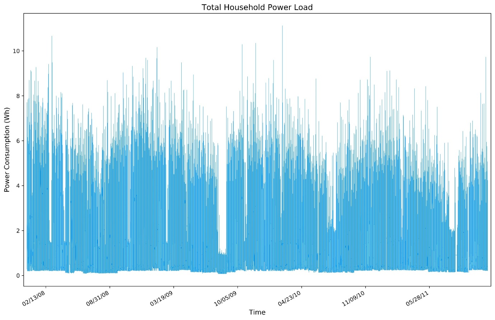
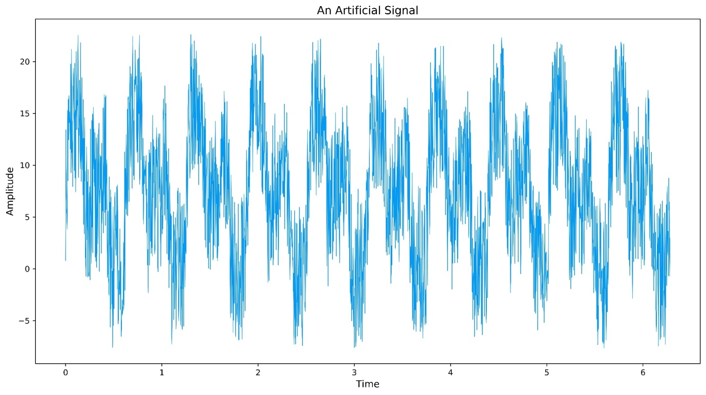
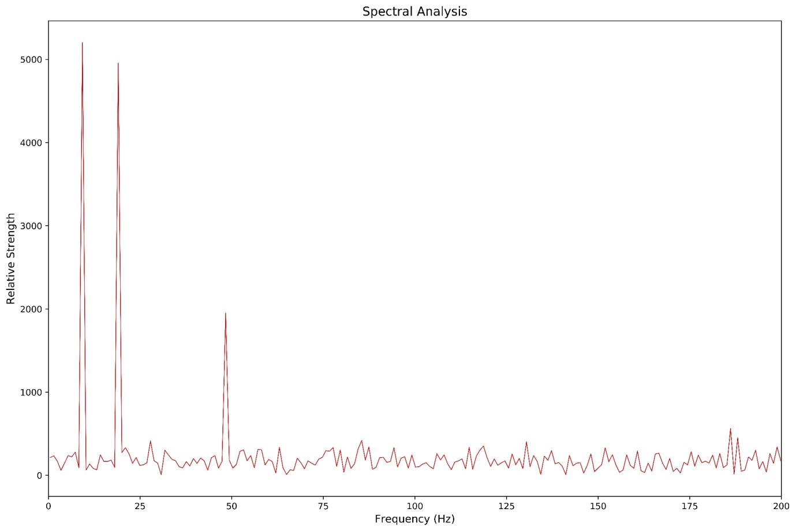
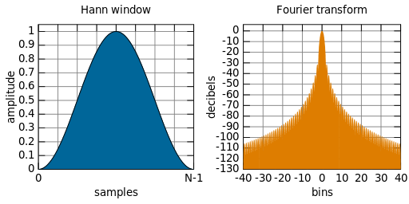
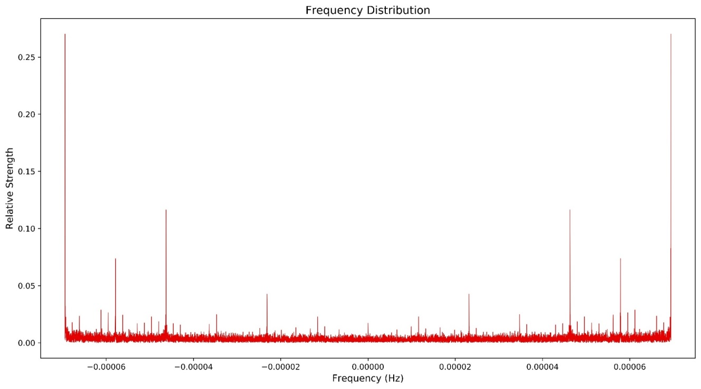
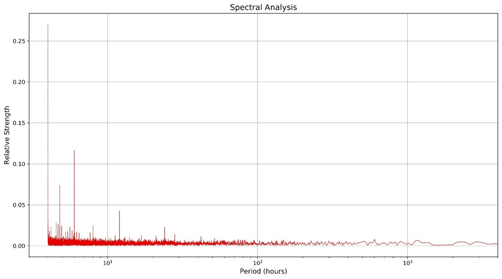
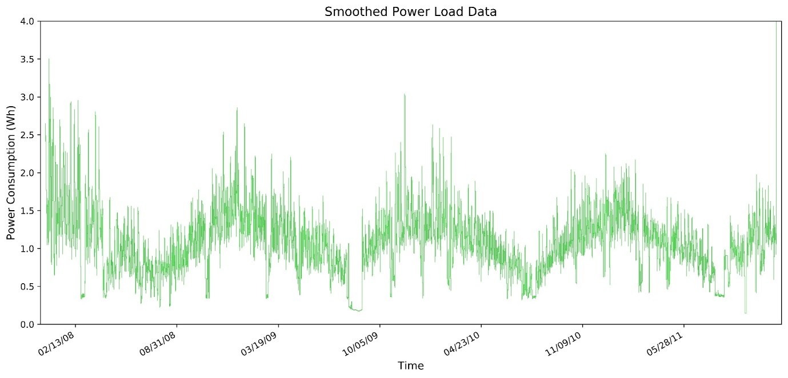
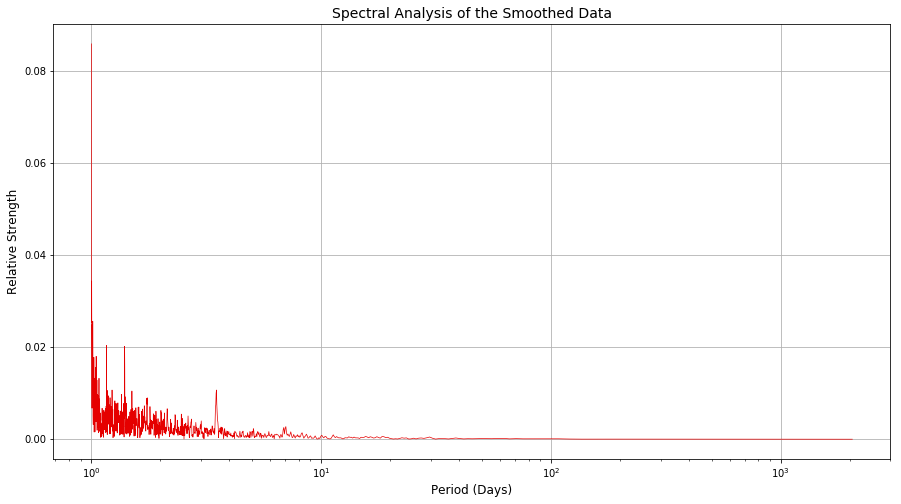
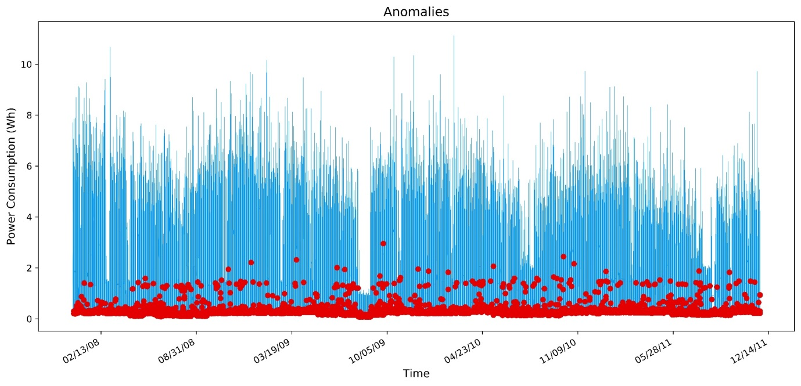

White paper
{: #wp-brand}

# Signal processing and q

by [Callum Biggs](#author)
{: .wp-author}


Signal processing is the analysis, interpretation and manipulation of
signals to reveal important information. Signals of interest include
human speech, seismic waves, images of faces or handwriting, brainwaves,
radar, traffic counts and many others. This processing reveals
information in a signal that can be obscured by non-useful information,
commonly called ‘noise’. This noise can be due to the stochastic[1]
nature of signals and/or interference from other signals. Traditionally,
signal processing has been performed by either an analog process,
through the use of a series of electronic circuits, or through the use
of dedicated hardware solutions, such as SIP (Systems In Package) or SoC
(Systems on a Chip).

The use of Internet of Things[2] (IoT) devices to capture signals is
driving the trend towards software-based signal-processing solutions.
Software-based solutions are not only cheaper and more widely accessible
than their hardware alternatives, but their highly configurable nature
is better suited to the modular aspect of IoT sensor setups. The growth
of IoT and software-based signal processing has resulted in increased
availability of cheaply-processed signal data, enabling more data-driven
decision making, particularly in the manufacturing sector [1].

Currently popular software implementations of digital signal-processing
techniques can be found in the open source-source libraries of Python
(e.g., SciPy, NumPy, PyPlot) and C++ (e.g., SlgPack, Aquila,
Liquid-DSP). The convenience of these libraries is offset by the lack of
a robust, high-throughput data-capture system, such as kdb+ tick. While
it is possible to integrate a kdb+ process with Python or C++, and utilize
these signal-processing routines on a kdb+ dataset, it is entirely possible
to implement them natively within q.

This white paper will explore how statistical signal-processing
operations (those which assume that signals are stochastic), can be
implemented natively within q to remove noise, extract useful
information, and quickly identify anomalies. This integration allows for
q/kdb+ to be used as a single platform for the capture, processing,
analysis and storage of large volumes of sensor data.

The technical specifications for the machine used to perform the
computations described in this paper are as follows:

  -   CPU: Intel® Core™i7 Quad Core Processor i7-7700 (3.6GHz) 8MB Cache
  -   RAM: 16GB Corsair 2133MHz SODIMM DDR4 (1 x 16GB)
  -   OS: Windows 10 64-bit
  -   kdb+ 3.5 2017.10.11


## Basic steps for signal processing

For the purpose of this paper, signal processing is composed of the
following steps:

1.  Data Capture
2.  Spectral Analysis
3.  Smoothing
4.  Anomaly Detection

This paper will focus on the last three steps listed above, as the first
topic of data capture has already been covered extensively in previous
Kx white papers, including 

-   [Kdb+tick profiling for throughput optimization](../tick-profiling.md)
-   [Disaster recovery for kdb+tick](../disaster-recovery/index.md) 
-   [Query Routing: a kdb+ framework for a scalable load-balanced](../query-routing/index.md)

Moreover, the analysis techniques presented will make use of the
following sensor data set, collected by the University of California
Irvine, which contains the total power load for a single household over
a 4 year period, to a resolution of 1 minute, as illustrated in Figure 1
below.

  
<small>_Figure 1: The load data of a single household, in 1-minute increments, from January 2007 to September 2010_</small>


## Spectral analysis

To understand better the nature of the processing that will be
performed on this signal, it will be useful to cover an important
signal/wave concept. A fundamental property of any wave (and hence
signal) is that of superpositioning[3], which is the combining of
different signals (of the same or different frequency), to create a new
wave with different amplitude and/or frequency. If simple signals can be
combined to make a more complex signal, any complicated signal can be
treated as the combination of more fundamental, simpler signals.
Spectral analysis is a broad term for the family of transformations that
‘decompose’ a signal from the time domain to the frequency domain[4],
revealing these fundamental components that make up a more complex
signal.

This decomposition is represented as a series of complex[5] vectors,
associated with a frequency ‘bin’, whose absolute value is
representative of the relative strength of that frequency within the
original signal. This is a powerful tool that allows for insight to be
gained on the periodic nature of the signal, to troubleshoot the sensor
in question, and to guide the subsequent transformations as part of the
signal processing.

In general, some of the basic rules to keep in mind when using the
frequency decomposition of a signal are:

-   Sharp distinct lines indicate the presence of a strong periodic nature;
-   Wide peaks indicate there is a periodic nature, and possibly some spectral leakage (which won’t be fully discussed in this paper);
-   An overall trend in the frequency distribution indicates aperiodic (and hence of an infinite period) behavior is present.

Consider the following artificial signal in Figure 2, which is a
combination of a 10Hz and 20Hz signal together with a constant
background Gaussian noise:

```q
x:(2*pi*(1%2048)) * til 2048;
y:(5 * sin (20*x))+(5 * sin (10 * x)) + `float$({first 1?15.0} each x);
```

  
<small>_Figure 2: An artificial, noisy signal_</small>

This time-series shows a clear periodic nature, but the details are hard
to discern from visual inspection. The following graph, Figure 3, shows
the frequency distribution of this signal, produced through the
application of an un-windowed Fourier Transform, a technique that will
be covered in detail below.

```q
\d .signal
mult:{[vec1;vec2]
  // Performs the dot product of two vectors
  realOut:((vec1 0) * vec2 0) - ((vec1 1) * vec2 1);
  imagOut:((vec1 1) * vec2 0) + ((vec1 0) * vec2 1);
  (realOut;imagOut)};

division:{[vec1;vec2] 

  denom:1%((vec1 1) xexp 2) + ((vec2 1) xexp 2); 
  mul:mult[vec1 0;vec1 1;vec2 0;neg vec2 1];
  realOut:(mul 0)*denom;
  imagOut:(mul 1)*denom;
  (realOut;imagOut)};

conj:{[vec]
  (vec 0;neg vec 1)};

mag:{[vec]
  sqrvec:vec xexp 2; 
  sqrt (sqrvec 0)+sqrvec 1};

\d .
```

```q
q).signal.mult[5 -3;9 2]
51 -17
q).signal.mult[(5 2 1;-3 -8 10);(9 8 -4;2 3 6)]
51  40  -64 / Reals
-17 -58 -34 / Imaginary
```
<small>_Fast Fourier Transform_</small>

  
<small>_Figure 3: The frequency distribution of the simulated signal shown in Figure 2_</small>

The distinct sharp peaks and a low level random ‘static’ in Figure 3
demonstrate the existence of both period trends and some background
noise within the signal. Considering that the signal in Figure 2 was to
be made up of two different frequencies, why are there clearly three different
frequencies (i.e., 10, 20 and 50Hz) present? This is because the
original signal contained a low-level 50Hz signal, one that might be
observed if a sensor wasn’t correctly shielded from 50Hz main power.
This leakage could influence any decisions made from this signal, and
may not have been immediately detected without spectral analysis.

In general, spectral analysis is used to provide information to make a
better decision on how to process a signal. In the case above, an
analyst may decide to implement a high-pass filter to reduce the 50Hz
noise, and then implement a moving-mean (or Finite Impulse) filter to
reduce the noise.

In the following chapters, an industry-standard technique for spectral
analysis, the radix-2 Fast Fourier Transform, is implemented natively
within q. This implementation is reliant on the introduction of a
framework for complex numbers within q.


### Complex numbers and q

All mainstream spectral analysis methods are performed in a complex
vector space, due to the increase in computational speed this produces,
and the ease at which complex signals (such as RADAR) are handled in a
complex vector space. While complex numbers are not natively supported
in q, it is relatively straightforward to create a valid complex vector
space by representing any complex number as a list of reals and
imaginary parts. Consider the following complex number,
composed of the real and imaginary parts, 5 and 3, respectively

```q
z:(5;3)
```

This means that a complex number series can be represented as

```q
z:(5 7 12;3 -9 2)
```

By defining complex numbers as pairs of lists, subtraction and addition
can be implemented with the normal `+` and `-` operators in q. All that remains
to construct a complex vector space in q, is to create operators for
complex multiplication, division, conjugation and absolute value.

```q
\d .signal
mult:{[vec1;vec2]
  // Performs the dot product of two vectors
  realOut:((vec1 0) * vec2 0) - (vec1 1) * vec2 1;
  imagOut:((vec1 1) * vec2 0) + (vec1 0) * vec2 1;
  (realOut;imagOut)};

division:{[vec1;vec2]
  denom:1%((vec1 1) xexp 2) + ((vec2 1) xexp 2);
  mul:mult[vec1 0;(vec1 1);(vec2 0);neg vec2 1];
  realOut:(mul 0)*denom;
  imagOut:(mul 1)*denom;
  (realOut;imagOut)};

conj:{[vec](vec 0;neg vec 1)};

mag:{[vec]
  sqrvec:vec xexp 2;
  sqrt (sqrvec 0)+sqrvec 1};

\d .
```
```q
q).signal.mult[5 -3;9 2]
51 -17
q).signal.mult[(5 2 1;-3 -8 10);(9 8 -4;2 3 6)]
51  40  -64 / Reals
-17 -58 -34 / Imaginary
```


### Fast Fourier Transform

The Fourier Transform is a standard transformation to decompose a real
or complex signal into its frequency distribution[6]. The Fast Fourier
Transform (FFT) is a family of algorithms that allow for the Fourier
transform to be computed in an efficient manner, by utilizing symmetries
within the computation and removing redundant calculations. This reduces
the complexity of the algorithm from $n$² to around $n \times log(n)$, which scales impressively for large samples.

Traditionally the Fast Fourier Transform and its family of transforms
(such as Bluestein Z-Chirp or Rader’s), are often packaged up in
libraries for languages such as Python or Matlab, or as external
libraries such as FFTW (Fastest Fourier Transform in the West). However,
with the creation of a complex number structure in q, this family of
transformations can be written natively. This reduces dependencies on
external libraries and allows for a reduced development time.

The following example shows how the Radix-2 FFT (specifically a
Decimation-In-Time, Bit-Reversed Input Radix-2 algorithm) can be
implemented in q. The function, `fftrad2`, takes a complex vector of
length $N$ (a real signal would have 0s for the imaginary part) and
produces a complex vector of length $N$, representing the frequency
decomposition of the signal.

```q
\d .signal
// Global Definitions
PI:acos -1; / pi ;
BR:2 sv reverse 2 vs til 256; / Reversed bits in bytes 00-FF
P2:1,prds[7#2],1; / Powers of 2 with outer guard
P256:prds 7#256; / Powers of 256

bitreversal:{[indices]
    // Applies a bitwise reversal for a list of indices
    ct:ceiling 2 xlog last indices; / Number of significant bits (assumes sorted)
    bt:BR 256 vs indices; / Breakup into bytes and reverse bits
    dv:P2[8-ct mod 8]; / Divisor to shift leading bits down
    bt[0]:bt[0] div dv; / Shift leading bits
    sum bt*count[bt]#1,P256 div dv / Reassemble bytes back to integer
    };
fftrad2:{[vec]
    // This performs a FFT for samples of power 2 size
    // First, define some constants
    n:count vec 0;
    n2:n div 2;
    indexOrig:til n;
    // Twiddle Factors - precomputed the complex values over the
    //discrete angles, using Euler formula
    angles:{[n;x]2*PI*x%n}[n;] til n2;
    .const.twiddle:(cos angles;neg sin angles);
     // Bit-reversed the vector and define it into a namespace so lambdas can access it
    ind:bitreversal[indexOrig];
    .res.vec:`float$vec . (0 1;ind);
    // Precomputing the indices required to immplement each temporal phase of the DIT
         // Number of signals
         signalcount:`int$ {2 xexp x} 1+ til `int$2 xlog n;
         // Number of points in each signal
         signalpoints:reverse signalcount;
         // Define an initial count, this can be used as a
         // backbone to get the even and odd indices by adjustment
         initial:{[n2;x]2*x xbar til n2}[n2;] peach signalcount div 2;
         evens:{[n2;x]x + n2#til n2 div count distinct x}[n2;] peach initial;
         odds:evens + signalcount div 2;
         twiddleIndices:{[n;n2;x]n2#(0.5*x) * til n div x}[n;n2;] peach signalpoints;
    // Butterfly Implementation
    bflyComp:{[bfInd]
         tmp:mult[.res.vec[;bfInd 1];.const.twiddle[;bfInd 2]];
         .[`.res.vec;(0 1;bfInd 1);:;.res.vec[;bfInd 0]-tmp];
         .[`.res.vec;(0 1;bfInd 0);+;tmp]};
    bflyComp each flip `int$(evens;odds;twiddleIndices);
    .res.vec};
\d .
```

Below is a demonstration of how `.signal.fftrad2` operates on an example
signal shown in Table 1.

<table>
  <caption>Table 1: A 1Hz sine wave, sampled at 4Hz</caption>
  <tbody>
    <tr><td>Time (s)</td><td>0</td><td>0.25</td><td>0.5</td><td>0.75</td></tr>
    <tr><td>Amplitude</td><td>0</td><td>1</td><td>0</td><td>-1</td></tr>
  </tbody>
</table>

```q
// Adjusting .signal.fftrad2, to print intermediate results
  / Line 31, .res.vec:0N!`float$vec . (0 1;ind);
  / Line 51, .[`.res.vec;(0 1;bfInd 0);+;tmp];0N!.res.vec};

q).signal.fftrad2[(0 1 0 -1;4#0)]
(0 0 1 -1f;0 0 0 0f)                          // Bitwise reversal
(0 0 0 2f;0 0 0 0f)                           // Butterfly step 1
(0 1.224647e-016 0 -1.224647e-016;0 -2 0 2f)  // Butterfly step 2
0 1.224647e-016 0 -1.224647e-016              // Result is printed
0 -2            0 2
```


#### Sampling frequency and length

The application of an FFT produces the sequence of complex numbers that
are associated with the magnitudes of the frequencies that compose a
signal, but not the frequencies themselves. The frequencies that are
captured by a spectral analysis are a function of the sampling that was
applied to the dataset, and will have the following characteristics,

-   The number of distinct frequencies (often called frequency bins) is equal to
-   The maximum frequency that can be captured by a Fourier Transform is equal to half the sampling frequency[7]
-   Both positive and negative frequencies will result from the transform and will be mirrored about 0Hz

Considering the above characteristics, the frequencies of a spectral
analysis are a function of only the number of samples and
the sampling frequency. The following function can be used to
produce the frequencies of a spectral analysis from the number of
samples and sampling frequency, and hence is used to define the x axis.

```q
q)xAxis:{[Ns;fs] (neg fs*0.5)+(fs%Ns-1)*til Ns}
```

This function has been applied below to compute the associated
frequencies for the sample signal given in Table 1.

```q
q)xAxis[4;4] //Calculating the frequency bins for 16 samples, measured at 20Hz
-2 -0.6666667 0.6666667 2

q)transform:.signal.fftrad2[(0 1 0 -1;4#0)]
q)flip `Frequency`Real`Imaginary!(xAxis[4;4];transform 0;transform 1)
Frequency  Real           Imaginary
-----------------------------------
-2         0              0
-0.6666667 1.224647e-016  -2
0.6666667  0              0
2          -1.224647e-016 2
```


#### Windowing the signal

There is an important assumption that is carried forward from the
continuous Fourier Transform to the discrete version, that the data set
being operated on is infinitely large. Obviously, this cannot be true
for a discrete transform, but it is simulated by operating with a
circular topology, i.e., by assuming that the end of the sample connects
to the start. This means that there can be discontinuities in the data
if the sampled dataset doesn’t capture a full period (resulting in
different start-end values). These discontinuities result in a phenomen
known as a ‘spectral leakage’[8], where results in the frequency
domain are spread over adjacent frequency bins

The solution to this problem is to window the signal, which adjusts the
overall amplitude of the signal to limit the discontinuities. In
general, this is achieved by weighting the signal towards 0 at the start
and end of the sampling. For this paper, the commonly used Hanning
Window (which finds a middle ground between many different windowing
functions), shown in Figure 4, will be applied.

  
<small>_Figure 4: The shape of a Hann Window, which is applied to an input signal to tamp down the signal so that there is greater continuity under the transform. Distributed under CC Public Domain_</small>

In the following example, the Hanning weightings are computed and then
applied to a complex vector.

```q
// The window function will produce a series of weightings 
// for a sequence of length nr, 
// which would be the count of the complex series
q)window:{[n] {[nr;x](sin(x*acos -1)%nr-1) xexp 2} [n;] each til n}

q)vec:(1 2 1 4;0 2 1 4)
q)n:count first vec
// Applying the window with an in place amendment
q)vec*:(window n;window n);
0 1.5 0.75 5.999039e-032
0 1.5 0.75 5.999039e-032
```


#### The Fourier Transformation for a real-valued signal

In general, the final step to getting the frequency distribution from
the transformed vector series is to get the normalized magnitude of the
complex result. The normalized magnitude is computed by taking the
absolute value of the real and imaginary components, divided by the
number of samples. However, for a real-valued input, where there is
symmetry about the central axis[9], the dataset can be halved.


### Putting it all together

Below, a single function, `spectral`, is defined which performs a
spectral analysis (through a Fourier Transform) on a complex vector.
This function windows the vector, performs a FFT and scale the results
appropriately.

```q
spectral:{[vec;fs]

  // Get the length of the series, ensure it is a power of 2
  // If not, we should abort operation and output a reason
  nr:count first vec;
  if[not 0f =(2 xlog nr) mod 1;0N! "The input vector is not a power of 2";`error];

  // Window the functions, using the Hanning window
  wndFactor:{[n] {[nr;x](sin(x*acos -1)%nr-1) xexp 2} [n;] each til n};
  vec*:(wndFactor nr;wndFactor nr);

  // Compute the fft and get the absolute value of the result
  fftRes:.signal.fftrad2 vec;
  mag:.signal.mag fftRes;

  // Scale an x axis
  xAxis:{[Ns;fs] (neg fs*0.5)+(fs%Ns-1)*til Ns}[nr;fs];

  // Table these results
  ([]freq:xAxis;magnitude:mag%nr)
  };
```

Let’s apply this to the dataset shown in Figure 1, from the University
of California, loading it from the `.txt` file and then filling in null
values to ensure a constant sampling frequency.

```q
q)household:select Time:Date+Time,Power:fills Global_active_power from
("DTF "; enlist ";") 0:`:household_power_consumption.txt
```

This data is then sampled at 2-hour intervals, ensuring the sample size
is a power of 2, before performing a spectral analysis on it with the
`spectral` function.

```q
q)household2hour:select from household where 0=(i mod 120)
q)n:count household2hour
17294
q)cn:`int$2 xexp (count 2 vs n)-1
16384
q)spec:spectral[(cn sublist household2hour`Power;cn#0f);1%120*60]
q)\t spectral[(cn sublist household2hour`Power;cn#0f);1%120*60]
6
```

  
<small>_Figure 5: The frequency distribution of the Household Power load, excluding the first result to demonstrate the Hermitian symmetry_</small>

The above FFT was formed on 16,384 points and was computed in 6ms. In
this case, the frequencies are so small that they are difficult to make
inferences from. (It’s hard to intuit what a frequency of 1 $\mu$Hz corresponds to). A nice solution is to remove the symmetry present
(taking only the first half), then convert from Frequency (Hz) to Period
(hours).

```q
specReal:select period:neg (1%freq)%3600, magnitude from (cn div 2) sublist spec
```

  
<small>_Figure 6: The frequency distribution of the Household Power dataset with the symmetry removed_</small>

It can be seen from Figure 6, that the first value is nearly an order of
magnitude larger than any other, suggesting that there is a strong
high-frequency signal that hasn’t been captured. The likely culprit from
this would be interference from a 50Hz signal due to mains power, and
the existence of others is a strong possibility. After the large initial
value, there are distinct 2, 3, 6, 10 and (just below) 12-hour cycles,
which could be explained as part of the ebb and flow of day-to-day life,
coming home from school and work. This result, with strong sharp lines,
definitively shows the existence of periodic trends, along with a
constant background noise. This knowledge will be used to further
process the signal and obtain more useful information on long-term
trends.


## Smoothing

A simple method to see the longer-term trends and remove the daily noise
is to build a low-pass filter and reduce the frequencies below a
specific threshold. A simple low-pass filter can be constructed as a
windowed moving average, which is trivial in q with its inbuilt
function `mavg`. All that is needed is to ensure the moving average is
centered on the given result, which can be achieved by constructing a
function that uses `rotate` to shift the input lists to appropriately
center the result. The following implements an N-point centered moving
average on a list.

```q
\d .signal
movAvg:{[list;N]
  $[0=N mod 2;
    (floor N%2) rotate 2 mavg (N mavg list);
    (floor N%2) rotate N mavg list]};
\d .
```

From the spectral analysis of the Household Power dataset (see Figure
6), it can see that the most dominant signals have a period of at most
24 hours. Therefore, this is a good value for the window size for an
initial smoothing of the Household Power dataset[10].

```q
q)householdMA:select Time, Power: .signal.movAvg[Power;24*60] from household
q)\t householdMA:select Time, Power: .signal.movAvg[Power;24*60] from household
109
```

The following Figure 7 shows the result of the application of a 1,440-point moving average on the raw Household Power data set (see Figure 1),
containing over 2 million data points (achieved in just over 100ms).

  
<small>_Figure 7: The smoothed dataset: note the now clearly visible yearly trend_</small>

Comparison of the smoothed data (Figure 7) and the raw data (Figure 1)
demonstrates the clarity achieved by applying a simple moving average to
smooth a dataset. This simple process has removed a significant amount
of noise and revealed the existence of a year-long, periodic trend.

Application of an FFT to this smoothed dataset can reveal trends which
would have been difficult to obtain from the raw data. For this, a lower
sampling rate (of 6-hour intervals) will be used to assist in revealing
long-term trends[11].

  
<small>_Figure 8: The FFT of the smoothed dataset_</small>

From the figure above, it can be seen that whilst there is still some
high-frequency noise, there are definite 6- and 12-hour trends, with a
definite 2.5-day trend in the power usage. Despite Figure 7 showing a
clear year-long periodic trend, this isn’t present in the Frequency
distribution in Figure 8, probably because the dataset simply does not
cover enough years for that trend of that length to be present in a
simple spectral analysis.

It can be concluded from the results in this chapter that there are
bi-weekly, weekly and yearly periodic trends hidden within the raw data,
as well as the 5, 6, 12 and 24-hour trends obtained from earlier work.
In the context of household power consumption, these results are not
unexpected.


## Anomaly detection

In this paper, anomaly detection is considered the last step of signal
processing, but it can be implemented independently of any other signal
processing, serving as an early warning indicator of deviations from
expected behavior. Assuming the sensors are behaving stochastically,
outliers can be identified by the level of deviation they are
experiencing from the expected behavior, i.e., using the mean and
standard deviation. Ideally, these deviations should be measured from
the local behavior in the signal rather than from the whole series,
which allows for periodic behavior to be accounted for. This can be
achieved with a windowed moving average (from “Smoothing” above) and a windowed moving standard deviation.

```q
\d .signal
movDev:{[list;N]
$[0=N mod 2;
  (floor N%2) rotate 2 mdev N mavg list;
  (floor N%2) rotate N mdev list]};
\d .
```

Assuming the randomness in the signal is Gaussian in nature, an anomaly
is present if the current value is more than a sigma-multiple of the
standard deviation away from the moving mean. This can be determined
effectively within q by using a vector conditional evaluation in a qSQL
statement, comparing the actual value with maximum/minimums created with
the moving average and deviation. Below this technique is demonstrated
on the Household Power dataset, with a 5-point moving window and a sigma
level of 2.

```q
q)sigma:2;
q)outliers:update outlier:?[
  (Power > movAvg[Power;5] + fills sigma * movDev[Power;5]) | 
  (Power < movAvg[Power;5] - fills sigma * movDev[Power;5]);
  Power;
  0n] from household;

q)\t update outliers:update outlier:?[
  (Power > movAvg[Power;5] + fills sigma * movDev[Power;5]) | 
  (Power < movAvg[Power;5] - fills sigma * movDev[Power;5]);
  Power;
  0n] from household;
380
```

It takes approximately 380ms to perform this detection routine on over 2
million data points, and the results can be seen below in Figure 9. Of
the approximately 2 million data points, 5000 were detected to be
anomalous, interestingly, setting the sigma level to over 3 drops the
anomalies to 0, perhaps due to the Gaussian distribution within the
dataset.

  
<small>_Figure 9: The results of an anomaly detection on the Household Power dataset_</small>


## Conclusion

In this paper, we have shown the ease with which simple, fast signal
processing can be implemented natively within q. All that was required
was a basic framework to support complex-number operations to allow for
complex-field mathematics within q. With this framework, signal-processing algorithms can easily be implemented natively in q, reducing
dependencies on external libraries, and allowing for faster and
interactive development. This complex framework was essential to the
successful implementation of a Fast Fourier Transform (FFT), a
fundamental operation in the processing of many signals

The collection of signal-processing functions that were shown in this
paper were able rapidly to process the grid-load dataset obtained from
the University of California, Irvine. An FFT was implemented on a sample
of 16,000 data points in around 6ms and guided from that spectral
analysis, a simple low-pass filter was implemented directly in the time
domain, on over 2 million data points, in around 100ms. The resulting
data had a clear reduction in noise and revealed the longer-term trends
present in the signal. It has also been shown that a simple and robust
anomaly-detection routine can be implemented in q, allowing anomalies to
be detected in large datasets very rapidly. These smoothing and anomaly
detection routines could easily be integrated as real-time operations
with other data capture and processing routines.

Clearly, native applications of signal processing, which historically
have been the realm of libraries accessed through Python or C++, can be
natively integrated into q/kdb+ data systems. This allows for q/kdb+ to
be used as a platform for the capture, processing, storage and querying
of sensors based signal information.

[:fontawesome-solid-print: PDF](/download/wp/signal-processing-a4.pdf)


## References

[1] E. B. &. K. McElheran, “Data in Action: Data-Driven Decision Making in U.S. Manufacturing,” Center for Economic Studies, U.S. Census Bureau, 2016.

[2] E. Chu and A. George, _Inside the FFT Black Box: Serial and Parallel Fast Fourier Transform Algorithms_, CRC Press, 1999.

[3] PJS, “Window Smoothing and Spectral Leakage”, Siemens, 14 September 2017. [siemens.com](https://community.sw.siemens.com/s/article/windows-and-spectral-leakage), accessed 20 May 2018.

[4] K. Jones, _The Regularized Fast Hartley Transform_, Springer Netherlands, 2010. 

[5] L. Debnath and D. _Bhatta, Integral Transforms and Their Applications_, Chapman and Hall/CRC, 2017.


## Author


{: .small-face}

**Callum Biggs** joined First Derivatives in 2017 as a data scientist in its Capital Markets Training Program.


## Acknowledgments

I would like to acknowledge the Machine Learning Repository 
hosted by the University of California, Irvine, for providing the
real-world data sets used as sample input data sets for the
methods presented in this paper. This [repository](http://archive.ics.uci.edu/ml/datasets.php) has an enormous number of freely-available datasets.


## Notes

1.  A stochastic process is one where at least part of the process is
    defined by random variables. It can be analyzed but not predicted
    with certainty, although Autoregressive based models can achieve a
    modest prediction capability.

2.  Internet of Things is the networking and data sharing between
    devices with embedded electronics, sensors, software and even
    actuators. Common household examples include devices such as
    Fitbits, Amazon Echo’s and Wi-Fi connected security systems.

3.  An everyday example of the superpositioning principle in action is
    through Noise-Cancelling headphones, which measure the outside
    soundwave, and then produce an exact opposite wave internally, that
    nullifies the outside noise.

4.  The ‘domain’ is the variable on which a signal is changing. Humans
    naturally tend to consider changes in a time-domain, such as how a
    singer’s loudness varies during a song. In this case, the
    frequency-domain analysis would be to consider how often the singer
    hit particular notes.

5.  Here complex is used in a mathematical sense, each vector contains a
    real and imaginary part.

6.  Technically, a Fourier Transformation decomposes a signal into
    complex exponentials (called “cissoids”).

7.  This is a result of the Nyquist-Shannon sampling theorem.

8.  A comprehensive explanation for how sampling discontinuities can
    result in spectral leakage would require an in-depth discussion of
    the underlying mathematics of a Fourier Transformation. An excellent
    discussion of this phenomena (which avoids the heavy math) can be
    found at [Windows and Spectral
    Leakage](https://community.sw.siemens.com/s/article/windows-and-spectral-leakage)

9.  This is because the result of a real valued FFT is conjugate
    symmetric, or Hermitian, with the exception of the first value.

10. Designing a filter to smooth the data in this manner is very
    simplistic and does not account for key filtering criteria such as
    frequency and impulse response, phase shifting, causality or
    stability. Application of more rigorous design methods such as a
    Parks-McClellan algorithm would be beyond the scope and intention of
    this paper.

11. The smoothing that was performed may have highlighted the longer
    term trends, but the background noise remained present. It was
    therefore necessary to decrease the sampling frequency (and
    therefore reduce the largest frequency captured) in order to better
    highlight the low frequency/high period trends.


## Appendix

### Data sources

The primary dataset, containing sensor readouts for a single households total power load, that was introduced and then transformed throughout this paper, can be found at [uci.edu](https://archive.ics.uci.edu/ml/datasets/Individual+household+electric+power+consumption).

The code presented in this paper is available at [github.com/kxcontrib/q-signals](https://github.com/kxcontrib/q-signals).


### Python FFT comparison

In the following, a comparison between two alternative
implementations of FFT will be performed to benchmark the native q-based
algorithm. Comparisons will be made to a similar algorithm used in 
`\d .signal`.

```q
mult:{[vec1;vec2] 
  // Performs the dot product of two vectors
  realOut:((vec1 0) * vec2 0) - ((vec1 1) * vec2 1);
  imagOut:((vec1 1) * vec2 0) + ((vec1 0) * vec2 1);
  (realOut;imagOut)};

division:{[vec1;vec2] 
  denom:1%((vec1 1) xexp 2) + ((vec2 1) xexp 2); 
  mul:mult[vec1 0;vec1 1;vec2 0;neg vec2 1];
  realOut:(mul 0)*denom; 
  imagOut:(mul 1)*denom;
  (realOut;imagOut)};

conj:{[vec](vec 0;neg vec 1)};

mag:{[vec]
  sqrvec:vec xexp 2; 
  sqrt (sqrvec 0)+sqrvec 1};

\d .
```
```q
q).signal.mult[5 -3;9 2]
51 -1
q).signal.mult[(5 2 1;-3 -8 10);(9 8 -4;2 3 6)]
51  40  -64 / Reals
-17 -58 -34 / Imaginary
```

Fast Fourier Transform, written
natively in Python 3.6, and also against a well refined, and highly-optimized C based library. The library in question will be the
[NumPy](https://numpy.org) library, called via the q fusion with
Python – embedPy (details on setting up this environment are available
from [Machine Learning section](../../ml/embedpy/index.md) on
code.kx.com.

In order to get an accurate comparison, each method should be tested on
a sufficiently large dataset, the largest 2N subset of the previously
used Household Power dataset is suitable for this purpose.

```q
//Get the largest possible 2N dataset size
q)n:count household;
q)nr:`int$2 xexp (count 2 vs n)-1
1048576
q)comparison:select real:Power, imag:nr#0f from nr#household
q)\t .fft.fftrad2[(comparison`real;comparison`imag)]
1020
q)save `comparison.csv
```

So the q algorithm can determine the Fourier Transform of a million
point dataset in about a second, a nice whole number to gauge the
comparative performance.

In Python, the native complex-math definitions field can be used to
build a similar radix-2 FFT Decimation in Time routine as was
implemented above, from a publicly-available GitHub repo [github.com/peterhinch](https://github.com/peterhinch/micropython-fft/blob/master/algorithms.py).

```python
import pandas as pd
import numpy as np
import time
import math
from cmath import exp, pi

data = pd.read_csv('c:/q/w64/comparison.csv')
fftinput = data.real.values + 1j * data.imag.values
def ffft(nums, forward=True, scale=False):
    n = len(nums)
    m = int(math.log2(n))
    #n= 2**m #Calculate the number of points
    #Do the bit reversal
    i2 = n >> 1
    j = 0
    for i in range(n-1):
        if i<j: nums[i], nums[j] = nums[j], nums[i]
        k = i2
        while (k <= j):
            j -= k
            k >>= 1
        j+=k
    #Compute the FFT
    c = 0j-1
    l2 = 1
    for l in range(m):
        l1 = l2
        l2 <<= 1
        u = 0j+1
        for j in range(l1):
            for i in range(j, n, l2):
                i1 = i+l1
                t1 = u*nums[i1]
                nums[i1] = nums[i] - t1
                nums[i] += t1
            u *= c
        ci = math.sqrt((1.0 - c.real) / 2.0) # Generate complex roots of unity
        if forward: ci=-ci                   # for forward transform
        cr = math.sqrt((1.0 + c.real) / 2.0) # phi = -pi/2 -pi/4 -pi/8...
        c = cr + ci*1j#complex(cr,ci)
    # Scaling for forward transform
    if (scale and forward):
        for i in range(n):
            nums[i] /= n
    return nums

t0 = time.time()
ffft(fftinput)
t1 = time.time()
print(t1 - t0)
8.336997509002686
```

From the above computations, it can be seen that the natively-written
Python FFT computed the million-point transformation in 8.3 seconds.

And finally using embedPy to access the C-backed NumPy library to
perform the FFT, which will likely not use a radix-2 algorithm, but a
mixed-radix implementation that allows for multi-threading (which the
in-place Decimation-In-Time algorithm fundamentally cannot do).

```q
p)import numpy as np;
p)import pandas as pd;
p)import time;
p)data = pd.read\_csv('comparison.csv');

// Convert to a complex pair

p)fftinput = data.real.values + 1j * data.imag.values;
p)t0 = time.time();
p)np.abs(np.fft.fft (fftinput));
p)t1 = time.time();
p)print (t1 - t0)
0.04644131660461426
```


