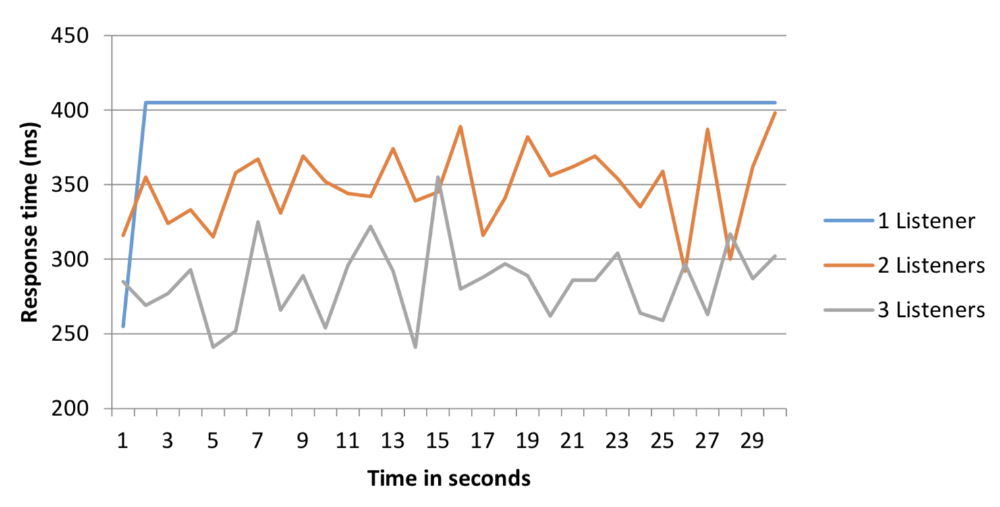
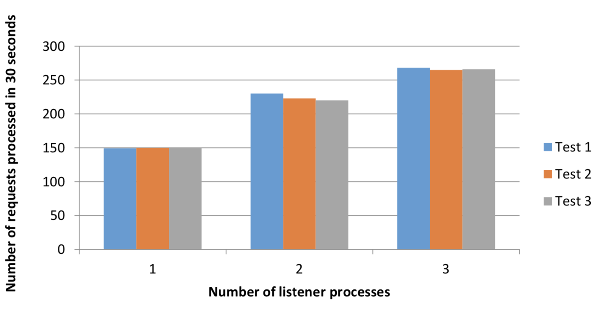
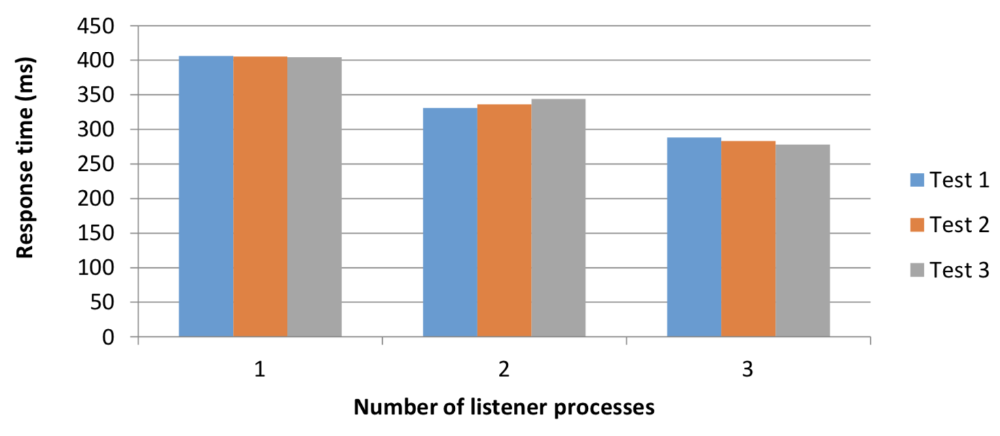
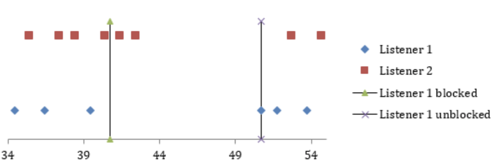

White paper
{: #wp-brand}

# Socket sharding with kdb+ and Linux

by [Marcus Clarke](#author)
{: .wp-author}


When creating a new TCP socket on a Linux server several options can be set which affect the behavior of the newly-created socket. One of these options, `SO_REUSEPORT`, allows multiple sockets to bind to the same local IP address and port. Incoming connection requests to this port number are allocated by the Linux kernel to a listening process, allowing user queries to be spread across multiple processes while providing a single connection port to users and without requiring users to go through a load balancer.

This feature is available as ‘socket sharding’ in the 3.5 release of kdb+. Socket sharding has several real-world applications including simple load balancers that can be adjusted dynamically to handle increased demand and rolling releases of updated processes in kdb+ systems. In this paper, we will investigate a number of scenarios where kdb+ processes are running with this option enabled.

On Linux systems, the `SO_REUSEPORT` option was introduced in kernel version 3.9, so the commands in the examples below will fail if run on an older version of Linux.


## Enabling the `SO_REUSEPORT` socket option in kdb+

To enable socket sharding in kdb+, we use the reuse port parameter ‘rp’ along with the port number. This can be done in either of the following ways:

Via the [command line](../../basics/cmdline.md#-p-listening-port) when starting a kdb+ process:

```bash
$ q -p rp,5000
```

Or from [within the q session](../../basics/syscmds.md#p-listening-port):

```q
q)\p rp,5000
```

This will enable the `SO_REUSEPORT` option on port 5000 and we can
define this on multiple q processes.

Attempting to assign the same port number that is already in use
without enabling the `SO_REUSEPORT` socket option would result in the
following error:

```q
q)\p 5000
'5000: Address already in use
```

In addition to this, the first process to open the port must use the `rp` option to allow future processes to also use this port.

:fontawesome-regular-hand-point-right:
Releases: [Changes in 3.5](../../releases/ChangesIn3.5.md#socket-sharding)


## Basic sharding implementation in kdb+

This example demonstrates how incoming connections are distributed when socket sharding is enabled. First, we started four processes listening on the same port number by enabling the `SO_REUSEPORT` socket option.

```q
q)//Set port number to 5000
q)\p rp,5000
```

A fifth q process, acting as a client, was started and multiple connections were opened to port 5000.

```q
q)h:()
q)
q)//Open 1000 connections to port 5000
q){h,:hopen `::5000}each til 1000
```

To inspect the assignment ordering of the connections, the difference between process IDs was checked across each handle.

```q
q)//Compare pid of consecutive connections
q)differ{x".z.i"}each h
10111010110110100100...
```

The presence of `0b`s in the output above indicates that two connections were opened to the same server consecutively. However, the connections were distributed evenly across the processes running with socket sharding enabled:

```q
q)//Number of connections opened to each server 
q)count each group {x ".z.i "}each h
32219| 250
32217| 257
32213| 245
32215| 248
```

The connection distribution is roughly even between processes with splits of 25%, 25.7%, 24.5% and 24.8%.


## Adding more listeners on the fly

In this example, the client process opened a connection to a server process listening on a port with socket sharding enabled and made an asynchronous request for data. The asynchronous response from the server then closed the connection. It performed this operation on a timer set to run once per second.

The client (connecting) process:

```q
//Table to store a number of time values for analysis 
messages:([]sendTime:();receiveTime:();timeTaken:())

//Timer function to record initial time, open handle to 
//gateway process, send an asynchronous message to the 
//gateway, then send an asynchronous callback back to the q)client
.z.ts:{
  st:.z.T; 
  h:hopen 5000; 
  (neg h)({(neg .z.w)({(x;.z.T;.z.T-x;hclose .z.w)}; x)}; st) }

//Set asynchronous message handler to update our table 
//with time recordings
.z.ps:{0N!list:3#value x;`messages insert list}

//Start timer function to run every 1 second
\t 1000
```

On the listener process, the asynchronous message handler [`.z.ps`](../../ref/dotz.md#zps-set) was defined to sleep the process for 2 seconds before executing the request. This was done to ensure a minimum processing time of 2 seconds for each incoming request.

```q
//Set port as 5000, with SO_REUSEPORT enabled
\p rp,5000

//Counter variable to see how many messages each listener received
cnt:0

//sleep for 2 seconds and increment counter by 1 
.z.ps:{system "sleep 2"; value x; cnt+:1;}
```

To begin, we started with one listener process receiving connections for a period of one minute. After one minute a second listener was started and after a further minute, a third listener was brought up, with all three listening on the same port.

```q
q)1#messages
sendTime     receiveTime  timeTaken 
--------------------------------------
19:34:10.514 19:34:12.517 00:00:02.003

q)//Normalise data into 3 distinct 1 minute buckets by 
q)//subtracting 10.514 from sendTime column
q)select `time$avg timeTaken by sendTime.minute 
    from update sendTime-00:00:10.514 from messages
second  | timeTaken
--------| ------------
19:34:00| 00:00:03.909
19:35:00| 00:00:03.494
19:36:00| 00:00:02.628
```

minute | number of listeners | average number of requests processed over 3 tests | weighted average response time over 3 tests
:-----:|:-:|:-----:|:-----:
1      | 1 | 31    | 3.909
2      | 2 | 42.33 | 3.356
3      | 3 | 55    | 2.607

<small>_Table 1: Requests processed and response time when listeners are
added on the fly 1 minute apart_</small>

When all incoming connections were sent to just one listener process the response time was consistent because the connecting process must wait until the server has completed processing the previous request.

As more listener processes were added, the response times were reduced and the number of requests processed increased. This was due to the Linux kernel assigning incoming connections to processes that were not blocked by the 2-second sleep at the time of the connection request.


## Sending a large volume of requests

The previous example focused on sending queries that take a long time to process. In this example, we simulated sending a large volume of requests to one, two and three listeners, where each request is completed relatively quickly.

The client in this example is the same client with one difference – the timer function runs every 100 ms instead of every second.

```q
//Start timer function to run every 100 milliseconds 
\t 100
```

The listener code was also altered, to sleep for 0.2 seconds instead of 2 seconds.

```q
//Set port as 500, with SO_REUSEPORT enabled
\p rp,5000

//Timer function to send process to sleep for 200
//milliseconds
.z.ps:{system "sleep 0.2"; value x}
```

The results here also closely followed those in the previous section, with a significant improvement seen when sending queries to multiple listeners.

<br>
<small>_Figure 1: Average response time in one-second windows when routing
to one, two and three listeners_</small>

Due to a kdb+ process being single-threaded, messages sent to a single listener process have a consistent average response time. The high variance in response time for 2 and 3 listeners (Figure 1) is due to the fact that if multiple connections are opened to the same listener consecutively, the processing time will be longer than if successive connections are allocated to different listeners.

<br>
<small>_Figure 2: Number of requests processed when routing to one, two and
three listeners_</small>

Despite the high variance in Figure 1 for two and three listeners, we see the overall number of requests processed is higher, compared to one listener (Figure 2). The overall response time was also much improved as can be seen in Figure 3 below

<br>
<small>_Figure 3 Response time when routing to one, two and three
listeners_</small>


## Routing connections to multiple listeners when one is busy

In this example, we started two listener processes on the same port number with the `rp` socket option. The time at which a listener receives a message and the message ID was stored in a table for analysis.

```q
//Set port number to 5000
\p rp,5000

//Create table to store time and message counter 
messages:([]time:();counter:())

//Define synchronous message handler to store time and 
//message count in messages table
.z.pg:{`messages insert (.z.T;x)}
```

A third q process, acting as a client, made connection requests to the listening processes, issued a synchronous query and then closed the connection. Outgoing messages were assigned an ID based on a counter variable.

```q
cnt:0

.z.ts:{cnt+:1; h:hopen 5000; h(cnt); hclose h}

\t 1000
```

During this simulation, we blocked one of the processes listening on port 5000 for 10 seconds.

```q
q)//Block the process by sending it to sleep for 10 seconds 
q)0N!.z.T; system "sleep 10"
12:15:40.723
```

<br>
<small>_Figure 4: Graphical representation of the timeline of requests from
the client to server processes_</small>

We can see that after blocking listener 1, the next two connections were allocated to listener 2. As listener 2’s main thread was not blocked, these messages were processed immediately. The following connection attempt was routed to listener 1, which was blocked. Due to the process being busy, the client hangs until this connection is established. When the listener was no longer blocked, the connection was established and messages continue to be processed as normal.


## Minimizing downtime with rolling updates

This example simulates a situation where, in order to upgrade a kdb+ process’ source code, the process must be restarted.

This script will run a simulated HDB process that takes 30 seconds to load, running with socket sharding enabled.

```q
\p rp,5000

stdout:{0N!(string .z.T)," : ",x}

.z.po:{stdout "Connection established from handle ",string x;}
.z.pc:{stdout "Connect lost to handle ",string x;}

stdout "Sleeping for 30 seconds to mimic HDB load"
system "sleep 30"

stdout "HDB load complete"
```

This script runs a process which connects to the above HDB.

```q
stdout:{0N!(string .z.T)," : ",x}

.util.connect:{
  tms:2 xexp til 4;
  while[(not h:@[hopen;5000;0]) and count tms;
    stdout "Connection failed, waiting ", 
      (string first tms), " seconds before retrying...";
    system "sleep ",string first tms;
    tms:1_tms;
  ];
  $[0=h;
    stdout "Connection failed after 4 attempts, exiting.";
    stdout "Connection established"]; 
  h }

.z.pc:{
  stdout "Connection lost to HDB, attempting to reconnect..."; 
  .util.connect[] }

h:.util.connect[]
```

One HDB process and one client were started. The HDB process prints the following:

```q
"04:04:16.628 : Sleeping for 30 seconds to mimic HDB load" 
"04:04:46.632 : HDB load complete"
"04:04:46.632 : Connection established from handle 4"
```

The connecting process outputs the following:

```q
"04:04:18.329 : Attempting to open connection"
"04:04:46.632 : Connection established"
```

As we can see, the connecting process had to wait 28 seconds to successfully connect as it cannot establish a connection until HDB load has completed. As a result of this, if the HDB requires a restart there will be a period of time where the service is unavailable.

However, since the HDB script enables the `rp` socket option, we were able to start a second HDB on the same port while the first was running:

```q
"04:05:05.975 : Sleeping for 30 seconds to mimic HDB load" 
"04:05:35.978 : HDB load complete"
"04:05:56.521 : Connection established from handle 4"
```

Once both HDBs are running, the first was stopped. This disconnected the client, causing an attempt to reconnect to the same port.

```q
"04:05:56.520 : Connection lost to HDB, attempting to reconnect..."
"04:05:56.520 : Attempting to open connection" 
"04:05:56.521 : Connection established"
```

The reconnect attempt immediately connected resulting in minimal downtime.


## Conclusion

In this white paper, we demonstrated the set-up and use of socket sharding in kdb+ as well as investigating several example scenarios.

From results generated throughout this paper, it is evident that there are both pros and cons of using socket sharding in kdb+. If processes listening on the sharded socket are all running with the same performance, socket sharding can reduce the response time for requests to clients and processing load on a listener process.

As the processes are all listening on the same port, clients do not need configuration changes in order for connection requests to be assigned to new servers.

This could be beneficial for gateway requests. If the response time slows (due to performance-intensive queries) another gateway process can be started up. This would result in a portion of the connection requests being routed to the new gateway. However, the requests will not be assigned in a round-robin manner so busy servers will affect some client connections.

Finally, we explored easy rolling upgrades of existing processes while keeping downtime to a minimum. New versions of a system’s kdb+ processes can be started while current processes are still online. Once initialization is complete, with open ports, the processes from the older version are shut down and the disconnected client’s reconnect logic would then automatically re-establish a connection to the new process.

[:fontawesome-solid-print: PDF](/download/wp/socket-sharding.pdf)


## Author

**Marcus Clarke** is a kdb+ consultant for KX and has worked at a number of leading financial institutions in both the UK and Asia. Currently based in New York, he is designing, developing and maintaining a kdb+ system for multiple asset classes at a top-tier investment bank.

