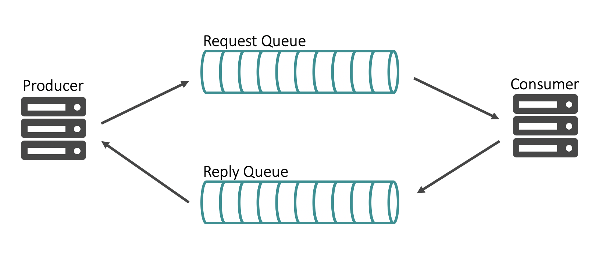

White paper
{: #wp-brand}

# Publish-subscribe messaging with Solace

by [Himanshu Gupta](#author)
{: .wp-author}


Message brokers have been around for decades and are deployed in most, if not all, large enterprises. Like any technology that has been around for so long, message brokers have seen their fair share of transformation, especially in their capabilities and use cases.

This paper covers different ways applications communicate with each other, the publish/subscribe (pub/sub) messaging pattern and its advantages, benefits of implementing pub/sub with kdb+, and finally, how you can implement pub/sub with kdb+ using Solace’s PubSub+ event broker.

Message brokers, or event brokers as they are commonly known these days, form the middle layer responsible for transporting your data. They differ from your databases: they are not meant for long-term storage. Event brokers specialize in routing your data to the interested applications. Essentially, event brokers allow your applications to communicate with each other without having to worry about data routing, message loss, protocol translation, and authentication/authorization.


## Why do processes communicate with each other?

Monolithic applications were big pieces of software that rarely worried about other applications and were largely self-contained. Most if not all of the business logic and interactions with other applications was encapsulated in a single gigantic application. 

The monolithic architecture had its advantages: it allowed full control of the application without having to rely on other teams. It also simplified some things since your application did not have to worry about interacting with other applications. When it came to deployment, all you had to do was roll out this one (albeit giant) piece of code. 

However, as business and applications grew, the monolithic architecture started showing several pain points. In particular, it did not scale well. It was difficult to manage, troubleshoot, and deploy. Adding new features became a tedious and risky task and put the entire application at risk. 

Many companies have started decomposing monolithic applications into smaller components or services where each application aligns with a business unit or service. Several companies have broken down applications even further into microservices, which are small-scale applications meant to manage one task only.  

As applications were broken down, demand grew for a way for them to interact with each other. Applications need to communicate with other applications to share data and stay in sync. Where a monolithic application could do everything itself, multiple applications now need to rely on each other and must share data to accomplish that. 

This is just one example of why applications need to talk to each other. There are many others but at the core of it, each system architecture consists of multiple types of applications – databases, caches, load balancers, API gateways etc, which they cannot exist in isolation. They need to talk to each other. Most applications need to store/retrieve data into/from a database. Most Web applications are a front end with a load balancer that routes Web traffic to various backend servers. These applications communicate with each other to make the overall architecture work. 

But how? 


### Interprocess communication

Applications directly communicating with each other is known as [interprocess communication](../../basics/ipc.md) (IPC). A typical kdb+ architecture consists of several kdb+ processes sharing data with each other using IPC. A kdb+ server process listens on a specific port; a client kdb+ process establishes a connection with the server process by opening a handle:

```q
q)h:hopen `::5001 
q)h "3?20"  
1 12 9 
q)hclose h
```


### Synchronous vs asynchronous

As the example above shows, applications can communicate with each other using IPC. Specifically, in q, we can open a handle to a process, execute a remote query, and then close the handle. The previous example demonstrates how **synchronous** communication works. 

There are two popular ways of communication: synchronous and asynchronous. Both allow applications to communicate with each other, but with a subtle yet powerful difference. In synchronous communication, when an application issues a request or executes a remote query, it cannot do anything else in the meantime but wait for the response. Conversely, with asynchronous communication, your application is free to continue its operations while it waits for a response from the remote server. 

In q, you can execute remote queries asynchronously using a negative handle:

```q
q)h:hopen `::5001 
q)(neg h)  "a:3?20"  / send asynchronously, no result 
q)(neg h)  "a"  / again no result 
q)h "a"  / synchronous, with result  
0  17  14
```

Asynchronous communication is extremely powerful because it frees up resources to be utilized for additional processing instead of sitting idle waiting for a response from the server. However, there are some use cases when you must use synchronous communication, especially when you need to be certain your remote query was executed by the server. For example, when authenticating users, you would use synchronous requests to make sure the user is authenticated before giving her access to your system.

But for the most part it is best to use asynchronous messaging.


### Queueing

As applications scale, they are responsible for processing large quantities of messages. As these messages are sent to your application, in some cases, they are expected to be processed in order whereas in other cases, the order is not important. For example, an alerting system responsible for sending a push notification every time some value crosses a threshold might not care about the order of events. Its job is to simply check whether the value is above or below a threshold and respond. On the other hand, a payment-processing application at a bank certainly cares about message order. It would not want to let a customer continue withdrawing money from their account if they had already withdrawn all the money earlier. 

Queues are data structures used to order messages in sequence. Queue semantics make it a FIFO (First In First Out) data structure in which events are dequeued in the order they were enqueued. For example, if you have multiple transaction orders from 10:00am to 11:00am being enqueued, they will be consumed by a subscriber in that order starting with the first transaction at 10:00am. 


Besides providing sequential ordering, queues also provide persistence. A subscriber meant to process order transactions and persist them to a database might crash and not come back online for 10 minutes. The orders generated in those 10 minutes are still required to be processed albeit at a delay. A queue will persist those messages and make them available to the subscriber once it comes back online to avoid any data loss. 

Queues are commonly used in a pub/sub architecture (see below) to provide ordering and persistence.


### Request/reply

Communication can be either unidirectional or bidirectional. The IPC example above is a unidirectional example where one process sends a message to another process directly. Occasionally, you require the communication between your processes to be bidirectional, where the second process is required to provide you with a response. For example, issuing a request to query a database will provide you with a response consisting of the result of your query.  

For such scenarios, the asynchronous request/reply pattern uses queues to store the requests and responses. In this version, the first application issues a request, which is persisted in a queue for the second application to consume from. The payload of the message could contain a `replyTo` parameter which tells the second application to which queue it should publish the response. The first application is listening to the queue and consumes the message whenever it is available.



Asynchronous request/reply provides benefits of both bi-directional communication and asynchronous messaging.


## Pub/sub with kdb+

Publish/subscribe supports bi-directional asynchronous communication from many-to-many applications. It is commonly used to distribute data between numerous applications in enterprises. The pub/sub messaging pattern can be implemented through the use of an event broker. In such an architecture, the event broker acts as an abstraction layer to decouple the publishers and consumers from each other. 


At a high level, the pub/sub messaging pattern consists of three components:

**Publishers** 

: publish data asynchronously to topics or queues without worrying about which process will consume this data

**Consumers**

: consume data from topics or queues without worrying about which process published the data

**Event Broker**

: connects to publishers and consumers; they do not connect to each other. 

With so many messaging patterns to choose from, why invest time and resources in implementing the pub/sub messaging pattern in your [architecture](../../architecture/index.md)? Pub/sub has numerous advantages that make your architecture efficient, robust, reliable, scalable and cloud-ready.


### Efficient data distribution

Data is the lifeline of your kdb+ stack. It flows from feed handlers to tickerplants to downstream subscribers and then eventually to historical databases. However, kdb+ stacks do not operate in isolation. Depending on how the company is structured, there might be a central Market Data team responsible for managing connectivity with external data vendors and writing Java feed handlers to capture market data and then distributing it over an event broker for other teams to consume. 

The Tick Data team can be just one of many downstream consumers interested in all or subset of the data published by the Market Data team. Similarily, the Tick Data team can enrich the raw data by generating stats and distributing it to other downstream consumers via the same event broker. 

The key idea here is that the publisher only has to worry about publishing data to the event broker and not get bogged down in the details of how many downstream consumers there are, what their subscription interests are, what protocol they want to use and so forth. This is all responsibility of the event broker. Similarly, the subscribers do not need to worry about which publisher they need to connect to. They continue to connect to the same event broker and get access to real-time data. 

Moreover, there are events that can lead to data spikes and impact applications. For example, market volumes were multiple times over their usual daily average in March 2020 during Covid-19. Anyone not using an event broker to manage data distribution would have been impacted with sudden spikes in data volume. Brokers provide shock absorption that deal with sudden spikes to make your architecture robust and resilient.


### Avoid tight coupling

Processes directly communicating with each other creates a tightly-coupled architecture where each process is dependent on one or more other processes. Such an architecture gets harder to maintain as it scales, since it requires more coordination between processes. 


In the context of kdb+, sharing data between your multiple tickerplants, RDBs and stats processes makes them depend on each other. Stats process responsible for consuming raw data directly from a RDB and generating stats on that raw data makes it dependent on the RDB. If something were to happen to the RDB process, it will also impact the stats process. Additionally, if a change were required in the RDB process, your developers will need to ensure that it does not impact any downstream processes that depend on the RDB process. This prevents you from making quick changes to your architecture. Each change you make introduces risks to downstream processes.

Instead, each kdb+ process, whether it be an RDB or stats process, can communicate via an event broker using the pub/sub messaging pattern. The tickerplant can publish data to the event broker without worrying about connection details of downstream subscribers and their subscriptions. Both RDB and stats process can subscribe for updates from the event broker without knowing a thing about the tickerplant. The stats process can generate minutely stats and then republish that data to event broker on a different topic allowing other processes to subscribe to those stats.

Doing so keeps your kdb+ processes independent, allows them to be flexible so they can easily adapt to new requirements, and reduces possibility of introducing bugs accidentally. 


### Easily integrate other applications with kdb+

Most event brokers support a wide range of APIs and protocols, which means different applications can exploit these APIs, which kdb+ may or may not natively support, to publish or consume data. For example, our stats process from earlier is still consuming raw data from the event broker, generating stats on that data and then republishing it to a different topic. Now we have the PNL team interested in displaying these stats on a dynamic web dashboard using JavaScript. They can easily use the event broker’s JavaScript API to consume the stats live and display on a shiny HTML5 dashboard without having to learn anything about kdb+. 

For example, your company might have IoT devices producing a lot of timeseries data that needs to be captured in your kdb+ database. IoT devices typically use the lightweight MQTT protocol to transfer events. Using an event broker that supports the MQTT protocol would allow you to easily push data from your IoT devices to the event broker and then persist it in a kdb+ database to be analyzed in real time or later. 


Using an event broker puts the kdb+ estate at the center of your big data ecosystem and allows different teams to explit its capabilities by integrating with it. Don’t let your kdb+ estate sit in isolation!  


### Zero message loss

Not all events are equal. Some events do not matter at all and are not worth capturing. Some, such as market data, are important but there is tolerance for some loss. Then there are some events, such as order data, that are extremely important and cannot be dropped.  A PNL dashboard can tolerate some loss of  data, but an an execution management system losing order data can result in monetary loss. 

Where there is zero tolerance for message loss, using an event broker provides that guarantee. Event brokers use local persistence and acknowledgements to provide a guaranteed flow between publishers and subscribers. Publishers can publish data to the event broker and receive an acknowledgement back when broker has persisted the data locally. When a subscriber comes online and requests that data, it will receive it and will provide an acknowledgement back to the broker letting it know it is safe to delete the data from its local storage. 


### Global data distribution and data consolidation via event mesh

Very rarely does data just sit in one local data center, especially at global financial firms using kdb+ for the tick data store. As discussed earlier, there are feed handlers deployed globally, potentially co-located at popular exchanges. Some institutions even have their kdb+ instances co-located to capture the data in real time with ultra-low latency, and then ship it back to their own datacenters. 

Storing your tick data in a colo is an expensive process, especially when eventually it needs to be shipped back to your data center to be analyzed or accessed by other applications. 

A cost-effective alternative is to use event brokers deployed locally to form an _event mesh_: a configurable and dynamic infrastructure layer for distributing events among decoupled applications, cloud services and devices. It enables event communications to be governed, flexible, reliable and fast. An event mesh is created and enabled through a network of interconnected event brokers.

Modern event brokers can be deployed in different regions and environments (on-premises or cloud) yet still be connected together to move data seamlessly from one environment in one region, such as a colo in New Jersey, to a different environment in another region, such as an AWS region in Singapore. 

Using an event mesh to distribute your data out of colo to your own data center/s in different regions provides you with a cost-effective way to store your tick data in your core tick data store in your datacenter instead of at colos. You can consolidate data from different colos in different regions into your central tick data store. 


Conversely, you might want to localize your central tick data stores for your clients, such as researchers, spread across the globe to provide them with access to data locally and speed up their queries. Again, this can be done by distributing the data over an event mesh formed by event brokers deployed locally. 


### Cloud migration

In the last decade, there has been a strong push to adopt cloud across industries. While many companies of various sizes and in different industries have chosen to fully adopt cloud, global financial companies are still in the process of migrating due to their size and strict regulatory requirements. With the rise in cloud adoption, there has been a rise in multiple vendors offering cloud services as well, mainly AWS, GCP, and Azure. Again, many companies have decided to pick one of these popular options, but other companies have chosen to go with either hybrid cloud or multi-cloud route. 

With hybrid cloud, companies still have their own datacenter but limit its use to critical applications only. For non-critical applications, they have chosen to deploy their applications in the cloud. Other companies have decided to go with not just one but at least two cloud providers to avoid depending heavily on just one. As you can see, this adds complexity to how data is shared across an organization. No longer do you only have to worry about applications being deployed in different geographical regions but also across multiple environments. Again, this is where an event mesh (see above) can help. 


As you gradually migrate your applications from on-premises to the cloud, you will also run two instances of your application in parallel for some time period. Again, you can use an event broker to share the data easily between the two processes in real time. 

Once you have migrated some applications, your central kdb+ tick data store located in your local datacenter in Virginia needs to be able to share data with the new on-demand kdb+ instances in AWS spun up by your researchers in Hong Kong running machine-learning algorithms across real-time tick data. And you need to ensure the data is shared in a cost-effective and federated manner.

Ideally, data should only traverse from one environment to another if it is requested. You should avoid unnecessary network costs and only replicate data from one environment to another if there are active subscribers. And from a security point of view, you do not want to replicate sensitive data to environments unless required.


### Restricting access

If you have worked with market data before, you know how expensive it can be and how many market data licenses you need to be aware of and navigate when providing users and applications access to real-time market data. Market data access is limited by strict licenses so to avoid fees by data vendors and exchanges one needs to be careful of not just which applications are using the data but who has _potential_ access to the data. 


Only the applications that require the data and are authorized to access the data should be able to consume that data. This is where Access Control Lists (ACLs) help. Event brokers allow you to lock down exactly which applications have access to the data in a transparent manner. You can control what topics publishers can publish to and what topics subscribers can subscribe from to make sure no one is accessing any data they are not authorized to access. For example, if all the market data in our organization is published to topics of this topology: `EQ/{region}/{exchange}/{stock}` we can restrict applications to US equities data by limiting them to the `EQ/US/>` hierarchy. Additionally, I can grant a subscriber access to only data from the New York Stock Exchange (NYSE) as: `EQ/US/NYSE/>`. 

Having strong ACL profiles provides transparency and strong security. And with market data, it helps avoid an expensive bill from exchanges and market data vendors!


## Implement with kdb+ and Solace


### Solace PubSub+ event broker

Before picking a suitable broker for your kdb+ stack, gather all your requirements and cross reference them with all the features provided by different brokers. 

Solace’s PubSub+ broker is heavily used in financial services. It supports open APIs and protocols, dynamic topics, wildcard filtering, and event mesh. Its support for high-throughout messaging and low latency makes it a suitable companion for kdb+. 
Some core features:

Rich hierarchical dynamic topics and wildcard filtering

: PubSub+ topics are dynamic, so you do not need to create them manually. They are hierarchical, and consumers can use wildcards to filter data on each of the levels in the topic. 

In-memory and persistent messaging

: Use in-memory (direct) messaging for high throughput use-cases and persistent (guaranteed) messaging for critical messages such as order data. 

Event mesh

: Distribute data dynamically across regions and environments by linking different PubSub+ brokers to form an event mesh.


KX recently published an open-source [kdb+ interface to Solace](../../interfaces/solace/) as one of its Fusion interfaces. This interface, or API, makes it extremely easy to use PubSub+ event broker from within your q code. 

Currently, the API supports:

-   Connecting to a PubSub+ instance
-   Creating and destroying endpoints
-   Performing topic-to-queue mapping with wildcard support
-   Publishing to topics and queues
-   Subscribing to topics and binding to queues
-   Setting up direct and guaranteed messaging
-   Setting up request/reply messaging pattern


### Spin up a PubSub+ instance

The easiest way to deploy a PubSub+ instance is to sign up for a [Solace Cloud account](https://console.solace.cloud/login/new-account) and spin up a 60-day free instance. 

Alternatively, you can setup a local [PubSub+ instance via Docker](https://docs.solace.com/Solace-SW-Broker-Set-Up/Docker-Containers/Set-Up-Docker-Container-Image.htm). PubSub+ Standard Edition is free to use in production as well. 

On Solace Cloud, we can create a free service very quickly by selecting the ‘free’ tier and picking AWS as our cloud provider. Below I have selected `US East` as my availability zone and named my service `demo`. Because this is a free tier, we are given a very lightweight PubSub+ instance with the following configuration:

-   50 connections
-   1GB storage
-   4Mbps network throughput
-   Shared tenancy (as opposed to dedicated)
-   Single node deployment (as opposed to high availability)


Because we have shared tenancy, the service will be up in just few seconds. 


With a PubSub+ instance up and running, we are ready to install the kdb+ interface to Solace. 

:fontawesome-brands-github: 
[KxSystems/solace](https://github.com/)

We will be using it on an AWS EC2 instance. 

:fontawesome-brands-youtube:
[Installation instructions](https://www.youtube.com/watch?v=_cGnkrim4K8) 


### Connect to PubSub+ from q

With the API installed, you are ready to start using it from q. 
First connect to the Solace Cloud service created in the previous section. 

The API provides useful examples to help you get started. 

:fontawesome-brands-github: 
[KxSystems/solace/examples](https://github.com/KxSystems/solace/blob/master/examples)

To establish a connection, we can use the `sol_capabilities.q` example. 
But first add our connection information to `sol_init.q`.

This file contains several initialization settings, including several connection defaults. It is also responsible for defining and registering several callback functions.

You can find connection details for your Solace Cloud service in the _Connect_ tab.


You will need `Username`, `Password`, `Message VPN`, and `SMF Host information`. Update the relevant values in `sol_init` with these details:

```txt
default.host :"mr2ko4me0p6h2f.messaging.solace.cloud:20640"
default.vpn  :"msgvpn-oyppj81j1ov"
default.user :"solace-cloud-client"
default.pass :"v23cck5rca6p3n1eio2cquqgte"
```

Once we have done that, we can test our connection:
```txt
(kdb) [ec2-user@ip-172-31-70-197 examples]$ q sol_capabilities.q -opt SESSION_PEER_SOFTWARE_VERSION
KDB+ 3.6 2019.08.20 Copyright (C) 1993-2019 Kx Systems
l64/ 2(16)core 7974MB ec2-user ip-172-31-70-197.ec2.internal 172.31.70.197 EXPIRE 2021.05.10 himoacs@gmail.com KOD #4170793

### Registering session event callback
### Registering flow event callback
### Initializing session
SESSION_HOST    | mr2ko4me0p6h2f.messaging.solace.cloud:20640
SESSION_VPN_NAME| msgvpn-oyppj81j1ov
SESSION_USERNAME| solace-cloud-client
SESSION_PASSWORD| v23cck5rca6p3n1eio2cquqgte
[22617] Solace session event 0: Session up
### Getting capability : SESSION_PEER_SOFTWARE_VERSION
`9.3.1.5
### Destroying session
```

We were able to register a session callback and flow event callback, initialize a session, get a confirmation that our session is up, get the PubSub+ version our Solace Cloud service is running and finally, destroy the session before exiting. 


### Publish messages to PubSub+

In PubSub+, you can either publish to a topic or a queue. 

topic

: facilitates the pub/sub messaging pattern because it allows multiple subscribers to subscribe to the topic

queue

:  allows only one consumer to consume from that queue and hence implements a point-to-point messaging pattern

We are more interested in the pub/sub messaging pattern, so we publish to a topic. 

PubSub+ offers two service qualities.

Direct messaging

: Messages are not persisted to disk and hence, are less reliable but offer higher throughput and lower latency. 

Persistent messaging

: Also known as _guaranteed messaging_, involves persistence and acknowledgements to guarantee zero end-to-end message loss. 

The additional overhead of persistence and acknowledgements makes persistent messaging more suitable for critical data distribution in low throughput use-cases. For example, you should use direct messaging for market data distribution and guaranteed messaging for order flows.

The `sol_pub_direct.q` example shows how to publish a direct message.

The example loads the `sol_init.q` script and calls the `.solace.sendDirect` function with `topic` and `data` as parameters:

```q
\l sol_init.q

-1"### Sending message";
.solace.sendDirect . 0N!params`topic`data;

exit 0
```

Let’s publish `"Hello, world"` to the topic `data/generic/hello`.

```q
(kdb) [ec2-user@ip-172-31-70-197 examples]$ q sol_pub_direct.q -topic "data/generic/hello" -data "Hello, world"
### Sending message
`data/generic/hello`Hello, world
### Destroying session
```

Similarly, we can publish a guaranteed message by calling the function `.solace.sendPersistent` as shown in the `sol_pub_persist.q` example.


### Create a queue and map topics to it 

Just as you can publish data to either topics or queues, you can also consume data by either subscribing to a topic or instead mapping one or more topics to a queue and binding to that queue. Subscribing directly to a topic corresponds to direct messaging and is used in high-throughput, low-latency use cases, since there is no additional overhead of persistence and acknowledgements. 

For a higher service quality, promote direct messages to persistent messages by using _topic-to-queue mapping_. Topic-to-queue mapping is simply using a queue and mapping one or more topics to that queue to enqueue all of the messages sent to its topics. Queues provide persistence and ordering across topics so if the subscriber disconnects, no data is lost. 

The kdb+ interface to Solace allows you to create queues, map topics to them and destroy queues as well. 

This is nicely demonstrated in the examples 

```txt
q sol_endpoint_create.q         create a queue
q sol_topic_to_queue_mapping.q  map topics to it 
q sol_endpoint_destroy.q        destroy the queue once done
```

Create a queue `hello_world`.

```txt
(kdb) [ec2-user@ip-172-31-70-197 examples]$ q sol_endpoint_create.q -name "hello_world"
### Creating endpoint
### Destroying session
```

In the PubSub+ UI we can confirm our queue was created. 


Now map the `data/generic/hello` topic to it.

```txt
(kdb) [ec2-user@ip-172-31-70-197 examples]$ q sol_topic_to_queue_mapping.q -queue "hello_world" -topic "data/generic/hello"
### Destroying session
```

Not much output but once again, confirm via PubSub+ UI. 


Rerun the previous example to publish data to the same topic (`data/generic/hello`) and see if it gets enqueued in our newly created queue.

```txt
(kdb) [ec2-user@ip-172-31-70-197 examples]$ q sol_pub_direct.q -topic "data/generic/hello" -data "Hello, world"
### Sending message
`data/generic/hello`Hello, world
### Destroying session
```

Check the queue again. This time we find one message enqueued.


Delete the queue by calling `.solace.destroyEndpoint` as shown in `sol_endpoint_destroy.q`.

```q
(kdb) [ec2-user@ip-172-31-70-197 examples]$ q sol_endpoint_destroy.q -name "hello_world"
### Destroying endpoint
### Destroying session
```


### Subscribe to messages from PubSub+

The example `sol_sub_direct.q` shows how you can subscribe to a topic directly. When subscribing, we need to define a callback function which will be executed whenever a message is received. In this example, it simply prints the message to console. The actual subscription is implemented via the `.solace.subscribeTopic` function. The callback function, `subUpdate`, is registered via the `.solace.setTopicMsgCallback` function. 

Start a subscriber and have it subscribe to topic `data/generic/hello`.

```txt
(kdb) [ec2-user@ip-172-31-70-197 examples]$ q sol_sub_direct.q -topic "data/generic/hello"
### Registering topic message callback
### Subscribing to topic : data/generic/hello
### Session event
eventType   | 0i
responseCode| 0i
eventInfo   | "host 'mr2ko4me0p6h2f.messaging.solace.cloud:20640', hostname 'mr2ko4me0p6h2f.messaging.solace.cloud:20640' IP 3.88.1 (host 1 of 1) (host connection attempt 1 of 1) (total connection attempt 1 of 1)"
```

Your q session is still running, and awaiting messages.

To publish a message, open a new terminal and run the earlier publishing example.

```txt
(kdb) [ec2-user@ip-172-31-70-197 examples]$ q sol_pub_direct.q -topic "data/generic/hello" -data "Hello, world"
### Sending message
`data/generic/hello`Hello, world
### Destroying session
```

As soon as this message is published, the subscriber running in our original terminal will receive the message and print it to the console.

```q
### Message received
payload  | "Hello, world"
dest     | `data/generic/hello
isRedeliv| 0b
isDiscard| 0b
isRequest| 0b
sendTime | 2000.01.01D00:00:00.000000000
```

We can see properties of the message such as payload, destination, whether the message is being redelivered, timestamp and so on. 

Instead of subscribing directly to a topic, we can bind to a queue with the topic mapped to it. Use the queue `hello_world` created in the previous section with our topic `data/generic/hello` mapped to it. 

Use the example `sol_sub_persist.q` to bind to a queue. This example resembles `sol_sub_direct.q`, but here we need to send an acknowledgement after receiving the message via `.solace.sendAck`. Bind to a queue via `.solace.bindQueue`.

```q
(kdb) [ec2-user@ip-172-31-70-197 examples]$ q sol_sub_persist.q -dest "hello_world"
### Registering queue message callback
[16958] Solace flowEventCallback() called - Flow up (destination type: 1 name: hello_world)
q### Session event
eventType   | 0i
responseCode| 0i
eventInfo   | "host 'mr2ko4me0p6h2f.messaging.solace.cloud:20640', hostname 'mr2ko4me0p6h2f.messaging.solace.cloud:20640' IP 3.88.1 (host 1 of 1) (host connection attempt 1 of 1) (total connection attempt 1 of 1)"
### Flow event
eventType   | 0i
responseCode| 200i
eventInfo   | "OK"
destType    | 1i
destName    | "hello_world"
```

Run the `sol_pub_direct.q` example again to publish a direct message to the topic `data/generic/hello`. Our consumer should consume it from the queue. 

```q
### Message received
payload      | "Hello, world"
dest         | `hello_world
destType     | 0i
destName     | "data/generic/hello"
replyType    | -1i
replyName    | ""
correlationId| ""
msgId        | 1
```

As soon as you publish the data, it will be enqueued in the queue and then consumed by our consumer bound to that queue. The consumer will print the message and its properties to the terminal. The destination in this example is our queue `hello_world`, not the topic `data/generic/hello` as earlier. `destType` being `0i` tells us it is a queue. A topic is represented by `1i`. 

We are not restricted to a single consumer. To fully exploit pub/sub messaging, we can subscribe multiple consumers to the same topic and/or queue. They will get the same message without the publisher having to publish multiple times.


## Example

### Market data simulator

The following example shows how you can distribute market data over Solace PubSub+ and capture that data in real-time in kdb+ using the kdb+ interface to Solace. 

A simple market data simulator in Java generates random L1 market data for some preconfigured securities. It publishes data to PubSub+ topics of this syntax: 

```txt
<assetClass>/marketData/v1/<country>/<exchange>/<sym>
```

For example, AAPL data will be published on `EQ/marketData/v1/US/NASDAQ/AAPL`  and IBM data on `EQ/marketData/v1/US/NYSE/IBM`.

By default, the simulator is configured to publish data for multiple stocks from four exchanges: NYSE, NASDAQ, LSE, and SGX.

Two example messages for AAPL and IBM:

```json
{
"symbol":"AAPL",
"askPrice":250.3121,
"bidSize":630,
"tradeSize":180,
"exchange":"NASDAQ",
"currency":"USD",
"tradePrice":249.9996,
"askSize":140,
"bidPrice":249.6871,
"timestamp":"2020-03-23T09:32:10.610764-04:00"
}

{
"symbol":"IBM",
"askPrice":101.0025,
"bidSize":720,
"tradeSize":490,
"exchange":"NYSE",
"currency":"USD",
"tradePrice":100.5,
"askSize":340,
"bidPrice":99.9975,
"timestamp":"2020-03-23T09:32:09.609035-04:00"
}
```

This specific topic hierarchy is used to exploit Solace PubSub+’s rich topic hierarchy, which provides strong wildcard support and advance filtering logic. 

:fontawesome-solid-globe:
[Topic architecture best practices](https://docs.solace.com/Best-Practices/Topic-Architecture-Best-Practices.htm#mc-main-content "solace.com")

The simulator uses the Solace JMS API to publish direct messages to PubSub+. 
(Solace also offers a proprietary Java API.)

:fontawesome-brands-github:
[himoacs/market-data-simulator](https://github.com/himoacs/market-data-simulator)
<br>
:fontawesome-solid-globe:
[Streaming market data simulator for your projects](http://abitdeployed.com/2020/03/29/streaming-market-data-simulator-for-your-projects/ "abitdeployed.com")


### Real-time subscriber

In a typical kdb+ stack, a market datafeed handler publishes data to a tickerplant which then pushes it to one or more real-time subscribers such as an RDB and/or a stats process. 

Here we implement an RDB to capture real-time updates and insert them in a `prices` table.

How to consume the market data messages being published to PubSub+? We can map topics to a queue and bind to it, or just subscribe directly to a topic. With market data we want to avoid persistence, so we will subscribe directly to a topic.

Solace PubSub+ supports subscriptions to an exact topic, or a generic topic using wildcards. There are two wildcards: 

```txt
*   abstract away one level from the topic
>   abstract away one or more levels
```

Both wildcards can be used together and `*` can be used more than once.

For example, we know our publisher is publishing pricing data to a well-defined topic of the following topology: 

```txt
<assetClass>/marketData/v1/<country>/<exchange>/<sym>
```

This lets our subscriber filter on several fields. For example, we can subscribe to 

```txt
EQ/>                     all equities
*/*/*/*/NYSE/>           all NYSE securities
EQ/marketData/v1/US/>    all US equities
```

The wildcarding is extremely powerful and allows subscribers to receive filtered data rather than filter data themselves. For our example, we will subscribe to equities data from all countries by subscribing to: `EQ/marketData/v1/>`.

In our q code, we define our topic.

```q
topic:`$"EQ/marketData/v1/>";
```

Then we create an empty table called `prices` to store our updates.

```q
prices:flip 
  `date`time`sym`exchange`currency`askPrice`askSize`bidPrice`bidSize`tradePrice`tradeSize!
  `date`time`symbol`symbol`symbol`float`float`float`float`float`float$\:()
```

Define a callback function `subUpdate` to parse incoming JSON market data updates. 

```q
subUpdate:{[dest;payload;dict]
    // Convert binary payload
    a:"c"$payload;   

    // Load JSON to kdb table
    b:.j.k "[",a,"]";

    // Update types of some of the columns
    b:select "D"$date,"T"$time,sym:`$symbol,`$exchange,`$currency,askPrice,
      askSize,bidPrice,bidSize,tradePrice,tradeSize from b;
    // Insert into our global prices table
    `prices  insert b; }
```

Of the three arguments, `payload` is the actual pricing data. `subUpdate` converts the binary payload to characters and loads JSON data into a kdb+ row using `.j.k`; then updates some of the column types and inserts the row in the `prices` table. 

Register the callback function and subscribe to the topic.

```q
.solace.setTopicMsgCallback`subUpdate
.solace.subscribeTopic[topic;1b]
```

That’s it! Full code:

```q
// Listen to a Solace topic and capture all the raw records in real time

// Load sol_init.q which has all the PubSub+ configurations
\l sol_init.q

// Topic to subscribe to
topic:`$"EQ/marketData/v1/>"

// Global table for capturing L1 quotes and trades
prices:flip 
  `date`time`sym`exchange`currency`askPrice`askSize`bidPrice`bidSize`tradePrice`tradeSize!
  `date`time`symbol`symbol`symbol`float`float`float`float`float`float$\:()

-1"### Subscribing to topic : ",string topic;

// Callback function for when a new message is received
subUpdate:{[dest;payload;dict]
  // Convert binary payload
  a:"c"$payload;   
  
  // Load JSON to kdb table
  b:.j.k "[",a,"]";
  
  // Update types of some of the columns
  b:select "D"$date,"T"$time,sym:`$symbol,`$exchange,`$currency,askPrice,
    askSize,bidPrice,bidSize,tradePrice,tradeSize from b;
  // Insert into our global prices table
  `prices insert b; }

// Assign callback function
.solace.setTopicMsgCallback`subUpdate

// Subscribe to topic
.solace.subscribeTopic[topic;1b]
```

With market data simulator running and publishing data, we can run the code above and capture those updates.

```txt
(kdb) [ec2-user@ip-172-31-70-197 examples]$ q rdb.q
### Subscribing to topic : EQ/marketData/v1/>
### Session event
eventType   | 0i
responseCode| 0i
eventInfo   | "host 'mr2ko4me0p6h2f.messaging.solace.cloud:20640', hostname 'mr2ko4me0p6h2f.messaging.solace.cloud:20640' IP 3.88.1 (host 1 of 1) (host connection attempt 1 of 1) (total connection attempt 1 of 1)"
```

We can see our `prices` table has been created and is capturing our market data updates.

```q
q)\a
,`prices
q)10#prices
date       time         sym  exchange currency askPrice askSize bidPrice bidSize tradePrice tradeSize
-----------------------------------------------------------------------------------------------------
2020.09.15 14:47:27.671 AAPL NASDAQ   USD      249.243  640     247.9999 370     248.6215   140
2020.09.15 14:47:27.672 FB   NASDAQ   USD      171.389  140     167.5756 260     169.4823   80
2020.09.15 14:47:27.673 INTC NASDAQ   USD      59.07073 110     58.33693 490     58.70383   280
2020.09.15 14:47:27.674 IBM  NYSE     USD      98.69098 670     98.19876 80      98.44487   140
2020.09.15 14:47:27.674 BAC  NYSE     USD      22.32329 680     22.04598 680     22.18464   410
2020.09.15 14:47:27.674 XOM  NYSE     USD      42.51064 50      42.193   480     42.35182   500
2020.09.15 14:47:27.675 VOD  LSE      GBP      97.71189 210     96.98179 480     97.34684   200
2020.09.15 14:47:27.675 BARC LSE      GBP      92.5173  720     91.13987 710     91.82858   470
2020.09.15 14:47:27.675 TED  LSE      GBP      135.2894 520     135.2894 630     135.2894   390
2020.09.15 14:47:27.676 DBS  SGX      SGD      19.40565 30      19.11673 410     19.26119   500
```

We can see all new updates are being inserted into the table, since the count is increasing.

```q
q)count prices
192
q)count prices
228
q)count prices
240
```

As you can see, it is fairly simple to implement an RDB that consumes data from a PubSub+ broker rather than from from another kdb+ process. 
And multiple processes can consume the data without changing any existing processes. 


### Stats process

Here we build a stats process that generates some meaningful stats from the raw data, every minute, just for US securities. 

Because our publisher (the market data simulator) uses a hierarchical topic, our stats process can easily filter for US equities data by subscribing to the topic `EQ/marketData/v1/US/>`. 

To make things more interesting, once the stats are generated every minute, we will publish them to PubSub+ for other downstream processes to consume. To make things more interesting again, we will also consume from a queue instead of subscribing to a topic.

Create our queue and map the relevant topic to it:

```q
// Market Data queue to subscribe to
subQueue:`market_data
topicToMap:`$"EQ/marketData/v1/US/>"

-1"### Creating endpoint";
.solace.createEndpoint[;1i]
  `ENDPOINT_ID`ENDPOINT_PERMISSION`ENDPOINT_ACCESSTYPE`ENDPOINT_NAME!`2`c`1,subQueue

-1"### Mapping topic: ", (string topicToMap), " to queue";
.solace.endpointTopicSubscribe[;2i;topicToMap]`ENDPOINT_ID`ENDPOINT_NAME!(`2;subQueue)
```

Then, we will create our `prices` table again like we did in previous example but this time, we will also create a `stats` table which will store our minutely stats.

```q
// Global table for capturing L1 quotes and trades
prices:flip
  `date`time`sym`exchange`currency`askPrice`askSize`bidPrice`bidSize`tradePrice`tradeSize!
  `date`time`symbol`symbol`symbol`float`float`float`float`float`float$\:()

// Global table for stats
stats:flip 
  (`date`sym`time,
    `lowAskSize`highAskSize,
    `lowBidPrice`highBidPrice,
    `lowBidSize`highBidSize,
    `lowTradePrice`highTradePrice,
    `lowTradeSize`highTradeSize,
    `lowAskPrice`highAskPrice`vwap)!
  (`date`symbol`minute,
    `float`float,
    `float`float,
    `float`float,
    `float`float,
    `float`float,
    `float`float`float) $\:()
```

Once again, callback function `subUpdate` holds the parsing logic.

```q
subUpdate:{[dest;payload;dict]
    // Convert binary payload
    a:"c"$payload;   

    // Load JSON to kdb table
    b:.j.k "[",a,"]";

    // Send ack back to Solace broker
    .solace.sendAck[dest;dict`msgId];

    // Update types of some of the columns
    b:select "D"$date,"T"$time,sym:`$symbol,`$exchange,`$currency,askPrice,
      askSize,bidPrice,bidSize,tradePrice,tradeSize from b;
    // Insert into our global prices table
    `prices insert b; }
```

As before, incoming messages are parsed and inserted into the `prices` table. Unlike before, we are also acknowledging the messages using `.solace.sendAck`. 

Register the callback function and bind it to our queue.

```q
// Assign callback function
.solace.setQueueMsgCallback`subUpdate

// Bind to queue
.solace.bindQueue
  `FLOW_BIND_BLOCKING`FLOW_BIND_ENTITY_ID`FLOW_ACKMODE`FLOW_BIND_NAME!`1`2`2,subQueue
```

So far, the realtime subscriber simply subscribes to raw updates and writes them to a table. Now, we shall generate minutely stats on raw data from the `prices` table and store those stats in the `stats` table.

```q
updateStats:{[rawTable]
  // Generate minutely stats on data from last minute
  `prices set rawTable:select  from rawTable where time>.z.T-00:01;
  
  min_stats:0!select 
    lowAskSize:    min askSize,     highAskSize:    max askSize,
    lowBidPrice:   min bidPrice,    highBidPrice:   max bidPrice,
    lowBidSize:    min bidSize,     highBidSize:    max bidSize,
    lowTradePrice: min tradePrice,  highTradePrice: max tradePrice,
    lowTradeSize:  min tradeSize,   highTradeSize:  max tradeSize,
    lowAskPrice:   min askPrice,    highAskPrice:   max askPrice,
    vwap:tradePrice wavg tradeSize 
    by date, sym, time:1 xbar time.minute
    from rawTable;
  
  min_stats:select from min_stats where time=max time;  
  
  // Inserts newly generated stats to global stats table
  `stats  insert min_stats;
  
  // Get all the unique syms
  s:exec  distinct sym from min_stats;
  
  // Generate topic we will publish to for each sym
  t:s!{"EQ/stats/v1/",string(x)} each s; 
  
  // Generate JSON payload from the table for each sym
  a:{[x;y] .j.j select  from x where sym=y}[min_stats;];
  p:s!a each s;
  
  // Send the payload
  l:{[x;y;z] .solace.sendDirect[`$x[z];y[z]]}[t;p];
  l each s; }
```

Here we

-   trim the `prices` table to hold only data from last minute
-   generate minutely stats on the trimmed data
-   insert the stats into `stats` table
-   publish the stats to PubSub+ broker in JSON format using dynamic topics of topology `EQ/stats/v1/{symbol_name}`

Finally, we set a timer to execute the `updateStats` function every minute. 

```q
// Send generated stats every minute
\t 60000
.z.ts:{updateStats[prices]}
```

:fontawesome-solid-download:
[`solace-pubsub.q`](assets/solace-pubsub.q "Download")
Complete script

Run the stats process! 

This time, we have two tables: `prices` and `stats`

```q
q)\a
`s#`prices`stats
```

After a minute has passed, we can see the `stats` table being populated with minutely stats for `US` stocks only. 

```q
q)stats
date       sym  time  lowAskSize highAskSize lowBidPrice highBidPrice lowBidSize highBidSize lowTradePrice highTradePrice lowTradeSize highTradeSize lowAskPrice highAskPrice vwap
--------------------------------------------------------------------------------------------------------------------------------------------------------------------------------------
2020.09.15 AAPL 15:32 60         720         180.4279    186.577      70         790         181.5788      187.0443       40           430           181.8058    189.3824     230.3561
2020.09.15 BAC  15:32 90         800         11.82591    12.18924     20         780         11.96047      12.21979       70           460           12.0796     12.34199     260.956
2020.09.15 FB   15:32 20         790         99.74284    102.7611     0          790         100.3953      104.0619       20           410           100.6463    105.3627     167.8411
2020.09.15 IBM  15:32 50         750         49.56313    51.59694     70         790         49.93766      51.85622       0            500           50.18766    52.1155      266.1778
2020.09.15 INTC 15:32 50         770         56.3434     60.07335     70         730         56.76917      60.22391       0            440           56.76917    60.44816     177.8193
2020.09.15 XOM  15:32 0          770         36.76313    37.64447     20         740         36.94868      37.73882       20           440           37.04106    38.15767     254.9052
```

Besides being stored locally in the `stats` table, these minutely stats are also being published to the PubSub+ broker. 
We can see that by starting another process that subscribes to the `EQ/stats/>` topic.

```q
(kdb) [ec2-user@ip-172-31-70-197 examples]$ q sol_sub_direct.q -topic "EQ/stats/>"
### Subscribing to topic : EQ/stats/>
q)### Session event
eventType   | 0i
responseCode| 0i
eventInfo   | "host 'mr2ko4me0p6h2f.messaging.solace.cloud:20640', hostname 'mr2ko4me0p6h2f.messaging.solace.cloud:20640' IP 3.88.1 (host 1 of 1) (host connection attempt 1 of 1) (total connection attempt 1 of 1)"
### Message received
payload  | "[{\"date\":\"2020-09-15\",\"sym\":\"AAPL\",\"time\":\"15:36\",\"lowAskSize\":160,\"highAskSize\":720,\"lowBidPrice\":187.7551,\"highBidPrice\":193.4258,\"lowBidSize\":30,\"highBidSize\":740,\"lowTradePrice\":189.4145,\"highTradePrice\":194.8875,\"lowTradeSize\":60,\"highTradeSize\":480,\"lowAskPrice\":189.6513,\"highAskPrice\":196.3491,\"vwap\":308.9069}]"
dest     | `EQ/stats/v1/AAPL
isRedeliv| 0b
isDiscard| 0b
isRequest| 0b
sendTime | 2000.01.01D00:00:00.000000000
```

This example shows you can easily code a stats process that gets updates from a PubSub+ event broker instead of a tickerplant or a realtime subscriber. 

That makes the stats process rely solely on the broker and not other kdb+ processes, and yields a loosely-coupled architecture. If you later need to add another stats process, you can do so effortlessly without modifying any existing processes. 

Moreover, these processes can be deployed on-premises or in the cloud since they can easily get the real-time data from PubSub+ brokers deployed in an event mesh configuration. For example, the RDB process could be co-located with the market data feed handlers, with the stats process deployed in AWS. 


## Conclusion

In designing your architecture, you need to consider how your applications will communicate with each other. Depending on the size and complexity of your architecture, you can choose direct communication via IPC, bi-directional request/reply or the pub/sub messaging pattern. 

The pub/sub messaging pattern via an event broker allows you to efficiently distribute data at scale and take advantages of loose coupling, dynamic filtering, easy integration and event mesh.

The Solace PubSub+ event broker and the KX open-source API brings the power of pub/sub messaging to kdb+.


## Author


{: .small-face}

**Himanshu Gupta** is a solutions architect at [Solace](https://solace.com). He has experience working at both buy and sell side as a tick data developer. In these roles, he has worked with popular timeseries databases, such as kdb+, to store and analyze real-time and historical financial market data. &nbsp;
[:fontawesome-solid-envelope:](mailto:himoacs@gmail.com?subject=White paper: Publish-subscribe messaging with Solace) &nbsp;
[:fontawesome-brands-linkedin:](https://www.linkedin.com/in/guptahim/) 

Other papers by Himanshu Gupta
{: .publications}

<ul markdown="1" class="publications">
-   :fontawesome-solid-globe: [How your application architecture has evolved](http://abitdeployed.com/2019/11/12/how-your-application-architecture-has-evolved/)
-   :fontawesome-solid-globe: [Streaming market data simulator for your projects](http://abitdeployed.com/2020/03/29/streaming-market-data-simulator-for-your-projects/)
-   :fontawesome-solid-globe: [q/kdb+ API for getting data from IEX Cloud](http://www.enlistq.com/q-kdb-api-for-getting-data-from-iex-cloud/)
-   :fontawesome-solid-globe: [Enabling a modern hybrid cloud kdb+ stack with PubSub+](http://www.enlistq.com/enabling-a-modern-hybrid-cloud-kdb-stack-with-pubsub/)
</ul>

