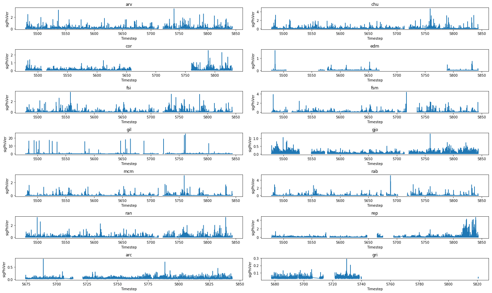
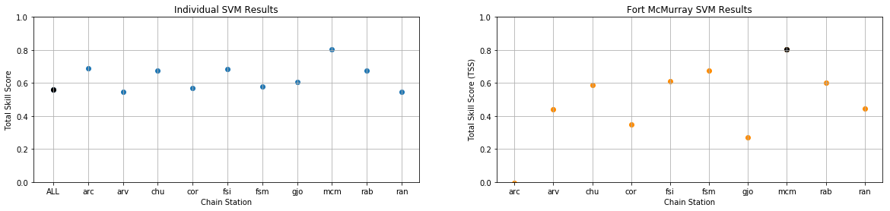
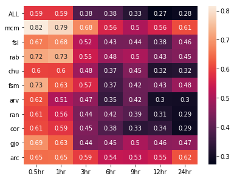
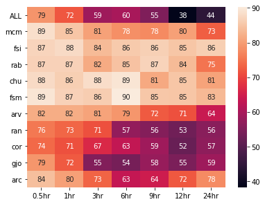
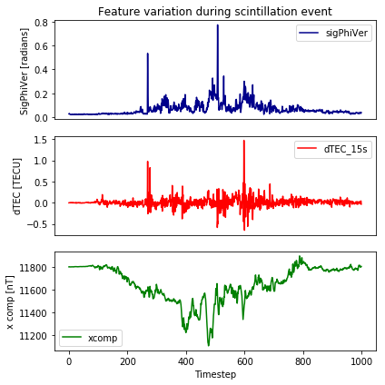
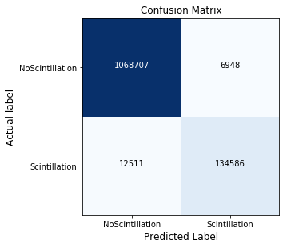
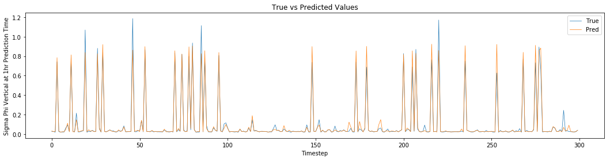
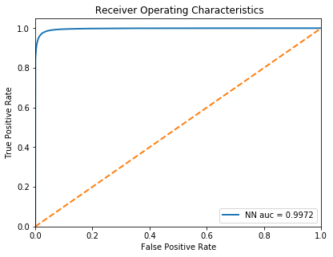
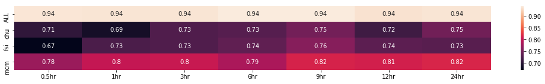
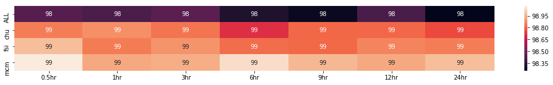

White paper
{: #wp-brand}

# NASA Frontier Development Lab Space Weather Challenge

by [Deanna Morgan](#author)
{: .wp-author}


The NASA Frontier Development Lab (FDL) is an applied artificial intelligence (AI) research accelerator, hosted by the SETI Institute in partnership with NASA Ames Research Centre. The programme brings commercial and private partners together with researchers to solve challenges in the space science community using new AI technologies.

NASA FDL 2018 focused on four areas of research – Space Resources, Exoplanets, Space Weather and Astrobiology – each with their own separate challenges. This paper will focus on the first of the Space Weather challenges, which aimed to forecast Global Navigation Satellite System (GNSS) disruptions.


## The Space Weather Challenge

A GNSS is a network of satellites providing geospatial positioning with global coverage. The most famous example is the United States’ Global Positioning System (GPS). Such a network relies upon radio communications between satellites and ground-based receivers, which can be subject to interruptions in the presence of extreme space weather events.

_Space weather_ refers to changes in radiation emitted by the Sun, leading to fluctuations in the Earth’s ionosphere. Changes to the electron density in the ionosphere cause fluctuations in the amplitude and phase of radio signals, referred to as phase scintillation. Radio signals propagating between GNSS satellites and ground-based receivers are affected by these scintillation events and can become inaccurate or even lost. 

In a society that has become dependent on GNSS services for navigation in everyday life, it is important to know when signal disruptions might occur. Given that space weather events occurring between the Sun and the Earth have a non-linear relationship, physical models have struggled to predict scintillation events. One solution to making more accurate predictions, is to use machine-learning (ML) techniques.

In this paper, we examine the use of ML models to predict scintillation events, using historical GNSS data. Initially, a Support Vector Machine (SVM) was used to recreate the baseline model outlined in McGranaghan et al., 2018. We then implemented a neural network model in an attempt to improve upon the baseline results and accurately predict events as far as 24 hours ahead. Both methods used the strength of kdb+/q to deal with time-series data and embedPy to import the necessary python ML libraries.

The technical dependencies required for the below work are as follows:

   - embedPy
   - TensorFlow 16.04
   - NumPy 1.14.0
   - pandas 0.20.3
   - Matplotlib 2.1.1
   - Keras 2.0.9
   - scikit_learn 0.19.1


## Data

Publicly available data was used to develop the ML models discussed below. Different datasets describe the state of the Sun, the ionosphere and the magnetic field of the Earth. Combining these datasets created an overall picture of atmospheric conditions at each timestep, including when scintillation events occurred.

The first dataset was collected by the Canadian High Arctic Ionospheric Network (CHAIN) [1] from high-latitude GNSS receivers located throughout the Canadian Arctic. Data from multiple satellites was recorded by ground-based ionospheric scintillation and total electron count (TEC) monitors. For the purpose of this research, receivers from the Septentrio PolarRxS branch of the CHAIN network were used, taking the 14 CHAIN receiver stations [2] with the most continuous data. Recorded features for each receiver include; TEC, differential TEC (current TEC minus TEC recorded 15 seconds previously), the scintillation index, the phase and amplitude scintillation indices and the phase spectral slope.

Solar and geomagnetic features can be found in the second dataset, which is available on the NASA OMNI database [3]. Features in the data include solar wind properties (velocity, power, and the Newell and Borovsky constants), magnetic properties (magnetic field strength, IMF and clock angle), and geomagnetic indices (AE and SymH), along with proton fluxes and indices Kp and F10.7. Additional solar X-ray measurements were included in the solar dataset. Such measurements are available from the NOAA Geostationary Satellite Server [4].

The third dataset was collected by the Canadian Array for Real-time Investigations of Magnetic Activity Network (CARISMA) [5]. CARISMA data was recorded by magnetometers at high latitudes, and could therefore be co-located with CHAIN data.


## Pre-processing

During the initial stages of pre-processing, the following steps were taken:

### CHAIN

-   Only data with a lock-time of greater than 200 seconds was included to account for ‘loss of lock’ events, where receivers stop receiving satellite signals due to significant signal irregularities. [6]
-   Satellites travelling at low elevations experience ‘multi-path’ irregularities where signals have to travel longer distances through the ionosphere and are therefore reflected and follow multiple paths before reaching receivers. [7] To differentiate between multi-path and scintillation irregularities, data with an elevation of greater than 30 degrees was selected and the phase and amplitude scintillation indices (&sigma;<sub>&phi;</sub> and S4 respectively) were projected to the vertical.
-   Latitude and longitude for each station were also added to the data [2].
-   The median value was calculated for each feature at each timestep.


### Solar

-   Newell and Borovsky constants were added to the dataset.
-   Following the method used in McGranaghan et al. (2018), historical values recorded 15 and 30 minutes previously were included for each input parameter from the OMNI dataset.
-   All solar features were recorded at 5 minute intervals, except for the Kp and F10.7 indices which were recorded every hour. Data was back filled to match the minute granularity of the chain dataset.
-   Additional solar X-ray feature `GOESx` was recorded at random intervals, every few seconds. Average measurements were selected at minute intervals.
   

### Magnetometer

-   Raw data was recorded at minute intervals.
-   A chain station column was added to the final table so that data could be joined with CHAIN data at a later stage.

Following pre-processing, the data was persisted as a date-partitioned kdb+ database. Scripts were written to create configuration tables, specifying the features and scaling required for each model. The configuration tables had the below form.

```q
table colname   feature scaler
------------------------------
chain dt        0       ::    
chain doy       0       ::    
chain cs        0       ::    
chain tec       1       ::    
chain dtec      1       ::    
chain SI        1       ::    
chain specSlope 1       ::    
..
```


## SVM model

A SVM was used to recreate the baseline model outlined in McGranaghan et al., 2018.

The baseline model uses the first two datasets to predict scintillation events an hour ahead. For this method, a total of 40,000 random data points were selected from 2015, taking data from each CHAIN receiver.

We aim to improve upon this model by:

-   Considering data on a receiver-by-receiver basis, while adding localized features, to account for the geospatial element in the data.
-   Performing feature selection to reduce the dimensionality of the input features.
-   Adding an exponential weighting to input features to give the most recent data the highest importance and account for the temporal element in the data.


### CHAIN and solar data

Along with the partitioned database, scripts were loaded containing utility functions, graphing methods, and the required configuration table.

```q
q)\l /SpaceWeather/kxdb
q)\l ../utils/utils.q
q)\l ../utils/graphics.q
q)\l ../config/configSVM.q
```

For the SVM method, CHAIN and solar datasets were used, with measurements recorded at 1-minute intervals. CHAIN data was recorded for each of the 14 receiver stations. All data from 2015 was loaded, with the solar table joined to the corresponding rows in the CHAIN table. 

```q
q)sdateSVM:2015.01.01
q)edateSVM:2015.12.31

q)getTabDate:{[dt;t]?[t;enlist(=;`date;dt);0b;{x!x}exec colname from configSVM where table=t]}
q)getAllDate:{[dt]
    r:tabs!getTabDate[dt]each tabs:`chain`solar`goes;
    t:select from(r[`chain]lj`dt xkey update match:1b from r`solar)where match; 
    select from(t lj`dt xkey update match:1b from r`goes)where match}
q)show completeSVM:raze getAllDate peach sdateSVM+til 1+edateSVM-sdateSVM

dt                            doy cs  tec      dtec   SI    specSlope s4         sigPhiVer  Bz   ..
-------------------------------------------------------------------------------------------------..
2015.01.01D00:00:00.000000000 1   arv 16.31073 0.285  0.014 1.77      0.04130524 0.03474961 1.05 ..
2015.01.01D00:00:00.000000000 1   chu 20.58558 0.003  0.009 1.89      0.03389442 0.03238033 1.05 ..
2015.01.01D00:00:00.000000000 1   cor 17.63518 0.072  0.013 2.06      0.04001991 0.0569824  1.05 ..
2015.01.01D00:00:00.000000000 1   edm 26.65708 -0.046 0.01  1.86      0.0443945  0.03070174 1.05 ..
2015.01.01D00:00:00.000000000 1   fsi 27.10333 -0.011 0.008 1.77      0.02914058 0.02512171 1.05 ..
2015.01.01D00:00:00.000000000 1   fsm 21.78102 -0.033 0.009 1.83      0.02766845 0.02570405 1.05 ..
2015.01.01D00:00:00.000000000 1   gil 24.6702  -0.009 0.012 2.06      0.03305384 0.07465466 1.05 ..
..
```


### Target data

The occurrences of scintillation events are shown by sudden irregularities in a number of features, specifically the phase scintillation index, which was projected to the vertical throughout this work (`sigPhiVer`). As the baseline looks at predicting scintillation 1 hour ahead, the value of &sigma;<sub>&phi;</sub> 1 hour ahead of the current timestep, `sigPhiVer1hr`, was used as target data for the models.

A phase scintillation event is said to be occurring when `sigPhiVer` has a value of greater than 0.1 radians. The target data is therefore assigned a value of 1 (positive class) if it has a value greater than 0.1 radians and 0 (negative class) if it has a value less than 0.1 radians. The percentage of scintillation events present in the SVM data are shown below.

```q
q)dist:update pcnt:round[;.01]100*num%sum num from select num:count i by scintillation from([]scintillation:.1<completeSVM`sigPhiVer1hr);

scintillation| num     pcnt 
-------------| -------------
0            | 4304589 96.84
1            | 140503  3.16
```

Ideally, data would have been recorded for each CHAIN station, at every minute throughout 2015. However, GNSS receivers are often prone to hardware failures, which lead to gaps in the data. 

  
<small>_Figure 1: Values for the phase scintillation index projected to the vertical, recorded by each CHAIN receiver throughout 2015._</small>


### Metrics

As only 3% of the data represented scintillation occurring, it would have been easy to create a model which produced high accuracy. A naïve model which predicted that scintillation never occurred would still have been correct 97% of the time. Additional metrics were therefore needed to determine how well the models performed. 

In addition to accuracy, the True Skill Statistic (TSS) has been used throughout this paper to evaluate model performance. The TSS calculates the difference between recall and the false positive rate and produces values ranging from -1 to 1, with 1 being the perfect score. [8]

$$\begin{equation}TSS=\frac{TP}{TP+FN}-\frac{FP}{FP+TN}\end{equation}$$

where _TP_, _TN_, _FP_ and _FN_ are true positives, true negatives, false positives and false negatives respectively.


### Additional features

Scintillation events are subject to diurnal and seasonal variations, caused by the inclination of the Earth in relation to the Sun. When either hemisphere of the Earth is tilted towards the Sun, increased solar radiation causes greater ionization in the upper atmosphere. This leads to higher scintillation indices and thus more scintillation events.[9] To account for such variations, the sine and cosine local time of day and day of year were added to the dataset. For the baseline, only the cosine day of year was added.

$$cosdoy = cos{\frac{2 \pi doy}{D_{tot}}}$$

$$sindoy = sin{\frac{2 \pi doy}{D_{tot}}}$$

$$costime = cos{\frac{2 \pi dt}{T_{tot}}}$$

$$sintime = sin{\frac{2 \pi dt}{T_{tot}}}$$

where $doy$ is the day of year,  $D_{tot}$ is the number of days in the year (365 for the SVM model, 365.25 for the neural network model), $dt$ is the time in minutes and $T_{tot}$ is the total number of minutes in a day.

```q
q)completeSVM:update cosdoy:cos 2*pi*doy%365 from completeSVM
```


### Feature engineering

To account for gaps in both feature and target data, rows containing nulls were dropped. As ML models are sensitive to inputs with large ranges, some features in the input data were _log_(1+_x_) scaled (as defined in the SVM configuration table).

```q
q)completeSVM@:where not any flip null completeSVM
q)completeSVM:flip(exec first scaler by colname from configSVM)@'flip
```

Standard scaling was then used to remove the mean and scale each feature to unit variance. Meanwhile, target data was left unscaled and assigned a binary value, using the 0.1 radians threshold mentioned above. 

For the baseline model, a total of 40,000 random data points were selected and split into training (80%) and testing (20%) sets. Initially, two sets of shuffled indices were produced, covering the full set of indices in the data.

```q
q)splitIdx:{[x;y]k:neg[n]?n:count y;p:floor x*n;(p _ k;p#k)}
q)splitIdx[.2;y]

134574 189809 424470 960362 629691 516399 721898 1091736 101292 ..
492448 121854 186677 1144240 176314 261502 853557 580623 494990 ..
```

These indices were then used to split X and Y data into respective train-test sets.

```q
q)count each`xtrn`ytrn`xtst`ytst!raze(xdata;ydata)@\:/:splitIdx[.8 .2; xdata]

xtrn| 915793
ytrn| 915793
xtst| 228949
ytst| 228949
```


### Model

The Python libraries and functions required to run the SVM model were imported using embedPy.

```q
q)array: .p.import[`numpy]`:array
q)svc:   .p.import[`sklearn.svm]`:SVC
```

To give the positive class a higher importance, a ratio of 1:50 was assigned to the class-weight parameter in the SVM classification model.

At this stage, X and Y training sets were passed to the model. Once trained, the SVM was used to make binary predictions for Y, given the X testing data. Predicted values and Y test values were then used to create a confusion matrix. 

A function was created so that the model could be run using different subsets of the data. 

```q
q)trainPredSVM:{[stn;col]

  sample:t neg[c]?c:count t:svmData stn;
  xdata:flip stdscaler each flip(exec colname from configSVM where feature)#sample;
  ydata:.1<sample col;
  r:`xtrn`ytrn`xtst`ytst!raze(xdata;ydata)@\:/:splitIdx[.2;ydata];

  model:svc[`kernel pykw`rbf;`C pykw .1;`gamma pykw .01;`class_weight pykw enlist[1]!enlist 50;`probability pykw 1b];
  if[(::)~ .[model[`:fit];(array[value flip r`xtrn]`:T;r`ytrn);{[e] -2"Error: ",e;}];:()];

  pred:model[`:predict][array[value flip r`xtst]`:T]`; 
  CM:cfm[r`ytst;pred];
  (`model`cs`pred!(`SVM;stn;col)),metrics CM

  }
```

Additionally, data was split into different tables for each receiver station:

```q
q)stn:distinct completeSVM`cs
q)svmData:(`ALL,stn)!enlist[-40000?completeSVM],{select from completeSVM where cs=x}each stn
```


### All stations (baseline model)

To achieve the baseline result, the function was passed combined data from all 14 stations. This model correctly identified 222 scintillation events, shown in the confusion matrix below.

```q
q)cfm[r`ytst;pred]

0| 5621 45 
1| 2112 222
```

These values were used to produce performance metrics.

```q
cs    accuracy errorRate precision recall specificity TSS    
-------------------------------------------------------------
ALL   73.04    26.96     9.512     83.15  72.69       0.5583
```


### Individual stations

As a comparison, data was split into respective tables for each receiver station. These were used to individually train and test the model.

```q
cs     accuracy errorRate precision recall specificity TSS    
--------------------------------------------------------------
arv    81.46    18.54     7.331     73.08  81.63       0.5471 
chu    84.5     15.5      6.789     83.18  84.52       0.677  
cor    72.69    27.31     6.664     84.62  72.41       0.5703 
edm    97.65    2.35      21.28     94.34  97.67       0.9201 
fsi    86.55    13.45     10.03     81.82  86.64       0.6845 
fsm    87.84    12.16     7.949     69.83  88.1        0.5793 
gil    20.91    79.09     13.65     99.7   9.618       0.09319
gjo    71.64    28.36     11.56     89.57  70.88       0.6045 
mcm    86.54    13.46     13.89     93.99  86.36       0.8035 
rab    84.78    15.22     8.855     82.86  84.81       0.6767 
ran    76.74    23.26     7.285     77.72  76.71       0.5443 
rep    39.62    60.38     7.927     97.65  36.37       0.3402 
arc    79.97    20.03     9.76      89.06  79.75       0.6881 
gri    99.04    0.9625    9.756     72.73  99.07       0.718  
```


### Fort McMurray station

Both previous models used data from the same station/s to train and make predictions on the SVM. An additional method was to train the SVM using one station and make predictions using data from the remaining stations.

In the below case, 32,000 random data points were selected as training data from the Fort McMurray (`mcm`) table and 8,000 points were chosen from each of the remaining tables to test the model. The SVM was then run as before.

```q
cs    accuracy errorRate precision recall specificity TSS      
---------------------------------------------------------------
arc   84.46    15.54     2.256     13.51  86.14       -0.003445
arv   83.95    16.05     6.031     59.85  84.35       0.442    
chu   83.58    16.43     6.759     75     83.71       0.5871   
cor   82.15    17.85     7.456     51.69  82.96       0.3465   
edm   87.36    12.64     4.442     100    87.29       0.8729   
fsi   83.75    16.25     6.74      77.31  83.85       0.6116   
fsm   84.65    15.35     7.291     82.61  84.68       0.6729   
gil   80.76    19.24     25.87     36.27  86.53       0.228    
gjo   81.77    18.22     10.76     43.55  83.52       0.2707   
gri   83.16    16.84     0.2976    36.36  83.23       0.1959   
mcm   86.54    13.46     13.89     93.99  86.36       0.8035   
rab   84.4     15.6      7.241     75.4   84.54       0.5994   
ran   82.62    17.38     8.432     61.42  83.16       0.4458   
rep   80.61    19.39     12.53     41.67  82.9        0.2457
```


### SVM results

Plotting the TSS for all three methods allowed the performance of each model to be compared.
 
  
<small>_Figure 2: True Skill Statistic results produced by the Support Vector Machine models (individual models – left, Fort McMurray model – right). The combined and Fort McMurray models are plotted in black._</small>

The SVM baseline model, which combined data from all the receiver stations, gave an accuracy of 73.04% and a TSS of 0.56 (precision = 9.51%, recall = 83.15%). The top plot shows how the performance of the model varied depending on which station was used to train and test the SVM.

TSS results produced by the Fort McMurray model are shown in the right plot, with results varying even more drastically from station to station.

From these results we can infer that scintillation events must be localized and will therefore depend on the location of each individual receiver. In order to train a model with higher accuracy and TSS, data must either be separated on a station-by-station basis, or additional spatial parameters must be introduced to account for the geospatial elements in the data.

Until this point, the SVM trained and tested on combined/individual data had been used to make predictions 1 hour ahead. However, it was possible to predict at any chosen prediction time. In this paper, we look at predictions for 0.5, 1, 3, 6, 9, 12 and 24 hours ahead. Using the same model as before, random samples of 40,000 timesteps from 2015 were selected for each station to train and test the SVM at each prediction time. 

  
<small>_Figure 3: True Skill Statistic results for the Support Vector Machine model, trained on combined and individual data at multiple prediction times._</small>

As expected, the model tends to perform better at 0.5 and 1 hour prediction times, with results getting worse as the prediction time increases. Accuracy follows the same trend, decreasing as prediction time increases. The Fort McMurray station gives the highest TSS throughout, allowing the model to predict 24 hours ahead with a TSS score of 0.61 and an accuracy of 73%.

  
<small>_Figure 4: Accuracy results for the Support Vector Machine model, trained on combined and individual data at multiple prediction times._</small>


### Feature selection

Before moving from an SVM to a neural network, dimensionality reduction was performed on the dataset.

Dimensionality reduction is the process of reducing the number of features in a dataset, while preserving as much information as possible. Finding a lower-dimensional representation of the dataset can improve both the efficiency and accuracy when the data is fed to a ML model. 

A number of scikit-learn libraries were imported (using embedPy) for feature selection. Each determined the importance of features using a different method.

PCA

: Feature importance was carried out by calculating the variance of each component.  Plotting the variance allowed the minimum number of features to be chosen, which reduced dimensionality while keeping data loss to a minimum. It was found that the first 15 components held the most variance in the data. PCA was carried out again, using only the first 15 components in order to maximize the variance.

Fisher ranking

: The Fisher Score is a feature-selection algorithm used to determine the most important features in a dataset. It assigns a score to each component, determining the number of features that should remain in the dataset based on their score. This was done using the python scikit-learn SelectKBest library and the `f_classif` function, which determine the F-score for each component. 

Extra tree classification

: This method works by selecting features at random from a decision tree, in order to increase accuracy and control over-fitting within a model. They work similarly to random forests, but with a different data split, where for an extra trees classification, feature splitting is chosen at random, compared to the random-forest method of choosing the best split among a subset of features. Important features among the dataset were scored based on the results of the decision-tree outcomes.

Logistic regression

: In ML, logistic regression is commonly used for binary classifications. Logistic regression uses probabilities to calculate the relationship between the desired predicted outcome and the input features from the dataset. These probabilities can then be used to rank the importance of features in the dataset. This method returned a list of selected features, as opposed to a list of features in descending order of importance.

Decision tree classifier

: Given features as inputs, a decision tree is used to represent the different possible outcomes in a classification problem. The model uses branch nodes to describe observations about the inputs and leaves to represent the classification result. Feature importance was calculated by assessing the outcome achieved when each feature was used as input.

Random forests

: A random forest is a supervised ML algorithm, which builds a model based on multiple random decision trees. It combines results to increase the accuracy of the model. The split at each node is decided based on the best split in a subset of features. Using this algorithm, feature importance can be extracted for each component. This is done by looking at the results of each node of the decision tree and assessing whether the features associated with each node increase the accuracy of the overall decision tree. Following this method, a score was assigned to each feature.

Each of the above methods produced a list of important features. Combining these and selecting the components which had been selected multiple times produced the final feature list; `tec`, `dtec`, `s4`, `SI`, `specSlope`, `sigPhiVer`, `AE`, `AE_15`, `AE_30`, `newell_30`, `P`, `V`, `proton60`, `f107`, `kp` and `GOESx`. These were used in the neural-network model, including time-lagged columns for each.


## Neural-network model

### Pre-processing

To improve performance metrics, data from 2015-2017 was used to train a neural-network model. Going forward, only components selected in the feature selection process were used (found in the neural-network configuration table). Data was loaded using the same method as above.

As results showed that scintillation events are specific to the location of each station, localized features were added to the dataset. These included the magnetometer dataset, sindoy, sintime, cosdoy and costime. As previously stated, 365.25 is used for Dtot in this model to account for the extra day present in a leap year.

  
<small>_Figure 5: The variation in the phase scintillation index (sigPhiVer), the differential Total Electron Content (dtec) and the X component of the Earth’s magnetic field during a scintillation event, where sigPhiVer is greater than 0.1 radians._</small>

When a scintillation event occurs, geomagnetic features such as `x`, `y`, `z` and `dtec` will fluctuate drastically. It was therefore useful to give more importance to these features by adding columns which contained their absolute values with the mean removed.

```q
q)newval:{abs(x-avg x)}
q)completeNN:update newx:newval x,newy:newval y,newz:newval z,newdtec:newval dtec from completeNN
```


### Feature engineering

For this model, X data was exponentially weighted to give the most recent data the highest importance.

```q
q)xdata:flip(reverse ema[.1]reverse@)each flip xdata
```

Target data was log scaled to prevent negative predictions for &sigma;<sub>&phi;</sub>, which is always positive. A train-test split of 80%/20% was again used.

To overcome the small fraction of data representing scintillation events, oversampling was used on the training set. A random sample taken from the positive class was re-added to the training dataset, giving a final training set with 50% positive samples.

```q
q)r:`xtrn`ytrn`xtst`ytst!raze(xdata;ydata)@\:/:splitIdx[.2;ydata]
q)positiveIdx:where yscint:.1<exp r`ytrn
q)pos:`x`y!{x[y]}[;positiveIdx]each(r`xtrn;r`ytrn)
q)sampleIdx:(nadd:(-) . sum each yscint=/:(0 1))?count pos`x
q)sample:`x`y!{x[y]}[;sampleIdx]each(pos`x;pos`y)
q)oversampled:`x`y set'(r`xtrn;r`ytrn),'(sample`x;sample`y)

Scintillation events before oversampling:

ybinary| num     pcnt 
-------| -------------
0      | 4325747 88.44
1      | 565260  11.56

Scintillation events after oversampling:

ybinary| num     pcnt
-------| ------------
0      | 4325747 50  
1      | 4325747 50 
```


### Model

To create a neural-network model, embedPy was used to import the necessary ML libraries. 

```q
q)sequential:    .p.import[`keras.models]`:Sequential
q)dense:         .p.import[`keras.layers]`:Dense
q)normalization: .p.import[`keras.layers]`:BatchNormalization
q)pylist:        .p.import[`builtins]`:list
```

The model had 1 input layer, 4 hidden layers and 1 output layer. A normal distribution was used as the initializer for the kernel to set the weights in each layer of the model.

The input and hidden layers have output widths of 256 nodes, along with an Exponential Linear Unit (ELU) activation function, which gave the best model performance. ELU was specifically chosen as it converged the loss function to zero better than other activation functions, such as a Rectified Linear Unit (RELU).

The output layer had 1 node and a linear activation function to allow a single value for  to be returned for each timestep.

```q
q)model:sequential[];
q)model[`:add]dense[256;`input_dim pykw 37;`kernel_initializer pykw`normal; `activation pykw`elu];
q)model[`:add]normalization[];
q)model[`:add]dense[256;`activation pykw`elu;`kernel_initializer pykw`normal];
q)model[`:add]normalization[];
q)model[`:add]dense[256;`activation pykw`elu;`kernel_initializer pykw`normal];
q)model[`:add]normalization[];
q)model[`:add]dense[256;`activation pykw`elu;`kernel_initializer pykw`normal];
q)model[`:add]normalization[];
q)model[`:add]dense[256;`activation pykw`elu;`kernel_initializer pykw`normal];
q)model[`:add]normalization[];
q)model[`:add]dense[1;`activation pykw`linear];
q)model[`:compile][`loss pykw`mean_squared_error;`optimizer pykw`adam;`metrics pykw pylist `mse`mae]; 
```

At this stage, the model was trained for 50 epochs, using batch sizes of 512 each time. The model performed validation using 20% of the training data.

```q
q)resNN:model[`:fit][array[value flip oversampled`x]`:T;oversampled`y;`batch_size pykw 512;`verbose pykw 0;`epochs pykw 50;`validation_split pykw .2]
```

Once trained, the model was used to make predictions 1 hour ahead.

```q
q)predNN:raze(model[`:predict]array[value flip r`xtst]`:T)``
```

Outputs were assigned binary values, using the 0.1 radians threshold, and then compared to the y test values selected previously.

```q
ypred| 0.03101 0.02524 0.02811 0.7762 0.02906 0.02075 0.02273 0.02361 0.06351 ..
ybin | 0       0       0       1      0       0       0       0       0      ..
```


### Neural network results

The model was trained and tested using combined data from the Fort Churchill (`chu`), Fort McMurray (`mcm`) and Fort Simpson (`fsi`) stations, each co-located magnetometer data. The true and false positives and negatives predicted by the model were represented in a confusion matrix.

  
<small>_Figure 6: Confusion matrix produced by the neural network model at 1 hour prediction time. Scintillation represents the positive class._</small>

The model correctly identified 134,586 scintillation events at 1 hour prediction time. From these results, performance metrics were calculated to allow comparison between the SVM and neural network.

```q
model cs   accuracy errorRate precision recall specificity TSS   
------------------------------------------------------------------
SVM   ALL  73.04    26.96     9.512     83.15  72.69       0.5583
NN    ALL  98.41    1.591     91.49     95.09  98.84       0.9393
```

By introducing geospatial features and exponentially weighting input data to account for the spatial and temporal elements in the data, we managed to increase accuracy in the combined model by over 25% and TSS by 0.38. Precision and recall have also increase to greater than 90%, a large improvement on the baseline model.

As before, the model was also run separately for each station. 

```q
model cs   accuracy errorRate precision recall specificity TSS   
---------------------------------------------------------------
SVM   chu  84.5     15.5      6.789     83.18  84.52       0.677 
NN    chu  98.63    1.375     48.26     78.49  98.89       0.7739
SVM   fsi  86.55    13.45     10.03     81.82  86.64       0.6845
NN    fsi  98.89    1.105     51.58     71.17  99.22       0.7039
SVM   mcm  86.54    13.46     13.89     93.99  86.36       0.8035
NN    mcm  99.02    0.9849    65.32     78.01  99.35       0.7736
```

Accuracy for all three models has increased to over 98%, while TSS has increased to values above 0.7. This is an impressive result given that 3 years of data was used to train/test each of the neural networks, compared to the 40,000 data points from 2015 used in the SVM model.

Another means of determining how well the models performed was to plot true and predicted values together. In the below plot, the first 300 values for at 1-hour prediction time have been plotted for the combined model. This plot shows how well predicted values compare with the test set.

  
<small>_Figure 7: True (blue) and predicted values (orange) for the phase scintillation index at 1 hour prediction time (sigPhiVer1hr) produced by the neural network model using the combined dataset._</small>

The performance of the model is also apparent in the Receiver Operating Characteristics (ROC) curve plot, which compares the True Positive Rate (Sensitivity) and False Positive Rate (1-Specificity). This produces an area under the curve of 0.9972.

  
<small>_Figure 8: Receiver Operating Characteristic curve for 1-hour prediction values produced in the neural network model using combined data._</small>

Similarly to the SVM model, the neural network method was used to predict at a range of prediction times, from 0.5-24 hours ahead.

  
<small>_Figure 9: True Skill Statistic results for the neural network model, predicting 30 minutes – 24 hours ahead for the combined (ALL), Fort Churchill (chu), Fort Simpson (fsi) and Fort McMurray (mcm) models._</small>

Unlike the SVM model, predictions made using the neural network model produced high values for TSS regardless of prediction time, with all values sitting above 0.67. The combined model produced the highest TSS throughout, with a value of 0.94.

For prediction time 24 hours, TSS results have increased by an average of 0.39 in comparison to the SVM model, with all values now sitting above 0.73. This is impressive compared to the baseline model where results became less reliable as the prediction time increased.

  
<small>_Figure 10: Accuracy results for the neural network model, predicting 30 minutes – 24 hours ahead for the combined (ALL), Fort Churchill (chu), Fort Simpson (fsi) and Fort McMurray (mcm) models._</small>

The accuracy results for each of the neural-network models were also improved. Each model produces an accuracy of greater than 98% regardless of the prediction time. This is a vast improvement on the baseline model.

As future work, it could be beneficial to try and find the maximum prediction time for each dataset using the neural-network model. It would also be interesting to see how results compared if null features for stations with sparse data were interpolated, as opposed to dropped. This would allow the neural network to be run for more stations.


## Conclusions

In a society that is increasingly dependent on GNSS technology, it is important to be able to predict signal disruptions accurately. Previous models did not produce reliable results, as they struggled to account for the non-linear nature of Sun-Earth interactions. This paper discussed how to harness the power of kdb+ and embedPy, to train machine-learning models and predict scintillations events.

Data was pre-processed and scaled using kdb+. The support vector machine baseline model was then built, trained and tested using embedPy. Results produced by this model were improved upon by separating data on a receiver-by-receiver basis, showing that scintillation events are localized and, therefore, dependent on the location of each CHAIN receiver station.

Feature selection allowed the dimensionality of the dataset to be reduced before adding spatial features, which accounted for the geospatial element of the Sun-Earth interactions. Additionally, adding an exponentially moving window to the input data helped to account for the temporal element in the data. Oversampling was also used in the training set to make it easier to train models to predict when scintillation events were occurring.

The neural network method vastly improved results compared to the baseline model. Using this model allowed data from 2015-2017 to be used, compared to the baseline model which used 40,000 data points from 2015. The combined dataset for 1-hour prediction produced an increase in accuracy and total skill score of over 25% and 0.38 respectively. Predicting at 0.5-24 hour prediction times for the combined dataset, along with the Fort Churchill, Simpson and McMurray stations, also improved on the baseline results. Predictions produced high values for TSS regardless of prediction time, with all values sitting above 0.67. The combined model produced the highest TSS results with a value of 0.94 throughout.

For 24-hour prediction, both accuracy and TSS results increased by an average of 27% and 0.39 respectively. We were therefore able to create a machine-learning model, which reliably predicts phase scintillation events as far as 24 hours ahead. 

[:fontawesome-solid-print: PDF](/download/wp/space-weather-a4.pdf)


## Author

**Deanna Morgan** joined First Derivatives in June 2018 as a Data Scientist in the Capital Markets Training Program.

Other papers by Deanna Morgan
{: .publications}

<ul markdown="1" class="publications">
-   :fontawesome-regular-map: [Sobol’ option pricing in q](../option-pricing/index.md){: .publications}
</ul>


## References and data sources

[1] Canadian High Arctic Ionospheric Network: [Data Download](http://chain.physics.unb.ca/chain/pages/data_download), accessed 30 October 2018.

[2] Canadian High Arctic Ionospheric Network: [Stations](http://chain.physics.unb.ca/chain/pages/stations/), accessed 30 October 2018.

[3] OMNI Web: <ftp://spdf.gsfc.nasa.gov/pub/data/omni/>, accessed 30 October 2018.

[4] National Oceanic and Atmospheric Administration: [GOES SEM Data Files](https://satdat.ngdc.noaa.gov/sem/goes/data/full/), accessed 30 October 2018.

[5] [CARISMA: University of Alberta](http://data.carisma.ca/FGM/1Hz/), accessed 30 October 2018.

[6] Kintner, P., Ledvina, B. and de Paula, E. “GPS and ionospheric scintillations”, _Space Weather_, 5(9), 2007.

[7] Tinin, M. and I.Knizhin, S. “Eliminating the Effects of Multipath Signal Propagation in a Smoothly Inhomogeneous Medium”, _Radiophysics and Quantum Electronics_, 56(7), pp.413-421, 2013.

[8] Bobra, M. and Couvidat, S. _Solar Flare Prediction Using SDO/HMI Vector Magnetic Field Data with a Machine-Learning Algorithm_, 2015.

[9] Jin, Y., Miloch, W. J., Moen, J. I. and Clausen, L. B. “Solar cycle and seasonal variations of the GPS phase scintillation at high latitudes”, _Journal of Space Weather and Space Climate_, 8, p.A48., 2018.


### Code

The code presented in this paper is available on GitHub at [kxcontrib/space-weather](https://github.com/kxcontrib/space-weather).


### Acknowledgements

I gratefully acknowledge the Space Weather 1 team at FDL – Danny Kumar, Karthik Venkataramani, Kibrom Ebuy Abraha and Laura Hayes – for their contributions and support.


