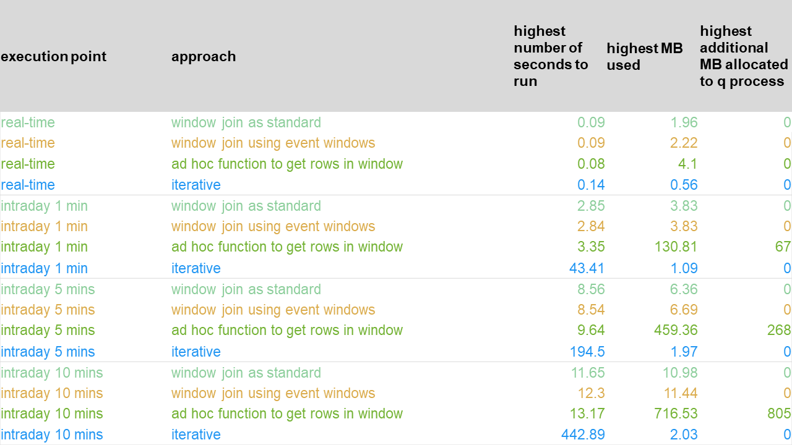
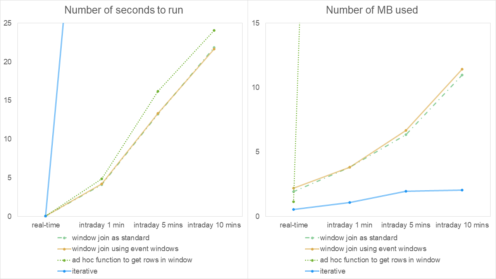
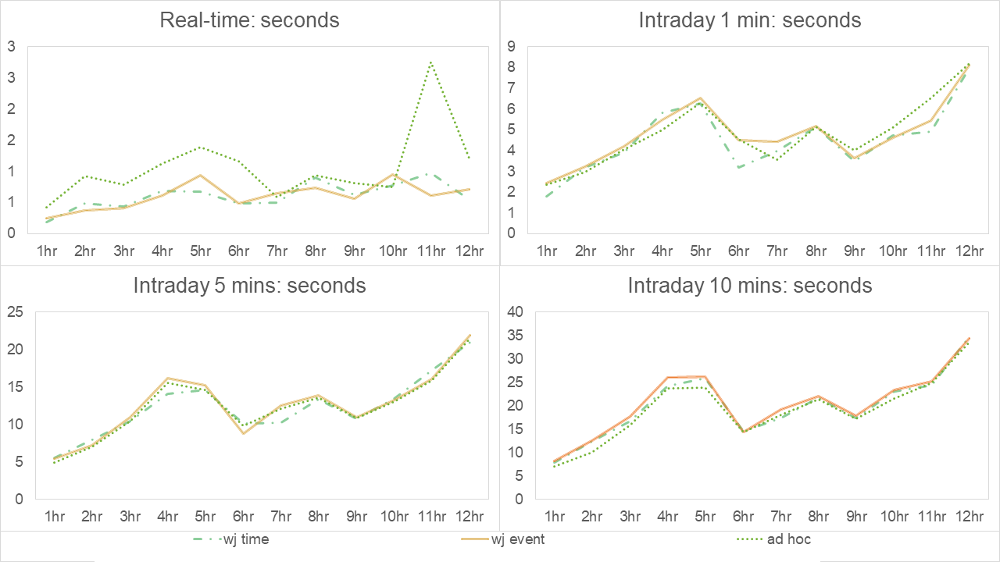
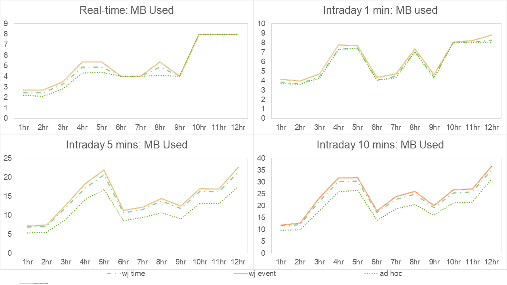
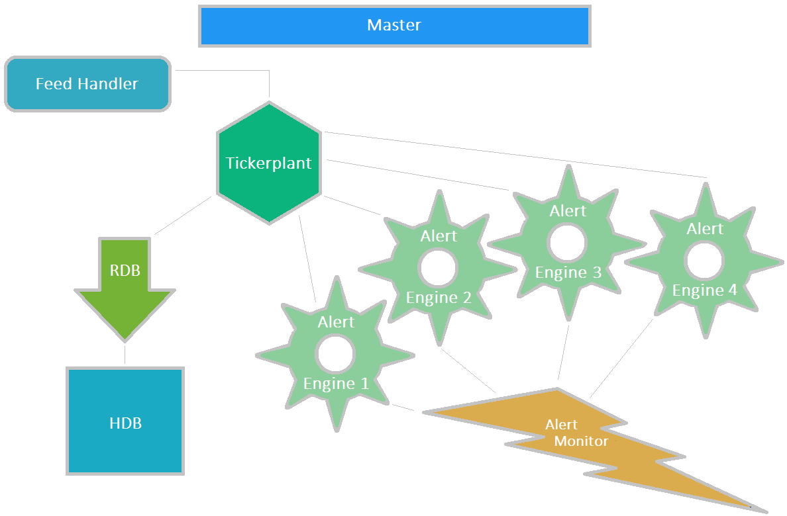

White paper
{: #wp-brand}

# Latency and efficiency considerations for a real-time surveillance system

by [Jason Quinn](#author)
{: .wp-author}


The time between transaction execution and transaction monitoring against regulation guidelines varies across financial institutions. Factors such as the number of markets, the number of trading systems and their messaging profiles can play a significant part in deciding whether to run surveillance analytics on a real-time or an intraday/end-of day basis.

Running analytics in real-time has the benefit of alerting on transactions as soon as possible, but runs the risk of generating alerts that subsequent, but unforeseeable, amendments/cancellations or positions may render as false positives. Running analytics on an intraday/end-of-day basis provides the benefit of hindsight to prevent such potential false positives, but delays the detection, remediation and damage limitation of real trading violations.

In general, alerts on trading abuses like Momentum Ignition or Ping Orders in the KX for Surveillance system, fire in real-time on real-time streaming data. While it may be simpler to operate on intraday data by looking across, say, fixed 15-minute buckets of data in isolation, such an approach risks missing alerts. For example, a trader might not violate Ping Orders alert logic within bucket $N$ or bucket $N+1$ in isolation but might violate it if they were combined.

:fontawesome-regular-hand-point-right:
Blog:<br>
[Momentum Ignition Alert](https://kx.com/blog/kx-product-insights-momentum-ignition-alert/)<br>
[Ping Order Alerts](https://kx.com/blog/kx-product-insights-ping-order-alerts/)

In this paper we discuss performance and programming considerations of implementing real-time surveillance analytics. Before proceeding, we need to make a distinction between

1.  Alerts firing on a real-time, intraday or end-of-day basis
2.  Real-time, intraday or end-of-day alert logic

In case (1), we are simply referring to the point at which we run the alert – _real-time_ meaning as soon as the transaction message is received, _intraday_ meaning at a later point in the day, and _end-of-day_ meaning all transactions are only investigated at the end of the day.

In case (2), we are referring to the investigation time window – _real-time_ meaning a moving window up to the transaction timestamp (e.g. checking for spoofing in the last five minutes), _intraday_ and _end-of-day_ meaning a static window. For example, intraday alert logic could be checking for spoofing across a fixed-hour window before a daily market benchmark is published, and end-of-day alert logic could be checking for spoofing across the day.

To help illustrate this, we present the possible cross-cases between alert firing (rows) and alert logic (columns) above as follows:

&nbsp; | real-time logic | intraday logic | end-of-day logic
-------|-----------|----------|-----------
real-time firing | Immediate check on latest transaction<br><br>Example: check received transaction for spoofing activity over last 5 minutes | N/A | N/A
intraday firing | Frequent scheduled checking of latest transactions<br><br>Example: check each in latest unchecked window of transactions for spoofing activity for 5 minutes prior to transaction | Frequent scheduled checks of groups of fixed-length window of transactions once those windows have ended<br><br>Example: checking for price manipulation prior to a benchmark setting at the time of the setting | N/A
end-of-day firing | Once-off scheduled checking of each transaction received that day<br><br>Example: check each transaction today for spoofing activity in the 5 minutes prior to transaction | Once-off scheduled check of groups of fixed-length window of transactions<br><br>Example: checking for price manipulation prior to a benchmark setting at the time of the setting (may be multiple per day) | Scheduled singlecheck at EOD of all transactions received that day as a single group<br><br>Example: checking for wash-trades collectively across the day


## Real-time analytics on streaming data

Our analysis focuses on investigating real-time alert logic being run on either a real-time basis (i.e. as soon as the transaction is received in the streaming feed), or those run on an intraday basis (i.e. transactions are held and bulk-investigated at fixed frequent intervals during the day) to allow for hindsight analysis or net calculations.

In our performance experiments, we run surveillance analytics on simulated live-streaming data obtained from a cryptocurrency exchange API at different points in a day. We use the order-to-trade alert that inspects every order message and triggers if the ratio of order placements to trades in the last five minutes breaches a threshold. For more thorough performance testing than just counting, we additionally find the total order quantity, total order value, the order counts by side, the best bid/ask, the total trade quantity and total trade value in the time window. The objective is to mimic similar aggregations in other alerts logic blocks.


## Advantages of hindsight

As common examples of where hindsight analysis is important for identifying false positives, consider the order types _fill or kill_, _immediate or cancel_ and _maker only_. In each of these cases, the orders may be followed by an automatic cancellation if their execution criteria are not met. Suppose we wish to exclude such orders from contributing to an alert. By running the alert on a real-time basis, as soon as the submission messages for these orders are received, we do not know if they may be almost immediately cancelled. Of course, we could implement logic to determine if this will occur. But why do that when the feed will momentarily let us know in a subsequent message? However, in waiting for that information, we need to temporarily delay the alert logic.

This is just an example of the need for hindsight. Different organizations may have different reasons for such a need from the simple case where a delayed market data feed is behind the organization’s own transaction feed to more specific examples where, say, messages of transaction legs appear in the feed after the parent message.


## Streaming lookback function – window join

### Syntax and arguments

In such cases, when transactional data is received through a feed, and needs to be analyzed against real-time logic, KX has a built-in function called a window join ([wj1](../../ref/wj.md)) to perform the required aggregations of a lookback cached in-memory table in moving time windows in one go. It takes four arguments, which we describe with long names to illustrate their meaning as follows:

```q
wj1[
  listOfTimeWindows;
  `symColumn`timeColumn;
  dataJustReceivedInFeedToBeAnalyzed;
  (lookbackTableToAggregate;aggregateFunctions) ]
```

where 

`listOfTimeWindows` 

: a list of startTime-endTime values for each row in `dataJustReceivedInFeedToBeAnalyzed` indicating the moving time windows from which to aggregate from `lookbackTableToAggregate`

`lookbackTableToAggregate` 

: in-memory lookup table, typically transactions in the last several minutes

`timeColumn`

: name of the timestamp column in the lookup table on which the `listOfTimeWindows` are to be applied 

`symColumn`

: name of a secondary grouping column common to both `dataJustReceivedInFeedToBeAnalyzed` and `lookbackTableToAggregate`. It dictates to the function that when identifying the rows in `lookbackTableToAggregate` that are in the moving time windows for each row of data just received, only look at rows with the same `symColumn` value.


### Example

A simple example should help understanding of the function. Suppose we have just received this data in table `d` from the feed:

```q
sym    Time     orderID
-----------------------
BTCUSD 09:00:04 4
LTCUSD 09:00:05 5
```

We wish to look back in 2-second moving windows up to the time of each of these orders. Our lookup table of in-memory cached order records is in table `l` below and we wish to count the number of `orderID`s in the lookback window for that same `sym`:

```q
sym    time     orderID
-----------------------
BTCUSD 09:00:01 1
BTCUSD 09:00:01 2
LTCUSD 09:00:03 3
BTCUSD 09:00:04 4
LTCUSD 09:00:05 5
```

Then, for the first row of table `d`, only row 4 of table `l` is in the 2-second window (row 2 is for sym `BTCUSD` also but is three seconds prior). For the second row of table `d`, rows 3 and 5 in table `l` are in its window. The q code to perform this lookup is:

```q
/Data just received
d:([]sym:`BTCUSD`LTCUSD; time:(09:00:04;09:00:05); orderID:`4`5);

/Data in lookback cache table
l:([]
  sym:`BTCUSD`BTCUSD`LTCUSD;
  time:(09:00:01;09:00:01;09:00:03);
  orderID:`1`2`3
),d;

/listOfTimeWindows
listOfTimeWindows:( d[`time]-00:00:02 ; d[`time] );

/lookbackTableToAggregate
lookbackTable: update `p#sym from `sym`time xasc l;

/Call window join
d: wj1[ listOfTimeWindows ; `sym`time ; d ; (lookbackTable;(count;`orderID))];
```

We will comment on the meaning of the second last line of code in a moment. This simple example can be expanded out to real use cases in alerts. For example, as part of the Spoofing alert, every time a cancelled-order message is received in the feed, we want to look back and count all the trader’s cancelled-order messages in a time window to determine the cancelled-order count up to that point.

Finally, note that the difference between the commands [`wj` and `wj1`](../../ref/wj.md) is that `wj` includes the last record for that sym before the start of the time window (called the _prevailing record_) in the aggregation, whereas `wj1` includes records within the limits of the time window only.


### Caveats

Regarding the definition of `lookbackTable` above, there is a requirement when using the window-join function: the lookup table that is passed to the function has to be sorted by the `sym` column first, and within that, by time. Having to repeatedly sort the table every time new records are received in the feed is an issue that we will be investigating in our experiments.

A second issue with window joins is that, when using timestamps, there is no differentiation of transaction sequencing when transactions share the same time stamp. This may be a rare issue in feeds with millisecond or nanosecond precision. For some feeds however, only timestamps to the nearest second are available. Let’s take a simple similar example with one `sym` value only for simplicity, where we have received the below in the feed:

```q
sym    time     orderID eventID orderStatus
-------------------------------------------
BTCUSD 09:00:04 4       4       cancelled
BTCUSD 09:00:04 5       5       cancelled
```

Suppose our lookup table is:

```q
sym    time     orderID eventID orderStatus
-------------------------------------------
BTCUSD 09:00:01 1       1       cancelled
BTCUSD 09:00:01 2       2       cancelled
BTCUSD 09:00:03 3       3       cancelled
BTCUSD 09:00:04 4       4       cancelled
BTCUSD 09:00:04 5       5       cancelled
```

If we wish to count the number of cancellations in a 2-second time window, event 5 is in the time window of event 4 due to the shared timestamp, even though we know it happened sequentially after it. This would lead the window-join function to return 3 and 3 as the counts of cancelled orders in the time window for each row of `d`. Suppose our threshold was 3, this would lead to two alerts being identified, one true positive and one false positive. For compliance-department investigators, this could become a frequent nuisance in feeds with such imprecise timestamps.


### Event windows

The argument `timeColumn` in the `wj` function does not strictly have to be of a timestamp type but can be any ordinal data type such as an integer. As a workaround to the above timestamp issue, we can use `eventID` in place of `timeColumn`, or in general, a number to indicate a message’s sequence in the streaming feed. The argument `listOfTimeWindows` would be a list of `startEventID` number-`endEventID` number values. Constructing these event windows would require an additional computation. In our experiments, we investigate for any performance impact over the standard use of window join with a time column.


### Pre- and post-V3.6 functionality

In kdb+ versions up to 3.6, build 2018.12.24, the argument `aggregationFunctions` can include only single-argument functions (i.e. unary functions). For example, to find the total order value in a time window, for which you have to multiply quantity by price, you cannot do that directly from inside the `wj` as it is a function on two column arguments. A simple workaround is to prepare an `orderValue` column in the lookup table and sum that up from within the `wj` arguments.

However, for a more non-trivial computation e.g. the best bid and ask in the window, there is no equivalent _simple_ preparation column to make. One approach is to directly find the row numbers in the lookup table in an ad-hoc manner and with those, address the desired positions in any of the multiple columns in the lookup table required and then perform the necessary aggregation of those vectors.

An example pseudo-code snippet of such a routine is:

```q
/Define data to analyze and look up tables d and l

/Run ad-hoc function to find rows in window
rowsInTimeWindows:adhocFunctionToFindRowsInWindow[d;l]

/Use rowsInTimeWindows to find the order value in the time windows
/ and store in new column in d
d:update
    orderValueInWindow: sum each prd
    l[`limitPrice`originalQuantity]@\:rowsInWindow
from d

/Use rowsInTimeWindows to find best bid and ask in time windows
/ and store in new column in d
d:update 
    bestBidOrAskInWindow:{
        (min;max)@'`side xgroup ([]side:`B`S,x;price:0,0,y)
    } .' flip lookupTable[`side`limitPrice]@\:rowsInWindow 
from d
```

The potential advantage of this approach is that whatever ad-hoc function is programmed to find the rows in the window, the re-sort of the lookup table that is required by the `wj` function is not necessary and the sequencing issue can be addressed. However, the storing of the matrix of rows in the lookup window has the disadvantage of a memory-usage increase over the `wj` function. Our experimentation will compare both approaches.

Finally, one might ask, if your task instructions begin with “For each order message, do this: …”, then why not write the task directly in an iterative style? That is, perform your aggregation in moving time windows with a simple [`each`](../../ref/each.md) iteration:

```q
{[d;l]
  orderCountInWindow:exec count i from l 
    where time within (d[`time]-00:00:02;d[`time]),sym=d[`sym];
    /...
  }[;lookupTable] each dataJustReceived
```

In this approach, it is true that we don’t have to concern ourselves with the syntax or some of the caveats associated with the window join. However, there is an obvious performance issue. If ten rows of transactions are received at one time in the feed, using this approach means that we are executing a routine 10 times as opposed to once only when using the window join, independent of the number of rows. We include comparison of this approach in our experiments and show that it is an inadvisable approach.


## Surveillance analytics experiments

### Tests performed

Our experiments involve running the order-to-trade alert using the four approaches:

1.  window join with timestamp windows as standard
2.  window join with `eventID` windows
3.  ad-hoc function to get rows in window (pre-V3.6 approach)
4.  iterative

For each of those four approaches, we run them at the four execution points:

1.  real-time
2.  intraday every 1 minutes
3.  intraday every 5 minutes
4.  intraday every 10 minutes

In the intraday cases, when we say every $x$ minutes, we mean every $x$ minutes of data rather than every $x$ minutes in real-time. This point is dismissible when the system is operating live but is more relevant if replaying the log file or rerunning the alerts from historical data. Later, we use the term ‘next intraday milestone’ to refer to the next $x$-minute marker at which to run the intraday alert analytic.

For each case, we run the alert analytic twenty times to simulate twenty such logic checks running in an alert-engine process within the system.

:fontawesome-brands-github:
[kxcontrib/kdbAlertTP](https://github.com/kxcontrib/kdbAlertTP)

:fontawesome-regular-hand-point-right:
[Appendix](#appendix-surveillance-framework-example) for how to install and configure the code.


### Exchange-member simulation

As our cryptocurrency exchange data is anonymized, we do not have any information on the exchange member who placed the order. Ideally, this is what we would group on when aggregating in alert logic; e.g. we would count the number of cancelled orders in a `sym` by a particular market participant in the Spoofing alert logic. Instead, we perform the experiments initially by grouping on the cryptocurrency symbol on its own and then after fabricating member IDs to simulate institutional data and grouping on the cryptocurrency symbol and the member ID.

In our data set, there are 2,769,761 order IDs, each with multiple records detailing their lifetimes. We randomly shuffle these and disperse them out to fabricated member IDs. Each member ID gets $N_i$ order IDs assigned to them, where the $N_i$ values are from a normal distribution and rounded down to the nearest integer. For this cryptocurrency exchange data, we choose a mean and standard deviation for the number of orders by a member as 550 and 10 respectively which generates just over 5,000 members.

This fabrication is to simulate institutional data where if differentiating by each instrument symbol and trader ID in alert logic say, and there are $N$ and $M$ possible values for these fields respectively, then there are $N × M$ possible grouping values.

That is, rather than grouping on the cryptocurrency symbol, of which there are only 15 values in the dataset, we will be grouping on roughly 5,000 members times 15 syms giving us roughly 75,000 grouping values. This means that there will be fewer rows to aggregate over in the three approaches we are testing, so we expect faster run times.


## Results

We perform three experiments:

1.  Running all approaches for one hour of streaming data
2.  Running all approaches for replaying the log file from experiment 1
3.  After discounting the iterative approach, running for four hours streaming data with simulated member IDs

We perform each experiment three times and take the average of the three runs as our final result.

The results of experiment 1 are:



These are represented in graphical form.


<small>_Results of experiment 1 - 1 hour of streaming data_</small>

Overall, as execution becomes less frequent (from instantaneously, to every one minute, to every five minutes etc.), we see an increase in the run time. This is to be expected, as there is more work to do. In the real-time case, we see that the iterative approach is using the least memory but takes slightly longer to run than the other approaches. However, its true performance behavior reveals itself as the execution points become less frequent – there is a radically longer run time as the process has zero recovery/idle time between data buckets. This could transpire in practice even in the real-time case if the upstream feed were sending messages in pulses due to a delay which is out of the control of the kdb+ application.

Note, we also observe cases of the OS having to allocate more memory to the kdb+ process mid-lifetime for the ad-hoc approach. We will show later though that the more realistic grouping by a member ID appears to rule out such an event and brings the number of MB used down to the levels of the window-join approaches.

We next check the performance when replaying the [log file](../..//kb/logging.md) from experiment 1 to check the performance in a case of recovery or running the alerts in an historical manner under revised conditions e.g. new thresholds or reference data:


In graphical form, these are presented as:



<small>_Results of experiment 2 – replaying log file of experiment 1_</small>

In this case, the memory usage is similar if not identical to that in experiment 1 – to be expected given that the data is the same. The run times behave the same across the execution points as previously i.e. grows as execution point is less frequent and appears to take slightly longer than when the data is streaming. Although the run time of the iterative approach in the real-time case is in line with the other approaches, it is unacceptably long in the intraday cases and would lead to a lengthy time rerunning the alerts historical.

We could experiment with the introduction of [parallel processing](../../basics/peach.md) into the framework. From the results in the white paper “[Multithreading in kdb+](../multi-thread/index.md)”, we would expect this to reduce the run-time and memory usage of the iterative approach. Although, not as much as to bring them down to those of the other three approaches without a considerable implementation revision. At this stage, we discount the iterative approach as an option as there is strong evidence that it would cause an unacceptable lag behind the streaming data which may require considerable efficiency-making efforts to overcome.

As mentioned previously, in the section ‘Exchange-member simulation’, the grouping by cryptocurrency sym only is not seen as realistic. It is expected that institutional data will be grouped by combinations such as sym+traderID, sym+brokerID, sym+desk etc. Our final experiment tests the remaining three approaches on four hours of streaming data with simulated member IDs added to the data. We consider the following results to be more reflective of real institutional data:


Presenting these in graphical form, we have:


<small>_Results of experiment 3 – 4 hours of streaming simulated institutional data_</small>

Here, when viewed in isolation from the other experiments, the same observation is made that as the execution-point frequency decreases, the run times and memory usage increase overall. The performance of both window-join approaches mirror each other closely while the ad-hoc approach seems to exhibit a slightly better performance in general in the intraday cases.

To compare with experiment 1 results, we re-run experiment 3 for 12 hours (once only) and show run times and MB used after certain numbers of hours:


Above, the _ep-app_ column is a shorthand combination of the _execution point_ and _approach_ columns of previous result tables. The column _1hs_ means the highest number of seconds to run and the highest MB used when running the experiment for 1 hour and grouping by sym only. The columns named in the format _Nhm_ have a similar meaning but for $N$ hours and grouping by fabricated sym and member ID.

Discarding the results when grouping by sym only, we present these in a series of subgraphs for number of seconds to run and MB used – one for each execution point but for all number of hours as below:



<small>_Results of experiment 4 – Number of seconds for each approach broken down by number of hours_</small>



<small>_Results of experiment 4 - Number of MB used for each approach broken down by number of hours_</small>

When viewed in comparison to experiment 1, after one hour of streaming data was analyzed, we see slightly longer run times in the real-time case but faster run times in all intraday cases. In terms of memory usage, we see slightly higher memory usage in both window join approaches and lower usage in the ad-hoc approach, especially in the intraday cases. This suggests the ad-hoc method outperforms either the window-join approaches as the data becomes more granular in the grouping clause values. The requirement to sort by the more granular sym+memberID and then within that, by time, in the window-join cases may explain why the ad-hoc approach is faster for the higher granularity.

As time progresses up to 12 hours, we can see that runtime memory usage fluctuates, rising, lowering and returning to previous highs by the end of the experiment. Note, we haven’t implemented memory-management techniques, such as purging data outside the lookback windows from the in-memory tables and calling garbage collection to stop the growth in time and memory used.

These results show that the use of event ID windows instead of timestamp windows causes a marginal but acceptable hit on the performance of the window-join approach.


## Conclusions

There are other factors that we have not experimented with – the distribution of the twenty runs of the alert analytics out to different secondary threads, implementing intraday memory management techniques in the alert engines or varying the hard-coded lookback threshold of five minutes on top of varying the intraday execution point frequency.

Whether on the minimal grouping by sym or on an estimated realistic grouping of sym and member ID, the real-time execution results appear not to discount the possibility of the alert engine being regularly occupied while it attempts to catch up with the live streaming data. More careful examination of bucket-by-bucket results is required though, to truly qualify that finding. If so, this would affect the implementation of memory-management techniques or the scheduling of intraday/end-of-day activities within the alert engines as the lag could continuously build up over time (more applicable in the case of 24 streaming data as is used in these experiments). This ties in with the conclusions in the “[Kdb+tick profiling for throughput optimization](../tick-profiling.md)” white paper, where it is found more efficient to deal with messages in bulk rather than in isolation – further justifying our dismissal of the iterative approach.

On the other hand, the results suggest that the intraday approaches always finish their task in ample time before the next intraday milestone is reached – giving plenty of time for any memory management tasks or intraday/end-of-day job scheduling to complete in an expected timeframe. For example, the results suggest that any EOD job scheduled in an alert engine running on an intraday 1-minute basis will start at most at 00:07 after the last intraday bucket of the day has been analyzed by the 20 alert calls. This short delay could be further reduced by memory-management techniques and the use of secondary threads.

On the use of the ad-hoc function, the granularity of grouping values has considerable impact on how better or worse it performs over the window-join approaches, where it seems the more granularity, the better. If viewing the very small case of fifteen possible values as being in the spectrum of worst cases, then it performs slightly slower but still within the safe lag limits of the window-join approaches. It does have a much higher memory usage over the window joins though. Again, however, the use of secondary threads could mitigate that increase. If viewing the simulation of member IDs and grouping on sym+memberID as being on the spectrum of realistic or even best cases (with over 75,000 possible values), the ad-hoc approach performs best. Regardless, all intraday results suggest that grouping on a higher granularity of values increases execution times.

In conclusion, between what appears to be an acceptable guaranteed cap on the lag behind the live-streaming data and with the advantages of having the ability to perform hindsight analysis to prevent possible false positives, implementing a surveillance solution that runs in the form of highly frequent intraday execution points for the live streaming data appears to be a very safe choice.

!!! info "Test parameters"

    All tests ran with 16 alert engines at a time and were performed using the 64-bit kdb+ 3.6 2019.06.09 build on a Linux machine with an Intel Core i7-7700K, 4.2 GHz 4 core processor with 64GB RAM running Ubuntu 16.04.


## Author 


{: .small-face}

**Jason Quinn** is a kdb+ consultant based in London. He worked on a global cross asset _Kx for Surveillance_ implementation for a major international banking group before joining our _Kx for Surveillance_ product team.


## Appendix – Surveillance framework example

The white paper “[Building real-time tick subscribers](../rt-tick/index.md)”, demonstrates the ease with which a skeleton kdb+ ticker plant framework can be adapted to meet an organization’s specific needs. Taking this, we set up the following sample surveillance framework:



<small>_Example surveillance framework used for experimentation_</small>

Here, we have used the standard processes in the TP framework:

process | role
--------|-----
Feed&nbsp;handler | Prepares messages from upstream sources and reformats them into a messages interpretable in q and sends them to the ticker plant. It is not necessarily a q process itself.
Tickerplant | Receives messages in q format, typically from a feed handler, writes them to a log file and publishes them to any subscriber processes
RDB | Receives messages from a ticker plant and stores them in in-memory tables which are written to disk at the end of the day 
HDB | Stores historical messages in date partitions

In addition, we have introduced a number of alert-engine processes subscribing to the tickerplant into the standard TP framework. Altogether, we have 16 alert engines, performing the tests on the four different coding approaches running at four different execution points. They all publish any discovered violations to an Alert Monitor process where the alerts can be viewed. Over all of these processes, we have made a primary process that starts the rest of the processes up, monitors their responsiveness and shuts them down at the end of the test and constructs a summary of timings and stores them in CSV format so that they can be inspected afterwards.

This framework is for the purposes of experimenting only and we do not suggest that this is an optimal TP setup for the above processes. Potentially we could have placed chained ticker plants between the main parent ticker plant and the alert engines.

See white paper “[Building real-time tick subscribers](../rt-tick/index.md)” for details behind the startup scripts for the ticker plant, RDB and HDB processes. The main adjustment we made to those scripts was to define additional schemas in `sym.q`. These schemas are

schema | contents
-------|----------
dxOrderPublic | All order submission, filling and cancellation messages
dxTradePublic | All trade messages
dxAlert | All alerts
dxStats | Summary stats table
dxReplayStatus | Table to store messages indicating that replay has started and finished and that an alert engine has finished analyzing all data.

In particular, `dxOrderPublic` contains the order messages that we wish to check for violations. The schema columns of interest are:

column           | contents
---------------- | --------------------------------------------------------------------------
transactTime     | timestamp of order record
sym              | cryptocurrency symbol (+ memberID when creating memberID option enabled)
eventID          | unique number for every message (across tables)
orderID          | identifier for an order lifetime
executionOptions | instructions on how to fill the order
eventType        | Indicates if the order record is for a placement, a fill or a cancellation
orderType        | Indicates if the order is a limit or market order
side             | indicates if bid or ask
limitPrice       | limit price of order
originalQuantity | originally ordered quantity
fillPrice        | price that order partially filled at
fillQuantity     | quantity that order partially filled for

We set a similar but simpler schema for `dxTradePublic`. Other adjustments to those startup scripts are negligible and are not detailed here.


### Installation

We assume the reader is installing on a Linux platform.

1.  Clone the repository :fontawesome-brands-github: [kxcontrib/kdbAlertTP](https://github.com/kxcontrib/kdbAlertTP) into your `HOME` directory.

    <pre><code class="language-bash">
    $ cd $HOME
    $ git clone https://github.com/kxcontrib/kdbAlertTP.git
    </code></pre>

2.  Move the contents of `kdbAlertTP/q` and `kdbAlertTP/data`
    into `kdbAlertTP`.

    <pre><code class="language-bash">
    $ cd $HOME/kdbAlertTP
    $ mv data/\* .
    $ mv q/\* .
    </code></pre>

3.  Create the directory `OnDiskDB` within `kdbAlertTP`, and within that create the directory `sym`

    <pre><code class="language-bash">
    $ mkdir -p $HOME/kdbAlertTP/OnDiskDB/sym
    </code></pre>

4.  Unzip the ZIP files in `kdbAlertTP` using `7zip`

    <pre><code class="language-bash">
    $ 7z x dxOrderPublic\_file.7z.001
    </code></pre>


### Master startup script

The system can be started by loading the `startUp.q` script in `kdbAlertTP`.

```bash
$ q startUp.q
```

This will start up the primary process with the default settings on. A table called `processStatus` will be available with process port numbers, PIDs and last heartbeat received time. The reader can query `dxOrderPublic` or `dxTradePublic` in the RDB. We can query any alerts in `dxAlert` in the alert monitor process. To shut down the test framework, from within the primary process, we can simply call

```q
\l shutDown.q
```

The settings (all defaulted to false where applicable) are as follows:

setting                   | behavior
------------------------- | --------------------------------------------------------------------------------------------------------------------------------------------------------------------------------------------------------------------------------------------------------------------------------------------------------------------------------------------------------------------------------------
replayDataFromCurrentTime | The timestamps in the data set are translated to use the current date to simulate real-time streaming data. This boolean toggles on or off the replaying of the data from the current time or from 00:00:00 depending if it is set to true or false respectively. For equal treatment in tests, we set this to `0b` so all tests are performed by replaying the data from the beginning.
createMemberIDs           | Boolean to toggle on or off the fabrication of member IDs (as discussed in a previous section).
removeLogFile             | Boolean to toggle on or off the deletion of the log file after the test.
replayLogFileOnly         | Boolean to toggle on or off the replaying of the tickerplant logfile only as part of the test.
includeEachLoopTest       | Boolean to toggle on or off the running of the performance test of the analytic written in an iterative each-loop style.
replayFinishTime          | If set, only data up to this timestamp will be replayed. Otherwise, 5 minutes of data will be replayed.
intradayFrequency         | 0 for realTime, 1, 5 or 10 for the number of minutes to run intraday. This test has 4 alert engines running. `99` to run all execution points (all 16 alert engines). Defaults to 1.

These options can be set when starting the master kdb+ process, for
example:

```bash
$ q startUp.q \
    –createMemberIDs 1b \
    –replayFinishTime 04:00:00 \
    –removeLogFile 1b
```

This will start up our various processes (tickerplant, RDB, HDB, alert engines, etc.) and will replay the data file from 00:00:00 to 04:00:00, run the four alert approaches every one minute and remove the log file at the end of the experiment. We walk through the alert engine and replay scripts below.


### Alert-engine scripts

#### `ae.q`

This generic script sets up its process logfile and global variables required for the running of the engine. It loads the `sym.q` script that defines the table schemas and the `alertFunctions.q` script (detailed in the next section) which defines the alert analytics written in the various coding styles.

As streaming data arrives into the alert engine, the script defines a generic `upd` function to catch and act on it:

```q
upd:{[t;x]
  /Insert data to table
  t insert x;

  /Convert to tabular form from list of replayed directly from log file
  if[0=type x;x:enlist cols[t]!x;];

  /Pass to primary alert upd function
  .ae.alert_upd[t;x];

  /Push any alerts sitting in dxAlert to the alert monitor
  if[count dxAlert;
    .ae.alertMonitorHandle(
      "upd";
      `dxAlert;
      select from dxAlert where i=(first;i) fby eventID
    );
    delete from `dxAlert;
  ] }
```

It then defines a primary `alert_upd` function to behave appropriately whether the run time is real-time or intraday and behaves as follows:

It only proceeds if 

-   the execution point is real-time and the table is `dxOrderPublic`; or 
-   the execution point is intraday and a) the data is timestamped at or beyond the next intraday milestone or b) it’s the end of replaying the file.

It defines the variable `dataToAnalyze` as 

-   new-order placement messages in the data just received if the execution point is real-time; or
-   new-order placements in the last $x$ minutes (where $x$ is the intraday frequency we are experimenting with) but with the benefit of hindsight,
having automatic cancellations that could lead to potential false
positives filtered out:

```q
.ae.alert_upd:{
  …
  `dataToAnalyze set $[.ae.executionPoint=`realTime;
    [
      select 
        transactTime, sym, eventID, orderID,
        executionOptions, eventType, orderType 
      from x where
        eventType=`Place
    ];
    [
      select 
        transactTime, sym, eventID, orderID, 
        executionOptions, eventType, orderType 
      from dxOrderPublic where
        eventID>.ae.lastEventAnalyzed,
      not (executionOptions in 
      `$("fill-or-kill";"immediate-or-cancel";"maker-or-cancel")) 
      and ({`Place`Cancel~x};eventType)fby ([]orderID;transactTime),
      /10 second exclusion
      transactTime<.ae.nextIntradayTransactionTimeRunPoint - 
      0D00:00:10*not endOfReplay,
      eventType=`Place 
    ]
  ];
  … }
```

The global variable `.ae.nextIntradayTransactionTimeRunPoint` stores the next intraday milestone. Note, for the Where clause below the `/10 second exclusion` comment in the code snippet above, we stop short of taking the last ten seconds to allow for a potential delay in automatic cancellation messages for the last ten seconds of data. This ten-second exclusion window will be fully analyzed at the next intraday milestone. If it is the end of replay, this ten-second exclusion doesn’t apply and all data is taken.

Once `dataToAnalyze` has been defined, we can then pass it into the alert analytic. As mentioned previously, we run the alert analytic twenty times to simulate many alerts running.

```q
tsvector:system $[.ae.alertFunction like "*oneAtATime*";
  "ts:20 .ae.alertFunction[;.ae.executionPoint] each dataToAnalyze";
  "ts:20 .ae.alertFunction[dataToAnalyze;.ae.executionPoint]" ]
```

Furthermore, we use [`each`](../../ref/each.md) in the experiments where we analyze one row of data at a time (i.e. in an iterative style).

After running, we then upsert the results to an on-disk table that we draw summary statistics from at the end of the experiment. Finally, we keep track of the last event ID analyzed and define the next intraday milestone. If it is the end of replay and all data has now been analyzed, we upsert the status `` `engineFinished`` to that engine’s local copy of `dxReplayStatus`. Any alerts that are found are upserted to `dxAlert`, which is published to the alert monitor process and locally purged.


#### `alertFunctions.q`

This script defines the alert analytic code written in the four styles
using 

1.  window join as standard 
2.  window join with event ID windows 
3.  ad-hoc function to find rows in window
4.  iterative approach.


#### Window join as standard

The analytic using the first approach:

```q
.ae.orderToTrade_wj_alert:{[data;executionPoint]
  /data are records to be analyzed
  /executionPoint is either `realTime or `intraday

  /List of startTime-endTime windows
  windows:(data[`transactTime]-0D00:05;data[`transactTime]);

  /Table of cached order records to lookback on
  lookupTable:$[executionPoint=`realTime;
    [
      /If realtime, this is simply the last 5 minutes of transactions 
      /back to earliest timestamp needed
      update rn:i from ?[
        dxOrderPublic;
        (
          ((';~:;<);`transactTime;min[data`transactTime] - 0D00:05);
          (=;`eventType;enlist`Place)
        );
        0b;
        ({x!x}`sym`transactTime`limitPrice`originalQuantity`side) 
      ]
    ];
    [
      /If intraday, then apply the same hindsight filtering as used 
      /to construct dataToAnalyze variable in upd. 
      /Need to filter data back a further 10 seconds as allowing 
      /a 10-second exclusion window on each bucket to be analyzed 
      /in the next intraday bucket
      update rn:i from select 
        sym, transactTime, limitPrice, originalQuantity, side 
        from dxOrderPublic where
          transactTime>=min[data[`transactTime]]-(0D00:05+00:00:10),
          not (executionOptions in 
          `$("fill-or-kill";"immediate-or-cancel";"maker-or-cancel"))
          and ({`Place`Cancel~x};eventType)fby ([]orderID;transactTime),
          eventType=`Place
    ] 
  ];

  /Call the window join function, rename the results columns
  ncn:`orderCount`totalOrderQty`totalOrderValue 
  ncn,:`orderCountsPerSide`bestBidAsk   / new column names
  data:(cols[data],ncn) xcol wj1[
    windows;
    `sym`transactTime;
    data;
    (
      update `p#sym from `sym`transactTime xasc lookupTable;
      (count;`rn);
      (sum;`originalQuantity);
      ({sum x*y};`originalQuantity;`limitPrice);
      ({count each group[x]};`side);
      (
        {(max;min)@''`side xgroup 
          ([]side:`buy`sell,x;price:0.0,0.0,y)};
        `side;
        `limitPrice
      )
    )
  ];

  /Table of cached trade records to lookback on
  lookupTable:update rn:i from ?[
    dxTradePublic;
    enlist((';~:;<);`transactTime;min[data`transactTime]- 0D00:05);
    0b;
    ({x!x}`sym`transactTime`price`quantity)
  ];

  /Call the window join function
  data:(cols[data],`tradeCount`totalTradeQty`totalTradeValue) xcol
    wj1[
      windows;
      `sym`transactTime;
      data;
      (
        update `p#sym from `sym`transactTime xasc lookupTable;
        (count;`rn);(sum;`quantity);({sum x*y};`quantity;`price)
      )
    ];

  /Check thresholds
  .ae.orderToTrade_checkAgainstThresholds[data]; }
```


The columnar results of the aggregations performed by `wj` have column names the same as the first column argument. We may need to bring back in the original column to the table view and so we give them specific new names immediately after calling `wj` by using [`xcol`](../../ref/cols.md).

The analytic `.ae.orderToTrade_checkAgainstThresholds` simply checks the calculations against hard-coded thresholds with a simple select statement.


##### Window join using event ID windows

The analytic using the second approach, `.ae.orderToTrade_wj_eventWindow_alert`, has a very similar definition; we just highlight the deviations from the first approach in the code snippet below:

```q
.ae.orderToTrade_wj_eventWindow_alert:{[dataToAnalyze;executionPoint]
  /data are records to be analyzed
  /executionPoint is either `realTime or `intraday

  /Construct list of startTime-endTime windows
  /Define the table of cached order records to lookback on
  /Define list of startEventID-endEventID windows.
  eventWindows: (
    lookupTable[`eventID] lookupTable[`transactTime] binr windows[0];
    dataToAnalyze[`eventID]
  );

  /Call wj function (using eventWindows instead of windows), 
  /rename the results columns
  /Define the table of cached trade records to lookback on
  /Call wj (using eventWindows instead of windows)
  /Check Thresholds
  … }
```

The event window for each row in `dataToAnalyze` ends at that `eventID` number for that row. It begins at the `eventID` number for the earliest transaction as far back as 5 minutes ago from the `transactTime` of that row in `dataToAnalyze`. The distinction between the results of the keywords [`bin` and `binr`](../../ref/bin.md) allows us to find this easily.


##### Ad-hoc function to find rows in window

For the third approach, we require an ad-hoc function to find the rows matching the sym in the window. We propose the following analytic.

```q
.ae.getRowsInTimeWindow_cutoff1G:{[windows;sourceTable;lookupTable]
  /windows are list of startTime-endTime values
  /sourceTable is what we want to join aggregations from lookupTable 
  /onto, where the aggregations are done within the list windows
  /For each row in sourceTable, we want the rows in lookup table that 
  /match the sym on that row and are in the timewindows
  /We will join on the rows in the time window for that sym onto 
  /each row in sourceTable and return that matrix of row numbers
  /Get first row of lookup table at or beyond 
  /each window startTime in windows
  firstRowInWindow:lookupTable[`transactTime] binr windows[0];

  /Get last row of lookup table with eventID at or under 
  /each endEventID number in sourceTable
  lastRowInWindow:lookupTable[`eventID] bin sourceTable[`eventID];

  /Group the lookuptable by sym column, creating a keyed table, 
  /and join it on to the sourceTable by sym. 
  /This means we have all rows matching sym in lookup table for 
  /each row in the sourceTable. 
  /We must now apply the time filtering.
  rowsMatchingSym:exec rowsMatchingSym from 
    ?[sourceTable; (); 0b; {x!x}enlist`sym] lj 
    `sym xgroup select sym, rowsMatchingSym:i from lookupTable;

  /Get least row number with matching sym that is in the time window
  leftCutOff:rowsMatchingSym binr'firstRowInWindow;

  /Get highest row number with matching sym that is in the time window
  rightCutOff:(count each rowsMatchingSym) - 
    1+rowsMatchingSym bin'lastRowInWindow;

  /Use these row numbers to chop off row numbers that match that sym 
  /but that are not within the time window
  leftCutOff_'neg[rightCutOff]_'rowsMatchingSym }
```

A number of variations of this task are included in the `alertFunctions.q` script. We found this variation performed best overall. Again, such a function is not as necessary in kdb+ V3.6+ as it is in prior versions due to the acceptance of multi-column arguments in the aggregation function list of the `wj` arguments.

With that analytic, we define the alert function as below. Again, only variations from the window-join-as-standard approach are shown.

```q
.ae.orderToTrade_getRows_alert:{[data;executionPoint]
  /data are records to be analyzed
  /executionPoint is either `realTime or `intraday

  /Construct list of startTime-endTime windows
  /Define the table of cached order records to lookback on
  /For each row in data, get the rows in lookup order table that 
  /match that sym in the relevant time window
  rowsInWindow:.ae.getRowsInTimeWindow_cutoff1G[windows;data;lookupTable];

  /Use this matrix of row numbers to address the relevant columns of the 
  /lookup order table to perform required aggregations in time window
  data:update
    orderCount:count each rowsInWindow,
    totalOrderQty:sum each lookupTable[`originalQuantity] rowsInWindow,
    totalOrderValue:sum each prd 
        lookupTable[`limitPrice`originalQuantity]@\:rowsInWindow,
    orderCountsPerSide:(count'') group each 
        lookupTable[`side] rowsInWindow,
    bestBidAsk:{
        (max;min)@''`side xgroup ([]side:`buy`sell,x;price:0.0,0.0,y)
      } .' flip lookupTable[`side`limitPrice]@\:rowsInWindow 
    from data;
  
  /Define the table of cached trade records to lookback on
  /For each row in data, get the rows in lookup trade table 
  /that match that sym in the relevant time window
  rowsInWindow:.ae.getRowsInTimeWindow_cutoff1G[windows;data;lookupTable];
  
  /Use this matrix of row numbers to address the relevant columns of the 
  / lookup trade table to perform required aggregations in time window
  data:update 
    tradeCount:count each rowsInWindow,
    totalTradeQty:sum each lookupTable[`quantity] rowsInWindow,
    totalTradeValue:sum each prd
        lookupTable[`quantity`price]@\:rowsInWindow
  from data;

  /Check thresholds
  .ae.orderToTrade_checkAgainstThresholds[data]; }
```

The form

```txt
singleListOrColumn matrixOfIndexes 
    = matrixOfColumnValuesAtThoseIndexes
```

repeatedly addresses the `singleListOrColumn` vector at each of the list of indexes down each row in `matrixOfIndexes` to get a matrix of column values.


##### Iterative style

Finally, the iterative style is shown below:

```q
{[data;executionPoint]
  /data is a single record (dictionary) to be analyzed
  /executionPoint is either `realTime or `intraday
  /immediately join in aggregations from order-record cache
  data,:$[executionPoint=`realTime;
    [
      /If realtime, this is simply the last 5 minutes of transactions 
      /back to earliest timestamp needed
      exec
        orderCount:count i,
        totalOrderQty:sum[originalQuantity],
        totalOrderValue:sum originalQuantity*limitPrice,
        orderCountsPerSide:enlist count each group side,
        bestBidAsk:enlist[
          {
            (max;min)@''`side xgroup ([]side:`buy`sell,x;price:0.0,0.0,y)
          }[side;limitPrice] 
        ]
      from dxOrderPublic where 
        transactTime within 
        ((data`transactTime)-0D00:05; data`transactTime), 
        sym=data`sym, 
        eventType=`Place, 
        eventID<=data`eventID
    ];   
    [
      /If intraday, then apply the same hindsight filtering 
      /as used to construct dataToAnalyze variable in upd. 
      /Need to filter data back a further 10 seconds as allowing 
      /a 10-second exclusion window on each bucket to be analyzed 
      /in the next intraday bucket
      exec
        orderCount:count i,
        totalOrderQty:sum originalQuantity,
        totalOrderValue:sum originalQuantity*limitPrice,
        orderCountsPerSide:enlist count each group side,
        bestBidAsk:enlist[
            {(max;min)@''`side xgroup ([]side:`buy`sell,x;price:0.0,0.0,y)
          }[side;limitPrice]]
        from dxOrderPublic where
          transactTime>=data[`transactTime]-(0D00:05+00:00:10),
          sym=data`sym,
          not (executionOptions in 
          `$("fill-or-kill";"immediate-or-cancel";"maker-or-cancel"))
          and ({`Place`Cancel~x};eventType)fby ([]orderID;transactTime),
          transactTime within data[`transactTime]-/:0D00:05 0D00:00,
          eventID<=data`eventID 
    ]  
  ];

  /immediately join in aggregations from trade-record cache
  data,:exec
    tradeCount:count i,
    totalTradeQty:sum quantity,
    totalTradeValue:sum quantity*price
    from dxTradePublic where 
      transactTime within data[`transactTime]-/:0D00:05 0D00:00,
      sym=data`sym,
      eventID<=data`eventID;

  /Check thresholds
  .ae.orderToTrade_checkAgainstThresholds[enlist data]; }
```

Note, the `exec` statements result in dictionaries of aggregations that we just append to the single transaction to be analyzed that is passed in as a dictionary.


#### `replayData.q`

This script reads in the q flat data file `dxOrderPublic_file`. If the `createMemberID` boolean was set to true on startup, it will assign `memberIDs` out to each `orderID` with the routine in the code below. 

To generate a list of standard normally-distributed numbers, we recycle the [Box-Muller](https://en.wikipedia.org/wiki/Box–Muller_transform) q function `.stat.bm` defined in the book [_Q Tips_ by Nick Psaris](../../learn/index.md#q-tips) on page 42.    Further note, exaggerated variable names have been used in this script to convey the variables contents and use case.

```q
/get list of distinct orderIDs
listOfOrderIDs:exec distinct orderID from dxOrderPublic_file

/Generate numbers of orderIDs we will assign to each member as follows: 
/Generate 1 million normally distributed numbers with mean 550 
/and standard deviation 10 and round them down to nearest integer 
/(.stat.bm defined from Q Tips book)
somewhatNormallyDistributedInts:1+abs floor 550+10*.stat.bm 1000000?1f

/Find cumulative number of orderIDs assigned out so far and identify 
/point where all orderIDs have been assigned out
somewhatNormallyDistributedIntsCumSum:sums 
  somewhatNormallyDistributedInts
indexWhereAllOrdersAssigned:somewhatNormallyDistributedIntsCumSum 
  binr count [listOfOrderIDs]

/Error trap case where we have not generated enough random variables 
/so that all orderIDs have been assigned out
if[indexWhereAllOrdersAssigned =
      count somewhatNormallyDistributedIntsCumSum;
    .log.out "ERROR:  Not enough distribution points - try again" ]

/slim the list of numbers of orderIDs to assign to each member 
/down to the required amount
numberOfOrdersToAssignToEachMember:(indexWhereAllOrdersAssigned+1)#
  somewhatNormallyDistributedInts

/The last number in the list gives a total at or above 
/the total number of orderIDs. 
/Bump it down so that a total of count[listOfOrderIDs]
/are assigned out only
numberOfOrdersToAssignToEachMember[indexWhereAllOrdersAssigned]-:
  somewhatNormallyDistributedIntsCumSum[indexWhereAllOrdersAssigned] - 
  count listOfOrderIDs

/Create list of indexes to randomly select from the list of orderIDs
randomOrderIDIndices:neg[count[listOfOrderIDs]] ? 
  til count[listOfOrderIDs]

/Cut this list of indexes into sub-lists where 
/each sub-list contains the indexes of the list of orderIDs 
/that will be assigned to that member
orderIDIndicesAssignedToEachMember:-1_ 
  sums[0,numberOfOrdersToAssignToEachMember] _ randomOrderIDIndices

/Now construct the lists of orderIDs assigned to each member
orderIDsAssignedToEachMember:listOfOrderIDs 
  @/:orderIDIndicesAssignedToEachMember

/Create a table of member name and their assigned orderIDs 
/that can be left joined on to the transactions
orderIDAssignmentTable:`orderID xkey ungroup 
  ([]
    member:`$"member",/:ungroup 
      1+ til count orderIDsAssignedToEachMember;
    orderID:orderIDsAssignedToEachMember
  )

/Left join this table onto the transactions. 
/Overwrite the sym value to be sym+memberID
dxOrderPublic_file:update 
  sym:` sv/: (sym,'member) 
  from dxOrderPublic_file lj orderIDAssignmentTable
```

We store the sym+memberID combination in the `sym` column to keep the illustration of the alert-analytic code above relatively simple without the need to have to cater for a dynamic grouping clause.

After the assignment is completed, the script constructs corresponding single trade messages from each duplicate fill messages (one for each side) to populate the `dxTradePublic` table. New transactions are published to the tickerplant on a timer firing every 100ms.


