# Surveillance techniques to effectively monitor algo- and high-frequency trading


Algorithmic trading has been utilized globally since the implementation of matching engines in modern exchanges. Such technological advances have increased the capacity of markets to process orders and trades by removing human limitations. As a result, the timescale of the market shifted from seconds to milliseconds and the market surveillance moved from the trading pit to computers. The purpose of market surveillance, whether by a regulator or exchange, is to maintain market integrity and protect the participants against unethical behavior.

Once again, there is a technology race that is surfacing out of the algorithm-dominated market place. Speed is king in the high-frequency trading (HFT) game where the participants now operate on microsecond precision. Analytical algorithms that do not require high-frequency speeds such as Pairs, Stat Arb and Mean Reversion can process in 200-500 microseconds whilst remaining effective. High-frequency systems require latencies as low as 20-50 microseconds to execute speed-orientated strategies. These systems rely upon sophisticated software, hardware and a large investment in exchange located servers to shave nanoseconds off message sending and receiving times. The
practice of high-frequency trading is observed globally in the capital markets, accounting for 60-70% (Knowledge@Wharton, 2009) of the liquidity in some U.S. stocks while more recently it was estimated to account for around a third of all trades in the Australian markets (ASIC, 2013). High-frequency trading in Australia is less prevalent and relatively innocuous compared to other global markets, highlighted in the article published on FinExtra (Finextra, 2014) and detailed in the findings of ASIC’s investigation into HFT and dark pools (ASIC, 2013). However the real concern is the lack of sophisticated tools to accurately monitor and profile high-frequency and algo patterns, which is the topic of this paper. For regulators to be effective in evolving markets the surveillance software must evolve with changes in market behavior. In the case of high-frequency trading, the system needs to be capable of capturing and processing data at the same speeds.

Kdb+ is a time-series relational database language that combines both a programming language and the underlying database. It is therefore an ideal tool for analyzing and identifying high-frequency trading, providing an easy way to analyze and compare real-time data with large amounts of historical data. The concise and interpreted language enables rapid development, which is integral for working with a dynamic environment such as the HFT world. Furthermore, an important part of any analysis is determining effective parameters for functions – having high-speed access to market data and the ability to process it in real time means that back-testing for calibration purposes can be achieved quickly and easily. Similarly, once an automated method for identifying HFT behavior is implemented, all the tools are there for more “manual” verification.

All tests performed using kdb+ version 3.1 (2014.02.08)


## Demand for surveillance

An increase in high-frequency related incidences has shaken investor confidence and raised global concerns about market stability and integrity. The ‘Flash Crash’ in 2010 showed high-frequency strategies can have rogue tendencies in the right market conditions.

High-frequency trading has also been associated with unethical trading practices and in some instances market manipulation. In 2010 Trillium Capital was prosecuted and fined US\$1 million for market manipulation (Comstock, 2010). Since then other high-frequency brokers have been seen to systematically manipulate the price of a stock by using techniques such as quote-stuffing and layering. The intention of these techniques is to create a false image of the market depth by placing orders that they never intended to fully trade on. By utilizing the low latency of the high-frequency trading system the orders can be cancelled before the market has time to respond.

Unrivalled speed allows these traders to detect large orders entering the market on one exchange and react by purchasing or selling the stock on another to capitalize on their knowledge of a participant’s intention to buy or sell. The practice is commonly referred to as “front running” and has always had a presence in the marketplace. The premise of front running is identifying a definite buyer (someone who shows intent to buy), buy from a seller and immediately sell to the buyer at an inflated price, all the while carrying no risk. The introduction of smart order routers and improvements to low-latency trading systems has enabled high-frequency traders to implement this strategy at a new level. Hedge funds and banks have created algorithms to break up their clients’ larger orders in an attempt to prevent HFTs from front running. Even so, it was estimated that A\$1.9 billion was lost to high-frequency traders acting as intermediaries between two brokers, taking the riskless profits (Sydney Morning Herald, 2014).

To ease the effects of rogue algorithms and to stop crash events from reoccurring, exchanges and regulators have implemented preventative measures like price circuit breakers where the exchange-matching engine has preconfigured limits. When these limits are hit, trading is then suspended for that product. Protecting fundamental investors and day traders from the effect of high-frequency trading is not as simple. To restore market confidence, the behavior of high-frequency traders must be understood and seen by the public to be monitored. Identifying and categorizing these traders is the first step. However, it is difficult to separate these traders from the rest of the market. Detecting these traders is achievable by applying a series of simple metrics to historical or real-time data. The identification of these traders allows further investigation of potential unsavoury behavior.


## Detecting high-frequency traders

To understand the nature of high-frequency trading, a surveillance solution as sophisticated as the trading systems is required to monitor the HFT behavior in real time. A kdb+ system can capture and analyze live data to efficiently track these traders using a handful of common metrics. The metrics serve two purposes. Firstly, the goal is to identify potential high-frequency traders. The aim is then to determine whether any of the identified traders are negatively impacting the market. For a description of the tables and columns referred to in the following sections refer to Appendix B. All images in the document have been created using Kx Dashboards, that visualizes the historic and real-time data by interfacing with kdb+.


### Order-to-trade ratio (OTR)

The order-to-trade ratio metric calculates the total number of order messages divided by the number of trades at a broker, client or account level. It identifies traders who are amending or cancelling orders at a far higher rate than they are trading. High-frequency traders are usually identified to have a ratio greater than 15. The heat map below illustrates 200 Australian brokers with ratios ranging from 7.29 to 1434.67. The goal of the metric can be tweaked and focused by examining the max OTR in 10-minute buckets or scanning for bursts in OTR throughout the trading day.

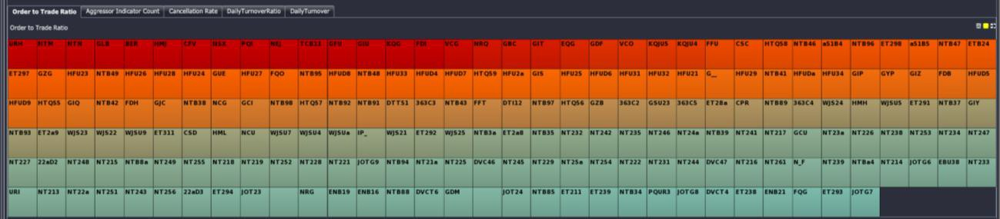<br>
<small>_Figure 1: Heat map of the Order to Trade ratio (OTR) for 200 brokers
visualized via Kx Dashboards. Approximate color scheme: red &gt;
1000 &gt; orange &gt; 15 &gt; blue &gt; 0. All codes have been scrambled._</small>


### Cancellation rates

This metric is designed to detect a technique known as ‘fishing’ whereby HF traders rapidly create and cancel orders to test the market within the spread. To calculate the cancellation rate we count the number of orders that each broker created and cancelled under a specified holding time. The example below illustrates the number of orders that each broker held for less than 1 millisecond. While the technique is not necessarily manipulative, it can intentionally coerce other participants and their algorithms to enter the market. Seeing as these orders are unlikely to be filled by fundamental investors they add no benefit to the liquidity or spread. Additionally the high message turnover can be disruptive to the market and its participants. High cancellation rates within the spread can be indicative of quote-stuffing (described below in [_Examining potentially harmful strategies_](#examining-potentially-harmful-strategies)).

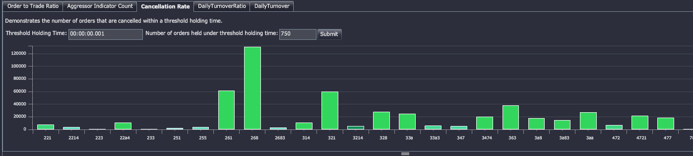<br>
<small>_Figure 2: Column chart displaying the number of orders per broker that were held for less than 1 millisecond visualized via Dashboards
for Kx. The selection only shows brokers that had at least 750 orders
cancelled within the specified holding time. All codes have been
scrambled._</small>

```q
// - Cancellation rate calculation
select count i by brokerID from dxOrder 
  where orderType in `new`cancelled, 
    00:00:00.001 > 1D^ ({x – prev x};transactTime) fby orderID
// - Use fby in the where clause to group transactTime per orderID
// - Apply the function {x-prev x} to each orderID's list of transactTime 
//   to calculate the time between each message
// - Count each message in the table by brokerID 
//   where the time between the message and the previous message (by orderID) 
//   is less than 1 millisecond
```


### Daily turnover

Huge traded volumes and short holding times are a major indicator for high-frequency activity. HF traders will avoid holding overnight risk so it is common to close most positions before the end of day. This allows us to look back historically and search for brokers that have closed out all positions in a number of stocks. A position is considered closed out if the volume bought is equal to the volume sold. Counting the number of stocks that are completely closed out within a day will also identify day traders. Therefore the purpose of this metric is to provide a list of possible HF traders that can be further investigated.

The image below illustrates a range of brokers that bought and sold equal parts of at least 14 stocks in the same day. The size of the bubble represents the number of stocks that were completely closed out and the color indicates the turnover within the day. This value can be adjusted to look for traders that partially closed out positions. By drilling into the activities of a specific trader (i.e. the highlighted green bubble below) the total volume bought and sold within the day can be examined.

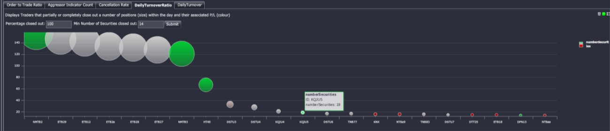<br>
<small>_Figure 3: Turnover ratio to identify traders with high close-out positions (typically day traders). The bubble size indicates the number of stocks that were entirely closed out within the day while the color represents the daily profit and loss. Image visualized via Kx Dashboards._</small>

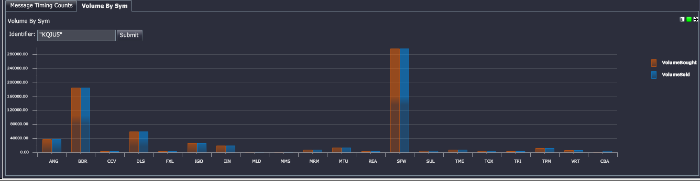<br>
<small>_Figure 4: Volume bought and sold for a broker that had a very high turnover ratio visualized via Kx Dashboards. In this example it is clear to see almost all of the stocks were close-outs (equal bought/sold)._</small>


### Message profiling

HF Traders can be further categorized by tracking the types of messages and the rate that a person of interest can send them. By calculating the time in between each message from a person of interest a profile can be drawn that details the messaging capabilities of a trader. Traders that demonstrate a left-skewed message rate histogram (majority of orders under 20ms) are likely to be high-frequency traders. Order distribution of a trader or participant assists in identifying frequent cancellations and ‘intent to trade’ but perhaps with very few trades actually generated.

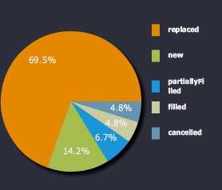 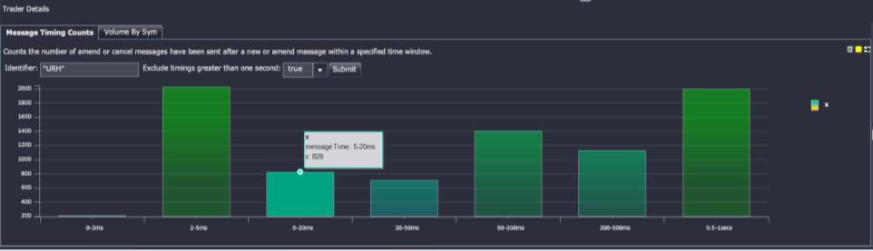<br>
<small>_Figure 5: Message profiling. First chart shows proportion by orderType (New, cancelled, replaced etc.) and second chart shows the message rates as a frequency histogram by message latencies (sub-second). Images visualized via Kx Dashboards._</small>

```q
// - Time profiling code. Bucket sizes and labels
timekey:`$("0";"0-2ms";"2-5ms";"5-20ms";"20-50ms";
  "50-200ms";"200- 500ms";"0.5-1secs";">1secs")

timebuckets: 0D00:00:00 0D00:00:00.000000001 0D00:00:00.002 0D00:00:00.005 
  0D00:00:00.02 0D00:00:00.05 0D00:00:00.2 0D00:00:00.5 0D00:00:01

// - Query to produce the result in the second image of Figure 5
select NumberOfMessages:count i
  by TimeBucket: timekey timebuckets bin transactTime-prev transactTime
  from dxOrder 
  where brokerID=`PersonOfInterest, orderStatus in `new`replaced`cancelled

// - Use the bin function to group the timespans between orders 
//   into set buckets
// - Apply the timekey list to give each bucket a sensible name
```

By focusing on parties of interest regulators can better understand their individual trading techniques and monitor the market more effectively.


## Examining potentially harmful strategies

### Quote stuffing

Quote-stuffing is a technique whereby a trader floods the market with orders and rapidly cancels them. The ‘noise’ created by the influx of orders can affect other traders’ latency and create an arbitrage opportunity for the high-frequency trader. If the orders are ‘stuffed’ within the spread, other traders can perceive a false impression of the market. Quote-stuffing generally occurs in bursts and will last less than 10 seconds on average (Credit Suisse, 2012).

```q
// - Function to pull back the quote table on a date (dt) for any stock (s)
// - burstperiod is the length of time we expect the quote-stuffing to occur
// - pricemovements is the minimum number of movements 
//   that have to occur within the burstperiod

quoteFluctuationSym:{[dt;s;pricemovements;burstperiod]
  select from dxQuote where date=dt,sym=s,
    pricemovements < 
      ({sum (<>':) x};bid) fby (burstperiod xbar transactTime.second) }

// - Pull back all possible examples of quote stuffing for BHP on 2013.11.08 
//   that lasted at least 5 seconds and contained 
//   60 adjustments to the top of book
quoteFluctuationSym[2013.10.08;`BHP;60;5]
```

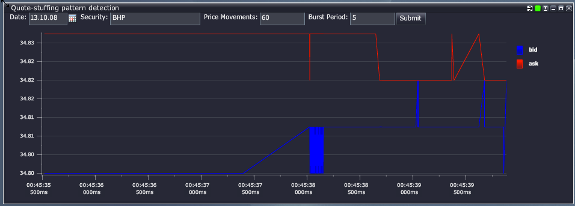<br>
<small>_Figure 6: Quote stuffing example for BHP (AUD) in 2013 visualized via Kx Dashboards. The burst is comprised of over 60 alterations to the best bid over a period of 0.12 seconds._</small>

Detecting instances of quote stuffing allows for market analysis around the time of the burst. Further analysis is used to determine market impact of the behavior and could result in a warning or fine.


## Price fade

Price fade is when a trade occurs on a particular venue, and then immediately after the trade the volume disappears. This could potentially be due to traders layering the order-book, their high speed enabling such rapid cancellations. Here we look at a function that searches for price fades using market data taken from the Australian markets.

Below we look at the skeleton function for finding price fades (not all lines of codes have been included, indicated by a ‘…’):

```q
getPriceFadesData:{[dt;psym;timeThreshold;qtyThreshold;keycols]

    /- get orders and trades
... /- initial select statements have been excluded from this code block
    /- create brokerID column from a combination of other columns, 
    /  then add on AJKEY col
    /- change side to be opposite side, to join with 
    /  opposite side of aggressor indicator

orders:`AJKEY`transactTime xasc 
  update AJKEY: .Q.fu[
    {`$"!" sv string value x}each;
    (`orderside,keycols)#orders ]
  from orders
```

Here we have added on an `AJKEY` column that creates a unique key column which is a combination of `orderside`, `sym` and any other key input (e.g. `marketID`), separated by `!` and cast to symbol. It makes use of the function `.Q.fu`, that is an efficient tool when a function needs to be applied across a large list that is composed by a small set of unique values. `.Q.fu` determines the distinct set of elements in the large list and their indexes. It then applies the function to the small set of unique elements in the list. The results of that calculation are then applied back to the original list using the indexes of each distinct element. By applying `.Q.fu` the number of times that a function is applied is reduced to be the number of distinct elements in the list.

```q
/- get window and wj on price/qty info
w:(tlist;
  tlist|(-1+trades[`nextTime]) & timeThreshold+tlist:trades`transactTime)
```

Here we define the time windows to be used (note that `nextTime` is the next time by `AJKEY` from the trades data we have pulled back). Note that we only want to include information up until at most the next time a trade occurs but still inside the `timeThreshold`, hence taking the minimum of the next trade time and the `timeThreshold` + current trade time.

```q
wres: wj1[w; `AJKEY`transactTime; trades;
  (update `p#AJKEY from orders;
    (::;`ordertime);
    (::;`seqNum);
    (::;`brokerID);
    (::;`orderprice);
    (::;`orde rside);
    (::;`orderqty);
    (::;`orderLeavesQty) 
  ) ]
```

In this particular analysis we only want order information that occurs strictly within the time windows. To do this we use `wj1`, which considers orders on or after entry to the window (as opposed to `wj` which includes prevailing orders).

```q
/- add on fade indicator
res: update fade: 0<count each brokerID from wres
...
/- determine full/partial fades

update 
  fullFade:    ?[aggressorIndicator="B"; 
    (sellLeavesQty=0) and fade; 
    (buyLeavesQty=0)  and fade],
  partialFade: ?[aggressorIndicator="B";
    (sellLeavesQty>0) and fade;
    (buyLeavesQty>0)  and fade]
  from res; }
```

This enables us to look at the probability of a price fade occurring:

```q
/- calculates the probability of full/partial price fades occurring over time
/  (given a date range)
getPriceFadesProbability:{[sd;ed;psym;timeThreshold;qtyThreshold;keycols]
  /- first run price fades on weekdays
  res:getPriceFadesData[;psym;timeThreshold;qtyThreshold;keycols] peach 
    dtlist where 1<(dtlist: sd+til 1+ed-sd) mod 7;
```

Above we run the `priceFades` data on a list of dates using `peach` (with the process having started with `–s` set to enable secondary processes).

```q
...
  /- exit early if no price fades
  if[not count res: raze 0!' res where 0<count each res;:()];
  /- calculate probabilities of full and partial fades
  select 
    probFullFade: 100*sum[fullFade]%count i, 
    probPartialFades: 100*sum[partialFade]%count i, 
    trades: count i by bkt xbar transactTime.minute 
    from res }
```

Here we can determine full takes, i.e. when the entire quantity has been filled.

```q
getPriceFades:{[dt;psym;timeThreshold;qtyThreshold;keycols]
  res: getPriceFadesData[dt;psym;timeThreshold;qtyThreshold;keycols];
  res: 0! select 
    by transactTime, orderSeqNum from 
    ungroup select 
      transactTime,
      orderSeqNum:seqNum, 
      price, 
      brokerID, 
      orderqty, 
      buyLeavesQty, 
      sellLeavesQty, 
      orderprice,
      orderside,
      aggressorIndicator 
      from res;

  /- classify full takes as having no leaves quantity remaining
  update fullTake: ?[aggressorIndicator="S"; buyLeavesQty=0; sellLeavesQty=0] 
    from select from res }
```

This enables us to profile different brokers based on partial fades, full fades, finding the average order quantities for each.

```q
/- profiling different brokers
getPriceFadesAggregated:{[dt;psym;timeThreshold;qtyThreshold;keycols]
  /- pull out price fades
  fades: getPriceFades[dt;psym;timeThreshold;qtyThreshold;keycols];
  /- aggregate the partial/full fades by brokers
  select 
    partialFades: sum not fullTake, 
    fullFades: sum fullTake, 
    bothFades: count i, 
    avgFullTakes: avg fullTake*orderqty, 
    avgPartialTakes: avg orderqty*not fullTake, 
    avgBoth: avg orderqty by brokerID from fades
}
```

It is interesting to look at the price-fade time profile over a range of dates.

```q
/- for profiling over time, range of dates
getPriceFadesTimeProfileDates:{
  [sd;ed;psym;timeThreshold;qtyThreshold;keycols;bkt]
  /- pull out price fades
  fades:getPriceFades[;psym;timeThreshold;qtyThreshold;keycols] peach 
    dtlist where 1<(dtlist: sd+til 1+ed-sd) mod 7;
  ...
  select 
    partialFades: sum not fullTake, 
    fullFades: sum fullTake, 
    bothFades: count i by bkt xbar transactTime.minute from fades }
```


## Examples 

### Sample 1

Full price fade, time threshold set to 00:00:00.1, min order qty set to 100

```q
transactTime      | 2013.10.08D10:17:10.888910900
sym               | `SYMA
marketSegmentID   | `MKTA
price             | 1.83
seqNum            | 451421 451422
qty               | 8f
buyLeavesQty      | 0f
sellLeavesQty     | 376f
aggressorIndicator| "S"
AJKEY             | `S!SYMA!MKTA
nextTime          | 2013.10.07D23:17:11.332014400
ordertime         | 2013.10.07D23:17:10.946351200
brokerID          | ,`BROKER1!ACCT1!SECACCT1
orderprice        | 1.85 1.855
orderside         | "SS"
orderqty          | 6972 12138f
orderLeavesQty    | 0 0f
fade              | 1b
fullFade          | 1b
partialFade       | 0b
```


### Sample 2

Partial fade, time threshold set to 00:00:00.1, min order qty set to 100

```q
transactTime      | 2013.10.08D12:03:05.133341400
sym               | `SYMB
marketSegmentID   | `MKTB
price             | 1.085
seqNum            | 2204182 2204184
qty               | 47f
buyLeavesQty      | 0f
sellLeavesQty     | 7254f
aggressorIndicator| "B"
AJKEY             | `B!SYMB!MKTB
nextTime          | 2013.10.08D01:03:05.164701700
ordertime         | 2013.10.08D01:03:05.146682300
brokerID          | `BROKER1!ACCT1!SECACCT1`BROKER2!ACCT2!SECACCT2 
orderprice        | 1.08 1.08
orderside         | "BB"
orderqty          | 604 7342f
orderLeavesQty    | 0 0f
fade              | 1b
fullFade          | 0b
partialFade       | 1b
```


### Timing

All the examples and sample outputs shown here are being run on a regular laptop computer using the 32-bit version (specs: 2.4 GHz Intel Core i5, Memory: 8 GB 1333 MHz DDR3), and even then the timings are relatively fast. It must be noted that the price-fades functions are expensive by nature, e.g. implementing a window join – which involves a lot of heavy processing. Sample timing below:

```q
KDB+ 3.1 2014.03.27 Copyright (C) 1993-2014 Kx Systems
m32/ 4()core 8192MB ryansparks ryans-macbook-pro.local 192.168.2.30 NONEXPIRE
q)\t getPriceFadesData[2013.10.07;`;0D00:00:00.1;100;`sym`marketSegmentID] 
6510
```

This clearly highlights the speed and succinctness with which kdb+ can
be used to monitor and analyse high-frequency trading patterns.

### Example 1

Probability of price fades occurring, under 00:00:00.001 second threshold

The probability of full fades occurring here are shown to be around 10% throughout the trading day, with partial fades much more likely to occur.

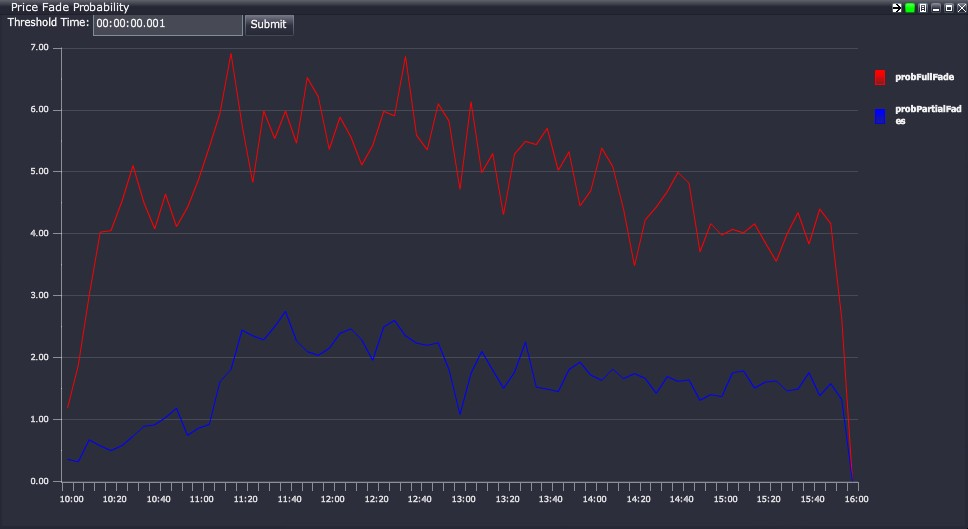<br>
<small>_Figure 7: Probability of price fades, 0.001 second time threshold.
Full price fade in red, partial in blue_</small>


### Example 2

Probability of price fades occurring, under 00:00:00.1 second threshold

The probability of full fades is close to 12% throughout most of the trading day, with partial fades only about 30% as likely.

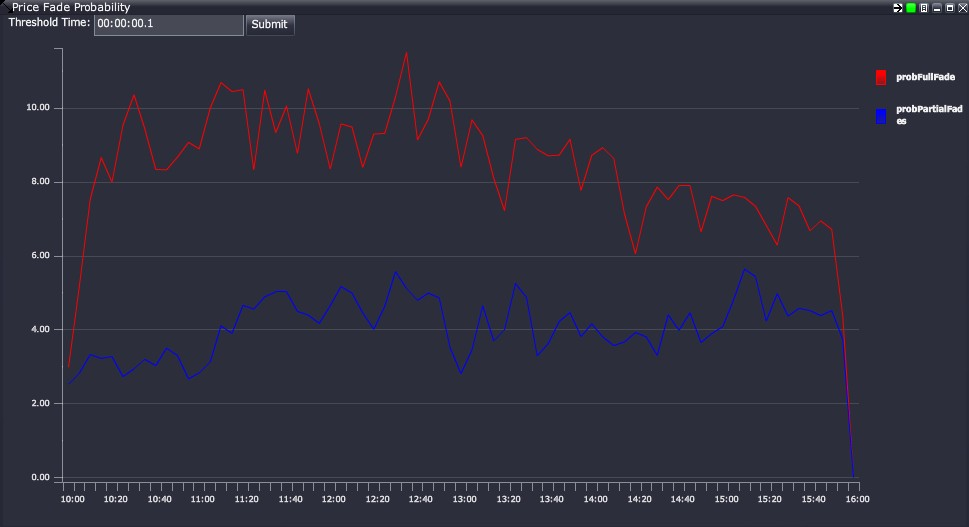<br>
<small>_Figure 8: Probability of price fades, 0.1 second time threshold. Full price fade in red, partial in blue_</small>


### Example 3

Probability of price fades occurring, under 00:00:01 second threshold

With a much higher time threshold, full fades are about 14% likely to occur. Interestingly, partial fades occur at around 7%, relatively higher than the smaller time thresholds

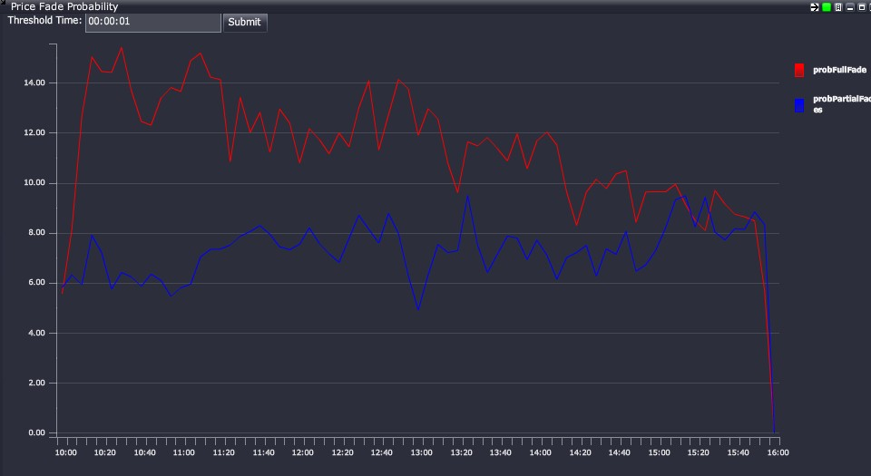<br>
<small>_Figure 9: Probability of price fades, 1 second time threshold_</small>


### Example 4

Volume of full vs partial fades throughout a trading day, using 00:00:00.1 time threshold

The highest volume of fades here tend to occur around lunch time and towards the end of the day, interestingly both full and partial fades follow a very similar trend.

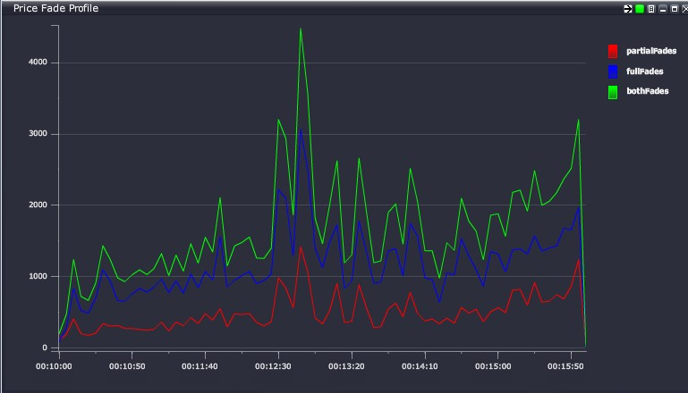<br>
<small>_Figure 10: Volume of price fades, 0.1 second time threshold_</small>


### Example 5

Average size of full fades, using 1-second time threshold

We see a relatively large number of mid-sized price fades occurring.

```q
fadeSize| fadeCount
--------| ---------
0       | 31070
50      | 12139
100     | 34775
500     | 13856
1000    | 19926
10000   | 2575
100000  | 113
```


### Example studies of real-time HFT analysis

Here we examine some of the footprints a HFT exhibits.

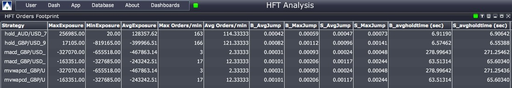<br>
<small>_Figure 11: HFT and Algo profiling, whereby strategies become evident through attributes and metrics such as order rates, trade rates, holding times, buy/sell impact on the book etc. This could include Order to Trade ratios._</small>


## Conclusion

The focus of market surveillance is to maintain integrity within the market by ensuring there is a fair and safe environment for all participants. High-frequency trading has the potential to make the market unsafe, and as such it is important to be able to identify and label high-frequency traders. By specifically analyzing their trading activity, unsavory and predatory techniques can be better regulated and stamped out by the regulator and exchange alike. However, legitimate high-frequency trading brokers need to be reassured that they will not be persecuted if they operate ethically and within their legal bounds. 

Kdb+ provides a perfect platform for doing this, with its flexibility and high speed allowing real-time and historical analysis of these strategies to be developed quickly and dynamically as the HFT world evolves. The analysis can be used to detect algorithmic-induced price crashes, and therefore give exchanges the power and foresight to stop possible crashes before too much damage is done. Some simple real market analysis with kdb+ indicates there are
instances of unsavory HFT practices occurring within the Australian market. The fundamental analysis found that the probability of a full price fade occurring is around 7 to 15% throughout a trading day. 

A standard personal laptop can analyse 10 million orders and 1 million trades for full and partial price fade information in under 7 seconds using the 32-bit kdb+ version, giving an indication of how powerful kdb+ is for Big Data time-series analysis. Having all of this done in around 10 lines of (relatively verbose for q) code shows how it is the perfect technology for HFT analysis. As the effects of such HFT practices are still not completely understood, this highlights the need for more stringent regulation, testing and research.

In September of 2013 the Australian market regulator ASIC upgraded their market-surveillance system to a kdb+ solution. Greg Yanco, a senior executive leader at ASIC, believes that the upgrade has formed a faster, more flexible environment for their market analysts (fixglobal, 2014). The potential for storing and selecting data with kdb+ has made this solution ideal for innovating techniques and developing new ideas for the surveillance industry as whole, making ASIC a world leader in surveillance technology.

All tests performed using kdb+ version 3.1 (2014.02.08)


## Appendix A – Kx solutions

A detailed list of the products referred to and demonstrated in this paper can be viewed at [Development tools](../../devtools.md)


## Appendix B – market data

The data analyzed throughout the paper is based on scrambled Australian Market data captured from the ASX, CHIX and XSFE markets for the purpose of surveillance. Below is a brief description and a simplified meta of tables that are referred to in sections 3 and 4.

`dxOrder`

: order table, containing approximately 10 million rows per day. This table contains all order transactions at a broker, account and client level. The types of order messages contained in the table include new, amend, cancel and restated messages.

```q
q)meta dxOrder
c                 | t f a 
------------------| ----- 
transactTime      | p      transaction time from exchange
sym               | s      sym
marketSegmentID   | s      the market it traded on
seqNum            | j      exchange sequence number
price             | f      order price
qty               | f      original order quantity
side              | c      order side
leavesQty         | f      quantity remaining on order
brokerID          | s      relevant broker
account           | C      account ID
secondaryAccountID| C      secondary account ID
```


`dxTrade`

: trade table, containing approximately 1 millions rows per day. Here is a basic meta of the table:

```q
q)meta dxTrade
c                 | t f a
------------------| -----
transactTime      | p      transaction time from exchange 
sym               | s      sym
marketSegmentID   | s      market traded on
price             | f      traded price
seqNum            | j      exchange sequence number
qty               | f      traded quantity
buyLeavesQty      | f      quantity remaining on buy order
sellLeavesQty     | f      quantity remaining on sell order
buyBrokerID       | s      broker identifier on the buy order
buyAccount        | C      account identifier on the buy order
sellBrokerID      | s      broker identifier on the sell order
sellAccount       | C      account identifier on the sell order
aggressorIndicator| c      aggressor indicator
```


## Bibliography

-   ASIC. (2013). *Report 331 - Dark liquidity and high-frequency trading.* Australian Securities and Investments Commission.
-   Comstock, C. (2010). *First High Frequency Firm is Fined for Quote
Stuffing and Manipulation.* Business Insider.
-   Credit Suisse. (2012). *High Frequency Trading – Measurement, Detection and Response.*
-   Finextra. (2014). *ASIC hits out at 'Flash Boys' hysteria.*
-   fixglobal. (2014). *The Challenge Of Global Market Surveillance.*
-   Knowledge@Wharton. (2009). *The Impact of High-frequency Trading: Manipulation, Distortion or a Better-functioning Market?*
-   Sydney Morning Herald. (2014). *High-speed trading costs investors \$2b, say industry super.*
-   University of Pennsylvania. (2009). *The Impact of High-frequency Trading: Manipulation, Distoring or a Better-functioning Market?* USA.


## Authors

Sam Stanton-Cook, Ryan Sparks, Dan O’Riordan and Rob Hodgkinson
