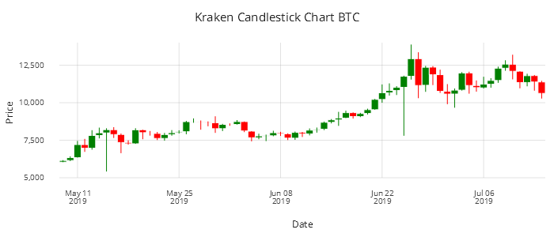
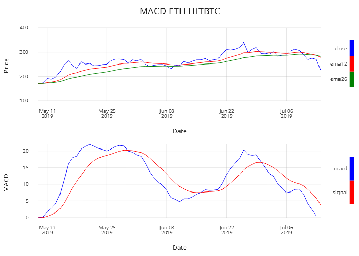
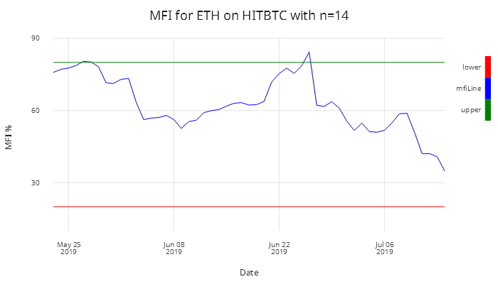
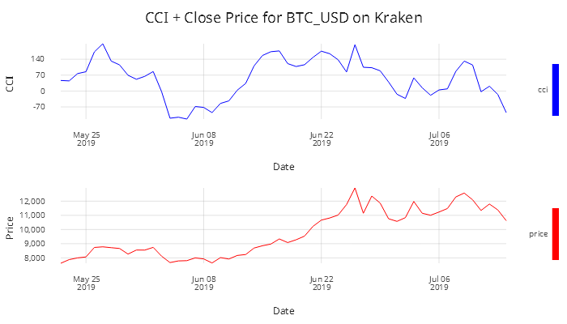
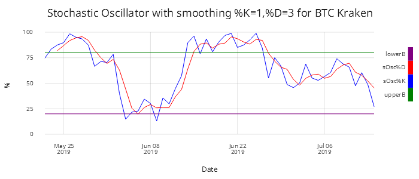
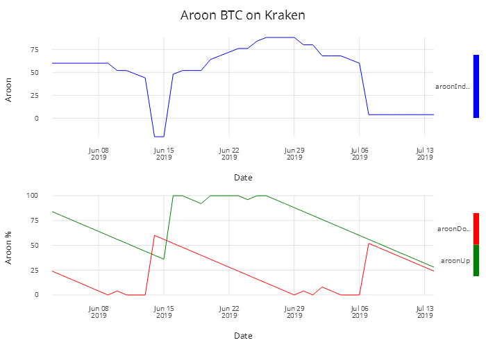

---
title: Implementing trend indicators in kdb+  | White papers | Documentation for kdb+ and q
author: James Galligan
date: April 2020
description: Using kdb+ to produce trade analytics – indicators and oscillators traders commonly use to trigger buy/sell signals and clarify their picture of the market.
---
White paper
{: #wp-brand}

# Implementing trend indicators in kdb+

by [James Galligan](#author)
{: .wp-author}




The compactness of kdb+ and the terseness of q focus code on a small number of high-performing native built-in functions rather than extensive libraries. Kdb+ users often develop libraries of their own domain-specific algorithms and functions, for convenience and to support reuse. 

In this paper, we show examples of functions commonly used in finance, built on native q functions.

Cryptocurrency data for Bitcoin and Ethereum from multiple exchanges are used in the examples. 

Charts are displayed using the :fontawesome-solid-laptop-code: [Kx Analyst](https://kx.com/solutions/the-enterprise/analyst/) IDE.

The code used in this paper can be found at
:fontawesome-brands-github:
[kxcontrib/trend-indicators](https://github.com/kxcontrib/trend-indicators).
It is developed on kdb+ version 3.6 2019.03.07.


## Data extraction

Data was captured in a process similar to that used in Eduard Silantyev’s blog [“Combining high-frequency cryptocurrency venue data using kdb+”](https://kx.com/blog/combining-high-frequency-cryptocurrency-venue-data-using-kdb/).
Trade and quote tick data for Ethereum (ETH) and Bitcoin (BTC) denominated in the US dollar (USD) was collected from four exchanges

-  Bitfinex
-  HitBtc
-  Kraken
-  Coinbase

spanning May, June and July 2019: just over two months of data.

A Python script connected to exchange feeds and extracted the relevant data, which was then published to a kdb+ tickerplant. The tickerplant processed the messages and sent them to a real-time database (RDB). At the end of the day the data was then written to a historical database (HDB) where it could be accessed for analysis. Such details will not be elaborated on, as the focus of this paper is implementing Trend Indicators using kdb+.

For help with tick capture:

* :fontawesome-regular-map: [Kdb+tick profiling for throughput optimization](../tick-profiling.md)
* :fontawesome-regular-map: [Disaster-recovery planning for kdb+ tick systems](../disaster-recovery/index.md)
* :fontawesome-regular-map: [Query Routing: A kdb+ framework for a scalable, load balanced system](../query-routing/index.md)

To make it easy to follow through this paper and execute the functions/indicators created there is a sample of close data located in the GitHub repository. This is a small binary flat file which can be loaded into kdb+/q. The close data contains the daily high/low/open/close and volume of trades for Bitcoin trading on Kraken and the table is called `bitcoinKraken`. This table will be used throughout the paper to show how you can apply the functions/indicators to an in-memory kdb+ table.

```q
q)bitcoinKraken:get `:bitcoinKraken
q)\l cryptoFuncs.q
"loading in cryptoFuncs"
q)10#bitcoinKraken
date       sym     exch   high   low    open   close  vol
--------------------------------------------------------------
2019.05.09 BTC_USD KRAKEN 6174   6037.9 6042   6151.4 1808.803
2019.05.10 BTC_USD KRAKEN 6430   6110.1 6151.4 6337.9 9872.36
2019.05.11 BTC_USD KRAKEN 7450   6338   6339.5 7209.9 18569.93
2019.05.12 BTC_USD KRAKEN 7588   6724.1 7207.9 6973.9 18620.15
2019.05.13 BTC_USD KRAKEN 8169.3 6870   6970.1 7816.3 19668.6
2019.05.14 BTC_USD KRAKEN 8339.9 7620   7817.1 7993.7 18118.61
2019.05.15 BTC_USD KRAKEN 8296.9 5414.5 7988.9 8203   11599.71
2019.05.16 BTC_USD KRAKEN 8370   7650   8201.5 7880.7 13419.86
2019.05.17 BTC_USD KRAKEN 7946.2 6636   7883.6 7350   21017.35
2019.05.18 BTC_USD KRAKEN 7494.2 7205   7353.9 7266.8 6258.585
```


## Technical analysis

Technical analysis is the process of identifying trading opportunities based on past price movements using different stock charts. Trend/technical traders use a combination of patterns and indicators from price charts to help them make financial decisions. Investors analyze price charts to develop theories about what direction the market is likely to move. Commonly used in technical analysis tools are the Candlestick chart, Moving Average Convergence Divergence and Relative Strength Index. These tools are created using q/kdb+’s in-built functions such as `mavg`, `ema`, `min`, `max`, and `avg`.  The tools discussed do not predict future prices but provide the investor information to determine their next move. The indicators create buy and sell signals using moving averages, prices, volume, days since previous high or low. The investor can then make his financial decision based on the signals created.


### Pattern recognition

The candlestick chart is used for describing price movements in a particular security. The chart illustrates the open/high/low/close of a security and is used by traders to identify patterns based on past movements.

```q
candlestick : {
  fillscale : .gg.scale.colour.cat 01b!(.gg.colour.Red; .gg.colour.Green);

  .qp.theme[enlist[`legend_use]!enlist 0b]
  .qp.stack (
    // open/close
    .qp.interval[x; `date; `open; `close]
      .qp.s.aes[`fill; `gain]
        ,.qp.s.scale[`fill; fillscale]
        ,.qp.s.labels[`x`y!("Date";"Price")]
        ,.qp.s.geom[`gap`colour!(0; .gg.colour.White)];
      // low/high
      .qp.segment[x; `date; `high; `date; `low]
        .qp.s.aes[`fill; `gain]
        ,.qp.s.scale[`fill; fillscale]
        ,.qp.s.labels[`x`y!("Date";"Price")]
        ,.qp.s.geom[enlist [`size]!enlist 1]) }

.qp.go[700;300]
  .qp.theme[.gg.theme.clean]
  .qp.title["Candlestick chart BTC"]
  candlestick[update gain: close > open
    from select from wpData where sym=`BTC_USD,exch=`KRAKEN]
```


<br>
<small>_Figure 1: Bitcoin Candlestick Chart using Kraken data_</small>

Each candle shows the high/open/close/low and if our security closed higher than the open. This can be useful in predicting short term price movements.


### Simple Moving Averages

The price of a security can be extremely volatile and large price movements can make it hard to pinpoint the general trend. Moving averages ‘smooth’ price data by creating a single flowing line. The line represents the average price over a period of time. Which moving average the trader decides to use is determined by the time frame in which he or she trades.

There are two commonly used moving averages: Simple Moving Average (SMA) and Exponential Moving Average (EMA). EMA gives a larger weighting to more recent prices when calculating the average. In Figure 2 you can see the 10-day moving average and 20-day moving average along with the close price.

Traders analyze where the current trade price lies in relation to the moving averages. If the current trade price is  above the moving-average (MA) line this would indicate over-bought (decline in price expected), trade price below MA would indicate over-sold (increase in price may be seen).

It should be noted that a signal/trend indicator would not determine a trading strategy but would be analyzed in conjunction with other factors.

Now using the previously defined `bitcoinKraken` table we can start to apply our own simple moving averages. In the example below the 2- and 5-day moving averages are calculated on the close price. This can be updated to get the moving average of any of the numeric columns like high price for example or you could alter the number of periods used. In Figure 2 the 10- and 20-day moving averages are used. This can be adjusted depending on your needs. Short-term traders would be interested in relatively short time periods whereas long-term investors who want an overall picture of a security would compare large periods like 100 and 200 days.

```q
q)10#update sma2:mavg[2;close],sma5:mavg[5;close] from bitcoinKraken
date       sym     exch   high   low    open   close  vol      sma2    sma5
-------------------------------------------------------------------------------
2019.05.09 BTC_USD KRAKEN 6174   6037.9 6042   6151.4 1808.803 6151.4  6151.4
2019.05.10 BTC_USD KRAKEN 6430   6110.1 6151.4 6337.9 9872.36  6244.65 6244.65
2019.05.11 BTC_USD KRAKEN 7450   6338   6339.5 7209.9 18569.93 6773.9  6566.4
2019.05.12 BTC_USD KRAKEN 7588   6724.1 7207.9 6973.9 18620.15 7091.9  6668.275
2019.05.13 BTC_USD KRAKEN 8169.3 6870   6970.1 7816.3 19668.6  7395.1  6897.88
2019.05.14 BTC_USD KRAKEN 8339.9 7620   7817.1 7993.7 18118.61 7905    7266.34
2019.05.15 BTC_USD KRAKEN 8296.9 5414.5 7988.9 8203   11599.71 8098.35 7639.36
2019.05.16 BTC_USD KRAKEN 8370   7650   8201.5 7880.7 13419.86 8041.85 7773.52
2019.05.17 BTC_USD KRAKEN 7946.2 6636   7883.6 7350   21017.35 7615.35 7848.74
2019.05.18 BTC_USD KRAKEN 7494.2 7205   7353.9 7266.8 6258.585 7308.4  7738.84
```

The graph in Figure 2 was created using Kx Analyst. A sample for this code can be seen below. All Graphics of Grammar code can be found in the repository for this project. The following is an example.

```q
sma:{[x]
  .qp.go[700;300]
    .qp.title["SMA BTC Kraken"]
    .qp.theme[.gg.theme.clean]
      .qp.stack(
        .qp.line[x; `date; `sma10]
          .qp.s.geom[enlist[`fill]!enlist .gg.colour.Blue]
          ,.qp.s.scale [`y; .gg.scale.limits[6000 0N] .gg.scale.linear]
          ,.qp.s.legend["";
            `sma10`sma20`close!(.gg.colour.Blue;.gg.colour.Red;.gg.colour.Green)]
          ,.qp.s.labels[`x`y!("Date";"Price")];
        .qp.line[x; `date; `sma20]
          .qp.s.geom[enlist[`fill]!enlist .gg.colour.Red]
            ,.qp.s.scale [`y; .gg.scale.limits[6000 0N] .gg.scale.linear]
            ,.qp.s.labels[`x`y!("Date";"Price")];
        .qp.line[x; `date; `close]
          .qp.s.geom[enlist[`fill]!enlist .gg.colour.Green]
          ,.qp.s.scale [`y; .gg.scale.limits[6000 0N] .gg.scale.linear]
          ,.qp.s.labels[`x`y!("Date";"Price")])}
```
```q
q)sma[update sma10:mavg[10;close], sma20:mavg[20;close]
    from select from wpData where sym=`BTC_USD,exch=`KRAKEN]
```


<br>
<small>_Figure 2: 10- and 20-day Simple Moving Averages for Bitcoin_</small>


### Moving Average Convergence Divergence

Moving Average Convergence Divergence (MACD) is an important and popular analysis tool. It is a trend indicator that shows the relationship between two moving averages of a securities price. MACD is calculated by subtracting the long-term EMA (26 periods) from the short-term EMA (12 periods).

A period is generally defined as a day but shorter/longer timespans can be used. Throughout this paper we will consider a period to be one day.

EMAs place greater weight and significance on the more recent data points and react more significantly to price movements than SMA. The 9-day moving average of the MACD is also calculated and plotted. This line is known as the signal line and can be used to [identify buy and sell signals](https://www.investopedia.com/terms/m/macd.asp).

The code for calculating the MACD is very simple and exploits kdb+/q’s built-in function `ema`. An example of how the code is executed, along with a subset of the output is displayed.

```q
/tab-table input
/id-ID you want `ETH_USD/BTC_USD
/ex-exchange you want
/output is a table with the close,ema12,ema26,macd,signal line calculated
macd:{[tab;id;ex]
  macd:{[x] ema[2%13;x]-ema[2%27;x]}; /macd line
  signal:{ema[2%10;x]}; /signal line
  res:select 
      sym, date, exch, close, 
      ema12:ema[2%13;close],
      ema26:ema[2%27;close],
      macd:macd[close] 
    from tab where sym=id, exch=ex;
  update signal:signal[macd] from res }
```
```q
q)10#macd[bitcoinKraken;`BTC_USD;`KRAKEN]
sym     date       exch   close  ema12    ema26    macd     signal
--------------------------------------------------------------------
BTC_USD 2019.05.09 KRAKEN 6151.4 6151.4   6151.4   0        0
BTC_USD 2019.05.10 KRAKEN 6337.9 6180.092 6165.215 14.87749 2.975499
BTC_USD 2019.05.11 KRAKEN 7209.9 6338.524 6242.599 95.92536 21.56547
BTC_USD 2019.05.12 KRAKEN 6973.9 6436.274 6296.769 139.505  45.15338
BTC_USD 2019.05.13 KRAKEN 7816.3 6648.586 6409.327 239.2588 83.97447
BTC_USD 2019.05.14 KRAKEN 7993.7 6855.527 6526.688 328.8385 132.9473
BTC_USD 2019.05.15 KRAKEN 8203   7062.83  6650.859 411.9708 188.752
BTC_USD 2019.05.16 KRAKEN 7880.7 7188.656 6741.959 446.6977 240.3411
BTC_USD 2019.05.17 KRAKEN 7350   7213.478 6786.999 426.4797 277.5688
BTC_USD 2019.05.18 KRAKEN 7266.8 7221.682 6822.54  399.1421 301.8835
```

Figure 3 graphs the MACD for `ETH_USD` using data from HITBTC.


<br>
<small>_Figure 3: Moving Average Convergence Divergence for Ethereum using HITBTC data_</small>

From the above graph, you can see how the close price interacts with the short and long EMA and how this then impacts the MACD and signal-line relationship. There is a buy signal when the MACD line crosses over the signal line and there is a short signal when the MACD line crosses below the signal line.


### Relative Strength Index


<br>
<small>_Figure 4: Relative Strength Index for Ethereum using HITBTC data_</small>

Relative Strength Index (RSI) is a momentum oscillator that measures the speed and change of price movements. It oscillates between 0-100. It is said that a security is overbought when above 70 and oversold when below 30. It is a general trend and momentum indicator. The default period is 14 days. This can be reduced or increased – the shorter the period, the more sensitive it is to price changes. Short-term traders sometimes [look at 2-day RSIs](https://school.stockcharts.com/doku.php?id=technical_indicators:relative_strength_index_rsi) for overbought readings above 80 and oversold ratings below 20.

$$RSI=100 - \frac{100}{1+RS}$$

$$RS=\frac{Average Gain}{Average Loss}$$

The first calculation of the average gain/loss are simple 14-day averages.

First Average Gain: sum of Gains over the past 14 days/14

First Average Loss: sum of Losses over the past 14 days/14


The subsequent calculations are based on the prior averages and the current gain/loss.

$$ AvgGain=\frac{(prev Avg Gain)\times 13 + current Gain}{14}$$

$$ AvgLoss=\frac{(prev Avg Loss)\times 13 + current Loss}{14}$$

```q
//Relative strength index - RSI
//close-close price
/n-number of periods
relativeStrength:{[num;y]
  begin:num#0Nf;
  start:avg((num+1)#y);
  begin,start,{(y+x*(z-1))%z}\[start;(num+1)_y;num] }

rsiMain:{[close;n]
  diff:-[close;prev close];
  rs:relativeStrength[n;diff*diff>0]%relativeStrength[n;abs diff*diff<0];
  rsi:100*rs%(1+rs);
  rsi }
```
```q
q)update rsi:rsiMain[close;14] by sym,exch from wpData
```

It is shrewd to use both RSI and MACD together as both measure momentum in a market, but, because they measure different factors, they sometimes give contrary indications. Using both together can provide a clearer picture of the market. RSI could be showing a reading of greater than 70, this would indicate that the the security is overbought, but the MACD is signaling that the market is continuing in the upward direction.


### Money Flow Index


<br>
<small>_Figure 5: Money Flow Index for Ethereum where n=14_</small>

Money Flow Index (MFI) is a technical oscillator similar to RSI but which instead uses price and volume for identifying overbought and oversold conditions. This indicator weighs in on volume and not just price to give a relative score. A low volume with a large price movement will have less impact on the relative score compared to a high volume move with a lower price move.

You see new highs/lows and large price swings but also if there is a price swing whether there is any volume behind the move or if it is just a small trade. The market will generally correct itself. It can be used to spot divergences that warn traders of a change in trend. MFI is known as the [volume-weighted RSI](https://school.stockcharts.com/doku.php?id=technical_indicators:money_flow_index_mfi).

We use the `relativeStrength` function as in the RSI calculation above.

```q
mfiMain:{[h;l;c;n;v]
  TP:avg(h;l;c);                    / typical price
  rmf:TP*v;                         / real money flow
  diff:deltas[0n;TP];               / diffs
  /money-flow leveraging func for RSI
  mf:relativeStrength[n;rmf*diff*diff>0]%relativeStrength[n;abs rmf*diff*diff<0];
  mfi:100*mf%(1+mf);                /money flow as a percentage
  mfi }
```
```q
q)update mfi:mfiMain[high;low;close;14;vol] by sym,exch from wpData
```


<br>
<small>_Figure 6: MFI versus RSI_</small>

Analysts use both RSI and MFI together to see whether a price move has volume behind it.

Here is another good example to show the output of the update columns after applying the indicators to the in memory table defined above as `bitcoinKraken`. The table below shows `bitcoinKraken` updated with the output columns attached on to the end. This shows how easy it is to compare statistical outputs. In Figure 6 the 14-day period RSI and MFI are compared, but below a 6-day period is chosen.

```q
q)10#update rsi:rsiMain[close;6],mfi:mfiMain[high;low;close;6;vol] from bitcoinKraken
date       sym     exch   high   low    open   close  vol      rsi      mfi
--------------------------------------------------------------------------------
2019.05.09 BTC_USD KRAKEN 6174   6037.9 6042   6151.4 1808.803
2019.05.10 BTC_USD KRAKEN 6430   6110.1 6151.4 6337.9 9872.36
2019.05.11 BTC_USD KRAKEN 7450   6338   6339.5 7209.9 18569.93
2019.05.12 BTC_USD KRAKEN 7588   6724.1 7207.9 6973.9 18620.15
2019.05.13 BTC_USD KRAKEN 8169.3 6870   6970.1 7816.3 19668.6
2019.05.14 BTC_USD KRAKEN 8339.9 7620   7817.1 7993.7 18118.61
2019.05.15 BTC_USD KRAKEN 8296.9 5414.5 7988.9 8203   11599.71 90.64828 81.06234
2019.05.16 BTC_USD KRAKEN 8370   7650   8201.5 7880.7 13419.86 78.60196 85.19688
2019.05.17 BTC_USD KRAKEN 7946.2 6636   7883.6 7350   21017.35 62.25494 62.04519
2019.05.18 BTC_USD KRAKEN 7494.2 7205   7353.9 7266.8 6258.585 59.91089 62.10847
```


### Commodity Channel Index

The Commodity Channel Index (CCI) is another tool used by technical analysts. Its primary use is for spotting new trends. It measures the current price level relative to an average price level over time. The CCI can be used for any market, not just for commodities. It can be used to help identify if a security is approaching overbought and oversold levels. Its primary use is for spotting new trends. This can help traders make decisions on trades whether to add to position, exit the position or take no part.

When CCI is positive it indicates it is above the historical average and when it is negative it indicates it is below the historical average. Moving from negative ratings to high positive ratings can be used as a signal for a possible uptrend. Similarly, the reverse will signal downtrends. CCI has no upper or lower bound so finding out what typical overbought and oversold levels should be determined on each asset individually looking at its [historical CCI levels](https://www.tradingview.com/wiki/Commodity_Channel_Index_(CCI)).

$$CCI= \frac{Typical Price- Moving Average}{.015 \times Mean Deviation}$$

$$Typical Price= \frac {high+low+close}{3}$$

To calculate the Mean Deviation, a helper function called `maDev` (moving-average deviation).

```q
maDev:{[tp;ma;n]
  ((n-1)#0Nf),
    {[x;y;z;num] reciprocal[num]*sum abs z _y#x}'
    [(n-1)_tp-/:ma; n+l; l:til count[tp]-n-1; n] }
```

This was calculated by subtracting the Moving Average from the Typical Price for the last `n` periods, summing the absolute values of these figures and then dividing by `n` periods.

```q
CCI:{[high;low;close;ndays]
  TP:avg(high;low;close);
  sma:mavg[ndays;TP];
  mad:maDev[TP;sma;n];
  reciprocal[0.015*mad]*TP-sma }
```
```q
q)update cci:CCI[high;low;close;14] by sym,exch from wpData
```


<br>
<small>_Figure 7: Commodity Channel Index and close price for Bitcoin using Kraken data_</small>


### Bollinger Bands


<br>
<small>_Figure 8: Bollinger Bands for Bitcoin using Kraken data and n=20_</small>

[Bollinger Bands](https://www.investopedia.com/articles/technical/102201.asp) are used in technical analysis for pattern recognition. They are formed by plotting two lines that are two standard deviations from the simple moving-average price, one in the negative direction and one positive.

Standard deviation is a measure of volatility in an asset, so when the market becomes more volatile the bands widen. Similarly, less volatility leads to the bands contracting. If the prices move towards the upper band the security is seen to be overbought and as the prices get close to the lower bound the security is considered oversold. This provides traders with information regarding price volatility. 90% of price action occurs between the bands. A breakout from this would be seen as a major event. The breakout is not considered a trading signal. Breakouts provide no clue as to the direction and extent of future price movements.

```q
/tab-input table
/n-number of days
/ex-exchange
/id-id to run for
bollB:{[tab;n;ex;id]
  tab:select from wpData where sym=id,exch=ex;
  tab:update sma:mavg[n;TP],sd:mdev[n;TP] from update TP:avg(high;low;close) from tab;
  select date,sd,TP,sma,up:sma+2*sd,down:sma-2*sd from tab}
```
```q
q)bollB[wpData;20;`KRAKEN;`BTC_USD]
```


### Force Index

The Force Index is a technical indicator that measures the amount of power behind a price move. It uses price and volume to assess the force behind a move or a possible turning point. The technical indicator is an unbounded oscillator that oscillates between a negative and positive value.  There are three essential elements to stock price movement-direction, extent and volume. The [Force Index](https://www.investopedia.com/terms/f/force-index.asp) combines all three in this oscillator.


<br>
<small>_Figure 9: Force Index and Close Price for Bitcoin using Kraken data_</small>

The above graph is the 13-day EMA of the Force Index. It can be seen that the Force Index crosses the centre line as the price begins to increase. This would indicate that bullish trading is exerting a greater force. However, this changes towards the end of July where there is a significant change from a high positive force index to a negative one and the price drops dramatically. It suggests the emergence of a bear market.

The Force Index calculation subtracts today’s close from the prior day’s close and multiplies it by the daily volume. The next step is to calculate the 13-day EMA of this value.

```q
//Force Index Indicator
/c-close
/v-volume
/n-num of periods
//ForceIndex1 is the force index for one period
forceIndex:{[c;v;n]
  forceIndex1:1_deltas[0nf;c]*v;
  n#0nf,(n-1)_ema[2%1+n;forceIndex1] }
```
```q
q)update ForceIndex:forceIndex[close;vol;13] by sym,exch from wpData
```


### Ease of Movement Value

Ease of Movement Value (EMV) is another technical indicator that combines momentum and volume information into one value. The idea is to use this value to decide if the prices are able to rise or fall with little resistance in directional movement.

$$Distance Moved= \frac{High + Low}{2}- \frac{Prior High + Prior Low}{2}$$

$$Box Ratio= \frac{\frac{Volume}{Scale Factor}}{High- Low}$$

$$ EMV= \frac{Distance Moved}{Box Ratio}$$

14-period EMV: 14 day simple average of EMV

The scale factor is chosen to produce a normal number. This is generally relative to the volume of shares traded.

```q
//Ease of movement value -EMV
/h-high
/l-low
/v-volume
/s-scale
/n-num of periods
emv:{[h;l;v;s;n]
  boxRatio:reciprocal[-[h;l]]*v%s;
  distMoved:deltas[0n;avg(h;l)];
  (n#0nf),n _mavg[n;distMoved%boxRatio] }
```
```q
q)update EMV:emv[high;low;vol;1000000;14] by sym,exch from wpData
```


<br>
<small>_Figure 10: Ease of Movement, Close and Volume for Ethereum using Kraken Data_</small>


### Rate of Change

The [Rate of Change](https://therobusttrader.com/rate-of-change-indicator-roc/) (ROC) indicator measures the percentage change in the close price over a specific period of time.

$$ROC = \frac{Close - Close N Days Ago}{Close N Days Ago} *100$$

```q
//Price Rate of change Indicator (ROC)
/c-close
/n-number of days prior to compare
roc:{[c;n]
  curP:_[n;c];
  prevP:_[neg n;c];
  (n#0nf),100*reciprocal[prevP]*curP-prevP }
```
```q
q)update ROC:roc[close;10] from bitcoinKraken
```

A positive move in the ROC indicates that there was a sharp price advance. This can be seen on the graph in Figure 11 between the 8th and 22nd of June. A downward drop indicates steep decline in the price. This oscillator is prone to whipsaw around the zero line as can be seen in the graph. For the graph  below `n` is set to 9, a value commonly used by short-term traders.


<br>
<small>_Figure 11: Rate of change for Bitcoin using Kraken data_</small>


### Stochastic Oscillator


<br>
<small>_Figure 12: Stochastic Oscillator with smoothing %K=1,%D=3 for Bitcoin using Kraken data_</small>

The Stochastic Oscillator is a momentum indicator comparing a particular closing price of a security to a range of its prices over a certain period of time. You can adjust the sensitivity of the indicator by adjusting the time period and by taking the moving average of the result.

The indicator has a 0-100 range that can be used to indicate overbought and oversold signals. A security is considered overbought when greater than 80 and oversold when less than 20. For this case, [`n` will be 14 days](https://www.investopedia.com/terms/s/stochasticoscillator.asp).

$$ \%K = \frac{C-L(n)}{H(n)-L(n)} $$

where

```txt
C:      Current Close
L(n):   Low across last n days
H(n):   High over the last n days
%K:     slow stochastic indicator
%D:     fast stochastic indicator, the n-day moving average of %K (generally n=3)
```

```q
//null out first 13 days if 14 days moving avg
//Stochastic Oscillator
/h-high
/l-low
/n-num of periods
/c-close price
/o-open
stoOscCalc:{[c;h;l;n]
  lows:mmin[n;l];
  highs:mma[n;h];
  (a#0n),(a:n-1)_100*reciprocal[highs-lows]*c-lows }

/k-smoothing for %D
/for fast stochastic oscillation smoothing is set to one k=1/slow k=3 default
/d-smoothing for %D -  this generally set for 3
/general set up n=14,k=1(fast),slow(slow),d=3

stoOcsK:{[c;h;l;n;k] (a#0nf),(a:n+k-2)_mavg[k;stoOscCalc[c;h;l;n]] }

stoOscD:{[c;h;l;n;k;d] (a#0n),(a:n+k+d-3)_mavg[d;stoOscK[c;h;l;n;k]] }
```
```q
q)update
    sC:stoOscCalc[close;high;low;5],
    sk:stoOscK[close;high;low;5;2],
    stoOscD[close;high;low;5;2;3]
    from bitcoinKraken
```

!!! note "The Commodity Channel Index (CCI) and the Stochastic Oscillator"

    Both these technical indicators are oscillators, but  calculated quite differently. One of the main differences is that the Stochastic Oscillator is bound between zero and 100, while the CCI is unbounded.

    Due to the calculation differences, they will provide different signals at different times, such as overbought and oversold readings.


### Aroon Oscillator

The Aroon Indicator is a technical indicator used to identify trend changes in the price of a security and the strength of that trend, which is used in the [Aroon Oscillator](https://www.investopedia.com/terms/a/aroonoscillator.asp). An Aroon Indicator has two parts: $aroonUp$ and $aroonDown$, which measure the time between highs and lows respectively over a period of time $n$, generally 25 days. The objective of the indicator is that strong uptrends will regularly see new highs and strong downtrends will regularly see new lows. The range of the indicator is between 0-100.

$$aroonUp=\frac{n-periodsSinceNPeriodHigh}{n}\times 100$$

$$aroonDown=\frac{n-periodsSinceNPeriodLow}{n}\times 100$$


<br>
<small>_Figure 13: Aroon Oscillator and Aroon Indicator_</small>

```q
//Aroon Indicator
aroonFunc:{[c;n;f]
  m:reverse each a _'(n+1+a:til count[c]-n)#\:c;
  #[n;0ni],{x? y x}'[m;f] }

aroon:{[c;n;f] 100*reciprocal[n]*n-aroonFunc[c;n;f]}

/- aroon[tab`high;25;max]-- aroon up
/- aroon[tab`low;25;max]-- aroon down
aroonOsc:{[h;l;n] aroon[h;n;max] - aroon[l;n;min]}
```
```q
q)update
    aroonUp:aroon[high;25;max],
    aroonDown:aroon[low;25;min],
    aroonOsc:aroonOsc[high;low;25]
    from krakenBitcoin
```

Aroon Oscillator subtracts $aroonUp$ from $aroonDown$ making the range of the oscillator between -100 and 100.

$$aroonOsc= aroonUp - aroonDown$$

The oscillator moves above the zero line when $aroonUp$ moves above the $aroonDown$. The oscillator drops below the zero line when the $aroonDown$ moves above the $aroonDown$.


## Conclusion

This paper shows how kdb+/q can be applied to produce common trade analytics which are not available out of the box but which can be efficiently implemented using primitive functions.

The functions shown range from moving averages to more complex functions like Relative Strength Index and Moving Average Convergence Divergence, as used by quants and traders building out more powerful analytics solutions. The common trend indicators discussed trigger buy/sell signals, and offer a clearer image of the current market.

This touches the tip of the iceberg of what can be done in analytics and emphasizes the power of kdb+ in a data-analytics solution. Libraries of custom-built analytic functions can be created with ease, and in a short space of time applied to realtime and historical data.

:fontawesome-solid-laptop-code:
This paper also demonstrates [Kx Analyst](https://kx.com/solutions/the-enterprise/analyst/), an IDE for creating analytical functions and visualizing their output.

The combination of this library of functions and Kx Analyst provides the user faster development and processing times to gain meaningful insights from the data.


## Author


{: .small-face}

**James Galligan** is a kdb+ consultant who has designed and developed data-capture and data-analytics platforms for trading and analytics across multiple asset classes in multiple leading financial institutions. 
&nbsp;
[:fontawesome-solid-envelope:](mailto:jgalligan@kx.com?subject=White paper: Implementing trend indicators in kdb+) &nbsp;
[:fontawesome-brands-linkedin:](https://www.linkedin.com/in/james-galligan-50629997/) &nbsp;
[:fontawesome-brands-github:](https://github.com/jgalligan1993/)
